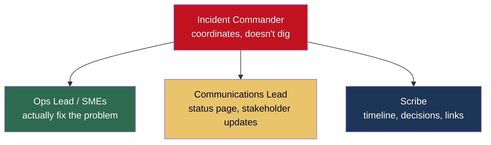

# 11.6.2 Incident Response and On-Call

**Backlinks:** [11.3.2 — SLIs, SLOs, Alerting](../Subchapter_11.3/11.3.2_SLIs_SLOs_and_Alerting_Philosophy.md) · [11.2.1 — Secrets Management](../Subchapter_11.2/11.2.1_Secrets_Management_Deep_Dive.md) · [10.2 ArgoCD Rollbacks](../../10-GitOps-ArgoCD/Subchapter_10.2/)

**Previous note:** [11.6.1 — Data Formats and Serialization](11.6.1_Data_Formats_and_Serialization.md)

---

## Why This Note Exists

At some point, something you own will break in production.

- A deploy will bring down checkout for 11 minutes
- The DB will run out of disk at 2:47am on a Sunday
- A vendor will have a global outage and every service that depends on them will start throwing 5xx

How you **respond** in the first 30 minutes — and how you **follow up** in the next 30 days — separates teams that improve from teams that repeat the same incident three times.

This note gives you:

- A practical incident response playbook
- A blameless postmortem template
- An on-call rotation structure that doesn't burn people out
- Runbook patterns that actually help

> **One-line rule:** the incident is not the failure — the failure is not learning from the incident.

---

## Part 1: Severity — Know What You're Dealing With

Not every issue is a P1. A shared severity taxonomy saves minutes of "wait, how bad is this?"

| Severity | Criteria | Response |
|---|---|---|
| **SEV-1** | Complete outage or data loss affecting all users; security breach | All hands, incident channel, exec comms, 24/7 response |
| **SEV-2** | Major degradation affecting many users; critical feature broken | On-call + backup, hourly updates, business-hours response OK if no customer impact overnight |
| **SEV-3** | Minor degradation; workaround exists; non-critical feature | Handled by on-call during business hours |
| **SEV-4** | Cosmetic / internal-only | Normal ticket |

**Declaring higher is always OK.** You can always downgrade later. Underreacting is worse than overreacting.

### Automatic declaration

Tie severity to **SLO burn rate** ([11.3.2](../Subchapter_11.3/11.3.2_SLIs_SLOs_and_Alerting_Philosophy.md)) where possible. "Burn rate > 14× over 5m" → auto-declare SEV-2.

---

## Part 2: The First 30 Minutes — Incident Command

When a SEV-1/2 is declared, roles are assigned immediately:



### The Incident Commander (IC)

The IC's job is **to coordinate, not to debug**. Specifically:

- Assign roles
- Keep a running list of hypotheses and experiments
- Make the call on rollbacks, maintenance windows, customer comms
- Time-box investigations ("give it 10 minutes, then try the rollback")
- Keep the channel focused

**Crucial rule:** the best engineer is often the worst IC. They want to dig in, which is exactly what the IC cannot do. Assign a separate IC.

### Incident channel

Open a dedicated Slack channel the moment SEV is declared: `#inc-2025-04-24-checkout-5xx`.

```
[12:04] IC: Declaring SEV-2. Checkout error rate 5%, climbing.
[12:04] IC: @alice ops lead, @bob comms, @charlie scribe.
[12:05] alice: looking at payments-svc, CPU is pinned.
[12:06] alice: recent deploy payments-svc v4.1.0 at 11:58.
[12:07] IC: Rolling back payments-svc to v4.0.12. ETA 2min.
[12:09] alice: rollback applied.
[12:11] IC: error rate dropping. 2%.
[12:13] alice: back to baseline 0.1%.
[12:13] IC: customer-visible mitigation done. Keep channel open for root cause.
[12:14] bob: status page updated to "monitoring".
```

Every message is timestamped, in writing, and becomes the raw material for the postmortem.

---

## Part 3: The Five Priorities, In Order

During the incident:

1. **Stop the bleeding.** Rollback first, debug later.
2. **Communicate.** Status page, customer comms, stakeholders.
3. **Mitigate.** Get back to "degraded but working".
4. **Diagnose.** Find the root cause once impact is contained.
5. **Document.** Scribe's timeline → postmortem.

**Resist the urge to skip #1.** A 2-minute rollback that loses the latest feature is better than a 45-minute debug while users suffer.

---

## Part 4: Runbooks — The Document That Saves The Night

A **runbook** is the instructions for one specific alert.

**What makes a good runbook:**

- Linked directly from the alert
- Steps are **copy-pasteable commands**, not prose
- Includes "if this doesn't work, try X"
- Includes escalation path
- Updated after every incident

### Runbook template

```markdown
# Runbook: Checkout Error Rate High

## Alert
`ApiErrorRateHigh` firing for `service=checkout`

## What it means
Users seeing 5xx errors when attempting checkout. SLO burn rate > 14×.

## First checks (2 minutes)
1. Open dashboard: https://grafana.example.com/d/checkout
2. Recent deploy? `kubectl rollout history deployment/checkout -n prod`
3. Dependency health: check payments-svc, inventory-svc dashboards

## Common causes & fixes
| Symptom | Likely cause | Action |
|---|---|---|
| All errors 502 | checkout pod OOM | scale up replicas; `kubectl scale deploy/checkout --replicas=10` |
| Errors spike right after deploy | bad release | rollback: `kubectl rollout undo deployment/checkout -n prod` |
| Errors only from one region | partial outage | drain that region in Route53 |
| Errors all from /api/pay | payments-svc down | escalate to payments team + check their status |

## Escalation
- Primary: @oncall-platform (PagerDuty)
- If > 15 min: @oncall-platform-backup
- If > 30 min: page platform manager

## Postmortem
Template: https://wiki.example.com/postmortem-template
```

### The three kinds of runbooks you need

1. **Alert-specific** — one per pageable alert
2. **Service-specific** — "how to restart X safely", "how to drain node Y"
3. **Scenario-specific** — "region evacuation", "DB failover", "rotate leaked secret"

**Test them quarterly** via game days (Part 7).

---

## Part 5: The Postmortem — A Blameless Learning Tool

> The purpose of a postmortem is not to find who screwed up. It's to find the **systemic conditions** that made the screw-up possible, and change them.

### Why blameless?

Blameful postmortems produce **hidden incidents**. People stop reporting things. The org goes blind.

Blameless postmortems assume: if a smart, well-intentioned engineer with the training and context available made this mistake, what **system** allowed it to become an outage?

A good blameless postmortem:

- Uses passive voice or named-but-not-judged active voice: "The deploy was rolled out without canary analysis" — not "Alice forgot to canary."
- Focuses on **systems**: why was it possible to deploy without canary? How did the monitor not catch the regression?
- Produces **concrete action items** that change the system, not "be more careful."

### Postmortem template

```markdown
# Postmortem: [Short title, e.g., Checkout 5xx spike 2025-04-24]

## Summary
One paragraph. What broke, for how long, affecting whom.

## Impact
- Duration: 11 minutes (12:04 – 12:15 UTC)
- User impact: ~3,200 checkouts failed
- Revenue impact: ~$18,000 estimated
- SLO: 18% of monthly error budget consumed

## Timeline (UTC)
- 11:58 — payments-svc v4.1.0 deployed
- 12:03 — error rate starts climbing
- 12:04 — alert fires, SEV-2 declared (@ic Alice)
- 12:07 — rollback initiated
- 12:09 — rollback complete
- 12:13 — error rate back to baseline
- 12:15 — SEV resolved

## Root cause
v4.1.0 introduced a new database query for fraud scoring. The query uses a
column with no index (`transactions.customer_id_hash`), which caused sequential
scans on the 80M-row transactions table. Under load, each request took 4s,
exceeding the 3s timeout. Cascading timeouts pinned CPU and caused 502s.

## Contributing factors
- The query was added without a query plan review.
- Staging has only 50k rows in `transactions`, so the seq scan was fast there.
- The deploy skipped canary analysis (canary requires 5 minutes at 1%; feature
  was behind a flag, so the team skipped).

## What went well
- On-call noticed within 1 minute of alert.
- Rollback was fast and clean.
- Status page updated promptly.

## What went poorly
- No schema / query review in the PR process for changes touching
  high-traffic tables.
- Staging data too small to catch the regression.
- Canary was skippable.

## Action items
| # | Action | Owner | Due | Priority |
|---|---|---|---|---|
| 1 | Add index on `transactions.customer_id_hash` | alice | 2025-04-25 | P0 |
| 2 | Required query-plan review in PR template for schema/query changes to top-100 tables | bob | 2025-05-15 | P1 |
| 3 | Seed staging with production-sized data (anonymized) | charlie | 2025-06-01 | P1 |
| 4 | Canary analysis mandatory, no opt-out | diana | 2025-05-01 | P0 |
| 5 | Update runbook for checkout 5xx alert with DB query check | eve | 2025-04-28 | P2 |
```

### Rules for the postmortem meeting

- Held within a week of the incident.
- IC + SMEs + anyone interested.
- No blame, no "you should have".
- Every action item has an **owner, a due date, a priority**.
- Action items tracked in the normal ticketing system, not just the doc.

---

## Part 6: On-Call That Doesn't Burn People Out

### 6.1 The math

A 10-person team with 24/7 coverage = ~10% of someone's year on-call. That's a meaningful tax. Protect it.

### 6.2 Structure

**Primary + backup rotation.** If primary doesn't acknowledge in 5 minutes, backup is paged. If backup doesn't respond in 5, manager.

**Follow-the-sun** for larger orgs: APAC team covers 00-08 UTC, EMEA 08-16, AMER 16-00. Nobody wakes up.

**Week-on, N-weeks-off.** 1-week shifts are manageable; >2 weeks is abusive.

### 6.3 What good on-call looks like

- **< 3 pages per shift** on average. If more, fix alerting, not people.
- **Compensation.** Extra PTO, money, or comp hours. On-call is work.
- **Protected next-day.** If you were paged overnight, you don't have a 9am meeting.
- **Handoff meetings.** 15 minutes at shift change: active issues, watch items, recent postmortems.
- **Explicit escalation paths.** "If X, call Y. If still stuck after 30 min, page manager."

### 6.4 What bad on-call looks like

- Pages 5 times a night
- Same alert fires weekly with no postmortem
- People afraid to take PTO because "I'm on-call"
- No compensation for being on-call
- Managers on rotation "because I'm fair" — no, do your actual job

### 6.5 The on-call metrics to track

- **MTTR** (Mean Time To Repair) — trending down?
- **Pages per week** — trending down?
- **Actionable rate** — of pages, how many required real action? Aim > 80%.
- **Survey on-call satisfaction** quarterly. If people dread it, something is broken.

---

## Part 7: Game Days — Practice Before The Real Thing

**Game days** are planned incidents. Take a non-critical service, introduce a failure, and see what happens.

Classic scenarios:

- Kill a pod. Does the system recover?
- Drop a region. Does traffic shift?
- Force a database failover. Does the app reconnect?
- Expire a cert. Does the alert fire in time?
- Fill a disk. Does the pager ring?

**Why game day:**

- Finds gaps in runbooks **before** production does
- Trains new on-call without real stakes
- Proves the architecture actually is redundant
- Builds muscle memory

Do one a quarter. Postmortem the game day.

---

## Part 8: Communication — Status Pages and Customer Comms

### 8.1 The status page

Public status page (Statuspage, Instatus, homemade). States:
- **Operational** — green
- **Investigating** — we know something is wrong, looking
- **Identified** — we know what's wrong, fixing
- **Monitoring** — fix deployed, watching
- **Resolved**

**Update within 15 minutes of a SEV-1.** Users will find you on Twitter first if you don't.

### 8.2 Customer comms template

```
We are investigating elevated error rates on checkout.
Users may see occasional failures during purchase. Our engineers
are actively working on a fix. Next update in 15 minutes.
```

Notice:
- No jargon
- No blame / speculation
- Concrete time for next update (**and you must hit it, even if the update is "still working on it"**)

---

## Part 9: Anti-Patterns — The Ways Teams Fail at Incidents

1. **Hero culture.** One person fixes everything. They burn out. The bus factor is 1.
2. **"We don't need a postmortem, it's fixed."** Then it happens again.
3. **Action items that don't get done.** Track them like bugs; review completion rate monthly.
4. **Postmortem as punishment.** One mention of "whose fault" and the learning stops.
5. **IC debugging.** IC coordinates, SMEs dig. Mixing them fails both.
6. **No handoffs between regions/shifts.** Next team comes in blind.
7. **Runbook that says "investigate".** Not a runbook. A wish.
8. **No severity definitions.** Every page feels like SEV-1. People panic or ignore.
9. **Ignoring near-misses.** An incident that almost happened is a gift — treat it like a real one.
10. **Postmortem published, action items forgotten.** Without follow-through, it's theater.

---

## Part 10: The Professional On-Call Toolkit

On any machine you'll be on-call from, have ready:

```bash
# Cloud / K8s
kubectl, kubectx, kubens, k9s, stern
aws / gcloud / az CLI + SSO configured
cert-manager ready-made queries

# Networking
dig, host, nslookup
curl, httpie
mtr, traceroute

# Text / logs
jq, yq, fx (interactive JSON)
grep, rg (ripgrep), fzf

# Process
htop, iotop, lsof
strace, perf (Linux)

# Team
your chat client with notifications fixed
PagerDuty / Opsgenie mobile app
access to: Grafana, Datadog, GitHub, cloud console, status page
a pinned tab to every runbook
```

Practice the commands **before** you need them. Page at 3am is not the time to Google `kubectl patch`.

---

## Part 11: Psychological Safety and Recovery

Serious incidents are **emotionally expensive**. A 3-hour SEV-1 leaves people drained for days.

- **Post-incident day off** is reasonable for long / severe incidents.
- **Debrief informally** before the formal postmortem — "how was that for you?"
- **Explicitly thank** people who worked the incident.
- **Never shame in public.** Never.
- **Watch for signs of burnout**: person who always carries the pager, who stays up fixing things they could have escalated, who snaps at colleagues after an incident. Intervene.

An org where people feel safe saying "I broke this" is the org that gets better. One where they feel unsafe ships the same incident twice.

---

## Part 12: Platform Engineer's Checklist

- [ ] Severity taxonomy defined and communicated
- [ ] Incident Commander role documented; every engineer knows how to act as one
- [ ] IC is **not** the person debugging
- [ ] Dedicated incident channels (`#inc-...`) auto-created on SEV-1/2
- [ ] Public status page with clear states
- [ ] Runbook linked from every pageable alert
- [ ] Postmortem within 1 week of every SEV-1/2
- [ ] Action items tracked in ticket system with due dates + owners
- [ ] Action-item completion rate reviewed monthly
- [ ] On-call rotation ≤ 1 week; primary + backup
- [ ] On-call comp defined (PTO / $)
- [ ] < 3 pages per shift target; alert review weekly
- [ ] Quarterly game days
- [ ] Shift handoff meetings (15 min)
- [ ] On-call satisfaction survey quarterly
- [ ] Chaos / failure drills in staging monthly

---

## Recap

- **Declare early, coordinate, stop the bleeding first.** Debug second.
- **Separate IC from debugger.** They're different jobs.
- **Blameless postmortems** find systemic causes, produce concrete action items.
- **Runbooks** with copy-pasteable steps, linked from alerts, tested in game days.
- **Sustainable on-call** — ≤ 3 pages/shift, compensated, primary+backup, ≤ 1-week rotations.
- **Incidents are learning events.** The org that learns is the org that stops repeating.

---

## Playbook Complete

**Congratulations.** You've reached the end of Module 11, and with it, the end of the Platform Engineering Playbook.

Modules 1–10 gave you the **tools**: Linux, networking, shell, containers, Kubernetes, Git, nginx, CI/CD, Python, GitOps.

Module 11 gave you the **glue**: how to design APIs, how to handle secrets, how to measure and alert, how to think about databases and queues, how to operate in the cloud, and how to handle the moments that really matter.

The work of a platform engineer is never really finished — technologies shift, stacks evolve, new tools arrive. But **the patterns in this playbook are durable**. Whatever you pick up next, you'll recognize the shapes: a controller reconciling desired state, an at-least-once message needing idempotency, a cert approaching expiry, a burn rate crossing 14×.

Go build something good. And when it breaks at 3am, you'll know exactly what to do.
