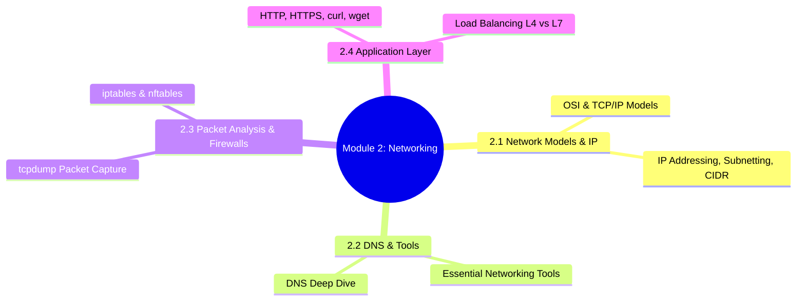
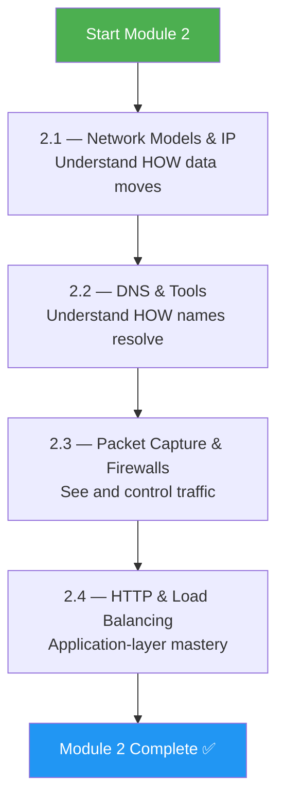
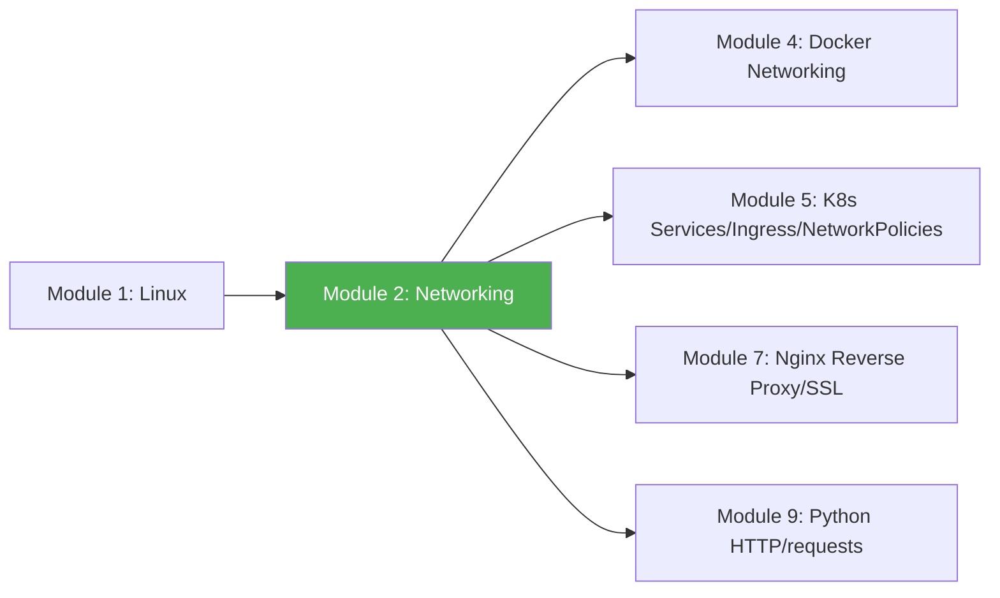

# Module 2 Approach Guide — Networking Fundamentals

## Module Overview

---

## Who Is This Module For?

Networking is the **invisible backbone** of every system you'll manage. Pods can't talk to each other, deployments fail silently, and services become unreachable — all because of networking. This module makes the invisible visible.

**Target audience:**
- DevOps engineers who "get by" with networking but lack deep understanding
- Anyone who panics when `curl` returns a timeout and doesn't know where to look
- Platform engineers building service meshes, ingress controllers, or VPN tunnels

---

## Prerequisites

| Prerequisite | Required? | Notes |
|---|---|---|
| Module 1 (Linux) completed | **Yes** | You'll use `ip`, `ss`, `grep`, `systemctl` constantly |
| A Linux machine with root access | **Yes** | Needed for `tcpdump`, `iptables`, packet captures |
| Basic understanding of what IP addresses are | Helpful | Covered from scratch but prior exposure helps |

---

## How to Approach This Module

### Study Strategy

1. **Master the OSI model first** — Everything else hangs on knowing which layer you're debugging.
2. **Practice subnetting by hand** — Do 20 CIDR calculations on paper before using a calculator.
3. **Run tcpdump on every exercise** — Seeing packets in real-time builds intuition faster than reading.
4. **Build a mental troubleshooting ladder:** DNS → Routing → Firewall → Application.
5. **Use `curl -v` on everything** — The verbose output teaches you more than any textbook.

---

## Time Estimates

| Subchapter | Reading | Practice | Total |
|---|---|---|---|
| 2.1 Network Models & IP | 2 hrs | 2 hrs | **4 hrs** |
| 2.2 DNS & Tools | 2 hrs | 2 hrs | **4 hrs** |
| 2.3 Packet Capture & Firewalls | 2 hrs | 3 hrs | **5 hrs** |
| 2.4 HTTP & Load Balancing | 2 hrs | 2 hrs | **4 hrs** |
| **Total** | **8 hrs** | **9 hrs** | **~17 hrs** |

> **Realistic timeline:** 1–1.5 weeks at 2–3 hours/day.

---

## Practice Lab Ideas

| Lab | Covers Subchapters | Difficulty |
|---|---|---|
| Calculate the subnet, broadcast, and usable range for 10 different CIDR blocks by hand | 2.1 | ⭐⭐ |
| Set up a local DNS resolver (dnsmasq) and trace resolution with `dig +trace` | 2.2 | ⭐⭐⭐ |
| Capture a full TCP handshake + HTTP request with `tcpdump`, analyze in Wireshark | 2.3 | ⭐⭐⭐ |
| Write iptables rules that allow SSH + HTTP but block everything else, then test | 2.3 | ⭐⭐⭐ |
| Set up two Nginx backends behind a Layer 7 load balancer with health checks | 2.4 | ⭐⭐⭐⭐ |

---

## What Success Looks Like

By the end of Module 2, you should be able to:

- [ ] Draw the OSI model from memory and map real tools to each layer
- [ ] Subnet a /22 into /26s without a calculator
- [ ] Trace DNS resolution from stub resolver to authoritative nameserver
- [ ] Use `tcpdump` to capture and filter specific traffic patterns
- [ ] Write iptables/nftables rules for a production firewall
- [ ] Explain the difference between L4 and L7 load balancing with examples
- [ ] Debug a "connection refused" vs "connection timed out" vs "name resolution failed"

---

## Connection to Other Modules

**Docker networking** (Module 4) is Linux networking inside namespaces. **Kubernetes Services and Ingress** (Module 5) are L4/L7 load balancing in a cluster. **Nginx** (Module 7) does SSL termination and reverse proxying — everything from 2.4. **Python requests** (Module 9) sends HTTP traffic you'll debug with tcpdump.

> **Next module:** [Module 3 — Shell Scripting](../3-Shell-Scripting/Module_3_Approach_Guide.md)
