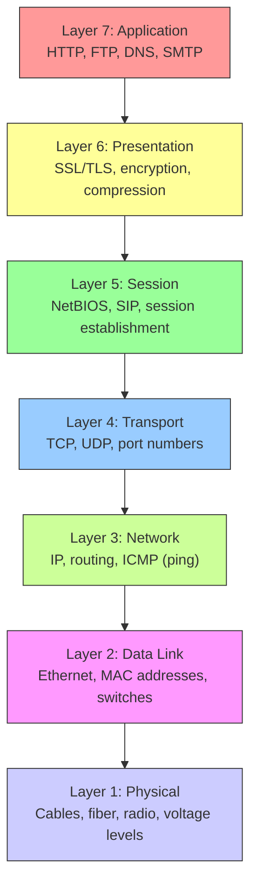
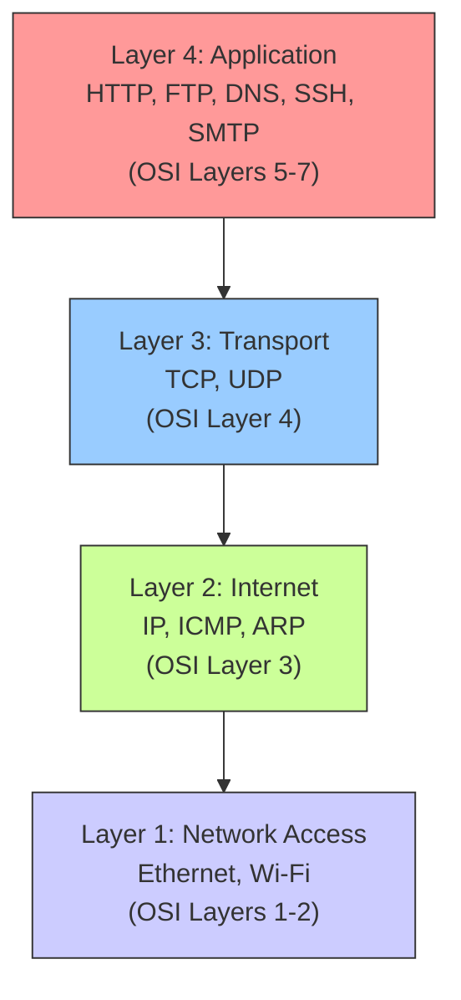
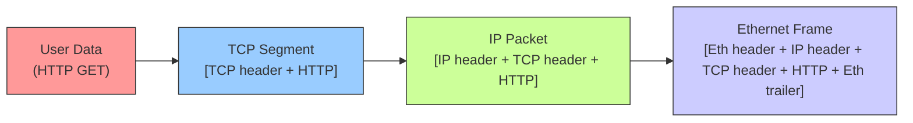

## 2.1.1 OSI and TCP/IP Models: The Blueprint of Network Communication

#### Why Networking Models Matter

When a packet fails to reach its destination, you need to know **which layer** to investigate. Is it a physical cable issue (Layer 1)? An IP routing problem (Layer 3)? A firewall blocking a port (Layer 4)? An application misconfiguration (Layer 7)?

The OSI and TCP/IP models provide a mental framework for:

* Isolating network problems systematically

* Understanding how protocols interact (Ethernet → IP → TCP → HTTP)

* Communicating with network engineers and SREs

This note covers both models. Note 2.1.2 covers IP addressing and subnetting. Note 2.1.3 is the subchapter review.

***

## Part 1: The OSI 7-Layer Model (Conceptual)

The OSI (Open Systems Interconnection) model is a theoretical framework. You will rarely encounter it directly, but it helps you think about networking.



### OSI Layer Functions and Examples

| Layer | Name         | Function                               | Protocol Examples           | Device Examples           |
| ----- | ------------ | -------------------------------------- | --------------------------- | ------------------------- |
| 7     | Application  | User-facing services                   | HTTP, HTTPS, SSH, DNS, SMTP | Web browser, email client |
| 6     | Presentation | Data format, encryption, compression   | SSL/TLS, JPEG, ASCII        | Encryption gateway        |
| 5     | Session      | Manage conversation (start/stop)       | NetBIOS, RPC, SIP           | Operating system          |
| 4     | Transport    | Reliable delivery, ports, segmentation | TCP, UDP                    | Firewall (port filtering) |
| 3     | Network      | Routing, logical addressing            | IP, ICMP (ping), ARP        | Router, layer 3 switch    |
| 2     | Data Link    | Physical addressing, error detection   | Ethernet, Wi-Fi (802.11)    | Switch, bridge, NIC       |
| 1     | Physical     | Raw bit transmission                   | Cables, radio, voltage      | Hub, repeater, cable      |

### Troubleshooting by OSI Layer

| Symptom                                | Likely Layer          | Tool/Check                                    |
| -------------------------------------- | --------------------- | --------------------------------------------- |
| No link light on NIC                   | Layer 1 (Physical)    | Check cable, plug into another port           |
| "Destination Host Unreachable"         | Layer 3 (Network)     | `ping`, `traceroute`, check routing table     |
| Connection refused on port 80          | Layer 4 (Transport)   | `telnet host 80`, check firewall (`iptables`) |
| SSH connects but authentication fails  | Layer 7 (Application) | Check `sshd_config`, `~/.ssh/authorized_keys` |
| Web page loads slowly but consistently | Layer 4 (TCP window)  | `tcpdump` analyze TCP handshake               |
| DNS resolves but ping fails            | Layer 3/4 combo       | `dig`, then `ping` to IP                      |

### The "All People Seem To Need Data Processing" Mnemonic

* **Layer 7: A**pplication

* **Layer 6: P**resentation

* **Layer 5: S**ession

* **Layer 4: T**ransport

* **Layer 3: N**etwork

* **Layer 2: D**ata Link

* **Layer 1: P**hysical

***

## Part 2: The TCP/IP 4-Layer Model (Practical)

The TCP/IP model is what the internet actually uses. It condenses OSI's 7 layers into 4.



### TCP/IP Layer Functions

| Layer | Name           | Function              | Protocols            | PDU (Protocol Data Unit)       |
| ----- | -------------- | --------------------- | -------------------- | ------------------------------ |
| 4     | Application    | User processes        | HTTP, DNS, SSH, SMTP | Data / Message                 |
| 3     | Transport      | Ports, reliability    | TCP, UDP             | Segment (TCP) / Datagram (UDP) |
| 2     | Internet       | Routing, addressing   | IP, ICMP, ARP        | Packet                         |
| 1     | Network Access | Physical transmission | Ethernet, 802.11     | Frame                          |

***

## Part 3: Encapsulation – How Data Travels

When you send a web request, each layer wraps the previous layer's data with its own header.



### Encapsulation Example: Loading a Web Page

| Step | Layer                 | Action                     | What Happens                               |
| ---- | --------------------- | -------------------------- | ------------------------------------------ |
| 1    | Application (Layer 7) | Browser generates HTTP GET | `GET /index.html HTTP/1.1`                 |
| 2    | Transport (Layer 4)   | TCP wraps HTTP             | Adds source/destination ports (random, 80) |
| 3    | Network (Layer 3)     | IP wraps TCP               | Adds source/destination IP addresses       |
| 4    | Data Link (Layer 2)   | Ethernet wraps IP          | Adds source/destination MAC addresses      |
| 5    | Physical (Layer 1)    | Bits on wire               | Electrical signals / light pulses          |

### De-encapsulation (Receiving Side)

The receiving device strips headers in reverse order:

1. Ethernet header → check destination MAC
2. IP header → check destination IP, route if needed
3. TCP header → send to correct port (e.g., port 80 for web server)
4. Application → web server processes HTTP request

***

## Part 4: Key Protocols by Layer (Platform Engineer Focus)

### Application Layer (Layer 7 / TCP/IP Layer 4)

| Protocol | Port  | Purpose                  | When You Use It          |
| -------- | ----- | ------------------------ | ------------------------ |
| HTTP     | 80    | Web traffic (plain text) | Browsing non-HTTPS sites |
| HTTPS    | 443   | Encrypted web traffic    | Most modern web browsing |
| SSH      | 22    | Secure remote shell      | `ssh user@host`          |
| DNS      | 53    | Name resolution          | `dig google.com`         |
| DHCP     | 67/68 | Automatic IP assignment  | Connecting to Wi-Fi      |
| NTP      | 123   | Time synchronization     | `ntpdate`, `chronyd`     |

### Transport Layer (Layer 4)

| Protocol | Characteristics                                               | Use Case                          |
| -------- | ------------------------------------------------------------- | --------------------------------- |
| **TCP**  | Connection-oriented, reliable, ordered, error-checked, slower | HTTP, HTTPS, SSH, SMTP, databases |
| **UDP**  | Connectionless, unreliable, unordered, faster                 | DNS, streaming, VoIP, gaming      |

**Key difference:** TCP guarantees delivery (like registered mail). UDP sends and hopes (like a postcard).

### Network Layer (Layer 3)

| Protocol | Purpose                                           |
| -------- | ------------------------------------------------- |
| **IPv4** | 32-bit addresses (e.g., `192.168.1.1`)            |
| **IPv6** | 128-bit addresses (e.g., `2001:db8::1`)           |
| **ICMP** | Ping, traceroute, error reporting                 |
| **ARP**  | Resolves IP to MAC address (within local network) |

### Data Link Layer (Layer 2)

| Protocol           | Purpose                        |
| ------------------ | ------------------------------ |
| **Ethernet**       | Most common wired LAN standard |
| **Wi-Fi (802.11)** | Wireless LAN                   |
| **ARP**            | IP → MAC resolution            |

***

## Part 5: Practical Mapping – Commands and Their Layers

| Command            | Primary OSI Layer     | What It Tests                   |
| ------------------ | --------------------- | ------------------------------- |
| `ping`             | Layer 3 (Network)     | ICMP echo – host reachability   |
| `traceroute`       | Layer 3 (Network)     | Path to destination, hop-by-hop |
| `telnet host port` | Layer 4 (Transport)   | Port reachability (TCP)         |
| `nc -uz host port` | Layer 4 (Transport)   | Port reachability (UDP)         |
| `curl`             | Layer 7 (Application) | HTTP/HTTPS response             |
| `dig`              | Layer 7 (Application) | DNS resolution                  |
| `tcpdump`          | Layer 2-7             | Packet capture and analysis     |
| `arp -a`           | Layer 2 (Data Link)   | MAC address cache               |

```bash
# Example: Diagnose web server failure
# Layer 3: Is the host reachable?
ping 192.168.1.100

# Layer 4: Is port 80 open?
telnet 192.168.1.100 80
# or
nc -zv 192.168.1.100 80

# Layer 7: Is the web server responding correctly?
curl -I http://192.168.1.100
```

***

## Part 6: Common Port Numbers to Memorize

| Port  | Protocol | Service                   |
| ----- | -------- | ------------------------- |
| 20,21 | TCP      | FTP                       |
| 22    | TCP      | SSH                       |
| 23    | TCP      | Telnet (insecure – avoid) |
| 25    | TCP      | SMTP (email)              |
| 53    | TCP/UDP  | DNS                       |
| 67,68 | UDP      | DHCP                      |
| 80    | TCP      | HTTP                      |
| 110   | TCP      | POP3 (email)              |
| 123   | UDP      | NTP                       |
| 143   | TCP      | IMAP (email)              |
| 161   | UDP      | SNMP (monitoring)         |
| 194   | TCP/UDP  | IRC                       |
| 443   | TCP      | HTTPS                     |
| 465   | TCP      | SMTPS (SMTP over SSL)     |
| 993   | TCP      | IMAPS (IMAP over SSL)     |
| 995   | TCP      | POP3S (POP3 over SSL)     |
| 3306  | TCP      | MySQL                     |
| 5432  | TCP      | PostgreSQL                |
| 6379  | TCP      | Redis                     |
| 27017 | TCP      | MongoDB                   |

**Quick reference command:**

```bash
# See all services with their ports
cat /etc/services | grep -E "^(ssh|http|https|mysql|postgres)" | head -10
```

***

## Quick Task: Layer Identification

*Classify each scenario by OSI layer and suggest a diagnostic command.*

1. You can ping a server but cannot SSH to it.
2. A web page loads extremely slowly, but other sites load fine.
3. `curl` returns "Connection refused".
4. `dig google.com` returns no answer, but `ping 8.8.8.8` works.

> **Ready Solution:**
>
> | Scenario                    | Layer                        | Diagnostic Command                                       |
> | --------------------------- | ---------------------------- | -------------------------------------------------------- |
> | 1. Ping works, SSH fails    | Layer 4 (port 22)            | `telnet server 22` or `nc -zv server 22`                 |
> | 2. Slow web page            | Layer 7 (HTTP) + Layer 4     | `curl -w "@curl-format.txt" -o /dev/null -s http://site` |
> | 3. Connection refused       | Layer 4 (port not listening) | `ss -tlnp \| grep :port` on server                       |
> | 4. DNS fails, IP ping works | Layer 7 (DNS)                | `dig google.com`, check `/etc/resolv.conf`               |

***

## Summary Table: OSI vs TCP/IP

| OSI Layer                                | TCP/IP Layer       | Example Protocols    | PDU              |
| ---------------------------------------- | ------------------ | -------------------- | ---------------- |
| 7-5 (Application, Presentation, Session) | 4 (Application)    | HTTP, DNS, SSH, SMTP | Data             |
| 4 (Transport)                            | 3 (Transport)      | TCP, UDP             | Segment/Datagram |
| 3 (Network)                              | 2 (Internet)       | IP, ICMP, ARP        | Packet           |
| 2-1 (Data Link, Physical)                | 1 (Network Access) | Ethernet, Wi-Fi      | Frame            |

### When to Use Each Model

| Model  | Use Case                                                      |
| ------ | ------------------------------------------------------------- |
| OSI    | Learning, certification exams (CCNA), theoretical discussions |
| TCP/IP | Real-world troubleshooting, internet architecture             |

***

**Next note (2.1.2)** will cover **IP Addressing, Subnetting, and CIDR** – understanding IPv4 addresses, subnet masks, network classes, and CIDR notation.

---

## Backlinks

- [1.1.3 CLI Fundamentals](../../1-Linux/Subchapter_1.1/1.1.3_CLI_Fundamentals_and_Bash_Basics.md) – Command-line basics (`ping`, `telnet`, `nc`)
- [1.6.1 Process Lifecycle](../../1-Linux/Subchapter_1.6/1.6.1_Process_Lifecycle_and_Tools.md) – Process management and checking ports with `ss`/`netstat`
- **Next:** [2.1.2 IP Addressing](./2.1.2_IP_Addressing_Subnetting_CIDR.md)
