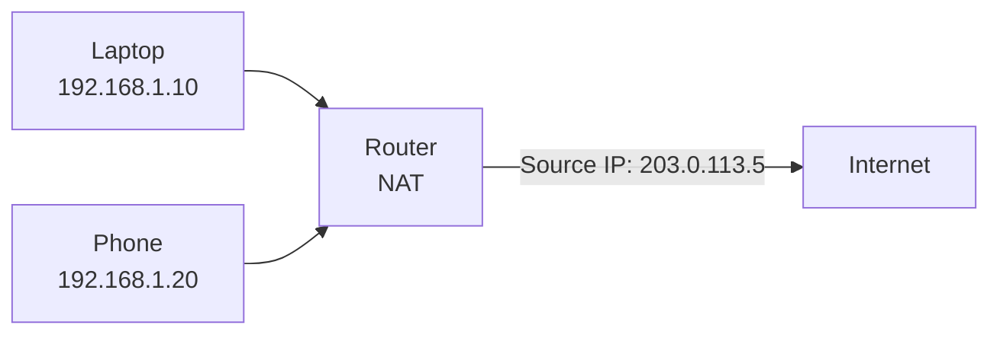

## 2.1.2 IP Addressing, Subnetting, and CIDR: The Language of Networks

#### Why IP Addressing Matters

Every device on a network needs a unique identifier – its IP address. Understanding IP addressing allows you to:

* Design and troubleshoot network layouts (VPCs in AWS, subnets in Kubernetes)

* Diagnose "no route to host" and "network unreachable" errors

* Configure firewalls and routing tables correctly

* Understand how your cloud provider assigns IPs (public vs private, Elastic IPs)

This note covers IPv4 (still dominant) with an introduction to IPv6. Note 2.1.1 covered OSI layers; note 2.1.3 is the subchapter review.

***

## Part 1: IPv4 Address Structure

An IPv4 address is a **32-bit** number, usually written as 4 decimal octets separated by dots.

```
192.168.1.1
│   │   │ │
│   │   │ └─── Last octet (host portion)
│   │   └───── Third octet
│   └───────── Second octet
└───────────── First octet (network portion)
```

### Binary Representation

Every platform engineer should understand the binary behind IP addresses.

| Decimal | Binary   |
| ------- | -------- |
| 192     | 11000000 |
| 168     | 10101000 |
| 1       | 00000001 |
| 1       | 00000001 |

**Full 32-bit:** `11000000.10101000.00000001.00000001`

```bash
# Convert decimal to binary (using command line)
printf "%08d\n" $(echo "obase=2; 192" | bc)
# 11000000

# Or using Python
python3 -c "print(bin(192))"
# 0b11000000
```

### Network vs Host Portion

Every IP address has two parts:

* **Network portion** – Identifies the network (same for all devices in that network)

* **Host portion** – Identifies the specific device on that network

The **subnet mask** determines where the split occurs.

***

## Part 2: Subnet Masks

A subnet mask is a 32-bit number where:

* `1` bits = network portion

* `0` bits = host portion

### Common Subnet Masks

| CIDR | Subnet Mask     | Binary                              | Number of Hosts | Use Case                     |
| ---- | --------------- | ----------------------------------- | --------------- | ---------------------------- |
| /8   | 255.0.0.0       | 11111111.00000000.00000000.00000000 | 16,777,214      | Large networks               |
| /16  | 255.255.0.0     | 11111111.11111111.00000000.00000000 | 65,534          | Medium networks              |
| /24  | 255.255.255.0   | 11111111.11111111.11111111.00000000 | 254             | Small networks (most common) |
| /28  | 255.255.255.240 | 11111111.11111111.11111111.11110000 | 14              | Very small (AWS subnets)     |
| /32  | 255.255.255.255 | 11111111.11111111.11111111.11111111 | 1               | Single host (loopback)       |

### Calculating Network Address

**Rule:** Network address = IP address **AND** subnet mask (bitwise AND)

```
IP:       192.168.1.100  = 11000000.10101000.00000001.01100100
Mask:     255.255.255.0  = 11111111.11111111.11111111.00000000
AND:      192.168.1.0    = 11000000.10101000.00000001.00000000
```

```bash
# Using `ipcalc` (install if needed)
ipcalc 192.168.1.100/24

# Output:
# Address:   192.168.1.100
# Netmask:   255.255.255.0 = 24
# Network:   192.168.1.0/24
# HostMin:   192.168.1.1
# HostMax:   192.168.1.254
# Broadcast: 192.168.1.255
```

***

## Part 3: CIDR Notation (Classless Inter-Domain Routing)

CIDR replaces the old classful system (Class A, B, C). It's written as `IP/prefix_length`.

```
192.168.1.0/24
          │
          └─── Prefix length = number of network bits
```

### CIDR to Subnet Mask Quick Reference

| CIDR | Subnet Mask     | Total IPs  | Usable IPs               |
| ---- | --------------- | ---------- | ------------------------ |
| /32  | 255.255.255.255 | 1          | 1                        |
| /31  | 255.255.255.254 | 2          | 2 (point-to-point links) |
| /30  | 255.255.255.252 | 4          | 2                        |
| /29  | 255.255.255.248 | 8          | 6                        |
| /28  | 255.255.255.240 | 16         | 14                       |
| /27  | 255.255.255.224 | 32         | 30                       |
| /26  | 255.255.255.192 | 64         | 62                       |
| /25  | 255.255.255.128 | 128        | 126                      |
| /24  | 255.255.255.0   | 256        | 254                      |
| /23  | 255.255.254.0   | 512        | 510                      |
| /22  | 255.255.252.0   | 1024       | 1022                     |
| /16  | 255.255.0.0     | 65,536     | 65,534                   |
| /8   | 255.0.0.0       | 16,777,216 | 16,777,214               |

**Formula:** Usable IPs = 2^(32 - prefix) - 2 (network + broadcast)

Example: /24 → 2^(32-24) = 2^8 = 256 total, minus 2 = 254 usable.

***

## Part 4: Special IPv4 Address Ranges

### Private IP Addresses (RFC 1918)

These are not routable on the public internet. Used for internal networks, VPCs, NAT.

| Range                         | CIDR           | Number of IPs | Typical Use                               |
| ----------------------------- | -------------- | ------------- | ----------------------------------------- |
| 10.0.0.0 – 10.255.255.255     | 10.0.0.0/8     | 16,777,216    | Large corporate networks, AWS VPC default |
| 172.16.0.0 – 172.31.255.255   | 172.16.0.0/12  | 1,048,576     | Medium networks                           |
| 192.168.0.0 – 192.168.255.255 | 192.168.0.0/16 | 65,536        | Home networks, small offices              |

### Loopback (localhost)

| Address     | Purpose                           |
| ----------- | --------------------------------- |
| 127.0.0.0/8 | Loopback (127.0.0.1 is localhost) |
| ::1/128     | IPv6 loopback                     |

```bash
# Test loopback
ping 127.0.0.1
ping ::1
```

### Link-Local (APIPA)

| Range          | Purpose                   |
| -------------- | ------------------------- |
| 169.254.0.0/16 | Automatic when DHCP fails |

If you see a 169.254.x.x address, DHCP failed.

### Reserved and Special Addresses

| Address         | Purpose                          |
| --------------- | -------------------------------- |
| 0.0.0.0/8       | "This network" (used in routing) |
| 255.255.255.255 | Local broadcast                  |
| 224.0.0.0/4     | Multicast                        |
| 240.0.0.0/4     | Reserved for future use          |

***

## Part 5: Public vs Private IPs

| Aspect               | Private IP                   | Public IP                 |
| -------------------- | ---------------------------- | ------------------------- |
| Routable on internet | No                           | Yes                       |
| Cost                 | Free                         | Usually paid (cloud)      |
| Uniqueness           | Only within your network     | Globally unique           |
| Example              | 10.0.0.5                     | 8.8.8.8 (Google DNS)      |
| Use case             | Internal servers, containers | Web servers, NAT gateways |

### NAT (Network Address Translation)

NAT allows multiple private IPs to share a single public IP. This is how your home router lets all your devices access the internet.



***

## Part 6: IPv6 Basics (What You Need to Know)

IPv6 is 128-bit, written as 8 groups of 4 hexadecimal digits.

```
2001:0db8:85a3:0000:0000:8a2e:0370:7334
│    │    │    │    │    │    │    │
└────┴────┴────┴────┴────┴────┴────┴───── 16 bits each
```

### IPv6 Shortening Rules

1. Leading zeros can be omitted: `2001:0db8` → `2001:db8`
2. Consecutive zero groups can be replaced with `::` (once only)

```
Full:       2001:0db8:0000:0000:0000:0000:0000:0001
Shortened:  2001:db8::1
```

### Common IPv6 Addresses

| Address   | Purpose                               |
| --------- | ------------------------------------- |
| ::1/128   | Loopback (localhost)                  |
| ::/0      | Default route                         |
| fe80::/10 | Link-local (similar to 169.254.x.x)   |
| 2000::/3  | Global unicast (public)               |
| fc00::/7  | Unique local (private, like RFC 1918) |

### Checking IPv6 Configuration

```bash
# Show IPv6 addresses
ip -6 addr show
ip addr show | grep inet6

# Ping IPv6
ping6 google.com
ping6 2001:4860:4860::8888

# Test IPv6 connectivity
curl -6 https://ipv6.google.com
```

***

## Part 7: Subnetting Practice

### Example 1: Divide 192.168.1.0/24 into 4 equal subnets

| Subnet | Network Address  | Host Range                    | Broadcast     |
| ------ | ---------------- | ----------------------------- | ------------- |
| 1      | 192.168.1.0/26   | 192.168.1.1 – 192.168.1.62    | 192.168.1.63  |
| 2      | 192.168.1.64/26  | 192.168.1.65 – 192.168.1.126  | 192.168.1.127 |
| 3      | 192.168.1.128/26 | 192.168.1.129 – 192.168.1.190 | 192.168.1.191 |
| 4      | 192.168.1.192/26 | 192.168.1.193 – 192.168.1.254 | 192.168.1.255 |

**Calculation:** 4 subnets → need 2 bits (2^2 = 4) → /24 + 2 = /26

### Example 2: AWS VPC Subnet Design

Typical AWS VPC: `10.0.0.0/16` (65,536 IPs)

| Subnet            | CIDR         | Usable IPs | Use                          |
| ----------------- | ------------ | ---------- | ---------------------------- |
| Public Subnet 1   | 10.0.1.0/24  | 251        | Load balancers, NAT gateways |
| Public Subnet 2   | 10.0.2.0/24  | 251        | Load balancers (AZ 2)        |
| Private Subnet 1  | 10.0.10.0/23 | 509        | Application servers          |
| Private Subnet 2  | 10.0.12.0/23 | 509        | Application servers (AZ 2)   |
| Database Subnet 1 | 10.0.20.0/24 | 251        | RDS, ElastiCache             |
| Database Subnet 2 | 10.0.21.0/24 | 251        | RDS (standby)                |

***

## Part 8: Essential IP Commands

### Viewing IP Configuration

```bash
# Modern method (recommended)
ip addr show
ip a

# Legacy method (deprecated but common)
ifconfig -a

# Show only IPv4 addresses
ip -4 addr show

# Show only IPv6 addresses
ip -6 addr show

# Show routing table
ip route show
route -n   # legacy
```

### Checking Connectivity

```bash
# Ping (ICMP echo)
ping 8.8.8.8
ping -c 4 google.com

# Ping with specific source interface
ping -I eth0 8.8.8.8

# Trace route (hops)
traceroute google.com
mtr google.com   # combines ping + traceroute

# Show ARP cache (IP to MAC mapping)
arp -a
ip neigh   # modern
```

### Manipulating IP Addresses (Temporary)

```bash
# Add an IP address
sudo ip addr add 192.168.100.10/24 dev eth0

# Remove an IP address
sudo ip addr del 192.168.100.10/24 dev eth0

# Bring interface up/down
sudo ip link set eth0 up
sudo ip link set eth0 down
```

***

## Quick Task: Subnetting Practice

*Calculate the following without using a calculator (then verify with* *`ipcalc`).*

1. What is the network address for `10.50.100.25/24`?
2. How many usable IPs in `172.16.0.0/20`?
3. What CIDR notation gives 30 usable IPs?
4. Is `192.168.1.255/24` a valid host IP?
5. What is the broadcast address for `10.0.0.0/22`?

> **Ready Solution:**
>
> 1. `10.50.100.0/24` (last octet becomes 0)
> 2. 2^(32-20) = 2^12 = 4096 total, minus 2 = **4094 usable**
> 3. /27 (2^(32-27) = 32 total, 30 usable)
> 4. No – in /24, .255 is the broadcast address, not a host
> 5. 10.0.3.255 (/22 = 255.255.252.0, so 10.0.0.0 to 10.0.3.255)

***

## Summary Table: IP Addressing Reference

| Concept           | Notation         | Example         |
| ----------------- | ---------------- | --------------- |
| IPv4 address      | 4 octets         | `192.168.1.1`   |
| Subnet mask       | 4 octets         | `255.255.255.0` |
| CIDR              | /prefix          | `/24`           |
| Network address   | IP & mask        | `192.168.1.0`   |
| Broadcast         | Network + \~mask | `192.168.1.255` |
| First usable host | Network + 1      | `192.168.1.1`   |
| Last usable host  | Broadcast - 1    | `192.168.1.254` |

### Private IP Ranges (RFC 1918)

| Range                         | CIDR           |
| ----------------------------- | -------------- |
| 10.0.0.0 – 10.255.255.255     | 10.0.0.0/8     |
| 172.16.0.0 – 172.31.255.255   | 172.16.0.0/12  |
| 192.168.0.0 – 192.168.255.255 | 192.168.0.0/16 |

### Essential IP Commands

| Command           | Purpose               |
| ----------------- | --------------------- |
| `ip addr show`    | Show IP addresses     |
| `ip route show`   | Show routing table    |
| `ping host`       | Test connectivity     |
| `traceroute host` | Show path to host     |
| `mtr host`        | Continuous traceroute |
| `arp -a`          | Show ARP cache        |

***

**Next note (2.1.3)** will be the Subchapter Review for Networking Fundamentals, including a cheatsheet and scenario-based interview questions covering OSI layers, IP addressing, and subnetting.

**Backward references:**

* Command-line basics from Module 1 (using `ip`, `ping`, `traceroute`)

* The `/proc` filesystem from Module 1 (network configuration is also in `/proc/sys/net/`)
