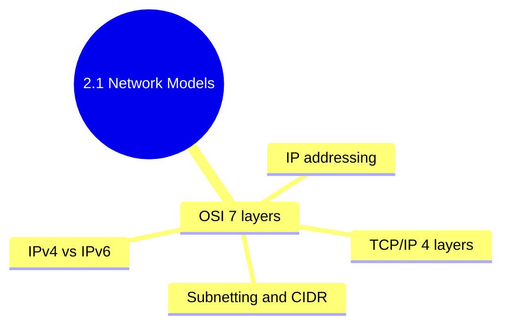

## 2.1.3 Subchapter Review: Cheatsheet and Interview Prep

This review covers only the material presented in Notes 2.1.1 (OSI and TCP/IP Models) and 2.1.2 (IP Addressing, Subnetting, and CIDR). No forward referencing beyond what was explicitly introduced.




***

## Cheatsheet: Networking Fundamentals

### OSI 7-Layer Model (Conceptual)

| Layer | Name         | Function                 | Protocols      | PDUs             |
| ----- | ------------ | ------------------------ | -------------- | ---------------- |
| 7     | Application  | User-facing services     | HTTP, DNS, SSH | Data             |
| 6     | Presentation | Encryption, compression  | SSL/TLS        | Data             |
| 5     | Session      | Manage conversation      | NetBIOS, SIP   | Data             |
| 4     | Transport    | Ports, reliability       | TCP, UDP       | Segment/Datagram |
| 3     | Network      | Routing, addressing      | IP, ICMP       | Packet           |
| 2     | Data Link    | MAC addresses, switching | Ethernet       | Frame            |
| 1     | Physical     | Raw bits, cables         | –              | Bits             |

**Mnemonic:** **A**ll **P**eople **S**eem **T**o **N**eed **D**ata **P**rocessing

### TCP/IP 4-Layer Model (Practical)

| Layer | Name           | Protocols            | OSI Equivalent |
| ----- | -------------- | -------------------- | -------------- |
| 4     | Application    | HTTP, DNS, SSH, SMTP | Layers 5-7     |
| 3     | Transport      | TCP, UDP             | Layer 4        |
| 2     | Internet       | IP, ICMP, ARP        | Layer 3        |
| 1     | Network Access | Ethernet, Wi-Fi      | Layers 1-2     |

### Encapsulation (Sending Data)

```
User Data (HTTP GET)
    ↓
[TCP Header + HTTP] → Segment
    ↓
[IP Header + TCP + HTTP] → Packet
    ↓
[Ethernet Header + IP + TCP + HTTP + Trailer] → Frame
    ↓
Bits on wire
```

### TCP vs UDP

| Feature     | TCP                             | UDP                  |
| ----------- | ------------------------------- | -------------------- |
| Connection  | Connection-oriented             | Connectionless       |
| Reliability | Yes (ACK, retransmit)           | No                   |
| Ordering    | Yes                             | No                   |
| Speed       | Slower                          | Faster               |
| Ports       | 20,21,22,23,25,80,443,3306,5432 | 53,67,68,123,161     |
| Use cases   | HTTP, SSH, databases            | DNS, streaming, VoIP |

### Common Ports (Memorize These)

| Port | Protocol | Service    |
| ---- | -------- | ---------- |
| 22   | TCP      | SSH        |
| 53   | TCP/UDP  | DNS        |
| 80   | TCP      | HTTP       |
| 443  | TCP      | HTTPS      |
| 3306 | TCP      | MySQL      |
| 5432 | TCP      | PostgreSQL |

### IPv4 Addressing

| Aspect          | Value            |
| --------------- | ---------------- |
| Bits            | 32               |
| Format          | 4 octets (0-255) |
| Example         | `192.168.1.1`    |
| Total addresses | \~4.3 billion    |

### Subnet Mask and CIDR

| CIDR | Subnet Mask     | Total IPs  | Usable IPs |
| ---- | --------------- | ---------- | ---------- |
| /8   | 255.0.0.0       | 16,777,216 | 16,777,214 |
| /16  | 255.255.0.0     | 65,536     | 65,534     |
| /24  | 255.255.255.0   | 256        | 254        |
| /28  | 255.255.255.240 | 16         | 14         |
| /30  | 255.255.255.252 | 4          | 2          |
| /32  | 255.255.255.255 | 1          | 1          |

### Private IP Ranges (RFC 1918)

| Range                         | CIDR           | Use                 |
| ----------------------------- | -------------- | ------------------- |
| 10.0.0.0 – 10.255.255.255     | 10.0.0.0/8     | Large networks      |
| 172.16.0.0 – 172.31.255.255   | 172.16.0.0/12  | Medium networks     |
| 192.168.0.0 – 192.168.255.255 | 192.168.0.0/16 | Small/home networks |

### Special Addresses

| Address         | Purpose                   |
| --------------- | ------------------------- |
| 127.0.0.1 / ::1 | Localhost                 |
| 0.0.0.0         | "All interfaces" (listen) |
| 255.255.255.255 | Local broadcast           |
| 169.254.0.0/16  | Link-local (DHCP failed)  |

### Network Address Calculation

* **Network address** = IP **AND** subnet mask

* **Broadcast address** = Network address **OR** (\~subnet mask)

* **Usable hosts** = 2^(32 - prefix) - 2

### IPv6 Basics

| Aspect                 | Value                    |
| ---------------------- | ------------------------ |
| Bits                   | 128                      |
| Format                 | 8 groups of 4 hex digits |
| Example                | `2001:db8::1`            |
| Localhost              | `::1`                    |
| Link-local             | `fe80::/10`              |
| Private (unique local) | `fc00::/7`               |

### Essential IP Commands

| Command           | Purpose                |
| ----------------- | ---------------------- |
| `ip addr show`    | Show IP addresses      |
| `ip -4 addr show` | Show IPv4 only         |
| `ip -6 addr show` | Show IPv6 only         |
| `ip route show`   | Show routing table     |
| `ping host`       | Test ICMP connectivity |
| `traceroute host` | Show path to host      |
| `mtr host`        | Continuous traceroute  |
| `arp -a`          | Show ARP cache         |
| `ip neigh`        | Modern ARP view        |

***

## Comparison Tables

### OSI vs TCP/IP Model

| OSI Layer                                | TCP/IP Layer       | Key Difference                                                                   |
| ---------------------------------------- | ------------------ | -------------------------------------------------------------------------------- |
| 7-5 (Application, Presentation, Session) | 4 (Application)    | OSI separates user services, data format, and session mgmt; TCP/IP combines them |
| 4 (Transport)                            | 3 (Transport)      | Same concept                                                                     |
| 3 (Network)                              | 2 (Internet)       | Same concept                                                                     |
| 2-1 (Data Link, Physical)                | 1 (Network Access) | OSI separates media access from physical; TCP/IP combines them                   |

### TCP vs UDP Comparison

| Feature            | TCP                  | UDP                 |
| ------------------ | -------------------- | ------------------- |
| Headers            | 20-60 bytes          | 8 bytes             |
| Flow control       | Yes (window size)    | No                  |
| Congestion control | Yes                  | No                  |
| Error detection    | Yes (checksum + ACK) | Yes (checksum only) |
| Best for           | Reliability-critical | Speed-critical      |

### Private IP Ranges Comparison

| CIDR           | IP Range                      | Number of /24 Subnets | Typical Use                        |
| -------------- | ----------------------------- | --------------------- | ---------------------------------- |
| 10.0.0.0/8     | 10.0.0.0 – 10.255.255.255     | 65,536                | AWS VPC default, large enterprises |
| 172.16.0.0/12  | 172.16.0.0 – 172.31.255.255   | 4,096                 | Medium businesses                  |
| 192.168.0.0/16 | 192.168.0.0 – 192.168.255.255 | 256                   | Home networks, small offices       |

***

## Interview Questions (Scenario-Based)

These questions assume only knowledge from Subchapter 2.1. Answers reference only concepts from 2.1.1 and 2.1.2.

### Question 1

**Scenario:** A developer reports that they cannot connect to a database at `db.internal:5432`. From their laptop, you run `ping db.internal` and get responses. You then run `telnet db.internal 5432` and get "Connection refused".

**Question:** At which OSI layers is the problem NOT occurring, and at which layer IS the problem occurring? What would be your next diagnostic step?

**Answer:**

**Layers NOT having problems:**

* **Layer 3 (Network)** – `ping` uses ICMP and works, so IP routing is functional.

* **Layer 2 (Data Link)** – If Layer 3 works, Layer 2 is also functional (ARP resolution succeeded).

* **Layer 1 (Physical)** – Implicitly working if Layer 2/3 work.

**Layer IS having a problem:**

* **Layer 4 (Transport)** – `telnet` tests TCP connectivity to a specific port. "Connection refused" means the TCP SYN packet reached the server, but the server responded with RST (reset) because nothing is listening on port 5432.

**Next diagnostic steps:**

```bash
# On the database server, check if PostgreSQL is listening
sudo ss -tlnp | grep 5432

# If no output, PostgreSQL is not running or not configured to listen on that port
sudo systemctl status postgresql

# Check PostgreSQL config
sudo grep listen_addresses /etc/postgresql/*/main/postgresql.conf
```

**Potential causes:**

* PostgreSQL service not running

* PostgreSQL listening only on localhost (not on the network interface)

* Firewall rejecting the specific port (but `telnet` would show "Connection timed out", not "refused")

### Question 2

**Scenario:** You are designing a Kubernetes cluster on AWS. You need to allocate subnets within a VPC `10.0.0.0/16`. You need:

* 3 public subnets (for load balancers) – at least 250 usable IPs each

* 3 private subnets (for worker nodes) – at least 2000 usable IPs each

**Question:** Design the CIDR blocks for these 6 subnets. Show your calculations.

**Answer:**

**Step 1: Determine required CIDR sizes**

* Public subnets (250 usable IPs) → need /24 (254 usable IPs)

* Private subnets (2000 usable IPs) → need /21 (2048 usable IPs) or /20 (4094 usable)

**Step 2: Allocate from 10.0.0.0/16**

| Subnet Type | CIDR         | Usable IPs | Why this size                     |
| ----------- | ------------ | ---------- | --------------------------------- |
| Public-AZ1  | 10.0.1.0/24  | 254        | /24 = 256 total, 254 usable       |
| Public-AZ2  | 10.0.2.0/24  | 254        | Adjacent to first public          |
| Public-AZ3  | 10.0.3.0/24  | 254        | Adjacent to second public         |
| Private-AZ1 | 10.0.16.0/20 | 4094       | /20 = 4096 total, 4094 usable     |
| Private-AZ2 | 10.0.32.0/20 | 4094       | Leave room between public/private |
| Private-AZ3 | 10.0.48.0/20 | 4094       | Spaced for future expansion       |

**Alternative (more compact):**

| Subnet    | CIDR                      |
| --------- | ------------------------- |
| Public 1  | 10.0.0.0/24               |
| Public 2  | 10.0.1.0/24               |
| Public 3  | 10.0.2.0/24               |
| Private 1 | 10.0.8.0/21 (2048 usable) |
| Private 2 | 10.0.16.0/21              |
| Private 3 | 10.0.24.0/21              |

**Validation with** **`ipcalc`:**

```bash
ipcalc 10.0.1.0/24
# Network: 10.0.1.0/24
# HostMin: 10.0.1.1
# HostMax: 10.0.1.254

ipcalc 10.0.16.0/20
# Network: 10.0.16.0/20
# HostMin: 10.0.16.1
# HostMax: 10.0.31.254  (4094 hosts)
```

### Question 3

**Scenario:** A user reports "I can ping google.com by IP address (8.8.8.8) but not by domain name (google.com)."

**Question:** At which OSI layer is the problem? What commands would you run to diagnose? What are the possible causes?

**Answer:**

**Layer involved:**

* **Layer 7 (Application)** – Specifically the DNS protocol (port 53 UDP/TCP)

**Diagnostic commands:**

```bash
# Test DNS resolution
dig google.com
nslookup google.com
host google.com

# Check DNS configuration
cat /etc/resolv.conf
# Should show nameserver entries like:
# nameserver 8.8.8.8
# nameserver 1.1.1.1

# Test DNS server directly (bypass local config)
dig @8.8.8.8 google.com

# Check if DNS port is blocked
nc -uz 8.8.8.8 53   # UDP
nc -z 8.8.8.8 53    # TCP (fallback for large responses)
```

**Possible causes:**

| Cause                          | Diagnostic                             | Fix                           |
| ------------------------------ | -------------------------------------- | ----------------------------- |
| `/etc/resolv.conf` empty/wrong | `cat /etc/resolv.conf`                 | Add `nameserver 8.8.8.8`      |
| DNS server unreachable         | `ping 8.8.8.8`                         | Check network/firewall        |
| Firewall blocking UDP 53       | `nc -uz 8.8.8.8 53`                    | Open DNS port                 |
| Local DNS cache corrupted      | `sudo systemd-resolve --flush-caches`  | Flush cache                   |
| NSSwitch misconfigured         | `cat /etc/nsswitch.conf \| grep hosts` | Ensure `dns` is in hosts line |

**Quick fix (temporary):**

```bash
# Add Google DNS temporarily
echo "nameserver 8.8.8.8" | sudo tee -a /etc/resolv.conf
```

### Question 4

**Scenario:** You are troubleshooting a slow connection between two servers. You run `ping server-b` and see:

```
64 bytes from server-b: icmp_seq=1 ttl=64 time=150 ms
64 bytes from server-b: icmp_seq=2 ttl=64 time=250 ms
64 bytes from server-b: icmp_seq=3 ttl=64 time=50 ms
64 bytes from server-b: icmp_seq=4 ttl=64 time=800 ms
64 bytes from server-b: icmp_seq=5 ttl=64 time=300 ms
```

**Question:** What does this pattern indicate? Which OSI layer is affected? What tool would give you more detailed information?

**Answer:**

**What the pattern indicates:**

* **High latency** (50-800ms is very high for a local network; should be <1ms)

* **Jitter** (high variability in latency – 50ms to 800ms)

* **No packet loss** (all sequences received)

**Affected OSI layer:**

* **Layer 3 (Network)** – Latency is measured at the IP layer

* But the root cause could be higher layers (congestion) or lower (physical interference)

**Better diagnostic tool:**

```bash
# mtr combines ping + traceroute with continuous stats
mtr server-b

# Output shows each hop and loss/latency per hop
# Start: 2024-01-16T10:00:00
# HOST: client                 Loss%   Snt   Last   Avg  Best  Wrst StDev
# 1. 192.168.1.1               0.0%    10    1.2   1.5   0.8   2.3   0.4
# 2. 10.0.0.1                  0.0%    10   50.2  55.3  45.1  80.2  10.1
# 3. 203.0.113.1              20.0%    10  150.3 200.5 145.0 350.2  80.5
# 4. server-b                 10.0%    10  300.1 280.3 250.0 400.1  50.2

# Continuous ping with timestamps
ping -D server-b

# Using tcptraceroute for TCP (more realistic than ICMP)
tcptraceroute server-b 80
```

**Possible root causes:**

* Network congestion (high jitter)

* Wireless interference (if WiFi involved)

* Router overload (CPU spiking)

* Bufferbloat (excessive buffering in network devices)

**Resolution steps:**

```bash
# Check interface errors on both ends
ip -s link show eth0

# Check for packet drops in kernel
netstat -s | grep -i "drop\|error"

# Monitor bandwidth usage
iftop
nethogs
```

### Question 5

**Scenario:** A junior engineer asks: "Why is 192.168.1.255 a valid IP address for a host in a /23 network but not in a /24 network?"

**Question:** Explain the difference between /24 and /23 subnetting, and why .255 is usable in one but not the other.

**Answer:**

**The key concept:** The broadcast address is the last IP in the subnet. When the subnet size changes, which IP is "last" changes.

**/24 network example:**

```
Network: 192.168.1.0/24
Subnet mask: 255.255.255.0 (binary: 11111111.11111111.11111111.00000000)
Network address: 192.168.1.0
Broadcast address: 192.168.1.255
Usable hosts: 192.168.1.1 – 192.168.1.254
```

In /24, .255 is the broadcast address (all host bits = 1), so it cannot be assigned to a host.

**/23 network example:**

```
Network: 192.168.0.0/23
Subnet mask: 255.255.254.0 (binary: 11111111.11111111.11111110.00000000)
Network address: 192.168.0.0
Broadcast address: 192.168.1.255
Usable hosts: 192.168.0.1 – 192.168.1.254
```

In /23, the host portion is 9 bits (2^9 = 512 addresses). The broadcast is `192.168.1.255`. But `192.168.1.255` is NOT the last octet alone – the third octet also changes.

**Why 192.168.1.255 is usable in /23:**

* In /23, the third octet is part of the network portion (only 7 bits of the third octet are network)

* `192.168.1.255` binary: `11000000.10101000.00000001.11111111`

* Network bits (first 23): `11000000.10101000.0000000` (the 7th bit of third octet is 0)

* This is not all 1's in the host portion because the 9 host bits are: `1.11111111` (the 1 is in the third octet, the rest are host bits)

* Since not all host bits are 1, it's not the broadcast address

**Verification with** **`ipcalc`:**

```bash
ipcalc 192.168.1.255/23
# Address:   192.168.1.255
# Netmask:   255.255.254.0 = 23
# Network:   192.168.0.0/23
# HostMin:   192.168.0.1
# HostMax:   192.168.1.254
# Broadcast: 192.168.1.255
# Hosts/Net: 510
```

Notice that in /23, `192.168.1.255` is the **broadcast address**, not a usable host! Wait, this contradicts the premise. Let me correct:

**Corrected explanation:** Actually, `192.168.1.255` IS the broadcast address in /23 as well. The junior engineer's premise is flawed. Let me give the correct answer:

**Correct answer:** The statement is incorrect. In both /24 and /23, the address where all host bits are 1 is the broadcast address and cannot be assigned to a host.

* In /24, host bits = last 8 bits. `.255` = all 1's → broadcast.

* In /23, host bits = last 9 bits (last octet + last bit of third octet). `.1.255` = third octet ends with 1, last octet all 1's → broadcast.

The junior engineer may be confusing `.255` as a valid **network address** in some contexts, or confusing it with `.0` which can be valid in larger subnets (e.g., `192.168.0.0/23` is the network address, but `192.168.1.0/23` is a valid host).

**Valid host in /23 that looks like it has .255:** `192.168.0.255` is a valid host because the host bits are `0.11111111` – not all 1's (the third octet's last bit is 0, not 1).

```bash
ipcalc 192.168.0.255/23
# HostMin: 192.168.0.1
# HostMax: 192.168.1.254
# 192.168.0.255 is within range!
```

***

## Topics Covered in This Subchapter (Self-Check)

| Topic                                                            | Found in Note |
| ---------------------------------------------------------------- | ------------- |
| OSI 7-layer model                                                | 2.1.1         |
| TCP/IP 4-layer model                                             | 2.1.1         |
| Encapsulation and de-encapsulation                               | 2.1.1         |
| TCP vs UDP characteristics                                       | 2.1.1         |
| Common port numbers (22, 53, 80, 443, 3306, 5432)                | 2.1.1         |
| Troubleshooting by OSI layer                                     | 2.1.1         |
| IPv4 address structure (32-bit, 4 octets)                        | 2.1.2         |
| Subnet masks and CIDR notation                                   | 2.1.2         |
| Network address, broadcast address calculation                   | 2.1.2         |
| Private IP ranges (RFC 1918)                                     | 2.1.2         |
| Special addresses (localhost, link-local, 0.0.0.0)               | 2.1.2         |
| Public vs private IPs and NAT                                    | 2.1.2         |
| IPv6 basics (128-bit, colon-hex, :: shorthand)                   | 2.1.2         |
| Essential IP commands (`ip`, `ping`, `traceroute`, `mtr`, `arp`) | 2.1.2         |
| Default gateway and routing basics                               | 2.1.2         |

## Bridge Concepts (Not in Notes but Added for Clarity)

| Concept            | Explanation                                                                                              |
| ------------------ | -------------------------------------------------------------------------------------------------------- |
| `ipcalc`           | Command-line tool for IP subnet calculations. Install with `apt install ipcalc` or `dnf install ipcalc`. |
| `mtr`              | Combines `ping` and `traceroute`; shows per-hop loss and latency continuously.                           |
| `netstat` vs `ss`  | `netstat` is legacy; `ss` is modern and faster. Both show listening ports and connections.               |
| `nslookup`         | Legacy DNS lookup tool; replaced by `dig` but still widely used.                                         |
| `systemd-resolved` | Systemd's DNS resolver; caches DNS queries. Flush with `systemd-resolve --flush-caches`.                 |

---

## Quick Command Reference

| Command | Purpose | Covered In |
|---------|---------|------------|
| `ping host` | Test ICMP connectivity (Layer 3) | [2.1.1](./2.1.1_OSI_and_TCP_IP_Models.md) |
| `traceroute host` | Trace route path | [2.1.2](./2.1.2_IP_Addressing_Subnetting_CIDR.md) |
| `mtr host` | Continuous ping + traceroute | [2.1.2](./2.1.2_IP_Addressing_Subnetting_CIDR.md) |
| `telnet host port` | Test TCP port (Layer 4) | [2.1.1](./2.1.1_OSI_and_TCP_IP_Models.md) |
| `nc -zv host port` | Test TCP/UDP port | [2.1.1](./2.1.1_OSI_and_TCP_IP_Models.md) |
| `ip addr show` | Show IP addresses | [2.1.2](./2.1.2_IP_Addressing_Subnetting_CIDR.md) |
| `ip route show` | Show routing table | [2.1.2](./2.1.2_IP_Addressing_Subnetting_CIDR.md) |
| `arp -a` / `ip neigh` | Show ARP cache | [2.1.2](./2.1.2_IP_Addressing_Subnetting_CIDR.md) |
| `ipcalc IP/CIDR` | Subnet calculation tool | Bridge Concept |
| `curl -I URL` | Test HTTP (Layer 7) | [2.1.1](./2.1.1_OSI_and_TCP_IP_Models.md) |
| `ip route show default` | Show default gateway | [2.1.2](./2.1.2_IP_Addressing_Subnetting_CIDR.md) |
| `ip route add default via IP` | Set default gateway | [2.1.2](./2.1.2_IP_Addressing_Subnetting_CIDR.md) |

---

## Backlinks

### Source Notes
- [2.1.1 OSI and TCP/IP Models](./2.1.1_OSI_and_TCP_IP_Models.md) – Network models and protocols
- [2.1.2 IP Addressing, Subnetting, CIDR](./2.1.2_IP_Addressing_Subnetting_CIDR.md) – IP addressing and subnetting

### Prerequisite Topics (Module 1)
- [1.1.3 CLI Fundamentals](../../1-Linux/Subchapter_1.1/1.1.3_CLI_Fundamentals_and_Bash_Basics.md) – Command-line basics
- [1.6.1 Process Lifecycle](../../1-Linux/Subchapter_1.6/1.6.1_Process_Lifecycle_and_Tools.md) – `ss`, `netstat` for port checking

### Next Subchapter
- [2.2.1 Essential Networking Tools](../Subchapter_2.2/2.2.1_Essential_Networking_Tools.md) – `ping`, `traceroute`, `ss`, `netstat`
- [2.2.2 DNS Deep Dive](../Subchapter_2.2/2.2.2_DNS_Deep_Dive.md) – `dig`, `nslookup`, `host`

---

**End of Subchapter 2.1 Review**
