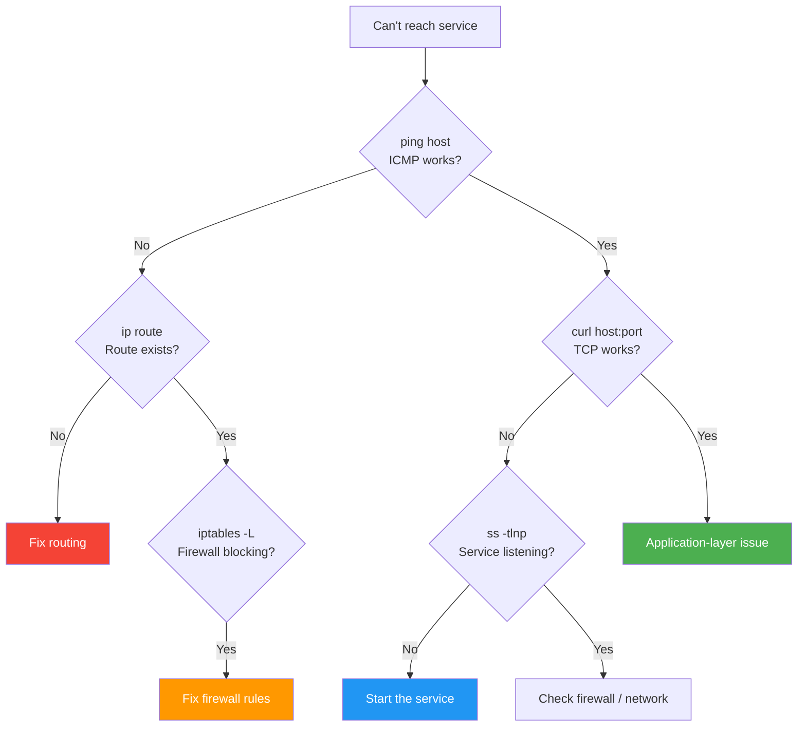

## 2.2.1 Essential Networking Tools: From Ping to Netstat

#### Why Networking Tools Matter

You cannot fix what you cannot measure. Networking tools provide visibility into:

* Whether a host is reachable (`ping`)

* The path packets take (`traceroute`, `mtr`)

* Which ports are listening (`ss`, `netstat`)

* IP to MAC address mappings (`arp`)

* Interface configuration (`ip`, `ifconfig`)

Mastering these tools allows you to diagnose connectivity issues systematically, from physical layer to application layer.

This note covers **core diagnostic tools**. Note 2.2.2 covers DNS tools (`dig`, `nslookup`, `host`). Note 2.2.3 is the subchapter review.

***

### Networking Troubleshooting Ladder



## Part 1: Ping – The Fundamental Connectivity Test

### What Ping Does

Ping sends ICMP Echo Request packets and waits for Echo Reply. It tests:

* **Layer 3 (Network)** – IP connectivity

* **Layer 2 (Data Link)** – ARP resolution (within local network)

* **Round-trip time (RTT)** – Latency

* **Packet loss** – Network quality

### Basic Ping Usage

```bash
# Ping a host by IP or DNS name
ping 8.8.8.8
ping google.com

# Stop ping: Ctrl+C (shows summary)

# Send specific number of packets
ping -c 4 8.8.8.8

# Ping with interval (default 1 second)
ping -i 0.5 8.8.8.8   # Every 0.5 seconds

# Set deadline (stop after 10 seconds)
ping -w 10 8.8.8.8

# Flood ping (send as fast as possible – root only)
sudo ping -f 8.8.8.8

# Specify source interface
ping -I eth0 8.8.8.8

# Set packet size (default 56 bytes + 8 byte ICMP header = 64 bytes)
ping -s 1400 8.8.8.8   # 1400 byte payload

# Don't fragment (test MTU)
ping -M do -s 1472 8.8.8.8   # 1472 + 28 = 1500 MTU
```

### Understanding Ping Output

```bash
ping google.com
# PING google.com (142.250.185.46) 56(84) bytes of data.
# 64 bytes from 142.250.185.46: icmp_seq=1 ttl=115 time=12.3 ms
# 64 bytes from 142.250.185.46: icmp_seq=2 ttl=115 time=11.8 ms
# ^C
# --- google.com ping statistics ---
# 2 packets transmitted, 2 received, 0% packet loss, time 1001ms
# rtt min/avg/max/mdev = 11.815/12.052/12.290/0.237 ms
```

| Field         | Meaning                                              |
| ------------- | ---------------------------------------------------- |
| `icmp_seq`    | Sequence number (detects out-of-order packets)       |
| `ttl`         | Time To Live (hops remaining – starts at 64/128/255) |
| `time`        | Round-trip time in milliseconds                      |
| `packet loss` | Percentage of packets not returned                   |
| `mdev`        | Standard deviation of RTT (jitter)                   |

### What TTL Tells You

| Initial TTL | OS/Hop Estimate              |
| ----------- | ---------------------------- |
| 64          | Linux, macOS (local network) |
| 128         | Windows                      |
| 255         | Network devices (routers)    |

**Actual hops = Initial TTL - Received TTL**

Example: `ttl=115` with initial 128 → 13 hops.

### When Ping Fails

| Error Message                  | Meaning                           |
| ------------------------------ | --------------------------------- |
| `Destination Host Unreachable` | ARP failed or no route            |
| `Request timed out`            | No response (firewall, host down) |
| `Unknown host`                 | DNS resolution failed             |
| `Network is unreachable`       | No route to network               |

***

## Part 2: Traceroute – Path Discovery

### What Traceroute Does

Traceroute shows each hop (router) between you and a destination by sending packets with incrementing TTL values.

### Basic Traceroute Usage

```bash
# Standard traceroute (uses UDP by default on Linux)
traceroute google.com

# Use ICMP (like ping)
traceroute -I google.com

# Use TCP (to specific port)
traceroute -T -p 443 google.com

# No DNS resolution (faster)
traceroute -n google.com

# Set maximum hops (default 30)
traceroute -m 20 google.com

# Wait time per probe (default 5 seconds)
traceroute -w 1 google.com
```

### Understanding Traceroute Output

```bash
traceroute -n 8.8.8.8
# 1  192.168.1.1  2.123 ms  1.987 ms  2.456 ms
# 2  10.0.0.1    15.234 ms 15.123 ms 15.567 ms
# 3  203.0.113.1 25.456 ms 25.789 ms 26.123 ms
# 4   * * *
# 5  8.8.8.8     35.123 ms 35.456 ms 35.789 ms
```

| Column      | Meaning                         |
| ----------- | ------------------------------- |
| Hop number  | Distance from source            |
| IP address  | Router at that hop              |
| Three times | RTT for each of 3 probes        |
| `* * *`     | No response (firewall blocking) |

### MTR – My Traceroute (Continuous)

MTR combines `ping` and `traceroute`, updating statistics continuously.

```bash
# Install MTR
sudo apt install mtr    # Debian/Ubuntu
sudo dnf install mtr    # RHEL/Rocky

# Run MTR (interactive)
mtr google.com

# Run MTR with report mode (send 10 packets then exit)
mtr -r -c 10 google.com

# No DNS resolution
mtr -n google.com

# TCP mode (more realistic for web traffic)
mtr -T -P 443 google.com
```

**MTR interactive keys:**

| Key | Action                       |
| --- | ---------------------------- |
| `r` | Display order (loss/latency) |
| `n` | Toggle DNS resolution        |
| `j` | Scroll down                  |
| `k` | Scroll up                    |
| `q` | Quit                         |

**Understanding MTR output:**

```
Start: 2024-01-16T10:00:00
HOST: client                 Loss%   Snt   Last   Avg  Best  Wrst StDev
  1. 192.168.1.1             0.0%    10    1.2   1.5   0.8   2.3   0.4
  2. 10.0.0.1                0.0%    10   15.3  15.5  14.5  16.2   0.5
  3. 203.0.113.1             5.0%    10   25.4  28.1  24.5  45.2   6.2
  4. ???                    100.0%   10    0.0   0.0   0.0   0.0   0.0
  5. 8.8.8.8                 0.0%    10   35.1  35.4  34.8  36.0   0.4
```

**Key metrics:**

* `Loss%` – Packet loss at each hop

* `Last/Avg/Best/Wrst` – Latency statistics

* `StDev` – Standard deviation (jitter)

***

## Part 3: SS and Netstat – Socket Statistics

### Netstat (Legacy) vs SS (Modern)

| Feature      | `netstat`  | `ss`           |
| ------------ | ---------- | -------------- |
| Speed        | Slower     | Much faster    |
| Color output | No         | Yes            |
| Parsing      | Easy       | Easy           |
| Availability | Deprecated | Modern default |

### SS Command (Recommended)

```bash
# Show all listening and non-listening sockets
ss -a

# Show listening TCP sockets only
ss -tln
# -t: TCP, -l: listening, -n: numeric (no DNS)

# Show listening UDP sockets
ss -uln

# Show all TCP connections (established)
ss -tn

# Show processes using sockets (requires root for some)
sudo ss -tlnp

# Show TCP connections with timers
ss -tno

# Show socket statistics summary
ss -s

# Filter by port
ss -tln sport = :80
ss -tln dport = :443

# Filter by state
ss -t state established
ss -t state listening
ss -t state time-wait
```

**Understanding SS output:**

```bash
ss -tlnp
# State   Recv-Q  Send-Q  Local Address:Port   Peer Address:Port   Process
# LISTEN  0       128     0.0.0.0:22           0.0.0.0:*           users:(("sshd",pid=1234,fd=3))
# LISTEN  0       511     0.0.0.0:80           0.0.0.0:*           users:(("nginx",pid=1235,fd=6))
# LISTEN  0       128     [::]:22              [::]:*              users:(("sshd",pid=1234,fd=4))
```

| Field       | Meaning                                      |
| ----------- | -------------------------------------------- |
| `Recv-Q`    | Bytes received but not read by application   |
| `Send-Q`    | Bytes sent but not acknowledged              |
| `0.0.0.0:*` | Listening on all interfaces, any source port |
| `[::]`      | IPv6 all interfaces                          |

### Netstat (Legacy – Still Useful on Older Systems)

```bash
# Show all listening ports
netstat -tlnp
# -t: TCP, -l: listening, -n: numeric, -p: program

# Show routing table
netstat -rn
route -n   # alternative

# Show interface statistics
netstat -i
netstat -i -e  # extended

# Show network statistics (packets, errors)
netstat -s

# Show all connections
netstat -an
```

***

## Part 4: IP Command – Modern Interface Configuration

The `ip` command replaces `ifconfig`, `route`, `arp`, and more.

### Interface Configuration

```bash
# Show all interfaces
ip addr show
ip a

# Show specific interface
ip addr show eth0

# Show statistics (packets, errors, drops)
ip -s link show eth0

# Bring interface up/down
sudo ip link set eth0 up
sudo ip link set eth0 down

# Add IP address
sudo ip addr add 192.168.1.100/24 dev eth0

# Remove IP address
sudo ip addr del 192.168.1.100/24 dev eth0

# Flush all IPs from interface
sudo ip addr flush dev eth0
```

### Routing Table

```bash
# Show routing table
ip route show
ip r

# Add default gateway
sudo ip route add default via 192.168.1.1

# Add static route
sudo ip route add 10.0.0.0/8 via 192.168.1.254

# Delete route
sudo ip route del 10.0.0.0/8

# Show route to specific destination
ip route get 8.8.8.8
```

### ARP Cache (Neighbors)

```bash
# Show ARP cache
ip neigh show
arp -a   # legacy

# Add static ARP entry
sudo ip neigh add 192.168.1.50 lladdr aa:bb:cc:dd:ee:ff dev eth0

# Delete ARP entry
sudo ip neigh del 192.168.1.50 dev eth0
```

***

## Part 5: ARP – Address Resolution Protocol

ARP maps IP addresses to MAC addresses on the local network.

```bash
# View ARP cache
arp -a
# (192.168.1.1) at 00:11:22:33:44:55 [ether] on eth0

# View with numeric addresses
arp -n

# Delete ARP entry
arp -d 192.168.1.1

# Add static ARP entry
arp -s 192.168.1.1 00:11:22:33:44:55

# Show ARP statistics
arp -s
```

**When ARP matters:**

* "Destination Host Unreachable" but ping to gateway works → possible ARP issue

* MAC address changes (network card replacement) → need ARP cache flush

***

### Using lsof for Network Diagnostics

`lsof` (list open files) is powerful for network debugging:

```bash
# Show all network connections
sudo lsof -i

# Show connections on specific port
sudo lsof -i :80
sudo lsof -i :22

# Show connections to specific host
sudo lsof -i @192.168.1.100

# Show TCP connections only
sudo lsof -i TCP

# Show UDP connections only
sudo lsof -i UDP

# Show listening ports
sudo lsof -i -sTCP:LISTEN

# Show established connections
sudo lsof -i -sTCP:ESTABLISHED

# Show which process is using a port
sudo lsof -i :8080 -t   # -t shows only PID

# Kill process using port
sudo kill $(lsof -i :8080 -t)
```

**lsof vs ss comparison:**

| Task | lsof | ss |
|------|------|-----|
| Show port owner | `lsof -i :80` | `ss -tlnp sport = :80` |
| Show all TCP | `lsof -i TCP` | `ss -t` |
| Show listening | `lsof -i -sTCP:LISTEN` | `ss -tln` |
| Process details | More detailed | Basic |
| Speed | Slower | Faster |

***

### Hostname and DNS Resolution

```bash
# Show hostname
hostname
hostnamectl   # more details

# Set hostname (temporary)
sudo hostname myserver

# Set hostname (permanent – modern)
sudo hostnamectl set-hostname myserver.example.com

# Test DNS resolution
host google.com
getent hosts google.com   # uses /etc/nsswitch.conf order
```

### Resolver Configuration

```bash
# View DNS configuration
cat /etc/resolv.conf
# nameserver 8.8.8.8
# nameserver 1.1.1.1
# search example.com

# Test DNS server directly
nslookup google.com 8.8.8.8
dig @8.8.8.8 google.com
```

***

## Part 7: Netcat and Telnet – Port Testing Tools

`nc` (netcat) and `telnet` test TCP/UDP connectivity to specific ports.

### Netcat (nc) – The Swiss Army Knife

```bash
# Test if TCP port is open (zero I/O mode)
nc -zv google.com 80
# google.com [142.250.185.46] 80 (http) open

nc -zv google.com 443
# google.com [142.250.185.46] 443 (https) open

# Test UDP port (-u flag)
nc -zvu 8.8.8.8 53
# Connection to 8.8.8.8 53 port [udp/domain] succeeded!

# Scan port range
nc -zv google.com 80-443

# Set timeout (seconds)
nc -zv -w 3 google.com 80

# Connect and send data (interactive)
nc google.com 80
GET / HTTP/1.0
# (press Enter twice)
```

**Netcat flags:**

| Flag | Purpose |
|------|---------|
| `-z` | Zero I/O mode (just scan) |
| `-v` | Verbose output |
| `-u` | UDP mode (default is TCP) |
| `-w` | Timeout in seconds |
| `-n` | Numeric only (no DNS) |

### Telnet – Legacy but Useful

```bash
# Test TCP port
telnet google.com 80
# Trying 142.250.185.46...
# Connected to google.com.
# Escape character is '^]'.

# Exit: Ctrl+] then type 'quit'

# Test with timeout (using timeout command)
timeout 5 telnet google.com 80
```

**Note:** Telnet is unencrypted and should NEVER be used for actual remote login. Use SSH instead. Telnet is only useful for testing port connectivity.

### When to Use Each Tool

| Scenario | Tool | Command |
|----------|------|---------|
| Quick port test | `nc` | `nc -zv host 80` |
| UDP port test | `nc` | `nc -zvu host 53` |
| Interactive protocol test | `telnet` | `telnet host 25` |
| Port scan (range) | `nc` | `nc -zv host 1-1000` |
| Banner grabbing | `nc` | `nc host 22` |

***

## Part 8: Complete Troubleshooting Workflow

### Scenario: Website Not Loading

```bash
# Step 1: Check DNS resolution
dig example.com

# Step 2: Check connectivity to IP
ping -c 4 93.184.216.34

# Step 3: Trace route
traceroute -n 93.184.216.34

# Step 4: Check if port 80 is open
nc -zv 93.184.216.34 80
telnet 93.184.216.34 80

# Step 5: Check HTTP response
curl -I http://example.com

# Step 6: Check local routing and interfaces
ip route show
ip addr show
```

### Scenario: SSH Connection Slow

```bash
# Step 1: Check latency
ping -c 10 server

# Step 2: Check path for issues
mtr server

# Step 3: Check for packet loss
ping -c 100 server | grep loss

# Step 4: Check DNS reverse lookup (common cause of slow SSH)
ssh -v server
# Look for "reverse mapping checking getaddrinfo..."
# Fix: Add `UseDNS no` to /etc/ssh/sshd_config
```

***

## Quick Task: Networking Tool Practice

*Use networking tools to explore your environment.*

1. Ping `8.8.8.8` and `google.com`. Compare the IP addresses.
2. Run `traceroute` to `google.com`. How many hops?
3. Use `mtr -r -c 10 google.com` to get a report.
4. List all listening TCP ports on your system with `ss -tlnp`.
5. Find which process is using port 22.
6. Show your routing table with `ip route show`.
7. View the ARP cache with `ip neigh show`.

> **Ready Solution:**
>
> ```bash
> # Task 1
> ping -c 2 8.8.8.8
> ping -c 2 google.com
> # Note: google.com resolves to an IP
>
> # Task 2
> traceroute google.com
> # Count the number of lines (hops)
>
> # Task 3
> mtr -r -c 10 google.com
>
> # Task 4
> ss -tlnp
>
> # Task 5
> ss -tlnp | grep :22
> # or
> sudo lsof -i :22
>
> # Task 6
> ip route show
>
> # Task 7
> ip neigh show
> ```

***

## Summary Table: Networking Tools Reference

| Tool               | Primary Use               | Key Flags               | Example                    |
| ------------------ | ------------------------- | ----------------------- | -------------------------- |
| `ping`             | Test connectivity         | `-c`, `-i`, `-s`        | `ping -c 4 google.com`     |
| `traceroute`       | Show path                 | `-n`, `-I`, `-T`        | `traceroute -n google.com` |
| `mtr`              | Continuous path + latency | `-r`, `-c`, `-n`        | `mtr -r -c 10 google.com`  |
| `ss`               | Socket statistics         | `-t`, `-l`, `-n`, `-p`  | `ss -tlnp`                 |
| `ip`               | Interface/routing config  | `addr`, `route`, `link` | `ip addr show`             |
| `arp` / `ip neigh` | ARP cache                 | `-a`, `-n`, `-d`        | `arp -n`                   |
| `nc` (netcat)      | Port testing              | `-z`, `-v`, `-u`, `-w`  | `nc -zv host 80`           |
| `telnet`           | Port/protocol testing     | (none)                  | `telnet host 25`           |
| `hostname`         | System hostname           | (none)                  | `hostname`                 |
| `netstat`          | Legacy socket stats       | `-tlnp`, `-rn`          | `netstat -tlnp`            |

### Diagnostic Workflow by Layer

| Layer           | Tool                        | What to Check                 |
| --------------- | --------------------------- | ----------------------------- |
| 2 (Data Link)   | `arp`, `ip neigh`           | MAC resolution                |
| 3 (Network)     | `ping`, `traceroute`, `mtr` | Reachability, path, latency   |
| 4 (Transport)   | `ss`, `telnet`, `nc`        | Port listening, connectivity  |
| 7 (Application) | `curl`, `dig`, `nslookup`   | HTTP response, DNS resolution |

***

**Next note (2.2.2)** will cover **DNS Deep Dive** – DNS hierarchy, record types (A, AAAA, CNAME, MX, TXT, PTR), and the `dig`, `nslookup`, and `host` commands.

---

## Backlinks

**Prerequisites from this module:**
- [2.1.1 OSI and TCP/IP Models](../Subchapter_2.1/2.1.1_OSI_and_TCP_IP_Models.md) – matching tools to layers
- [2.1.2 IP Addressing](../Subchapter_2.1/2.1.2_IP_Addressing_Subnetting_CIDR.md) – understanding ping targets and routes

**Prerequisites from Module 1:**
- [1.6.1 Process Lifecycle](../../1-Linux/Subchapter_1.6/1.6.1_Process_Lifecycle_and_Tools.md) – finding which process owns a listening port

**Next in this subchapter:**
- [2.2.2 DNS Deep Dive](./2.2.2_DNS_Deep_Dive.md) – DNS hierarchy, record types, and `dig`
