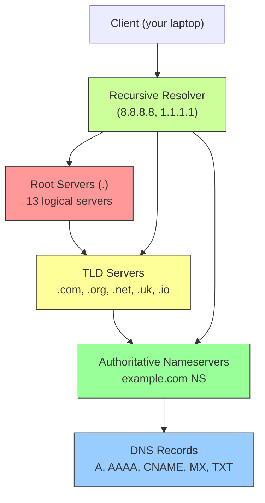
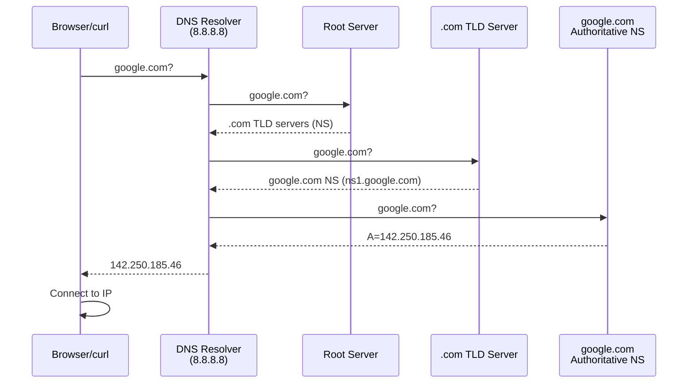

## 2.2.2 DNS Deep Dive: The Phonebook of the Internet

#### Why DNS Matters

Without DNS, you would need to remember `142.250.185.46` instead of `google.com`. DNS (Domain Name System) translates human-readable names to IP addresses and vice versa. As a platform engineer, you will:

* Troubleshoot "unknown host" errors

* Configure DNS for services (A, CNAME, MX records)

* Debug slow DNS resolution

* Understand how Kubernetes DNS (CoreDNS) works

* Set up split-horizon DNS (internal vs external resolution)

This note covers DNS hierarchy, record types, resolution flow, and diagnostic tools. Note 2.2.1 covered essential networking tools; note 2.2.3 is the subchapter review.

***

## Part 1: DNS Hierarchy – The Distributed Database

DNS is a hierarchical, distributed database. No single server knows everything.



### DNS Hierarchy Levels

| Level                  | Example                              | Purpose                                    |
| ---------------------- | ------------------------------------ | ------------------------------------------ |
| Root (`.`)             | `.`                                  | Top of hierarchy (13 root server clusters) |
| Top-Level Domain (TLD) | `.com`, `.org`, `.uk`, `.io`         | Managed by registries (Verisign, PIR)      |
| Second-Level Domain    | `example.com`                        | Registered by organizations                |
| Subdomain              | `www.example.com`, `api.example.com` | Created by domain owner                    |

### Root Servers

There are 13 logical root servers (A through M), each with many physical instances worldwide.

```bash
# View root server hints
dig . NS
# . 518400 IN NS a.root-servers.net.
# . 518400 IN NS b.root-servers.net.
# ... etc
```

***

## Part 2: DNS Resolution Flow (What Happens When You Visit google.com)



### Step-by-Step Resolution

| Step | Query Type | Question                   | Answer                   |
| ---- | ---------- | -------------------------- | ------------------------ |
| 1    | Recursive  | google.com? (to resolver)  | Not cached               |
| 2    | Iterative  | google.com? (to root)      | .com NS records          |
| 3    | Iterative  | google.com? (to .com TLD)  | google.com NS records    |
| 4    | Iterative  | google.com? (to google NS) | A record: 142.250.185.46 |
| 5    | Return     | (to client)                | IP address               |

**Caching:** Each step caches results (TTL – Time To Live). Common TTLs: 300 seconds (5 minutes) to 86400 seconds (24 hours).

***

## Part 3: DNS Record Types (What You'll Encounter Daily)

| Record    | Purpose                                  | Example                                                                                  | Typical TTL |
| --------- | ---------------------------------------- | ---------------------------------------------------------------------------------------- | ----------- |
| **A**     | IPv4 address                             | `example.com. A 93.184.216.34`                                                           | 300-3600    |
| **AAAA**  | IPv6 address                             | `example.com. AAAA 2606:2800:220:1:248:1893:25c8:1946`                                   | 300-3600    |
| **CNAME** | Canonical name (alias)                   | `www.example.com. CNAME example.com.`                                                    | 300-3600    |
| **MX**    | Mail exchange (email routing)            | `example.com. MX 10 mail.example.com.`                                                   | 3600-86400  |
| **TXT**   | Arbitrary text (SPF, DKIM, verification) | `example.com. TXT "v=spf1 include:_spf.google.com ~all"`                                 | 300-3600    |
| **NS**    | Name server                              | `example.com. NS ns1.example.com.`                                                       | 86400       |
| **PTR**   | Reverse DNS (IP → name)                  | `34.216.184.93.in-addr.arpa. PTR example.com.`                                           | 86400       |
| **SOA**   | Start of Authority (zone metadata)       | `example.com. SOA ns1.example.com. admin.example.com. 2024011601 7200 3600 1209600 3600` | 86400       |
| **SRV**   | Service location                         | `_http._tcp.example.com. SRV 10 5 80 web.example.com.`                                   | 300-3600    |

### A and AAAA Records (Address Records)

```bash
# Query A record (IPv4)
dig example.com A
# example.com. 21599 IN A 93.184.216.34

# Query AAAA record (IPv6)
dig example.com AAAA
# example.com. 21599 IN AAAA 2606:2800:220:1:248:1893:25c8:1946
```

### CNAME Records (Aliases)

```bash
# Query CNAME
dig www.example.com CNAME
# www.example.com. 21599 IN CNAME example.com.

# Common use: www -> non-www or vice versa
# Not allowed: CNAME at zone apex (example.com cannot be CNAME)
```

### MX Records (Mail Exchange)

```bash
# Query MX records
dig example.com MX
# example.com. 3599 IN MX 10 mail.example.com.
# Priority: lower number = higher priority

# Multiple MX for redundancy
# example.com. 3599 IN MX 10 mail1.example.com.
# example.com. 3599 IN MX 20 mail2.example.com.
```

### TXT Records (SPF, DKIM, DMARC)

```bash
# Query TXT records
dig example.com TXT

# SPF (Sender Policy Framework) – authorize email senders
# "v=spf1 include:_spf.google.com ~all"

# DKIM (DomainKeys Identified Mail) – email signing
# "v=DKIM1; k=rsa; p=MIGfMA0GCSqGSIb3DQEBAQUAA4GNADCBiQKBgQ..."

# DMARC (Domain-based Message Authentication) – policy
# "v=DMARC1; p=reject; rua=mailto:dmarc@example.com"
```

### PTR Records (Reverse DNS)

PTR maps an IP address back to a domain name. Used by mail servers for anti-spam.

```bash
# Query PTR record (reverse DNS)
dig -x 8.8.8.8
# 8.8.8.8.in-addr.arpa. 21599 IN PTR dns.google.

# Manual PTR query
dig 8.8.8.8.in-addr.arpa PTR
```

***

## Part 4: DNS Tools – Dig (The Gold Standard)

`dig` (Domain Information Groper) is the most powerful DNS diagnostic tool.

### Basic Dig Usage

```bash
# Simple query (uses /etc/resolv.conf)
dig google.com

# Query specific record type
dig google.com A
dig google.com AAAA
dig google.com MX
dig google.com NS
dig google.com TXT

# Query specific nameserver
dig @8.8.8.8 google.com

# Query with +short (terse output)
dig google.com +short
# 142.250.185.46

# Query all records
dig google.com ANY

# Trace the resolution path
dig google.com +trace

# Show only the answer section
dig google.com +noall +answer

# Reverse DNS
dig -x 8.8.8.8

# Control recursion
dig google.com +recurse   # force recursive
dig google.com +norecurse # force iterative
```

### Understanding Dig Output

```bash
dig google.com

# Header section
; <<>> DiG 9.18.12 <<>> google.com
;; global options: +cmd
;; Got answer:
;; ->>HEADER<<- opcode: QUERY, status: NOERROR, id: 12345
;; flags: qr rd ra; QUERY: 1, ANSWER: 1, AUTHORITY: 0, ADDITIONAL: 1

# Question section
;; QUESTION SECTION:
;google.com.                    IN      A

# Answer section
;; ANSWER SECTION:
google.com.             299     IN      A       142.250.185.46

# Footer
;; Query time: 12 msec
;; SERVER: 8.8.8.8#53(8.8.8.8) (UDP)
;; WHEN: Tue Jan 16 10:00:00 UTC 2024
;; MSG SIZE  rcvd: 55
```

| Field             | Meaning                                       |
| ----------------- | --------------------------------------------- |
| `status: NOERROR` | Query succeeded (NXDOMAIN = domain not found) |
| `flags: qr`       | Query Response (this is a response)           |
| `flags: rd`       | Recursion Desired                             |
| `flags: ra`       | Recursion Available                           |
| `ANSWER: 1`       | Number of answers                             |
| `299`             | TTL in seconds                                |
| `IN`              | Internet class (always IN)                    |

### Dig +trace (See Full Resolution Path)

```bash
dig google.com +trace

# . (root) NS records
# ;; Received 512 bytes from 192.112.36.4#53(g.root-servers.net) in 5 ms

# com. TLD NS records
# ;; Received 839 bytes from 192.31.80.30#53(e.gtld-servers.net) in 20 ms

# google.com. NS records (authoritative)
# ;; Received 587 bytes from 216.239.32.10#53(ns1.google.com) in 15 ms

# Final A record
# google.com. 300 IN A 142.250.185.46
```

### Dig Batch Queries

```bash
# Query multiple domains
dig google.com facebook.com amazon.com

# Query multiple record types
dig google.com A +noall +answer
dig google.com AAAA +noall +answer
dig google.com MX +noall +answer

# Read domains from file
while read domain; do
    dig $domain A +short
done < domains.txt
```

***

## Part 5: DNS Tools – Nslookup and Host

### Nslookup (Legacy but Still Common)

```bash
# Interactive mode
nslookup
> server 8.8.8.8
> set type=A
> google.com
> exit

# Non-interactive
nslookup google.com
nslookup google.com 8.8.8.8

# Query specific record type
nslookup -type=MX google.com
nslookup -type=NS google.com
nslookup -type=TXT google.com

# Reverse lookup
nslookup 8.8.8.8
```

**Limitations:** Nslookup does not show TTLs easily and can give misleading results (uses cached answers from your local resolver).

### Host Command (Simple, Script-Friendly)

```bash
# Basic lookup
host google.com

# Specific record type
host -t MX google.com
host -t NS google.com
host -t TXT google.com

# Reverse lookup
host 8.8.8.8

# Verbose output
host -v google.com
```

**Host vs Dig:**

| Tool       | Best For                                    |
| ---------- | ------------------------------------------- |
| `dig`      | Detailed debugging, scripting, learning     |
| `host`     | Quick lookups, simple scripts               |
| `nslookup` | Legacy systems, interactive troubleshooting |

***

## Part 6: DNS Configuration Files

### `/etc/resolv.conf` – DNS Resolver Configuration

```bash
cat /etc/resolv.conf
# nameserver 8.8.8.8
# nameserver 1.1.1.1
# search example.com mycompany.local
# options timeout:2 attempts:3
```

| Directive          | Meaning                                  |
| ------------------ | ---------------------------------------- |
| `nameserver`       | DNS server IP (up to 3, tried in order)  |
| `search`           | Domain suffixes to try (for short names) |
| `options timeout`  | Seconds before query timeout (default 5) |
| `options attempts` | Number of retries (default 2)            |

**Search domain example:**

```bash
# resolv.conf: search example.com
ping db
# Tries: db.example.com, then db (no suffix)
```

### `/etc/hosts` – Local Static Resolution

```bash
cat /etc/hosts
# 127.0.0.1       localhost
# 127.0.1.1       myserver
# 192.168.1.10    database.internal
# 10.0.0.5        api.production

# Used before DNS (order controlled by /etc/nsswitch.conf)
```

### `/etc/nsswitch.conf` – Name Service Switch Order

```bash
cat /etc/nsswitch.conf | grep hosts
# hosts: files dns

# files = /etc/hosts, dns = DNS
# Order: files first, then DNS
```

***

## Part 7: Common DNS Problems and Solutions

### Problem 1: "Unknown host" or "NXDOMAIN"

**Causes:**

* Domain doesn't exist (typo)

* DNS server unreachable

* Wrong DNS server configured

**Diagnosis:**

```bash
# Check DNS server reachability
ping 8.8.8.8

# Query directly
dig @8.8.8.8 example.com

# Check local resolver config
cat /etc/resolv.conf

# Check nsswitch order
cat /etc/nsswitch.conf | grep hosts
```

### Problem 2: DNS Resolution is Slow

**Causes:**

* First nameserver is slow/unreachable

* Too many search domains

* Reverse DNS (PTR) lookup timing out

**Diagnosis:**

```bash
# Time DNS queries
time dig google.com

# Query specific server to isolate
time dig @8.8.8.8 google.com
time dig @1.1.1.1 google.com

# Check resolver config for timeouts
cat /etc/resolv.conf

# Test search domain impact
time dig www
time dig www.example.com
```

**Fixes:**

* Remove slow nameservers from `/etc/resolv.conf`

* Reduce search domains

* Set shorter timeouts: `options timeout:1 attempts:2`

### Problem 3: DNS Works, But Ping Fails

**Causes:**

* DNS returns IP that is unreachable

* ICMP blocked by firewall

**Diagnosis:**

```bash
# Get IP from DNS
dig google.com +short

# Ping the IP directly
ping -c 4 142.250.185.46

# Trace route to IP
traceroute 142.250.185.46
```

### Problem 4: DNS Cache Poisoning / Stale Records

**Causes:**

* Local DNS cache has stale record

* ISP DNS cache not updated

**Diagnosis:**

```bash
# Check TTL of record
dig google.com | grep -A1 "ANSWER SECTION"

# Query authoritative NS directly (bypass caches)
dig @ns1.google.com google.com

# Flush local DNS cache (systemd-resolved)
sudo systemd-resolve --flush-caches

# Flush local DNS cache (nscd)
sudo systemctl restart nscd

# Flush local DNS cache (dnsmasq)
sudo systemctl restart dnsmasq
```

### Problem 5: Split-Horizon DNS (Internal vs External)

**Scenario:** `app.example.com` resolves to public IP externally, but internal IP from inside corporate network.

**Diagnosis:**

```bash
# Query from outside (public DNS)
dig @8.8.8.8 app.example.com

# Query from inside (corporate DNS)
dig app.example.com

# Compare results – should differ
```

***

## Part 8: DNS Caching and TTL

### Understanding TTL

TTL (Time To Live) tells resolvers how long to cache a record.

| TTL Value          | Typical Use                                               |
| ------------------ | --------------------------------------------------------- |
| 60-300 seconds     | Critical records that change often (failover, blue/green) |
| 300-3600 seconds   | Normal A/CNAME records                                    |
| 3600-86400 seconds | NS, MX, SOA records                                       |
| 86400+ seconds     | Static records (rarely change)                            |

### Checking TTL

```bash
# Show TTL in dig output
dig google.com
# google.com. 299 IN A 142.250.185.46
#             ^^^ TTL in seconds

# With +ttlid (shows TTL in first column)
dig google.com +ttlid
```

### Respecting TTL in Applications

```bash
# Bad: Hardcoded DNS in application
# Good: Use system resolver (honors TTL)
# curl respects TTL when using hostname
curl http://api.example.com

# Force refresh (ignore cache)
dig +noadditional +noquestion +noauthority +nostats +noanswer google.com
```

***

## Quick Task: DNS Exploration

*Use DNS tools to explore real-world DNS.*

1. Find the A records for `github.com` using `dig`.
2. Find the MX records for `gmail.com`.
3. Trace the full resolution path for `cloudflare.com` using `dig +trace`.
4. Perform a reverse DNS lookup on `8.8.8.8`.
5. Check your local DNS configuration (`/etc/resolv.conf`).
6. Query the root servers directly: `dig @a.root-servers.net com. NS`.

> **Ready Solution:**
>
> ```bash
> # Task 1
> dig github.com A +short
>
> # Task 2
> dig gmail.com MX +short
>
> # Task 3
> dig cloudflare.com +trace
>
> # Task 4
> dig -x 8.8.8.8 +short
> # or
> host 8.8.8.8
>
> # Task 5
> cat /etc/resolv.conf
>
> # Task 6
> dig @a.root-servers.net com. NS
> ```

***

## Summary Table: DNS Record Types

| Type  | Purpose          | Example                                        | Typical TTL |
| ----- | ---------------- | ---------------------------------------------- | ----------- |
| A     | IPv4 address     | `93.184.216.34`                                | 300-3600    |
| AAAA  | IPv6 address     | `2606:2800:220:1:248:1893:25c8:1946`           | 300-3600    |
| CNAME | Alias            | `example.com`                                  | 300-3600    |
| MX    | Mail server      | `10 mail.example.com`                          | 3600-86400  |
| NS    | Name server      | `ns1.example.com`                              | 86400       |
| TXT   | Text (SPF, DKIM) | `"v=spf1 include:_spf.google.com ~all"`        | 300-3600    |
| PTR   | Reverse DNS      | `dns.google`                                   | 86400       |
| SOA   | Zone metadata    | `ns1.example.com admin.example.com 2024011601` | 86400       |

### DNS Tools Comparison

| Tool       | Verbosity | Best For                   | Scriptable |
| ---------- | --------- | -------------------------- | ---------- |
| `dig`      | High      | Debugging, learning        | Yes        |
| `host`     | Low       | Quick lookups              | Yes        |
| `nslookup` | Medium    | Legacy, interactive        | Moderate   |
| `getent`   | Low       | Checking system resolution | Yes        |

### DNS Resolution Order (Linux)

```
1. /etc/hosts (if files first in nsswitch.conf)
2. DNS cache (systemd-resolved, nscd, dnsmasq)
3. DNS resolver (/etc/resolv.conf nameservers)
   - Query nameserver 1, timeout, then nameserver 2
   - Apply search domains
4. Return result or NXDOMAIN
```

### Common DNS Error Messages

| Error                 | Meaning                                       |
| --------------------- | --------------------------------------------- |
| `NXDOMAIN`            | Domain does not exist                         |
| `SERVFAIL`            | DNS server error (internal failure)           |
| `REFUSED`             | DNS server refused to answer                  |
| `NOERROR + 0 answers` | Domain exists but no record of requested type |

***

**Next note (2.2.3)** will be the Subchapter Review for Core Networking Tools and DNS, including a cheatsheet and scenario-based interview questions.

---

## Backlinks

**Prerequisites from this module:**
- [2.1.2 IP Addressing](../Subchapter_2.1/2.1.2_IP_Addressing_Subnetting_CIDR.md) – A/AAAA records map to IPs
- [2.2.1 Essential Networking Tools](./2.2.1_Essential_Networking_Tools.md) – `ping`, `traceroute` for testing connectivity

**Next in this subchapter:**
- [2.2.3 Subchapter Review](./2.2.3_Subchapter_Review.md) – cheatsheet and interview prep
