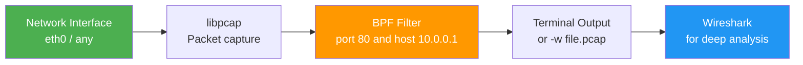

# 2.3.1 Packet Capture with tcpdump: Seeing the Wire

#### Why Packet Capture Matters

Ping shows reachability. Traceroute shows path. But when you need to see exactly what is being sent and received – the actual packets – you need a packet capture. `tcpdump` is the industry-standard command-line packet analyzer. It allows you to:

* Verify that traffic is actually leaving your server

* See if responses are coming back

* Debug protocol-level issues (wrong TLS version, malformed HTTP)

* Capture traffic for forensic analysis

* Troubleshoot firewalls (see what's being blocked)

This note covers `tcpdump` fundamentals. Note 2.3.2 covers firewalling with `iptables`/`nftables`. Note 2.3.3 is the subchapter review.

***

### tcpdump Capture Flow



## Part 1: Tcpdump Basics

### What Tcpdump Does

Tcpdump captures packets from a network interface and displays them (or saves them to a file). It operates at **Layer 2** (Data Link), capturing Ethernet frames.

### Installation

```bash
# Debian/Ubuntu
sudo apt install tcpdump

# RHEL/Rocky
sudo dnf install tcpdump

# Verify installation
tcpdump --version
```

### Basic Capture Syntax

```bash
# Capture all packets on interface eth0 (Ctrl+C to stop)
sudo tcpdump -i eth0

# Capture specific number of packets
sudo tcpdump -i eth0 -c 100

# Capture without DNS resolution (faster, shows IPs)
sudo tcpdump -i eth0 -n

# Capture with timestamps (human-readable)
sudo tcpdump -i eth0 -tttt

# Verbose output (more details)
sudo tcpdump -i eth0 -v
sudo tcpdump -i eth0 -vv   # very verbose
```

### Understanding Tcpdump Output

```bash
sudo tcpdump -i eth0 -n -c 5
# 10:00:01.234567 IP 192.168.1.100.54321 > 93.184.216.34.80: Flags [S], seq 123456789, win 65535, length 0
# 10:00:01.345678 IP 93.184.216.34.80 > 192.168.1.100.54321: Flags [S.], seq 987654321, ack 123456790, win 29200, length 0
# 10:00:01.345789 IP 192.168.1.100.54321 > 93.184.216.34.80: Flags [.], ack 1, win 65535, length 0
# 10:00:01.456789 IP 192.168.1.100.54321 > 93.184.216.34.80: Flags [P.], seq 1:89, ack 1, win 65535, length 88
# 10:00:01.567890 IP 93.184.216.34.80 > 192.168.1.100.54321: Flags [.], ack 89, win 29200, length 0
```

**Output fields:**

| Field        | Example                             | Meaning                            |
| ------------ | ----------------------------------- | ---------------------------------- |
| Timestamp    | `10:00:01.234567`                   | Time of capture                    |
| IP protocol  | `IP`                                | IPv4 (also `IP6` for IPv6)         |
| Source       | `192.168.1.100.54321`               | Source IP and port                 |
| Direction    | `>`                                 | Packet direction                   |
| Destination  | `93.184.216.34.80`                  | Destination IP and port            |
| Flags        | `[S]`, `[S.]`, `[.]`, `[P.]`, `[F]` | TCP flags                          |
| Sequence/ACK | `seq 123456789`, `ack 987654321`    | TCP sequence numbers               |
| Window       | `win 65535`                         | TCP window size                    |
| Length       | `length 88`                         | Payload length (excluding headers) |

### TCP Flags Explained

| Flag    | Symbol | Meaning                          |
| ------- | ------ | -------------------------------- |
| SYN     | `[S]`  | Synchronize – start connection   |
| SYN-ACK | `[S.]` | SYN + ACK – acknowledge and sync |
| ACK     | `[.]`  | Acknowledgment only              |
| PSH     | `[P.]` | Push – send data immediately     |
| FIN     | `[F]`  | Finish – graceful close          |
| RST     | `[R]`  | Reset – abort connection         |
| URG     | `[U]`  | Urgent data                      |

***

## Part 2: Tcpdump Filters (Berkeley Packet Filter – BPF)

Filters are the most important part of tcpdump. They limit captured packets to what you care about.

### Host Filters

```bash
# Capture traffic to/from a specific host
sudo tcpdump -i eth0 host 192.168.1.100

# Capture traffic from a source host
sudo tcpdump -i eth0 src host 192.168.1.100

# Capture traffic to a destination host
sudo tcpdump -i eth0 dst host 192.168.1.100

# Capture traffic to/from a subnet
sudo tcpdump -i eth0 net 192.168.1.0/24
```

### Port Filters

```bash
# Capture traffic on a specific port
sudo tcpdump -i eth0 port 80

# Capture traffic on source port
sudo tcpdump -i eth0 src port 443

# Capture traffic on destination port
sudo tcpdump -i eth0 dst port 22

# Capture traffic on multiple ports
sudo tcpdump -i eth0 port 80 or port 443

# Capture traffic on port range
sudo tcpdump -i eth0 portrange 8000-8080
```

### Protocol Filters

```bash
# Capture only TCP traffic
sudo tcpdump -i eth0 tcp

# Capture only UDP traffic
sudo tcpdump -i eth0 udp

# Capture only ICMP (ping) traffic
sudo tcpdump -i eth0 icmp

# Capture only ARP traffic
sudo tcpdump -i eth0 arp

# Capture only IPv6 traffic
sudo tcpdump -i eth0 ip6
```

### Complex Filters (AND, OR, NOT)

```bash
# AND (both conditions must match)
sudo tcpdump -i eth0 host 192.168.1.100 and port 80

# OR (either condition matches)
sudo tcpdump -i eth0 port 80 or port 443

# NOT (exclude matches)
sudo tcpdump -i eth0 not port 22

# Complex: HTTP traffic to/from specific IP, excluding SSH
sudo tcpdump -i eth0 host 192.168.1.100 and port 80 and not port 22

# Grouping with parentheses (escape in shell)
sudo tcpdump -i eth0 \( host 192.168.1.100 or host 192.168.1.101 \) and port 80
```

### TCP Flag Filters

```bash
# Capture only SYN packets (connection attempts)
sudo tcpdump -i eth0 'tcp[tcpflags] & tcp-syn != 0'

# Capture only SYN-ACK packets
sudo tcpdump -i eth0 'tcp[tcpflags] & tcp-syn != 0 and tcp[tcpflags] & tcp-ack != 0'

# Capture only RST packets (connection resets)
sudo tcpdump -i eth0 'tcp[tcpflags] & tcp-rst != 0'

# Capture only FIN packets (connection closes)
sudo tcpdump -i eth0 'tcp[tcpflags] & tcp-fin != 0'
```

### Packet Size Filters

```bash
# Capture packets smaller than 100 bytes
sudo tcpdump -i eth0 less 100

# Capture packets larger than 1000 bytes
sudo tcpdump -i eth0 greater 1000
```

***

## Part 3: Practical Capture Examples

### Example 1: Capture HTTP Traffic

```bash
# Capture HTTP request/response
sudo tcpdump -i eth0 -n -A port 80
# -A: print packet data in ASCII (shows HTTP headers/body)

# Capture only HTTP GET requests
sudo tcpdump -i eth0 -n -A 'port 80 and tcp[((tcp[12:1] & 0xf0) >> 2):4] = 0x47455420'
# 0x47455420 = "GET " in hex

# Capture only HTTP 200 responses
sudo tcpdump -i eth0 -n -A 'port 80 and tcp[((tcp[12:1] & 0xf0) >> 2):4] = 0x48545450'
# 0x48545450 = "HTTP"
```

### Example 2: Capture MySQL Traffic

```bash
# Capture all MySQL traffic (default port 3306)
sudo tcpdump -i eth0 -n port 3306

# Capture MySQL queries (shows SQL)
sudo tcpdump -i eth0 -n -A port 3306
```

### Example 3: Capture DNS Queries

```bash
# Capture DNS queries and responses
sudo tcpdump -i eth0 -n port 53

# Capture only DNS queries (not responses)
sudo tcpdump -i eth0 -n 'udp port 53 and udp[10] & 0x80 = 0'

# Capture only DNS responses
sudo tcpdump -i eth0 -n 'udp port 53 and udp[10] & 0x80 = 0x80'
```

### Example 4: Capture SSH Traffic

```bash
# Capture SSH traffic (port 22)
sudo tcpdump -i eth0 -n port 22

# Capture SSH traffic with packet details
sudo tcpdump -i eth0 -n -vv port 22
```

### Example 5: Capture to File for Later Analysis

```bash
# Write capture to file
sudo tcpdump -i eth0 -w capture.pcap

# Write with rotation (max 100MB per file, keep 10 files)
sudo tcpdump -i eth0 -w capture.pcap -C 100 -G 3600 -W 10

# Read from file
tcpdump -r capture.pcap

# Read with filters
tcpdump -r capture.pcap -n port 80

# Read with timestamps and ASCII
tcpdump -r capture.pcap -tttt -A
```

***

## Part 4: Advanced Tcpdump Techniques

### Limiting Capture Size (Snap Length)

By default, tcpdump captures the entire packet. For performance, limit the capture to just the headers.

```bash
# Capture only first 96 bytes of each packet (enough for IP/TCP headers)
sudo tcpdump -i eth0 -s 96

# Capture full packets (default)
sudo tcpdump -i eth0 -s 0
```

### Timestamp Formats

```bash
# Default timestamp (time of day)
sudo tcpdump -i eth0

# Human-readable date + time
sudo tcpdump -i eth0 -tttt

# Epoch seconds (Unix timestamp)
sudo tcpdump -i eth0 -tt

# Microsecond precision (default)
sudo tcpdump -i eth0 -tttt
```

### Verbosity Levels

```bash
# Normal output
sudo tcpdump -i eth0 -n

# Verbose (more details)
sudo tcpdump -i eth0 -n -v

# Very verbose (even more)
sudo tcpdump -i eth0 -n -vv

# Extremely verbose (full packet details)
sudo tcpdump -i eth0 -n -vvv
```

### Counting Packets (No Output)

```bash
# Count packets matching filter (don't print)
sudo tcpdump -i eth0 -c 1000 -q port 80
```

***

## Part 5: Analyzing Capture Files

### Basic Analysis

```bash
# Count packets in capture
tcpdump -r capture.pcap | wc -l

# Count unique source IPs
tcpdump -r capture.pcap -n | awk '{print $3}' | cut -d. -f1-4 | sort -u | wc -l

# Find top talkers (by packet count)
tcpdump -r capture.pcap -n | awk '{print $3}' | cut -d. -f1-4 | sort | uniq -c | sort -rn | head -10

# Find TCP SYN packets (connection attempts)
tcpdump -r capture.pcap -n 'tcp[tcpflags] & tcp-syn != 0 and tcp[tcpflags] & tcp-ack == 0'

# Find RST packets (connection resets)
tcpdump -r capture.pcap -n 'tcp[tcpflags] & tcp-rst != 0'
```

### Extracting Specific Flows

```bash
# Extract traffic between two IPs
tcpdump -r capture.pcap -n host 192.168.1.100 and host 93.184.216.34

# Extract traffic to a specific port
tcpdump -r capture.pcap -n dst port 443

# Extract traffic from a specific source port
tcpdump -r capture.pcap -n src port 54321
```

### Reassembling TCP Streams (with tshark)

```bash
# Install tshark (Wireshark CLI)
sudo apt install tshark   # Debian/Ubuntu
sudo dnf install wireshark-cli   # RHEL/Rocky

# Follow TCP stream (reassemble conversation)
tshark -r capture.pcap -z follow,tcp,ascii,0

# Extract HTTP objects
tshark -r capture.pcap --export-objects http,extracted/
```

***

## Part 6: Performance Considerations

### Impact of Capturing

Packet capture can be CPU and disk intensive. Mitigations:

```bash
# Use snap length (only capture headers)
sudo tcpdump -i eth0 -s 96

# Write to file without printing
sudo tcpdump -i eth0 -w capture.pcap -s 96

# Use buffer (prevents packet loss)
sudo tcpdump -i eth0 -B 4096 -w capture.pcap
# -B: buffer size in KB

# Capture only on specific core (with taskset)
sudo taskset -c 0 tcpdump -i eth0 -w capture.pcap
```

### When to Use Tcpdump vs Other Tools

| Tool        | Best For                                  |
| ----------- | ----------------------------------------- |
| `tcpdump`   | Quick captures, remote debugging, scripts |
| `tshark`    | Analysis, stream reassembly, statistics   |
| `Wireshark` | GUI analysis, deep inspection, filters    |
| `tcpflow`   | Reassembling TCP streams into files       |

### Wireshark Quick Reference

Wireshark provides a GUI for packet analysis. Common workflow:

```bash
# Capture on remote server, analyze locally
ssh user@server "sudo tcpdump -i eth0 -w -" | wireshark -k -i -

# Capture to file on server, then download
sudo tcpdump -i eth0 -w capture.pcap -c 1000
scp user@server:capture.pcap .
wireshark capture.pcap
```

**Useful Wireshark display filters:**

| Filter | Shows |
|--------|-------|
| `http` | HTTP traffic only |
| `tcp.port == 443` | Traffic on port 443 |
| `ip.addr == 192.168.1.100` | Traffic to/from IP |
| `tcp.flags.syn == 1` | SYN packets |
| `tcp.analysis.retransmission` | Retransmitted packets |
| `dns` | DNS queries/responses |
| `tcp.stream eq 0` | First TCP stream |

***

## Quick Task: Packet Capture Practice

*Perform packet captures and analyze the results.*

1. Capture 10 ICMP (ping) packets to `8.8.8.8`.
2. Capture HTTP traffic while visiting `http://example.com` (use `-A` to see HTTP).
3. Capture DNS traffic while running `dig google.com`.
4. Write a capture to a file, then read it back with `-r`.
5. Use filters to capture only traffic on port 443 (HTTPS) to `1.1.1.1`.

> **Ready Solution:**
>
> ```bash
> # Task 1: Capture ping packets
> # Terminal 1:
> sudo tcpdump -i eth0 -n icmp -c 10
> # Terminal 2:
> ping -c 10 8.8.8.8
>
> # Task 2: Capture HTTP traffic
> sudo tcpdump -i eth0 -n -A port 80 -c 50
> # In another terminal:
> curl http://example.com
>
> # Task 3: Capture DNS traffic
> sudo tcpdump -i eth0 -n port 53 -c 10
> # In another terminal:
> dig google.com
>
> # Task 4: Write and read capture
> sudo tcpdump -i eth0 -w capture.pcap -c 100
> tcpdump -r capture.pcap -n | head -20
>
> # Task 5: Filtered capture
> sudo tcpdump -i eth0 -n host 1.1.1.1 and port 443 -c 10
> # In another terminal:
> curl https://1.1.1.1
> ```

***

## Summary Table: Tcpdump Filters

| Filter Type      | Syntax                      | Example                     |
| ---------------- | --------------------------- | --------------------------- |
| Host             | `host IP`                   | `host 192.168.1.1`          |
| Source host      | `src host IP`               | `src host 192.168.1.1`      |
| Destination host | `dst host IP`               | `dst host 192.168.1.1`      |
| Network          | `net CIDR`                  | `net 192.168.1.0/24`        |
| Port             | `port N`                    | `port 80`                   |
| Source port      | `src port N`                | `src port 443`              |
| Destination port | `dst port N`                | `dst port 22`               |
| Protocol         | `tcp`, `udp`, `icmp`, `arp` | `tcp`                       |
| Complex          | `and`, `or`, `not`, `()`    | `host 10.0.0.1 and port 80` |

### Tcpdump Common Options

| Option              | Meaning           | Example           |
| ------------------- | ----------------- | ----------------- |
| `-i eth0`           | Interface         | `-i eth0`         |
| `-n`                | No DNS resolution | `-n`              |
| `-c N`              | Capture N packets | `-c 100`          |
| `-w file`           | Write to file     | `-w capture.pcap` |
| `-r file`           | Read from file    | `-r capture.pcap` |
| `-A`                | Print in ASCII    | `-A`              |
| `-v`, `-vv`, `-vvv` | Verbose           | `-vv`             |
| `-tttt`             | Human timestamp   | `-tttt`           |
| `-s N`              | Snap length       | `-s 96`           |

### TCP Flags in Filters

| Flag    | Filter Expression                                                 |
| ------- | ----------------------------------------------------------------- |
| SYN     | `'tcp[tcpflags] & tcp-syn != 0'`                                  |
| ACK     | `'tcp[tcpflags] & tcp-ack != 0'`                                  |
| RST     | `'tcp[tcpflags] & tcp-rst != 0'`                                  |
| FIN     | `'tcp[tcpflags] & tcp-fin != 0'`                                  |
| SYN-ACK | `'tcp[tcpflags] & tcp-syn != 0 and tcp[tcpflags] & tcp-ack != 0'` |

***

**Next note (2.3.2)** will cover **Firewalling with iptables/nftables** – Linux firewall basics, rules, chains, NAT, and connection tracking.

---

## Backlinks

**Prerequisites from this module:**
- [[2.1.1_OSI_and_TCP_IP_Models]] – TCP flags, transport layer concepts
- [[2.1.2_IP_Addressing_Subnetting_CIDR]] – IP addresses and ports
- [[2.2.1_Essential_Networking_Tools]] – ICMP protocol (ping uses ICMP)
- [[2.2.2_DNS_Deep_Dive]] – DNS uses port 53

**Common port numbers (from 2.1.1):**
- HTTP: 80 | HTTPS: 443 | SSH: 22 | DNS: 53 | MySQL: 3306

**Next:** [[2.3.2_Firewalling_with_iptables_nftables]] – Linux firewalls
