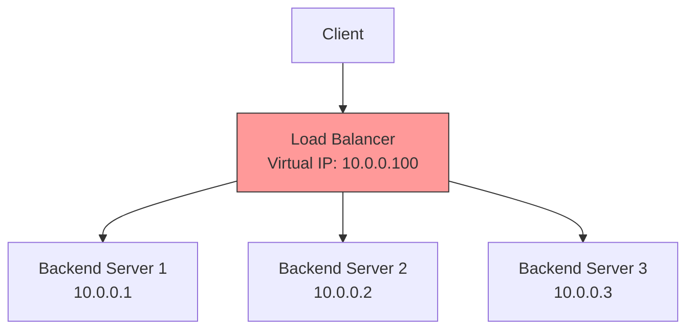
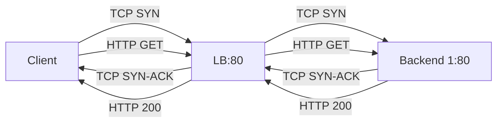
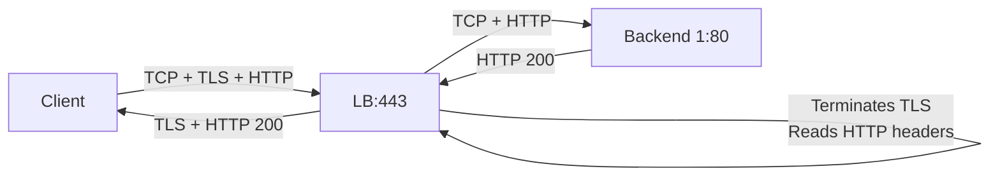
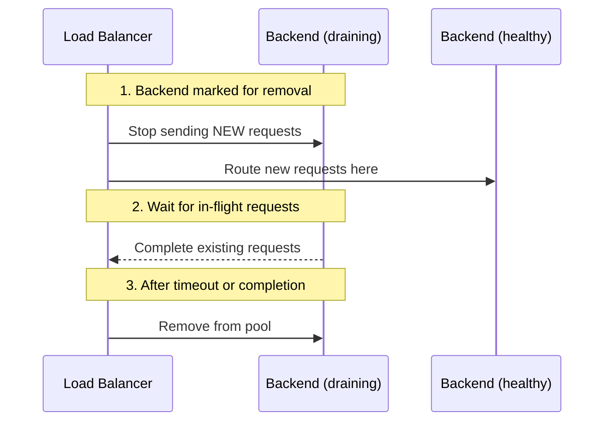
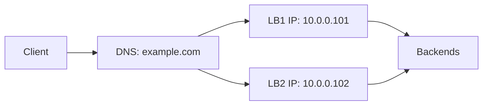
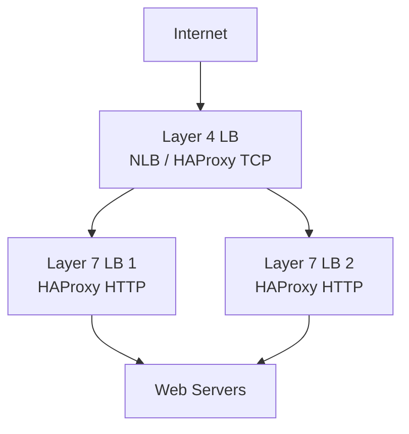

# 2.4.2 Load Balancing: Layer 4 vs Layer 7

#### Why Load Balancing Matters

Modern applications cannot rely on a single server. Load balancers:

* Distribute traffic across multiple backends (scale out)

* Provide high availability (if one backend fails, others continue)

* Enable zero-downtime deployments (drain connections, roll out gradually)

* Terminate SSL/TLS (offload crypto from application servers)

* Provide a single entry point (virtual IP or hostname)

This note covers load balancing fundamentals, algorithms, health checks, and the critical distinction between Layer 4 and Layer 7. Note 2.4.1 covered HTTP/HTTPS and curl; note 2.4.3 is the subchapter review.

***

## Part 1: What is Load Balancing?



### Key Concepts

| Concept                                   | Definition                       | Example                            |
| ----------------------------------------- | -------------------------------- | ---------------------------------- |
| **Virtual IP (VIP)**                      | Single IP clients connect to     | `10.0.0.100`                       |
| **Backend / Upstream**                    | Actual servers handling requests | `10.0.0.1`, `10.0.0.2`, `10.0.0.3` |
| **Load Balancing Algorithm**              | How traffic is distributed       | Round robin, least connections     |
| **Health Check**                          | Verifying backend is alive       | HTTP GET `/health` every 5 seconds |
| **Session Persistence (Sticky Sessions)** | Send same client to same backend | Cookie-based, IP hash              |

***

## Part 2: Layer 4 vs Layer 7 – The Critical Distinction

### Layer 4 Load Balancing (Transport Layer – TCP/UDP)

| Aspect                | Description                                              |
| --------------------- | -------------------------------------------------------- |
| **OSI Layer**         | Layer 4 (Transport)                                      |
| **Decision based on** | IP address, port, TCP/UDP                                |
| **What it sees**      | TCP/UDP headers only (no HTTP content)                   |
| **Performance**       | Very fast (few hundred ns latency)                       |
| **Use cases**         | Databases (MySQL, PostgreSQL), any TCP/UDP protocol      |
| **Examples**          | AWS NLB, HAProxy in TCP mode, kube-proxy (iptables mode) |

**How Layer 4 works:**

1. Client connects to VIP:80
2. Load balancer accepts TCP connection
3. Load balancer opens new TCP connection to a backend
4. Forwards raw TCP packets (no inspection)



### Layer 7 Load Balancing (Application Layer – HTTP/HTTPS)

| Aspect                | Description                                          |
| --------------------- | ---------------------------------------------------- |
| **OSI Layer**         | Layer 7 (Application)                                |
| **Decision based on** | HTTP headers, cookies, URL path, method              |
| **What it sees**      | Full HTTP request                                    |
| **Performance**       | Slower (inspecting HTTP, SSL termination)            |
| **Use cases**         | Web applications, APIs, microservices                |
| **Examples**          | AWS ALB, HAProxy in HTTP mode, Nginx, Traefik, Envoy |

**How Layer 7 works:**

1. Client connects to VIP:443
2. Load balancer terminates SSL (if HTTPS)
3. Load balancer reads HTTP request (method, path, headers)
4. Makes routing decision based on content
5. Opens new TCP connection to backend
6. Forwards HTTP request (possibly re-encrypts)



### Layer 4 vs Layer 7 Comparison

| Feature                   | Layer 4                | Layer 7                                        |
| ------------------------- | ---------------------- | ---------------------------------------------- |
| **Protocol awareness**    | None (TCP/UDP only)    | HTTP, HTTPS, gRPC, WebSocket                   |
| **SSL/TLS termination**   | Possible but limited   | Yes (offload from backends)                    |
| **Content-based routing** | No                     | Yes (path, host, header, cookie)               |
| **Session persistence**   | Source IP hash         | Cookie insertion                               |
| **Performance**           | Very high              | High (with overhead)                           |
| **Features**              | Basic                  | Advanced (rewrites, redirects, authentication) |
| **Use case**              | Databases, generic TCP | Web APIs, microservices                        |

***

## Part 3: Load Balancing Algorithms

| Algorithm                | Description                                               | Best For                            | Sticky? |
| ------------------------ | --------------------------------------------------------- | ----------------------------------- | ------- |
| **Round Robin**          | Distributes requests sequentially                         | Equal capacity backends             | No      |
| **Least Connections**    | Sends to backend with fewest active connections           | Variable request duration           | No      |
| **Least Time**           | Least connections + fastest response time                 | Performance-sensitive               | No      |
| **IP Hash**              | Hash of client IP determines backend                      | Session persistence without cookies | Yes     |
| **Random**               | Randomly selects backend                                  | Large backend pools                 | No      |
| **Weighted Round Robin** | Round robin with weights (more powerful servers get more) | Unequal backend capacity            | No      |

### Algorithm Examples

```bash
# Round Robin: requests distributed evenly
Request 1 → Backend 1
Request 2 → Backend 2
Request 3 → Backend 3
Request 4 → Backend 1
Request 5 → Backend 2
...

# Least Connections (assume Backend 1 has 5 active, Backend 2 has 2)
Request → Backend 2 (fewest connections)

# IP Hash (client IP 192.168.1.100 always → same backend)
hash(192.168.1.100) % 3 = Backend 2
```

***

## Part 4: Health Checks

Health checks ensure traffic only goes to healthy backends.

| Health Check Type | How it Works                          | Example                  |
| ----------------- | ------------------------------------- | ------------------------ |
| **TCP**           | Attempts TCP connection to port       | `connect to 10.0.0.1:80` |
| **HTTP**          | Sends HTTP request, expects 2xx/3xx   | `GET /health`            |
| **HTTPS**         | Same as HTTP with SSL                 | `GET /health` over TLS   |
| **Custom**        | Executes script or sends custom probe | `redis-cli PING`         |

### Health Check Parameters

| Parameter               | Meaning                                | Typical Value |
| ----------------------- | -------------------------------------- | ------------- |
| **Interval**            | How often to check                     | 5-30 seconds  |
| **Timeout**             | Max wait for response                  | 2-5 seconds   |
| **Healthy threshold**   | Consecutive successes to mark healthy  | 2-3           |
| **Unhealthy threshold** | Consecutive failures to mark unhealthy | 2-3           |

### Health Check Examples

```bash
# TCP health check (HAProxy)
option tcp-check
tcp-check connect port 3306
tcp-check send PING\n
tcp-check expect string +PONG

# HTTP health check (Nginx)
health_check uri=/health interval=5s fails=3 passes=2;

# HTTP health check (AWS ALB)
Target Group: HTTP:80/health
Interval: 30 seconds
Healthy threshold: 2
Unhealthy threshold: 2
```

***

## Part 5: Session Persistence (Sticky Sessions)

Some applications store session data locally. Sticky sessions ensure a client always goes to the same backend.

### Sticky Session Methods

| Method               | How it Works                      | Pros               | Cons                                |
| -------------------- | --------------------------------- | ------------------ | ----------------------------------- |
| **Cookie insertion** | LB inserts cookie with backend ID | Transparent to app | LB adds cookie                      |
| **Cookie learning**  | LB reads app's session cookie     | No LB modification | Requires app cookie                 |
| **Source IP hash**   | Hash of client IP chooses backend | Simple             | Multiple clients may share IP (NAT) |

### Example: Cookie Insertion (HAProxy)

```haproxy
backend web_servers
    cookie SERVERID insert indirect nocache
    server web1 10.0.0.1:80 cookie web1
    server web2 10.0.0.2:80 cookie web2
    server web3 10.0.0.3:80 cookie web3
```

**Warning:** Sticky sessions break the "stateless" ideal and can cause uneven load distribution.

***

## Part 5b: Connection Draining and Graceful Shutdown

Connection draining ensures in-flight requests complete before removing a backend.

### Connection Draining Process



### Draining Configuration

**HAProxy:**
```haproxy
backend web_servers
    option httpchk GET /health
    # Drain for 30 seconds before removing
    server web1 10.0.0.1:80 check drain
    
# Graceful disable (via socket)
# echo "disable server web_servers/web1" | socat stdio /var/run/haproxy.sock
```

**Nginx:**
```nginx
upstream backend {
    server 10.0.0.1:80;
    server 10.0.0.2:80 down;  # Marked down (no new connections)
}
```

**AWS ALB/NLB:**
```bash
# Deregister with connection draining
aws elbv2 deregister-targets \
    --target-group-arn arn:aws:elasticloadbalancing:... \
    --targets Id=i-12345678

# Default draining timeout: 300 seconds (configurable)
```

### Graceful Shutdown Best Practices

| Step | Action | Duration |
|------|--------|----------|
| 1 | Stop accepting new connections | Immediate |
| 2 | Complete in-flight requests | 30-300 seconds |
| 3 | Close idle connections | After step 2 |
| 4 | Terminate process | Final |

**Application-side support:**
```bash
# Signal handling in application
# On SIGTERM: stop accepting, finish requests, exit

# Kubernetes: terminationGracePeriodSeconds
# Default: 30 seconds
```

***

## Part 6: SSL/TLS Patterns — Termination vs Passthrough vs Re-encryption

How the load balancer handles SSL/TLS is one of the most critical architectural decisions.

### SSL Termination (Most Common)

The LB decrypts TLS, reads HTTP, and forwards plain HTTP to backends.

```
Client ---[HTTPS/TLS]--> LB ---[HTTP/plain]--> Backend
```

| Pros                                    | Cons                                    |
| --------------------------------------- | --------------------------------------- |
| LB can inspect/route by HTTP content    | Traffic between LB and backend is plain |
| Offloads CPU-intensive crypto from apps | Certificate management on LB only       |
| Enables Layer 7 features (path routing) | Not suitable for strict compliance      |

### SSL Passthrough

The LB forwards encrypted traffic directly to backends without decryption.

```
Client ---[HTTPS/TLS]--> LB ---[HTTPS/TLS]--> Backend
```

| Pros                                      | Cons                                   |
| ----------------------------------------- | -------------------------------------- |
| True end-to-end encryption                | LB cannot read HTTP (Layer 4 only)     |
| Backend controls its own certificate      | No path-based routing possible         |
| Required for mutual TLS (mTLS) scenarios  | Each backend needs its own certificate |

### SSL Re-encryption (Bridge Mode)

The LB terminates TLS, inspects HTTP, then **re-encrypts** to backends over a new TLS connection.

```
Client ---[HTTPS/TLS]--> LB ---[HTTPS/TLS (new)]--> Backend
```

| Pros                                     | Cons                              |
| ---------------------------------------- | --------------------------------- |
| End-to-end encryption maintained         | Double TLS overhead (more CPU)    |
| LB can still do L7 routing and rewrites  | Certificate management on both    |
| Meets compliance (encrypted in transit)  | More complex configuration        |

```bash
# HAProxy re-encryption example
backend secure_servers
    mode http
    option httpchk GET /health
    # Re-encrypt to backend using SSL
    server web1 10.0.0.1:443 ssl verify none check
    server web2 10.0.0.2:443 ssl verify required ca-file /etc/ssl/internal-ca.pem check
```

**Choosing the right pattern:**

| Requirement                          | Pattern          |
| ------------------------------------ | ---------------- |
| Path-based routing + speed           | SSL Termination  |
| Strict compliance (PCI-DSS, HIPAA)   | Re-encryption    |
| Mutual TLS (mTLS) between services   | Passthrough      |
| Maximum simplicity                   | Termination      |
| Service mesh (Istio, Linkerd)        | Passthrough/mTLS |

***

## Part 7: Common Load Balancers

### Software Load Balancers

| Load Balancer | Layer | Features                            | Best For                     |
| ------------- | ----- | ----------------------------------- | ---------------------------- |
| **HAProxy**   | 4 & 7 | Fast, reliable, SSL termination     | High-performance TCP/HTTP    |
| **Nginx**     | 7     | Web server + load balancer          | HTTP/HTTPS, microservices    |
| **Traefik**   | 7     | Kubernetes native, automatic config | Containers, dynamic backends |
| **Envoy**     | 7     | Service mesh sidecar                | Istio, advanced routing      |
| **Apache**    | 7     | HTTP only (mod\_proxy)              | Legacy environments          |

### Cloud Load Balancers (AWS)

| Type                     | Layer | Features                                       | Use Case          |
| ------------------------ | ----- | ---------------------------------------------- | ----------------- |
| **ALB (Application LB)** | 7     | HTTP/HTTPS, path/host routing, sticky sessions | Web applications  |
| **NLB (Network LB)**     | 4     | TCP/UDP, high throughput, static IP            | Databases, gaming |
| **CLB (Classic LB)**     | 4/7   | Legacy, less featured                          | Older deployments |
| **GWLB**                 | 3     | Gateway for virtual appliances                 | Firewalls, IDS    |

### Kubernetes Load Balancing

| Component                      | Layer | Purpose                             |
| ------------------------------ | ----- | ----------------------------------- |
| **kube-proxy (iptables)**      | 4     | Service cluster IP                  |
| **kube-proxy (IPVS)**          | 4     | High-performance service routing    |
| **Ingress Controller**         | 7     | HTTP/HTTPS routing, SSL termination |
| **Service Type: LoadBalancer** | 4     | Cloud LB integration                |
| **Gateway API**                | 7     | Modern Kubernetes ingress           |

***

## Part 7: Load Balancer Configuration Examples

### HAProxy TCP (Layer 4) Configuration

```haproxy
# /etc/haproxy/haproxy.cfg

global
    daemon
    maxconn 4096

defaults
    mode tcp
    timeout connect 5s
    timeout client 50s
    timeout server 50s

frontend mysql_frontend
    bind *:3306
    default_backend mysql_backend

backend mysql_backend
    balance roundrobin
    option tcp-check
    server mysql1 10.0.0.1:3306 check
    server mysql2 10.0.0.2:3306 check
    server mysql3 10.0.0.3:3306 check
```

### HAProxy HTTP (Layer 7) Configuration

```haproxy
# /etc/haproxy/haproxy.cfg

global
    daemon
    maxconn 4096

defaults
    mode http
    timeout connect 5s
    timeout client 50s
    timeout server 50s

frontend web_frontend
    bind *:80
    bind *:443 ssl crt /etc/ssl/certs/example.pem
    redirect scheme https if !{ ssl_fc }
    
    # Path-based routing
    use_backend api_servers if { path_beg /api/ }
    use_backend static_servers if { path_beg /static/ }
    default_backend web_servers

backend web_servers
    balance leastconn
    cookie SERVERID insert indirect nocache
    server web1 10.0.0.1:80 cookie web1 check inter 5s rise 2 fall 3
    server web2 10.0.0.2:80 cookie web2 check inter 5s rise 2 fall 3
    server web3 10.0.0.3:80 cookie web3 check inter 5s rise 2 fall 3

backend api_servers
    balance roundrobin
    server api1 10.0.0.4:8080 check
    server api2 10.0.0.5:8080 check

backend static_servers
    balance roundrobin
    server static1 10.0.0.6:80 check
```

### Nginx HTTP Load Balancing

```nginx
# /etc/nginx/nginx.conf

upstream web_backend {
    least_conn;  # algorithm
    server 10.0.0.1:80 weight=3;  # weight: 3x more traffic
    server 10.0.0.2:80 weight=2;
    server 10.0.0.3:80;
    
    # Sticky sessions (using cookie)
    sticky cookie srv_id expires=1h domain=.example.com path=/;
}

upstream api_backend {
    ip_hash;  # stickiness based on client IP
    server 10.0.0.4:8080;
    server 10.0.0.5:8080;
}

server {
    listen 80;
    server_name example.com;
    
    location / {
        proxy_pass http://web_backend;
        proxy_set_header Host $host;
        proxy_set_header X-Real-IP $remote_addr;
    }
    
    location /api/ {
        proxy_pass http://api_backend;
        proxy_set_header Host $host;
    }
    
    # Health check endpoint (pass-through)
    location /health {
        return 200 "healthy\n";
        add_header Content-Type text/plain;
    }
}
```

***

## Part 8: Load Balancer Deployment Patterns

### Active-Passive (Failover)

One active LB, one standby. Uses VRRP (keepalived) for VIP failover.


### Active-Active (Both LBs active)

Both LBs handle traffic, usually with DNS round robin or ECMP routing.



### Two-Tier Load Balancing

Layer 4 LB distributes to Layer 7 LBs (common in large deployments).



***

## Quick Task: Load Balancer Analysis

*Analyze load balancing scenarios and choose appropriate solutions.*

1. You have a MySQL database cluster with 3 nodes. Which load balancer type (Layer 4 or Layer 7) and algorithm would you choose? Why?
2. You have a web application that needs to route `/api/*` to API servers and `/*` to web servers. Which layer is required? Why?
3. Your application stores session data in local memory. How would you ensure a user always hits the same backend?
4. A backend server is failing health checks. What could cause this?

> **Ready Solution:**
>
> 1. **Layer 4** – MySQL uses TCP protocol, not HTTP. **Least connections** algorithm works well because some queries may be long-running. **Round robin** is also acceptable.
>
> 2. **Layer 7** – Required to inspect the URL path (`/api/` vs `/`). Layer 4 cannot see HTTP paths.
>
> 3. **Session persistence (sticky sessions)** – Options: cookie insertion (LB adds cookie), cookie learning (LB reads app cookie), or source IP hash (less reliable).
>
> 4. **Health check failures could be caused by:** Application not running, port not listening, health endpoint returning 5xx, timeout too short, firewall blocking health check IP, server overloaded.

***

## Summary Table: Load Balancing Comparison

| Aspect                  | Layer 4                   | Layer 7                    |
| ----------------------- | ------------------------- | -------------------------- |
| **Protocols**           | TCP, UDP                  | HTTP, HTTPS, gRPC          |
| **Routing based on**    | IP, port                  | Path, host, header, cookie |
| **SSL termination**     | Possible (limited)        | Yes (full offload)         |
| **Performance**         | Very fast                 | Fast (with overhead)       |
| **Session persistence** | Source IP hash            | Cookie                     |
| **Health checks**       | TCP connect               | HTTP status/content        |
| **Use cases**           | Databases, Redis, any TCP | Web APIs, microservices    |
| **Examples**            | HAProxy (TCP), NLB        | HAProxy (HTTP), ALB, Nginx |

### Load Balancing Algorithms

| Algorithm         | Description               | Use Case                     |
| ----------------- | ------------------------- | ---------------------------- |
| Round Robin       | Sequential distribution   | Equal capacity backends      |
| Least Connections | Fewest active connections | Variable request duration    |
| Least Time        | Fastest response time     | Performance-critical         |
| IP Hash           | Hash of client IP         | Sticky sessions (no cookies) |
| Weighted          | Based on server weights   | Unequal capacity             |

### Health Check Types

| Type   | What it Checks          | Best For               |
| ------ | ----------------------- | ---------------------- |
| TCP    | Port open               | Databases, generic TCP |
| HTTP   | HTTP response (2xx/3xx) | Web applications       |
| HTTPS  | HTTP over TLS           | Secure web apps        |
| Custom | Script output           | Complex health logic   |

***

**Next note (2.4.3)** will be the Subchapter Review for Application Protocols and Load Balancing, including a cheatsheet and scenario-based interview questions.

---

## Backlinks

**Prerequisites from this module:**
- [2.1.1 OSI and TCP/IP Models](../Subchapter_2.1/2.1.1_OSI_and_TCP_IP_Models.md) – OSI layers (Layer 4 vs Layer 7 distinction), TCP/UDP protocols
- [2.1.2 IP Addressing and Subnetting](../Subchapter_2.1/2.1.2_IP_Addressing_Subnetting_CIDR.md) – VIPs, backend server IPs
- [2.3.2 Firewalling with iptables/nftables](../Subchapter_2.3/2.3.2_Firewalling_with_iptables_nftables.md) – Health checks may be blocked by firewall rules
- [2.4.1 HTTP, HTTPS, and curl/wget](./2.4.1_HTTP_HTTPS_and_curl_wget.md) – HTTP protocol (Layer 7 content)

**Previous note:** [2.4.1 HTTP, HTTPS, and curl/wget](./2.4.1_HTTP_HTTPS_and_curl_wget.md)
**Next note:** [2.4.3 Subchapter Review](./2.4.3_Subchapter_Review.md)
