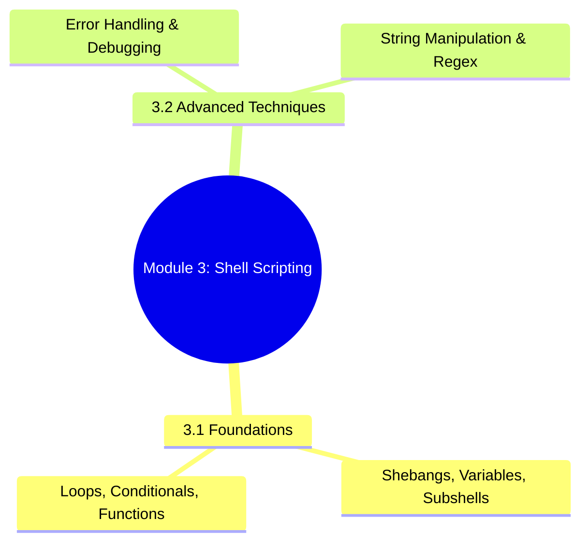
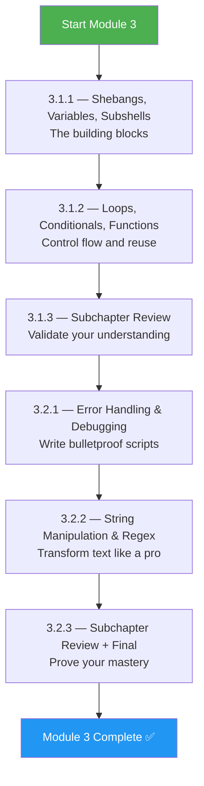
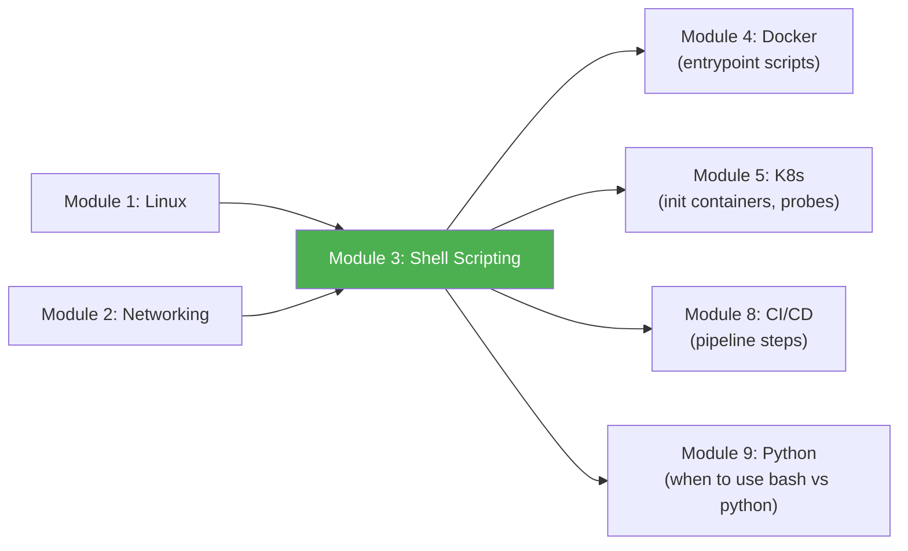

# Module 3 Approach Guide — Shell Scripting (Bash)

## Module Overview

---

## Who Is This Module For?

Shell scripting is the **universal automation language** of Linux systems. Every CI/CD pipeline, every Docker entrypoint, every cron job, and every Kubernetes init container uses bash. This module turns you from someone who types commands into someone who writes robust automation.

**Target audience:**
- Anyone who has completed Modules 1–2 and wants to automate their Linux knowledge
- DevOps engineers who write "it works on my machine" scripts and need production-grade patterns
- Platform engineers building deployment scripts, health checks, and log parsers

---

## Prerequisites

| Prerequisite | Required? | Notes |
|---|---|---|
| Module 1 (Linux) completed | **Yes** | You must be comfortable with CLI, pipes, redirects, file permissions |
| Module 2 (Networking) completed | Recommended | Some examples use `curl`, `dig`, `ss` |
| A text editor (vim/nano) | **Yes** | You'll write scripts constantly |

---

## How to Approach This Module

### Study Strategy

1. **Write a script for every concept** — Don't just read about `set -euo pipefail`; write a script that breaks without it.
2. **3.1 is the grammar, 3.2 is the style** — Master fundamentals before error handling.
3. **Use ShellCheck on every script** — Install it: `apt install shellcheck`. It catches bugs you won't see.
4. **Rewrite your Module 1 manual commands as scripts** — Automate user creation, log rotation, disk checks.
5. **Test edge cases** — Empty strings, missing files, spaces in filenames, special characters.

---

## Time Estimates

| Subchapter | Reading | Practice | Total |
|---|---|---|---|
| 3.1 Foundations | 2.5 hrs | 3 hrs | **5.5 hrs** |
| 3.2 Advanced Techniques | 2.5 hrs | 3.5 hrs | **6 hrs** |
| **Total** | **5 hrs** | **6.5 hrs** | **~11.5 hrs** |

> **Realistic timeline:** 1 week at 2 hours/day. This is a compact but dense module.

---

## Practice Lab Ideas

| Lab | Covers | Difficulty |
|---|---|---|
| Write a script that creates 10 users from a CSV file with proper error handling | 3.1 + 3.2 | ⭐⭐ |
| Build a log rotator that compresses logs older than 7 days and deletes logs older than 30 | 3.1 + 3.2 | ⭐⭐⭐ |
| Write a deployment script with rollback: deploy a tarball, validate health, rollback on failure | 3.2 | ⭐⭐⭐ |
| Parse an Nginx access log to produce a report of top IPs, status codes, and response times | 3.2 | ⭐⭐⭐⭐ |
| Build a `setup.sh` bootstrapper that detects OS (Ubuntu/RHEL), installs packages, configures SSH keys | 3.1 + 3.2 | ⭐⭐⭐⭐ |

---

## What Success Looks Like

By the end of Module 3, you should be able to:

- [ ] Write a bash script with proper shebang, strict mode (`set -euo pipefail`), and trap handlers
- [ ] Use `for`, `while`, `case`, and functions with local variables
- [ ] Handle errors gracefully — validate inputs, check exit codes, clean up on failure
- [ ] Use parameter expansion for string manipulation without spawning subprocesses
- [ ] Write regex patterns for grep, sed, and `[[ =~ ]]` matching
- [ ] Debug scripts with `set -x`, `PS4`, and `trap 'echo ...' DEBUG`

---

## Connection to Other Modules

**Bash scripts are everywhere:** Docker entrypoints, Kubernetes init containers, CI/CD pipeline steps, Helm hooks, and systemd ExecStart commands. Module 9 (Python) will teach you when Python is a better choice — but bash remains the right tool for glue scripts under ~100 lines.

> **Next module:** [Module 4 — Docker](../4-Docker/Module_4_Approach_Guide.md)
