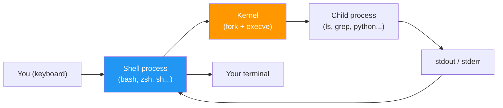
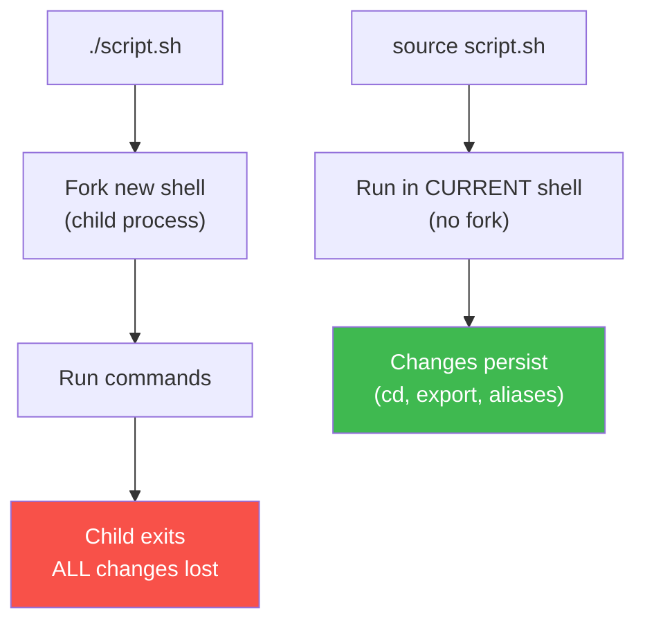

# 3.0.1 Shell Basics and Your First Script

Before you can chain `for` loops, quoting rules, and process substitution, you need a concrete mental model of **what a shell actually is**, **how a script differs from typing commands**, and **why Bash behaves the way it does**. This note is the absolute entry point — read it even if you have used Bash before. It closes the gaps that most tutorials skip.

> **Tip:** If you feel Notes 3.1.1 / 3.1.2 jumped too fast last time, this note is the missing prequel. Spend 30 focused minutes here and the rest of Module 3 will feel half as hard.

***

## Part 1 — What Is a Shell?

A **shell** is a program that:

1. reads a line of text from you (or from a file),
2. parses it as a command,
3. asks the Linux kernel to run that command, and
4. prints the result.

That's it. It is "just another program" — you can have many at once.



### Shell vs Terminal vs Console — Stop Confusing These

| Term | What it actually is | Example |
|------|---------------------|---------|
| **Terminal** | The GUI *window* that shows text | GNOME Terminal, iTerm2, Windows Terminal |
| **Shell** | The program *inside* the window that runs commands | `bash`, `zsh`, `sh`, `fish`, `dash` |
| **Console** | The kernel-level text device you see on boot (no GUI) | `Ctrl+Alt+F2` on most distros |
| **TTY / PTY** | The character device connecting them | `/dev/tty1`, `/dev/pts/0` |

```bash
# Which shell am I in right now?
echo $0                  # -bash, bash, zsh, etc.
echo "$SHELL"            # default login shell (may differ from $0)
ps -p $$ -o comm=        # authoritative: the command running at PID $$
```

> **Important:** `$SHELL` is your **default login shell**, not the one you are currently using. If you typed `zsh` inside a bash window, `$SHELL` still says `bash`. Use `ps -p $$` to know for sure.

### Bash vs sh vs dash — Why It Matters

Many tutorials say "the shell" as if there were only one. There are dozens, and they are **not** interchangeable.

| Shell | Role | Notes |
|-------|------|-------|
| **`sh`** | The POSIX standard (minimal) | On Ubuntu/Debian, `/bin/sh` is actually `dash` — **not bash** |
| **`bash`** | Bourne Again Shell — GNU's superset of `sh` | Default interactive shell on most distros; what we use |
| **`dash`** | Debian Almquist Shell — fast, POSIX-only | Used at boot, runs `/etc/init.d/*` scripts |
| **`zsh`** | Z Shell — interactive super-set of bash | Default on macOS since Catalina |
| **`fish`** | Friendly Interactive SHell | Not POSIX compatible — scripts won't port |

> **Warning:** A script that begins with `#!/bin/sh` on Debian/Ubuntu runs under **dash**, which does **not** support `[[ ]]`, arrays, `{a..b}`, or `local`. If you want bash features, use `#!/usr/bin/env bash`. This single misunderstanding breaks thousands of GitHub issues every year.

***

## Part 2 — The Prompt and How to Read It

```
alice@web-01:~/projects/api$
│     │      │             │
│     │      │             └── Prompt character ($ = normal user, # = root)
│     │      └─ Current working directory (~ means $HOME)
│     └─────── Hostname
└──────────── Username
```

You can customise it via `PS1`. For now just know:

- **`$`** → you are a normal user.
- **`#`** → you are **root** (or in a `sudo -i` shell). Be careful.

```bash
# Show your current PS1
echo "$PS1"

# Temporarily simplify to just '$ '
PS1='$ '
```

***

## Part 3 — From One-Liners to Scripts

### You already write "scripts" every time you type

When you type `ls -la | grep ".log"`, Bash is running a mini-program:

- two commands,
- a pipe connecting them,
- one argument,
- implicit stdin/stdout wiring.

A **script** is just that same kind of text saved in a file so you can run it again.

```bash
# You typed this once:
echo "Hello, $(whoami)!"

# Save it into a file and it becomes a reusable script:
cat > greet.sh <<'EOF'
echo "Hello, $(whoami)!"
EOF
```

### Three ways to run a script

```bash
# 1) As an argument to an interpreter — no exec bit needed
bash greet.sh
sh   greet.sh

# 2) As an executable — needs chmod +x AND a shebang line
chmod +x greet.sh
./greet.sh

# 3) "Sourced" — runs in the CURRENT shell (variables persist)
source greet.sh          # long form
. greet.sh               # POSIX short form
```

> **Tip:** The difference between `./script.sh` and `source script.sh` is the single most common gotcha for beginners. The first runs in a **child** shell and any `cd` / `export` is lost when it exits. The second runs in your **current** shell — use it for `activate` scripts, `.bashrc` reloads, and setting env vars.



***

## Part 4 — Your First Real Script, Line by Line

```bash
#!/usr/bin/env bash                       # 1
# greet.sh — say hi to someone             # 2
                                           # 3
set -euo pipefail                          # 4
                                           # 5
name="${1:-world}"                         # 6
echo "Hello, ${name}!"                     # 7
echo "You are on $(hostname) as $(whoami)" # 8
```

| Line | What it does |
|------|--------------|
| 1 | **Shebang** — tells the kernel which interpreter to launch. `/usr/bin/env bash` finds bash via `$PATH` so it works on macOS, Alpine, etc. |
| 2 | **Comment** — any line starting with `#` (except the shebang) is ignored. Use them liberally. |
| 4 | **Strict mode** (covered fully in 3.2.1) — exit on error, on unset vars, on failed pipes. Always use it. |
| 6 | **Positional parameter with default** — `$1` is the first CLI argument; `:-world` means "use `world` if `$1` is unset or empty". |
| 7 | **Variable expansion** — `${name}` inserts the value. Always use double quotes. |
| 8 | **Command substitution** — `$(cmd)` runs `cmd` and replaces itself with the output. |

> **Caution:** Leaving out `set -euo pipefail` means a typo in a variable name or a failed `rm` silently passes, and your script keeps going with bad state. This single line has saved more production outages than any tool.

***

## Part 5 — How Bash Reads a Line (Parsing Order)

This is the piece that tutorials almost never explain but that makes everything else make sense.


Key consequences of this order:

1. **Variables expand *before* globbing** — so `files=*.txt; echo $files` expands `*.txt` to matching filenames, but `echo "$files"` prints the literal string `*.txt`.
2. **Word splitting happens AFTER variable expansion on unquoted results** — this is why `rm $filename` breaks when the filename has spaces, but `rm "$filename"` is safe.
3. **Quotes are removed last**, so `"$HOME/file.txt"` is one word `/home/alice/file.txt`, not two.

> **Tip:** Whenever a script misbehaves with a weird filename, 90% of the time you forgot to quote a variable. Run `shellcheck yourscript.sh` — it catches this automatically.

***

## Part 6 — Standard Streams and Redirection

Every process has three file descriptors open at birth:

| FD | Name | Default | Redirect |
|----|------|---------|----------|
| **0** | stdin | keyboard | `<` |
| **1** | stdout | terminal | `>`, `>>` |
| **2** | stderr | terminal | `2>`, `2>>` |

```bash
# Discard output entirely
command > /dev/null

# Keep stdout, discard errors
command 2> /dev/null

# Send BOTH stdout and stderr to a file
command > out.log 2>&1         # order matters — see below
command &> out.log             # bash shorthand (not POSIX)

# Append instead of overwrite
echo "new line" >> /var/log/app.log

# Feed a file in as stdin
wc -l < /etc/passwd

# Chain them with pipes (|) — stdout of left → stdin of right
ps -ef | grep nginx | wc -l
```

> **Warning:** `> out 2>&1` and `2>&1 > out` are **not** the same.
> - `> out 2>&1` → redirect stdout to `out`, then point stderr to wherever stdout goes (now `out`). Both end up in the file. ✅
> - `2>&1 > out` → point stderr to wherever stdout goes (terminal), then redirect stdout to `out`. Errors still go to the terminal. ❌

### `/dev/null` — The Black Hole

`/dev/null` is a special file that discards anything written to it and returns EOF on read. Use it when you only care about exit codes:

```bash
if command -v docker > /dev/null 2>&1; then
    echo "docker is installed"
fi
```

***

## Part 7 — Exit Codes: The Only Thing Scripts *Return*

Every command ends with an integer **exit code** in the range `0..255`:

- **0** → success
- **non-zero** → some kind of failure (convention: 1 = generic, 2 = misuse, etc.)

```bash
ls /etc
echo $?              # → 0

ls /does/not/exist
echo $?              # → 2
```

### Chaining on Success/Failure

```bash
mkdir -p build && cd build           # cd only if mkdir succeeded
command_that_might_fail || echo "fallback plan"
command1 ; command2                  # run both regardless (sequence)
```

| Operator | Meaning |
|----------|---------|
| `&&` | Run next **only if** previous succeeded (exit 0) |
| `\|\|` | Run next **only if** previous failed (exit ≠ 0) |
| `;` | Always run next |
| `&` | Run previous in background, don't wait |

> **Important:** Your own scripts should return meaningful exit codes. `exit 0` for success, `exit 1` for generic failure, and distinct non-zero codes (2, 3, …) for different failure modes. Monitoring and CI systems rely on this.

***

## Part 8 — Absolute Beginners' Cheatsheet

| Task | Command | Note |
|------|---------|------|
| Print a line | `echo "hello"` | Always quote |
| Print without newline | `printf "%s\n" "hi"` | More portable than `echo -n` |
| Assign variable | `name="Alice"` | **No spaces** around `=` |
| Use variable | `echo "$name"` | Always use `"..."` |
| Command output → variable | `today=$(date +%F)` | Prefer `$(…)` over backticks |
| Read user input | `read -rp "Name: " name` | `-r` disables backslash magic |
| Math (integer) | `result=$(( 3 + 4 ))` | No floats — use `bc` for those |
| Test a file exists | `[[ -f file.txt ]]` | Prefer `[[ ]]` over `[ ]` |
| Run in background | `long_command &` | `jobs` / `fg` to manage |
| See last exit code | `echo $?` | Must check *immediately* after |
| Search for a word | `grep "pattern" file` | `-r` recurses into directories |
| Find a file by name | `find . -name "*.log"` | See Note 1.8.1 |
| Stop running script | `Ctrl-C` | Sends `SIGINT` |
| Suspend running script | `Ctrl-Z` → `fg` | Pauses, resumes |

***

## Quick Task: Prove You Understand

1. Write a script `whoami_am_i.sh` that prints your username, hostname, shell name, and current directory using three command substitutions.
2. Make it executable and run it two ways: `./whoami_am_i.sh` and `bash whoami_am_i.sh` — both should work.
3. Add a positional parameter so `./whoami_am_i.sh Alice` prints `Hello Alice, ...` and plain `./whoami_am_i.sh` falls back to `Hello there, ...`.
4. Redirect only stderr to a log file while keeping normal output on screen.

> **Ready Solution:**
>
> ```bash
> # whoami_am_i.sh
> cat > whoami_am_i.sh <<'EOF'
> #!/usr/bin/env bash
> set -euo pipefail
> greet="${1:-there}"
> echo "Hello ${greet},"
> echo "  user:     $(whoami)"
> echo "  host:     $(hostname)"
> echo "  shell:    $(ps -p $$ -o comm=)"
> echo "  pwd:      $(pwd)"
> EOF
> chmod +x whoami_am_i.sh
>
> # Task 2
> ./whoami_am_i.sh
> bash whoami_am_i.sh
>
> # Task 3
> ./whoami_am_i.sh Alice
>
> # Task 4 — stderr → file, stdout → terminal
> ./whoami_am_i.sh 2> errors.log
> ```

***

## Summary

You now know:

- **What a shell actually is** (a program that forks + execs commands)
- **Shell vs terminal vs console** — and how to tell which shell you're really in
- **Three ways to run a script** — and why `source` is different
- **The parse-then-expand order** Bash uses for every line
- **Standard streams** and the `>` / `2>` / `&>` redirections
- **Exit codes** and the `&&` / `||` / `;` chaining operators

You're ready for **Note 3.1.1 — Shebangs, Variables, and Subshells**, where we dive deeper into the anatomy of scripts and variable scoping.

---

## Backlinks

**Module 1 Prerequisites:**
- [1.1.2 CLI Basics and Philosophy](../../1-Linux/Subchapter_1.1/1.1.2_CLI_Basics_and_Philosophy.md) — piping and the Unix philosophy
- [1.2.2 File Types & Permissions Basics](../../1-Linux/Subchapter_1.2/1.2.2_File_Types_Permissions_Basics.md) — `chmod +x`, the execute bit
- [1.3.2 Shell Profiles and Environment](../../1-Linux/Subchapter_1.3/1.3.2_Shell_Profiles_and_Environment.md) — `.bashrc`, `$PATH`, login vs interactive

**Next Note:**
- [3.1.1 Shebangs, Variables, and Subshells](../Subchapter_3.1/3.1.1_Shebangs_Variables_and_Subshells.md)
