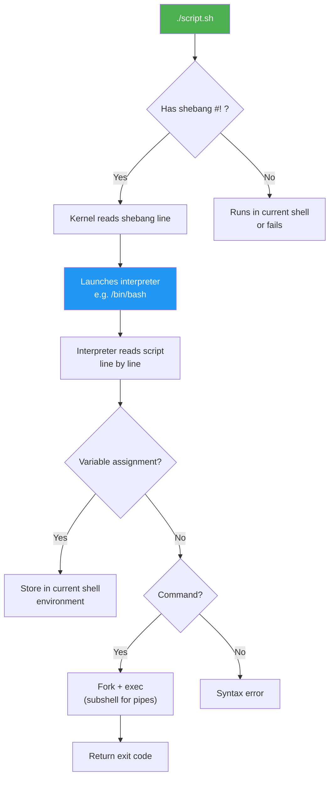
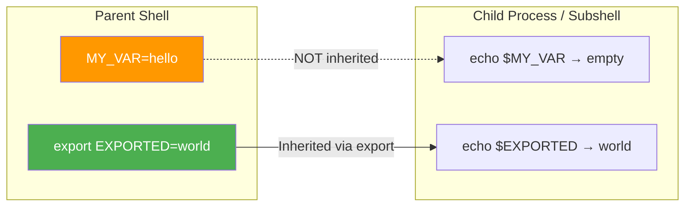

# 3.1.1 Shebangs, Variables, and Subshells: The Building Blocks

#### Why Scripting Matters

You have mastered Linux commands (Module 1) and networking (Module 2). Now you will combine them into **reusable, automated workflows**. Shell scripts are the glue of platform engineering:

* Automating deployment pipelines

* Collecting system health data

* Processing logs and configuration files

* Orchestrating backups and maintenance tasks

This note covers the **fundamental building blocks** of bash scripting. Note 3.1.2 covers loops, conditionals, and functions. Note 3.1.3 is the subchapter review.

### Script Execution Flow



### Variable Scope Overview



***

## Part 1: The Shebang – Telling the Kernel Which Interpreter

The **shebang** (`#!`) is the first line of a script. It tells the kernel which interpreter to use.

```bash
#!/bin/bash
# ^^^^^^^^ This is the shebang

echo "Hello, World!"
```

### Common Shebangs

| Shebang                  | Interpreter      | Use Case                                            |
| ------------------------ | ---------------- | --------------------------------------------------- |
| `#!/bin/bash`            | Bash             | Most scripts (full features)                        |
| `#!/bin/sh`              | POSIX shell      | Portable scripts (minimal features)                 |
| `#!/usr/bin/env bash`    | Bash (from PATH) | Portable across systems where bash is not in `/bin` |
| `#!/usr/bin/env python3` | Python3          | Python scripts                                      |
| `#!/bin/awk -f`          | Awk              | Awk scripts                                         |

### Why Shebang Matters

```bash
# Without execute permission, you need to specify interpreter
bash script.sh

# With shebang and execute permission, run directly
chmod +x script.sh
./script.sh
```

**Best practice:** Always use `#!/usr/bin/env bash` for maximum portability (finds bash in PATH).

```bash
#!/usr/bin/env bash
# Portable across Linux, macOS, BSD
```

***

## Part 2: Variables – Storing Data

### Variable Assignment and Expansion

```bash
# Assignment (NO spaces around =)
name="Alice"
count=42
path="/var/log/nginx"

# Variable expansion (use $ or ${})
echo $name
echo "${name}"  # Preferred (avoids ambiguity)
echo "Hello, ${name}!"  # Curly braces for complex expansion

# Command substitution – store command output
current_date=$(date)
files_count=$(ls -1 | wc -l)

# Legacy backtick syntax (avoid – harder to nest)
current_date=`date`
```

### Variable Naming Rules

| Rule                                     | Valid                | Invalid     |
| ---------------------------------------- | -------------------- | ----------- |
| Start with letter or underscore          | `_var`, `var1`       | `1var`      |
| Can contain letters, numbers, underscore | `user_name_123`      | `user-name` |
| Case-sensitive                           | `VAR` ≠ `var`        | –           |
| Avoid reserved words                     | `if`, `then`, `else` | –           |

### Types of Variables

| Type                       | Syntax             | Scope                                | Example           |
| -------------------------- | ------------------ | ------------------------------------ | ----------------- |
| **Local** (function)       | `local var=value`  | Inside function only                 | `local temp_file` |
| **Shell** (script)         | `var=value`        | Current script (not child processes) | `count=10`        |
| **Environment** (exported) | `export var=value` | Current script + child processes     | `export PATH`     |
| **Readonly**               | `readonly var=val` | Cannot be changed or unset           | `readonly PI=3.14`|

### Readonly Variables

Readonly variables cannot be modified or unset – useful for constants.

```bash
#!/usr/bin/env bash

# Declare readonly variable
readonly CONFIG_DIR="/etc/myapp"
readonly VERSION="1.0.0"

# Attempt to modify fails
CONFIG_DIR="/tmp"  # Error: CONFIG_DIR: readonly variable

# Make existing variable readonly
API_KEY="secret123"
readonly API_KEY

# Declare with readonly and export
declare -rx PRODUCTION=true  # -r readonly, -x export
```

### The `declare` Command

`declare` provides fine-grained control over variable attributes.

```bash
#!/usr/bin/env bash

# Integer variable (arithmetic only)
declare -i count=0
count=5+3
echo $count  # 8 (evaluated as arithmetic)

# Readonly variable
declare -r PI=3.14159

# Export variable
declare -x MY_VAR="exported"

# Array
declare -a fruits=("apple" "banana")

# Associative array (Bash 4+)
declare -A users
users["alice"]=1001

# Lowercase attribute
declare -l lower_name="ALICE"
echo $lower_name  # alice

# Uppercase attribute
declare -u upper_name="alice"
echo $upper_name  # ALICE

# Print function definition
declare -f my_function

# Print variable attributes
declare -p MY_VAR
# declare -x MY_VAR="exported"
```

| `declare` Option | Effect |
|------------------|--------|
| `-i` | Integer (arithmetic evaluation) |
| `-r` | Readonly |
| `-x` | Export to environment |
| `-a` | Indexed array |
| `-A` | Associative array |
| `-l` | Convert to lowercase |
| `-u` | Convert to uppercase |
| `-p` | Print variable definition |
| `-f` | Print function definition |

```bash
#!/usr/bin/env bash

# Shell variable (not inherited by child processes)
MY_VAR="hello"
echo $MY_VAR  # Works

# Environment variable (inherited by child processes)
export MY_ENV="world"
bash -c 'echo $MY_ENV'  # Outputs: world
```

### Special Variables (Memorize These)

| Variable        | Meaning                           | Example                                            |
| --------------- | --------------------------------- | -------------------------------------------------- |
| `$0`            | Script name                       | `./myscript.sh`                                    |
| `$1`, `$2`, ... | Positional parameters (arguments) | `./script.sh arg1 arg2` → `$1="arg1"`, `$2="arg2"` |
| `$#`            | Number of arguments               | `2`                                                |
| `$@`            | All arguments as separate words   | `"arg1" "arg2"`                                    |
| `$*`            | All arguments as single word      | `"arg1 arg2"`                                      |
| `$?`            | Exit code of last command         | `0` (success) or non-zero (failure)                |
| `$$`            | Current shell's PID               | `12345`                                            |
| `$!`            | PID of last background command    | `12346`                                            |

```bash
#!/usr/bin/env bash
echo "Script name: $0"
echo "First argument: $1"
echo "All arguments: $@"
echo "Number of arguments: $#"
```

### Default Values and Parameter Expansion

```bash
# Use default value if variable is unset or empty
echo "${var:-default}"   # Outputs "default" if var is unset/empty

# Assign default value
echo "${var:=default}"   # Sets var="default" and outputs it

# Error if variable is unset
echo "${var:?Error message}"  # Exits with error if var is unset

# Use alternate value if variable is set
echo "${var:+alternate}"  # Outputs "alternate" if var is set
```

**Practical example:**

```bash
#!/usr/bin/env bash

# Set default value for environment variable
DB_HOST="${DB_HOST:-localhost}"
DB_PORT="${DB_PORT:-5432}"

echo "Connecting to ${DB_HOST}:${DB_PORT}"
```

***

## Part 3: Quoting – Preventing Word Splitting and Expansion

| Quote Type              | Behavior                                        | Example                                     |
| ----------------------- | ----------------------------------------------- | ------------------------------------------- |
| **Double quotes (`"`)** | Allows variable expansion, command substitution | `echo "Hello $name"`                        |
| **Single quotes (`'`)** | Literal text (no expansion)                     | `echo 'Hello $name'` → prints `Hello $name` |
| **Backslash (`\`)**     | Escapes single character                        | `echo "Price: \$10"`                        |

### Why Quotes Matter – Word Splitting

```bash
# Without quotes – word splitting occurs
file_list="file1.txt file2.txt"
rm $file_list  # Actually runs: rm file1.txt file2.txt (OK here)

# Dangerous example
filename="My Document.txt"
touch $filename  # Creates TWO files: "My" and "Document.txt"!

# Correct: Use quotes
touch "$filename"  # Creates ONE file: "My Document.txt"
```

### Command Substitution with Quotes

```bash
# Double quotes preserve multi-line output
files="$(ls -l)"  # Preserves newlines
echo "$files"

# Without quotes, newlines become spaces
files=$(ls -l)    # All lines become one line
echo $files
```

**Best practice:** Always quote variables unless you explicitly need word splitting.

```bash
# Good
echo "$name"
cp "$source" "$dest"

# Bad (unless you know what you're doing)
echo $name
cp $source $dest
```

***

## Part 4: Here Documents, Here Strings, and Arithmetic

### Here Documents (`<<EOF`) — Multi-line Input

A **here document** feeds multi-line input to a command. Essential for generating configs, SQL queries, and multi-line output in scripts.

```bash
#!/usr/bin/env bash

# Basic here document — variable expansion happens
cat <<EOF
Hello, ${USER}!
Today is $(date +%A).
Your home is ${HOME}.
EOF

# Quoted delimiter — NO variable expansion (literal text)
cat <<'EOF'
This is literal: $USER $(date)
No expansion happens here.
EOF

# Indented here document (<<- strips leading TABS only)
if true; then
	cat <<-EOF
	This line can be indented with tabs.
	Keeps the script readable inside if/for blocks.
	EOF
fi

# Write config file from script
cat > /tmp/nginx.conf <<EOF
server {
    listen 80;
    server_name ${DOMAIN:-example.com};
    root /var/www/html;
}
EOF

# Pipe here document to another command
cat <<EOF | grep "error"
info: all good
error: disk full
info: recovered
EOF
```

| Syntax | Behavior |
|--------|----------|
| `<<EOF` | Expand variables and commands |
| `<<'EOF'` | Literal text (no expansion) |
| `<<-EOF` | Strip leading **tabs** (not spaces) |

### Here Strings (`<<<`) — Single-line Input

A **here string** passes a string as stdin to a command — avoids `echo | cmd` pipelines.

```bash
#!/usr/bin/env bash

# Instead of: echo "hello world" | wc -w
wc -w <<< "hello world"
# 2

# Parse a variable as input
line="alice,30,NYC"
IFS=',' read -r name age city <<< "$line"
echo "$name is $age in $city"

# Check if string contains a pattern
grep -q "error" <<< "$log_line" && echo "Error found!"

# Convert case with tr
upper=$(tr 'a-z' 'A-Z' <<< "hello")
echo "$upper"  # HELLO
```

### Arithmetic Operations (`$(( ))`, `(( ))`, `let`)

Bash supports integer arithmetic natively (no floating-point — use `bc` or `awk` for decimals).

```bash
#!/usr/bin/env bash

# Arithmetic expansion — returns value
result=$((5 + 3))         # 8
echo $(( 10 * 2 ))        # 20
echo $(( 100 / 3 ))       # 33 (integer division!)
echo $(( 2 ** 10 ))       # 1024 (exponentiation)
echo $(( 17 % 5 ))        # 2 (modulo)

# Arithmetic evaluation — for conditions / side effects
(( count++ ))              # Increment (no $ needed inside (( )))
(( total = price * qty ))

# Use in conditions (0 = false, non-zero = true)
if (( count > 10 )); then
    echo "Count exceeds 10"
fi

# Ternary-style
(( is_root = (EUID == 0) ? 1 : 0 ))

# Floating-point with bc
echo "scale=2; 100 / 3" | bc   # 33.33
pi=$(echo "scale=10; 4*a(1)" | bc -l)  # 3.1415926535
```

| Syntax | Purpose | Returns |
|--------|---------|---------|
| `$(( expr ))` | Arithmetic expansion | Value (string) |
| `(( expr ))` | Arithmetic evaluation | Exit code (0/1) |
| `let "expr"` | Same as `(( ))` | Exit code |
| `bc` | Floating-point math | Value (string) |

***

## Part 5: Subshells and Command Substitution

### Subshells – Running Commands in a Child Process

A **subshell** is a child process that inherits variables but cannot modify the parent.

```bash
# Run commands in subshell using parentheses
(
    cd /tmp
    echo "Inside subshell: $(pwd)"
)
# After subshell ends, back to original directory
echo "Outside: $(pwd)"

# Subshells are useful for temporary directory changes
(cd /var/log && ls *.log)  # Lists logs without changing current dir
```

### Process Substitution – Treating Command Output as a File

Process substitution makes command output appear as a file.

```bash
# Compare output of two commands without creating temp files
diff <(ls dir1) <(ls dir2)

# Read from process substitution
while read line; do
    echo "Line: $line"
done < <(grep "error" /var/log/syslog)
```

### Command Substitution vs Subshell vs Process Substitution

| Feature     | `$(command)`       | `(command)`               | `<(command)`           |
| ----------- | ------------------ | ------------------------- | ---------------------- |
| Purpose     | Capture output     | Run in child process      | Treat output as file   |
| Returns     | String             | Exit code                 | File descriptor        |
| Typical use | Assign to variable | Isolate directory changes | Pass to `diff`, `comm` |

***

## Part 6: Arrays – Storing Multiple Values

### Indexed Arrays

```bash
# Create indexed array
fruits=("apple" "banana" "orange")
fruits[3]="grape"

# Access elements
echo "${fruits[0]}"  # apple
echo "${fruits[@]}"  # all elements
echo "${#fruits[@]}" # length (number of elements)

# Iterate over array
for fruit in "${fruits[@]}"; do
    echo "Fruit: $fruit"
done

# Get indices
for i in "${!fruits[@]}"; do
    echo "Index $i: ${fruits[$i]}"
done
```

### Associative Arrays (Bash 4+)

Associative arrays use string keys (like dictionaries).

```bash
# Declare associative array
declare -A user_ids

# Assign values
user_ids["alice"]=1001
user_ids["bob"]=1002
user_ids["charlie"]=1003

# Access values
echo "${user_ids["alice"]}"  # 1001

# Iterate over keys
for user in "${!user_ids[@]}"; do
    echo "User $user has ID ${user_ids[$user]}"
done

# Check if key exists
if [[ -v user_ids["alice"] ]]; then
    echo "Alice exists"
fi
```

***

## Part 7: Creating and Running Scripts

### Script Template

```bash
#!/usr/bin/env bash
# Script: myscript.sh
# Description: Brief description of what this script does
# Author: Your Name
# Date: 2024-01-16

set -euo pipefail  # We'll cover this in 3.2.1

# Main script logic
main() {
    echo "Starting script..."
    # Your code here
}

# Run main function
main "$@"
```

### Making Scripts Executable

```bash
# Add execute permission
chmod +x myscript.sh

# Run script
./myscript.sh

# Run with debug (covered in 3.2.1)
bash -x myscript.sh
```

### Passing Arguments

```bash
#!/usr/bin/env bash
# script.sh

echo "First arg: $1"
echo "Second arg: $2"
echo "All args: $@"

# Shift removes first argument
shift
echo "After shift: $@"
```

```bash
./script.sh apple banana orange
# First arg: apple
# Second arg: banana
# All args: apple banana orange
# After shift: banana orange
```

***

## Quick Task: Scripting Practice

*Write and run a simple script.*

1. Create a script `info.sh` that prints:

   * Script name

   * Number of arguments

   * All arguments

   * Current date
2. Make the script executable and run it with arguments.
3. Create a script `backup.sh` that takes a filename as argument and creates a backup with `.bak` extension.
4. Use command substitution to store the current timestamp in a variable.

> **Ready Solution:**
>
> ```bash
> # Task 1: info.sh
> cat > info.sh << 'EOF'
> #!/usr/bin/env bash
> echo "Script name: $0"
> echo "Number of arguments: $#"
> echo "All arguments: $@"
> echo "Current date: $(date)"
> EOF
> chmod +x info.sh
> ./info.sh hello world 123
>
> # Task 2: backup.sh
> cat > backup.sh << 'EOF'
> #!/usr/bin/env bash
> filename="$1"
> if [ -f "$filename" ]; then
>     cp "$filename" "${filename}.bak"
>     echo "Backup created: ${filename}.bak"
> else
>     echo "Error: File $filename not found"
> fi
> EOF
> chmod +x backup.sh
> touch test.txt
> ./backup.sh test.txt
>
> # Task 3: Timestamp variable
> cat > timestamp.sh << 'EOF'
> #!/usr/bin/env bash
> timestamp=$(date +%Y%m%d_%H%M%S)
> echo "Backup_${timestamp}.tar.gz"
> EOF
> chmod +x timestamp.sh
> ./timestamp.sh
> ```

***

## Summary Table: Variables and Syntax

| Concept              | Syntax             | Example                     |
| -------------------- | ------------------ | --------------------------- |
| Variable assignment  | `var=value`        | `name="Alice"`              |
| Variable expansion   | `$var` or `${var}` | `echo "$name"`              |
| Command substitution | `$(command)`       | `date=$(date)`              |
| Subshell             | `(commands)`       | `(cd /tmp && ls)`           |
| Process substitution | `<(command)`       | `diff <(ls a) <(ls b)`      |
| Array (indexed)      | `arr=("a" "b")`    | `fruits=("apple" "banana")` |
| Array element        | `${arr[0]}`        | `echo "${fruits[0]}"`       |
| Associative array    | `declare -A arr`   | `declare -A users`          |
| Length of array      | `${#arr[@]}`       | `echo "${#fruits[@]}"`      |

### Special Variables

| Variable | Meaning                  |
| -------- | ------------------------ |
| `$0`     | Script name              |
| `$1-$9`  | Positional parameters    |
| `$#`     | Number of arguments      |
| `$@`     | All arguments (separate) |
| `$*`     | All arguments (single)   |
| `$?`     | Last command exit code   |
| `$$`     | Current PID              |
| `$!`     | Last background PID      |

### Quoting Rules

| Quote | Behavior         | Use When                      |
| ----- | ---------------- | ----------------------------- |
| `""`  | Allows expansion | Most variable usage           |
| `''`  | Literal text     | Fixed strings, regex patterns |
| `\`   | Escape character | Single special character      |

***

**Next note (3.1.2)** will cover **Loops, Conditionals, and Functions** – `if` statements, test operators, `for`/`while` loops, and defining reusable functions.

---

## Backlinks

**Module 1 Prerequisites:**
- [1.1.1 Linux Directory Structure](../../1-Linux/Subchapter_1.1/1.1.1_Linux_Directory_Structure_and_Navigation.md) - Basic navigation commands
- [1.2.2 File Permissions](../../1-Linux/Subchapter_1.2/1.2.2_File_Permissions_and_Ownership.md) - `chmod +x` for scripts
- [1.3.1 Process Management](../../1-Linux/Subchapter_1.3/1.3.1_Process_Management.md) - Exit codes (`$?`)

**Next Note:**
- [3.1.2 Loops, Conditionals, and Functions](./3.1.2_Loops_Conditionals_and_Functions.md)
