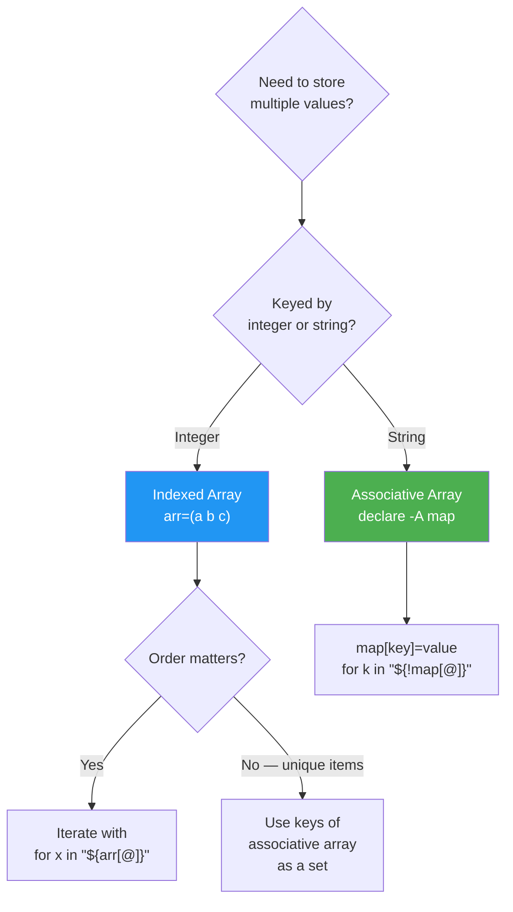

# 3.1.3 Arrays Deep Dive: Indexed and Associative Arrays

#### Why a Dedicated Note for Arrays

Notes 3.1.1 and 3.1.2 introduced arrays in passing. In real platform-engineering scripts — iterating over servers, collecting per-host stats, building option maps for `getopts`, parsing CSVs into structured data — arrays are the workhorse data structure. Getting them right (especially quoting `"${arr[@]}"`) is the difference between a script that works for one test case and one that survives production.

This note covers **everything** you need: declaration, iteration, slicing, deletion, copying, passing to functions, and the two array types — indexed and associative.

> **Important:** Bash arrays are **one-dimensional** and **string-indexed or integer-indexed** only. No nested arrays, no arrays of arrays. If you need that, it's time to switch to Python (see Module 9).

### Array Decision Flow



***

## Part 1 — Indexed Arrays: The Basics

```bash
# Three ways to create
fruits=("apple" "banana" "orange")         # literal
declare -a veggies                          # empty, explicit type
names=$(seq 1 5); nums=($names)             # from command output (risky — word splits)

# Preferred for command output (see gotcha below):
mapfile -t log_lines < /var/log/syslog
readarray -t users < <(cut -d: -f1 /etc/passwd)
```

> **Tip:** Use `mapfile -t` (alias `readarray -t`) to read lines into an array. It is safer than `arr=($(cmd))` because it does **not** do word splitting or globbing on the output.

### Accessing Elements

```bash
fruits=("apple" "banana" "orange" "grape")

echo "${fruits[0]}"       # apple     — first element
echo "${fruits[-1]}"      # grape     — negative index (Bash 4.3+)
echo "${fruits[@]}"       # apple banana orange grape
echo "${fruits[*]}"       # same, BUT joined by $IFS when quoted
echo "${#fruits[@]}"      # 4         — length
echo "${!fruits[@]}"      # 0 1 2 3   — all VALID indices (sparse-safe)
```

### `${arr[@]}` vs `${arr[*]}` — The Difference That Breaks Scripts

| Form | Unquoted | Quoted |
|------|----------|--------|
| `${arr[@]}` | Word-splits each element by `$IFS` | Each element stays **whole** — the correct choice for loops |
| `${arr[*]}` | Word-splits each element by `$IFS` | All elements joined into **one** string by `$IFS[0]` |

```bash
files=("My Doc.pdf" "Report 2024.xlsx")

# WRONG — splits on spaces in each filename
for f in ${files[@]}; do echo "  $f"; done
# Outputs: My, Doc.pdf, Report, 2024.xlsx

# CORRECT — preserves each element
for f in "${files[@]}"; do echo "  $f"; done
# Outputs: My Doc.pdf, Report 2024.xlsx
```

> **Warning:** The **single most common array bug** is forgetting the quotes. Always write `"${arr[@]}"` — memorise it as one token.

***

## Part 2 — Adding, Updating, Removing

```bash
arr=("a" "b" "c")

# Append
arr+=("d")                    # arr = a b c d
arr+=("e" "f")                # arr = a b c d e f

# Prepend (no built-in — reassign)
arr=("z" "${arr[@]}")

# Update by index
arr[1]="B"                    # arr = z a B c d e f

# Delete single element (leaves a "hole" — sparse array!)
unset 'arr[2]'                # arr[2] is gone; indices 0, 1, 3, ... still exist
echo "${#arr[@]}"             # length drops by 1
echo "${arr[@]}"              # values print fine
echo "${!arr[@]}"             # indices: 0 1 3 4 5 6   ← sparse!

# Re-pack to remove holes
arr=("${arr[@]}")             # now 0..5, contiguous

# Empty the whole array
unset arr                     # removes the variable
arr=()                        # keeps it, but empty
```

> **Caution:** After `unset 'arr[2]'` the array is **sparse** — index 2 is missing, so `for i in $(seq 0 ${#arr[@]}); do ...` will skip the wrong positions. Always iterate with `for x in "${arr[@]}"` or `for i in "${!arr[@]}"`.

***

## Part 3 — Slicing and Substring Ops

```bash
letters=("a" "b" "c" "d" "e" "f" "g")

# Slice:  ${arr[@]:start:length}
echo "${letters[@]:2:3}"      # c d e
echo "${letters[@]:4}"        # e f g   (to end)
echo "${letters[@]: -2}"      # f g     (last 2 — mind the SPACE before -2)

# Substring operations work on individual elements
file="app.log.2024.gz"
echo "${file%.gz}"            # app.log.2024       — strip shortest trailing match
echo "${file%%.*}"            # app                — strip longest trailing match
echo "${file#*.}"             # log.2024.gz        — strip shortest leading match
echo "${file##*.}"            # gz                 — strip longest leading match

# Apply to every element
paths=("/tmp/a.log" "/tmp/b.log" "/tmp/c.log")
echo "${paths[@]##*/}"        # a.log b.log c.log
echo "${paths[@]%.log}"       # /tmp/a /tmp/b /tmp/c
```

***

## Part 4 — Iteration Patterns (Memorise These)

```bash
arr=("alpha" "beta" "gamma")

# (1) Iterate values — 95% of the time you want this
for x in "${arr[@]}"; do
    echo ">> $x"
done

# (2) Iterate indices and values
for i in "${!arr[@]}"; do
    echo "${i}: ${arr[$i]}"
done

# (3) C-style numeric loop
for ((i = 0; i < ${#arr[@]}; i++)); do
    echo "${i}: ${arr[i]}"
done

# (4) While + mapfile — reading files into arrays safely
mapfile -t lines < /etc/hosts
for line in "${lines[@]}"; do
    [[ "$line" =~ ^\s*# ]] && continue      # skip comments
    [[ -z "$line" ]]      && continue       # skip blanks
    echo "HOST: $line"
done

# (5) Read lines from command output, NUL-delimited for safety with weird filenames
declare -a big_files=()
while IFS= read -r -d '' f; do
    big_files+=("$f")
done < <(find /var/log -size +10M -print0)
echo "Found ${#big_files[@]} large files"
```

> **Tip:** For file names specifically, always use `-print0` with `find` and `read -d ''` in a loop. Newlines, spaces, and even backslashes in filenames exist in the wild and will break naive `for f in $(find ...)` patterns.

***

## Part 5 — Associative Arrays (String Keys)

Associative arrays are Bash's dictionary/map/hash equivalent. Require **Bash 4.0 or newer** — macOS still ships with 3.2, so test with `bash --version` before relying on these.

```bash
# MUST be declared explicitly — no literal shorthand
declare -A users

# Assign
users["alice"]=1001
users["bob"]=1002
users["carol"]=1003

# Or bulk-assign at declaration
declare -A colors=(
    [red]="#ff0000"
    [green]="#00ff00"
    [blue]="#0000ff"
)

# Access
echo "${users[alice]}"           # 1001
echo "${colors[red]}"            # #ff0000

# All values / all keys
echo "${colors[@]}"              # #ff0000 #00ff00 #0000ff  (order NOT guaranteed)
echo "${!colors[@]}"             # red green blue

# Length
echo "${#colors[@]}"             # 3

# Check key exists (without accidentally creating it)
if [[ -v users[alice] ]]; then echo "alice exists"; fi   # Bash 4.2+
if [[ -n "${users[alice]+x}" ]]; then echo "alice exists"; fi    # portable

# Delete
unset 'users[bob]'

# Iterate — ALWAYS both quote AND use ${!arr[@]}
for user in "${!users[@]}"; do
    echo "${user} → UID ${users[$user]}"
done
```

> **Warning:** Associative array iteration order is **undefined**. If you need sorted output, pipe through `sort`:
>
> ```bash
> for k in $(printf '%s\n' "${!colors[@]}" | sort); do
>     echo "$k → ${colors[$k]}"
> done
> ```

### Using an Associative Array as a Set

A common pattern — track "have I seen this?":

```bash
declare -A seen
for ip in 10.0.0.1 10.0.0.2 10.0.0.1 10.0.0.3 10.0.0.2; do
    if [[ -z "${seen[$ip]:-}" ]]; then
        echo "First time seeing: $ip"
        seen[$ip]=1
    fi
done
```

***

## Part 6 — Copying, Combining, Sorting

```bash
# Copy (deep enough for Bash — elements are strings)
src=("a" "b" "c")
dst=("${src[@]}")

# Concatenate
a=(1 2 3)
b=(4 5 6)
combined=("${a[@]}" "${b[@]}")    # 1 2 3 4 5 6

# Sort (uniq, numeric, reverse — pipe through sort)
fruits=("banana" "apple" "cherry" "apple")
sorted=($(printf '%s\n' "${fruits[@]}" | sort -u))      # apple banana cherry

# Reverse order
rev=()
for ((i = ${#fruits[@]} - 1; i >= 0; i--)); do
    rev+=("${fruits[i]}")
done
```

> **Caution:** `sorted=($(...))` does word-splitting and globbing on the output. Safer for complex values:
>
> ```bash
> mapfile -t sorted < <(printf '%s\n' "${fruits[@]}" | sort -u)
> ```

***

## Part 7 — Arrays and Functions

Bash does **not** pass arrays by reference or value directly. Two proven patterns:

### Pattern A — Expand Into Positional Parameters (Most Common)

```bash
print_all() {
    local -a items=("$@")            # capture into local array
    echo "Got ${#items[@]} items:"
    for x in "${items[@]}"; do
        echo "  - $x"
    done
}

fruits=("apple" "banana" "cherry")
print_all "${fruits[@]}"              # expand with "${arr[@]}"
```

### Pattern B — `nameref` (Bash 4.3+)

```bash
show_sorted() {
    local -n arr_ref=$1               # nameref — caller's variable
    printf '%s\n' "${arr_ref[@]}" | sort
}

fruits=("banana" "apple" "cherry")
show_sorted fruits                    # pass the NAME, not the expansion
```

> **Tip:** Pattern B is cleaner for multiple arrays, but **nameref names must not collide** with the caller's variable name — use a `_ref` suffix to avoid shadowing.

***

## Part 8 — Real-World Examples

### Example 1: Parsing `getopts` Options Into a Config Map

```bash
#!/usr/bin/env bash
set -euo pipefail

declare -A config=(
    [env]="dev"
    [region]="us-east-1"
    [dry_run]="false"
)

while getopts "e:r:n" opt; do
    case "$opt" in
        e) config[env]="$OPTARG" ;;
        r) config[region]="$OPTARG" ;;
        n) config[dry_run]="true" ;;
        *) exit 1 ;;
    esac
done

echo "Config:"
for k in env region dry_run; do
    printf '  %-10s = %s\n' "$k" "${config[$k]}"
done
```

### Example 2: Counting Occurrences (Histogram)

```bash
#!/usr/bin/env bash
# Count HTTP status codes in an access log

declare -A counts
while read -r _ _ _ _ _ status _; do
    counts[$status]=$(( ${counts[$status]:-0} + 1 ))
done < /var/log/nginx/access.log

# Sort by count descending
for code in $(for k in "${!counts[@]}"; do
                  printf '%s %s\n' "${counts[$k]}" "$k"
              done | sort -rn | awk '{print $2}'); do
    printf '%-5s %d\n' "$code" "${counts[$code]}"
done
```

### Example 3: Health-Checking a List of Services

```bash
#!/usr/bin/env bash
set -uo pipefail

declare -A endpoints=(
    [api]="https://api.example.com/health"
    [web]="https://example.com"
    [cache]="http://redis.local:8001/ping"
)

declare -A results

for name in "${!endpoints[@]}"; do
    if curl -sf --max-time 5 "${endpoints[$name]}" > /dev/null; then
        results[$name]="OK"
    else
        results[$name]="FAIL (exit $?)"
    fi
done

# Report
for name in "${!results[@]}"; do
    printf '%-10s %s\n' "$name" "${results[$name]}"
done
```

***

## Part 9 — Gotchas Cheatsheet

| Gotcha | Fix |
|--------|-----|
| `arr=($(cmd))` word-splits and globs | Use `mapfile -t arr < <(cmd)` |
| `for f in ${arr[@]}` splits filenames with spaces | Always quote: `for f in "${arr[@]}"` |
| `${#arr}` gives length of `arr[0]`, not array | Use `${#arr[@]}` |
| `unset arr[2]` leaves sparse indices | Re-pack: `arr=("${arr[@]}")` |
| Associative array exists only in Bash 4+ | `declare -A` will error on old Bash — check `${BASH_VERSINFO[0]}` |
| Iteration order of `${!map[@]}` is unordered | Pipe through `sort` if order matters |
| Cannot return an array from a function | Echo with `printf '%s\0'` and `mapfile -d ''` in caller |
| `${arr[*]}` joins with `$IFS[0]` — surprising | Use `${arr[@]}` unless you explicitly want joining |

***

## Quick Task

1. Read `/etc/passwd` into an indexed array of lines, then build an associative array mapping **username → shell** for every user whose shell is not `/usr/sbin/nologin`.
2. Print the result sorted by username.
3. Report how many users were skipped.

> **Ready Solution:**
>
> ```bash
> #!/usr/bin/env bash
> set -euo pipefail
>
> mapfile -t lines < /etc/passwd
>
> declare -A user_shell
> skipped=0
> for line in "${lines[@]}"; do
>     IFS=':' read -r user _ _ _ _ _ shell <<< "$line"
>     if [[ "$shell" == "/usr/sbin/nologin" || "$shell" == "/sbin/nologin" || "$shell" == "/bin/false" ]]; then
>         (( skipped++ ))
>         continue
>     fi
>     user_shell[$user]="$shell"
> done
>
> for u in $(printf '%s\n' "${!user_shell[@]}" | sort); do
>     printf '  %-16s → %s\n' "$u" "${user_shell[$u]}"
> done
> echo "Skipped: $skipped nologin/false users"
> ```

***

## Summary Table

| Operation | Indexed | Associative |
|-----------|---------|-------------|
| Declare | `arr=()`, `declare -a arr` | `declare -A arr` |
| Set | `arr[0]="v"` | `arr[key]="v"` |
| Get | `"${arr[0]}"` | `"${arr[key]}"` |
| All values | `"${arr[@]}"` | `"${arr[@]}"` |
| All keys | `"${!arr[@]}"` | `"${!arr[@]}"` |
| Length | `"${#arr[@]}"` | `"${#arr[@]}"` |
| Append | `arr+=("v")` | n/a |
| Delete | `unset 'arr[0]'` | `unset 'arr[key]'` |
| Exists | `[[ -v arr[0] ]]` | `[[ -v arr[key] ]]` |
| Iterate values | `for x in "${arr[@]}"` | `for x in "${arr[@]}"` |
| Iterate keys | `for i in "${!arr[@]}"` | `for k in "${!arr[@]}"` |

***

**Next note (3.1.4)** is the **Subchapter Review** for all of 3.1 — shebangs, variables, control flow, functions, and arrays — with a cheatsheet and interview questions.

---

## Backlinks

**Subchapter 3.1 Prerequisites:**
- [3.1.1 Shebangs, Variables, and Subshells](./3.1.1_Shebangs_Variables_and_Subshells.md) — `declare`, quoting, variable scope
- [3.1.2 Loops, Conditionals, and Functions](./3.1.2_Loops_Conditionals_and_Functions.md) — `for`, `while`, `read`, `mapfile`

**Module 1 Connection:**
- [1.8.2 Sed and Awk Fundamentals](../../1-Linux/Subchapter_1.8/1.8.2_Sed_and_Awk_Fundamentals.md) — alternative structured-data tools

**Next Note:**
- [3.1.4 Subchapter Review](./3.1.4_Subchapter_Review.md)
