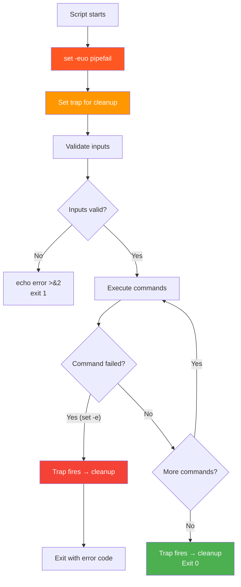
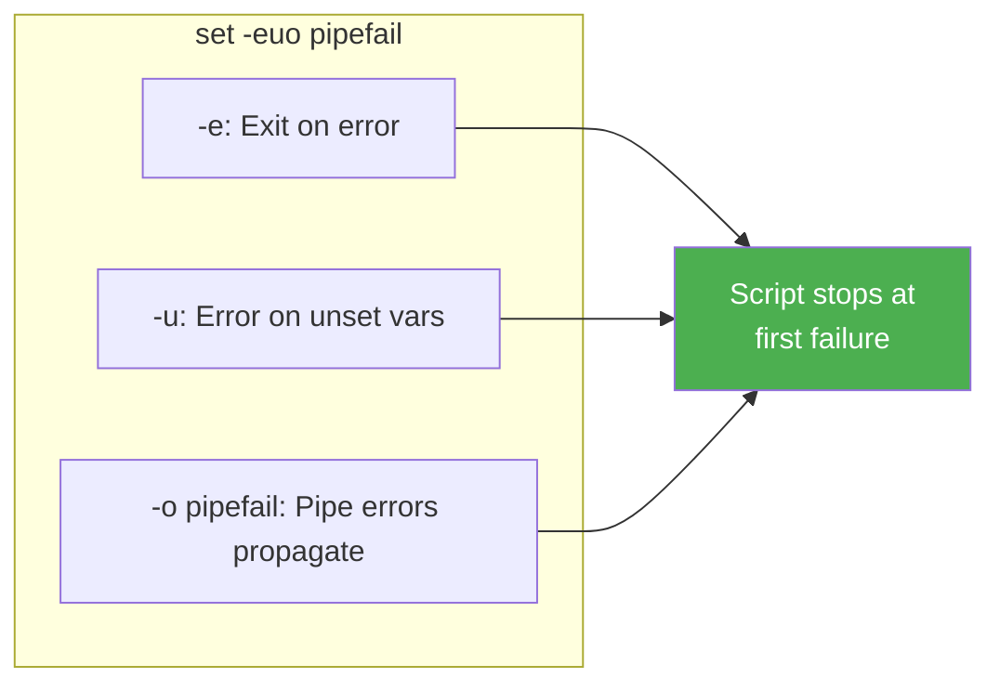

# 3.2.1 Error Handling and Debugging: Writing Bulletproof Scripts

#### Why Error Handling Matters

Scripts that assume everything works perfectly are **dangerous** in production. A single failed command can corrupt data, leave systems in inconsistent states, or silently ignore critical failures. Robust scripts:

* Stop on errors (don't continue after failure)

* Validate assumptions (files exist, commands are available)

* Clean up resources on exit (temp files, background processes)

* Log actions for auditing and debugging

This note covers exit codes, `set` options, traps, and debugging techniques. Note 3.2.2 covers string manipulation and regex; note 3.2.3 is the subchapter review.

### Error Handling Strategy Flow



### The `set` Options Shield



***

## Part 1: Exit Codes – The Language of Success/Failure

Every command returns an **exit code** (0–255) when it finishes:

* **0** – Success

* **1–255** – Failure (specific meaning varies by command)

```bash
# Check exit code of last command
true   # Command that always succeeds
echo $?  # 0

false  # Command that always fails
echo $?  # 1

# Use exit codes in conditions
if grep -q "error" /var/log/syslog; then
    echo "Found errors in log"
fi

# Or explicitly check
grep -q "error" /var/log/syslog
if [[ $? -eq 0 ]]; then
    echo "Found errors"
fi
```

### Common Exit Codes

| Code | Meaning                                           |
| ---- | ------------------------------------------------- |
| 0    | Success                                           |
| 1    | General error (catch-all)                         |
| 2    | Misuse of shell built-in (e.g., missing argument) |
| 126  | Command found but not executable                  |
| 127  | Command not found                                 |
| 128  | Invalid argument to exit                          |
| 130  | Script terminated by Ctrl+C (SIGINT)              |
| 137  | Script killed by SIGKILL (kill -9)                |

### Setting Exit Codes in Scripts

```bash
#!/usr/bin/env bash

# Exit with custom code
if [[ ! -f "$config_file" ]]; then
    echo "ERROR: Config file not found: $config_file"
    exit 2  # Custom code for missing config
fi

# Success
exit 0
```

***

## Part 2: The `set` Options – Stricter Error Handling

The `set` command changes how Bash behaves when errors occur. **Always include** **`set -euo pipefail`** at the top of production scripts.

### Set Options Summary

| Option            | Effect                                | When to Use |
| ----------------- | ------------------------------------- | ----------- |
| `set -e`          | Exit immediately if any command fails | **Always**  |
| `set -u`          | Treat unset variables as errors       | **Always**  |
| `set -o pipefail` | Pipeline fails if any command fails   | **Always**  |
| `set -x`          | Print commands before execution       | Debugging   |
| `set -C`          | Prevent overwriting files with `>`    | Safety      |

### `set -e` – Exit on Error

Without `set -e`, a script continues after failures – often disastrous.

```bash
#!/usr/bin/env bash
# WITHOUT set -e (dangerous)

cd /nonexistent/directory   # This fails
rm -rf *                    # This runs in current directory! (disaster)
```

```bash
#!/usr/bin/env bash
set -e  # Exit immediately on error

cd /nonexistent/directory   # Script exits here
rm -rf *                    # Never reaches this line
```

**Exceptions to** **`set -e`:** Some commands should be allowed to fail.

```bash
# Command that may fail (expected failure)
grep "pattern" file.txt || true  # Always succeeds

# Check failure explicitly
if grep "pattern" file.txt; then
    echo "Found"
else
    echo "Not found"  # This runs even with set -e
fi
```

### `set -u` – Error on Unset Variables

Without `set -u`, unset variables become empty strings – causing subtle bugs.

```bash
#!/usr/bin/env bash
# WITHOUT set -u

echo "Deleting ${DIRECTORY}/*"  # If DIRECTORY unset, deletes /* (disaster!)
```

```bash
#!/usr/bin/env bash
set -u  # Error on unset variables

echo "Deleting ${DIRECTORY}/*"  # Script exits with error
```

**Handling optional variables with defaults:**

```bash
set -u

# Use default value (prevents error)
DB_HOST="${DB_HOST:-localhost}"

# Or check if set
if [[ -z "${DB_PASSWORD+x}" ]]; then
    echo "ERROR: DB_PASSWORD is not set"
    exit 1
fi
```

### `set -o pipefail` – Pipeline Fails if Any Command Fails

Without `pipefail`, only the last command's exit code matters.

```bash
# Without pipefail – grep fails but exit code is 0 (from echo)
grep "error" file.txt | wc -l
echo $?  # 0 (because wc -l succeeded)
```

```bash
set -o pipefail

# With pipefail – grep failure causes pipeline to fail
grep "error" file.txt | wc -l
echo $?  # 1 (grep failed)
```

### Additional Useful Set Options

```bash
# Prevent overwriting files with > (use >| to force)
set -o noclobber
echo "data" > file.txt   # Error if file exists
echo "data" >| file.txt  # Force overwrite

# Disable globbing (treat * literally)
set -f
echo *.txt  # Prints literal "*.txt" not matching files
set +f      # Re-enable globbing

# Enable noclobber
set -C      # Same as set -o noclobber
```

| Option | Short | Effect |
|--------|-------|--------|
| `set -o noclobber` | `set -C` | Prevent accidental file overwrite |
| `set -o noglob` | `set -f` | Disable filename globbing |
| `set -o nounset` | `set -u` | Error on unset variables |
| `set -o errexit` | `set -e` | Exit on command failure |

### The Full Production Header

```bash
#!/usr/bin/env bash
set -euo pipefail

# Optional: Print each command (debug mode)
# set -x

# Rest of script...
```

***

## Part 3: Traps – Cleaning Up on Exit

Traps execute commands when the script receives signals or exits. Essential for cleaning up temporary files, killing background processes, or restoring state.

### Trap Syntax

```bash
trap 'commands' SIGNAL
```

### Common Signals

| Signal | Number | Trigger                        |
| ------ | ------ | ------------------------------ |
| `EXIT` | 0      | Script exits (normal or error) |
| `INT`  | 2      | Ctrl+C (interrupt)             |
| `TERM` | 15     | `kill` command (default)       |
| `HUP`  | 1      | Hangup (terminal closed)       |

### Practical Trap Examples

**Example 1: Clean up temporary files**

```bash
#!/usr/bin/env bash
set -euo pipefail

# Create temp file
temp_file=$(mktemp)

# Set trap to delete on exit
cleanup() {
    echo "Cleaning up..."
    rm -f "$temp_file"
}
trap cleanup EXIT

# Script logic
echo "Data" > "$temp_file"
# ... script may exit early
# trap will still run
```

**Example 2: Kill background processes**

```bash
#!/usr/bin/env bash
set -euo pipefail

# Start background process
tail -f /var/log/syslog &
background_pid=$!

# Kill background process on exit
cleanup() {
    echo "Killing background process $background_pid"
    kill "$background_pid" 2>/dev/null
}
trap cleanup EXIT INT TERM

# Script continues...
sleep 100
```

**Example 3: Restore configuration**

```bash
#!/usr/bin/env bash
set -euo pipefail

# Backup original config
cp /etc/nginx/nginx.conf /tmp/nginx.conf.bak

restore_config() {
    echo "Restoring original configuration..."
    mv /tmp/nginx.conf.bak /etc/nginx/nginx.conf
    systemctl reload nginx
}
trap restore_config EXIT INT TERM

# Modify config (if script fails, config is restored)
sed -i 's/worker_connections 1024/worker_connections 4096/' /etc/nginx/nginx.conf
systemctl reload nginx

# If script succeeds, remove trap
trap - EXIT
rm -f /tmp/nginx.conf.bak
```

### Multiple Traps

```bash
#!/usr/bin/env bash

cleanup_temp() {
    rm -f /tmp/my_temp_file
}

cleanup_services() {
    kill $background_pid 2>/dev/null
}

# Set multiple traps (last one wins for same signal)
trap cleanup_temp EXIT
trap cleanup_services EXIT  # Overwrites previous EXIT trap

# Better: Single trap function
cleanup() {
    cleanup_temp
    cleanup_services
}
trap cleanup EXIT INT TERM
```

***

## Part 4: Debugging Techniques

### `set -x` – Print Commands Before Execution

```bash
#!/usr/bin/env bash
set -x  # Enable debugging

for i in {1..3}; do
    echo "Number: $i"
done
set +x  # Disable debugging

echo "Debugging off for this line"
```

**Output:**

```
+ for i in '{1..3}'
+ echo 'Number: 1'
Number: 1
+ for i in '{1..3}'
+ echo 'Number: 2'
Number: 2
+ for i in '{1..3}'
+ echo 'Number: 3'
Number: 3
+ set +x
Debugging off for this line
```

### Debugging with Environment Variable

```bash
#!/usr/bin/env bash

# Enable debug if DEBUG=1
if [[ "${DEBUG:-0}" -eq 1 ]]; then
    set -x
fi

# Or one-liner
[ "${DEBUG:-0}" -eq 1 ] && set -x
```

```bash
DEBUG=1 ./myscript.sh  # Run with debugging
```

### Debugging Specific Sections

```bash
#!/usr/bin/env bash

echo "Normal output"

set -x
# This section will be debugged
complex_function
another_command
set +x

echo "Back to normal"
```

### Using `trap DEBUG` for Line-by-Line Tracing

```bash
#!/usr/bin/env bash

# Print each line before execution
trap 'echo "Line $LINENO: $BASH_COMMAND"' DEBUG

echo "Hello"
x=5
echo "x = $x"
```

### Checking Syntax Without Running

```bash
# Check syntax (no execution)
bash -n myscript.sh

# Check syntax with verbose
bash -v -n myscript.sh
```

***

## Part 5: Logging Best Practices

### Basic Logging with `logger` (syslog)

```bash
#!/usr/bin/env bash

# Log to syslog
logger "Script started"

if some_command; then
    logger -p user.info "Operation succeeded"
else
    logger -p user.err "Operation failed"
    exit 1
fi

# Check logs
# On Debian/Ubuntu: grep "script" /var/log/syslog
# On RHEL/Rocky: grep "script" /var/log/messages
```

### Custom Logging Function

```bash
#!/usr/bin/env bash

# Log levels
LOG_LEVEL_INFO=1
LOG_LEVEL_WARN=2
LOG_LEVEL_ERROR=3
LOG_LEVEL_DEBUG=4

# Current log level (set via environment)
LOG_LEVEL="${LOG_LEVEL:-1}"

log_info() {
    if [[ $LOG_LEVEL -ge 1 ]]; then
        echo "[INFO] $(date '+%Y-%m-%d %H:%M:%S') - $*" | tee -a /var/log/myapp.log
    fi
}

log_warn() {
    if [[ $LOG_LEVEL -ge 2 ]]; then
        echo "[WARN] $(date '+%Y-%m-%d %H:%M:%S') - $*" | tee -a /var/log/myapp.log
    fi
}

log_error() {
    if [[ $LOG_LEVEL -ge 3 ]]; then
        echo "[ERROR] $(date '+%Y-%m-%d %H:%M:%S') - $*" | tee -a /var/log/myapp.log >&2
    fi
}

log_debug() {
    if [[ $LOG_LEVEL -ge 4 ]]; then
        echo "[DEBUG] $(date '+%Y-%m-%d %H:%M:%S') - $*" | tee -a /var/log/myapp.log
    fi
}

# Usage
log_info "Starting backup"
log_debug "Debug information"
log_warn "Disk usage high"
log_error "Backup failed"
```

### Redirecting All Output to Log File

```bash
#!/usr/bin/env bash

LOG_FILE="/var/log/deploy.log"

# Redirect stdout and stderr to log file
exec > >(tee -a "$LOG_FILE") 2>&1

echo "This goes to both terminal and log file"
ls /nonexistent  # Error also captured
```

***

## Part 6: Complete Production Script Template

```bash
#!/usr/bin/env bash
# ============================================================================
# Script: deploy_service.sh
# Description: Deploys a service with error handling and logging
# Usage: ./deploy_service.sh [environment]
# ============================================================================

set -euo pipefail

# Configuration
readonly SCRIPT_NAME="$(basename "$0")"
readonly SCRIPT_DIR="$(cd "$(dirname "${BASH_SOURCE[0]}")" && pwd)"
readonly LOG_DIR="/var/log/myapp"
readonly LOG_FILE="${LOG_DIR}/deploy.log"
readonly ENVIRONMENT="${1:-production}"

# Log levels
LOG_LEVEL="${LOG_LEVEL:-2}"  # 1=info, 2=warn, 3=error

# ============================================================================
# Logging functions
# ============================================================================

init_logging() {
    mkdir -p "$LOG_DIR"
    exec > >(tee -a "$LOG_FILE") 2>&1
}

log_info() {
    if [[ ${LOG_LEVEL} -le 1 ]]; then
        echo "[INFO] $(date '+%Y-%m-%d %H:%M:%S') - $*"
    fi
}

log_error() {
    echo "[ERROR] $(date '+%Y-%m-%d %H:%M:%S') - $*" >&2
}

# ============================================================================
# Error handling
# ============================================================================

cleanup() {
    log_info "Cleaning up temporary files..."
    # Remove temp files here
    # Kill background processes here
}

trap cleanup EXIT INT TERM

# ============================================================================
# Validation functions
# ============================================================================

check_command() {
    if ! command -v "$1" &>/dev/null; then
        log_error "Required command '$1' not found"
        exit 1
    fi
}

check_file() {
    if [[ ! -f "$1" ]]; then
        log_error "Required file '$1' not found"
        exit 1
    fi
}

# ============================================================================
# Main functions
# ============================================================================

validate_environment() {
    case "$ENVIRONMENT" in
        production|staging|development)
            log_info "Deploying to $ENVIRONMENT environment"
            ;;
        *)
            log_error "Invalid environment: $ENVIRONMENT"
            echo "Usage: $SCRIPT_NAME {production|staging|development}"
            exit 1
            ;;
    esac
}

deploy() {
    log_info "Starting deployment"
    
    # Your deployment logic here
    echo "Deploying to $ENVIRONMENT..."
    
    log_info "Deployment completed"
}

# ============================================================================
# Main execution
# ============================================================================

main() {
    init_logging
    log_info "=== $SCRIPT_NAME started ==="
    
    # Validate prerequisites
    check_command "docker"
    check_command "kubectl"
    check_file "/etc/myapp/config.yaml"
    
    validate_environment
    deploy
    
    log_info "=== $SCRIPT_NAME completed ==="
}

main "$@"
```

***

## Quick Task: Error Handling Practice

*Write scripts that demonstrate error handling techniques.*

1. Write a script with `set -euo pipefail` that copies a file and exits with appropriate error if source doesn't exist.
2. Add a trap that prints "Script interrupted" on Ctrl+C.
3. Create a temporary file with `mktemp` and ensure it's deleted on exit.
4. Enable debug mode with an environment variable `DEBUG=1`.

> **Ready Solution:**
>
> ```bash
> # Task 1-3: Complete script
> cat > robust_copy.sh << 'EOF'
> #!/usr/bin/env bash
> set -euo pipefail
>
> cleanup() {
>     echo "Cleaning up: removing $temp_file"
>     rm -f "$temp_file"
> }
> trap cleanup EXIT INT TERM
>
> # Create temp file
> temp_file=$(mktemp)
> echo "Temp file: $temp_file"
>
> # Check source file
> source_file="${1:-}"
> if [[ -z "$source_file" ]]; then
>     echo "ERROR: No source file specified"
>     exit 1
> fi
>
> if [[ ! -f "$source_file" ]]; then
>     echo "ERROR: Source file '$source_file' not found"
>     exit 1
> fi
>
> # Copy file
> cp "$source_file" "$temp_file"
> echo "File copied to $temp_file"
>
> # Simulate work
> sleep 2
> echo "Done"
> EOF
> chmod +x robust_copy.sh
>
> # Test with missing file
> ./robust_copy.sh missing.txt
>
> # Test with Ctrl+C (run and press Ctrl+C)
> ./robust_copy.sh /etc/passwd
> # Press Ctrl+C during sleep
>
> # Task 4: Debug mode
> cat > debug_example.sh << 'EOF'
> #!/usr/bin/env bash
> set -euo pipefail
>
> # Enable debug if DEBUG=1
> if [[ "${DEBUG:-0}" -eq 1 ]]; then
>     set -x
> fi
>
> echo "Hello"
> x=5
> echo "x = $x"
> EOF
> chmod +x debug_example.sh
>
> # Normal run
> ./debug_example.sh
>
> # Debug run
> DEBUG=1 ./debug_example.sh
> ```

***

## Summary Table: Error Handling Commands

| Command/Option    | Effect                              | Use Case               |
| ----------------- | ----------------------------------- | ---------------------- |
| `set -e`          | Exit on any command failure         | Production scripts     |
| `set -u`          | Error on unset variables            | Catch typos            |
| `set -o pipefail` | Pipeline fails if any command fails | Safe pipelines         |
| `set -x`          | Print commands before execution     | Debugging              |
| `set +x`          | Disable command printing            | End debug section      |
| `trap 'cmd' EXIT` | Run on script exit                  | Cleanup                |
| `trap 'cmd' INT`  | Run on Ctrl+C                       | Graceful shutdown      |
| `command -v`      | Check if command exists             | Validate prerequisites |
| `mktemp`          | Create temporary file safely        | Temp files             |
| `logger`          | Log to syslog                       | Centralized logging    |

### Exit Codes Reference

| Code | Meaning                        | When to Use        |
| ---- | ------------------------------ | ------------------ |
| 0    | Success                        | Normal exit        |
| 1    | General error                  | Catch-all failure  |
| 2    | Misuse (e.g., wrong arguments) | Invalid input      |
| 126  | Command not executable         | Permission issue   |
| 127  | Command not found              | Missing dependency |

### Trap Signals Reference

| Signal  | Number | Trigger                  | Common Use                 |
| ------- | ------ | ------------------------ | -------------------------- |
| `EXIT`  | 0      | Script ends (any reason) | Cleanup temp files         |
| `INT`   | 2      | Ctrl+C                   | Graceful shutdown          |
| `TERM`  | 15     | `kill` command           | Cleanup before termination |
| `HUP`   | 1      | Terminal closed          | Reload config              |
| `DEBUG` | N/A    | Before each command      | Line-by-line tracing       |

***

**Next note (3.2.2)** will cover **String Manipulation and Regular Expressions** – parameter expansion, pattern matching, regex with `=~`, and integrating `grep`/`sed`/`awk`.

---

## Backlinks

**Subchapter 3.1 Prerequisites:**
- [3.1.1 Shebangs, Variables, and Subshells](../Subchapter_3.1/3.1.1_Shebangs_Variables_and_Subshells.md) - Variables, special parameters
- [3.1.2 Loops, Conditionals, and Functions](../Subchapter_3.1/3.1.2_Loops_Conditionals_and_Functions.md) - Conditionals, functions

**Module 1 Prerequisites:**
- [1.3.1 Process Management](../../1-Linux/Subchapter_1.3/1.3.1_Process_Management.md) - Exit codes (`$?`), signals
- [1.4.1 Text Processing](../../1-Linux/Subchapter_1.4/1.4.1_Text_Processing_grep_sed_awk.md) - grep, sed, awk

**Next Note:**
- [3.2.2 String Manipulation and Regular Expressions](./3.2.2_String_Manipulation_and_Regular_Expressions.md)
