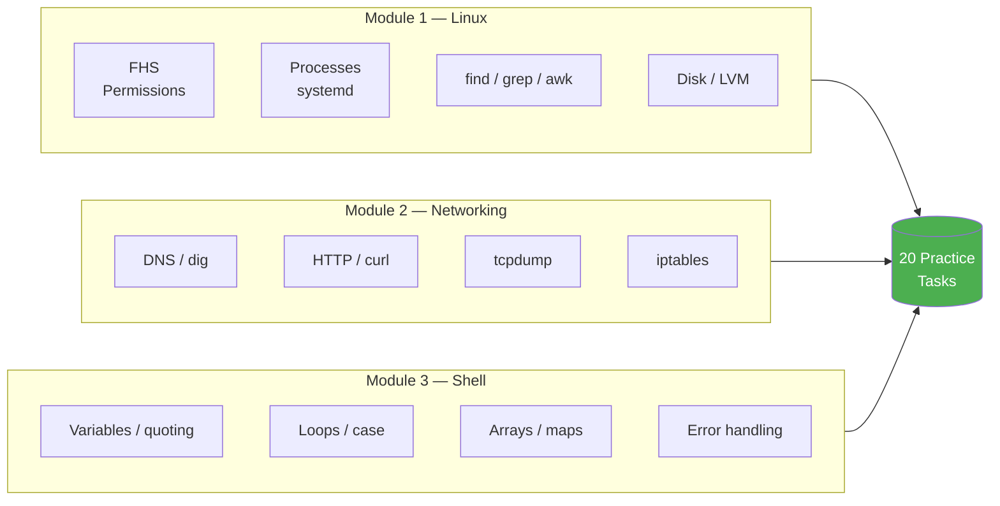

# 3.3.1 Practice Lab: 20 Tasks Across Linux, Networking & Shell Scripting

A single-file revision playground. Every task either combines concepts from Modules 1, 2, and 3 or drills a specific skill the modules introduced. **Try each task first without looking at the solution** — the solutions are collapsible so you can practise honestly.

> **Tip:** Open a Kind cluster or a throwaway VM/Docker container before you start. Running `rm -rf`, editing `/etc/fstab`, and killing services is a lot less stressful on disposable infrastructure.

### What's Covered



### How to Use This Lab

1. Read the task.
2. Write the solution in a scratch file.
3. Run it — confirm behaviour matches the expected outcome.
4. **Only then** open the solution, compare, and read the "why this works" notes.

Tasks are ordered roughly by difficulty (1–20 = easy → hard).

---

## Task 1 — Disk-Usage Snapshot (Linux + Shell)

**Goal:** Write `disk-report.sh` that prints the five biggest directories under `/var` as a table, largest first.

**Expected output:**
```
SIZE   PATH
1.2G   /var/lib/docker
450M   /var/log
...
```

**Touches:** FHS (1.2.1), `du`, `sort`, piping.

<details>
<summary>Solution</summary>

```bash
#!/usr/bin/env bash
set -euo pipefail

printf '%-6s %s\n' "SIZE" "PATH"
du -hx --max-depth=1 /var 2>/dev/null \
    | sort -hr \
    | head -n 6 \
    | tail -n +2 \
    | awk '{ printf "%-6s %s\n", $1, $2 }'
```

**Why it works**
- `du -hx` → human-readable; `-x` stays on one filesystem (no surprise mounts).
- `sort -hr` → human-numeric reverse sort (understands `K`/`M`/`G`).
- `head 6 | tail +2` → skip the grand total line, keep top 5.
- `awk` → clean tabular formatting.

📎 [1.2.1 FHS Deep Dive](../../1-Linux/Subchapter_1.2/1.2.1_FHS_Deep_Dive.md)

</details>

---

## Task 2 — Users Who Can Log In (Linux)

**Goal:** Print every user in `/etc/passwd` whose shell is **not** `nologin` or `false`, sorted alphabetically, with their UID.

**Touches:** `/etc/passwd` format, `awk`, filtering.

<details>
<summary>Solution</summary>

```bash
#!/usr/bin/env bash
set -euo pipefail

awk -F: '$7 !~ /(nologin|false)$/ { printf "%-16s UID=%s\n", $1, $3 }' /etc/passwd \
    | sort
```

**Why it works**
- `-F:` sets the field separator to `:`.
- `$7` is the login shell; `!~` is "does not match regex".
- No shell variables needed — pure awk.

📎 [1.3.1 User and Group Management](../../1-Linux/Subchapter_1.3/1.3.1_User_and_Group_Management.md)

</details>

---

## Task 3 — Find Large Log Files (Linux + Shell)

**Goal:** Find every file under `/var/log` larger than 50 MB, print size + path, sorted by size descending. Must handle filenames with spaces.

<details>
<summary>Solution</summary>

```bash
#!/usr/bin/env bash
set -euo pipefail

declare -a big=()
while IFS= read -r -d '' f; do
    big+=("$(du -h "$f" | cut -f1)"$'\t'"$f")
done < <(find /var/log -type f -size +50M -print0)

printf '%s\n' "${big[@]}" | sort -hr
```

**Why it works**
- `find -print0` + `read -d ''` → NUL-delimited list survives any filename.
- Store `"size\tpath"` so `sort -hr` sorts by the numeric size in column 1.

> **Warning:** Using `for f in $(find ...)` breaks on filenames with spaces. Always NUL-delimit file lists.

📎 [1.8.1 Find and Grep](../../1-Linux/Subchapter_1.8/1.8.1_Find_and_Grep.md)

</details>

---

## Task 4 — Permission Audit (Linux)

**Goal:** List every file in `/etc` that is **world-writable** (mode `0002` bit set). These are security red flags.

<details>
<summary>Solution</summary>

```bash
#!/usr/bin/env bash
set -euo pipefail

find /etc -xdev -type f -perm -o=w -exec ls -l {} \;
```

**Why it works**
- `-perm -o=w` → "any mode with the world-write bit set" (the `-` means **at least these bits**).
- `-xdev` → don't cross into other filesystems.
- `-exec ls -l {} \;` → show the full permission line for each hit.

📎 [1.2.2 File Types and Permissions](../../1-Linux/Subchapter_1.2/1.2.2_File_Types_Permissions_Basics.md)

</details>

---

## Task 5 — Service Uptime Checker (Linux + Shell)

**Goal:** Given a list of systemd units, print each unit's state (active/inactive) and how long it's been in that state.

**Input:** `units=("nginx" "sshd" "cron")`

<details>
<summary>Solution</summary>

```bash
#!/usr/bin/env bash
set -euo pipefail

units=("nginx" "sshd" "cron")

printf '%-12s %-10s %s\n' "UNIT" "STATE" "SINCE"
for u in "${units[@]}"; do
    state=$(systemctl is-active "$u" 2>/dev/null || echo "unknown")
    since=$(systemctl show "$u" -p ActiveEnterTimestamp --value 2>/dev/null)
    printf '%-12s %-10s %s\n' "$u" "$state" "${since:-n/a}"
done
```

📎 [1.6.2 Systemd Deep Dive](../../1-Linux/Subchapter_1.6/1.6.2_Systemd_Deep_Dive.md)

</details>

---

## Task 6 — Quick DNS Recon (Networking)

**Goal:** For a domain, print the A records, MX records, and TTLs using `dig`.

<details>
<summary>Solution</summary>

```bash
#!/usr/bin/env bash
set -euo pipefail

domain="${1:?usage: $0 <domain>}"

echo "== A records =="
dig +noall +answer "$domain" A
echo
echo "== MX records =="
dig +noall +answer "$domain" MX
echo
echo "== TTL (A) =="
dig +noall +answer "$domain" A | awk '{print $1, $2}'
```

**Why it works**
- `+noall +answer` → show only the answer section, no noise.
- `${1:?msg}` → parameter expansion that aborts with a usage message if `$1` is missing.

📎 [2.2.2 DNS Deep Dive](../../2-Networking/Subchapter_2.2/2.2.2_DNS_Deep_Dive.md)

</details>

---

## Task 7 — HTTP Health-Check With Timing (Networking + Shell)

**Goal:** Hit a URL and print the HTTP status, total time, and time-to-first-byte. Fail loudly if status is not `2xx`.

<details>
<summary>Solution</summary>

```bash
#!/usr/bin/env bash
set -euo pipefail

url="${1:?usage: $0 <url>}"

read -r status total ttfb < <(curl -sS -o /dev/null \
    -w '%{http_code} %{time_total} %{time_starttransfer}\n' \
    --max-time 10 "$url")

printf 'URL=%s  HTTP=%s  total=%.3fs  ttfb=%.3fs\n' \
    "$url" "$status" "$total" "$ttfb"

if [[ ! "$status" =~ ^2 ]]; then
    echo "FAIL: status $status" >&2
    exit 1
fi
```

📎 [2.4.1 HTTP/HTTPS and curl/wget](../../2-Networking/Subchapter_2.4/2.4.1_HTTP_HTTPS_and_curl_wget.md)

</details>

---

## Task 8 — Port Scanner (Networking + Shell)

**Goal:** Given a host and a port range (e.g. `22-100`), print only the ports that accept TCP connections. No external tools beyond `bash` itself — use Bash's `/dev/tcp` pseudo-device.

<details>
<summary>Solution</summary>

```bash
#!/usr/bin/env bash
set -uo pipefail                       # NOT -e — we expect failures

host="${1:?usage: $0 <host> <start>-<end>}"
range="${2:?port range like 22-100}"
start="${range%-*}"
end="${range#*-}"

open=()
for ((p = start; p <= end; p++)); do
    if timeout 1 bash -c "cat < /dev/tcp/$host/$p" 2>/dev/null; then
        open+=("$p")
    fi
done

echo "Open on $host: ${open[*]:-<none>}"
```

> **Warning:** The `/dev/tcp` trick is bash-only and blocks on closed ports. `timeout 1` keeps it snappy. For real scanning use `nmap` — but this is great for quick "is the service listening?" checks.

📎 [2.2.1 Essential Networking Tools](../../2-Networking/Subchapter_2.2/2.2.1_Essential_Networking_Tools.md)

</details>

---

## Task 9 — Backup With Rotation (Linux + Shell)

**Goal:** Write `backup.sh <src_dir>` that creates `backup-YYYYMMDD-HHMM.tar.gz` in `/var/backups`, keeping only the 5 most recent.

<details>
<summary>Solution</summary>

```bash
#!/usr/bin/env bash
set -euo pipefail

src="${1:?usage: $0 <src_dir>}"
dst_dir="/var/backups"
stamp="$(date +%Y%m%d-%H%M)"
archive="${dst_dir}/backup-${stamp}.tar.gz"

mkdir -p "$dst_dir"
tar -czf "$archive" -C "$(dirname "$src")" "$(basename "$src")"
echo "Created: $archive"

# Rotate — keep newest 5
mapfile -t backups < <(ls -1t "${dst_dir}"/backup-*.tar.gz 2>/dev/null)
if (( ${#backups[@]} > 5 )); then
    for old in "${backups[@]:5}"; do
        echo "Removing old backup: $old"
        rm -f -- "$old"
    done
fi
```

**Why it works**
- `tar -C dir path` → archive paths are stored relative to `dir`, so they extract cleanly.
- `ls -1t` → newest first; `${backups[@]:5}` slices from index 5 onward (i.e. the old ones).

📎 [1.2.3 Archiving and Syncing](../../1-Linux/Subchapter_1.2/1.2.3_Archiving_and_Syncing.md)

</details>

---

## Task 10 — Watch a Log for a Pattern (Linux + Shell)

**Goal:** Continuously tail `/var/log/syslog` and every time the word `ERROR` appears, print a beep character and the line with a timestamp.

<details>
<summary>Solution</summary>

```bash
#!/usr/bin/env bash
set -uo pipefail

tail -Fn0 /var/log/syslog | while IFS= read -r line; do
    if [[ "$line" == *ERROR* ]]; then
        printf '\a[%s] %s\n' "$(date '+%H:%M:%S')" "$line"
    fi
done
```

**Why it works**
- `tail -Fn0` → follow the file even across rotation, starting at 0 new lines.
- `\a` is the ASCII bell — most terminals beep or flash.

📎 [1.8.1 Find and Grep](../../1-Linux/Subchapter_1.8/1.8.1_Find_and_Grep.md)

</details>

---

## Task 11 — Parse nginx Access Log Into Status Histogram (Shell)

**Goal:** Read `/var/log/nginx/access.log` and print a sorted histogram of status codes.

**Expected output:**
```
200  18432
301    244
404     71
500      3
```

<details>
<summary>Solution</summary>

```bash
#!/usr/bin/env bash
set -euo pipefail

awk '{print $9}' /var/log/nginx/access.log \
    | sort \
    | uniq -c \
    | awk '{ printf "%-4s %6d\n", $2, $1 }' \
    | sort -rnk2
```

Or pure Bash with an associative array:

```bash
declare -A counts
while read -r _ _ _ _ _ _ _ _ status _; do
    counts[$status]=$(( ${counts[$status]:-0} + 1 ))
done < /var/log/nginx/access.log

for c in "${!counts[@]}"; do
    printf '%-4s %6d\n' "$c" "${counts[$c]}"
done | sort -rnk2
```

📎 [3.1.3 Arrays Deep Dive](../Subchapter_3.1/3.1.3_Arrays_Deep_Dive.md)

</details>

---

## Task 12 — Bulk-Rename Files (Shell)

**Goal:** In the current directory, rename every `*.txt` to `*.md`, preserving spaces in names, **without** touching a file that already has a `.md` counterpart.

<details>
<summary>Solution</summary>

```bash
#!/usr/bin/env bash
set -euo pipefail
shopt -s nullglob

for f in *.txt; do
    new="${f%.txt}.md"
    if [[ -e "$new" ]]; then
        echo "skip (target exists): $f"
        continue
    fi
    mv -v -- "$f" "$new"
done
```

> **Tip:** `shopt -s nullglob` makes `*.txt` expand to **nothing** if no matches — without it, a literal `*.txt` would be passed to the loop.

📎 [3.1.1 Shebangs, Variables, and Subshells](../Subchapter_3.1/3.1.1_Shebangs_Variables_and_Subshells.md)

</details>

---

## Task 13 — Retry With Exponential Backoff (Shell + Networking)

**Goal:** Write `retry_curl.sh <url>` that retries up to 5 times with backoff 1 s → 2 s → 4 s → 8 s → 16 s.

<details>
<summary>Solution</summary>

```bash
#!/usr/bin/env bash
set -uo pipefail

url="${1:?usage: $0 <url>}"
max=5
delay=1

for ((i = 1; i <= max; i++)); do
    if curl -sfSL --max-time 5 "$url" -o /tmp/payload.$$; then
        echo "success on attempt $i"
        cat /tmp/payload.$$
        rm -f /tmp/payload.$$
        exit 0
    fi
    echo "attempt $i failed, sleeping ${delay}s" >&2
    sleep "$delay"
    delay=$(( delay * 2 ))
done

echo "FAIL after $max attempts" >&2
exit 1
```

📎 [3.2.1 Error Handling and Debugging](../Subchapter_3.2/3.2.1_Error_Handling_and_Debugging.md)

</details>

---

## Task 14 — Lock File to Prevent Double Execution (Linux + Shell)

**Goal:** Make a script refuse to run if another copy is already running.

<details>
<summary>Solution</summary>

```bash
#!/usr/bin/env bash
set -euo pipefail

LOCK="/var/run/$(basename "$0").lock"

exec 9>"$LOCK" || { echo "cannot open lock"; exit 1; }
flock -n 9 || { echo "another instance is running"; exit 2; }

# Critical section
echo "Doing the work as PID $$ ..."
sleep 30
echo "Done."
```

**Why it works**
- `exec 9>"$LOCK"` opens FD 9 pointing at the lock file for the life of the script.
- `flock -n 9` takes a non-blocking exclusive lock on that FD; when the script exits (any reason), the kernel drops the lock automatically.

📎 [1.6.1 Process Lifecycle and Tools](../../1-Linux/Subchapter_1.6/1.6.1_Process_Lifecycle_and_Tools.md)

</details>

---

## Task 15 — Parse CSV Into Array of Maps (Shell)

**Goal:** Given a `users.csv` with header `name,age,city`, build an array of associative arrays and print each user's city.

CSV:
```
name,age,city
alice,30,NYC
bob,25,Berlin
```

<details>
<summary>Solution</summary>

```bash
#!/usr/bin/env bash
set -euo pipefail

file="${1:-users.csv}"

# Read header
IFS=',' read -r -a headers < "$file"

# Read remaining lines
mapfile -t rows < <(tail -n +2 "$file")

for row in "${rows[@]}"; do
    IFS=',' read -r -a fields <<< "$row"
    declare -A rec=()
    for i in "${!headers[@]}"; do
        rec[${headers[$i]}]="${fields[$i]}"
    done
    printf '%s lives in %s\n' "${rec[name]}" "${rec[city]}"
    unset rec
done
```

> **Warning:** Bash has no real "array of maps". We simulate it with one associative array per iteration and `unset` to reset. For real CSV work in production, use Python (Module 9).

📎 [3.1.3 Arrays Deep Dive](../Subchapter_3.1/3.1.3_Arrays_Deep_Dive.md)

</details>

---

## Task 16 — Network Namespace Experiment (Linux + Networking)

**Goal:** Create a network namespace, move a veth pair into it, give it an IP, and ping the host from inside.

<details>
<summary>Solution</summary>

```bash
#!/usr/bin/env bash
set -euo pipefail

NS="lab1"

# Host side
sudo ip netns add "$NS"
sudo ip link add veth-host type veth peer name veth-ns
sudo ip link set veth-ns netns "$NS"

# Configure host end
sudo ip addr add 10.200.0.1/24 dev veth-host
sudo ip link set veth-host up

# Configure namespace end
sudo ip -n "$NS" addr add 10.200.0.2/24 dev veth-ns
sudo ip -n "$NS" link set veth-ns up
sudo ip -n "$NS" link set lo up

# Test
sudo ip netns exec "$NS" ping -c 3 10.200.0.1

# Cleanup
sudo ip netns del "$NS"
sudo ip link del veth-host 2>/dev/null || true
```

> **Tip:** This is exactly what Docker and Kubernetes do under the hood to give each container its own network stack.

📎 [4.1.1 Namespaces and Cgroups](../../4-Docker/Subchapter_4.1/4.1.1_Namespaces_and_Cgroups.md)

</details>

---

## Task 17 — `trap` for Cleanup (Shell)

**Goal:** Write a script that creates a temp directory, does work, and **always** cleans up — even if killed with `Ctrl-C`, `kill`, or an error.

<details>
<summary>Solution</summary>

```bash
#!/usr/bin/env bash
set -euo pipefail

tmpdir="$(mktemp -d)"
echo "Working in $tmpdir"

cleanup() {
    local ec=$?
    echo "Cleaning up (exit=$ec)"
    rm -rf -- "$tmpdir"
    exit "$ec"
}
trap cleanup EXIT INT TERM

# Simulate work
for i in 1 2 3; do
    echo "step $i"
    sleep 1
done

# Normal exit — trap still fires
```

**Why it works**
- `trap cleanup EXIT` fires on **any** exit, including errors (`set -e`) and signals.
- Adding `INT TERM` makes cleanup explicit for user interrupts.
- Capturing `$?` at the top of `cleanup` preserves the original exit code.

📎 [3.2.1 Error Handling and Debugging](../Subchapter_3.2/3.2.1_Error_Handling_and_Debugging.md)

</details>

---

## Task 18 — Diff Two Directories' File Lists (Linux + Shell)

**Goal:** Without using `diff -r`, report files that exist in `dir_a` but not `dir_b` (and vice versa). Names only, sorted.

<details>
<summary>Solution</summary>

```bash
#!/usr/bin/env bash
set -euo pipefail

a="${1:?usage: $0 <dir_a> <dir_b>}"
b="${2:?usage: $0 <dir_a> <dir_b>}"

diff \
    <(cd "$a" && find . -type f | sort) \
    <(cd "$b" && find . -type f | sort)
```

**Why it works**
- `<(cmd)` is **process substitution** (Note 3.1.1) — treats the output of `cmd` as a file.
- `(cd "$a" && find .)` makes paths relative so `diff` compares the **structure**, not the absolute paths.

📎 [3.1.1 Shebangs, Variables, and Subshells](../Subchapter_3.1/3.1.1_Shebangs_Variables_and_Subshells.md)

</details>

---

## Task 19 — SSH Fan-Out Runner (Linux + Networking + Shell)

**Goal:** Given an array of hostnames, run a single command on each in parallel and collect stdout per host.

<details>
<summary>Solution</summary>

```bash
#!/usr/bin/env bash
set -uo pipefail

hosts=("web-01" "web-02" "web-03")
cmd="${1:-uptime}"
outdir="$(mktemp -d)"
pids=()

for h in "${hosts[@]}"; do
    (
        if out="$(ssh -o ConnectTimeout=3 -o BatchMode=yes "$h" "$cmd" 2>&1)"; then
            printf 'OK %s\n%s\n' "$h" "$out"
        else
            printf 'FAIL %s (exit %d)\n%s\n' "$h" "$?" "$out"
        fi
    ) > "${outdir}/${h}.out" &
    pids+=("$!")
done

wait "${pids[@]}"

echo "=== Results ==="
for h in "${hosts[@]}"; do
    echo "--- $h ---"
    cat "${outdir}/${h}.out"
done
rm -rf "$outdir"
```

**Why it works**
- `( ... ) &` forks a subshell per host; we collect their output in per-host files.
- `wait "${pids[@]}"` blocks until every child exits.
- `-o BatchMode=yes` ensures SSH fails fast instead of prompting for a password.

📎 [1.4.3 Advanced SSH Tunneling and Config](../../1-Linux/Subchapter_1.4/1.4.3_Advanced_SSH_Tunneling_and_Config.md)

</details>

---

## Task 20 — Self-Healing Service Wrapper (All Three Modules)

**Goal:** Write `watchdog.sh <cmd...>` that keeps a command alive:
- If it exits with code 0, leave it alone.
- If it exits with any non-zero code, restart after 2 s — up to 5 times in 60 s.
- If it restart-storms (more than 5 in 60 s), give up and exit 1.

<details>
<summary>Solution</summary>

```bash
#!/usr/bin/env bash
set -uo pipefail

if (( $# < 1 )); then
    echo "usage: $0 <cmd> [args...]" >&2
    exit 2
fi

declare -a restarts=()            # epoch timestamps of each restart

while true; do
    "$@"
    ec=$?

    if (( ec == 0 )); then
        echo "[watchdog] clean exit (0) — stopping"
        exit 0
    fi

    now=$(date +%s)
    restarts+=("$now")

    # Drop restart timestamps older than 60s
    trimmed=()
    for t in "${restarts[@]}"; do
        if (( now - t < 60 )); then
            trimmed+=("$t")
        fi
    done
    restarts=("${trimmed[@]}")

    if (( ${#restarts[@]} > 5 )); then
        echo "[watchdog] more than 5 restarts in 60s — giving up" >&2
        exit 1
    fi

    echo "[watchdog] process exited $ec — restart #${#restarts[@]} in 2s"
    sleep 2
done
```

**Why it works**
- A sliding 60 s window of timestamps implements the rate limit exactly.
- `"$@"` re-runs the **exact** original arguments, quoting preserved.
- Any signal not caught by the child kills the wrapper too — which is what you usually want.

📎 [3.2.1 Error Handling and Debugging](../Subchapter_3.2/3.2.1_Error_Handling_and_Debugging.md)
📎 [1.6.1 Process Lifecycle](../../1-Linux/Subchapter_1.6/1.6.1_Process_Lifecycle_and_Tools.md)

</details>

---

## Wrap-Up: Skills You Practised

| Skill | Tasks |
|-------|-------|
| Safe handling of filenames with spaces | 3, 12 |
| Associative arrays as maps / counters | 11, 15 |
| `find`, `awk`, pipelines | 1, 2, 4, 11 |
| Systemd introspection | 5 |
| DNS & HTTP diagnostics | 6, 7, 13 |
| Network namespaces & `/dev/tcp` | 8, 16 |
| `mktemp` + `trap` for cleanup | 17, 20 |
| `flock` and concurrency | 14, 19 |
| Retry patterns & error strategies | 13, 20 |
| Diff'ing directory trees with process substitution | 18 |

> **Important:** If you got stuck on more than four tasks, go back to the original notes before moving into Module 4. These are the foundational skills every Docker and Kubernetes task will build on.

---

## Backlinks

**Covers material from:**
- [Module 1 — Linux](../../1-Linux/Module_1_Approach_Guide.md)
- [Module 2 — Networking](../../2-Networking/Module_2_Approach_Guide.md)
- [Module 3 — Shell Scripting](../Module_3_Approach_Guide.md)

**Key sibling notes:**
- [3.1.1 Shebangs, Variables, and Subshells](../Subchapter_3.1/3.1.1_Shebangs_Variables_and_Subshells.md)
- [3.1.3 Arrays Deep Dive](../Subchapter_3.1/3.1.3_Arrays_Deep_Dive.md)
- [3.2.1 Error Handling and Debugging](../Subchapter_3.2/3.2.1_Error_Handling_and_Debugging.md)
- [3.2.2 String Manipulation and Regex](../Subchapter_3.2/3.2.2_String_Manipulation_and_Regular_Expressions.md)

**Next Module:**
- [Module 4 — Docker](../../4-Docker/Module_4_Approach_Guide.md)
