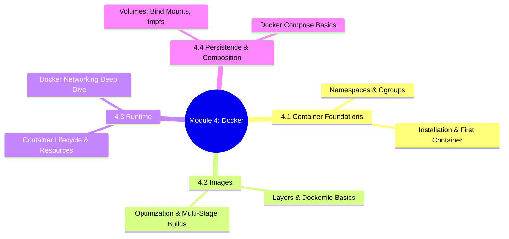
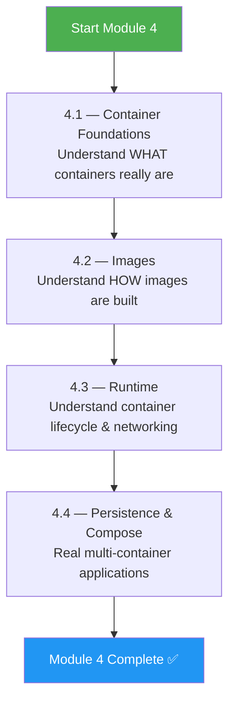
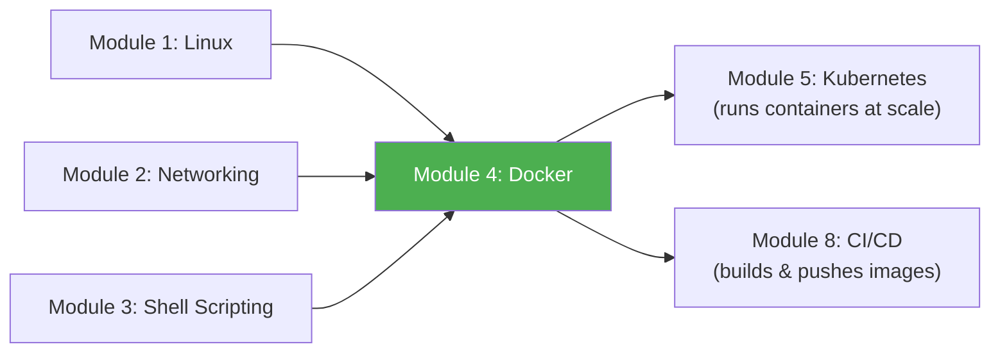

# Module 4 Approach Guide — Docker and Containers

## Module Overview

---

## Who Is This Module For?

Containers are the **universal packaging format** for modern applications. Every Kubernetes pod runs containers. Every CI/CD pipeline builds container images. Understanding Docker deeply — not just `docker run` — is essential for debugging production issues.

**Target audience:**
- Engineers who use Docker daily but don't understand what happens under the hood
- Anyone preparing for CKA/CKAD (Kubernetes exams require container debugging skills)
- Platform engineers building CI/CD pipelines that build and push images

---

## Prerequisites

| Prerequisite | Required? | Notes |
|---|---|---|
| Module 1 (Linux) completed | **Yes** | Namespaces, cgroups, filesystems, processes — all Linux concepts |
| Module 2 (Networking) completed | **Yes** | Docker networking IS Linux networking with iptables + bridges |
| Module 3 (Shell Scripting) completed | Recommended | Dockerfiles use shell commands; entrypoint scripts are bash |
| Docker installed | **Yes** | `curl -fsSL https://get.docker.com \| sh` or use Docker Desktop |

---

## How to Approach This Module

### Study Strategy

1. **4.1 is the "aha" moment** — Once you understand namespaces and cgroups, containers demystify completely.
2. **Build images yourself** — Don't pull from Docker Hub. Write Dockerfiles for a Go app, a Python app, a Node app.
3. **Use `docker inspect` on everything** — Containers, images, networks, volumes. Read the JSON output.
4. **Break container networking on purpose** — Remove the bridge, add iptables rules, see what breaks.
5. **Optimize an image from 900MB to under 50MB** — This exercise alone teaches more than 10 tutorials.

---

## Time Estimates

| Subchapter | Reading | Practice | Total |
|---|---|---|---|
| 4.1 Container Foundations | 2 hrs | 1.5 hrs | **3.5 hrs** |
| 4.2 Images | 2 hrs | 2.5 hrs | **4.5 hrs** |
| 4.3 Runtime | 2 hrs | 2 hrs | **4 hrs** |
| 4.4 Persistence & Compose | 2 hrs | 2.5 hrs | **4.5 hrs** |
| **Total** | **8 hrs** | **8.5 hrs** | **~16.5 hrs** |

> **Realistic timeline:** 1–1.5 weeks at 2–3 hours/day.

---

## Practice Lab Ideas

| Lab | Covers | Difficulty |
|---|---|---|
| Run `unshare` to create a manual namespace; compare with `docker run` | 4.1 | ⭐⭐ |
| Write a multi-stage Dockerfile for a Go binary — final image under 10MB | 4.2 | ⭐⭐⭐ |
| Set memory and CPU limits on a container, then stress-test it with `stress-ng` | 4.3 | ⭐⭐⭐ |
| Create a custom bridge network, run 3 containers, verify DNS resolution between them | 4.3 | ⭐⭐⭐ |
| Build a docker-compose stack: Nginx + Python API + PostgreSQL + Redis | 4.4 | ⭐⭐⭐⭐ |
| Debug a "container won't start" scenario — wrong entrypoint, missing env, port conflict | 4.3 | ⭐⭐⭐⭐ |

---

## What Success Looks Like

By the end of Module 4, you should be able to:

- [ ] Explain containers as Linux namespaces + cgroups (not "lightweight VMs")
- [ ] Write production-quality multi-stage Dockerfiles
- [ ] Debug image layer caching issues and optimize build times
- [ ] Manage container lifecycle: create, start, stop, restart policies, health checks
- [ ] Explain Docker's bridge, host, and overlay networking with iptables rules
- [ ] Use volumes, bind mounts, and tmpfs correctly
- [ ] Write docker-compose files for multi-service applications

---

## Connection to Other Modules

**Docker is the bridge between Linux and Kubernetes.** Module 5 (Kubernetes) orchestrates the containers you learn to build here. Module 8 (CI/CD) automates building and pushing the images you create here. If you don't understand Docker, you'll struggle with every module that follows.

> **Next module:** [Module 5 — Kubernetes](../5-Kubernetes/Module_5_Approach_Guide.md)
