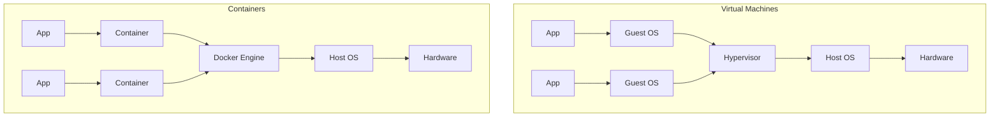

# 4.1.1 Namespaces and Cgroups: The Building Blocks of Containers

#### Why Containers Are Not Virtual Machines

Before Docker, isolation meant virtual machines (VMs) – each with a full OS, hypervisor overhead, and minutes to start. Containers are different: they share the host kernel but isolate processes. This is achieved through two Linux kernel features:

* **Namespaces** – Isolate what processes can see (PID, network, filesystem, users)

* **Cgroups** – Limit what processes can use (CPU, memory, disk I/O)

This note covers these primitives. Note 4.1.2 covers Docker installation and basic commands; note 4.1.3 is the subchapter review.

***

## Part 1: VMs vs Containers – The Big Picture



| Aspect                | Virtual Machines              | Containers                                  |
| --------------------- | ----------------------------- | ------------------------------------------- |
| **Isolation**         | Full OS isolation (strong)    | Process-level isolation (weaker but faster) |
| **Boot time**         | Minutes                       | Milliseconds                                |
| **Size**              | GBs (full OS)                 | MBs (app + dependencies)                    |
| **Resource overhead** | High (multiple kernels)       | Low (shared kernel)                         |
| **Kernel**            | Each VM has its own           | Shared with host                            |
| **Security**          | Stronger (hardware isolation) | Weaker (kernel shared)                      |

***

## Part 2: Linux Namespaces – Isolation of "What You See"

Namespaces limit what a process can **see**. Each container gets its own set of namespaces, making it think it's running on its own system.

### The Six Namespaces (What Containers Use)

| Namespace | Isolates                                                    | Why Containers Need It                                       |
| --------- | ----------------------------------------------------------- | ------------------------------------------------------------ |
| **PID**   | Process IDs                                                 | Container processes start at PID 1, can't see host processes |
| **NET**   | Network interfaces, routing, ports                          | Each container gets its own IP, port space                   |
| **UTS**   | Hostname and domain name                                    | Container can have its own hostname                          |
| **MNT**   | Filesystem mount points                                     | Container has its own root filesystem                        |
| **IPC**   | Inter-process communication (shared memory, message queues) | Prevents containers from interfering                         |
| **USER**  | User and group IDs                                          | Map container root (UID 0) to non-root on host               |

### PID Namespace – Process Isolation

Without PID namespace, a process inside a container could see all host processes (including other containers). With PID namespace, it sees only its own process tree.

```bash
# On the host, see all processes
ps aux

# Inside a container, see only container processes
docker run alpine ps aux
# PID 1: ps command itself
# No host processes visible
```

**How it works:**

* Container's PID 1 maps to a high-numbered PID on the host (e.g., 12345)

* Inside container, `kill 1` sends signal to container's init, not host's systemd

### NET Namespace – Network Isolation

Each container gets its own:

* Network interface (virtual Ethernet pair)

* IP address (usually on private subnet)

* Routing table

* Port space (port 80 in container ≠ port 80 on host)

```bash
# List network interfaces on host
ip addr show

# List network interfaces inside container
docker run alpine ip addr show
# Only lo and eth0 (virtual interface)
```

### UTS Namespace – Hostname Isolation

```bash
# Host hostname
hostname

# Container with custom hostname
docker run --hostname mycontainer alpine hostname
# mycontainer
```

### MNT Namespace – Filesystem Isolation

Each container gets its own root filesystem (rootfs). Changes inside container don't affect host.

```bash
# Create file on host
touch /tmp/host-file

# Container cannot see it (different mount namespace)
docker run alpine ls /tmp/host-file
# ls: /tmp/host-file: No such file or directory
```

### USER Namespace – Root Isolation (Security Feature)

Maps container's root (UID 0) to an unprivileged UID on the host.

```bash
# Without user namespace (default) – container root = host root (risky)
docker run -it alpine

# With user namespace – container root maps to unprivileged host UID
dockerd --userns-remap=default
```

***

## Part 3: Cgroups – Limiting "What You Use"

Cgroups (Control Groups) limit how many resources a process can **use**. Without cgroups, a single container could consume all host CPU, memory, or disk I/O.

### Resource Limits That Matter

| Resource          | Cgroup Controller | Docker Flag                               | Example                            |
| ----------------- | ----------------- | ----------------------------------------- | ---------------------------------- |
| **CPU**           | `cpu`, `cpuacct`  | `--cpus`, `--cpu-shares`                  | `--cpus=2` (use 2 CPU cores)       |
| **Memory**        | `memory`          | `--memory`, `--memory-swap`               | `--memory=512m`                    |
| **Disk I/O**      | `blkio`           | `--device-read-bps`, `--device-write-bps` | `--device-write-bps=/dev/sda:10mb` |
| **Process count** | `pids`            | `--pids-limit`                            | `--pids-limit=100`                 |

### CPU Limits

```bash
# Limit to 1.5 CPU cores
docker run --cpus=1.5 nginx

# CPU shares (relative weight, default 1024)
docker run --cpu-shares=512 heavy-app   # Gets half the CPU of default
docker run --cpu-shares=2048 priority-app  # Gets twice the CPU

# CPU quota (more precise)
docker run --cpu-quota=50000 --cpu-period=100000 nginx  # 50% of one core
```

### Memory Limits

```bash
# Limit to 512MB (hard limit)
docker run --memory=512m nginx

# With swap (total memory + swap = 1GB)
docker run --memory=512m --memory-swap=1g nginx

# Disable swap entirely
docker run --memory=512m --memory-swap=512m nginx

# Memory reservation (soft limit)
docker run --memory-reservation=256m nginx
```

### Viewing Cgroup Statistics

```bash
# On the host, cgroups are in /sys/fs/cgroup/
ls /sys/fs/cgroup/

# Docker containers are under /sys/fs/cgroup/<controller>/docker/<container-id>/
cat /sys/fs/cgroup/memory/docker/<container-id>/memory.usage_in_bytes

# Easier: use docker stats
docker stats
```

***

## Part 4: Hands-On – Exploring Namespaces and Cgroups

### Check Your Kernel Support

```bash
# Check if kernel supports namespaces
uname -r
# Linux kernel 3.8+ has full namespace support

# List available cgroup controllers
cat /proc/cgroups
```

### Create a Namespace Manually (Without Docker)

You can create namespaces using Linux commands to understand how containers work.

```bash
# Create a new PID namespace with a bash shell
sudo unshare --fork --pid --mount-proc bash

# Inside the namespace, see only this process
ps aux
# PID 1: bash, nothing else

# Exit to return to host
exit
```

### Inspect a Running Container's Namespaces

```bash
# Run a container in background
docker run -d --name test nginx

# Find the container's PID on the host
docker inspect test | grep -i pid
# Or
docker top test

# Look at its namespaces (replace PID)
ls -la /proc/<PID>/ns/
# Each file is a namespace:
# ipc -> ipc:[4026531839]
# net -> net:[4026531234]
# pid -> pid:[4026534567]
```

### Test Memory Limit

```bash
# Run a container with 128MB memory limit
docker run --rm -it --memory=128m alpine

# Inside container, try to allocate 256MB
# Install stress tool (if available)
apk add stress
stress --vm 1 --vm-bytes 256M --vm-keep

# Or use a simple Python script
python3 -c "import time; data = bytearray(256*1024*1024); time.sleep(10)"
# Container will be killed (OOM)
```

***

## Part 5: Why This Matters for Platform Engineers

| Concept           | Production Impact                                                         |
| ----------------- | ------------------------------------------------------------------------- |
| **Namespaces**    | Ensure containers don't interfere (no port conflicts, process visibility) |
| **PID namespace** | Container processes can't see/kill host processes                         |
| **NET namespace** | Each container can run port 80 independently                              |
| **Cgroups**       | Prevent noisy neighbors (one container can't consume all CPU/memory)      |
| **Memory limits** | Prevent OOM killer from affecting host                                    |
| **CPU limits**    | Ensure fair scheduling across containers                                  |

### Real-World Example: Noisy Neighbor Prevention

```bash
# Without limits – one container can consume all CPU
docker run -d --name greedy python -c "while True: pass"

# With limits – container is constrained
docker run -d --cpus=0.5 --name bounded python -c "while True: pass"

# Check CPU usage
docker stats greedy bounded
```

***

## Quick Task: Explore Namespaces and Cgroups

*Run these commands to see containers from the host perspective.*

1. Run `docker run -d --name nginx1 nginx`
2. Find its host PID with `docker inspect nginx1 | grep -i pid`
3. List its namespaces from `/proc/<PID>/ns/`
4. Check its cgroup memory limit: `cat /sys/fs/cgroup/memory/docker/<container-id>/memory.limit_in_bytes`
5. Stop and remove the container: `docker stop nginx1 && docker rm nginx1`

> **Ready Solution:**
>
> ```bash
> # Task 1
> docker run -d --name nginx1 nginx
>
> # Task 2
> docker inspect nginx1 | grep -i "Pid"
> # Or
> docker top nginx1
>
> # Task 3 (replace 12345 with actual PID)
> ls -la /proc/12345/ns/
>
> # Task 4 (replace container-id with actual ID)
> docker inspect nginx1 | grep -i "Id"
> cat /sys/fs/cgroup/memory/docker/abc123.../memory.limit_in_bytes
> # Shows a very large number (no limit set)
>
> # Task 5
> docker stop nginx1
> docker rm nginx1
> ```

***

## Summary Table: Namespaces vs Cgroups

| Feature            | Namespaces                         | Cgroups                         |
| ------------------ | ---------------------------------- | ------------------------------- |
| **Purpose**        | Isolation (what you see)           | Limitation (what you use)       |
| **Prevents**       | Process A seeing/killing Process B | Process A using all CPU/memory  |
| **Key components** | PID, NET, UTS, MNT, IPC, USER      | cpu, memory, blkio, pids        |
| **Docker default** | All namespaces enabled             | No limits (unlimited resources) |
| **Security**       | Isolation boundary                 | Fairness boundary               |

### Namespace Reference

| Namespace | Isolates          | Docker Flag                              |
| --------- | ----------------- | ---------------------------------------- |
| PID       | Process IDs       | `--pid=host` to share host PID namespace |
| NET       | Network           | `--net=host` to share host network       |
| UTS       | Hostname          | `--uts=host` to share host hostname      |
| MNT       | Filesystem mounts | `--volume` binds (still isolated)        |
| USER      | User IDs          | `--userns=host` to disable               |

### Cgroup Reference

| Resource           | Docker Flag                 | Check Command                          |
| ------------------ | --------------------------- | -------------------------------------- |
| CPU cores          | `--cpus=1.5`                | `docker stats`                         |
| CPU shares         | `--cpu-shares=512`          | `cat /sys/fs/cgroup/cpu/cpu.shares`    |
| Memory limit       | `--memory=512m`             | `docker stats`                         |
| Memory reservation | `--memory-reservation=256m` | –                                      |
| PIDs limit         | `--pids-limit=100`          | `cat /sys/fs/cgroup/pids/pids.current` |

***

**Next note (4.1.2)** will cover **Docker Installation and First Container** – installing Docker on RHEL/Debian, daemon configuration, and basic container lifecycle commands.

---

## Backlinks

- [1.2.1 Process Management](../../1-Linux/Subchapter_1.2/1.2.1_Process_Management_and_Job_Control.md) – PID namespace relates to `ps`, `kill`
- [2.1.1 OSI and TCP/IP Models](../../2-Networking/Subchapter_2.1/2.1.1_OSI_and_TCP_IP_Models.md) – NET namespace relates to networking
- [1.1.1 Filesystem Hierarchy](../../1-Linux/Subchapter_1.1/1.1.1_Filesystem_Hierarchy_Standard.md) – MNT namespace relates to mount points
- [1.3.1 User and Group Management](../../1-Linux/Subchapter_1.3/1.3.1_User_and_Group_Management.md) – USER namespace relates to UID mapping
