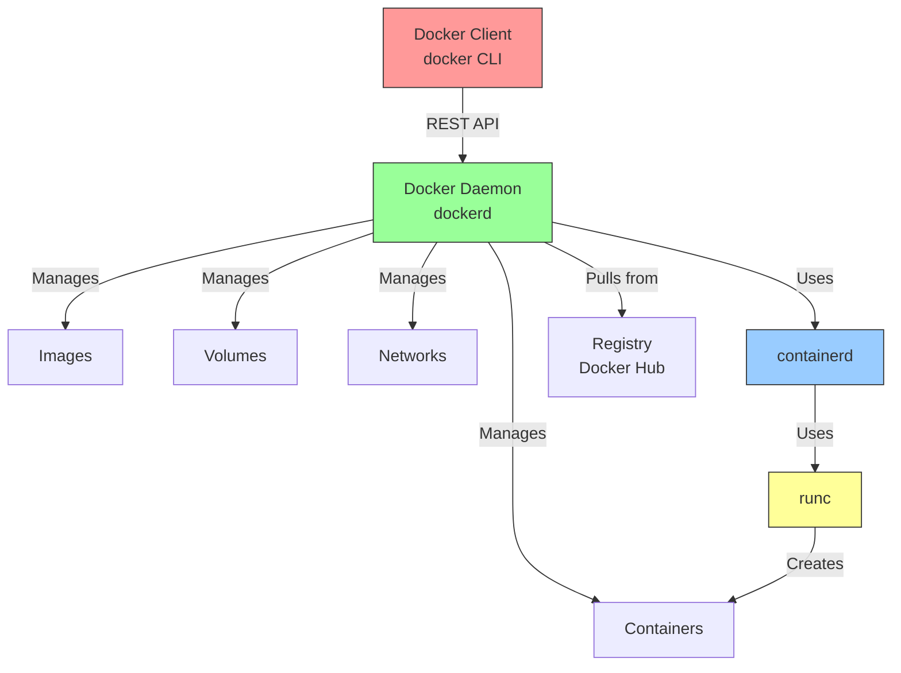

# 4.1.2 Docker Installation and First Container: From Zero to Running

#### Why Docker Matters

Docker revolutionized platform engineering by making containers accessible. It packages the namespace and cgroup primitives (from 4.1.1) into a simple workflow:

* **Dockerfile** – Define how to build an image

* **Image** – Immutable template (like a class)

* **Container** – Running instance of an image (like an object)

This note covers installing Docker and running your first containers. Note 4.1.1 covered namespaces/cgroups; note 4.1.3 is the subchapter review.

***

## Part 1: Installing Docker

### RHEL Family (Rocky/Alma/CentOS/Fedora)

```bash
# 1. Remove old versions
sudo dnf remove docker docker-client docker-client-latest docker-common docker-latest docker-latest-logrotate docker-logrotate docker-engine

# 2. Install dependencies
sudo dnf install -y dnf-utils device-mapper-persistent-data lvm2

# 3. Add Docker repository
sudo dnf config-manager --add-repo https://download.docker.com/linux/rhel/docker-ce.repo

# 4. Install Docker
sudo dnf install -y docker-ce docker-ce-cli containerd.io docker-buildx-plugin docker-compose-plugin

# 5. Start Docker
sudo systemctl enable docker
sudo systemctl start docker

# 6. Verify installation
sudo docker run hello-world

# 7. Add user to docker group (avoids sudo)
sudo usermod -aG docker $USER
newgrp docker  # Apply group changes
```

### Debian Family (Ubuntu/Debian)

```bash
# 1. Update package index
sudo apt update

# 2. Install prerequisites
sudo apt install -y ca-certificates curl

# 3. Add Docker GPG key
sudo install -m 0755 -d /etc/apt/keyrings
sudo curl -fsSL https://download.docker.com/linux/ubuntu/gpg -o /etc/apt/keyrings/docker.asc
sudo chmod a+r /etc/apt/keyrings/docker.asc

# 4. Add Docker repository
echo "deb [arch=$(dpkg --print-architecture) signed-by=/etc/apt/keyrings/docker.asc] https://download.docker.com/linux/ubuntu $(. /etc/os-release && echo "$VERSION_CODENAME") stable" | sudo tee /etc/apt/sources.list.d/docker.list > /dev/null

# 5. Install Docker
sudo apt update
sudo apt install -y docker-ce docker-ce-cli containerd.io docker-buildx-plugin docker-compose-plugin

# 6. Start Docker
sudo systemctl enable docker
sudo systemctl start docker

# 7. Verify
sudo docker run hello-world

# 8. Add user to docker group
sudo usermod -aG docker $USER
newgrp docker
```

### Verify Installation

```bash
# Check Docker version
docker --version
# Docker version 24.0.7, build afdd53b

# Check daemon status
docker info
# Shows system-wide info (containers, images, storage driver, cgroup version)

# Run test container
docker run hello-world
```

### Docker vs Podman (Alternative)

| Feature | Docker | Podman |
|---------|--------|--------|
| **Daemon** | Requires dockerd | Daemonless |
| **Root** | Runs as root by default | Rootless by default |
| **CLI** | `docker` | `podman` (compatible) |
| **Compose** | `docker compose` | `podman-compose` |
| **Security** | Needs daemon privileges | More secure (no daemon) |
| **RHEL default** | Requires repo | Built-in |

```bash
# Podman is a drop-in replacement
alias docker=podman  # Most commands work identically
```

***

## Part 2: Docker Daemon Configuration

### Daemon Configuration File (`/etc/docker/daemon.json`)

```json
{
  "log-driver": "json-file",
  "log-opts": {
    "max-size": "10m",
    "max-file": "3"
  },
  "storage-driver": "overlay2",
  "data-root": "/var/lib/docker",
  "exec-opts": ["native.cgroupdriver=systemd"],
  "dns": ["8.8.8.8", "1.1.1.1"],
  "insecure-registries": ["myregistry.local:5000"],
  "registry-mirrors": ["https://mirror.gcr.io"],
  "default-address-pools": [
    {
      "base": "172.17.0.0/16",
      "size": 24
    }
  ]
}
```

### Common Daemon Options

| Option                | Purpose                  | Example                           |
| --------------------- | ------------------------ | --------------------------------- |
| `log-driver`          | How logs are handled     | `json-file`, `syslog`, `journald` |
| `log-opts`            | Log rotation settings    | `max-size=10m`, `max-file=3`      |
| `storage-driver`      | Filesystem for layers    | `overlay2` (default, best)        |
| `data-root`           | Where Docker stores data | `/var/lib/docker` (default)       |
| `insecure-registries` | Allow HTTP registries    | `["myregistry:5000"]`             |
| `registry-mirrors`    | Pull through cache       | `["https://mirror.gcr.io"]`       |

### Apply Daemon Configuration

```bash
# Create or edit daemon.json
sudo mkdir -p /etc/docker
sudo tee /etc/docker/daemon.json << 'EOF'
{
  "log-driver": "json-file",
  "log-opts": {
    "max-size": "10m",
    "max-file": "3"
  }
}
EOF

# Restart Docker
sudo systemctl restart docker

# Verify configuration
docker info | grep -A 5 "Logging Driver"
```

***

## Part 3: Docker Architecture



### Docker Components

| Component         | Role                         | Notes                                            |
| ----------------- | ---------------------------- | ------------------------------------------------ |
| **Docker Client** | CLI command `docker`         | Communicates via REST API (UNIX socket or TCP)   |
| **Docker Daemon** | Background service `dockerd` | Manages containers, images, volumes, networks    |
| **containerd**    | Container runtime            | Manages container lifecycle (start, stop, pause) |
| **runc**          | Low-level container runtime  | Creates namespaces and cgroups (from 4.1.1)      |
| **Registry**      | Image storage                | Docker Hub is default; can run private registry  |

***

## Part 4: First Container – Hello World

### Running Your First Container

```bash
# Pull image from registry (if not cached)
docker pull hello-world

# Run container (pull + run in one command)
docker run hello-world

# Output:
# Hello from Docker!
# This message shows that your installation appears to be working correctly.
```

### What Happened?

1. Docker client told daemon to run `hello-world`
2. Daemon checked if image existed locally (it didn't)
3. Daemon pulled image from Docker Hub
4. Daemon created container from image (namespaces + cgroups)
5. Container ran, printed message, then exited

***

## Part 5: Essential Docker Commands

### Container Lifecycle

| Command           | Purpose                                 | Example                             |
| ----------------- | --------------------------------------- | ----------------------------------- |
| `docker run`      | Create and start container              | `docker run nginx`                  |
| `docker run -d`   | Run in background (detached)            | `docker run -d nginx`               |
| `docker run -it`  | Interactive with TTY                    | `docker run -it ubuntu bash`        |
| `docker run --rm` | Remove after exit                       | `docker run --rm alpine ls`         |
| `docker ps`       | List running containers                 | `docker ps`                         |
| `docker ps -a`    | List all containers (including stopped) | `docker ps -a`                      |
| `docker stop`     | Stop running container                  | `docker stop container_id`          |
| `docker start`    | Start stopped container                 | `docker start container_id`         |
| `docker restart`  | Restart container                       | `docker restart container_id`       |
| `docker rm`       | Remove container                        | `docker rm container_id`            |
| `docker logs`     | View container output                   | `docker logs container_id`          |
| `docker exec`     | Run command in running container        | `docker exec -it container_id bash` |

### Practical Examples

```bash
# Run nginx in background
docker run -d --name webserver -p 8080:80 nginx
# Access at http://localhost:8080

# Run interactive Ubuntu shell
docker run -it --name ubuntu-test ubuntu bash
# Inside container: apt update, apt install vim, etc.
# Exit with Ctrl+D or 'exit'

# Run command and remove immediately
docker run --rm alpine cat /etc/os-release

# View logs of a container
docker logs webserver
docker logs -f webserver  # Follow (like tail -f)

# Execute command inside running container
docker exec webserver nginx -t
docker exec -it webserver bash

# Stop and remove
docker stop webserver
docker rm webserver
```

### Container Naming and IDs

```bash
# Docker generates random names (e.g., "frosty_poitras")
docker run -d nginx

# Better: assign custom name
docker run -d --name my-nginx nginx

# Reference by ID (first few characters)
docker stop 7a8b  # 7a8b9cdef... is container ID

# Reference by name
docker start my-nginx
```

***

## Part 6: Image Management

| Command         | Purpose                  | Example                           |
| --------------- | ------------------------ | --------------------------------- |
| `docker pull`   | Download image           | `docker pull ubuntu:22.04`        |
| `docker images` | List local images        | `docker images`                   |
| `docker rmi`    | Remove image             | `docker rmi ubuntu:22.04`         |
| `docker tag`    | Add tag to image         | `docker tag nginx my-nginx:v1`    |
| `docker push`   | Upload image to registry | `docker push myregistry/nginx:v1` |

```bash
# Pull specific version
docker pull ubuntu:22.04
docker pull alpine:3.18

# List images
docker images
# REPOSITORY   TAG       IMAGE ID       SIZE
# ubuntu       22.04     abc123def456   78MB
# alpine       3.18      123abc456def   7MB

# Remove image
docker rmi alpine:3.18
```

***

## Part 7: Container Inspection

```bash
# Detailed container info (JSON)
docker inspect container_name

# Specific fields (using --format)
docker inspect --format='{{.State.Status}}' container_name
docker inspect --format='{{.NetworkSettings.IPAddress}}' container_name

# Container resource usage
docker stats container_name

# Container processes
docker top container_name

# Container logs
docker logs --tail 100 container_name
docker logs --since 5m container_name
```

### Useful Inspect Queries

```bash
# Get container IP address
docker inspect -f '{{range .NetworkSettings.Networks}}{{.IPAddress}}{{end}}' nginx

# Get container PID on host
docker inspect -f '{{.State.Pid}}' nginx

# Get container mount points
docker inspect -f '{{json .Mounts}}' nginx | jq

# Get environment variables
docker inspect -f '{{json .Config.Env}}' nginx | jq
```

***

## Part 8: System Commands and Housekeeping

### Docker System Overview

```bash
# Show Docker system information
docker info
# Shows: containers, images, storage driver, plugins, runtime, security options

# Show disk usage breakdown
docker system df
# TYPE            TOTAL     ACTIVE    SIZE      RECLAIMABLE
# Images          15        5         30GB      20GB (66%)
# Containers      20        3         10GB      8GB (80%)
# Volumes         5         2         40GB      30GB (75%)

# Detailed disk usage
docker system df -v

# Real-time Docker events (useful for debugging)
docker system events
docker system events --filter 'type=container'
docker system events --since '2024-01-01'
```

### Cleanup Commands

```bash
# Remove stopped containers
docker container prune

# Remove unused images
docker image prune

# Remove unused volumes
docker volume prune

# Remove unused networks
docker network prune

# Remove everything unused (dangerous!)
docker system prune -a --volumes

# Show disk usage
docker system df
```

***

## Quick Task: Run Your First Containers

*Practice basic Docker commands.*

1. Run an nginx container in the background, name it `web`, map port 8080 to 80.
2. Run an interactive Ubuntu container and create a file `/tmp/test.txt`.
3. Use `docker ps` to see both containers.
4. Execute `bash` inside the nginx container and list its files.
5. Stop both containers and remove them.

> **Ready Solution:**
>
> ```bash
> # Task 1
> docker run -d --name web -p 8080:80 nginx
>
> # Task 2
> docker run -it --name ubuntu-test ubuntu bash
> # Inside container: touch /tmp/test.txt && exit
>
> # Task 3
> docker ps
> # CONTAINER ID   IMAGE     COMMAND                  CREATED         STATUS         PORTS                                   NAMES
> # abc123         nginx     "/docker-entrypoint.…"   5 seconds ago   Up 4 seconds   0.0.0.0:8080->80/tcp, :::8080->80/tcp   web
> # def456         ubuntu    "bash"                   10 seconds ago  Up 9 seconds                                           ubuntu-test
>
> # Task 4
> docker exec -it web bash
> # Inside container: ls -la /usr/share/nginx/html && exit
>
> # Task 5
> docker stop web ubuntu-test
> docker rm web ubuntu-test
> ```

***

## Summary Table: Docker Commands

| Command                          | Purpose                    |
| -------------------------------- | -------------------------- |
| `docker run IMAGE`               | Create and start container |
| `docker run -d IMAGE`            | Run in background          |
| `docker run -it IMAGE bash`      | Interactive shell          |
| `docker ps`                      | List running containers    |
| `docker ps -a`                   | List all containers        |
| `docker stop CONTAINER`          | Stop container             |
| `docker start CONTAINER`         | Start stopped container    |
| `docker rm CONTAINER`            | Remove container           |
| `docker logs CONTAINER`          | View output                |
| `docker exec -it CONTAINER bash` | Run command inside         |
| `docker images`                  | List images                |
| `docker pull IMAGE`              | Download image             |
| `docker rmi IMAGE`               | Remove image               |
| `docker inspect CONTAINER`       | Show details               |
| `docker stats CONTAINER`         | Resource usage             |
| `docker system prune`            | Clean up                   |

### Container States

```
Created → Running → Paused → Stopped → Removed
   ↑         ↓         ↑         ↓
   └─────────┴─────────┴─────────┘
```

| Command          | Transition        |
| ---------------- | ----------------- |
| `docker create`  | → Created         |
| `docker start`   | Created → Running |
| `docker stop`    | Running → Stopped |
| `docker start`   | Stopped → Running |
| `docker pause`   | Running → Paused  |
| `docker unpause` | Paused → Running  |
| `docker rm`      | Stopped → Removed |

***

**Next note (4.1.3)** will be the Subchapter Review for Container Internals and Docker Basics, including a cheatsheet and scenario-based interview questions.

---

## Backlinks

- [4.1.1 Namespaces and Cgroups](./4.1.1_Namespaces_and_Cgroups.md) – Docker uses these under the hood
- [1.2.2 Systemd Service Management](../../1-Linux/Subchapter_1.2/1.2.2_Systemd_Service_Management.md) – Starting Docker as a service
- [2.2.1 Essential Network Tools](../../2-Networking/Subchapter_2.2/2.2.1_Essential_Network_Tools.md) – Port publishing relates to networking
- [1.2.1 Process Management](../../1-Linux/Subchapter_1.2/1.2.1_Process_Management_and_Job_Control.md) – `docker top` shows processes
