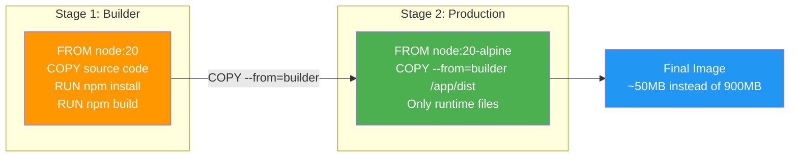
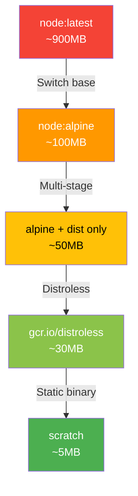

# 4.2.2 Image Optimization and Multi-Stage Builds: Slimming Down Containers

#### Why Image Size Matters

Large images are a problem in production:

* **Slow pull times** – Delays deployments and scaling

* **High storage costs** – Registry and node storage

* **Increased attack surface** – More packages = more vulnerabilities

* **Slow build times** – Longer CI/CD cycles

A typical Node.js image can be reduced from 900MB (node:latest) to 100MB (node:alpine) to 30MB (distroless). This note covers optimization techniques. Note 4.2.1 covered Dockerfile basics; note 4.2.3 is the subchapter review.

### Multi-Stage Build Concept



### Image Size Reduction Path



***

## Part 1: Base Image Selection

### Comparing Base Image Sizes

| Base Image                 | Size | Shell        | Package Manager | Use Case              |
| -------------------------- | ---- | ------------ | --------------- | --------------------- |
| `ubuntu:22.04`             | 78MB | bash (full)  | apt             | Full OS, development  |
| `debian:12-slim`           | 44MB | bash         | apt             | Smaller Debian        |
| `alpine:3.18`              | 7MB  | sh (BusyBox) | apk             | Minimal, fast builds  |
| `gcr.io/distroless/static` | 2MB  | None         | None            | Production (no shell) |
| `scratch`                  | 0MB  | None         | None            | Static binaries only  |

### Alpine Linux – The Popular Choice

```dockerfile
FROM alpine:3.18

# Install packages with apk (Alpine Package Keeper)
RUN apk add --no-cache python3 py3-pip curl

# --no-cache prevents caching (reduces image size)
```

**Pros:** Very small, fast builds, good for many use cases
**Cons:** Uses musl libc (not glibc) – some binaries may not work

### Distroless – Maximum Security

```dockerfile
# Distroless has no shell, no package manager
FROM gcr.io/distroless/static-debian11

# Copy pre-compiled binary
COPY myapp /myapp

# No RUN commands possible (no shell)
ENTRYPOINT ["/myapp"]
```

**Pros:** Extremely small, minimal attack surface
**Cons:** No debugging (no shell), harder to troubleshoot

### Scratch – For Static Binaries

```dockerfile
FROM scratch
COPY --from=builder /app/hello /hello
ENTRYPOINT ["/hello"]
```

**Use cases:** Go static binaries, C static binaries, any binary with no dependencies

***

## Part 2: .dockerignore – Stop Copying Junk

### Why .dockerignore Matters

Without `.dockerignore`, Docker sends entire build context to the daemon – including `.git`, `node_modules`, `__pycache__`, and other large directories.

```bash
# Check build context size
docker build --no-cache -t test . 2>&1 | grep "Sending build context"
# Sending build context to Docker daemon  245MB  (without .dockerignore)
```

### Example .dockerignore

```dockerignore
# Version control
.git/
.gitignore
.gitattributes

# Dependencies (will be reinstalled in image)
node_modules/
venv/
__pycache__/
*.pyc
*.pyo

# Local environment
.env
.env.local
.env.*.local

# IDE files
.vscode/
.idea/
*.swp
*.swo

# Logs
*.log
npm-debug.log*
yarn-debug.log*
yarn-error.log*

# Testing
coverage/
.nyc_output/
test/
spec/

# Build artifacts
dist/
build/
*.tar.gz

# Docker files
Dockerfile
.dockerignore

# Documentation
README.md
docs/
```

### Verify .dockerignore Works

```bash
# See what's sent to daemon
docker build --no-cache -t test . 2>&1 | head -20

# Use docker build with verbose
docker build --no-cache --progress=plain -t test .
```

***

## Part 3: Multi-Stage Builds – The Game Changer

### Problem: Build Tools in Runtime Image

```dockerfile
# Bad – includes compilers, headers in final image
FROM ubuntu:22.04
RUN apt update && apt install -y build-essential golang-go
COPY . .
RUN go build -o myapp
CMD ["./myapp"]
# Image size: 800MB (includes Go compiler!)
```

### Solution: Multi-Stage Build

```dockerfile
# Stage 1: Build (has all tools)
FROM golang:1.21-alpine AS builder
WORKDIR /app
COPY go.mod go.sum ./
RUN go mod download
COPY . .
RUN go build -o myapp .

# Stage 2: Runtime (no build tools)
FROM alpine:3.18
WORKDIR /app
COPY --from=builder /app/myapp .
CMD ["./myapp"]
# Image size: 12MB (only binary)
```

### Multi-Stage Examples

**Python Example:**

```dockerfile
# Stage 1: Build dependencies
FROM python:3.11-slim AS builder
WORKDIR /install
COPY requirements.txt .
RUN pip install --no-cache-dir --prefix=/install -r requirements.txt

# Stage 2: Runtime
FROM python:3.11-slim
WORKDIR /app
COPY --from=builder /install /usr/local
COPY . .
CMD ["python", "app.py"]
```

**Node.js Example:**

```dockerfile
# Stage 1: Build
FROM node:18-alpine AS builder
WORKDIR /app
COPY package*.json ./
RUN npm ci --only=production
COPY . .
RUN npm run build

# Stage 2: Runtime
FROM node:18-alpine
WORKDIR /app
COPY --from=builder /app/node_modules ./node_modules
COPY --from=builder /app/dist ./dist
COPY --from=builder /app/package.json .
EXPOSE 3000
CMD ["node", "dist/server.js"]
```

**Java Example (Maven):**

```dockerfile
# Stage 1: Build
FROM maven:3.9-eclipse-temurin-17 AS builder
WORKDIR /app
COPY pom.xml .
RUN mvn dependency:go-offline
COPY src ./src
RUN mvn package -DskipTests

# Stage 2: Runtime
FROM eclipse-temurin:17-jre-alpine
WORKDIR /app
COPY --from=builder /app/target/*.jar app.jar
EXPOSE 8080
CMD ["java", "-jar", "app.jar"]
```

***

## Part 4: Layer Optimization Techniques

### Chain RUN Commands

```dockerfile
# Bad – creates multiple layers
RUN apt update
RUN apt install -y curl
RUN apt install -y wget
RUN rm -rf /var/lib/apt/lists/*

# Good – single layer
RUN apt update && \
    apt install -y curl wget && \
    apt clean && \
    rm -rf /var/lib/apt/lists/*
```

### Remove Temporary Files in Same Layer

```dockerfile
# Bad – leaves temporary files
RUN apt install -y build-essential
RUN make
RUN apt remove -y build-essential

# Good – removes in same layer
RUN apt update && \
    apt install -y build-essential && \
    make && \
    apt remove -y build-essential && \
    apt autoremove -y && \
    rm -rf /var/lib/apt/lists/* /tmp/* /var/tmp/*
```

### Use `--no-cache` Where Available

```dockerfile
# Alpine
RUN apk add --no-cache curl

# Debian/Ubuntu (clean after)
RUN apt update && apt install -y curl && rm -rf /var/lib/apt/lists/*

# Python pip
RUN pip install --no-cache-dir -r requirements.txt

# npm
RUN npm ci --only=production --no-audit --no-fund
```

### Copy Only What You Need

```dockerfile
# Bad – copies everything
COPY . .

# Good – copy only necessary files
COPY requirements.txt .
COPY src/ ./src/
COPY config/ ./config/
```

***

## Part 5: Security Scanning

### Scan Images with Trivy

```bash
# Install trivy
sudo apt install trivy  # or download from GitHub

# Scan image for vulnerabilities
trivy image myapp:latest

# Scan with severity filter
trivy image --severity CRITICAL,HIGH myapp:latest

# Scan and fail if critical vulnerabilities found
trivy image --exit-code 1 --severity CRITICAL myapp:latest
```

### Image Signing and Verification (Docker Content Trust)

```bash
# Enable content trust (requires signed images)
export DOCKER_CONTENT_TRUST=1

# Push signed image (will prompt for signing key)
docker push myregistry/myapp:latest

# Pull only signed images
docker pull myregistry/myapp:latest  # Fails if not signed

# Disable for unsigned images
export DOCKER_CONTENT_TRUST=0
```

| Feature | Purpose |
|---------|---------|
| **Content Trust** | Verify image publisher identity |
| **Notary** | Docker's signing service |
| **DCT (Docker Content Trust)** | Enable/disable verification |

### Docker Scout (Docker's Native Scanner)

```bash
# Scan image
docker scout quickview myapp:latest

# Compare with base image
docker scout compare myapp:latest --to ubuntu:22.04

# Get recommendations
docker scout recommendations myapp:latest
```

### Reduce Vulnerabilities

| Technique                             | Impact                                 |
| ------------------------------------- | -------------------------------------- |
| Use alpine or distroless              | Fewer packages = fewer vulnerabilities |
| Remove package manager in final stage | Attackers can't install new packages   |
| Use specific versions (not `latest`)  | Consistent, known vulnerabilities      |
| Regular rebuilds                      | Get security patches                   |
| Run as non-root user                  | Limit compromise impact                |

```dockerfile
# Security best practices
FROM alpine:3.18
RUN apk add --no-cache --update curl && \
    rm -rf /var/cache/apk/*

# Create non-root user
RUN addgroup -g 1001 -S appgroup && \
    adduser -u 1001 -S appuser -G appgroup
USER appuser

# Use specific versions
ENV NODE_VERSION=18.17.0
```

***

## Part 6: Production-Ready Multi-Stage Example

### Complete Example: Go Application

```dockerfile
# syntax=docker/dockerfile:1.4
# Stage 1: Build
FROM golang:1.21-alpine AS builder

# Install build dependencies
RUN apk add --no-cache git ca-certificates

# Set build arguments
ARG VERSION=dev
ARG COMMIT=unknown

WORKDIR /build

# Copy go mod files first (for caching)
COPY go.mod go.sum ./
RUN go mod download

# Copy source
COPY . .

# Build with optimizations
RUN CGO_ENABLED=0 GOOS=linux GOARCH=amd64 go build \
    -ldflags="-s -w -X main.version=${VERSION} -X main.commit=${COMMIT}" \
    -o myapp .

# Stage 2: Runtime
FROM alpine:3.18

# Install runtime dependencies (if any)
RUN apk add --no-cache ca-certificates tzdata && \
    rm -rf /var/cache/apk/*

# Create non-root user
RUN addgroup -g 1001 -S appgroup && \
    adduser -u 1001 -S appuser -G appgroup

WORKDIR /app

# Copy binary from builder
COPY --from=builder /build/myapp .

# Copy config files (if needed)
COPY --chown=appuser:appgroup config.yaml ./config.yaml

# Switch to non-root user
USER appuser

# Health check
HEALTHCHECK --interval=30s --timeout=3s --start-period=5s --retries=3 \
  CMD ["./myapp", "health"]

# Expose port
EXPOSE 8080

# Run
ENTRYPOINT ["./myapp"]
CMD ["--config", "config.yaml"]
```

### Build with Optimizations

```bash
# Build with version info
docker build \
  --build-arg VERSION=1.2.3 \
  --build-arg COMMIT=$(git rev-parse --short HEAD) \
  -t myapp:1.2.3 .

# Build for different architectures
docker build --platform linux/amd64 -t myapp:amd64 .
docker build --platform linux/arm64 -t myapp:arm64 .

# Create multi-arch manifest
docker manifest create myapp:latest \
  --amend myapp:amd64 \
  --amend myapp:arm64
```

***

## Part 7: Image Size Analysis Tools

### Docker History

```bash
# Show layer sizes
docker history myapp:latest

# Show with formatting
docker history --format "table {{.Size}}\t{{.CreatedBy}}" myapp:latest | head -10
```

### Dive – Interactive Layer Explorer

```bash
# Install dive
wget https://github.com/wagoodman/dive/releases/download/v0.10.0/dive_0.10.0_linux_amd64.deb
sudo dpkg -i dive_0.10.0_linux_amd64.deb

# Analyze image
dive myapp:latest
```

### Docker Slim

```bash
# Install docker-slim
curl -sL https://raw.githubusercontent.com/docker-slim/docker-slim/master/scripts/install.sh | sudo bash

# Slim down image (automated)
docker-slim build myapp:latest
# Creates myapp:latest.slim
```

***

## Quick Task: Optimize an Image

*Take a bloated Dockerfile and optimize it.*

1. Create a bloated Dockerfile (multiple RUN layers, no .dockerignore).
2. Build and note the size.
3. Optimize using multi-stage builds and layer consolidation.
4. Compare sizes.

> **Ready Solution:**
>
> ```dockerfile
> # Bloated Dockerfile (bad)
> FROM ubuntu:22.04
> RUN apt update
> RUN apt install -y python3
> RUN apt install -y python3-pip
> COPY . .
> RUN pip install flask
> CMD ["python3", "app.py"]
> ```
>
> ```dockerfile
> # Optimized Dockerfile (good)
> FROM python:3.11-slim
> WORKDIR /app
> COPY requirements.txt .
> RUN pip install --no-cache-dir -r requirements.txt
> COPY . .
> CMD ["python", "app.py"]
> ```
>
> ```bash
> # Build both and compare
> docker build -t bloated -f Dockerfile.bloated .
> docker build -t optimized -f Dockerfile.optimized .
> docker images | grep -E "bloated|optimized"
> # Bloated: ~800MB
> # Optimized: ~150MB
> ```

***

## Summary Table: Optimization Techniques

| Technique               | Impact                                    | Effort |
| ----------------------- | ----------------------------------------- | ------ |
| Use Alpine base         | 50-80% size reduction                     | Low    |
| Multi-stage builds      | 70-90% reduction (for compiled languages) | Medium |
| `.dockerignore`         | 10-50% reduction (context)                | Low    |
| Combine RUN commands    | 20-30% reduction (fewer layers)           | Low    |
| Remove temp files       | 10-20% reduction                          | Low    |
| Distroless base         | 90%+ reduction (but no shell)             | Medium |
| Static binary + scratch | 99% reduction (Go/Rust)                   | High   |

### Base Image Size Reference

| Image               | Size    | Use When             |
| ------------------- | ------- | -------------------- |
| `ubuntu:latest`     | \~78MB  | Need full Ubuntu     |
| `debian:slim`       | \~44MB  | Need Debian, smaller |
| `alpine:latest`     | \~7MB   | Most cases           |
| `node:alpine`       | \~130MB | Node.js apps         |
| `python:slim`       | \~120MB | Python apps          |
| `golang:alpine`     | \~300MB | Go builds            |
| `distroless/static` | \~2MB   | Static binaries      |
| `scratch`           | 0MB     | Ultra-minimal        |

***

**Next note (4.2.3)** will be the Subchapter Review for Docker Images and Dockerfiles, including a cheatsheet and scenario-based interview questions.

---

## Backlinks

- [4.2.1 Image Layers and Dockerfile Basics](./4.2.1_Image_Layers_and_Dockerfile_Basics.md) – Dockerfile instructions, layer caching
- [1.3.1 User Management](../../1-Linux/Subchapter_1.3/1.3.1_User_and_Group_Management.md) – Non-root user in containers
- [1.1.2 Package Management](../../1-Linux/Subchapter_1.1/1.1.2_Package_Management_Essentials.md) – apt, apk commands
