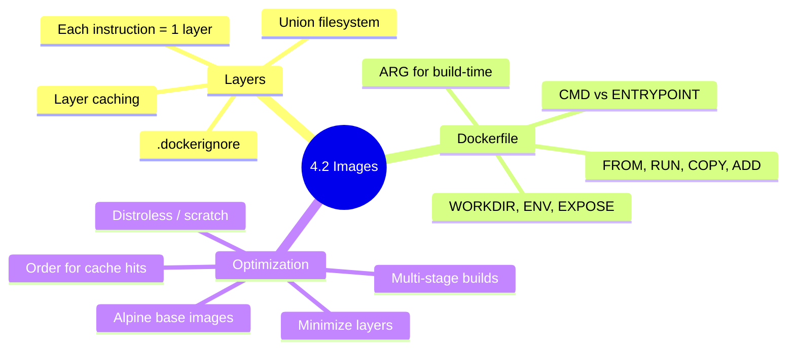

# 4.2.3 Subchapter Review: Cheatsheet and Interview Prep

This review covers only the material presented in Notes 4.2.1 (Image Layers and Dockerfile Basics) and 4.2.2 (Image Optimization and Multi-Stage Builds). No forward referencing beyond what was explicitly introduced.



***

## Cheatsheet: Docker Images and Dockerfiles

### Union Filesystem and Layers

| Layer Type          | Read/Write | Persistence             |
| ------------------- | ---------- | ----------------------- |
| Base image layers   | Read-only  | Permanent               |
| Intermediate layers | Read-only  | Permanent               |
| Container layer     | Read-write | Until container removed |

```bash
# View image layers
docker history IMAGE
docker history --no-trunc IMAGE
```

### Dockerfile Instructions

| Instruction   | Purpose                      | Example                                     |
| ------------- | ---------------------------- | ------------------------------------------- |
| `FROM`        | Base image                   | `FROM alpine:3.18`                          |
| `RUN`         | Execute command (build time) | `RUN apt update && apt install -y curl`     |
| `COPY`        | Copy files from host         | `COPY app.py /app/`                         |
| `ADD`         | Copy + auto-extract          | `ADD app.tar.gz /app/`                      |
| `WORKDIR`     | Set working directory        | `WORKDIR /app`                              |
| `ENV`         | Environment variable         | `ENV NODE_ENV=production`                   |
| `ARG`         | Build-time variable          | `ARG VERSION=1.0`                           |
| `EXPOSE`      | Document port                | `EXPOSE 8080`                               |
| `CMD`         | Default command              | `CMD ["node", "server.js"]`                 |
| `ENTRYPOINT`  | Main executable              | `ENTRYPOINT ["/app/entrypoint.sh"]`         |
| `USER`        | Run as non-root              | `USER appuser`                              |
| `LABEL`       | Metadata                     | `LABEL version="1.0"`                       |
| `HEALTHCHECK` | Health probe                 | `HEALTHCHECK CMD curl -f http://localhost/` |

### Base Image Sizes

| Base Image          | Size | Shell | Use Case              |
| ------------------- | ---- | ----- | --------------------- |
| `ubuntu:22.04`      | 78MB | bash  | Full OS               |
| `debian:12-slim`    | 44MB | bash  | Smaller Debian        |
| `alpine:3.18`       | 7MB  | sh    | Minimal, fast         |
| `distroless/static` | 2MB  | None  | Production (no shell) |
| `scratch`           | 0MB  | None  | Static binaries       |

### .dockerignore (Common Entries)

```
.git/
node_modules/
__pycache__/
*.pyc
.env
Dockerfile
README.md
```

### Multi-Stage Build Pattern

```dockerfile
# Stage 1: Build (has compilers, tools)
FROM golang:1.21-alpine AS builder
WORKDIR /app
COPY . .
RUN go build -o myapp

# Stage 2: Runtime (no build tools)
FROM alpine:3.18
WORKDIR /app
COPY --from=builder /app/myapp .
CMD ["./myapp"]
```

### Layer Caching Rules

| Instruction    | Cache Invalidated When |
| -------------- | ---------------------- |
| `FROM`         | Different base image   |
| `RUN`          | Command string changes |
| `COPY` / `ADD` | File content changes   |
| `ENV`          | Value changes          |
| `ARG`          | Value changes          |

### Security Scanning

```bash
# Trivy
trivy image myapp:latest

# Docker Scout
docker scout quickview myapp:latest
```

### Optimization Techniques Summary

| Technique            | Impact           | Effort |
| -------------------- | ---------------- | ------ |
| Alpine base          | 50-80% reduction | Low    |
| Multi-stage builds   | 70-90% reduction | Medium |
| `.dockerignore`      | 10-50% reduction | Low    |
| Combine RUN commands | 20-30% reduction | Low    |
| Distroless base      | 90%+ reduction   | Medium |

***

## Comparison Tables

### COPY vs ADD

| Feature          | COPY         | ADD                    |
| ---------------- | ------------ | ---------------------- |
| Copy local files | Yes          | Yes                    |
| Auto-extract tar | No           | Yes                    |
| Remote URLs      | No           | Yes (avoid)            |
| Recommendation   | **Use COPY** | Use only for local tar |

### ENV vs ARG

| Feature                 | ENV               | ARG                      |
| ----------------------- | ----------------- | ------------------------ |
| Available at build      | Yes               | Yes                      |
| Available at runtime    | Yes               | No                       |
| Persists in final image | Yes               | No                       |
| Override                | At runtime (`-e`) | At build (`--build-arg`) |

### CMD vs ENTRYPOINT

| Feature           | CMD                             | ENTRYPOINT                |
| ----------------- | ------------------------------- | ------------------------- |
| Can be overridden | Yes (`docker run IMAGE cmd`)    | No (needs `--entrypoint`) |
| Default purpose   | Default arguments               | Main executable           |
| Combined use      | Provides defaults to ENTRYPOINT | Defines the binary        |

### Base Image Comparison

| Base        | Size | Package Manager | Shell        | Security                         |
| ----------- | ---- | --------------- | ------------ | -------------------------------- |
| Ubuntu      | 78MB | apt             | bash         | More packages = more CVEs        |
| Debian slim | 44MB | apt             | bash         | Fewer packages                   |
| Alpine      | 7MB  | apk             | sh (BusyBox) | Minimal attack surface           |
| Distroless  | 2MB  | None            | None         | Extremely secure                 |
| Scratch     | 0MB  | None            | None         | Most secure (nothing to exploit) |

***

## Interview Questions (Scenario-Based)

These questions assume only knowledge from Subchapter 4.2. Answers reference only concepts from 4.2.1 and 4.2.2.

### Question 1

**Scenario:** A developer's Dockerfile builds a 1.2GB Python image. The application is a simple Flask API. The Dockerfile is:

```dockerfile
FROM python:latest
COPY . .
RUN pip install -r requirements.txt
CMD ["python", "app.py"]
```

**Question:** Why is the image so large? Suggest at least 4 optimizations to reduce size.

**Answer:**

**Why it's large:**

1. `python:latest` is large (\~900MB) – includes full OS, build tools, documentation
2. No `.dockerignore` – likely copying `node_modules`, `.git`, `__pycache__`
3. No layer optimization – dependencies reinstalled on every code change
4. No cleanup – pip cache remains in image

**Optimizations:**

**1. Use smaller base image:**

```dockerfile
FROM python:3.11-slim  # ~120MB instead of ~900MB
# OR
FROM python:3.11-alpine  # ~50MB
```

**2. Add** **`.dockerignore`:**

```
.git/
__pycache__/
*.pyc
.env
Dockerfile
README.md
tests/
```

**3. Optimize layer ordering:**

```dockerfile
FROM python:3.11-slim
WORKDIR /app
# Copy requirements first (cached unless changed)
COPY requirements.txt .
RUN pip install --no-cache-dir -r requirements.txt
# Copy code last (changes frequently)
COPY . .
CMD ["python", "app.py"]
```

**4. Clean up in same layer:**

```dockerfile
RUN pip install --no-cache-dir -r requirements.txt && \
    rm -rf /root/.cache/pip
```

**5. Use multi-stage build (if compilation needed):**

```dockerfile
# Build stage (if you have compilation)
FROM python:3.11-slim AS builder
COPY requirements.txt .
RUN pip install --user -r requirements.txt

# Runtime stage
FROM python:3.11-slim
WORKDIR /app
COPY --from=builder /root/.local /root/.local
COPY . .
ENV PATH=/root/.local/bin:$PATH
CMD ["python", "app.py"]
```

**Expected size reduction:** 1.2GB → \~150MB (87% reduction)

### Question 2

**Scenario:** A CI pipeline builds a Docker image every commit. The build takes 10 minutes. The Dockerfile has:

```dockerfile
FROM node:18
COPY . .
RUN npm install
RUN npm run build
CMD ["npm", "start"]
```

**Question:** Why are builds slow? How would you restructure to use layer caching effectively? Show the improved Dockerfile.

**Answer:**

**Why builds are slow:**

* `COPY . .` before `npm install` means ANY file change invalidates the cache for `npm install`

* Every commit rebuilds all dependencies from scratch (even if `package.json` unchanged)

* No `.dockerignore` – copying `node_modules` from host (then overwriting)

**Improved Dockerfile:**

```dockerfile
FROM node:18-alpine

WORKDIR /app

# Copy package files first (cache efficient)
COPY package*.json ./

# Install dependencies (cached unless package.json changes)
RUN npm ci --only=production --no-audit --no-fund

# Copy source code last (changes frequently)
COPY . .

# Build (cached unless source changes)
RUN npm run build

# Expose port
EXPOSE 3000

CMD ["npm", "start"]
```

**Additional optimizations:**

1. **Add** **`.dockerignore`:**

```
node_modules/
.git/
.env
Dockerfile
.dockerignore
*.log
tests/
```

1. **Use multi-stage build for production:**

```dockerfile
# Build stage
FROM node:18-alpine AS builder
WORKDIR /app
COPY package*.json ./
RUN npm ci
COPY . .
RUN npm run build

# Production stage
FROM node:18-alpine
WORKDIR /app
COPY --from=builder /app/dist ./dist
COPY --from=builder /app/package*.json ./
RUN npm ci --only=production --no-audit --no-fund
EXPOSE 3000
CMD ["node", "dist/server.js"]
```

1. **Use npm ci instead of npm install:**

* `npm ci` is faster, uses lockfile, enforces exact versions

* Fails if `package-lock.json` is out of sync

**Expected improvement:** Build time from 10 minutes → 30 seconds (when only source changes)

### Question 3

**Scenario:** A security scan reports 50+ critical vulnerabilities in your production image. The image is based on `ubuntu:22.04` and includes `curl`, `wget`, `python3`, `build-essential`, and `nginx`.

**Question:** How would you reduce the attack surface? Provide a security-optimized Dockerfile.

**Answer:**

**Principles for secure images:**

1. Use smaller base images (fewer packages = fewer CVEs)
2. Remove package manager in final stage
3. Run as non-root user
4. Use distroless where possible
5. Scan regularly

**Security-optimized Dockerfile:**

```dockerfile
# Stage 1: Build (if compilation needed)
FROM ubuntu:22.04 AS builder
RUN apt update && apt install -y --no-install-recommends \
    build-essential \
    curl \
    && rm -rf /var/lib/apt/lists/*

# Stage 2: Runtime (minimal)
FROM gcr.io/distroless/static-debian11

# Copy only needed binaries
COPY --from=builder /usr/bin/curl /usr/bin/curl

# Copy application
COPY --chown=nonroot:nonroot app /app

# Note: No shell, no package manager
# Can't use RUN, can't install packages

ENTRYPOINT ["/app"]
```

**Alternative (if you need a shell for debugging, but want security):**

```dockerfile
FROM alpine:3.18

# Install only required packages
RUN apk add --no-cache --update \
    nginx \
    python3 \
    && rm -rf /var/cache/apk/*

# Remove package manager after install
RUN rm -rf /sbin/apk /usr/bin/apk

# Create non-root user
RUN addgroup -g 1001 -S nginx && \
    adduser -u 1001 -S nginx -G nginx

# Switch to non-root
USER nginx

# Use specific versions (not latest)
ENV NGINX_VERSION=1.24.0

# Health check
HEALTHCHECK --interval=30s --timeout=3s \
  CMD curl -f http://localhost/ || exit 1

EXPOSE 80
CMD ["nginx", "-g", "daemon off;"]
```

**Security scanning command:**

```bash
# Scan for vulnerabilities
trivy image --severity CRITICAL,HIGH myapp:latest

# Compare with minimal base
docker scout compare myapp:latest --to alpine:3.18
```

**Expected reduction:** Vulnerabilities from 50+ to <5

### Question 4

**Scenario:** A Go application Dockerfile builds a 800MB image. The developer wants a production image under 20MB.

**Question:** Write a multi-stage Dockerfile that achieves this. Explain each stage.

**Answer:**

**Multi-stage Dockerfile:**

```dockerfile
# Stage 1: Builder
FROM golang:1.21-alpine AS builder

# Install build dependencies (if needed)
RUN apk add --no-cache git ca-certificates

# Set build arguments
ARG VERSION=dev
ARG COMMIT=unknown

WORKDIR /build

# Copy go mod files first (for caching)
COPY go.mod go.sum ./
RUN go mod download

# Copy source code
COPY . .

# Build static binary with optimizations
# CGO_ENABLED=0: static binary (no libc dependency)
# GOOS=linux GOARCH=amd64: target platform
# -ldflags="-s -w": strip debug info (reduces size)
RUN CGO_ENABLED=0 GOOS=linux GOARCH=amd64 go build \
    -ldflags="-s -w -X main.version=${VERSION} -X main.commit=${COMMIT}" \
    -o myapp .

# Stage 2: Runtime
FROM scratch

# Copy CA certificates (for HTTPS)
COPY --from=builder /etc/ssl/certs/ca-certificates.crt /etc/ssl/certs/

# Copy timezone data (optional)
COPY --from=builder /usr/share/zoneinfo /usr/share/zoneinfo

# Copy binary
COPY --from=builder /build/myapp /myapp

# Expose port (documentation only)
EXPOSE 8080

# Run as non-root (scratch has no users, so use UID directly)
USER 1001:1001

ENTRYPOINT ["/myapp"]
```

**Explanation of each stage:**

| Stage       | Purpose             | Key Features                         |
| ----------- | ------------------- | ------------------------------------ |
| **Builder** | Compile application | Has Go compiler, git, full toolchain |
| **Runtime** | Run application     | `FROM scratch` – completely empty    |

**Why this is small:**

* `scratch` base image: 0 bytes

* Static binary (CGO\_ENABLED=0): no libc dependencies

* `-ldflags="-s -w"`: strips debug symbols (\~30% reduction)

* No shell, no package manager, no unnecessary files

**Size breakdown:**

* Go binary: \~10-15MB

* CA certificates: \~200KB

* Total: \~15MB (from 800MB → 98% reduction)

**Build command:**

```bash
docker build \
  --build-arg VERSION=1.2.3 \
  --build-arg COMMIT=$(git rev-parse --short HEAD) \
  -t myapp:1.2.3 .
```

### Question 5

**Scenario:** A Docker build fails with:

```
ERROR: failed to solve: failed to compute cache key: "/requirements.txt" not found
```

**Question:** What causes this error? How would you fix it? What other common Dockerfile errors should you check?

**Answer:**

**Cause:** The `COPY requirements.txt .` instruction references a file that doesn't exist in the build context.

**Most common reasons:**

1. `requirements.txt` is not in the same directory as Dockerfile
2. `requirements.txt` is listed in `.dockerignore`
3. The file was renamed (e.g., `requirements-prod.txt`)
4. Running build from wrong directory

**Fix:**

```bash
# Check if file exists
ls -la requirements.txt

# Build from correct directory
cd /path/to/app
docker build -t myapp .

# Or specify context explicitly
docker build -t myapp -f docker/Dockerfile .
# Where docker/Dockerfile references files relative to current directory
```

**Correct Dockerfile:**

```dockerfile
FROM python:3.11-slim
WORKDIR /app
# Ensure file exists in build context
COPY requirements.txt .
RUN pip install --no-cache-dir -r requirements.txt
COPY . .
CMD ["python", "app.py"]
```

**Other common Dockerfile errors and fixes:**

| Error                              | Cause                                             | Fix                                                   |
| ---------------------------------- | ------------------------------------------------- | ----------------------------------------------------- |
| `COPY failed: file not found`      | File missing or wrong path                        | Check file exists, use correct relative path          |
| `no FROM statement found`          | Missing `FROM` as first instruction               | Add `FROM` at top of Dockerfile                       |
| `RUN apt-get install` failed       | Missing `apt update`                              | Add `RUN apt update && apt install`                   |
| `no such file or directory` in CMD | Binary not in PATH or missing                     | Use absolute path or check `COPY`                     |
| `permission denied`                | Trying to run as non-root with insufficient perms | `RUN chmod +x /app/script` or use `USER root`         |
| `invalid reference format`         | Image tag has invalid characters                  | Use lowercase, no spaces: `myapp:1.0` not `MyApp:1.0` |

**Debugging checklist:**

```bash
# 1. Check build context
docker build --no-cache --progress=plain -t test . 2>&1 | head -30

# 2. List files in context
tar -czf - . | tar -tzf - | head -20

# 3. Use specific Dockerfile location
docker build -f path/to/Dockerfile -t test .

# 4. Check .dockerignore
cat .dockerignore
```

***

## Topics Covered in This Subchapter (Self-Check)

| Topic                                                                                                                        | Found in Note |
| ---------------------------------------------------------------------------------------------------------------------------- | ------------- |
| Union filesystem (overlay2)                                                                                                  | 4.2.1         |
| Image layers and layer caching                                                                                               | 4.2.1         |
| Dockerfile instructions (FROM, RUN, COPY, ADD, WORKDIR, ENV, ARG, EXPOSE, CMD, ENTRYPOINT, USER, LABEL, HEALTHCHECK, VOLUME) | 4.2.1         |
| COPY vs ADD                                                                                                                  | 4.2.1         |
| ENV vs ARG                                                                                                                   | 4.2.1         |
| CMD vs ENTRYPOINT                                                                                                            | 4.2.1         |
| Layer caching optimization                                                                                                   | 4.2.1         |
| Base image selection (Ubuntu, Alpine, Distroless, Scratch)                                                                   | 4.2.2         |
| Base image sizes and trade-offs                                                                                              | 4.2.2         |
| `.dockerignore`                                                                                                              | 4.2.2         |
| Multi-stage builds                                                                                                           | 4.2.2         |
| Combining RUN commands                                                                                                       | 4.2.2         |
| Removing temporary files                                                                                                     | 4.2.2         |
| Security scanning (Trivy, Docker Scout)                                                                                      | 4.2.2         |
| Image size analysis (docker history, dive)                                                                                   | 4.2.2         |

## Bridge Concepts (Not in Notes but Added for Clarity)

| Concept                   | Explanation                                                                                                                 |
| ------------------------- | --------------------------------------------------------------------------------------------------------------------------- |
| `npm ci`                  | Faster, stricter npm install that uses package-lock.json exactly. Better for CI/CD than `npm install`.                      |
| `CGO_ENABLED=0`           | Go environment variable to disable CGO (creates static binary with no libc dependency). Enables using `scratch` base image. |
| `-ldflags="-s -w"`        | Go linker flags: `-s` strips symbol table, `-w` strips DWARF debug info. Reduces binary size by \~30%.                      |
| `--no-cache-dir`          | pip flag to prevent caching packages locally. Reduces image size.                                                           |
| `--no-install-recommends` | apt flag to skip recommended packages. Reduces image size.                                                                  |
| Overlay2                  | Default storage driver for Docker on Linux. Uses overlayFS for efficient layer storage.                                     |

***

---

## Quick Command Reference

| Command | Purpose |
|---------|---------|
| `docker build -t TAG .` | Build image from Dockerfile |
| `docker build --no-cache -t TAG .` | Build without cache |
| `docker build --build-arg VAR=val .` | Pass build arguments |
| `docker history IMAGE` | View image layers |
| `docker history --no-trunc IMAGE` | Full layer details |
| `docker images` | List images |
| `docker rmi IMAGE` | Remove image |
| `docker image prune` | Remove dangling images |
| `docker image prune -a` | Remove all unused images |
| `docker tag SOURCE TARGET` | Add tag to image |
| `docker push IMAGE` | Push to registry |
| `docker pull IMAGE` | Pull from registry |
| `docker save IMAGE > file.tar` | Export image to tar |
| `docker load < file.tar` | Import image from tar |
| `docker inspect IMAGE` | Show image details |
| `trivy image IMAGE` | Scan for vulnerabilities |
| `docker scout quickview IMAGE` | Docker security scan |
| `dive IMAGE` | Interactive layer explorer |

---

## Backlinks

- [4.2.1 Image Layers and Dockerfile Basics](./4.2.1_Image_Layers_and_Dockerfile_Basics.md) – Dockerfile instructions
- [4.2.2 Image Optimization](./4.2.2_Image_Optimization_and_Multi_Stage_Builds.md) – Multi-stage builds
- [4.1.2 Docker Installation](../Subchapter_4.1/4.1.2_Docker_Installation_and_First_Container.md) – Basic Docker commands
- [1.1.2 Package Management](../../1-Linux/Subchapter_1.1/1.1.2_Package_Management_Essentials.md) – apt, apk used in Dockerfiles

---

**End of Subchapter 4.2 Review**

**Next:** Proceed to Subchapter 4.3 – Container Operations and Networking (container lifecycle, resource management, Docker networking drivers, port publishing).
