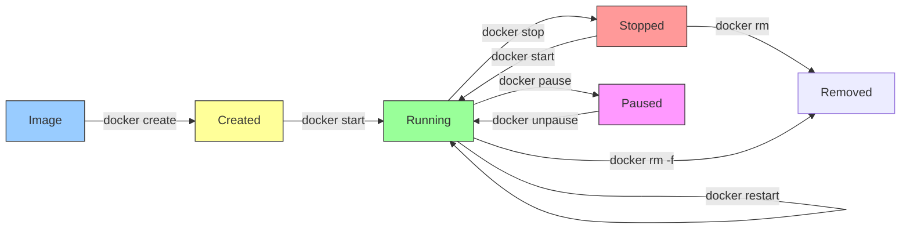

# 4.3.1 Container Lifecycle and Resource Management: Running in Production

#### Why Container Operations Matter

Running a container once is easy. Running containers reliably in production requires understanding:

* How to start, stop, and restart containers gracefully

* How to limit resource usage (CPU, memory) to prevent noisy neighbors

* How to monitor container health and logs

* How to ensure containers restart after crashes or host reboots

This note covers container lifecycle management and resource controls. Note 4.3.2 covers Docker networking; note 4.3.3 is the subchapter review.

***

## Part 1: Container Lifecycle Commands

### Complete Lifecycle Overview



### Essential Lifecycle Commands

| Command          | Purpose                        | Example                            |
| ---------------- | ------------------------------ | ---------------------------------- |
| `docker create`  | Create container (don't start) | `docker create --name myapp nginx` |
| `docker start`   | Start stopped container        | `docker start myapp`               |
| `docker stop`    | Stop gracefully (SIGTERM)      | `docker stop myapp`                |
| `docker kill`    | Force stop (SIGKILL)           | `docker kill myapp`                |
| `docker restart` | Stop then start                | `docker restart myapp`             |
| `docker pause`   | Freeze all processes           | `docker pause myapp`               |
| `docker unpause` | Unfreeze processes             | `docker unpause myapp`             |
| `docker rm`      | Remove stopped container       | `docker rm myapp`                  |
| `docker rm -f`   | Force remove running           | `docker rm -f myapp`               |
| `docker wait`    | Wait for container to exit     | `docker wait myapp`                |

### Graceful Shutdown (SIGTERM vs SIGKILL)

```bash
# Docker sends SIGTERM to container's PID 1
docker stop myapp
# Waits 10 seconds (default) for graceful shutdown
# Then sends SIGKILL if still running

# Custom stop timeout (30 seconds)
docker stop --time=30 myapp

# Force immediate kill (no grace period)
docker kill myapp
```

**Inside the container (signal handling):**

```dockerfile
# Python example – handles SIGTERM gracefully
import signal
import sys

def graceful_shutdown(signum, frame):
    print("Received SIGTERM, cleaning up...")
    # Close database connections, flush logs, etc.
    sys.exit(0)

signal.signal(signal.SIGTERM, graceful_shutdown)
```

### Container Naming and Identification

```bash
# Name container at creation
docker run -d --name web nginx

# Reference by name
docker stop web
docker start web

# Reference by ID (first few characters)
docker run -d nginx
# Container ID: a1b2c3d4e5f6...
docker stop a1b2

# Generate random name (default)
docker run -d nginx
# Name: festive_poitras (random adjective + scientist)
```

***

## Part 2: Resource Limits (Cgroups in Practice)

### CPU Limits

```bash
# Limit to 1.5 CPU cores
docker run -d --cpus=1.5 nginx

# CPU shares (relative weight, default 1024)
docker run -d --cpu-shares=512 low-priority-app
docker run -d --cpu-shares=2048 high-priority-app

# CPU quota (more precise)
docker run -d --cpu-quota=50000 --cpu-period=100000 nginx  # 50% of one core

# CPU set (pin to specific cores)
docker run -d --cpuset-cpus=0,2 nginx  # Use only cores 0 and 2
```

**How CPU limits work:**

* `--cpus=1.5` = 1.5 cores = 150,000 microseconds per 100,000 microsecond period

* Container gets CPU time proportionally to its share / total shares

### Memory Limits

```bash
# Hard limit (container killed if exceeded)
docker run -d --memory=512m nginx

# Memory + swap limit
docker run -d --memory=512m --memory-swap=1g nginx

# Disable swap (swap limit = memory limit)
docker run -d --memory=512m --memory-swap=512m nginx

# Memory reservation (soft limit)
docker run -d --memory-reservation=256m nginx

# Kernel memory limit
docker run -d --kernel-memory=100m nginx
```

**Memory limit behaviors:**

* Exceeding hard limit → OOM killer kills container

* Using swap → slower but prevents OOM

* No limit → container can consume all host memory

### Disk I/O Limits

```bash
# Read/write rate limits (bytes per second)
docker run -d --device-read-bps=/dev/sda:10mb nginx
docker run -d --device-write-bps=/dev/sda:10mb nginx

# IOPS limits (operations per second)
docker run -d --device-read-iops=/dev/sda:100 nginx
docker run -d --device-write-iops=/dev/sda:100 nginx
```

### Process Limits

```bash
# Limit number of processes inside container
docker run -d --pids-limit=100 nginx
```

### Viewing Resource Usage

```bash
# Real-time stats for all containers
docker stats

# Specific container
docker stats myapp

# One-shot (no streaming)
docker stats --no-stream myapp

# Format for scripting
docker stats --format "table {{.Name}}\t{{.CPUPerc}}\t{{.MemUsage}}"

# Container processes (like top)
docker top myapp

# Container resource usage details
docker inspect myapp | grep -A 10 "Resources"
```

***

## Part 3: Restart Policies

### Restart Policy Options

| Policy                     | Behavior                               | Use Case                               |
| -------------------------- | -------------------------------------- | -------------------------------------- |
| `no`                       | Never restart (default)                | Batch jobs, one-off tasks              |
| `on-failure[:max-retries]` | Restart only on non-zero exit          | Apps that crash but not on normal exit |
| `always`                   | Always restart                         | Web servers, daemons                   |
| `unless-stopped`           | Always restart unless manually stopped | Production services                    |

```bash
# Always restart (unless manually stopped)
docker run -d --restart=always nginx

# Restart on failure, max 5 attempts
docker run -d --restart=on-failure:5 myapp

# Always restart (even if stopped manually? no)
docker run -d --restart=unless-stopped nginx
```

### Restart Policy Behavior Examples

| Exit Code     | `no` | `on-failure` | `always`            | `unless-stopped`    |
| ------------- | ---- | ------------ | ------------------- | ------------------- |
| 0 (normal)    | Stop | Stop         | Restart             | Restart             |
| 1 (error)     | Stop | Restart      | Restart             | Restart             |
| 137 (SIGKILL) | Stop | Restart      | Restart             | Restart             |
| Manual stop   | Stop | Stop         | Stop (until reboot) | Stop (until reboot) |

### Updating Restart Policy

```bash
# Update existing container
docker update --restart=always myapp

# View current restart policy
docker inspect myapp | grep -A 3 "RestartPolicy"
```

***

## Part 4: Health Checks

### Why Health Checks Matter

Without health checks, Docker only knows if the container process is running. A container could be "running" but unresponsive (deadlock, infinite loop). Health checks actively probe the application.

### Defining Health Checks

```dockerfile
# In Dockerfile
HEALTHCHECK --interval=30s --timeout=3s --start-period=5s --retries=3 \
  CMD curl -f http://localhost/ || exit 1
```

| Option           | Default | Meaning                             |
| ---------------- | ------- | ----------------------------------- |
| `--interval`     | 30s     | How often to run check              |
| `--timeout`      | 30s     | Max time for check to complete      |
| `--start-period` | 0s      | Grace period before starting checks |
| `--retries`      | 3       | Failures needed to mark unhealthy   |

### Health Check Commands

```bash
# Run with health check from command line
docker run -d --health-cmd="curl -f http://localhost/ || exit 1" \
  --health-interval=30s \
  --health-timeout=3s \
  --health-retries=3 \
  nginx

# View health status
docker ps
# CONTAINER ID   IMAGE   STATUS
# abc123         nginx   Up 5 minutes (healthy)

# Detailed health info
docker inspect --format='{{json .State.Health}}' myapp | jq

# Wait for healthy (useful in scripts)
docker run --health-cmd="curl -f http://localhost:8080/health" \
  --health-interval=1s \
  myapp
while ! docker inspect --format='{{.State.Health.Status}}' myapp | grep -q healthy; do
    sleep 1
done
```

### Health Check Examples

**PostgreSQL:**

```dockerfile
HEALTHCHECK --interval=5s --timeout=3s --retries=3 \
  CMD pg_isready -U postgres || exit 1
```

**Redis:**

```dockerfile
HEALTHCHECK --interval=5s --timeout=3s --retries=3 \
  CMD redis-cli ping || exit 1
```

**Custom HTTP API:**

```dockerfile
HEALTHCHECK --interval=30s --timeout=3s --start-period=10s --retries=3 \
  CMD curl -f http://localhost:8080/health || exit 1
```

***

## Part 5: Container Logs

### Viewing Logs

```bash
# Show all logs
docker logs myapp

# Show last 100 lines
docker logs --tail 100 myapp

# Follow new logs (like tail -f)
docker logs -f myapp

# Show timestamps
docker logs -t myapp

# Show logs since specific time
docker logs --since 2024-01-16T10:00:00 myapp
docker logs --since 30m myapp

# Show logs up to specific time
docker logs --until 2024-01-16T11:00:00 myapp
```

### Log Drivers

Docker supports multiple log drivers (configured in daemon.json or per container).

| Driver      | Description                   | Use Case            |
| ----------- | ----------------------------- | ------------------- |
| `json-file` | Default, writes to JSON files | Local development   |
| `journald`  | Systemd journal               | RHEL/CentOS systems |
| `syslog`    | Syslog daemon                 | Centralized logging |
| `fluentd`   | Fluentd                       | Log aggregation     |
| `awslogs`   | Amazon CloudWatch             | AWS production      |
| `gelf`      | Graylog Extended Log Format   | Graylog/ELK         |
| `none`      | No logging                    | Disable logs        |

```bash
# Run with specific log driver
docker run -d --log-driver=syslog --log-opt syslog-address=udp://localhost:514 nginx

# Limit log size (json-file)
docker run -d --log-opt max-size=10m --log-opt max-file=3 nginx
```

### Log Rotation (json-file)

```json
// /etc/docker/daemon.json
{
  "log-driver": "json-file",
  "log-opts": {
    "max-size": "10m",
    "max-file": "3",
    "compress": "true"
  }
}
```

***

## Part 6: Container Inspection and Debugging

### Inspecting Containers

```bash
# Full inspection (JSON)
docker inspect myapp

# Specific fields (using --format)
docker inspect --format='{{.State.Status}}' myapp
docker inspect --format='{{.NetworkSettings.IPAddress}}' myapp
docker inspect --format='{{.Config.Env}}' myapp

# Multiple fields
docker inspect --format='Name: {{.Name}} IP: {{.NetworkSettings.IPAddress}}' myapp
```

### Debugging Running Containers

```bash
# Execute command inside running container
docker exec -it myapp bash
docker exec myapp ls -la /app

# Run as different user
docker exec -u root myapp cat /etc/shadow

# Set environment variable for exec
docker exec -e DEBUG=1 myapp ./script.sh

# Copy files from container
docker cp myapp:/var/log/app.log ./app.log

# Copy files to container
docker cp ./config.yaml myapp:/app/config.yaml
```

### Troubleshooting Container Issues

```bash
# Check container exit code
docker inspect myapp --format='{{.State.ExitCode}}'

# Check why container exited
docker logs myapp

# Check resource usage history
docker stats --no-stream myapp

# Check container filesystem changes
docker diff myapp
# A = added, C = changed, D = deleted

# Check processes inside
docker top myapp
```

***

## Part 7: Production Readiness Checklist

| Check                   | Command                          | Why                       |
| ----------------------- | -------------------------------- | ------------------------- |
| Set resource limits     | `--memory=512m --cpus=0.5`       | Prevent noisy neighbors   |
| Set restart policy      | `--restart=always`               | Auto-recover from crashes |
| Add health check        | `HEALTHCHECK` in Dockerfile      | Detect unresponsive app   |
| Limit log size          | `--log-opt max-size=10m`         | Prevent disk full         |
| Run as non-root         | `USER appuser` in Dockerfile     | Security                  |
| Use specific image tags | `myapp:1.2.3` not `latest`       | Reproducibility           |
| Set stop timeout        | `--stop-timeout=30`              | Graceful shutdown         |
| Label containers        | `--label environment=production` | Organization              |

***

## Quick Task: Production Container

*Run a production-ready container with all best practices.*

```bash
# Run nginx with production settings
docker run -d \
  --name web \
  --restart=unless-stopped \
  --memory=256m \
  --cpus=0.5 \
  --log-opt max-size=10m \
  --log-opt max-file=3 \
  --label environment=production \
  --label version=1.0 \
  --health-cmd="curl -f http://localhost/ || exit 1" \
  --health-interval=30s \
  --health-timeout=3s \
  --health-retries=3 \
  -p 8080:80 \
  nginx:alpine

# Verify
docker ps
docker stats web --no-stream
docker inspect web | grep -A 10 "Health"

# Clean up
docker stop web && docker rm web
```

***

## Summary Table: Container Operations

| Command          | Purpose                        |
| ---------------- | ------------------------------ |
| `docker create`  | Create container (not started) |
| `docker start`   | Start stopped container        |
| `docker stop`    | Graceful stop (SIGTERM)        |
| `docker kill`    | Force stop (SIGKILL)           |
| `docker restart` | Stop then start                |
| `docker pause`   | Freeze processes               |
| `docker unpause` | Unfreeze processes             |
| `docker rm`      | Remove container               |
| `docker logs`    | View output                    |
| `docker exec`    | Run command inside             |
| `docker stats`   | Resource usage                 |
| `docker top`     | Processes inside               |
| `docker inspect` | Detailed info                  |
| `docker diff`    | Filesystem changes             |
| `docker cp`      | Copy files                     |

### Resource Limit Flags

| Resource     | Flag                | Example                           |
| ------------ | ------------------- | --------------------------------- |
| CPU cores    | `--cpus`            | `--cpus=1.5`                      |
| CPU shares   | `--cpu-shares`      | `--cpu-shares=512`                |
| CPU set      | `--cpuset-cpus`     | `--cpuset-cpus=0,2`               |
| Memory limit | `--memory`          | `--memory=512m`                   |
| Memory swap  | `--memory-swap`     | `--memory-swap=1g`                |
| PIDs limit   | `--pids-limit`      | `--pids-limit=100`                |
| Read BPS     | `--device-read-bps` | `--device-read-bps=/dev/sda:10mb` |

### Restart Policies

| Policy           | Behavior                       |
| ---------------- | ------------------------------ |
| `no`             | Never restart                  |
| `on-failure[:N]` | Restart on error (max N times) |
| `always`         | Always restart                 |
| `unless-stopped` | Always unless manually stopped |

### Health Check Options

| Option                  | Default | Meaning                      |
| ----------------------- | ------- | ---------------------------- |
| `--health-cmd`          | –       | Command to check health      |
| `--health-interval`     | 30s     | Check frequency              |
| `--health-timeout`      | 30s     | Max check duration           |
| `--health-start-period` | 0s      | Grace period                 |
| `--health-retries`      | 3       | Failures to become unhealthy |

***

**Next note (4.3.2)** will cover **Docker Networking Deep Dive** – network drivers (bridge, host, none, overlay, macvlan), port publishing, and container-to-container communication.

**Backward references:**

* Namespaces and cgroups from 4.1.1 (resource limits use cgroups)

* Process management from Module 1 (signals SIGTERM/SIGKILL)

* Systemd from Module 1 (restart policies similar to systemd)

* Logging from Module 3 (log drivers and rotation)
