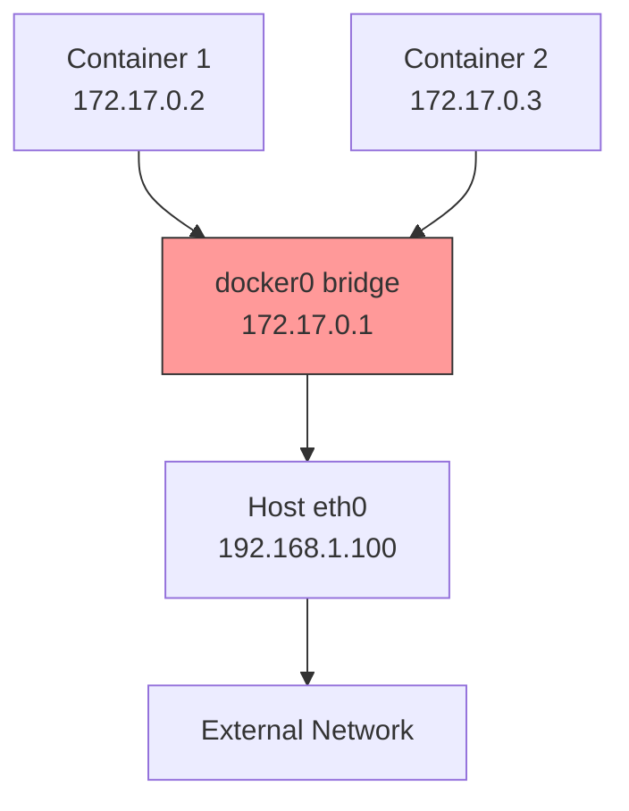
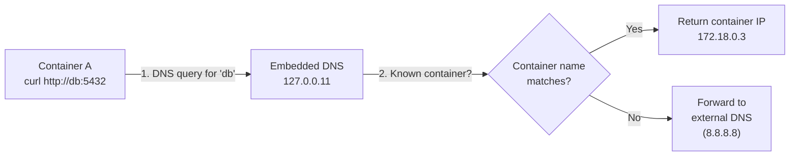

# 4.3.2 Docker Networking Deep Dive: Connecting Containers

#### Why Container Networking Matters

Containers are useless in isolation. Modern applications consist of multiple containers communicating over the network:

* Web server talking to database

* API gateway routing to microservices

* Load balancer distributing traffic

Docker provides several networking models, from simple port mapping to overlay networks spanning multiple hosts. This note covers all Docker network drivers. Note 4.3.1 covered container lifecycle; note 4.3.3 is the subchapter review.

***

## Part 1: Docker Network Architecture

### Network Namespace Recap (from 4.1.1)

Each container gets its own **network namespace** – isolated network stack with its own:

* Network interfaces (lo, eth0)

* IP address and routing table

* Port space (port 80 in container ≠ port 80 on host)

* Firewall rules (iptables)

### Docker Network Drivers

| Driver    | Description                                   | Use Case                                       |
| --------- | --------------------------------------------- | ---------------------------------------------- |
| `bridge`  | Default, private network on single host       | Most common for single-host setups             |
| `host`    | Share host's network namespace                | Performance, no isolation needed               |
| `none`    | No network (loopback only)                    | Isolated containers                            |
| `overlay` | Multi-host network (Swarm/Kubernetes)         | Clusters                                       |
| `macvlan` | Assign MAC address, appear as physical device | Legacy applications expecting physical network |
| `ipvlan`  | L3 routing, no MAC addresses                  | Large-scale L3 networks                        |

```bash
# List available networks
docker network ls
# NETWORK ID     NAME      DRIVER    SCOPE
# abc123         bridge    bridge    local
# def456         host      host      local
# 789abc         none      null      local
```

***

## Part 2: Bridge Network (Default)

### How Bridge Networking Works



### Default Bridge

```bash
# Default bridge network (created automatically)
docker network inspect bridge

# Run container on default bridge
docker run -d --name web nginx

# Check container IP
docker inspect web | grep IPAddress
# "IPAddress": "172.17.0.2"

# Containers can communicate by IP
docker exec web ping 172.17.0.3

# But NOT by name (no DNS on default bridge)
docker exec web ping db  # Fails
```

### User-Defined Bridge (Recommended)

User-defined bridges provide:

* **Automatic DNS resolution** – containers can reach each other by name

* **Better isolation** – only containers on same network communicate

* **Dynamic linking** – no need to restart containers when new ones join

```bash
# Create user-defined bridge
docker network create mynet

# Run containers on custom network
docker run -d --name web --network mynet nginx
docker run -d --name db --network mynet postgres

# Now containers can communicate by name!
docker exec web ping db  # Works!

# Connect existing container to network
docker network connect mynet existing-container

# Disconnect container
docker network disconnect mynet existing-container
```

### Bridge Network Commands

```bash
# Create bridge network
docker network create --driver bridge --subnet 10.5.0.0/16 --gateway 10.5.0.1 mynet

# List networks
docker network ls

# Inspect network
docker network inspect mynet

# Remove network (must have no containers)
docker network rm mynet

# Remove all unused networks
docker network prune
```

***

## Part 3: Docker's Embedded DNS Server (127.0.0.11)

When you use a user-defined network, Docker runs an **embedded DNS server** at `127.0.0.11` inside every container. Understanding how it works helps debug name resolution issues.

### How Container DNS Resolution Works



```bash
# Inside a container on user-defined network:
cat /etc/resolv.conf
# nameserver 127.0.0.11
# ndots:0

# DNS resolution resolves container names AND service aliases
docker run -d --name database --network mynet --network-alias db postgres
# Both "database" AND "db" resolve to this container's IP
```

### Network Aliases — Multiple Names for One Container

```bash
# Assign network aliases (like DNS CNAME records)
docker run -d --name postgres-primary \
  --network mynet \
  --network-alias db \
  --network-alias database \
  --network-alias pg \
  postgres

# All of these resolve to the same container:
docker exec web ping db
docker exec web ping database
docker exec web ping pg
docker exec web ping postgres-primary
```

### Debugging DNS Issues

```bash
# Check DNS config inside container
docker exec myapp cat /etc/resolv.conf

# Test DNS resolution
docker exec myapp nslookup db
# Server:    127.0.0.11
# Address:   127.0.0.11:53
# Name:      db
# Address:   172.18.0.3

# If DNS fails, check container is on the same network
docker network inspect mynet | jq '.[0].Containers'
```

### docker-proxy — The Userland Port Forwarder

When you publish a port with `-p`, Docker creates **two** forwarding paths:

| Path | Mechanism | When Used |
|------|-----------|-----------|
| **iptables DNAT** | Kernel-level NAT rules | External traffic (default, fast) |
| **docker-proxy** | Userland process per published port | Hairpin NAT (container → own published port) |

```bash
# See docker-proxy processes (one per published port)
ps aux | grep docker-proxy
# docker-proxy -proto tcp -host-ip 0.0.0.0 -host-port 8080 -container-ip 172.17.0.2 -container-port 80

# docker-proxy binds to the host port, forwarding to container
# This is why you see the port in netstat even without iptables
ss -tlnp | grep 8080
# LISTEN  docker-proxy  0.0.0.0:8080
```

**Disable docker-proxy** (use iptables only — better performance, but breaks hairpin NAT):

```json
// /etc/docker/daemon.json
{
  "userland-proxy": false
}
```

> **When to disable:** High-performance production hosts where containers don't need to access their own published ports. Saves one process per published port.

***

## Part 4: Host Network

### How Host Networking Works

Container shares the host's network namespace – no isolation, no virtual interfaces.

```bash
# Run with host network
docker run -d --name web --network host nginx

# Container uses host's IP and ports directly
# Port 80 in container = port 80 on host

# No port mapping needed (-p is ignored)
docker run -d --network host -p 8080:80 nginx  # -p has no effect
```

### When to Use Host Network

| Use Case                  | Why                            |
| ------------------------- | ------------------------------ |
| Performance-critical apps | No NAT overhead                |
| Network monitoring tools  | Need host's network interfaces |
| Legacy apps               | Expect specific IP/port        |
| Single container per host | No port conflicts              |

**Warning:** Only one container per port can run on host network (port conflicts).

***

## Part 5: Port Publishing (Port Mapping)

### Syntax

```bash
# Map container port to random host port
docker run -d -p 80 nginx
# Host port: 32768-65535 (random)

# Map specific host port to container port
docker run -d -p 8080:80 nginx

# Bind to specific host IP
docker run -d -p 192.168.1.100:8080:80 nginx

# UDP port mapping
docker run -d -p 53:53/udp dns

# Multiple port mappings
docker run -d -p 8080:80 -p 8443:443 nginx

# Range mapping
docker run -d -p 8000-8005:8000-8005 myapp
```

### How Port Publishing Works (iptables)

Docker uses iptables NAT rules to forward traffic:

```bash
# View Docker's iptables rules
sudo iptables -t nat -L -n | grep -A 10 DOCKER

# DNAT rule for port 8080 -> container
# Chain DOCKER (1 references)
# target     prot opt source         destination
# DNAT       tcp  --  0.0.0.0/0      0.0.0.0/0    tcp dpt:8080 to:172.17.0.2:80
```

### Publishing vs Exposing

| Concept                | Purpose                   | Effect                                    |
| ---------------------- | ------------------------- | ----------------------------------------- |
| `EXPOSE` in Dockerfile | Documentation             | No effect on networking                   |
| `-p` at runtime        | Actually publish port     | Creates iptables NAT rule                 |
| `-P` at runtime        | Publish all exposed ports | Maps each EXPOSE port to random host port |

```dockerfile
# Dockerfile
EXPOSE 80
EXPOSE 443
```

```bash
# Publish all exposed ports to random host ports
docker run -d -P nginx
# Host port 32768 -> container 80
# Host port 32769 -> container 443
```

***

## Part 6: Container-to-Container Communication

### Method 1: Same User-Defined Bridge (DNS)

```bash
# Create network
docker network create appnet

# Run containers
docker run -d --name web --network appnet nginx
docker run -d --name api --network appnet myapi
docker run -d --name db --network appnet postgres

# web can reach api and db by name
docker exec web curl http://api:8080
docker exec web ping db
```

### Method 2: Legacy Linking (Deprecated)

```bash
# --link is deprecated, avoid
docker run -d --name db postgres
docker run -d --name web --link db nginx
# web gets DB_* environment variables and /etc/hosts entry
```

### Method 3: Host Network (No Isolation)

```bash
docker run -d --name web --network host nginx
docker run -d --name db --network host postgres
# Both on same network stack, can use localhost
```

### Method 4: External Network Access

```bash
# Container accessing internet
docker run alpine ping google.com  # Works (NAT)

# Container accessing host's localhost
docker run --add-host=host.docker.internal:host-gateway alpine ping host.docker.internal
```

### DNS Configuration Options

```bash
# Custom DNS servers
docker run --dns=8.8.8.8 --dns=1.1.1.1 alpine cat /etc/resolv.conf

# Custom DNS search domains
docker run --dns-search=example.com alpine cat /etc/resolv.conf

# Custom hostname
docker run --hostname=mycontainer alpine hostname

# Add /etc/hosts entries
docker run --add-host=db:192.168.1.100 alpine ping db
```

| Flag | Purpose | Example |
|------|---------|---------|
| `--dns` | Custom DNS server | `--dns=8.8.8.8` |
| `--dns-search` | DNS search domain | `--dns-search=example.com` |
| `--hostname` | Set container hostname | `--hostname=myapp` |
| `--add-host` | Add /etc/hosts entry | `--add-host=db:10.0.0.5` |

***

## Part 7: None Network

```bash
# Completely isolated (only loopback)
docker run -d --name isolated --network none nginx

# No external network access
docker exec isolated ping google.com  # Fails

# Use case: security-sensitive batch jobs
```

***

## Part 8: Overlay Network (Multi-Host)

Overlay networks enable containers on different Docker hosts to communicate as if on the same network.

### Prerequisites

* Docker Swarm mode or Kubernetes

* Key-value store (consul, etcd) for older Docker versions

### Docker Swarm Overlay Example

```bash
# Initialize Swarm on manager node
docker swarm init --advertise-addr 192.168.1.10

# Create overlay network
docker network create -d overlay myoverlay

# Deploy services on the network
docker service create --name web --network myoverlay --replicas 3 nginx
```

### How Overlay Works (VXLAN)

Overlay networks use VXLAN encapsulation:

1. Container A (Host1) sends packet to Container B (Host2)
2. Docker encapsulates packet in UDP (port 4789)
3. VXLAN header contains segment ID (VNI)
4. Packet sent over physical network
5. Host2 decapsulates and delivers to Container B

```bash
# Check VXLAN interface (if overlay active)
ip -d link show type vxlan
```

***

## Part 9: Macvlan Network

Macvlan assigns a real MAC address to each container, making them appear as physical devices on the network.

### Use Cases

* Legacy applications expecting physical network

* Network monitoring tools

* DHCP-based environments

### Example

```bash
# Create macvlan network
docker network create -d macvlan \
  --subnet=192.168.1.0/24 \
  --gateway=192.168.1.1 \
  -o parent=eth0 \
  macnet

# Run container with macvlan
docker run -d --name web --network macnet --ip=192.168.1.100 nginx

# Container appears as separate device on network
# Can be reached directly at 192.168.1.100
```

**Note:** Host cannot communicate with macvlan containers (by design). Use ipvlan if host communication needed.

***

## Part 10: Network Troubleshooting

### Common Commands

```bash
# List networks
docker network ls

# Inspect network (shows connected containers)
docker network inspect bridge

# Check container's IP
docker inspect web | grep IPAddress

# Check container's network settings
docker exec web ip addr show
docker exec web ip route show

# Test connectivity
docker exec web ping db
docker exec web curl http://api:8080

# Check port mapping
docker port web
# 80/tcp -> 0.0.0.0:8080

# View iptables rules
sudo iptables -t nat -L -n
sudo iptables -L -n
```

### Common Network Issues

| Symptom                                   | Likely Cause                      | Fix                                   |
| ----------------------------------------- | --------------------------------- | ------------------------------------- |
| Containers can't reach each other by name | Using default bridge              | Create user-defined bridge            |
| Port already in use                       | Another container or host process | Change host port                      |
| No internet from container                | DNS not configured                | Check `/etc/resolv.conf` in container |
| Container can't reach host                | Docker network isolation          | Use `host.docker.internal`            |
| Can't connect to published port           | Firewall blocking                 | Check `iptables -L`                   |

***

## Quick Task: Docker Networking Practice

*Create and test Docker networks.*

1. Create a user-defined bridge network `appnet`.
2. Run an nginx container named `web` on `appnet`.
3. Run an alpine container named `tester` on `appnet`.
4. From `tester`, ping `web` by name.
5. Run another nginx container on default bridge, map port 8081:80.
6. Inspect both networks to see connected containers.

> **Ready Solution:**
>
> ```bash
> # Task 1
> docker network create appnet
>
> # Task 2
> docker run -d --name web --network appnet nginx
>
> # Task 3
> docker run -it --name tester --network appnet alpine sh
>
> # Task 4 (inside tester container)
> / # ping web
> # PING web (172.x.x.x): 56 data bytes
> # 64 bytes from 172.x.x.x: seq=0 ttl=64 time=0.1 ms
> # exit
>
> # Task 5
> docker run -d --name web2 -p 8081:80 nginx
>
> # Task 6
> docker network inspect appnet
> docker network inspect bridge
>
> # Clean up
> docker rm -f web tester web2
> docker network rm appnet
> ```

***

## Summary Table: Docker Network Drivers

| Driver             | Isolation | IP per container | DNS | Host Communication   | Multi-Host |
| ------------------ | --------- | ---------------- | --- | -------------------- | ---------- |
| `bridge` (default) | Medium    | Yes (NAT)        | No  | Via port mapping     | No         |
| `bridge` (user)    | High      | Yes (NAT)        | Yes | Via port mapping     | No         |
| `host`             | None      | No (host IP)     | N/A | Direct               | No         |
| `none`             | Complete  | No               | N/A | No                   | No         |
| `overlay`          | Medium    | Yes              | Yes | Via ingress          | Yes        |
| `macvlan`          | Low       | Yes (real MAC)   | Yes | Direct (as physical) | No         |

### Network Commands

| Command                     | Purpose          |
| --------------------------- | ---------------- |
| `docker network ls`         | List networks    |
| `docker network create`     | Create network   |
| `docker network inspect`    | Show details     |
| `docker network rm`         | Remove network   |
| `docker network prune`      | Remove unused    |
| `docker network connect`    | Attach container |
| `docker network disconnect` | Detach container |

### Port Publishing Flags

| Flag                     | Effect                        |
| ------------------------ | ----------------------------- |
| `-p 80:80`               | Map host 80 to container 80   |
| `-p 8080:80`             | Map host 8080 to container 80 |
| `-p 192.168.1.100:80:80` | Bind to specific host IP      |
| `-p 80`                  | Map to random host port       |
| `-p 53:53/udp`           | UDP mapping                   |
| `-P`                     | Publish all exposed ports     |

***

**Next note (4.3.3)** will be the Subchapter Review for Container Operations and Networking, including a cheatsheet and scenario-based interview questions.

---

## Backlinks

- [4.1.1 Namespaces and Cgroups](../Subchapter_4.1/4.1.1_Namespaces_and_Cgroups.md) – Network namespaces
- [2.1.2 IP Addressing and Subnetting](../../2-Networking/Subchapter_2.1/2.1.2_IP_Addressing_and_Subnetting.md) – Bridge subnet configuration
- [2.3.2 Firewalls and iptables](../../2-Networking/Subchapter_2.3/2.3.2_Firewalls_iptables_nftables_and_ufw.md) – Docker uses NAT for port publishing
- [2.2.1 Essential Network Tools](../../2-Networking/Subchapter_2.2/2.2.1_Essential_Network_Tools.md) – DNS resolution concepts
