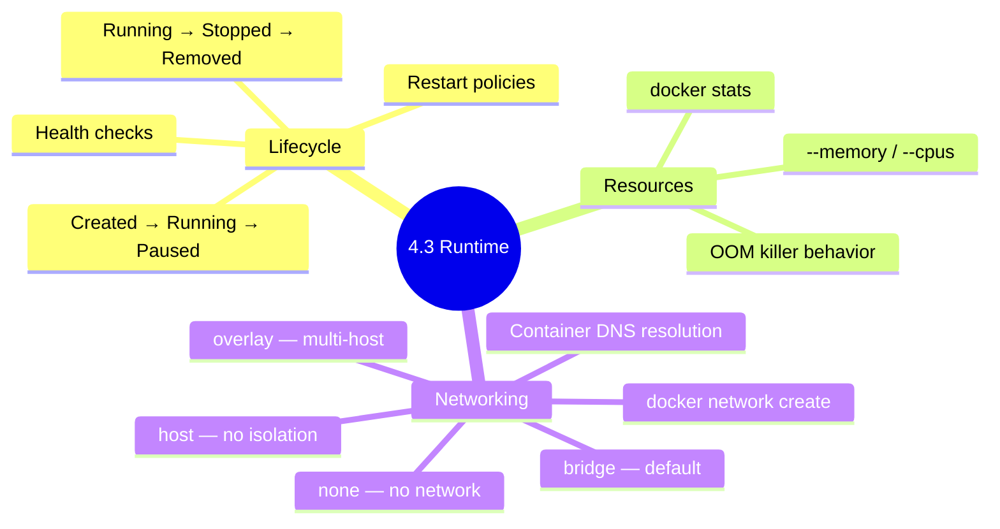

# 4.3.3 Subchapter Review: Cheatsheet and Interview Prep

This review covers only the material presented in Notes 4.3.1 (Container Lifecycle and Resource Management) and 4.3.2 (Docker Networking Deep Dive). No forward referencing beyond what was explicitly introduced.



***

## Cheatsheet: Container Operations and Networking

### Container Lifecycle Commands

| Command          | Purpose                                         |
| ---------------- | ----------------------------------------------- |
| `docker create`  | Create container (not started)                  |
| `docker start`   | Start stopped container                         |
| `docker stop`    | Graceful stop (SIGTERM, wait 10s, then SIGKILL) |
| `docker kill`    | Force stop (SIGKILL)                            |
| `docker restart` | Stop then start                                 |
| `docker pause`   | Freeze all processes                            |
| `docker unpause` | Unfreeze processes                              |
| `docker rm`      | Remove stopped container                        |
| `docker rm -f`   | Force remove running container                  |
| `docker logs`    | View container output                           |
| `docker exec`    | Run command inside                              |
| `docker stats`   | Resource usage                                  |
| `docker top`     | Processes inside                                |
| `docker inspect` | Detailed info                                   |
| `docker diff`    | Filesystem changes                              |
| `docker cp`      | Copy files to/from container                    |
| `docker wait`    | Wait for container to exit                      |

### Resource Limit Flags

| Resource           | Flag                   | Example                            |
| ------------------ | ---------------------- | ---------------------------------- |
| CPU cores          | `--cpus`               | `--cpus=1.5`                       |
| CPU shares         | `--cpu-shares`         | `--cpu-shares=512`                 |
| CPU set            | `--cpuset-cpus`        | `--cpuset-cpus=0,2`                |
| Memory limit       | `--memory`             | `--memory=512m`                    |
| Memory + swap      | `--memory-swap`        | `--memory-swap=1g`                 |
| Memory reservation | `--memory-reservation` | `--memory-reservation=256m`        |
| PIDs limit         | `--pids-limit`         | `--pids-limit=100`                 |
| Read BPS           | `--device-read-bps`    | `--device-read-bps=/dev/sda:10mb`  |
| Write BPS          | `--device-write-bps`   | `--device-write-bps=/dev/sda:10mb` |

### Restart Policies

| Policy           | Behavior                       |
| ---------------- | ------------------------------ |
| `no`             | Never restart (default)        |
| `on-failure[:N]` | Restart on error (max N times) |
| `always`         | Always restart                 |
| `unless-stopped` | Always unless manually stopped |

### Health Check Options

| Option                  | Default | Meaning                         |
| ----------------------- | ------- | ------------------------------- |
| `--health-cmd`          | –       | Command to check health         |
| `--health-interval`     | 30s     | Check frequency                 |
| `--health-timeout`      | 30s     | Max check duration              |
| `--health-start-period` | 0s      | Grace period before first check |
| `--health-retries`      | 3       | Failures to become unhealthy    |

### Log Drivers

| Driver      | Use Case                   |
| ----------- | -------------------------- |
| `json-file` | Default, local development |
| `journald`  | Systemd systems (RHEL)     |
| `syslog`    | Centralized syslog         |
| `fluentd`   | Log aggregation            |
| `awslogs`   | AWS CloudWatch             |
| `none`      | Disable logging            |

### Docker Network Drivers

| Driver             | Isolation | DNS | Multi-Host | Use Case                |
| ------------------ | --------- | --- | ---------- | ----------------------- |
| `bridge` (default) | Medium    | No  | No         | Simple single-host      |
| `bridge` (user)    | High      | Yes | No         | Production single-host  |
| `host`             | None      | N/A | No         | Performance             |
| `none`             | Complete  | No  | No         | Isolated containers     |
| `overlay`          | Medium    | Yes | Yes        | Swarm/K8s clusters      |
| `macvlan`          | Low       | Yes | No         | Legacy physical network |

### Network Commands

| Command                     | Purpose          |
| --------------------------- | ---------------- |
| `docker network ls`         | List networks    |
| `docker network create`     | Create network   |
| `docker network inspect`    | Show details     |
| `docker network rm`         | Remove network   |
| `docker network prune`      | Remove unused    |
| `docker network connect`    | Attach container |
| `docker network disconnect` | Detach container |

### Port Publishing Flags

| Flag                     | Effect                       |
| ------------------------ | ---------------------------- |
| `-p 80:80`               | Map host 80 → container 80   |
| `-p 8080:80`             | Map host 8080 → container 80 |
| `-p 192.168.1.100:80:80` | Bind to specific host IP     |
| `-p 80`                  | Map to random host port      |
| `-p 53:53/udp`           | UDP mapping                  |
| `-P`                     | Publish all exposed ports    |

***

## Comparison Tables

### Container States Transitions

| From    | To      | Command                                           |
| ------- | ------- | ------------------------------------------------- |
| Created | Running | `docker start`                                    |
| Running | Stopped | `docker stop` (graceful) or `docker kill` (force) |
| Running | Paused  | `docker pause`                                    |
| Paused  | Running | `docker unpause`                                  |
| Stopped | Running | `docker start`                                    |
| Stopped | Removed | `docker rm`                                       |
| Running | Removed | `docker rm -f`                                    |

### Restart Policy Behavior

| Exit Code   | `no` | `on-failure` | `always` | `unless-stopped` |
| ----------- | ---- | ------------ | -------- | ---------------- |
| 0 (normal)  | Stop | Stop         | Restart  | Restart          |
| 1 (error)   | Stop | Restart      | Restart  | Restart          |
| Manual stop | Stop | Stop         | Stop     | Stop             |

### Bridge Network Types

| Feature                      | Default Bridge          | User-Defined Bridge |
| ---------------------------- | ----------------------- | ------------------- |
| Automatic DNS                | No                      | Yes                 |
| Container linking            | Yes (deprecated --link) | Yes (by name)       |
| Configuration after creation | Limited                 | Full                |
| Isolation                    | Shared with host        | Isolated            |
| Use case                     | Quick tests             | Production          |

### Network Driver Selection Guide

| Requirement                           | Recommended Driver  |
| ------------------------------------- | ------------------- |
| Single host, simple apps              | User-defined bridge |
| Single host, performance-critical     | host                |
| Multi-host cluster                    | overlay             |
| Legacy app expecting physical network | macvlan             |
| Security-sensitive, no network        | none                |

***

## Interview Questions (Scenario-Based)

These questions assume only knowledge from Subchapter 4.3. Answers reference only concepts from 4.3.1 and 4.3.2.

### Question 1

**Scenario:** A containerized web application crashes frequently with "Out of Memory" errors. The host has 16GB RAM. The container was started with `docker run -d --name web nginx`.

**Question:** Why is this happening? How would you limit the container's memory usage? What happens when the limit is exceeded?

**Answer:**

**Why it's happening:**

* Container started with **no memory limit**

* Container can consume all available host memory

* When host memory is exhausted, OOM killer may kill any process (including this container)

**Fix – add memory limit:**

```bash
# Limit to 512MB
docker run -d --name web --memory=512m nginx

# Also set swap limit (equal to memory to disable swap)
docker run -d --name web --memory=512m --memory-swap=512m nginx

# Set memory reservation (soft limit)
docker run -d --name web --memory=512m --memory-reservation=256m nginx
```

**What happens when limit is exceeded:**

1. Container attempts to allocate more than `--memory` limit
2. Kernel's OOM killer is invoked
3. Container's main process receives SIGKILL (force kill)
4. Container exits with code 137 (SIGKILL)
5. If restart policy is set, Docker restarts the container

**Verification:**

```bash
# Check if OOM killed the container
docker inspect web --format='{{.State.OOMKilled}}'
# true

# Check exit code
docker inspect web --format='{{.State.ExitCode}}'
# 137 (SIGKILL)

# Monitor memory usage
docker stats web
```

**Best practices:**

* Always set memory limits for production containers

* Set `--memory-swap` equal to `--memory` to disable swap (prevents disk I/O)

* Set memory reservation for guaranteed minimum

* Monitor memory usage with Prometheus or similar

### Question 2

**Scenario:** Two containers `web` and `db` are running. `web` cannot connect to `db` even though both are on the same host. `docker exec web ping db` returns "ping: bad address 'db'".

**Question:** What is the most likely cause? How would you fix it so containers can communicate by name?

**Answer:**

**Most likely cause:** Containers are running on the **default bridge network**, which does NOT provide automatic DNS resolution between containers.

**Verification:**

```bash
# Check which network containers are on
docker inspect web | grep -A 10 "Networks"
docker inspect db | grep -A 10 "Networks"
# Likely shows "bridge" (the default)

# Default bridge: containers can communicate by IP, not by name
docker exec web ping $(docker inspect db --format='{{.NetworkSettings.IPAddress}}')  # Works
```

**Fix – Use user-defined bridge network:**

```bash
# Step 1: Create user-defined bridge network
docker network create appnet

# Step 2: Recreate containers on the new network
docker run -d --name db --network appnet postgres
docker run -d --name web --network appnet -p 80:80 nginx

# Step 3: Test name resolution
docker exec web ping db  # Works!

# If containers already exist, connect them to network
docker network connect appnet web
docker network connect appnet db
```

**Why user-defined bridge works:**

* Docker runs an embedded DNS server (127.0.0.11)

* Containers on same user-defined network can resolve each other's names

* DNS resolution works for aliases and container names

**Alternative (not recommended, legacy):**

```bash
# Deprecated --link flag (avoid)
docker run -d --name db postgres
docker run -d --name web --link db nginx
# Adds entry to /etc/hosts, but no longer recommended
```

**Verification after fix:**

```bash
# Check network DNS settings
docker exec web cat /etc/resolv.conf
# nameserver 127.0.0.11 (Docker's embedded DNS)

# Test connectivity
docker exec web curl http://db:5432  # PostgreSQL port
```

### Question 3

**Scenario:** A production container stops unexpectedly. Investigation shows it was manually stopped, but the restart policy was `always`. The container was started with `docker run -d --restart=always --name app myapp`.

**Question:** Why didn't the container restart? How does `always` differ from `unless-stopped`? Which policy should you use for production?

**Answer:**

**Why it didn't restart:**

* `--restart=always` restarts automatically on **daemon start** and **container crash**

* It does NOT restart after a **manual stop** (`docker stop`)

* Manual stop is intentional, so Docker respects it

**`always`** **vs** **`unless-stopped`:**

| Policy           | Auto-restart on crash? | Auto-restart on daemon restart? | Respects manual stop?    |
| ---------------- | ---------------------- | ------------------------------- | ------------------------ |
| `always`         | Yes                    | Yes                             | Yes (stays stopped)      |
| `unless-stopped` | Yes                    | Yes                             | **Yes** (same as always) |

**Wait, they behave the same for manual stop?** Actually, there's a subtle difference:

```bash
# With `always`
docker run -d --restart=always --name app myapp
docker stop app  # Container stops, won't restart
docker start app # Manual start required

# After Docker daemon restart, container with `always` starts automatically
# Container with `unless-stopped` also starts automatically

# The difference is subtle and mostly historical
# For most production use cases, `unless-stopped` is preferred because:
# - It won't restart after a manual stop (same as always)
# - More explicit about intent
```

**Production recommendation:** **`unless-stopped`**

```bash
docker run -d --restart=unless-stopped --name app myapp
```

**Why** **`unless-stopped`** **for production:**

* Explicit about behavior

* Won't restart after intentional stop (even after daemon restart? Let me clarify)

* Actually, both restart after daemon restart unless container was stopped manually before daemon stopped

**To ensure container stays stopped after manual stop (across daemon restarts):**

```bash
# Stop and then disable restart
docker stop app
docker update --restart=no app

# When ready to run again
docker start app
docker update --restart=unless-stopped app
```

**Best practices for production restart policies:**

* Use `unless-stopped` for most services

* Use `on-failure` for batch jobs

* Use `no` for one-off tasks

* Combine with health checks to detect unresponsive containers

### Question 4

**Scenario:** You need to run 10 microservices that all listen on port 8080. They must all be accessible from outside the host.

**Question:** How can multiple containers use the same port simultaneously? Explain using Docker networking concepts.

**Answer:**

**Solution:** Each container gets its own network namespace with its own port 8080. Port publishing maps each container's port 8080 to a different host port.

**Implementation:**

```bash
# Each container has internal port 8080, mapped to different host ports
docker run -d --name service1 -p 8081:8080 myapp
docker run -d --name service2 -p 8082:8080 myapp
docker run -d --name service3 -p 8083:8080 myapp
# ... up to service10 on ports 8081-8090
```

**How it works:**

1. Each container has its own network namespace (from 4.1.1)
2. Inside each container, the application listens on port 8080
3. Docker creates iptables DNAT rules for each port mapping:

   * `Host:8081` → `Container1:8080`

   * `Host:8082` → `Container2:8080`

   * `Host:8083` → `Container3:8080`
4. No port conflicts because each container has its own port space

**Alternative: Use different host IPs (if multiple IPs available)**

```bash
# Bind to different host IP addresses
docker run -d --name service1 -p 192.168.1.10:8080:8080 myapp
docker run -d --name service2 -p 192.168.1.11:8080:8080 myapp
```

**Alternative: Use host network (not recommended – port conflicts)**

```bash
# Can't run multiple containers on host network on same port
docker run -d --name service1 --network host myapp  # Uses host's port 8080
docker run -d --name service2 --network host myapp  # ERROR: port already in use
```

**For dynamic port assignment:**

```bash
# Let Docker assign random ports
docker run -d -P myapp
docker port service1
# 8080/tcp -> 0.0.0.0:32768
```

**For load balancing across services:**

```bash
# Use a reverse proxy (like HAProxy or Nginx) to route traffic
docker run -d --name lb -p 80:80 -p 8080:8080 haproxy
# HAProxy distributes traffic to service1:8080, service2:8080, etc.
```

### Question 5

**Scenario:** A container is running slowly. You suspect it's using too much CPU. The container was started without CPU limits on a 4-core host.

**Question:** How would you diagnose CPU usage? How would you limit the container to use at most 2 cores? What's the difference between `--cpus`, `--cpu-shares`, and `--cpuset-cpus`?

**Answer:**

**Diagnose CPU usage:**

```bash
# Real-time stats
docker stats myapp

# One-shot
docker stats --no-stream myapp

# Container processes (see CPU per process)
docker top myapp

# Detailed CPU stats from cgroups
docker inspect myapp --format='{{json .State.Pid}}' | xargs -I{} cat /proc/{}/stat
```

**Limit to 2 cores:**

```bash
# Simplest – limit to 2 CPU cores
docker update --cpus=2 myapp

# Or when starting
docker run -d --cpus=2 --name myapp myimage
```

**CPU limit flags comparison:**

| Flag            | Meaning                        | Example             | Behavior                                 |
| --------------- | ------------------------------ | ------------------- | ---------------------------------------- |
| `--cpus`        | Number of CPU cores            | `--cpus=2`          | Container gets 2 cores worth of CPU time |
| `--cpu-shares`  | Relative weight (default 1024) | `--cpu-shares=512`  | Gets half the CPU of default containers  |
| `--cpuset-cpus` | Pin to specific cores          | `--cpuset-cpus=0,2` | Only runs on cores 0 and 2               |

**Detailed explanations:**

**`--cpus=2`:**

* Hard limit of 2 CPU cores

* Container cannot exceed 2 cores of CPU time

* Uses CFS quota/period: `cpu.cfs_quota_us = 200000`, `cpu.cfs_period_us = 100000`

* Good for: Production limits, preventing noisy neighbors

**`--cpu-shares=512`:**

* Soft limit, relative to other containers

* Default is 1024, so `--cpu-shares=512` = half the CPU of default containers

* Only matters when CPU is contended

* Good for: Prioritizing important containers over less important ones

**`--cpuset-cpus=0,2`:**

* Pin container to specific physical cores

* No other containers can use those cores

* Can improve cache locality

* Good for: Performance-critical apps, NUMA optimization

**Combining limits:**

```bash
# Limit to 2 cores, pin to cores 0 and 1, give high priority
docker run -d \
  --cpus=2 \
  --cpuset-cpus=0,1 \
  --cpu-shares=2048 \
  --name critical-app \
  myapp
```

**Verification:**

```bash
# Check current limits
docker inspect myapp --format='{{json .HostConfig.Cpu}}'

# Check cgroup values on host
PID=$(docker inspect myapp --format='{{.State.Pid}}')
cat /proc/$PID/cgroup

# For cpuset
cat /sys/fs/cgroup/cpuset/docker/<container-id>/cpuset.cpus
```

***

## Topics Covered in This Subchapter (Self-Check)

| Topic                                                                                 | Found in Note |
| ------------------------------------------------------------------------------------- | ------------- |
| Container lifecycle commands (create, start, stop, kill, restart, pause, unpause, rm) | 4.3.1         |
| Graceful shutdown (SIGTERM vs SIGKILL)                                                | 4.3.1         |
| Resource limits (CPU, memory, disk I/O, PIDs)                                         | 4.3.1         |
| Restart policies (no, on-failure, always, unless-stopped)                             | 4.3.1         |
| Health checks (HEALTHCHECK in Dockerfile, --health-cmd)                               | 4.3.1         |
| Log drivers and log rotation                                                          | 4.3.1         |
| Container inspection (docker inspect, docker logs, docker stats, docker top)          | 4.3.1         |
| Docker network drivers (bridge, host, none, overlay, macvlan)                         | 4.3.2         |
| Bridge network (default vs user-defined)                                              | 4.3.2         |
| DNS resolution in user-defined bridges                                                | 4.3.2         |
| Host network (performance, no isolation)                                              | 4.3.2         |
| Port publishing (`-p`, `-P`, `--publish`)                                             | 4.3.2         |
| Overlay networks (multi-host, VXLAN)                                                  | 4.3.2         |
| Macvlan networks (physical MAC addresses)                                             | 4.3.2         |
| Network troubleshooting commands                                                      | 4.3.2         |

## Bridge Concepts (Not in Notes but Added for Clarity)

| Concept                                        | Explanation                                                                                                                     |
| ---------------------------------------------- | ------------------------------------------------------------------------------------------------------------------------------- |
| OOM Killer (Out-Of-Memory Killer)              | Linux kernel mechanism that terminates processes when system is out of memory. Container memory limits trigger OOM if exceeded. |
| CFS (Completely Fair Scheduler)                | Linux CPU scheduler that enforces cgroup CPU quotas. Used by `--cpus` limit.                                                    |
| VXLAN (Virtual Extensible LAN)                 | Encapsulation protocol for overlay networks. Encapsulates Layer 2 frames in UDP packets.                                        |
| DNAT (Destination Network Address Translation) | iptables feature that rewrites destination IP/port. Used for Docker port publishing.                                            |
| `host.docker.internal`                         | Special DNS name that resolves to host's internal IP. Allows containers to access host services.                                |

***

---

## Quick Command Reference

| Command | Purpose |
|---------|---------|
| `docker stop CONTAINER` | Graceful stop (SIGTERM) |
| `docker kill CONTAINER` | Force stop (SIGKILL) |
| `docker stop --time=30 CONTAINER` | Custom stop timeout |
| `docker restart CONTAINER` | Restart container |
| `docker pause CONTAINER` | Freeze processes |
| `docker unpause CONTAINER` | Unfreeze processes |
| `docker update --cpus=2 CONTAINER` | Update CPU limit |
| `docker update --memory=512m CONTAINER` | Update memory limit |
| `docker update --restart=always CONTAINER` | Update restart policy |
| `docker stats` | Real-time resource stats |
| `docker stats --no-stream` | One-shot stats |
| `docker top CONTAINER` | Show processes inside |
| `docker logs -f CONTAINER` | Follow logs |
| `docker logs --tail 100 CONTAINER` | Last 100 lines |
| `docker network ls` | List networks |
| `docker network create NAME` | Create network |
| `docker network inspect NAME` | Show network details |
| `docker network connect NET CONTAINER` | Attach container |
| `docker network disconnect NET CONTAINER` | Detach container |
| `docker network prune` | Remove unused networks |
| `docker port CONTAINER` | Show port mappings |
| `docker inspect -f '{{.NetworkSettings.IPAddress}}' CONTAINER` | Get IP |

---

## Backlinks

- [4.3.1 Container Lifecycle](./4.3.1_Container_Lifecycle_and_Resource_Management.md) – Lifecycle and resource management
- [4.3.2 Docker Networking](./4.3.2_Docker_Networking_Deep_Dive.md) – Network drivers and port publishing
- [4.1.1 Namespaces and Cgroups](../Subchapter_4.1/4.1.1_Namespaces_and_Cgroups.md) – Cgroups for resource limits
- [2.3.2 Firewalls and iptables](../../2-Networking/Subchapter_2.3/2.3.2_Firewalls_iptables_nftables_and_ufw.md) – NAT for port publishing

---

**End of Subchapter 4.3 Review**

**Next:** Proceed to Subchapter 4.4 – Volumes, Bind Mounts, and Docker Compose (persistent storage, volume management, multi-container applications).
