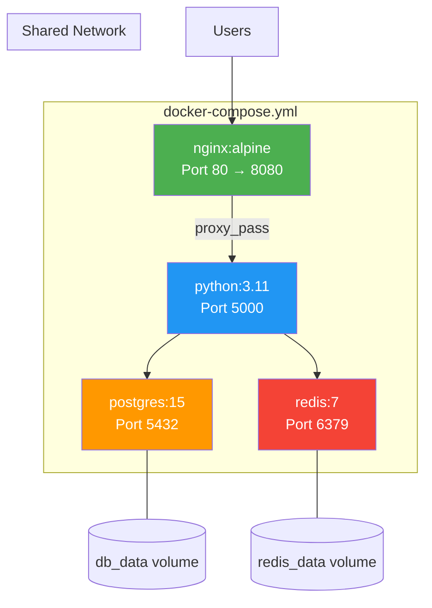

# 4.4.2 Docker Compose Basics: Multi-Container Applications

#### Why Docker Compose Matters

Modern applications are rarely a single container. A typical web app might include:

* Web server (Nginx)

* Application backend (Node.js/Python)

* Database (PostgreSQL)

* Cache (Redis)

* Queue (RabbitMQ)

Managing these containers individually with `docker run` commands is tedious and error-prone. **Docker Compose** solves this by defining the entire stack in a YAML file.

This note covers Compose fundamentals. Note 4.4.1 covered volumes; note 4.4.3 is the subchapter review.

### Compose Stack Architecture



***

## Part 1: What is Docker Compose?

Docker Compose is a tool for defining and running multi-container Docker applications.

```yaml
# docker-compose.yml
version: '3.8'

services:
  web:
    build: .
    ports:
      - "8080:80"
  db:
    image: postgres:15
    environment:
      POSTGRES_PASSWORD: secret
```

```bash
# Start everything with one command
docker-compose up -d

# Stop everything
docker-compose down
```

### Key Concepts

| Concept     | Description                                     |
| ----------- | ----------------------------------------------- |
| **Project** | Directory containing `docker-compose.yml`       |
| **Service** | A container definition (web, db, redis)         |
| **Network** | Auto-created for communication between services |
| **Volume**  | Persistent storage shared between containers    |

***

## Part 2: Installation and Basic Commands

### Installation

Docker Compose is included with Docker Desktop. For Linux, install separately:

```bash
# Install Docker Compose plugin
sudo apt install docker-compose-plugin  # Debian/Ubuntu
sudo dnf install docker-compose-plugin  # RHEL/Rocky

# Verify
docker compose version
# Docker Compose version v2.24.0
```

**Note:** Modern Docker uses `docker compose` (no hyphen). Legacy `docker-compose` (with hyphen) is deprecated.

### Essential Compose Commands

| Command                  | Purpose                    |
| ------------------------ | -------------------------- |
| `docker compose up`      | Start services             |
| `docker compose up -d`   | Start in background        |
| `docker compose down`    | Stop and remove containers |
| `docker compose down -v` | Also remove volumes        |
| `docker compose stop`    | Stop without removing      |
| `docker compose start`   | Start stopped services     |
| `docker compose restart` | Restart services           |
| `docker compose ps`      | List containers            |
| `docker compose logs`    | View logs                  |
| `docker compose logs -f` | Follow logs                |
| `docker compose exec`    | Run command in service     |
| `docker compose build`   | Build images               |
| `docker compose pull`    | Pull images                |
| `docker compose config`  | Validate and view config   |

***

## Part 3: docker-compose.yml Reference

### Basic Structure

```yaml
version: '3.8'  # Compose file format version

services:
  web:           # Service name
    build: .     # Build from Dockerfile in current directory
    ports:
      - "8080:80"
    environment:
      - NODE_ENV=production

  db:
    image: postgres:15
    volumes:
      - db_data:/var/lib/postgresql/data
    environment:
      POSTGRES_PASSWORD: ${DB_PASSWORD}  # Use env var

volumes:
  db_data:  # Named volume
```

### Service Configuration Options

| Option        | Purpose                  | Example                                                        |
| ------------- | ------------------------ | -------------------------------------------------------------- |
| `build`       | Build from Dockerfile    | `build: ./app`                                                 |
| `image`       | Use existing image       | `image: nginx:alpine`                                          |
| `ports`       | Port mapping             | `- "8080:80"`                                                  |
| `volumes`     | Mount volumes            | `- ./data:/app/data`                                           |
| `environment` | Environment variables    | `- NODE_ENV=production`                                        |
| `env_file`    | Load env from file       | `env_file: .env`                                               |
| `command`     | Override default command | `command: npm start`                                           |
| `depends_on`  | Startup order            | `depends_on: - db`                                             |
| `restart`     | Restart policy           | `restart: always`                                              |
| `networks`    | Custom networks          | `networks: - frontend`                                         |
| `healthcheck` | Health check             | `healthcheck: test: ["CMD", "curl", "-f", "http://localhost"]` |

***

## Part 4: Complete Example – Web App Stack

### Project Structure

```
myapp/
├── docker-compose.yml
├── .env
├── web/
│   ├── Dockerfile
│   └── app.py
└── nginx/
    └── nginx.conf
```

### docker-compose.yml

```yaml
version: '3.8'

services:
  # Nginx reverse proxy
  nginx:
    image: nginx:alpine
    ports:
      - "80:80"
      - "443:443"
    volumes:
      - ./nginx/nginx.conf:/etc/nginx/conf.d/default.conf:ro
    depends_on:
      - web
    networks:
      - frontend
    restart: unless-stopped

  # Web application
  web:
    build: ./web
    environment:
      - DB_HOST=postgres
      - DB_PORT=5432
      - DB_USER=${DB_USER}
      - DB_PASSWORD=${DB_PASSWORD}
      - REDIS_URL=redis://redis:6379
    env_file:
      - .env
    volumes:
      - ./web:/app
      - /app/node_modules  # Anonymous volume for node_modules
    depends_on:
      - postgres
      - redis
    networks:
      - frontend
      - backend
    restart: unless-stopped
    healthcheck:
      test: ["CMD", "curl", "-f", "http://localhost:3000/health"]
      interval: 30s
      timeout: 3s
      retries: 3

  # PostgreSQL database
  postgres:
    image: postgres:15-alpine
    environment:
      - POSTGRES_DB=${DB_NAME}
      - POSTGRES_USER=${DB_USER}
      - POSTGRES_PASSWORD=${DB_PASSWORD}
    volumes:
      - postgres_data:/var/lib/postgresql/data
    networks:
      - backend
    restart: unless-stopped
    healthcheck:
      test: ["CMD", "pg_isready", "-U", "${DB_USER}"]
      interval: 10s
      timeout: 5s
      retries: 5

  # Redis cache
  redis:
    image: redis:7-alpine
    command: redis-server --appendonly yes
    volumes:
      - redis_data:/data
    networks:
      - backend
    restart: unless-stopped
    healthcheck:
      test: ["CMD", "redis-cli", "ping"]
      interval: 10s
      timeout: 3s
      retries: 3

# Networks
networks:
  frontend:
    driver: bridge
  backend:
    driver: bridge
    internal: true  # No external access to backend

# Volumes
volumes:
  postgres_data:
  redis_data:
```

### .env File

```env
# Database credentials
DB_NAME=myapp
DB_USER=appuser
DB_PASSWORD=SecurePass123!

# Other settings
NODE_ENV=production
SECRET_KEY=your-secret-key
```

### Running the Stack

```bash
# Start everything
docker compose up -d

# Check status
docker compose ps

# View logs
docker compose logs -f

# Scale web service to 3 instances
docker compose up -d --scale web=3

# Execute command in web container
docker compose exec web bash

# Stop and remove everything
docker compose down -v  # -v removes volumes
```

***

## Part 5: Compose Features

### depends\_on – Controlling Startup Order

```yaml
services:
  web:
    build: .
    depends_on:
      - db
      - redis
    # Wait for db to be ready (not just started)
    healthcheck:
      test: ["CMD", "curl", "-f", "http://localhost/health"]
    # Conditionally wait for healthy
    depends_on:
      db:
        condition: service_healthy
```

### Profiles – Conditional Services

```yaml
services:
  app:
    build: .

  db:
    image: postgres:15

  # Only start in dev profile
  adminer:
    image: adminer
    profiles:
      - dev
    ports:
      - "8080:8080"

  # Only start in prod profile
  prometheus:
    image: prom/prometheus
    profiles:
      - prod
```

```bash
# Start with dev profile
docker compose --profile dev up -d

# Start with multiple profiles
docker compose --profile dev --profile monitoring up -d
```

### Extends – Sharing Configuration

```yaml
# base.yml
services:
  base-app:
    environment:
      - LOG_LEVEL=info
    restart: always

# docker-compose.yml
services:
  web:
    extends:
      file: base.yml
      service: base-app
    build: ./web
```

***

## Part 6: Compose File Merging — Override Pattern

Compose automatically merges multiple YAML files, enabling environment-specific configurations without duplication.

### Automatic Merge (`docker-compose.override.yml`)

When both files exist, Compose merges them automatically:

```yaml
# docker-compose.yml (base — committed to Git)
version: '3.8'
services:
  web:
    build: .
    ports:
      - "8080:80"
    environment:
      - NODE_ENV=production
    restart: always
```

```yaml
# docker-compose.override.yml (dev overrides — gitignored)
services:
  web:
    volumes:
      - ./src:/app    # Live reload
    environment:
      - NODE_ENV=development    # Overrides production
      - DEBUG=true              # Added (merged)
    command: npm run dev
    ports:
      - "9229:9229"  # Added: debugger port
```

```bash
# Automatic merge — both files loaded
docker compose up -d
# Equivalent to: docker compose -f docker-compose.yml -f docker-compose.override.yml up -d

# View merged result
docker compose config
```

### Merge Rules

| YAML Type | Merge Behavior | Example |
|-----------|---------------|---------|
| **Scalars** (strings, numbers) | Override replaces base | `command: npm run dev` replaces `command: npm start` |
| **Lists** (ports, volumes) | Override appends to base | Port `9229:9229` is **added** to existing ports |
| **Maps** (environment, labels) | Override merges/replaces keys | `NODE_ENV=development` replaces, `DEBUG=true` is added |

### Explicit Multi-File Merge (Production)

```bash
# Merge specific files (in order — later files override earlier)
docker compose -f docker-compose.yml -f docker-compose.prod.yml up -d

# Three-way merge: base + shared + environment
docker compose \
  -f docker-compose.yml \
  -f docker-compose.shared.yml \
  -f docker-compose.staging.yml \
  up -d
```

### `docker compose up --wait` — Wait for Healthy

```bash
# Start services AND wait until all health checks pass
docker compose up -d --wait

# Returns only when ALL services with healthchecks report healthy
# Exits with error if any service fails to become healthy within timeout

# Perfect for CI/CD pipelines:
docker compose up -d --wait --wait-timeout 120
# Wait up to 120 seconds for all services to be healthy
echo "All services healthy — running tests..."
npm test
docker compose down
```

### Development Compose

```yaml
# docker-compose.override.yml (auto-loaded)
services:
  web:
    volumes:
      - ./src:/app  # Live reload
    environment:
      - NODE_ENV=development
    command: npm run dev
```

```bash
# Override file auto-loaded when present
docker compose up -d
```

### Docker Compose Watch (Development Hot Reload)

New in Compose v2.22+, `docker compose watch` provides automatic sync and rebuild:

```yaml
# docker-compose.yml
services:
  web:
    build: .
    develop:
      watch:
        # Sync source code changes (no rebuild)
        - action: sync
          path: ./src
          target: /app/src

        # Rebuild on package.json changes
        - action: rebuild
          path: ./package.json

        # Sync and restart on config changes
        - action: sync+restart
          path: ./config
          target: /app/config
```

```bash
# Start with file watching
docker compose watch

# Actions explained:
# sync       - Copy changed files to container (fastest)
# rebuild    - Rebuild and replace container
# sync+restart - Sync files then restart container
```

### Production Compose

```yaml
# docker-compose.prod.yml
services:
  web:
    image: myapp:${TAG:-latest}
    restart: always
    environment:
      - NODE_ENV=production
    deploy:
      replicas: 3
      resources:
        limits:
          cpus: '0.5'
          memory: 512M
```

```bash
# Use specific compose file
docker compose -f docker-compose.prod.yml up -d
```

***

## Part 8: Networking in Compose

### Default Network

Compose creates a default network for all services:

```yaml
services:
  web:
    # Can reach db by service name
    environment:
      - DB_HOST=db
  db:
    image: postgres
```

### Custom Networks

```yaml
services:
  web:
    networks:
      - frontend
      - backend
  db:
    networks:
      - backend  # No frontend access
  lb:
    networks:
      - frontend

networks:
  frontend:
    driver: bridge
  backend:
    driver: bridge
    internal: true  # No external access
```

***

## Part 9: Docker Compose for Production

### Resource Limits in Compose

```yaml
services:
  web:
    image: nginx
    deploy:
      resources:
        limits:
          cpus: '0.5'
          memory: 256M
        reservations:
          cpus: '0.25'
          memory: 128M
```

### Secrets Management

```yaml
services:
  db:
    image: postgres:15
    secrets:
      - db_password
    environment:
      POSTGRES_PASSWORD_FILE: /run/secrets/db_password

secrets:
  db_password:
    file: ./secrets/db_password.txt
```

### Logging Configuration

```yaml
services:
  web:
    image: nginx
    logging:
      driver: json-file
      options:
        max-size: "10m"
        max-file: "3"
```

***

## Part 10: Troubleshooting Compose

### Common Issues

**Port already in use:**

```bash
# Check what's using the port
sudo lsof -i :8080

# Change port in compose
ports:
  - "8081:80"
```

**Container exits immediately:**

```bash
# Check logs
docker compose logs web

# Run without detach to see error
docker compose up web
```

**Volume permission issues:**

```yaml
# Fix with user mapping
services:
  web:
    user: "${UID:-1000}:${GID:-1000}"
    volumes:
      - ./data:/data
```

**Environment variable not loaded:**

```bash
# Ensure .env file is in same directory as compose file
ls -la .env

# Explicitly specify env file
docker compose --env-file .env.prod up
```

### Debugging Commands

```bash
# Validate compose file syntax
docker compose config

# Show expanded config (with environment variables)
docker compose config --resolve-image-digests

# Show running containers
docker compose ps

# Execute diagnostic command
docker compose exec web curl http://db:5432
```

***

## Quick Task: Write a Compose File

*Create a Compose file for a LAMP stack (Linux, Apache, MySQL, PHP).*

1. Write `docker-compose.yml` with:

   * Apache/PHP service (use `php:apache` image)

   * MySQL service (use `mysql:8` image)

   * Volumes for persistent MySQL data

   * Environment variables for MySQL

   * Port mapping for Apache (8080:80)

2. Start the stack with `docker compose up -d`.

3. Verify both containers are running.

4. Stop and remove everything.

> **Ready Solution:**
>
> ```yaml
> # docker-compose.yml
> version: '3.8'
>
> services:
>   web:
>     image: php:apache
>     ports:
>       - "8080:80"
>     volumes:
>       - ./app:/var/www/html
>     depends_on:
>       - db
>     restart: unless-stopped
>
>   db:
>     image: mysql:8
>     environment:
>       MYSQL_ROOT_PASSWORD: rootpass
>       MYSQL_DATABASE: myapp
>       MYSQL_USER: appuser
>       MYSQL_PASSWORD: apppass
>     volumes:
>       - mysql_data:/var/lib/mysql
>     restart: unless-stopped
>
> volumes:
>   mysql_data:
> ```
>
> ```bash
> # Start
> docker compose up -d
>
> # Verify
> docker compose ps
>
> # Test PHP info
> echo "<?php phpinfo(); ?>" > app/index.php
> curl http://localhost:8080
>
> # Clean up
> docker compose down -v
> ```

***

## Summary Table: Compose Commands

| Command                           | Purpose               |
| --------------------------------- | --------------------- |
| `docker compose up -d`            | Start in background   |
| `docker compose down`             | Stop and remove       |
| `docker compose down -v`          | Also remove volumes   |
| `docker compose stop`             | Stop without removing |
| `docker compose start`            | Start stopped         |
| `docker compose restart`          | Restart               |
| `docker compose ps`               | List containers       |
| `docker compose logs`             | View logs             |
| `docker compose logs -f`          | Follow logs           |
| `docker compose exec SERVICE CMD` | Run command           |
| `docker compose build`            | Build images          |
| `docker compose pull`             | Pull images           |
| `docker compose config`           | Validate config       |
| `docker compose top`              | Show processes        |

### Compose File Sections

| Section    | Purpose                     |
| ---------- | --------------------------- |
| `version`  | Compose file format version |
| `services` | Container definitions       |
| `networks` | Custom network definitions  |
| `volumes`  | Named volume definitions    |
| `configs`  | Swarm configs               |
| `secrets`  | Swarm secrets               |

### Service Options Quick Reference

| Option        | Example                 |
| ------------- | ----------------------- |
| `build`       | `build: ./app`          |
| `image`       | `image: nginx:alpine`   |
| `ports`       | `- "8080:80"`           |
| `volumes`     | `- ./data:/data`        |
| `environment` | `- NODE_ENV=production` |
| `env_file`    | `env_file: .env`        |
| `depends_on`  | `- db`                  |
| `restart`     | `restart: always`       |
| `command`     | `command: npm start`    |

***

**Next note (4.4.3)** will be the Subchapter Review for Volumes and Docker Compose, including a cheatsheet and scenario-based interview questions.

---

## Backlinks

- [4.4.1 Volumes and Bind Mounts](./4.4.1_Volumes_Bind_Mounts_and_tmpfs.md) – Volume definitions in Compose
- [4.3.2 Docker Networking](../Subchapter_4.3/4.3.2_Docker_Networking_Deep_Dive.md) – Compose networks
- [4.2.1 Image Layers and Dockerfiles](../Subchapter_4.2/4.2.1_Image_Layers_and_Dockerfile_Basics.md) – `build` references Dockerfile
- [3.1.1 Shebangs Variables and Subshells](../../3-Shell-Scripting/Subchapter_3.1/3.1.1_Shebangs_Variables_and_Subshells.md) – Environment variables in `.env` files
