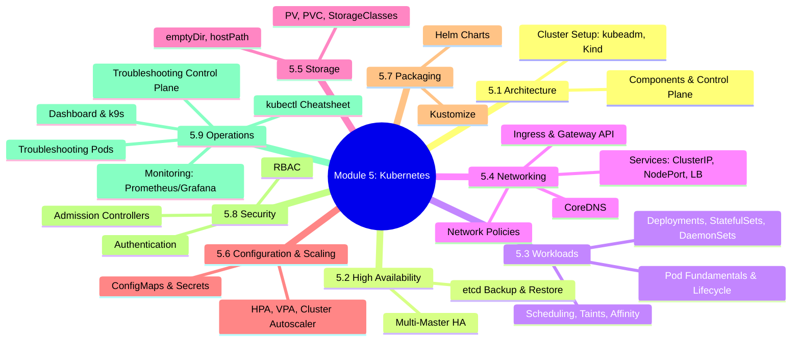
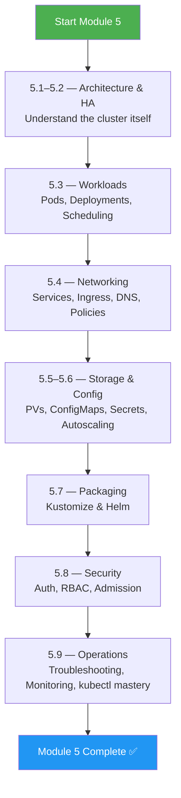
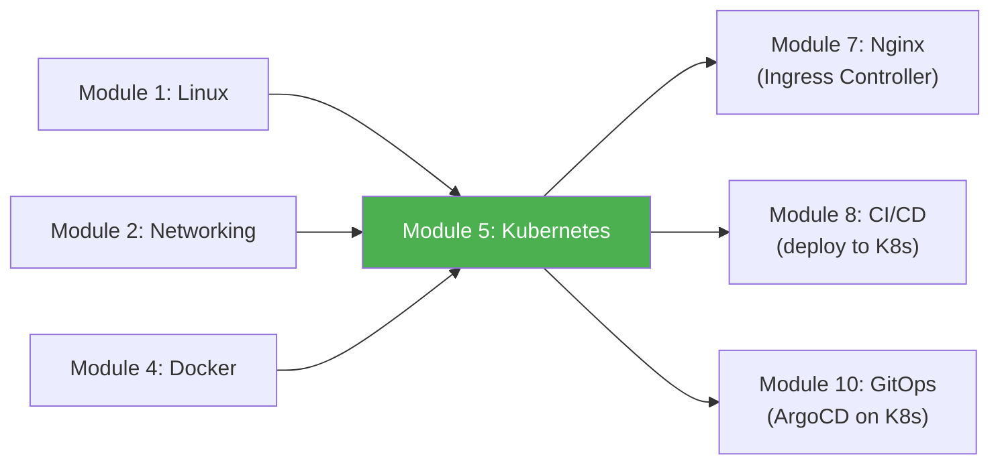

# Module 5 Approach Guide — Kubernetes

## Module Overview

---

## Who Is This Module For?

Kubernetes is the **operating system of the cloud**. This is the largest and most critical module in the course. It covers everything from architecture to troubleshooting — the same scope as the CKA exam.

**Target audience:**
- Engineers preparing for CKA, CKAD, or CKS certifications
- DevOps engineers deploying and managing Kubernetes clusters
- Platform engineers building internal developer platforms on Kubernetes

---

## Prerequisites

| Prerequisite | Required? | Notes |
|---|---|---|
| Module 1 (Linux) completed | **Yes** | K8s nodes are Linux machines; you'll SSH into them, read logs, manage processes |
| Module 2 (Networking) completed | **Yes** | Services, Ingress, Network Policies — all networking |
| Module 3 (Shell Scripting) completed | Recommended | kubectl commands in scripts, init containers |
| Module 4 (Docker) completed | **Yes** | Pods run containers; you must understand images, networking, volumes |
| `kubectl` installed | **Yes** | `curl -LO https://dl.k8s.io/release/$(curl -sL https://dl.k8s.io/release/stable.txt)/bin/linux/amd64/kubectl` |
| A cluster (Kind or Minikube) | **Yes** | `kind create cluster --name lab` is sufficient for most exercises |

---

## How to Approach This Module

### Study Strategy

1. **This module is a marathon, not a sprint** — Budget 4–6 weeks. Don't rush.
2. **Use a real cluster for every exercise** — Kind is free and takes 30 seconds to create.
3. **Master `kubectl explain`** — It's the built-in documentation: `kubectl explain pod.spec.containers`.
4. **Build YAML from scratch** — Never copy-paste from docs. Type it yourself.
5. **Break things constantly** — Kill the API server, corrupt etcd, misconfigure RBAC. Learn to recover.
6. **Subchapter 5.9 is the most valuable** — Troubleshooting skills separate juniors from seniors.

### Reading Order

The subchapters are designed to be read in order, but you can group them into three phases:

| Phase | Subchapters | Focus |
|---|---|---|
| **Phase 1: Foundations** | 5.1, 5.2, 5.3 | "What is a cluster and how do workloads run?" |
| **Phase 2: Services** | 5.4, 5.5, 5.6, 5.7 | "How do workloads communicate, persist data, and scale?" |
| **Phase 3: Production** | 5.8, 5.9 | "How do I secure and operate a cluster?" |

---

## Time Estimates

| Subchapter | Reading | Practice | Total |
|---|---|---|---|
| 5.1 Architecture | 2 hrs | 2 hrs | **4 hrs** |
| 5.2 High Availability | 2 hrs | 2 hrs | **4 hrs** |
| 5.3 Workloads | 3 hrs | 4 hrs | **7 hrs** |
| 5.4 Networking | 3 hrs | 4 hrs | **7 hrs** |
| 5.5 Storage | 2 hrs | 2 hrs | **4 hrs** |
| 5.6 Config & Scaling | 2 hrs | 2 hrs | **4 hrs** |
| 5.7 Packaging | 2.5 hrs | 3 hrs | **5.5 hrs** |
| 5.8 Security | 2.5 hrs | 3 hrs | **5.5 hrs** |
| 5.9 Operations + Final | 3 hrs | 5 hrs | **8 hrs** |
| **Total** | **22 hrs** | **27 hrs** | **~49 hrs** |

> **Realistic timeline:** 4–6 weeks at 2–3 hours/day. This is the biggest module for a reason — Kubernetes IS the job.

---

## Practice Lab Ideas

| Lab | Covers | Difficulty |
|---|---|---|
| Deploy a 3-replica Nginx deployment with a NodePort service, test with curl | 5.3, 5.4 | ⭐⭐ |
| Create a StatefulSet with persistent volumes for PostgreSQL | 5.3, 5.5 | ⭐⭐⭐ |
| Set up Ingress with TLS termination using cert-manager | 5.4 | ⭐⭐⭐ |
| Write a Network Policy that allows frontend→backend but blocks backend→frontend | 5.4 | ⭐⭐⭐ |
| Back up etcd, delete a namespace, restore from backup | 5.2 | ⭐⭐⭐⭐ |
| Build a Helm chart for a microservice with values for dev/staging/prod | 5.7 | ⭐⭐⭐⭐ |
| Configure RBAC: developer role (read pods, exec), deployer role (apply manifests) | 5.8 | ⭐⭐⭐⭐ |
| Troubleshoot: pod stuck in CrashLoopBackOff, ImagePullBackOff, Pending — find root cause | 5.9 | ⭐⭐⭐⭐⭐ |

---

## What Success Looks Like

By the end of Module 5, you should be able to:

- [ ] Draw the Kubernetes architecture from memory (API server, etcd, scheduler, kubelet, kube-proxy)
- [ ] Deploy any workload type: Deployment, StatefulSet, DaemonSet, Job, CronJob
- [ ] Configure Services, Ingress, and Network Policies for a multi-tier application
- [ ] Manage persistent storage with PVs, PVCs, and StorageClasses
- [ ] Use ConfigMaps, Secrets, and HPA for configuration and scaling
- [ ] Package applications with Helm and Kustomize
- [ ] Secure a cluster with RBAC and admission controllers
- [ ] Troubleshoot any pod state (Pending, CrashLoopBackOff, ImagePullBackOff, OOMKilled)
- [ ] Monitor clusters with Prometheus and Grafana

---

## Connection to Other Modules

**Kubernetes is the convergence point.** Linux runs the nodes, Docker builds the images, networking connects the pods, CI/CD deploys the manifests, Nginx serves as the ingress controller, and ArgoCD syncs the desired state from Git.

> **Next module:** [Module 6 — Git](../6-Git/Module_6_Approach_Guide.md)
