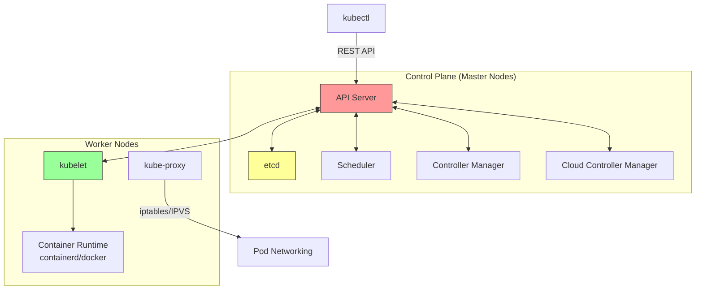
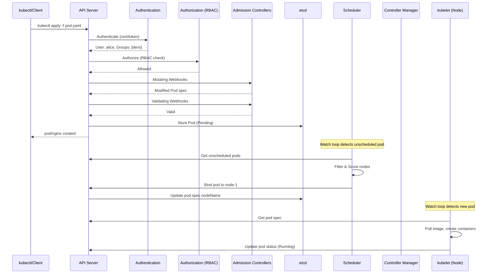
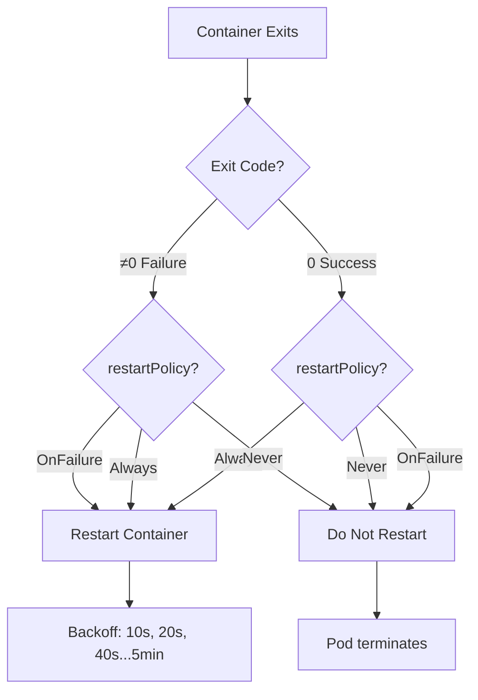

# 5.1.1 Kubernetes Architecture Components: The Brain and Muscles of the Cluster

#### Why Kubernetes Architecture Matters

Understanding how Kubernetes components interact is essential for:

* Troubleshooting cluster failures (control plane vs worker node issues)

* Designing highly available clusters

* Debugging why a pod won't schedule or a service isn't reachable

* Passing CKA/CKAD certification exams

This note covers the complete architecture. Note 5.1.2 covers cluster setup; note 5.1.3 is the subchapter review.

**Backlinks:** [Module 4 - Container Basics](../../4-Docker/Subchapter_4.1/4.1.1_Namespaces_and_Cgroups.md) (containerd, runc used by kubelet) | [Module 2 - Networking](../../2-Networking/Subchapter_2.3/2.3.1_Firewalls_and_iptables.md) (iptables, DNS used by kube-proxy and CoreDNS)

***

## Part 1: Kubernetes Cluster Overview



### Component Responsibilities

| Component                    | Location      | Responsibility                                               |
| ---------------------------- | ------------- | ------------------------------------------------------------ |
| **API Server**               | Control Plane | Gateway to cluster; validates and processes REST requests    |
| **etcd**                     | Control Plane | Distributed key-value store; cluster state, config, secrets  |
| **Scheduler**                | Control Plane | Assigns pods to worker nodes based on resources, constraints |
| **Controller Manager**       | Control Plane | Runs controllers (Deployment, ReplicaSet, Node, etc.)        |
| **Cloud Controller Manager** | Control Plane | Cloud provider integration (load balancers, volumes, nodes)  |
| **kubelet**                  | Worker Node   | Runs pods; communicates with API Server; health checks       |
| **kube-proxy**               | Worker Node   | Network rules (iptables/IPVS); load balancing to pods        |
| **Container Runtime**        | Worker Node   | Pulls images; runs containers (containerd, CRI-O, Docker)    |

***

## Part 2: Request Flow Through Kubernetes

Understanding how a request flows through Kubernetes is critical for troubleshooting.



### Pod Lifecycle State Machine

```mermaid
stateDiagram-v2
    [*] --> Pending: kubectl apply
    Pending --> Pending: Waiting for scheduling
    Pending --> Pending: Pulling image
    Pending --> Running: Containers started
    Running --> Running: Healthy
    Running --> Failed: Container crash (no restart)
    Running --> Succeeded: Job completed (exit 0)
    Running --> CrashLoopBackOff: Repeated crashes
    CrashLoopBackOff --> Running: Container restarts
    Failed --> [*]: Pod terminated
    Succeeded --> [*]: Pod completed
    
    note right of Pending: Image pull, scheduling
    note right of CrashLoopBackOff: Backoff: 10s, 20s, 40s...5min
```

***

## Part 3: Control Plane Components (The Brain)

### API Server (kube-apiserver)

The **only** component that talks to etcd. All operations (kubectl, controllers, schedulers) go through the API Server.

```bash
# API Server endpoints (on master node)
curl -k https://localhost:6443/healthz
# ok

# View API resources
kubectl api-resources
kubectl api-versions
```

**Key features:**

* Authentication (client certificates, bearer tokens, OIDC)

* Authorization (RBAC, ABAC, Webhook)

* Admission Control (Mutating/Validating webhooks)

* Rate limiting and request validation

**High availability:** Multiple API servers behind a load balancer (active-active).

### etcd – The Source of Truth

etcd stores **all** cluster state: pods, services, configmaps, secrets, nodes, and more.

```bash
# On control plane node
ETCDCTL_API=3 etcdctl \
  --cacert=/etc/kubernetes/pki/etcd/ca.crt \
  --cert=/etc/kubernetes/pki/etcd/server.crt \
  --key=/etc/kubernetes/pki/etcd/server.key \
  member list

# View all keys (not typical in production)
etcdctl get / --prefix --keys-only
```

**etcd characteristics:**

* Distributed consensus (Raft protocol)

* Requires odd number of members (1,3,5,7) for quorum

* Performance: disk I/O critical (SSD required)

**What happens if etcd fails?** Cluster loses ability to make changes; existing pods continue running, but no new deployments or scaling.

### Scheduler (kube-scheduler)

Decides **which node** runs a new pod.

```bash
# View scheduler logs (on master)
kubectl logs -n kube-system kube-scheduler-<pod-name>

# Check scheduling events
kubectl describe pod mypod | grep -A 10 Events
```

**Scheduling algorithm:**

1. **Filtering** – Find nodes that can run the pod (resources, nodeSelector, taints)
2. **Scoring** – Rank filtered nodes (least allocated, spread pods, affinity)
3. **Binding** – Assign pod to highest scoring node

**Configurable via:** Node selectors, affinity/anti-affinity, taints/tolerations, resource requests/limits.

### Controller Manager (kube-controller-manager)

Runs dozens of controllers; each controller watches API Server and reconciles desired state.

| Controller                    | Responsibility                                      |
| ----------------------------- | --------------------------------------------------- |
| **Deployment Controller**     | Manages ReplicaSets, rolling updates                |
| **ReplicaSet Controller**     | Maintains correct number of pods                    |
| **Node Controller**           | Monitors node health; evicts pods from failed nodes |
| **EndpointSlice Controller**  | Updates Service endpoints                           |
| **ServiceAccount Controller** | Manages ServiceAccount tokens                       |
| **Namespace Controller**      | Deletes resources when namespace deleted            |

```bash
# View controller manager
kubectl get pods -n kube-system | grep controller-manager
```

***

## Part 4: Worker Node Components (The Muscles)

### kubelet – The Node Agent

Primary agent on each node. Ensures containers are running in a Pod.

```bash
# Check kubelet status (on worker node)
systemctl status kubelet
journalctl -u kubelet -f

# View node status from cluster
kubectl get nodes
kubectl describe node worker-1
```

**kubelet responsibilities:**

* Registers node with cluster

* Watches API Server for Pod assignments

* Creates/updates/deletes pods via container runtime

* Reports node and pod status

* Executes liveness, readiness, startup probes

### Container Runtime

Runs the actual containers. Kubernetes supports CRI (Container Runtime Interface).

```bash
# Check container runtime on node (containerd)
crictl ps
crictl images

# Docker (legacy)
docker ps
```

| Runtime        | Installation                                             | Notes                |
| -------------- | -------------------------------------------------------- | -------------------- |
| **containerd** | Default with kubeadm                                     | Industry standard    |
| **CRI-O**      | Lightweight, RHEL default                                | OpenShift compatible |
| **Docker**     | Deprecated (still works via dockershim removed in 1.24+) | Legacy               |

### kube-proxy

Maintains network rules on each node. Enables Service abstraction (load balancing to pods).

```bash
# Check kube-proxy mode (usually iptables)
kubectl logs -n kube-system kube-proxy-<pod> | grep "Using"

# iptables mode (default)
iptables -t nat -L -n | grep KUBE-SERVICES
```

**Modes:**

* **iptables** – Default, uses Linux iptables; scales to \~1000 services

* **IPVS** – Linux kernel L4 load balancer; better performance for large clusters

* **userspace** – Deprecated legacy mode

***

## Part 5: Addons (Essential but Not Required)

| Addon                  | Purpose                                  | Installation Command                                                                                                                     |
| ---------------------- | ---------------------------------------- | ---------------------------------------------------------------------------------------------------------------------------------------- |
| **CoreDNS**            | Cluster DNS for service discovery        | `kubectl apply -f https://...` (installed by kubeadm)                                                                                    |
| **metrics-server**     | Resource metrics (CPU/memory) for HPA    | `kubectl apply -f https://github.com/kubernetes-sigs/metrics-server/releases/latest/download/components.yaml`                            |
| **Ingress Controller** | L7 routing (Nginx, Traefik)              | `kubectl apply -f https://raw.githubusercontent.com/kubernetes/ingress-nginx/controller-v1.9.0/deploy/static/provider/cloud/deploy.yaml` |
| **CNI Plugin**         | Pod networking (Calico, Flannel, Cilium) | `kubectl apply -f https://raw.githubusercontent.com/projectcalico/calico/v3.27/manifests/calico.yaml`                                    |
| **Dashboard**          | Web UI                                   | `kubectl apply -f https://raw.githubusercontent.com/kubernetes/dashboard/v2.7.0/aio/deploy/recommended.yaml`                             |

***

## Part 6: Pods – The Smallest Deployable Unit

A pod is one or more containers that share:

* Network namespace (same IP, localhost communication)

* IPC namespace (shared memory)

* Volume mounts

```yaml
# simple-pod.yaml
apiVersion: v1
kind: Pod
metadata:
  name: nginx-pod
  labels:
    app: nginx
spec:
  containers:
  - name: nginx
    image: nginx:alpine
    ports:
    - containerPort: 80
```

```bash
# Create pod
kubectl apply -f simple-pod.yaml

# Check pod status
kubectl get pods
# NAME        READY   STATUS    RESTARTS   AGE
# nginx-pod   1/1     Running   0          5s

# Get pod IP
kubectl get pod nginx-pod -o wide

# Exec into pod
kubectl exec -it nginx-pod -- /bin/sh

# Delete pod
kubectl delete pod nginx-pod
```

### Pod Phases (Lifecycle)

| Phase                | Meaning                                            |
| -------------------- | -------------------------------------------------- |
| **Pending**          | Pod accepted, waiting for scheduling or image pull |
| **Running**          | At least one container running                     |
| **Succeeded**        | All containers terminated with success (Job)       |
| **Failed**           | All containers terminated with failure             |
| **Unknown**          | State unknown (node lost communication)            |
| **CrashLoopBackOff** | Container repeatedly crashing (troubleshoot logs)  |

***

## Part 7: Restart Policy and Image Pull Policy

### Restart Policy

The `restartPolicy` field defines what happens when a container exits.

```yaml
# pod-restart-policy.yaml
apiVersion: v1
kind: Pod
metadata:
  name: restart-demo
spec:
  restartPolicy: Always  # Always | OnFailure | Never
  containers:
  - name: app
    image: myapp:latest
```

| Restart Policy | Behavior | Use Case |
|----------------|----------|----------|
| **Always** (default) | Always restart on exit | Long-running services (Deployments) |
| **OnFailure** | Restart only if exit code ≠ 0 | Jobs (retry on failure) |
| **Never** | Never restart | Debug pods, one-time tasks |



**Backoff timing:** 10s → 20s → 40s → 80s → 160s → 300s (max 5 minutes)

### Image Pull Policy

The `imagePullPolicy` field controls when kubelet pulls container images.

```yaml
# pod-imagepull-policy.yaml
apiVersion: v1
kind: Pod
metadata:
  name: pull-demo
spec:
  containers:
  - name: app
    image: myapp:v1.2.3
    imagePullPolicy: IfNotPresent  # Always | IfNotPresent | Never
```

| Image Pull Policy | Behavior | Use Case |
|-------------------|----------|----------|
| **Always** | Always pull image | Latest tag, frequently updated images |
| **IfNotPresent** (default for tagged) | Pull only if not cached | Production with versioned tags |
| **Never** | Never pull, use local only | Air-gapped environments, preloaded images |

**Default behavior based on image tag:**

| Image Tag | Default imagePullPolicy |
|-----------|------------------------|
| `:latest` or no tag | `Always` |
| Specific tag (`:v1.2.3`) | `IfNotPresent` |

```yaml
# Best practice: Always use specific tags + IfNotPresent
spec:
  containers:
  - name: app
    image: myapp:v1.2.3        # Specific tag
    imagePullPolicy: IfNotPresent
```

### Private Registry Authentication

```yaml
# Create imagePullSecret
kubectl create secret docker-registry regcred \
  --docker-server=registry.example.com \
  --docker-username=user \
  --docker-password=pass \
  --docker-email=user@example.com

# Use in pod
apiVersion: v1
kind: Pod
metadata:
  name: private-image
spec:
  imagePullSecrets:
  - name: regcred
  containers:
  - name: app
    image: registry.example.com/myapp:v1.0
```

***

## Part 8: kubectl – The CLI Swiss Army Knife

### Essential kubectl Commands

```bash
# Context and configuration
kubectl config view           # View current config
kubectl config get-contexts   # List contexts
kubectl config use-context my-cluster

# Resource operations
kubectl get nodes
kubectl get pods -o wide
kubectl get pods --all-namespaces
kubectl get all -n my-namespace

# Describe (detailed status + events)
kubectl describe pod nginx-pod

# Logs
kubectl logs nginx-pod
kubectl logs nginx-pod -c sidecar-container
kubectl logs --previous nginx-pod   # Last terminated container

# Exec
kubectl exec -it nginx-pod -- /bin/sh
kubectl exec nginx-pod -- ls -la /app

# Delete
kubectl delete pod nginx-pod
kubectl delete -f manifest.yaml
kubectl delete deployment --all -n namespace

# Apply (create/update)
kubectl apply -f manifest.yaml
kubectl apply -k ./overlays/prod   # Kustomize

# Explain (documentation)
kubectl explain pod
kubectl explain pod.spec.containers
```

### kubectl Aliases (Time Savers)

```bash
# Add to ~/.bashrc
alias k='kubectl'
alias kgp='kubectl get pods'
alias kgs='kubectl get svc'
alias kgd='kubectl get deployments'
alias kgn='kubectl get nodes'
alias kd='kubectl describe'
alias kl='kubectl logs'
alias kex='kubectl exec -it'
alias kdel='kubectl delete'
alias kaf='kubectl apply -f'

# Context switching
alias kctx='kubectl config use-context'
```

***

## Quick Task: Explore a Kubernetes Cluster

*If you have a cluster (Kind or Minikube), run these commands.*

1. Get all components running in kube-system namespace.
2. Describe a kube-system pod to see its events.
3. Check which container runtime is being used.
4. View the API server health endpoint.

> **Ready Solution:**
>
> ```bash
> # Task 1
> kubectl get pods -n kube-system
>
> # Task 2
> kubectl describe pod -n kube-system coredns-<id>
>
> # Task 3
> kubectl get nodes -o wide
> # Look at CONTAINER-RUNTIME column
>
> # Task 4 (if direct API access is allowed)
> kubectl cluster-info
> # Then curl the API server (may need token)
> ```

***

## Summary Table: Kubernetes Components

| Component          | Port (Default)                  | Protocol   | Location      |
| ------------------ | ------------------------------- | ---------- | ------------- |
| API Server         | 6443                            | HTTPS      | Control Plane |
| etcd               | 2379-2380                       | HTTPS      | Control Plane |
| kubelet            | 10250 (HTTPS), 10255 (readonly) | HTTPS/HTTP | Worker Node   |
| kube-proxy         | 10256 (health)                  | HTTP       | Worker Node   |
| Scheduler          | 10259                           | HTTPS      | Control Plane |
| Controller Manager | 10257                           | HTTPS      | Control Plane |
| CoreDNS            | 53 (UDP/TCP)                    | DNS        | Worker Node   |
| metrics-server     | 443                             | HTTPS      | Worker Node   |

### kubectl Output Formats

| Format                                    | Use Case                                |
| ----------------------------------------- | --------------------------------------- |
| `-o wide`                                 | More columns (IP, node, etc.)           |
| `-o yaml`                                 | Full YAML manifest                      |
| `-o json`                                 | Full JSON output                        |
| `-o name`                                 | Only resource names (e.g., `pod/nginx`) |
| `-o jsonpath='{.items[*].metadata.name}'` | Custom extraction                       |
| `--watch`                                 | Watch for changes                       |
| `-w`                                      | Same as `--watch`                       |

***

**Next note (5.1.2)** will cover **Cluster Setup with kubeadm and Kind** – local development clusters, production-style kubeadm setup, and multi-node cluster basics.

**Backlinks:** [Module 4 - Docker](../../4-Docker/Subchapter_4.1/4.1.1_Namespaces_and_Cgroups.md) (containerd, runc) | [Module 2 - Networking](../../2-Networking/Subchapter_2.3/2.3.1_Firewalls_and_iptables.md) (iptables) | [Module 1 - Linux](../../1-Linux/Subchapter_1.2/1.2.1_Process_Management_and_Signals.md) (kubelet as systemd service)
