# 5.1.2 Cluster Setup with kubeadm and Kind: From Zero to Kubernetes

#### Why Multiple Setup Methods Matter

Different environments require different Kubernetes distributions:

* **Kind** – Local development, CI/CD testing (Kubernetes in Docker)

* **Minikube** – Local development with VM (more features)

* **kubeadm** – Production-style clusters on VMs/bare metal

* **Managed** – EKS, GKE, AKS (cloud provider managed control plane)

This note covers Kind and kubeadm. Note 5.1.1 covered architecture; note 5.1.3 is the subchapter review.

**Backward references:** Docker from Module 4 (Kind runs containers); Linux systemd from Module 1 (kubelet service); Networking iptables from Module 2 (CNI, kube-proxy).

***

## Part 1: Kind – Kubernetes in Docker (Local Development)

Kind runs a Kubernetes cluster inside Docker containers. Perfect for local testing and CI/CD.

### Installation

```bash
# Linux
curl -Lo ./kind https://kind.sigs.k8s.io/dl/v0.20.0/kind-linux-amd64
chmod +x ./kind
sudo mv ./kind /usr/local/bin/kind

# Verify
kind version
```

### Creating a Cluster

```bash
# Single node cluster (default)
kind create cluster --name dev

# Multi-node cluster (3 workers, 1 control plane)
cat > kind-config.yaml << EOF
kind: Cluster
apiVersion: kind.x-k8s.io/v1alpha4
nodes:
- role: control-plane
- role: worker
- role: worker
- role: worker
EOF

kind create cluster --name multi --config kind-config.yaml

# List clusters
kind get clusters

# Get kubeconfig path
kind get kubeconfig --name dev

# Delete cluster
kind delete cluster --name dev
```

### Using Kind Cluster

```bash
# Set context (automatic with kind)
kubectl cluster-info --context kind-dev

# Deploy test app
kubectl create deployment nginx --image=nginx
kubectl expose deployment nginx --port=80 --type=NodePort

# Get NodePort to access locally
kubectl get svc nginx
# Access via localhost:NodePort

# Load local image into kind cluster
kind load docker-image myapp:latest --name dev
```

### Kind Advanced Configuration

```yaml
# kind-config-advanced.yaml
kind: Cluster
apiVersion: kind.x-k8s.io/v1alpha4
nodes:
- role: control-plane
  extraPortMappings:
  - containerPort: 80
    hostPort: 80
    protocol: TCP
  - containerPort: 443
    hostPort: 443
- role: worker
- role: worker
networking:
  podSubnet: "10.244.0.0/16"
  serviceSubnet: "10.96.0.0/12"
  apiServerAddress: "127.0.0.1"
  apiServerPort: 6443
```

***

## Part 2: Minikube – Local VM-Based Kubernetes

Minikube runs a single-node cluster in a VM. Supports more features (ingress, dashboard, addons).

### Installation

```bash
# Linux (with KVM2 driver)
curl -LO https://storage.googleapis.com/minikube/releases/latest/minikube-linux-amd64
sudo install minikube-linux-amd64 /usr/local/bin/minikube

# Start cluster
minikube start --driver=kvm2 --cpus=4 --memory=8192

# Or with Docker driver (simpler)
minikube start --driver=docker
```

### Minikube Commands

```bash
# Cluster management
minikube status
minikube stop
minikube delete
minikube pause
minikube unpause

# Access cluster
minikube kubectl -- get pods -A
alias kubectl="minikube kubectl --"

# Enable addons
minikube addons enable ingress
minikube addons enable dashboard
minikube addons enable metrics-server

# Get service URL
minikube service nginx --url

# SSH into node
minikube ssh

# Dashboard
minikube dashboard
```

***

## Part 3: kubeadm – Production-Style Cluster Setup

kubeadm is the standard tool for setting up Kubernetes clusters on VMs/bare metal following best practices.

### Prerequisites (Each Node)

```bash
# OS Requirements (Ubuntu 22.04 example)
# - 2+ CPUs, 2+ GB RAM
# - Unique hostname, MAC address, product_uuid
# - Swap disabled

# Disable swap (required)
sudo swapoff -a
sudo sed -i '/ swap / s/^\(.*\)$/#\1/g' /etc/fstab

# Load kernel modules
cat <<EOF | sudo tee /etc/modules-load.d/k8s.conf
overlay
br_netfilter
EOF

sudo modprobe overlay
sudo modprobe br_netfilter

# sysctl params
cat <<EOF | sudo tee /etc/sysctl.d/k8s.conf
net.bridge.bridge-nf-call-iptables  = 1
net.bridge.bridge-nf-call-ip6tables = 1
net.ipv4.ip_forward                 = 1
EOF

sudo sysctl --system

# Install container runtime (containerd)
sudo apt update
sudo apt install -y containerd
sudo mkdir -p /etc/containerd
containerd config default | sudo tee /etc/containerd/config.toml
sudo systemctl restart containerd
```

### Install kubeadm, kubelet, kubectl

```bash
# Add Kubernetes repo
sudo apt update
sudo apt install -y apt-transport-https ca-certificates curl
curl -fsSL https://pkgs.k8s.io/core:/stable:/v1.29/deb/Release.key | sudo gpg --dearmor -o /etc/apt/keyrings/kubernetes-apt-keyring.gpg
echo 'deb [signed-by=/etc/apt/keyrings/kubernetes-apt-keyring.gpg] https://pkgs.k8s.io/core:/stable:/v1.29/deb/ /' | sudo tee /etc/apt/sources.list.d/kubernetes.list

sudo apt update
sudo apt install -y kubelet kubeadm kubectl
sudo apt-mark hold kubelet kubeadm kubectl
```

### Initialize Control Plane (Master Node)

```bash
# Initialize cluster
sudo kubeadm init --pod-network-cidr=10.244.0.0/16

# Output will show join command for workers:
# kubeadm join 10.0.0.10:6443 --token xxx --discovery-token-ca-cert-hash sha256:yyy

# Configure kubectl for regular user
mkdir -p $HOME/.kube
sudo cp -i /etc/kubernetes/admin.conf $HOME/.kube/config
sudo chown $(id -u):$(id -g) $HOME/.kube/config

# Install CNI (Calico example)
kubectl apply -f https://raw.githubusercontent.com/projectcalico/calico/v3.27/manifests/calico.yaml

# Verify control plane pods
kubectl get pods -n kube-system
```

### Join Worker Nodes

```bash
# On each worker node, run the join command from kubeadm init
sudo kubeadm join 10.0.0.10:6443 --token xxx --discovery-token-ca-cert-hash sha256:yyy

# Verify nodes
kubectl get nodes
# NAME       STATUS   ROLES           AGE   VERSION
# master     Ready    control-plane   5m    v1.29.0
# worker-1   Ready    <none>          2m    v1.29.0
# worker-2   Ready    <none>          2m    v1.29.0
```

### kubeadm Configuration File (Advanced)

```yaml
# kubeadm-config.yaml
apiVersion: kubeadm.k8s.io/v1beta3
kind: ClusterConfiguration
kubernetesVersion: v1.29.0
controlPlaneEndpoint: "load-balancer.example.com:6443"
networking:
  podSubnet: "10.244.0.0/16"
  serviceSubnet: "10.96.0.0/12"
apiServer:
  certSANs:
  - "load-balancer.example.com"
  - "10.0.0.10"
  - "10.0.0.11"
---
apiVersion: kubeadm.k8s.io/v1beta3
kind: InitConfiguration
nodeRegistration:
  name: master-1
  kubeletExtraArgs:
    node-labels: "node-role.kubernetes.io/master="
```

```bash
# Initialize with config file
sudo kubeadm init --config=kubeadm-config.yaml
```

***

## Part 4: kubectl Configuration (kubeconfig)

kubeconfig files tell kubectl how to connect to clusters.

### kubeconfig Structure

```yaml
# ~/.kube/config
apiVersion: v1
kind: Config
clusters:
- cluster:
    certificate-authority-data: LS0tLS1CRU...
    server: https://192.168.1.10:6443
  name: my-cluster
contexts:
- context:
    cluster: my-cluster
    user: admin
    namespace: default
  name: my-context
current-context: my-context
users:
- name: admin
  user:
    client-certificate-data: LS0tLS1CRU...
    client-key-data: LS0tLS1CRU...
```

### Managing kubeconfig

```bash
# View current config
kubectl config view
kubectl config view --raw  # Show certificates

# List contexts
kubectl config get-contexts

# Switch context
kubectl config use-context my-context

# Set namespace for current context
kubectl config set-context --current --namespace=my-namespace

# Add new cluster
kubectl config set-cluster test-cluster --server=https://test-cluster:6443

# Add user
kubectl config set-credentials admin --token=xxx

# Add context
kubectl config set-context test-context --cluster=test-cluster --user=admin

# Use multiple kubeconfig files
export KUBECONFIG=/path/to/config1:/path/to/config2
kubectl config view --flatten > merged-config
```

***

## Part 5: Multi-Node Cluster Architecture

```mermaid
graph TD
    LB[Load Balancer<br/>Port 6443]
    
    subgraph "Control Plane"
        M1[Master-1<br/>API Server, etcd, Scheduler, CM]
        M2[Master-2<br/>API Server, etcd, Scheduler, CM]
        M3[Master-3<br/>API Server, etcd, Scheduler, CM]
    end
    
    subgraph "Worker Nodes"
        W1[Worker-1<br/>kubelet, kube-proxy]
        W2[Worker-2<br/>kubelet, kube-proxy]
        W3[Worker-3<br/>kubelet, kube-proxy]
    end
    
    LB --> M1
    LB --> M2
    LB --> M3
    
    M1 <--> M2 <--> M3
    M1 --> W1
    M2 --> W2
    M3 --> W3
```



### kubeadm HA Setup (Stacked etcd)

```bash
# On first master (initialize)
sudo kubeadm init --control-plane-endpoint "load-balancer.example.com:6443" --upload-certs

# On additional masters (join as control plane)
sudo kubeadm join load-balancer.example.com:6443 --token xxx \
  --discovery-token-ca-cert-hash sha256:yyy \
  --control-plane --certificate-key zzz
```

***

## Part 6: Cluster Addons Installation

### CoreDNS (DNS for Services)

Installed automatically with kubeadm. Verify:

```bash
kubectl get pods -n kube-system | grep coredns
kubectl get svc -n kube-system kube-dns

# Test DNS
kubectl run -it --rm debug --image=busybox --restart=Never -- nslookup kubernetes.default
```

### metrics-server (Resource Metrics)

```bash
# Install
kubectl apply -f https://github.com/kubernetes-sigs/metrics-server/releases/latest/download/components.yaml

# Patch to work with self-signed certs (for local dev)
kubectl patch deployment metrics-server -n kube-system --type='json' \
  -p='[{"op": "add", "path": "/spec/template/spec/containers/0/args/-", "value": "--kubelet-insecure-tls"}]'

# Verify
kubectl top nodes
kubectl top pods
```

### Ingress Controller (Nginx)

```bash
# Install Nginx Ingress Controller
kubectl apply -f https://raw.githubusercontent.com/kubernetes/ingress-nginx/controller-v1.9.0/deploy/static/provider/cloud/deploy.yaml

# For bare metal (NodePort)
kubectl apply -f https://raw.githubusercontent.com/kubernetes/ingress-nginx/controller-v1.9.0/deploy/static/provider/baremetal/deploy.yaml

# Verify
kubectl get pods -n ingress-nginx
kubectl get svc -n ingress-nginx
```

***

## Part 7: Common Setup Issues and Troubleshooting

### Issue 1: "cni plugin not initialized"

**Cause:** CNI not installed after kubeadm init.

**Fix:**

```bash
kubectl apply -f https://raw.githubusercontent.com/projectcalico/calico/v3.27/manifests/calico.yaml
# Wait for calico pods to be Ready
kubectl wait --for=condition=Ready pods --all -n calico-system --timeout=300s
```

### Issue 2: Node NotReady

```bash
# Check node status
kubectl describe node <node-name>

# Common causes:
# - CNI not installed
# - kubelet not running (on node)
systemctl status kubelet
journalctl -u kubelet -f

# - Container runtime issues
systemctl status containerd
```

### Issue 3: "The connection to the server localhost:8080 was refused"

**Cause:** kubeconfig not set up.

**Fix:**

```bash
# As root (if using sudo kubectl)
export KUBECONFIG=/etc/kubernetes/admin.conf

# As regular user
mkdir -p $HOME/.kube
sudo cp -i /etc/kubernetes/admin.conf $HOME/.kube/config
sudo chown $(id -u):$(id -g) $HOME/.kube/config
```

### Issue 4: Token expired for worker join

```bash
# Generate new token on master
kubeadm token create --print-join-command
```

### Issue 5: Image pull backoff

```bash
# Check pod events
kubectl describe pod <pod-name>

# Common causes:
# - Wrong image name/tag
# - Private registry without imagePullSecrets
# - Network issue (check CoreDNS)
```

***

## Quick Task: Create a Kind Cluster

*Practice setting up a local Kind cluster.*

1. Install Kind.
2. Create a 3-node cluster (1 control plane, 2 workers).
3. Verify all nodes are Ready.
4. Deploy an nginx deployment and expose it as NodePort.
5. Access nginx using curl.

> **Ready Solution:**
>
> ```bash
> # Task 1-2
> curl -Lo ./kind https://kind.sigs.k8s.io/dl/v0.20.0/kind-linux-amd64
> chmod +x ./kind
> sudo mv ./kind /usr/local/bin/kind
>
> cat > kind-config.yaml << EOF
> kind: Cluster
> apiVersion: kind.x-k8s.io/v1alpha4
> nodes:
> - role: control-plane
> - role: worker
> - role: worker
> EOF
>
> kind create cluster --name test --config kind-config.yaml
>
> # Task 3
> kubectl get nodes
> # Should show 3 nodes, all Ready
>
> # Task 4
> kubectl create deployment nginx --image=nginx
> kubectl expose deployment nginx --port=80 --type=NodePort
>
> # Task 5
> NODE_PORT=$(kubectl get svc nginx -o jsonpath='{.spec.ports[0].nodePort}')
> curl http://localhost:$NODE_PORT
>
> # Cleanup
> kind delete cluster --name test
> ```

***

## Summary Table: Kubernetes Setup Methods

| Method          | Use Case                  | Control Plane       | Workers             | Production Ready |
| --------------- | ------------------------- | ------------------- | ------------------- | ---------------- |
| **Kind**        | Local dev, CI/CD          | Docker containers   | Docker containers   | No               |
| **Minikube**    | Local dev, learning       | VM                  | Single node         | No               |
| **kubeadm**     | Production VMs/bare metal | VMs/bare metal      | VMs/bare metal      | Yes              |
| **K3s**         | Edge, IoT, lightweight    | Single binary       | Lightweight         | Yes              |
| **EKS/GKE/AKS** | Cloud production          | Managed by provider | Managed node groups | Yes              |

### kubeadm Commands Reference

| Command                 | Purpose                            |
| ----------------------- | ---------------------------------- |
| `kubeadm init`          | Initialize control plane           |
| `kubeadm join`          | Join worker node                   |
| `kubeadm token create`  | Create new bootstrap token         |
| `kubeadm token list`    | List tokens                        |
| `kubeadm reset`         | Reset node (remove cluster config) |
| `kubeadm version`       | Show version                       |
| `kubeadm upgrade plan`  | Check upgrade availability         |
| `kubeadm upgrade apply` | Upgrade cluster                    |

### kubectl Config Commands

| Command                          | Purpose                |
| -------------------------------- | ---------------------- |
| `kubectl config view`            | View merged kubeconfig |
| `kubectl config get-contexts`    | List contexts          |
| `kubectl config use-context`     | Switch context         |
| `kubectl config set-context`     | Create/modify context  |
| `kubectl config set-credentials` | Set user credentials   |
| `kubectl config set-cluster`     | Set cluster details    |

***

**Next note (5.1.3)** will be the Subchapter Review for Kubernetes Architecture and Cluster Setup, including a cheatsheet and scenario-based interview questions.

**Backward references:**

* Docker from Module 4 (Kind uses Docker to run Kubernetes)

* Systemd from Module 1 (kubelet runs as systemd service)

* Networking iptables from Module 2 (CNI plugins use iptables)

* Linux filesystem from Module 1 (kubeconfig files, certificates)
