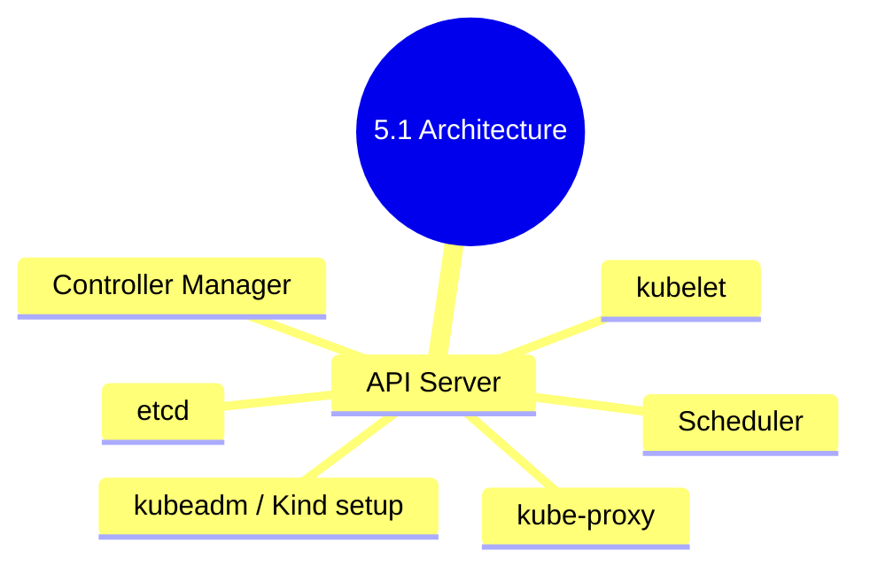

# 5.1.3 Subchapter Review: Cheatsheet and Interview Prep

This review covers only the material presented in Notes 5.1.1 (K8s Architecture Components) and 5.1.2 (Cluster Setup with kubeadm and Kind). No forward referencing beyond what was explicitly introduced.

**Backlinks:** [5.1.1 - K8s Architecture](./5.1.1_K8s_Architecture_Components.md) | [5.1.2 - Cluster Setup](./5.1.2_Cluster_Setup_kubeadm_Kind_Multi_Node.md)

---

## Quick Command Reference

| Command | Purpose |
|---------|---------|
| `kubectl get nodes` | List cluster nodes |
| `kubectl get pods -A` | List all pods in all namespaces |
| `kubectl get pods -o wide` | List pods with node/IP info |
| `kubectl describe pod NAME` | Detailed pod info + events |
| `kubectl logs NAME` | View pod logs |
| `kubectl logs NAME --previous` | Previous container logs |
| `kubectl exec -it NAME -- /bin/sh` | Shell into pod |
| `kubectl apply -f FILE` | Create/update resource |
| `kubectl delete -f FILE` | Delete resource |
| `kubectl config get-contexts` | List kubeconfig contexts |
| `kubectl config use-context CTX` | Switch context |
| `kubectl cluster-info` | Cluster API endpoint |
| `kubectl api-resources` | List API resources |
| `kubectl explain RESOURCE` | Resource documentation |
| `kind create cluster --name NAME` | Create Kind cluster |
| `kind delete cluster --name NAME` | Delete Kind cluster |
| `kind get clusters` | List Kind clusters |
| `kubeadm init` | Initialize control plane |
| `kubeadm join` | Join worker node |
| `kubeadm token create --print-join-command` | Generate join command |
| `kubeadm reset` | Reset node configuration |

---

## Cheatsheet: Kubernetes Architecture and Cluster Setup

### Control Plane Components

| Component                    | Responsibility                              | Default Port |
| ---------------------------- | ------------------------------------------- | ------------ |
| **kube-apiserver**           | Gateway, auth, validation                   | 6443         |
| **etcd**                     | Distributed key-value store (cluster state) | 2379-2380    |
| **kube-scheduler**           | Assign pods to nodes                        | 10259        |
| **kube-controller-manager**  | Runs controllers (Deployment, Node, etc.)   | 10257        |
| **cloud-controller-manager** | Cloud provider integration                  | 10258        |

### Worker Node Components

| Component             | Responsibility                          | Default Port |
| --------------------- | --------------------------------------- | ------------ |
| **kubelet**           | Runs pods; communicates with API server | 10250        |
| **kube-proxy**        | Network rules; Service load balancing   | 10256        |
| **Container Runtime** | Runs containers (containerd, CRI-O)     | Varies       |

### Pod Phases

| Phase                | Meaning                                            |
| -------------------- | -------------------------------------------------- |
| **Pending**          | Pod accepted, waiting for scheduling or image pull |
| **Running**          | At least one container running                     |
| **Succeeded**        | All containers terminated with success             |
| **Failed**           | All containers terminated with failure             |
| **Unknown**          | State unknown (node lost communication)            |
| **CrashLoopBackOff** | Container repeatedly crashing                      |

### Essential kubectl Commands

| Command                            | Purpose                         |
| ---------------------------------- | ------------------------------- |
| `kubectl get nodes`                | List nodes                      |
| `kubectl get pods -o wide`         | List pods with IP/node          |
| `kubectl get all -n namespace`     | List all resources in namespace |
| `kubectl describe pod NAME`        | Detailed status + events        |
| `kubectl logs NAME`                | View container logs             |
| `kubectl logs NAME --previous`     | Previous container logs (crash) |
| `kubectl exec -it NAME -- /bin/sh` | Interactive shell in pod        |
| `kubectl apply -f manifest.yaml`   | Create/update resources         |
| `kubectl delete pod NAME`          | Delete pod                      |
| `kubectl explain pod.spec`         | Documentation                   |

### kubectl Output Formats

| Flag             | Use Case                |
| ---------------- | ----------------------- |
| `-o wide`        | More columns (IP, node) |
| `-o yaml`        | Full YAML manifest      |
| `-o json`        | Full JSON output        |
| `-o name`        | Only resource names     |
| `-w` / `--watch` | Watch for changes       |

### kubeconfig Structure

```yaml
apiVersion: v1
kind: Config
clusters:
- cluster:
    certificate-authority-data: <CA>
    server: https://api-server:6443
  name: my-cluster
contexts:
- context:
    cluster: my-cluster
    user: admin
    namespace: default
  name: my-context
current-context: my-context
users:
- name: admin
  user:
    client-certificate-data: <cert>
    client-key-data: <key>
```

### Setup Methods Comparison

| Method                    | Use Case                  | Nodes             | Production |
| ------------------------- | ------------------------- | ----------------- | ---------- |
| **Kind**                  | Local dev, CI/CD          | Docker containers | No         |
| **Minikube**              | Local dev, learning       | VM (single node)  | No         |
| **kubeadm**               | Production VMs/bare metal | VMs/bare metal    | Yes        |
| **K3s**                   | Edge, IoT                 | Lightweight       | Yes        |
| **Managed (EKS/GKE/AKS)** | Cloud production          | Managed           | Yes        |

### kubeadm Commands

| Command                                     | Purpose                  |
| ------------------------------------------- | ------------------------ |
| `kubeadm init`                              | Initialize control plane |
| `kubeadm join`                              | Join worker node         |
| `kubeadm token create --print-join-command` | Generate join command    |
| `kubeadm token list`                        | List bootstrap tokens    |
| `kubeadm reset`                             | Reset node               |
| `kubeadm upgrade plan`                      | Check upgrade            |
| `kubeadm upgrade apply`                     | Upgrade cluster          |

### Essential Addons

| Addon              | Purpose                       | Install Command                       |
| ------------------ | ----------------------------- | ------------------------------------- |
| **CoreDNS**        | Cluster DNS                   | Installed by kubeadm                  |
| **metrics-server** | Resource metrics (CPU/memory) | `kubectl apply -f components.yaml`    |
| **Calico**         | CNI (pod networking)          | `kubectl apply -f calico.yaml`        |
| **Nginx Ingress**  | L7 routing                    | `kubectl apply -f ingress-nginx.yaml` |

### kubeconfig Commands

| Command                                                         | Purpose               |
| --------------------------------------------------------------- | --------------------- |
| `kubectl config view`                                           | View merged config    |
| `kubectl config get-contexts`                                   | List contexts         |
| `kubectl config use-context NAME`                               | Switch context        |
| `kubectl config set-context --current --namespace=NS`           | Set default namespace |
| `kubectl config set-cluster NAME --server=URL`                  | Add cluster           |
| `kubectl config set-credentials NAME --token=TOKEN`             | Add user              |
| `kubectl config set-context NAME --cluster=CLUSTER --user=USER` | Add context           |




***

## Comparison Tables

### Control Plane vs Worker Node

| Aspect              | Control Plane                | Worker Node           |
| ------------------- | ---------------------------- | --------------------- |
| **Runs API Server** | Yes                          | No                    |
| **Runs etcd**       | Yes (stacked) or external    | No                    |
| **Runs kubelet**    | Yes (scheduler, controllers) | Yes                   |
| **Runs pods**       | Yes (system pods)            | Yes (user + system)   |
| **Failure impact**  | Cluster management stops     | Pods on that node die |

### Pod Troubleshooting Flow

| Symptom            | First Command             | Likely Cause                                   |
| ------------------ | ------------------------- | ---------------------------------------------- |
| `Pending`          | `kubectl describe pod`    | Insufficient resources, scheduling constraints |
| `CrashLoopBackOff` | `kubectl logs --previous` | Application error, misconfiguration            |
| `ImagePullBackOff` | `kubectl describe pod`    | Wrong image name, private registry             |
| `OOMKilled`        | `kubectl describe pod`    | Memory limit too low, memory leak              |
| `Evicted`          | `kubectl describe pod`    | Node disk/memory pressure                      |

***

## Interview Questions (Scenario-Based)

These questions assume only knowledge from Subchapter 5.1. Answers reference only concepts from 5.1.1 and 5.1.2.

### Question 1

**Scenario:** A `kubectl get nodes` command returns one node with `Ready` status and one node with `NotReady`. Pods scheduled on the NotReady node are stuck in `Unknown` or `Terminating` state.

**Question:** What components should you check on the NotReady node? What is the most likely cause, and how would you investigate?

**Answer:**

**Components to check on the NotReady node:**

1. **kubelet** – Primary agent; if not running, node won't be Ready
2. **Container runtime** (containerd/docker) – Must be running for pods to execute
3. **Network** – CNI plugin may be failing
4. **Disk pressure** – Full disk can cause node to become NotReady
5. **Memory pressure** – OOM conditions

**Most likely cause:** kubelet service is stopped or crashed.

**Investigation steps:**

```bash
# On the NotReady node (access via SSH or console)

# 1. Check kubelet status
systemctl status kubelet
journalctl -u kubelet -f --since "5 minutes ago"

# 2. Check container runtime
systemctl status containerd
# or
systemctl status docker

# 3. Check disk space
df -h
# If /var is full, kubelet cannot write pod logs

# 4. Check node conditions from cluster
kubectl describe node <notready-node>
# Look at Conditions section:
# - MemoryPressure
# - DiskPressure
# - PIDPressure
# - NetworkUnavailable

# 5. Check if kubelet is reporting
ps aux | grep kubelet
```

**Common fixes:**

```bash
# Restart kubelet
systemctl restart kubelet

# If containerd is dead
systemctl restart containerd

# If disk is full
docker system prune -a
# or
journalctl --vacuum-size=500M

# If kubelet config is wrong
kubeadm reset  # Last resort, then rejoin
```

**What happens to pods on NotReady node:**

* After 5 minutes (default `pod-eviction-timeout`), pods are marked `Terminating`

* Controller (Deployment, StatefulSet) recreates pods on healthy nodes

* Original pods remain in `Terminating` until node recovers or pods are force-deleted

### Question 2

**Scenario:** A developer creates a pod using `kubectl run nginx --image=nginx`. The pod shows `Pending` status for over a minute.

**Question:** What command would you run to investigate? What are the possible reasons for a pod to stay in Pending? How would you resolve each?

**Answer:**

**Investigation command:**

```bash
kubectl describe pod nginx
# Look at Events section at the bottom
```

**Possible reasons for Pending:**

| Event Message                                                        | Cause                                  | Resolution                             |
| -------------------------------------------------------------------- | -------------------------------------- | -------------------------------------- |
| `0/3 nodes are available: insufficient cpu`                          | Resource requests exceed node capacity | Reduce pod CPU request; add more nodes |
| `0/3 nodes are available: node(s) had untolerated taint`             | Node has taint (e.g., `NoSchedule`)    | Add toleration to pod; remove taint    |
| `pod has unbound immediate PersistentVolumeClaims`                   | PVC not bound to PV                    | Create PV or StorageClass; check PVC   |
| `FailedScheduling: pod has no node selected`                         | Node selector mismatch                 | Check node labels; remove nodeSelector |
| `0/3 nodes are available: node(s) had volume node affinity conflict` | PV bound to specific zone              | Create PV in same zone as pod          |

**Detailed resolution steps:**

**1. Insufficient resources:**

```bash
# Check node capacity
kubectl describe nodes | grep -A 5 "Allocated resources"

# Reduce pod requests
kubectl set resources pod nginx --limits=cpu=500m,memory=256Mi --requests=cpu=250m,memory=128Mi

# Or add node
# (cloud: scale node group; bare metal: kubeadm join new node)
```

**2. Taint issue:**

```bash
# Check node taints
kubectl describe node master | grep Taints
# Taints: node-role.kubernetes.io/master:NoSchedule

# Add toleration to pod
kubectl patch pod nginx --patch '{"spec":{"tolerations":[{"key":"node-role.kubernetes.io/master","operator":"Exists","effect":"NoSchedule"}]}}'
```

**3. PVC not bound:**

```bash
# Check PVC status
kubectl get pvc
# If stuck in Pending, create PV or StorageClass

# Create PV manually (example)
kubectl apply -f - << EOF
apiVersion: v1
kind: PersistentVolume
metadata:
  name: my-pv
spec:
  capacity:
    storage: 10Gi
  accessModes:
    - ReadWriteOnce
  hostPath:
    path: /tmp/data
EOF
```

**Quick debugging workflow:**

```bash
# Watch pod status
kubectl get pods -w

# In another terminal, describe
kubectl describe pod nginx | grep -A 20 Events
```

### Question 3

**Scenario:** A user runs `kubectl logs mypod` and gets:

```
Error from server (Forbidden): pods "mypod" is forbidden: User "alice" cannot get resource "pods/log" in API group "" in the namespace "default"
```

**Question:** What is the problem? Which Kubernetes component is responsible for authentication and authorization? How would you grant Alice access to view logs?

**Answer:**

**Problem:** RBAC (Role-Based Access Control) is denying Alice permission to read pod logs. The API Server handles authentication and authorization.

**Components involved:**

* **Authentication** (who you are) – Client certificates, tokens, OIDC

* **Authorization** (what you can do) – RBAC determines permissions

**Solution:** Create a Role and RoleBinding to grant `get pods/log` permission.

**Step-by-step fix:**

```bash
# 1. Create Role with pod logs permission
cat << EOF | kubectl apply -f -
apiVersion: rbac.authorization.k8s.io/v1
kind: Role
metadata:
  namespace: default
  name: pod-log-reader
rules:
- apiGroups: [""]
  resources: ["pods/log"]
  verbs: ["get", "list"]
- apiGroups: [""]
  resources: ["pods"]
  verbs: ["get", "list"]
EOF

# 2. Bind Role to user Alice
cat << EOF | kubectl apply -f -
apiVersion: rbac.authorization.k8s.io/v1
kind: RoleBinding
metadata:
  namespace: default
  name: alice-pod-log-reader
subjects:
- kind: User
  name: alice
  apiGroup: rbac.authorization.k8s.io
roleRef:
  kind: Role
  name: pod-log-reader
  apiGroup: rbac.authorization.k8s.io
EOF

# 3. Verify access
kubectl auth can-i get pods/log --as=alice
# yes
```

**Alternative – ClusterRole for all namespaces:**

```yaml
apiVersion: rbac.authorization.k8s.io/v1
kind: ClusterRole
metadata:
  name: pod-log-reader-cluster
rules:
- apiGroups: [""]
  resources: ["pods/log"]
  verbs: ["get", "list"]
---
apiVersion: rbac.authorization.k8s.io/v1
kind: ClusterRoleBinding
metadata:
  name: alice-pod-log-reader-cluster
subjects:
- kind: User
  name: alice
roleRef:
  kind: ClusterRole
  name: pod-log-reader-cluster
```

**Check current permissions:**

```bash
# What can Alice do?
kubectl auth can-i --list --as=alice

# Check specific permission
kubectl auth can-i get pods --as=alice
kubectl auth can-i create deployments --as=alice
```

### Question 4

**Scenario:** A `kubectl get pods` command shows a pod with `CrashLoopBackOff` status. The pod restarts every few seconds.

**Question:** What does CrashLoopBackOff mean? How would you investigate the root cause? What commands would you run?

**Answer:**

**CrashLoopBackOff meaning:**

* Container is crashing on startup

* kubelet restarts the container

* After repeated failures, kubelet adds a backoff delay (10s, 20s, 40s, up to 5 minutes)

**Investigation commands:**

```bash
# 1. Check pod events (shows crash reason and backoff)
kubectl describe pod mypod

# 2. View current logs (may be from last attempt)
kubectl logs mypod

# 3. View previous container logs (most important!)
kubectl logs mypod --previous

# 4. Check if pod has multiple containers
kubectl logs mypod -c container-name --previous

# 5. Check exit code
kubectl get pod mypod -o jsonpath='{.status.containerStatuses[0].lastState.terminated.exitCode}'
```

**Common causes and fixes:**

| Log Message                   | Cause                                   | Fix                                         |
| ----------------------------- | --------------------------------------- | ------------------------------------------- |
| `command not found`           | Wrong command in Dockerfile or pod spec | Check `command` in pod spec                 |
| `file not found`              | Missing config file                     | Add ConfigMap mount                         |
| `port already in use`         | Port conflict                           | Change port or remove conflicting container |
| `permission denied`           | Running as wrong user                   | Set `securityContext.runAsNonRoot: true`    |
| `database connection refused` | Dependency not ready                    | Add initContainer or retry logic            |
| `panic: runtime error`        | Application bug                         | Fix code, update image                      |
| `exited with code 1`          | Generic error                           | Check application logs                      |

**Debugging with ephemeral container (K8s 1.23+):**

```bash
# Create debug container alongside crashing container
kubectl debug mypod -it --image=busybox --target=myapp
# Share process namespace to inspect

# Or replace the container with debug shell
kubectl debug mypod -it --image=ubuntu -- sh
```

**If logs are empty (crash immediately):**

```bash
# Override command to sleep, then exec in
kubectl set image pod mypod myapp=busybox --dry-run=client -o yaml > debug.yaml
# Edit to use `command: ["sleep", "3600"]`
kubectl replace --force -f debug.yaml
kubectl exec -it mypod -- /bin/sh
# Then manually run the original command to see error
```

### Question 5

**Scenario:** You join a new worker node to a kubeadm cluster using `kubeadm join`. The node appears in `kubectl get nodes` but shows `NotReady`. The control plane is healthy.

**Question:** What are the most common causes for a new node to be NotReady? How would you diagnose each?

**Answer:**

**Common causes for NotReady after join:**

| Cause                                  | Diagnostic Command                               | Fix                                  |
| -------------------------------------- | ------------------------------------------------ | ------------------------------------ |
| **CNI not installed**                  | `kubectl get pods -n kube-system \| grep calico` | Install CNI (usually done on master) |
| **kubelet not running**                | `systemctl status kubelet` (on node)             | `systemctl start kubelet`            |
| **Container runtime issues**           | `systemctl status containerd`                    | Restart containerd                   |
| **Swap enabled**                       | `swapon --show`                                  | `swapoff -a`                         |
| **Network connectivity to API server** | `curl -k https://<api-server>:6443/healthz`      | Check firewall, route                |
| **Node tainted**                       | `kubectl describe node \| grep Taints`           | Add toleration or remove taint       |
| **Disk pressure**                      | `df -h /var`                                     | Free disk space                      |
| **Wrong node name resolution**         | `hostname` on node vs `kubectl get nodes`        | Ensure hostname matches              |

**Diagnosis workflow:**

```bash
# On the NotReady node (via SSH)

# 1. Check kubelet status
systemctl status kubelet
journalctl -u kubelet -f --since "2 minutes ago"

# 2. Check container runtime
systemctl status containerd
crictl ps  # Should work

# 3. Check swap
swapon --show  # Should be empty

# 4. Check network to API server
kubectl get endpoints  # from master IP
ping <master-ip>
curl -k https://<master-ip>:6443/healthz

# 5. Check node from cluster side
kubectl describe node <node-name>
# Look at Conditions section
# Look at Events section
```

**If kubelet shows "failed to get sandbox image":**

```bash
# Pull pause image manually
crictl pull registry.k8s.io/pause:3.9
```

**If kubelet shows "failed to query image service":**

```bash
# Check containerd config
cat /etc/containerd/config.toml
# Ensure disabled_plugins is not set for cri
systemctl restart containerd
```

**After fixing, node should become Ready within 1-2 minutes:**

```bash
kubectl get nodes -w
```

***

## Topics Covered in This Subchapter (Self-Check)

| Topic                                                                      | Found in Note |
| -------------------------------------------------------------------------- | ------------- |
| Control plane components (API Server, etcd, Scheduler, Controller Manager) | 5.1.1         |
| Worker node components (kubelet, kube-proxy, container runtime)            | 5.1.1         |
| Pod lifecycle phases                                                       | 5.1.1         |
| kubectl essentials (get, describe, logs, exec, apply, delete)              | 5.1.1         |
| kubectl output formats (wide, yaml, json, name)                            | 5.1.1         |
| Kind cluster setup and configuration                                       | 5.1.2         |
| Minikube basics                                                            | 5.1.2         |
| kubeadm prerequisites (swap off, sysctl, containerd)                       | 5.1.2         |
| kubeadm init and join                                                      | 5.1.2         |
| kubeconfig structure and management                                        | 5.1.2         |
| Cluster addons (CoreDNS, metrics-server, ingress)                          | 5.1.2         |
| Common cluster setup issues                                                | 5.1.2         |

## Bridge Concepts (Not in Notes but Added for Clarity)

| Concept                | Explanation                                                                                           |
| ---------------------- | ----------------------------------------------------------------------------------------------------- |
| `crictl`               | CLI for CRI-compatible container runtimes (containerd, CRI-O). Alternative to `docker` for debugging. |
| `kubectl auth can-i`   | Check if a user has permission to perform an action. Useful for RBAC debugging.                       |
| `kubectl debug`        | Creates ephemeral containers for debugging. K8s 1.23+ feature.                                        |
| `pod-eviction-timeout` | How long to wait before evicting pods from NotReady node (default 5 minutes).                         |
| `CrashLoopBackOff`     | Exponential backoff for crashing containers: 10s, 20s, 40s, 80s, 160s, 300s.                          |
| `kubeadm reset`        | Removes all Kubernetes data from node (last resort).                                                  |

***

**End of Subchapter 5.1 Review**

**Next:** Proceed to Subchapter 5.2 – High Availability and etcd Management (HA cluster architecture, multi-master, etcd backup and restore).
