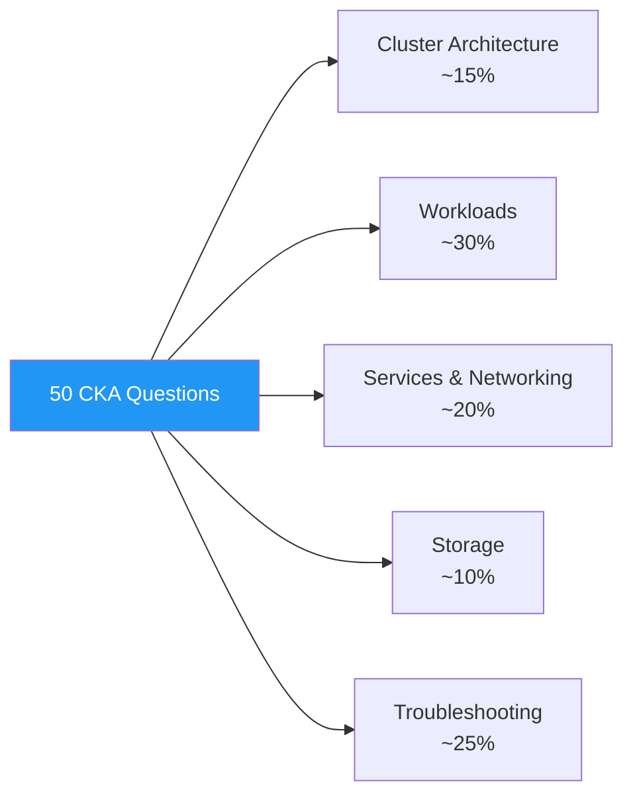

# 5.10.1 CKA Exam Pattern — Questions 1 to 25

> **Important:** The CKA exam is 100% hands-on — no multiple-choice. Every question below is phrased as a **real scenario** you would see on the exam, with a full solution that you can run in a Kind / Minikube cluster. Each solution includes **backlinks to the specific Module 5 chapter** that teaches the underlying concept so you can revise precisely what you missed.

### How to Use This Chapter

1. **Attempt the task first** — time yourself (CKA budget is ~6–7 min per question).
2. Compare your solution.
3. If you struggle, follow the **📎 backlink** to the relevant chapter.
4. Practise until every question takes < 5 minutes.

### Topic Distribution



> **Tip:** Set up `alias k=kubectl` and `export do='--dry-run=client -o yaml'` before every practice session — you'll save minutes per question.

---

## Question 1 — Create a Pod With Specific Resources

**Task:** Create a pod named `nginx-pod` using image `nginx:1.25` in namespace `dev`. Set CPU request `100m`, memory request `128Mi`, CPU limit `200m`, memory limit `256Mi`.

<details>
<summary>Solution</summary>

```bash
kubectl create ns dev 2>/dev/null || true

kubectl run nginx-pod --image=nginx:1.25 -n dev \
    --dry-run=client -o yaml > pod.yaml

# Edit pod.yaml to add resources
cat > pod.yaml <<'EOF'
apiVersion: v1
kind: Pod
metadata:
  name: nginx-pod
  namespace: dev
spec:
  containers:
  - name: nginx-pod
    image: nginx:1.25
    resources:
      requests:
        cpu: 100m
        memory: 128Mi
      limits:
        cpu: 200m
        memory: 256Mi
EOF

kubectl apply -f pod.yaml
kubectl get pod nginx-pod -n dev
```

📎 [5.3.1 Pod Fundamentals and Lifecycle](../Subchapter_5.3/5.3.1_Pod_Fundamentals_and_Lifecycle.md)

</details>

---

## Question 2 — Deployment With 3 Replicas, Rolling Update Strategy

**Task:** Create a deployment `web-app` with 3 replicas of `nginx:1.24`. Configure a `RollingUpdate` strategy with `maxSurge=1` and `maxUnavailable=0`.

<details>
<summary>Solution</summary>

```bash
kubectl create deployment web-app --image=nginx:1.24 --replicas=3 $do > web.yaml
```

Edit to add strategy:

```yaml
apiVersion: apps/v1
kind: Deployment
metadata:
  name: web-app
spec:
  replicas: 3
  strategy:
    type: RollingUpdate
    rollingUpdate:
      maxSurge: 1
      maxUnavailable: 0
  selector:
    matchLabels: { app: web-app }
  template:
    metadata: { labels: { app: web-app } }
    spec:
      containers:
      - name: web-app
        image: nginx:1.24
```

```bash
kubectl apply -f web.yaml
kubectl rollout status deploy/web-app
```

📎 [5.3.2 Workload Controllers](../Subchapter_5.3/5.3.2_Workload_Controllers_Deployments_StatefulSets_DaemonSets.md)

</details>

---

## Question 3 — Expose a Deployment via ClusterIP Service

**Task:** Expose the existing `web-app` deployment on port `80` as a ClusterIP service named `web-svc`.

<details>
<summary>Solution</summary>

```bash
kubectl expose deploy web-app --name=web-svc --port=80 --target-port=80 --type=ClusterIP
kubectl get svc web-svc
```

Verify:

```bash
kubectl run tmp --image=busybox:1.36 --rm -it --restart=Never -- wget -qO- web-svc
```

📎 [5.4.1 Services — ClusterIP, NodePort, LoadBalancer](../Subchapter_5.4/5.4.1_Services_ClusterIP_NodePort_LoadBalancer.md)

</details>

---

## Question 4 — NodePort Service on a Specific Port

**Task:** Expose `web-app` as a NodePort service `web-np` on node port `30080`.

<details>
<summary>Solution</summary>

```bash
kubectl expose deploy web-app --name=web-np --port=80 --target-port=80 --type=NodePort $do \
    | sed '/ports:/a\    nodePort: 30080' \
    | kubectl apply -f -

kubectl get svc web-np
curl -s http://$(kubectl get node -o jsonpath='{.items[0].status.addresses[?(@.type=="InternalIP")].address}'):30080
```

📎 [5.4.1 Services — ClusterIP, NodePort, LoadBalancer](../Subchapter_5.4/5.4.1_Services_ClusterIP_NodePort_LoadBalancer.md)

</details>

---

## Question 5 — Scale a Deployment Imperatively

**Task:** Scale `web-app` from 3 to 5 replicas. Then confirm rollout history.

<details>
<summary>Solution</summary>

```bash
kubectl scale deploy web-app --replicas=5
kubectl rollout status deploy/web-app
kubectl rollout history deploy/web-app
```

📎 [5.3.2 Workload Controllers](../Subchapter_5.3/5.3.2_Workload_Controllers_Deployments_StatefulSets_DaemonSets.md)

</details>

---

## Question 6 — Rolling Update + Rollback

**Task:** Update `web-app` to image `nginx:1.25`. If any pod goes `CrashLoopBackOff`, rollback.

<details>
<summary>Solution</summary>

```bash
kubectl set image deploy/web-app web-app=nginx:1.25 --record
kubectl rollout status deploy/web-app --timeout=60s || \
    kubectl rollout undo deploy/web-app

kubectl rollout history deploy/web-app
```

📎 [5.3.2 Workload Controllers](../Subchapter_5.3/5.3.2_Workload_Controllers_Deployments_StatefulSets_DaemonSets.md)

</details>

---

## Question 7 — Create a ConfigMap From a Literal and Mount It

**Task:** Create ConfigMap `app-config` with keys `ENV=prod`, `LOG_LEVEL=info`. Mount it as env vars into a new pod running `alpine:3.19` that runs `env | grep -E 'ENV|LOG_LEVEL'`.

<details>
<summary>Solution</summary>

```bash
kubectl create configmap app-config --from-literal=ENV=prod --from-literal=LOG_LEVEL=info

cat > pod-env.yaml <<'EOF'
apiVersion: v1
kind: Pod
metadata: { name: cm-reader }
spec:
  restartPolicy: Never
  containers:
  - name: c
    image: alpine:3.19
    command: ["sh","-c","env | grep -E 'ENV|LOG_LEVEL'; sleep 10"]
    envFrom:
    - configMapRef: { name: app-config }
EOF
kubectl apply -f pod-env.yaml
kubectl logs cm-reader
```

📎 [5.6.1 ConfigMaps and Secrets](../Subchapter_5.6/5.6.1_ConfigMaps_and_Secrets.md)

</details>

---

## Question 8 — Secret Mounted as a File

**Task:** Create a secret `db-cred` from literals `user=admin, password=s3cret`. Mount as files at `/etc/cred` in a pod `secret-demo` (image `busybox:1.36`) that `cat`s them.

<details>
<summary>Solution</summary>

```bash
kubectl create secret generic db-cred \
    --from-literal=user=admin \
    --from-literal=password=s3cret

cat > secret-demo.yaml <<'EOF'
apiVersion: v1
kind: Pod
metadata: { name: secret-demo }
spec:
  restartPolicy: Never
  containers:
  - name: c
    image: busybox:1.36
    command: ["sh","-c","cat /etc/cred/user /etc/cred/password; sleep 10"]
    volumeMounts:
    - { name: s, mountPath: /etc/cred, readOnly: true }
  volumes:
  - name: s
    secret: { secretName: db-cred }
EOF
kubectl apply -f secret-demo.yaml
kubectl logs secret-demo
```

📎 [5.6.1 ConfigMaps and Secrets](../Subchapter_5.6/5.6.1_ConfigMaps_and_Secrets.md)

</details>

---

## Question 9 — Persistent Volume + PVC

**Task:** Create a `hostPath` PV (`pv-data`, 1Gi, RWO, at `/mnt/data`) and a matching PVC (`pvc-data`). Mount it into a pod `pv-user` at `/data`.

<details>
<summary>Solution</summary>

```yaml
apiVersion: v1
kind: PersistentVolume
metadata: { name: pv-data }
spec:
  capacity: { storage: 1Gi }
  accessModes: ["ReadWriteOnce"]
  persistentVolumeReclaimPolicy: Retain
  storageClassName: manual
  hostPath: { path: /mnt/data }
---
apiVersion: v1
kind: PersistentVolumeClaim
metadata: { name: pvc-data }
spec:
  accessModes: ["ReadWriteOnce"]
  resources: { requests: { storage: 1Gi } }
  storageClassName: manual
---
apiVersion: v1
kind: Pod
metadata: { name: pv-user }
spec:
  containers:
  - name: c
    image: alpine:3.19
    command: ["sh","-c","echo hello > /data/file; sleep 3600"]
    volumeMounts: [{ name: d, mountPath: /data }]
  volumes:
  - name: d
    persistentVolumeClaim: { claimName: pvc-data }
```

📎 [5.5.2 PersistentVolumes, PVCs, StorageClasses](../Subchapter_5.5/5.5.2_PersistentVolumes_PersistentVolumeClaims_StorageClasses.md)

</details>

---

## Question 10 — Namespace + Default ResourceQuota

**Task:** Create namespace `team-a` with a `ResourceQuota` allowing max 10 pods, 2 CPU, 4Gi memory.

<details>
<summary>Solution</summary>

```yaml
apiVersion: v1
kind: Namespace
metadata: { name: team-a }
---
apiVersion: v1
kind: ResourceQuota
metadata: { name: team-a-quota, namespace: team-a }
spec:
  hard:
    pods: "10"
    requests.cpu: "2"
    requests.memory: 4Gi
    limits.cpu: "2"
    limits.memory: 4Gi
```

```bash
kubectl apply -f quota.yaml
kubectl describe quota -n team-a
```

📎 [5.6.1 ConfigMaps and Secrets](../Subchapter_5.6/5.6.1_ConfigMaps_and_Secrets.md) · [5.3.1 Pod Fundamentals](../Subchapter_5.3/5.3.1_Pod_Fundamentals_and_Lifecycle.md)

</details>

---

## Question 11 — Taint a Node and Schedule a Tolerating Pod

**Task:** Taint `worker-1` with `dedicated=gpu:NoSchedule`. Create a pod `gpu-pod` that tolerates it and uses `nodeSelector` to land there.

<details>
<summary>Solution</summary>

```bash
kubectl taint node worker-1 dedicated=gpu:NoSchedule
kubectl label node worker-1 dedicated=gpu
```

```yaml
apiVersion: v1
kind: Pod
metadata: { name: gpu-pod }
spec:
  nodeSelector: { dedicated: gpu }
  tolerations:
  - key: dedicated
    operator: Equal
    value: gpu
    effect: NoSchedule
  containers:
  - { name: c, image: nginx:1.25 }
```

📎 [5.3.3 Scheduling — Taints, Tolerations, Affinity](../Subchapter_5.3/5.3.3_Scheduling_Taints_Tolerations_Affinity.md)

</details>

---

## Question 12 — Node Affinity (Required + Preferred)

**Task:** Deploy `nginx` with **required** affinity `topology.kubernetes.io/zone=zone-a` and **preferred** affinity `disk=ssd` (weight 10).

<details>
<summary>Solution</summary>

```yaml
spec:
  affinity:
    nodeAffinity:
      requiredDuringSchedulingIgnoredDuringExecution:
        nodeSelectorTerms:
        - matchExpressions:
          - { key: topology.kubernetes.io/zone, operator: In, values: [zone-a] }
      preferredDuringSchedulingIgnoredDuringExecution:
      - weight: 10
        preference:
          matchExpressions:
          - { key: disk, operator: In, values: [ssd] }
```

📎 [5.3.3 Scheduling — Taints, Tolerations, Affinity](../Subchapter_5.3/5.3.3_Scheduling_Taints_Tolerations_Affinity.md)

</details>

---

## Question 13 — DaemonSet on Every Node

**Task:** Create a DaemonSet `node-exporter` that runs `quay.io/prometheus/node-exporter:latest` on every node (including control-plane).

<details>
<summary>Solution</summary>

```yaml
apiVersion: apps/v1
kind: DaemonSet
metadata: { name: node-exporter, namespace: monitoring }
spec:
  selector: { matchLabels: { app: node-exporter } }
  template:
    metadata: { labels: { app: node-exporter } }
    spec:
      hostNetwork: true
      tolerations:
      - operator: Exists           # tolerate ALL taints incl. control-plane
      containers:
      - name: ne
        image: quay.io/prometheus/node-exporter:latest
        ports: [{ containerPort: 9100 }]
```

📎 [5.3.2 Workload Controllers](../Subchapter_5.3/5.3.2_Workload_Controllers_Deployments_StatefulSets_DaemonSets.md)

</details>

---

## Question 14 — StatefulSet With 3 Replicas + Headless Service

**Task:** Create a StatefulSet `db` running `mongo:7` with 3 replicas, 1Gi volumeClaimTemplate, and a headless service `db-svc`.

<details>
<summary>Solution</summary>

```yaml
apiVersion: v1
kind: Service
metadata: { name: db-svc }
spec:
  clusterIP: None
  selector: { app: db }
  ports: [{ port: 27017 }]
---
apiVersion: apps/v1
kind: StatefulSet
metadata: { name: db }
spec:
  serviceName: db-svc
  replicas: 3
  selector: { matchLabels: { app: db } }
  template:
    metadata: { labels: { app: db } }
    spec:
      containers:
      - name: db
        image: mongo:7
        ports: [{ containerPort: 27017 }]
        volumeMounts: [{ name: data, mountPath: /data/db }]
  volumeClaimTemplates:
  - metadata: { name: data }
    spec:
      accessModes: ["ReadWriteOnce"]
      resources: { requests: { storage: 1Gi } }
```

📎 [5.3.2 Workload Controllers](../Subchapter_5.3/5.3.2_Workload_Controllers_Deployments_StatefulSets_DaemonSets.md)

</details>

---

## Question 15 — Ingress With Path-Based Routing

**Task:** Create an Ingress `shop` that routes `/api` to `api-svc:8080` and `/` to `web-svc:80` on host `shop.local`.

<details>
<summary>Solution</summary>

```yaml
apiVersion: networking.k8s.io/v1
kind: Ingress
metadata:
  name: shop
  annotations:
    nginx.ingress.kubernetes.io/rewrite-target: /
spec:
  ingressClassName: nginx
  rules:
  - host: shop.local
    http:
      paths:
      - path: /api
        pathType: Prefix
        backend: { service: { name: api-svc, port: { number: 8080 } } }
      - path: /
        pathType: Prefix
        backend: { service: { name: web-svc, port: { number: 80 } } }
```

📎 [5.4.2 Ingress, Ingress Controllers, Gateway API](../Subchapter_5.4/5.4.2_Ingress_Ingress_Controllers_and_Gateway_API.md)

</details>

---

## Question 16 — Deny-All NetworkPolicy Then Allow

**Task:** In namespace `prod`, deny all pod-to-pod traffic by default. Then allow only `app=frontend` to reach `app=backend` on port 8080.

<details>
<summary>Solution</summary>

```yaml
# 1) deny-all ingress in prod
apiVersion: networking.k8s.io/v1
kind: NetworkPolicy
metadata: { name: deny-all, namespace: prod }
spec:
  podSelector: {}
  policyTypes: [Ingress]
---
# 2) allow frontend -> backend:8080
apiVersion: networking.k8s.io/v1
kind: NetworkPolicy
metadata: { name: fe-to-be, namespace: prod }
spec:
  podSelector: { matchLabels: { app: backend } }
  policyTypes: [Ingress]
  ingress:
  - from:
    - podSelector: { matchLabels: { app: frontend } }
    ports:
    - { protocol: TCP, port: 8080 }
```

📎 [5.4.3 Network Policies](../Subchapter_5.4/5.4.3_Network_Policies.md)

</details>

---

## Question 17 — RBAC: Developer Can Read Pods, Exec Into Them

**Task:** Create a Role `pod-dev` in `dev` granting `get/list/watch` on pods and `create` on `pods/exec`. Bind it to user `alice`.

<details>
<summary>Solution</summary>

```yaml
apiVersion: rbac.authorization.k8s.io/v1
kind: Role
metadata: { name: pod-dev, namespace: dev }
rules:
- apiGroups: [""]
  resources: [pods]
  verbs: [get, list, watch]
- apiGroups: [""]
  resources: [pods/exec]
  verbs: [create]
---
apiVersion: rbac.authorization.k8s.io/v1
kind: RoleBinding
metadata: { name: alice-pod-dev, namespace: dev }
subjects:
- { kind: User, name: alice, apiGroup: rbac.authorization.k8s.io }
roleRef:
  kind: Role
  name: pod-dev
  apiGroup: rbac.authorization.k8s.io
```

Verify:

```bash
kubectl auth can-i list pods --as=alice -n dev              # yes
kubectl auth can-i create pods/exec --as=alice -n dev        # yes
kubectl auth can-i create pods --as=alice -n dev             # no
```

📎 [5.8.2 RBAC Deep Dive](../Subchapter_5.8/5.8.2_RBAC_Deep_Dive.md)

</details>

---

## Question 18 — ServiceAccount for a Pod

**Task:** Create SA `reader` in `default`. Grant it read on configmaps cluster-wide. Run a pod using this SA that curls the Kubernetes API to list configmaps.

<details>
<summary>Solution</summary>

```bash
kubectl create sa reader
kubectl create clusterrole cm-reader --verb=get,list --resource=configmaps
kubectl create clusterrolebinding reader-bind \
    --clusterrole=cm-reader --serviceaccount=default:reader

kubectl run api-probe --image=curlimages/curl:8.6.0 --restart=Never \
    --overrides='{"spec":{"serviceAccountName":"reader"}}' \
    -- sh -c 'TOKEN=$(cat /var/run/secrets/kubernetes.io/serviceaccount/token);
              curl -sSk https://kubernetes.default/api/v1/configmaps \
                   -H "Authorization: Bearer $TOKEN"'
```

📎 [5.8.2 RBAC Deep Dive](../Subchapter_5.8/5.8.2_RBAC_Deep_Dive.md) · [5.8.1 Authentication Methods](../Subchapter_5.8/5.8.1_Authentication_Methods.md)

</details>

---

## Question 19 — HPA Based on CPU

**Task:** Autoscale `web-app` 2–10 replicas when average CPU > 70%.

<details>
<summary>Solution</summary>

```bash
kubectl autoscale deploy web-app --min=2 --max=10 --cpu-percent=70
kubectl get hpa
```

> **Warning:** HPA requires metrics-server installed. On Kind: `kubectl apply -f https://github.com/kubernetes-sigs/metrics-server/releases/latest/download/components.yaml` and patch `--kubelet-insecure-tls`.

📎 [5.6.2 Autoscaling — HPA, VPA, Cluster Autoscaler](../Subchapter_5.6/5.6.2_Autoscaling_HPA_VPA_Cluster_Autoscaler.md)

</details>

---

## Question 20 — Readiness + Liveness Probes

**Task:** Add a `httpGet` readiness probe on `/ready` (port 8080, delay 5s, period 5s) and a `tcpSocket` liveness probe on 8080 (delay 15s, period 20s) to a pod.

<details>
<summary>Solution</summary>

```yaml
    readinessProbe:
      httpGet: { path: /ready, port: 8080 }
      initialDelaySeconds: 5
      periodSeconds: 5
    livenessProbe:
      tcpSocket: { port: 8080 }
      initialDelaySeconds: 15
      periodSeconds: 20
```

📎 [5.3.1 Pod Fundamentals and Lifecycle](../Subchapter_5.3/5.3.1_Pod_Fundamentals_and_Lifecycle.md)

</details>

---

## Question 21 — Init Container That Waits for a Service

**Task:** Create a pod whose init container waits until `db-svc:27017` is reachable before starting the main container.

<details>
<summary>Solution</summary>

```yaml
spec:
  initContainers:
  - name: wait-for-db
    image: busybox:1.36
    command:
    - sh
    - -c
    - >
      until nc -z db-svc 27017; do
        echo waiting for db; sleep 2;
      done
  containers:
  - { name: app, image: myapp:1.0 }
```

📎 [5.3.1 Pod Fundamentals and Lifecycle](../Subchapter_5.3/5.3.1_Pod_Fundamentals_and_Lifecycle.md)

</details>

---

## Question 22 — CronJob Every 5 Minutes

**Task:** Create a CronJob `backup` running every 5 minutes, image `busybox:1.36`, command `echo backup-$(date +%s)`. Keep 3 successful and 1 failed history.

<details>
<summary>Solution</summary>

```yaml
apiVersion: batch/v1
kind: CronJob
metadata: { name: backup }
spec:
  schedule: "*/5 * * * *"
  successfulJobsHistoryLimit: 3
  failedJobsHistoryLimit: 1
  jobTemplate:
    spec:
      template:
        spec:
          restartPolicy: OnFailure
          containers:
          - name: b
            image: busybox:1.36
            command: ["sh","-c","echo backup-$(date +%s)"]
```

📎 [5.3.2 Workload Controllers](../Subchapter_5.3/5.3.2_Workload_Controllers_Deployments_StatefulSets_DaemonSets.md)

</details>

---

## Question 23 — etcd Backup

**Task:** On the control-plane node, take an etcd snapshot to `/var/backups/etcd-$(date +%F).db`.

<details>
<summary>Solution</summary>

```bash
sudo ETCDCTL_API=3 etcdctl snapshot save "/var/backups/etcd-$(date +%F).db" \
    --endpoints=https://127.0.0.1:2379 \
    --cacert=/etc/kubernetes/pki/etcd/ca.crt \
    --cert=/etc/kubernetes/pki/etcd/server.crt \
    --key=/etc/kubernetes/pki/etcd/server.key

sudo ETCDCTL_API=3 etcdctl snapshot status "/var/backups/etcd-$(date +%F).db" -w table
```

📎 [5.2.2 etcd Backup, Restore, and Disaster Recovery](../Subchapter_5.2/5.2.2_etcd_Backup_Restore_and_Disaster_Recovery.md)

</details>

---

## Question 24 — Upgrade kubeadm Control Plane (Minor Version)

**Task:** Upgrade a kubeadm control-plane from `v1.28.x` to `v1.29.x`.

<details>
<summary>Solution</summary>

```bash
# On the control-plane node:
sudo apt-mark unhold kubeadm
sudo apt-get update && sudo apt-get install -y kubeadm=1.29.1-1.1
sudo apt-mark hold kubeadm

sudo kubeadm upgrade plan
sudo kubeadm upgrade apply v1.29.1

# Drain, upgrade kubelet+kubectl, uncordon
kubectl drain $(hostname) --ignore-daemonsets --delete-emptydir-data
sudo apt-mark unhold kubelet kubectl
sudo apt-get install -y kubelet=1.29.1-1.1 kubectl=1.29.1-1.1
sudo apt-mark hold kubelet kubectl
sudo systemctl daemon-reload && sudo systemctl restart kubelet
kubectl uncordon $(hostname)
```

📎 [5.1.2 Cluster Setup — kubeadm, Kind, Multi-Node](../Subchapter_5.1/5.1.2_Cluster_Setup_kubeadm_Kind_Multi_Node.md)

</details>

---

## Question 25 — Drain a Node for Maintenance

**Task:** Safely drain `worker-2`, perform maintenance, and uncordon it.

<details>
<summary>Solution</summary>

```bash
kubectl cordon worker-2
kubectl drain worker-2 --ignore-daemonsets --delete-emptydir-data --force --timeout=5m

# ... do maintenance ...

kubectl uncordon worker-2
kubectl get nodes
```

> **Warning:** `--delete-emptydir-data` permanently deletes `emptyDir` volumes on that node. Don't run it blindly on nodes hosting stateful caches.

📎 [5.9.1 Troubleshooting Control Plane](../Subchapter_5.9/5.9.1_Troubleshooting_Control_Plane.md)

</details>

---

## Summary — Questions 1 to 25

| # | Area | Chapter |
|---|------|---------|
| 1 | Pods + resources | 5.3.1 |
| 2 | Deployments + strategy | 5.3.2 |
| 3 | ClusterIP service | 5.4.1 |
| 4 | NodePort | 5.4.1 |
| 5 | Scale | 5.3.2 |
| 6 | Rolling update + rollback | 5.3.2 |
| 7 | ConfigMap as env | 5.6.1 |
| 8 | Secret as file | 5.6.1 |
| 9 | PV + PVC | 5.5.2 |
| 10 | ResourceQuota | 5.6.1 |
| 11 | Taints + toleration | 5.3.3 |
| 12 | Node affinity | 5.3.3 |
| 13 | DaemonSet | 5.3.2 |
| 14 | StatefulSet | 5.3.2 |
| 15 | Ingress | 5.4.2 |
| 16 | NetworkPolicy | 5.4.3 |
| 17 | Role + RoleBinding | 5.8.2 |
| 18 | ServiceAccount + API access | 5.8.1, 5.8.2 |
| 19 | HPA | 5.6.2 |
| 20 | Probes | 5.3.1 |
| 21 | Init containers | 5.3.1 |
| 22 | CronJob | 5.3.2 |
| 23 | etcd snapshot | 5.2.2 |
| 24 | kubeadm upgrade | 5.1.2 |
| 25 | drain / uncordon | 5.9.1 |

---

## Backlinks

**Continues in:**
- [5.10.2 CKA Exam Pattern — Questions 26 to 50](./5.10.2_CKA_Exam_Pattern_Questions_26_to_50.md)

**Foundation Chapters Used Most Often:**
- [5.3 Workloads](../Subchapter_5.3/5.3.4_Subchapter_Review.md)
- [5.4 Networking](../Subchapter_5.4/5.4.5_Subchapter_Review.md)
- [5.8 Security & RBAC](../Subchapter_5.8/5.8.4_Subchapter_Review.md)
- [5.9 Operations & Troubleshooting](../Subchapter_5.9/5.9.6_Subchapter_Review_Plus_Final_Exam.md)
