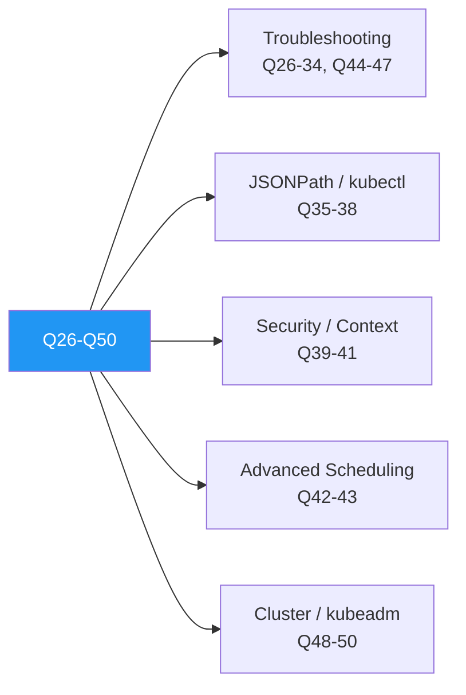

# 5.10.2 CKA Exam Pattern — Questions 26 to 50

Second half of the 50-question CKA preparation set. These lean into **troubleshooting** and **real operational fixes** — which historically make up 30%+ of exam marks.

> **Tip:** For troubleshooting questions on the real exam, **always** run `kubectl describe` and `kubectl logs --previous` as your first step. 60% of the time, the fix is visible in the `Events:` section.

### Question-Style Matrix



---

## Question 26 — Debug a `CrashLoopBackOff` Pod

**Task:** Pod `api-7fd9...` in `prod` is `CrashLoopBackOff`. Find the reason and capture the last crash's logs.

<details>
<summary>Solution</summary>

```bash
kubectl describe pod api-7fd9... -n prod           # check Events + Last State
kubectl logs api-7fd9... -n prod --previous         # logs from prior instance
kubectl get pod api-7fd9... -n prod -o yaml         # full spec, esp. resource limits

# Common fixes:
# - Misconfigured command/args
# - Missing ConfigMap / Secret
# - OOMKilled → bump memory limit
# - Failing readiness probe using wrong port
```

📎 [5.9.2 Troubleshooting Compute Plane and Pods](../Subchapter_5.9/5.9.2_Troubleshooting_Compute_Plane_and_Pods.md)

</details>

---

## Question 27 — Pod Stuck `Pending`

**Task:** A pod is stuck `Pending`. Find whether it's a scheduling or resource issue.

<details>
<summary>Solution</summary>

```bash
kubectl describe pod <name>      # look at Events:
#   "0/3 nodes are available: 3 Insufficient memory"   → resource
#   "0/3 nodes are available: 3 node(s) had untolerated taint" → scheduling
#   "pod has unbound immediate PersistentVolumeClaims" → storage

kubectl get nodes -o wide
kubectl top nodes                 # needs metrics-server
kubectl get pvc -n <ns>
```

📎 [5.9.2 Troubleshooting Compute Plane and Pods](../Subchapter_5.9/5.9.2_Troubleshooting_Compute_Plane_and_Pods.md)

</details>

---

## Question 28 — `ImagePullBackOff`

**Task:** Diagnose and fix a pod stuck in `ImagePullBackOff`.

<details>
<summary>Solution</summary>

```bash
kubectl describe pod <name> | grep -A5 Events
# Usual suspects:
# - Typo in image tag          → fix the tag
# - Private registry, no secret → create imagePullSecret
# - Rate-limit (Docker Hub)    → mirror registry or authenticate

kubectl create secret docker-registry regcred \
    --docker-server=registry.example.com \
    --docker-username=$USER --docker-password=$PASS \
    --docker-email=$EMAIL

# Then patch SA or pod:
kubectl patch sa default -p '{"imagePullSecrets":[{"name":"regcred"}]}'
```

📎 [5.9.2 Troubleshooting Compute Plane and Pods](../Subchapter_5.9/5.9.2_Troubleshooting_Compute_Plane_and_Pods.md)

</details>

---

## Question 29 — Find the Pod Consuming Most Memory Cluster-Wide

<details>
<summary>Solution</summary>

```bash
kubectl top pods --all-namespaces --sort-by=memory | head -10
```

📎 [5.9.3 Monitoring — Prometheus, Grafana, Logging](../Subchapter_5.9/5.9.3_Monitoring_Prometheus_Grafana_and_Logging.md)

</details>

---

## Question 30 — API Server Down — How Do You Know?

**Task:** Kubectl commands hang. What do you check?

<details>
<summary>Solution</summary>

```bash
# 1. kubelet on control-plane node
systemctl status kubelet
journalctl -u kubelet --since "5m ago"

# 2. static pod manifests
ls /etc/kubernetes/manifests/
cat /etc/kubernetes/manifests/kube-apiserver.yaml

# 3. container runtime
sudo crictl ps -a | grep kube-apiserver
sudo crictl logs <containerID>

# 4. etcd health
sudo crictl ps -a | grep etcd
sudo ETCDCTL_API=3 etcdctl endpoint health --endpoints=https://127.0.0.1:2379 \
    --cacert=/etc/kubernetes/pki/etcd/ca.crt \
    --cert=/etc/kubernetes/pki/etcd/server.crt \
    --key=/etc/kubernetes/pki/etcd/server.key
```

📎 [5.9.1 Troubleshooting Control Plane](../Subchapter_5.9/5.9.1_Troubleshooting_Control_Plane.md)

</details>

---

## Question 31 — kubelet Not Running on Worker

**Task:** A worker shows `NotReady`. Fix it.

<details>
<summary>Solution</summary>

```bash
ssh worker-2
sudo systemctl status kubelet
sudo journalctl -u kubelet --since "10m ago" -n 200

# Common causes:
#  - /var/lib/kubelet/config.yaml missing       → kubeadm rejoin
#  - Container runtime not running              → systemctl start containerd
#  - Swap enabled                                → swapoff -a + remove from fstab
#  - Out of disk                                 → df -h, clean /var/lib/containerd

sudo systemctl restart kubelet
kubectl get node worker-2
```

📎 [5.9.1 Troubleshooting Control Plane](../Subchapter_5.9/5.9.1_Troubleshooting_Control_Plane.md)

</details>

---

## Question 32 — Service Has No Endpoints

**Task:** A ClusterIP service exists but has `Endpoints: <none>`. Why?

<details>
<summary>Solution</summary>

```bash
kubectl get svc <name> -o yaml               # note the selector
kubectl get pods --show-labels                # do any match?

# Usual causes:
#  - label mismatch           → fix selector or pod labels
#  - pods not Ready           → kubectl describe pod, fix probes
#  - wrong targetPort         → align to container's port

kubectl get endpoints <name>                  # should list pod IPs after fix
```

📎 [5.4.1 Services — ClusterIP, NodePort, LoadBalancer](../Subchapter_5.4/5.4.1_Services_ClusterIP_NodePort_LoadBalancer.md)

</details>

---

## Question 33 — DNS Is Broken Inside Pods

**Task:** `nslookup kubernetes.default` fails inside pods. Fix it.

<details>
<summary>Solution</summary>

```bash
# 1. Verify CoreDNS is running
kubectl -n kube-system get pods -l k8s-app=kube-dns
kubectl -n kube-system logs deploy/coredns

# 2. Test from a debug pod
kubectl run dnsutils --rm -it --image=registry.k8s.io/e2e-test-images/jessie-dnsutils:1.3 \
    -- nslookup kubernetes.default

# 3. Check the ConfigMap
kubectl -n kube-system get cm coredns -o yaml

# 4. Ensure /etc/resolv.conf in pods points at the cluster DNS IP
kubectl exec <pod> -- cat /etc/resolv.conf
```

📎 [5.4.4 DNS Basics and CoreDNS](../Subchapter_5.4/5.4.4_DNS_Basics_and_CoreDNS.md)

</details>

---

## Question 34 — Node Out of Disk Pressure

**Task:** `kubectl describe node` shows `DiskPressure=true`. Recover.

<details>
<summary>Solution</summary>

```bash
ssh <node>
df -h /var/lib/containerd /var/lib/kubelet
# Clean dangling images + stopped containers:
sudo crictl rmi --prune
sudo crictl rmp $(sudo crictl ps -a --state exited -q)

# If journald is eating disk:
sudo journalctl --vacuum-size=200M
```

📎 [5.9.1 Troubleshooting Control Plane](../Subchapter_5.9/5.9.1_Troubleshooting_Control_Plane.md)

</details>

---

## Question 35 — JSONPath: All Pod IPs

**Task:** List every pod's name and IP across all namespaces.

<details>
<summary>Solution</summary>

```bash
kubectl get pods -A -o jsonpath='{range .items[*]}{.metadata.name}{"\t"}{.status.podIP}{"\n"}{end}'
```

📎 [5.9.5 kubectl Cheatsheet and JSONPath](../Subchapter_5.9/5.9.5_kubectl_Cheatsheet_and_JSONPath.md)

</details>

---

## Question 36 — JSONPath: Nodes With Ready Status

<details>
<summary>Solution</summary>

```bash
kubectl get nodes -o jsonpath='{range .items[*]}{.metadata.name}{" "}{.status.conditions[?(@.type=="Ready")].status}{"\n"}{end}'
```

📎 [5.9.5 kubectl Cheatsheet and JSONPath](../Subchapter_5.9/5.9.5_kubectl_Cheatsheet_and_JSONPath.md)

</details>

---

## Question 37 — Custom Columns: Pods With Images

<details>
<summary>Solution</summary>

```bash
kubectl get pods -A \
    -o custom-columns='NS:.metadata.namespace,NAME:.metadata.name,IMAGE:.spec.containers[*].image'
```

📎 [5.9.5 kubectl Cheatsheet and JSONPath](../Subchapter_5.9/5.9.5_kubectl_Cheatsheet_and_JSONPath.md)

</details>

---

## Question 38 — Sort Pods by CreationTimestamp

<details>
<summary>Solution</summary>

```bash
kubectl get pods -A --sort-by=.metadata.creationTimestamp
```

📎 [5.9.5 kubectl Cheatsheet and JSONPath](../Subchapter_5.9/5.9.5_kubectl_Cheatsheet_and_JSONPath.md)

</details>

---

## Question 39 — SecurityContext: Run as Non-Root

**Task:** Configure a pod so all containers run as UID `1000`, drop all Linux capabilities, and use a read-only root filesystem.

<details>
<summary>Solution</summary>

```yaml
spec:
  securityContext:
    runAsNonRoot: true
    runAsUser: 1000
    fsGroup: 2000
  containers:
  - name: app
    image: myapp:1.0
    securityContext:
      readOnlyRootFilesystem: true
      allowPrivilegeEscalation: false
      capabilities:
        drop: ["ALL"]
```

📎 [5.8.3 Admission Controllers](../Subchapter_5.8/5.8.3_Admission_Controllers.md)

</details>

---

## Question 40 — Pod Security Admission Label

**Task:** Restrict namespace `secure` to the **baseline** PSA level for both enforce and warn.

<details>
<summary>Solution</summary>

```bash
kubectl label ns secure \
    pod-security.kubernetes.io/enforce=baseline \
    pod-security.kubernetes.io/warn=baseline \
    --overwrite
```

📎 [5.8.3 Admission Controllers](../Subchapter_5.8/5.8.3_Admission_Controllers.md)

</details>

---

## Question 41 — Extract the kubeconfig Token for a ServiceAccount

**Task:** Generate a `kubeconfig` file for SA `ci` in `cicd` so an external CI runner can authenticate.

<details>
<summary>Solution</summary>

```bash
# Kubernetes 1.24+ no longer auto-creates secret; make a long-lived token secret
cat <<EOF | kubectl apply -f -
apiVersion: v1
kind: Secret
metadata:
  name: ci-token
  namespace: cicd
  annotations:
    kubernetes.io/service-account.name: ci
type: kubernetes.io/service-account-token
EOF

TOKEN=$(kubectl -n cicd get secret ci-token -o jsonpath='{.data.token}' | base64 -d)
CA=$(kubectl -n cicd get secret ci-token -o jsonpath='{.data.ca\.crt}')
SRV=$(kubectl config view --minify -o jsonpath='{.clusters[0].cluster.server}')

cat > ci.kubeconfig <<EOF
apiVersion: v1
kind: Config
clusters:
- cluster: { server: $SRV, certificate-authority-data: $CA }
  name: prod
users:
- name: ci
  user: { token: $TOKEN }
contexts:
- context: { cluster: prod, user: ci, namespace: cicd }
  name: ci@prod
current-context: ci@prod
EOF
```

📎 [5.8.1 Authentication Methods](../Subchapter_5.8/5.8.1_Authentication_Methods.md)

</details>

---

## Question 42 — Pod Anti-Affinity (Spread Replicas Across Nodes)

**Task:** Spread 3 replicas of a deployment so no two pods land on the same node.

<details>
<summary>Solution</summary>

```yaml
affinity:
  podAntiAffinity:
    requiredDuringSchedulingIgnoredDuringExecution:
    - labelSelector:
        matchLabels: { app: web }
      topologyKey: kubernetes.io/hostname
```

📎 [5.3.3 Scheduling — Taints, Tolerations, Affinity](../Subchapter_5.3/5.3.3_Scheduling_Taints_Tolerations_Affinity.md)

</details>

---

## Question 43 — TopologySpreadConstraints

**Task:** Spread 6 replicas evenly across 3 zones (`skew=1`).

<details>
<summary>Solution</summary>

```yaml
topologySpreadConstraints:
- maxSkew: 1
  topologyKey: topology.kubernetes.io/zone
  whenUnsatisfiable: DoNotSchedule
  labelSelector:
    matchLabels: { app: web }
```

📎 [5.3.3 Scheduling — Taints, Tolerations, Affinity](../Subchapter_5.3/5.3.3_Scheduling_Taints_Tolerations_Affinity.md)

</details>

---

## Question 44 — Pod Can Resolve External DNS But Not In-Cluster Services

<details>
<summary>Solution</summary>

```bash
# Symptom: curl google.com works, curl web-svc fails
# 1. Confirm CoreDNS is healthy
kubectl -n kube-system get pods -l k8s-app=kube-dns
kubectl -n kube-system logs deploy/coredns

# 2. Check the pod's DNS config
kubectl exec <pod> -- cat /etc/resolv.conf
#   search cluster.local <ns>.svc.cluster.local svc.cluster.local
#   nameserver <svc-CoreDNS-IP>

# 3. Ensure kube-dns service endpoints exist
kubectl -n kube-system get svc kube-dns
kubectl -n kube-system get endpoints kube-dns
```

📎 [5.4.4 DNS Basics and CoreDNS](../Subchapter_5.4/5.4.4_DNS_Basics_and_CoreDNS.md)

</details>

---

## Question 45 — Pod Can't Reach the Internet

<details>
<summary>Solution</summary>

```bash
# 1. CNI ok?
kubectl -n kube-system get pods -l k8s-app=calico-node   # or cilium / flannel
# 2. iptables / NetworkPolicy blocking egress?
kubectl get netpol -A
# 3. Node itself has egress?
ssh <node-of-pod> curl -sI https://www.google.com
# 4. If you're using a cloud provider, check SNAT / NAT gateway
```

📎 [5.4.3 Network Policies](../Subchapter_5.4/5.4.3_Network_Policies.md) · [5.9.2 Troubleshooting Compute Plane](../Subchapter_5.9/5.9.2_Troubleshooting_Compute_Plane_and_Pods.md)

</details>

---

## Question 46 — Restore etcd From Snapshot

**Task:** Restore etcd from `/var/backups/etcd-2024-03-01.db` onto a single-node control plane.

<details>
<summary>Solution</summary>

```bash
# Stop static-pod components so API server doesn't talk to etcd
sudo mv /etc/kubernetes/manifests /etc/kubernetes/manifests.bak
sudo crictl ps | grep -E 'etcd|apiserver'   # wait for them to exit

# Restore into a NEW data dir
sudo ETCDCTL_API=3 etcdctl snapshot restore /var/backups/etcd-2024-03-01.db \
    --data-dir=/var/lib/etcd-restored

# Update etcd manifest to point at the new dir, then restore manifests
sudo sed -i 's|/var/lib/etcd|/var/lib/etcd-restored|' /etc/kubernetes/manifests.bak/etcd.yaml
sudo mv /etc/kubernetes/manifests.bak /etc/kubernetes/manifests

# Watch etcd + apiserver come back
sudo crictl ps -w
```

> **Warning:** Always test restores in a lab first. A restore replaces cluster state — anything created after the snapshot is gone.

📎 [5.2.2 etcd Backup, Restore, and Disaster Recovery](../Subchapter_5.2/5.2.2_etcd_Backup_Restore_and_Disaster_Recovery.md)

</details>

---

## Question 47 — Find All Pods Using a Specific Image

<details>
<summary>Solution</summary>

```bash
IMG=nginx:1.24
kubectl get pods -A -o jsonpath="{range .items[?(@.spec.containers[*].image=='${IMG}')]}{.metadata.namespace}/{.metadata.name}{'\n'}{end}"
```

📎 [5.9.5 kubectl Cheatsheet and JSONPath](../Subchapter_5.9/5.9.5_kubectl_Cheatsheet_and_JSONPath.md)

</details>

---

## Question 48 — Generate a kubeadm Join Command

**Task:** From the control-plane, produce the exact `kubeadm join` command a new worker needs.

<details>
<summary>Solution</summary>

```bash
kubeadm token create --print-join-command --ttl 1h
```

📎 [5.1.2 Cluster Setup — kubeadm, Kind, Multi-Node](../Subchapter_5.1/5.1.2_Cluster_Setup_kubeadm_Kind_Multi_Node.md)

</details>

---

## Question 49 — Add a Second Control-Plane Node (HA)

<details>
<summary>Solution</summary>

```bash
# On existing control-plane:
sudo kubeadm init phase upload-certs --upload-certs
# → prints certificate-key
kubeadm token create --print-join-command --certificate-key <CERT_KEY>

# On new control-plane node, run the printed command with:
#   --control-plane --certificate-key <CERT_KEY>
```

📎 [5.2.1 HA Cluster Architecture](../Subchapter_5.2/5.2.1_HA_Cluster_Architecture_Multi_Master.md)

</details>

---

## Question 50 — Dry-Run Everything Before You Apply

**Task:** Demonstrate server-side and client-side dry-run for creating a deployment.

<details>
<summary>Solution</summary>

```bash
# Client-side: just render YAML locally
kubectl create deploy demo --image=nginx:1.25 --dry-run=client -o yaml

# Server-side: API server validates + admission controllers run, nothing persists
kubectl create deploy demo --image=nginx:1.25 --dry-run=server -o yaml

# For manifests
kubectl apply -f deploy.yaml --dry-run=server
```

> **Tip:** On the exam, **always** build YAML with `--dry-run=client -o yaml > file.yaml` then edit — you'll never hand-write from scratch.

📎 [5.9.5 kubectl Cheatsheet and JSONPath](../Subchapter_5.9/5.9.5_kubectl_Cheatsheet_and_JSONPath.md)

</details>

---

## Summary — Questions 26 to 50

| # | Area | Chapter |
|---|------|---------|
| 26 | CrashLoopBackOff | 5.9.2 |
| 27 | Pending pod | 5.9.2 |
| 28 | ImagePullBackOff | 5.9.2 |
| 29 | Top pods by memory | 5.9.3 |
| 30 | API server down | 5.9.1 |
| 31 | kubelet down | 5.9.1 |
| 32 | Service with no endpoints | 5.4.1 |
| 33 | DNS broken | 5.4.4 |
| 34 | DiskPressure | 5.9.1 |
| 35 | JSONPath pod IPs | 5.9.5 |
| 36 | JSONPath node ready | 5.9.5 |
| 37 | Custom columns | 5.9.5 |
| 38 | Sort by timestamp | 5.9.5 |
| 39 | SecurityContext non-root | 5.8.3 |
| 40 | Pod Security Admission | 5.8.3 |
| 41 | SA kubeconfig | 5.8.1 |
| 42 | Pod anti-affinity | 5.3.3 |
| 43 | TopologySpread | 5.3.3 |
| 44 | In-cluster DNS fail | 5.4.4 |
| 45 | Pod internet fail | 5.4.3, 5.9.2 |
| 46 | etcd restore | 5.2.2 |
| 47 | Find pods by image | 5.9.5 |
| 48 | kubeadm join | 5.1.2 |
| 49 | HA CP node | 5.2.1 |
| 50 | Dry-run | 5.9.5 |

---

## Exam-Day Cheatsheet

```bash
alias k=kubectl
export do='--dry-run=client -o yaml'
export now='--grace-period=0 --force'
alias kn='kubectl config set-context --current --namespace'

# Fast YAML scaffolding
k run p --image=nginx $do > p.yaml
k create deploy d --image=nginx --replicas=3 $do > d.yaml
k create svc clusterip s --tcp=80:80 $do > s.yaml
k create cm c --from-literal=k=v $do > c.yaml
k create secret generic s --from-literal=k=v $do > sec.yaml
k create role r --verb=get,list --resource=pods $do > r.yaml
k create rolebinding rb --role=r --user=alice $do > rb.yaml

# Lightning-fast debugging
k describe pod <p> | grep -A5 Events:
k logs <p> --previous
k get events --sort-by=.lastTimestamp -A | tail -20
k top pods -A --sort-by=memory | head
```

---

## Backlinks

**Previous Note:**
- [5.10.1 CKA Exam Pattern — Questions 1 to 25](./5.10.1_CKA_Exam_Pattern_Questions_1_to_25.md)

**All Module 5 Chapters Referenced:**
- [5.1 Architecture](../Subchapter_5.1/5.1.3_Subchapter_Review.md)
- [5.2 High Availability & etcd](../Subchapter_5.2/5.2.3_Subchapter_Review.md)
- [5.3 Workloads & Scheduling](../Subchapter_5.3/5.3.4_Subchapter_Review.md)
- [5.4 Services, Ingress, Network Policies, DNS](../Subchapter_5.4/5.4.5_Subchapter_Review.md)
- [5.5 Storage](../Subchapter_5.5/5.5.3_Subchapter_Review.md)
- [5.6 ConfigMaps, Secrets, Autoscaling](../Subchapter_5.6/5.6.3_Subchapter_Review.md)
- [5.8 Authentication, RBAC, Admission](../Subchapter_5.8/5.8.4_Subchapter_Review.md)
- [5.9 Troubleshooting & Operations](../Subchapter_5.9/5.9.6_Subchapter_Review_Plus_Final_Exam.md)
