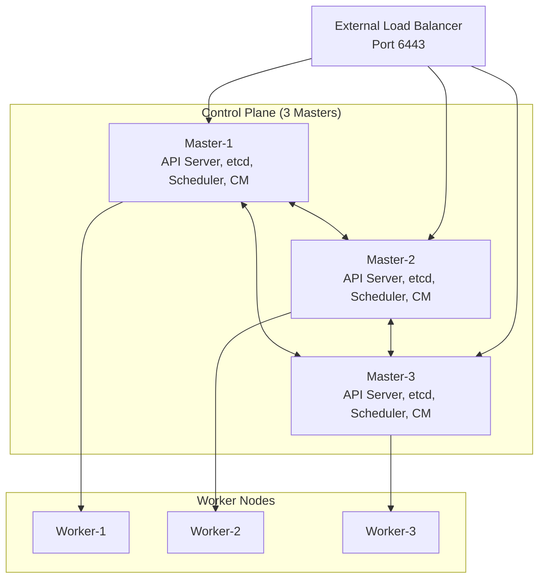

# 5.2.1 HA Cluster Architecture and Multi-Master: Keeping the Control Plane Alive

#### Why High Availability Matters

A single control plane node is a single point of failure. If the master node fails:

* **kubectl commands stop working** – Can't deploy, scale, or manage the cluster

* **Autoscaling stops** – HPA can't read metrics

* **Scheduling stops** – New pods can't be placed

* **Existing pods continue running** – Workers operate independently

This note covers HA architecture and multi-master setup. Note 5.2.2 covers etcd backup/restore; note 5.2.3 is the subchapter review.

**Backlinks:** [Module 2 - Load Balancing](../../2-Networking/Subchapter_2.4/2.4.1_DNS_and_DHCP.md) (Layer 4 LB for API servers) | [5.1.1 - Architecture](../Subchapter_5.1/5.1.1_K8s_Architecture_Components.md) (etcd) | [5.1.2 - Cluster Setup](../Subchapter_5.1/5.1.2_Cluster_Setup_kubeadm_Kind_Multi_Node.md) (kubeadm)

***

## Part 1: HA Architecture Options



### Stacked etcd vs External etcd

| Architecture      | Description                                      | Pros                                  | Cons                                    |
| ----------------- | ------------------------------------------------ | ------------------------------------- | --------------------------------------- |
| **Stacked etcd**  | etcd runs on same nodes as API server            | Simpler setup, fewer nodes            | Control plane and etcd share resources  |
| **External etcd** | Dedicated etcd cluster separate from API servers | Better isolation, independent scaling | More complex, requires additional nodes |

**Stacked etcd (recommended for most HA deployments):**

* 3 or 5 control plane nodes

* Each node runs API Server + etcd

* Quorum requires majority (2/3 or 3/5)

**External etcd (for large-scale or separate management):**

* 3 or 5 dedicated etcd nodes

* 2 or more API server nodes

* Can scale API servers independently

***

## Part 2: Load Balancer Configuration

A load balancer distributes traffic to all healthy API servers. Common options: HAProxy, Nginx, cloud L4 load balancers (AWS NLB, GCP Internal LB).

### HAProxy Configuration (Layer 4)

```haproxy
# /etc/haproxy/haproxy.cfg

global
    log /dev/log local0
    maxconn 4096

defaults
    mode tcp
    timeout connect 5s
    timeout client 30s
    timeout server 30s

frontend kubernetes-api
    bind *:6443
    default_backend kubernetes-masters

backend kubernetes-masters
    balance roundrobin
    option tcp-check
    server master-1 10.0.0.10:6443 check fall 3 rise 2
    server master-2 10.0.0.11:6443 check fall 3 rise 2
    server master-3 10.0.0.12:6443 check fall 3 rise 2
```

```bash
# Reload HAProxy
sudo systemctl restart haproxy
```

### Keepalived for Virtual IP (VIP)

If you don't have a dedicated load balancer, use Keepalived to provide a floating IP.

```bash
# Install keepalived on all master nodes
sudo apt install keepalived

# /etc/keepalived/keepalived.conf (on master-1)
vrrp_instance VI_1 {
    state MASTER
    interface eth0
    virtual_router_id 51
    priority 101
    advert_int 1
    authentication {
        auth_type PASS
        auth_pass secretpassword
    }
    virtual_ipaddress {
        10.0.0.100/24
    }
}
```

***

## Part 3: kubeadm HA Setup (Stacked etcd)

### Prerequisites

* 3 control plane nodes (master-1, master-2, master-3)

* Load balancer IP/name (e.g., `lb.example.com:6443`)

* All nodes have kubeadm, kubelet, kubectl installed (from 5.1.2)

### Step 1: Initialize First Master

```bash
# On master-1
sudo kubeadm init \
  --control-plane-endpoint "lb.example.com:6443" \
  --upload-certs \
  --pod-network-cidr=10.244.0.0/16

# Output includes:
# - join command for additional masters (with --control-plane)
# - join command for workers (without --control-plane)
# - certificate key for control plane join

# Save the output! You'll need:
# - certificate-key (for additional masters)
# - discovery-token-ca-cert-hash
```

### Step 2: Configure kubectl on First Master

```bash
mkdir -p $HOME/.kube
sudo cp -i /etc/kubernetes/admin.conf $HOME/.kube/config
sudo chown $(id -u):$(id -g) $HOME/.kube/config
```

### Step 3: Join Additional Master Nodes

```bash
# On master-2 and master-3
sudo kubeadm join lb.example.com:6443 \
  --token <token> \
  --discovery-token-ca-cert-hash sha256:<hash> \
  --control-plane \
  --certificate-key <certificate-key>
```

### Step 4: Install CNI (After All Masters Joined)

```bash
# On any master node (only once)
kubectl apply -f https://raw.githubusercontent.com/projectcalico/calico/v3.27/manifests/calico.yaml
```

### Step 5: Join Worker Nodes

```bash
# On each worker node
sudo kubeadm join lb.example.com:6443 \
  --token <token> \
  --discovery-token-ca-cert-hash sha256:<hash>
```

### Step 6: Verify HA Setup

```bash
# Check all nodes
kubectl get nodes
# NAME       STATUS   ROLES           AGE
# master-1   Ready    control-plane   10m
# master-2   Ready    control-plane   5m
# master-3   Ready    control-plane   5m
# worker-1   Ready    <none>          2m
# worker-2   Ready    <none>          2m

# Check control plane pods (should be on all masters)
kubectl get pods -n kube-system -o wide | grep -E "kube-apiserver|etcd"

# Test API server failover
# Shut down master-1, kubectl commands should still work
```

***

## Part 4: Control Plane Component Replication

### API Server (Stateless)

* Multiple API servers run behind load balancer

* Each API server is independent (stateless)

* All API servers read/write to the same etcd cluster

### etcd (Distributed Consensus)

* Uses Raft consensus algorithm

* Requires majority (quorum) to function

* 3-node cluster: can tolerate 1 failure

* 5-node cluster: can tolerate 2 failures

```bash
# Check etcd cluster health
kubectl get pods -n kube-system | grep etcd

# On any master, check etcd member list
ETCDCTL_API=3 etcdctl \
  --cacert=/etc/kubernetes/pki/etcd/ca.crt \
  --cert=/etc/kubernetes/pki/etcd/server.crt \
  --key=/etc/kubernetes/pki/etcd/server.key \
  member list
```

### Scheduler and Controller Manager (Leader Election)

* Only one active instance at a time

* Others are standby (--leader-elect=true)

* On leader failure, another takes over

```bash
# Check leader election status
kubectl get lease -n kube-system
# kube-scheduler       10s
# kube-controller-manager   10s
```

***

## Part 5: Node Taints for Control Plane

By default, control plane nodes have a taint preventing regular pods from scheduling.

```bash
# Check control plane taint
kubectl describe node master-1 | grep Taints
# Taints: node-role.kubernetes.io/control-plane:NoSchedule

# To allow regular pods (not recommended for production)
kubectl taint nodes --all node-role.kubernetes.io/control-plane-
```

**Why this taint exists:** Control plane components are critical; regular pods should run on worker nodes.

***

## Part 6: Pod Disruption Budgets (PDB)

PDBs protect HA applications during voluntary disruptions (node drains, cluster upgrades).

```yaml
# pdb.yaml
apiVersion: policy/v1
kind: PodDisruptionBudget
metadata:
  name: app-pdb
spec:
  minAvailable: 2
  selector:
    matchLabels:
      app: myapp
```

```bash
kubectl apply -f pdb.yaml
kubectl get pdb
# NAME      MIN AVAILABLE   MAX UNAVAILABLE   ALLOWED DISRUPTIONS   AGE
# app-pdb   2               N/A               1                      10s
```

**PDB policies:**

* `minAvailable`: Minimum number of pods that must remain running

* `maxUnavailable`: Maximum number of pods that can be unavailable

**Use during node drains:**

```bash
# Drain node while respecting PDBs
kubectl drain worker-1 --ignore-daemonsets --delete-emptydir-data

# If PDB prevents drain, command will block until pods are rescheduled
```

***

## Part 7: Testing HA Failover

### Simulate API Server Failure

```bash
# On master-1, stop kubelet (or stop API server container)
sudo systemctl stop kubelet

# On client machine, verify kubectl still works
kubectl get nodes
# Should still work (traffic goes to other masters)

# Restart master-1
sudo systemctl start kubelet
```

### Simulate etcd Failure

```bash
# On master-1, stop etcd
sudo mv /etc/kubernetes/manifests/etcd.yaml /tmp/

# Check etcd members (on another master)
ETCDCTL_API=3 etcdctl member list
# One member will show as unreachable

# Cluster should still function (2/3 = quorum)

# Restore etcd
sudo mv /tmp/etcd.yaml /etc/kubernetes/manifests/
```

### Simulate Control Plane Node Failure

```bash
# Shutdown master-1 completely
sudo poweroff

# Control plane should still function with 2/3 masters
kubectl get nodes
# master-1 shows NotReady, but other masters handle requests

# New pods can still be scheduled
kubectl create deployment test --image=nginx
```

***

## Part 8: Backup and Restore (Preview – Full details in 5.2.2)

```bash
# Backup etcd (on any master)
sudo ETCDCTL_API=3 etcdctl snapshot save /tmp/snapshot.db \
  --cacert=/etc/kubernetes/pki/etcd/ca.crt \
  --cert=/etc/kubernetes/pki/etcd/server.crt \
  --key=/etc/kubernetes/pki/etcd/server.key

# Restore on new master
sudo ETCDCTL_API=3 etcdctl snapshot restore /tmp/snapshot.db \
  --data-dir=/var/lib/etcd-restored
```

***

## Quick Task: Understand HA Requirements

*Design a HA cluster for a production environment.*

**Requirements:**

* 99.9% uptime (less than 8.76 hours downtime per year)

* Can tolerate 1 master failure

* Can tolerate 2 worker node failures

**Questions:**

1. How many master nodes do you need?
2. How many worker nodes do you need?
3. What components need a load balancer?
4. What happens if the load balancer fails?

> **Ready Solution:**
>
> 1. **3 master nodes** – With 3 masters, you can tolerate 1 failure (quorum = 2). With 2 masters, losing 1 would lose quorum (1/2 not majority).
>
> 2. **At least 3 worker nodes** – To tolerate 2 failures, you need at least 3 workers. For better resilience, use more workers and spread pods across availability zones.
>
> 3. **Load balancer needed for:** API Server port 6443 (allows kubectl to reach any master).
>
> 4. **If load balancer fails:**
>
>    * kubectl commands stop working
>
>    * Existing pods continue running
>
>    * Solution: Use HAProxy + Keepalived (VIP failover) or cloud L4 load balancer with health checks

***

## Summary Table: HA Components

| Component              | HA Strategy                       | Failure Tolerance        |
| ---------------------- | --------------------------------- | ------------------------ |
| **API Server**         | Multiple replicas + load balancer | All but one can fail     |
| **etcd**               | Raft consensus (odd number)       | (N-1)/2 failures         |
| **Scheduler**          | Leader election                   | Active-standby           |
| **Controller Manager** | Leader election                   | Active-standby           |
| **Worker Nodes**       | Pod replicas across nodes         | Depends on replica count |

### kubeadm HA Commands

| Command                                     | Purpose                         |
| ------------------------------------------- | ------------------------------- |
| `kubeadm init --control-plane-endpoint`     | HA init with load balancer      |
| `kubeadm init --upload-certs`               | Upload certificates for HA join |
| `kubeadm join --control-plane`              | Join additional master          |
| `kubeadm token create --print-join-command` | Generate join token             |

### Control Plane Taints

| Taint                                              | Effect                             | Purpose                     |
| -------------------------------------------------- | ---------------------------------- | --------------------------- |
| `node-role.kubernetes.io/control-plane:NoSchedule` | No pods scheduled on control plane | Protect critical components |
| `node.kubernetes.io/disk-pressure:NoSchedule`      | Node disk full                     | Prevent new pods            |
| `node.kubernetes.io/memory-pressure:NoSchedule`    | Node memory low                    | Prevent new pods            |

***

**Next note (5.2.2)** will cover **etcd Backup, Restore, and Disaster Recovery** – snapshot creation, restoration procedures, and etcd cluster health management.

**Backlinks:** [5.1.1 - Architecture](../Subchapter_5.1/5.1.1_K8s_Architecture_Components.md) (etcd) | [5.1.2 - kubeadm](../Subchapter_5.1/5.1.2_Cluster_Setup_kubeadm_Kind_Multi_Node.md) | [Module 2 - Load Balancing](../../2-Networking/Subchapter_2.4/2.4.1_DNS_and_DHCP.md)
