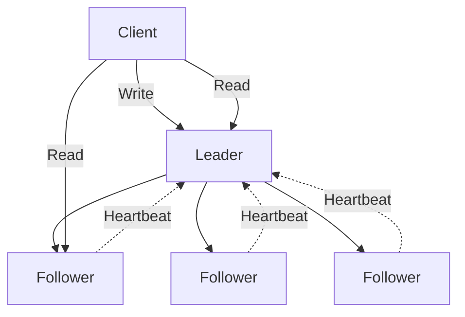

# 5.2.2 etcd Backup, Restore, and Disaster Recovery: Protecting Cluster State

#### Why etcd Backup Matters

etcd stores **everything** in a Kubernetes cluster:

* All API objects (pods, deployments, services, configmaps, secrets)

* Cluster state (node registration, scheduling decisions)

* RBAC configurations

* Custom Resource Definitions (CRDs) and instances

**Without etcd backup:**

* Corrupted etcd = **complete cluster loss**

* No way to recover cluster state

* Must rebuild from scratch

This note covers etcd backup/restore. Note 5.2.1 covered HA architecture; note 5.2.3 is the subchapter review.

**Backward references:** etcd from 5.1.1 (distributed key-value store); kubeadm from 5.1.2; Linux filesystem from Module 1 (backup storage location).

***

## Part 1: etcd Architecture Review

### Raft Consensus



**Key concepts:**

* **Leader** – Handles all client writes (only one)

* **Followers** – Replicate log, handle reads (can be multiple)

* **Quorum** – Majority of nodes must agree (N/2 + 1)

  * 3 nodes: quorum = 2

  * 5 nodes: quorum = 3

* **Term** – Logical time, increases on leader election

### etcd Data Directory

```bash
# Default etcd data directory (kubeadm)
/var/lib/etcd/member/

# Structure
/var/lib/etcd/member/
├── snap/
│   └── db          # Snapshot database file
├── wal/
│   └── *.wal       # Write-ahead logs
```

***

## Part 2: etcd Snapshot Backup

### Prerequisites – etcdctl

```bash
# Install etcdctl (if not present)
sudo apt install etcd-client  # Debian/Ubuntu
sudo dnf install etcd         # RHEL/Rocky

# Or download binary
wget https://github.com/etcd-io/etcd/releases/download/v3.5.10/etcd-v3.5.10-linux-amd64.tar.gz
tar xzf etcd-v3.5.10-linux-amd64.tar.gz
sudo mv etcd-v3.5.10-linux-amd64/etcdctl /usr/local/bin/
```

### Find etcd Certificates (kubeadm)

```bash
# Certificate locations (kubeadm)
ls /etc/kubernetes/pki/etcd/
# ca.crt  ca.key  healthcheck-client.crt  healthcheck-client.key  peer.crt  peer.key  server.crt  server.key

# Environment variables for etcdctl
export ETCDCTL_API=3
export ETCDCTL_CACERT=/etc/kubernetes/pki/etcd/ca.crt
export ETCDCTL_CERT=/etc/kubernetes/pki/etcd/server.crt
export ETCDCTL_KEY=/etc/kubernetes/pki/etcd/server.key

# Or use flags directly
ETCDCTL_API=3 etcdctl \
  --cacert=/etc/kubernetes/pki/etcd/ca.crt \
  --cert=/etc/kubernetes/pki/etcd/server.crt \
  --key=/etc/kubernetes/pki/etcd/server.key \
  endpoint status
```

### Create Snapshot Backup

```bash
# Basic snapshot
sudo ETCDCTL_API=3 etcdctl snapshot save /tmp/etcd-snapshot.db \
  --cacert=/etc/kubernetes/pki/etcd/ca.crt \
  --cert=/etc/kubernetes/pki/etcd/server.crt \
  --key=/etc/kubernetes/pki/etcd/server.key

# Snapshot with timestamp
sudo ETCDCTL_API=3 etcdctl snapshot save /backup/etcd/etcd-$(date +%Y%m%d-%H%M%S).db \
  --cacert=/etc/kubernetes/pki/etcd/ca.crt \
  --cert=/etc/kubernetes/pki/etcd/server.crt \
  --key=/etc/kubernetes/pki/etcd/server.key

# Verify snapshot
sudo ETCDCTL_API=3 etcdctl snapshot status /tmp/etcd-snapshot.db
# Output: db size, version, raft index, raft term
```

### Snapshot Status Output

```bash
etcdctl snapshot status /tmp/etcd-snapshot.db -w table
# +----------+----------+------------+------------+
# |   HASH   | REVISION | TOTAL KEYS | TOTAL SIZE |
# +----------+----------+------------+------------+
# | 1a2b3c4d |    12345 |       1250 |     12 MB  |
# +----------+----------+------------+------------+
```

### Backup Script with Rotation

```bash
#!/bin/bash
# etcd-backup.sh

BACKUP_DIR="/backup/etcd"
RETENTION_DAYS=7
TIMESTAMP=$(date +%Y%m%d-%H%M%S)

# Create backup directory
mkdir -p $BACKUP_DIR

# Backup etcd
ETCDCTL_API=3 etcdctl snapshot save ${BACKUP_DIR}/etcd-${TIMESTAMP}.db \
  --cacert=/etc/kubernetes/pki/etcd/ca.crt \
  --cert=/etc/kubernetes/pki/etcd/server.crt \
  --key=/etc/kubernetes/pki/etcd/server.key

# Verify backup
ETCDCTL_API=3 etcdctl snapshot status ${BACKUP_DIR}/etcd-${TIMESTAMP}.db

# Remove old backups
find $BACKUP_DIR -name "etcd-*.db" -mtime +$RETENTION_DAYS -delete

echo "Backup completed: ${BACKUP_DIR}/etcd-${TIMESTAMP}.db"
```

### Automated Backup with Cron

```bash
# Add to crontab (runs daily at 2 AM)
sudo crontab -e
0 2 * * * /usr/local/bin/etcd-backup.sh

# Or as systemd timer (from Module 1)
cat > /etc/systemd/system/etcd-backup.service << EOF
[Unit]
Description=etcd backup
[Service]
Type=oneshot
ExecStart=/usr/local/bin/etcd-backup.sh
EOF

cat > /etc/systemd/system/etcd-backup.timer << EOF
[Timer]
OnCalendar=daily
Persistent=true
[Install]
WantedBy=timers.target
EOF

systemctl enable etcd-backup.timer
systemctl start etcd-backup.timer
```

***

## Part 3: etcd Snapshot Restore

### Restore on Same Node

```bash
# 1. Stop kubelet and etcd
sudo systemctl stop kubelet
sudo mv /etc/kubernetes/manifests/etcd.yaml /tmp/  # Stop etcd static pod

# 2. Verify etcd is stopped
sudo crictl ps | grep etcd  # Should be empty

# 3. Restore snapshot to new data directory
sudo ETCDCTL_API=3 etcdctl snapshot restore /backup/etcd/etcd-20240116-020000.db \
  --data-dir=/var/lib/etcd-restored

# 4. Replace etcd data directory
sudo mv /var/lib/etcd /var/lib/etcd.bak
sudo mv /var/lib/etcd-restored /var/lib/etcd

# 5. Restore etcd manifest
sudo mv /tmp/etcd.yaml /etc/kubernetes/manifests/

# 6. Wait for etcd to start
sudo crictl ps | grep etcd

# 7. Restart kubelet
sudo systemctl start kubelet

# 8. Verify cluster
kubectl get nodes
kubectl get pods -A
```

### Restore on New Node (Disaster Recovery)

**Scenario:** All etcd nodes lost, but you have a snapshot.

```bash
# On new node with same IP as original master
# 1. Install kubeadm, kubelet, kubectl (same version)

# 2. Create etcd data directory from snapshot
sudo ETCDCTL_API=3 etcdctl snapshot restore /backup/etcd-snapshot.db \
  --data-dir=/var/lib/etcd \
  --initial-cluster=master-1=https://<master-1-ip>:2380 \
  --initial-cluster-token=etcd-cluster \
  --initial-advertise-peer-urls=https://<master-1-ip>:2380

# 3. Create kubeadm configuration
cat > kubeadm-config.yaml << EOF
apiVersion: kubeadm.k8s.io/v1beta3
kind: ClusterConfiguration
kubernetesVersion: v1.29.0
etcd:
  local:
    dataDir: /var/lib/etcd
    extraArgs:
      initial-cluster-state: existing
EOF

# 4. Initialize control plane (recover)
sudo kubeadm init --config=kubeadm-config.yaml --skip-phases=preflight

# 5. Restore kubeconfig
mkdir -p $HOME/.kube
sudo cp -i /etc/kubernetes/admin.conf $HOME/.kube/config
sudo chown $(id -u):$(id -g) $HOME/.kube/config
```

***

## Part 4: etcd Cluster Health Monitoring

### Check Member Status

```bash
# List members
sudo ETCDCTL_API=3 etcdctl member list
# 1a2b3c4d5e6f7g8h, started, master-1, https://10.0.0.10:2380, https://10.0.0.10:2379, false

# Check endpoint health
sudo ETCDCTL_API=3 etcdctl endpoint health
# https://127.0.0.1:2379 is healthy: successfully committed proposal: took = 2.345ms

# Check endpoint status (Raft info)
sudo ETCDCTL_API=3 etcdctl endpoint status
# https://127.0.0.1:2379, 1a2b3c4d5e6f7g8h, 3.5.10, 12345, 12 MB, false, 3, 12345
```

### etcd Metrics (Prometheus)

```bash
# etcd exposes metrics on port 2379/metrics
curl -k https://localhost:2379/metrics | grep -E "etcd_server_leader|etcd_server_health"

# Important metrics:
# etcd_server_leader_changes_seen_total – Leader changes (high = instability)
# etcd_server_proposals_failed_total – Failed proposals (network/disk issues)
# etcd_server_health_failures – Health check failures
# etcd_disk_backend_commit_duration_seconds – Disk I/O latency
```

### etcd Alarm Management

```bash
# Check for alarms (NOSPACE, CORRUPT)
sudo ETCDCTL_API=3 etcdctl alarm list

# Clear alarms (after fixing cause)
sudo ETCDCTL_API=3 etcdctl alarm disarm
```

***

## Part 5: Disaster Scenarios and Recovery

### Scenario 1: Single etcd Member Failure (3-node cluster)

**Symptom:** One etcd pod not running, `member list` shows unreachable

**Impact:** Cluster still functional (quorum = 2/3)

**Recovery:**

```bash
# On the failed master
sudo systemctl restart kubelet

# If etcd won't start, check logs
sudo crictl logs <etcd-container-id>

# Common fixes:
# - Check disk space: df -h /var/lib/etcd
# - Check certificate expiry
# - Restore from snapshot if corrupted
```

### Scenario 2: Multiple etcd Members Failure (Quorum Lost)

**Symptom:** `kubectl` commands fail, etcd health checks fail

**Impact:** Cluster dead – no writes, no reads possible

**Recovery:** Restore from snapshot on a single node

```bash
# On any remaining node (or new node)
# 1. Stop kubelet and etcd
systemctl stop kubelet
mv /etc/kubernetes/manifests/etcd.yaml /tmp/

# 2. Restore snapshot
ETCDCTL_API=3 etcdctl snapshot restore /backup/etcd-snapshot.db \
  --data-dir=/var/lib/etcd

# 3. Start etcd as standalone
# Edit etcd.yaml to remove --initial-cluster flags
# Add --force-new-cluster flag

# 4. Restart kubelet
systemctl start kubelet

# 5. Re-add other masters
etcdctl member add master-2 --peer-urls=https://10.0.0.11:2380
```

### Scenario 3: Corrupted etcd (Data Corruption)

**Symptom:** `etcdctl` returns errors, API server fails to start

**Recovery:** Restore from latest snapshot

```bash
# 1. Stop all control plane components
systemctl stop kubelet
mv /etc/kubernetes/manifests /etc/kubernetes/manifests.bak

# 2. Restore snapshot
ETCDCTL_API=3 etcdctl snapshot restore /backup/latest.db --data-dir=/var/lib/etcd

# 3. Restart control plane
mv /etc/kubernetes/manifests.bak /etc/kubernetes/manifests
systemctl start kubelet
```

### Scenario 4: etcd Database Full (NOSPACE Alarm)

**Symptom:** `etcdctl alarm list` shows `NOSPACE`, writes failing

**Cause:** etcd database size exceeded quota (default 2GB for embedded etcd)

**Recovery:**

```bash
# 1. Check current size
ETCDCTL_API=3 etcdctl endpoint status

# 2. Compact old revisions
ETCDCTL_API=3 etcdctl compact $(ETCDCTL_API=3 etcdctl endpoint status --write-out="json" | jq '.[0].Status.header.revision')

# 3. Defragment
ETCDCTL_API=3 etcdctl defrag

# 4. Disarm alarm
ETCDCTL_API=3 etcdctl alarm disarm

# 5. Increase quota (if needed) in etcd.yaml
# --quota-backend-bytes=8589934592  # 8GB
```

***

## Part 6: etcd Performance Tuning

### Disk I/O Requirements

etcd is extremely sensitive to disk latency. **SSD is required** for production.

```bash
# Test disk performance (fio)
fio --rw=write --ioengine=sync --fdatasync=1 --filename=test --size=10m --bs=1k --name=test

# etcd requires:
# - Write latency < 10ms (99th percentile)
# - fsync latency < 10ms
```

### etcd Configuration Parameters

```yaml
# /etc/kubernetes/manifests/etcd.yaml (kubeadm)
spec:
  containers:
  - command:
    - etcd
    - --quota-backend-bytes=8589934592   # 8GB (default 2GB)
    - --auto-compaction-retention=1000   # Keep 1000 revisions
    - --auto-compaction-mode=revision
    - --heartbeat-interval=100           # ms
    - --election-timeout=1000            # ms
```

### Monitoring etcd Size

```bash
# Check database size
ETCDCTL_API=3 etcdctl endpoint status | awk '{print $5}'

# Check revision count (how many changes)
ETCDCTL_API=3 etcdctl endpoint status | awk '{print $4}'

# Compaction (remove old revisions)
ETCDCTL_API=3 etcdctl compact 5000

# Defrag after compaction
ETCDCTL_API=3 etcdctl defrag
```

***

## Part 7: etcdctl Command Reference

| Command                              | Purpose                               |
| ------------------------------------ | ------------------------------------- |
| `etcdctl snapshot save file.db`      | Create snapshot                       |
| `etcdctl snapshot restore file.db`   | Restore snapshot                      |
| `etcdctl snapshot status file.db`    | Show snapshot info                    |
| `etcdctl member list`                | List cluster members                  |
| `etcdctl endpoint health`            | Check member health                   |
| `etcdctl endpoint status`            | Show member status (Raft index, size) |
| `etcdctl alarm list`                 | List alarms                           |
| `etcdctl alarm disarm`               | Clear alarms                          |
| `etcdctl compact N`                  | Compact etcd history                  |
| `etcdctl defrag`                     | Defragment database                   |
| `etcdctl get / --prefix --keys-only` | List all keys (debug)                 |

### Environment Variables for etcdctl

| Variable            | Purpose                          |
| ------------------- | -------------------------------- |
| `ETCDCTL_API=3`     | Use API version 3                |
| `ETCDCTL_CACERT`    | CA certificate path              |
| `ETCDCTL_CERT`      | Client certificate path          |
| `ETCDCTL_KEY`       | Client key path                  |
| `ETCDCTL_ENDPOINTS` | etcd endpoints (comma-separated) |

***

## Quick Task: etcd Backup Practice

*If you have a cluster, practice etcd backup and restore.*

1. Create an etcd snapshot.
2. Verify the snapshot with `snapshot status`.
3. Create a test resource (e.g., `kubectl create ns test-backup`).
4. Stop kubelet and etcd, restore from snapshot.
5. Verify that the test namespace is gone (snapshot before creation).

> **Ready Solution:**
>
> ```bash
> # Task 1-2 (on control plane)
> sudo ETCDCTL_API=3 etcdctl snapshot save /tmp/etcd-test.db \
>   --cacert=/etc/kubernetes/pki/etcd/ca.crt \
>   --cert=/etc/kubernetes/pki/etcd/server.crt \
>   --key=/etc/kubernetes/pki/etcd/server.key
>
> sudo ETCDCTL_API=3 etcdctl snapshot status /tmp/etcd-test.db
>
> # Task 3
> kubectl create ns test-backup
>
> # Task 4 (restore)
> sudo systemctl stop kubelet
> sudo mv /etc/kubernetes/manifests/etcd.yaml /tmp/
> sudo ETCDCTL_API=3 etcdctl snapshot restore /tmp/etcd-test.db \
>   --data-dir=/var/lib/etcd-restored
> sudo rm -rf /var/lib/etcd
> sudo mv /var/lib/etcd-restored /var/lib/etcd
> sudo mv /tmp/etcd.yaml /etc/kubernetes/manifests/
> sudo systemctl start kubelet
>
> # Task 5
> kubectl get ns test-backup
> # Should show: Error from server (NotFound): namespaces "test-backup" not found
> ```

***

## Summary Table: etcd Operations

| Operation   | Command                                                             |
| ----------- | ------------------------------------------------------------------- |
| **Backup**  | `etcdctl snapshot save /path/backup.db`                             |
| **Restore** | `etcdctl snapshot restore /path/backup.db --data-dir=/var/lib/etcd` |
| **Verify**  | `etcdctl snapshot status /path/backup.db`                           |
| **Health**  | `etcdctl endpoint health`                                           |
| **Members** | `etcdctl member list`                                               |
| **Alarms**  | `etcdctl alarm list`                                                |
| **Defrag**  | `etcdctl defrag`                                                    |

### etcd Cluster Requirements

| Nodes | Quorum | Failure Tolerance | Production     |
| ----- | ------ | ----------------- | -------------- |
| 1     | 1      | 0                 | No             |
| 3     | 2      | 1                 | Yes (minimum)  |
| 5     | 3      | 2                 | Yes (better)   |
| 7     | 4      | 3                 | Yes (overkill) |

### etcd Backup Best Practices

| Practice                    | Why                   |
| --------------------------- | --------------------- |
| **Backup daily**            | Minimize data loss    |
| **Store off-cluster**       | Survive cluster loss  |
| **Test restores regularly** | Verify backups work   |
| **Monitor snapshot size**   | Detect leaks/growth   |
| **Automate rotation**       | Avoid disk full       |
| **Secure backups**          | etcd contains secrets |

***

**Next note (5.2.3)** will be the Subchapter Review for High Availability and etcd Management, including a cheatsheet and scenario-based interview questions.

**Backward references:**

* etcd from 5.1.1 (architecture)

* kubeadm HA from 5.2.1 (multi-master setup)

* Linux filesystem from Module 1 (backup storage)

* Cron from Module 1 (automated backups)
