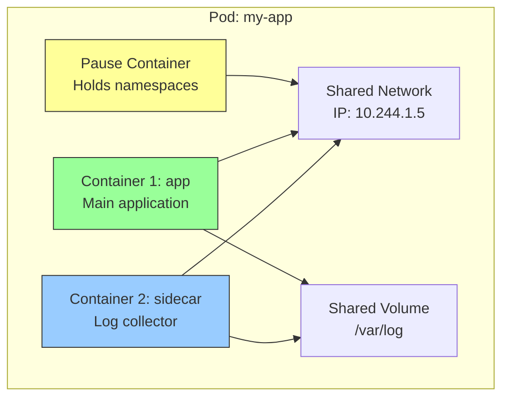
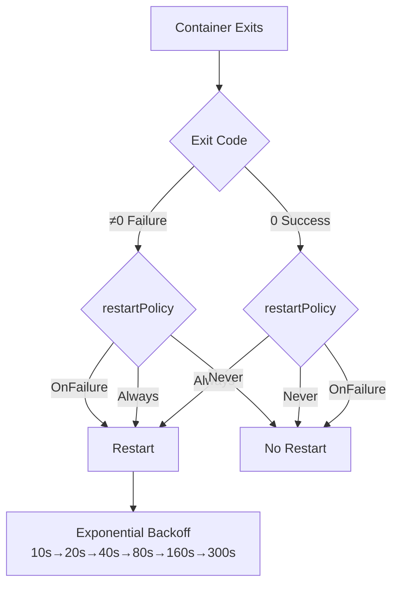
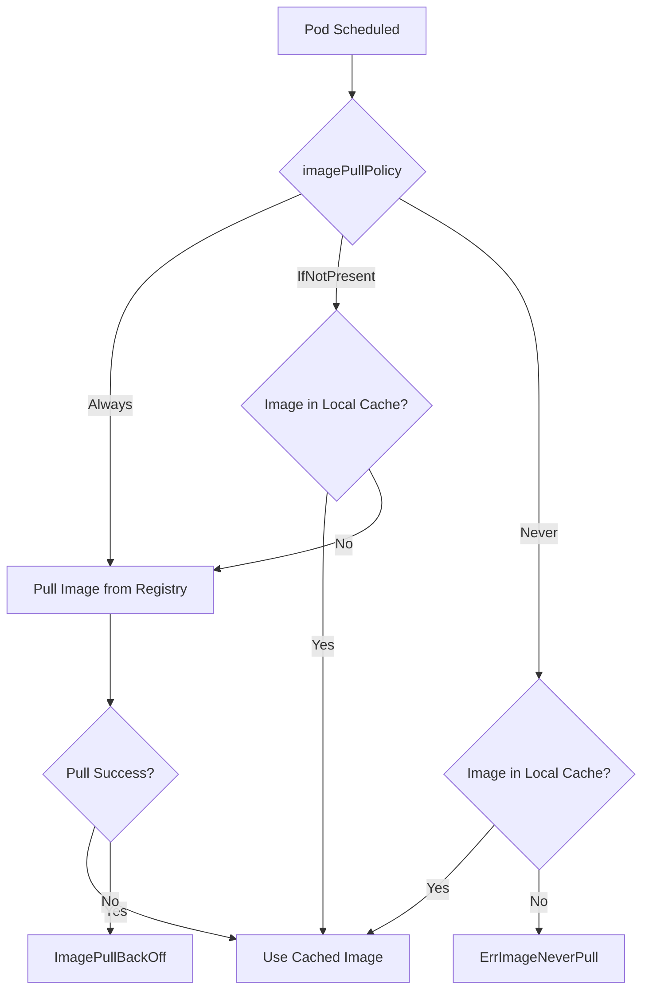
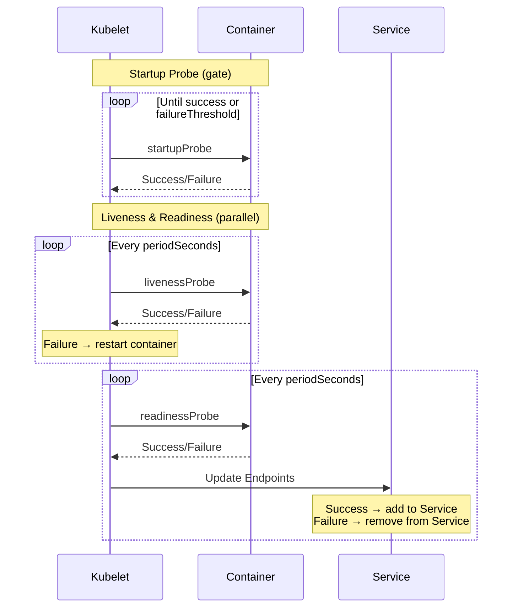
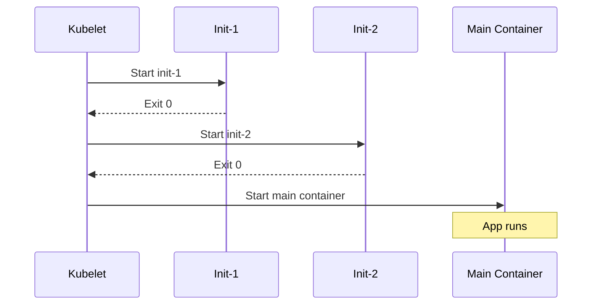
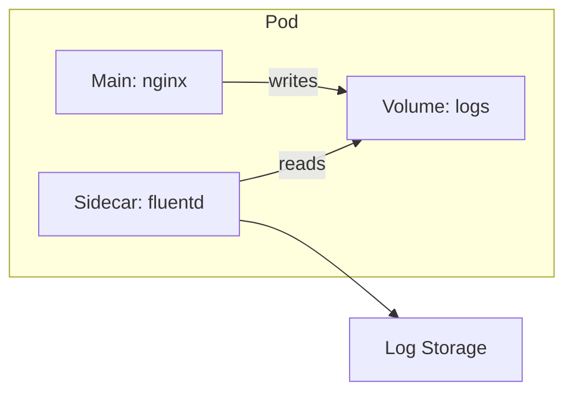
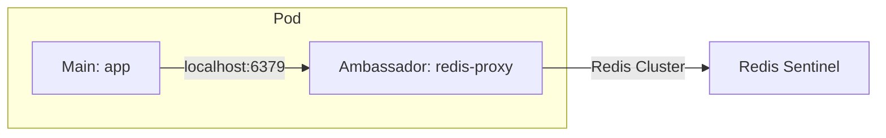
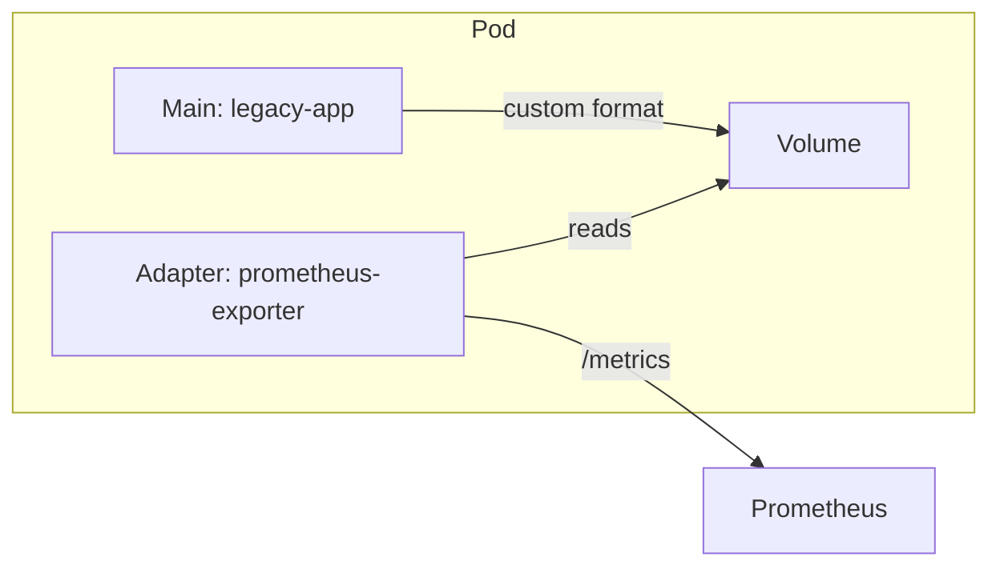
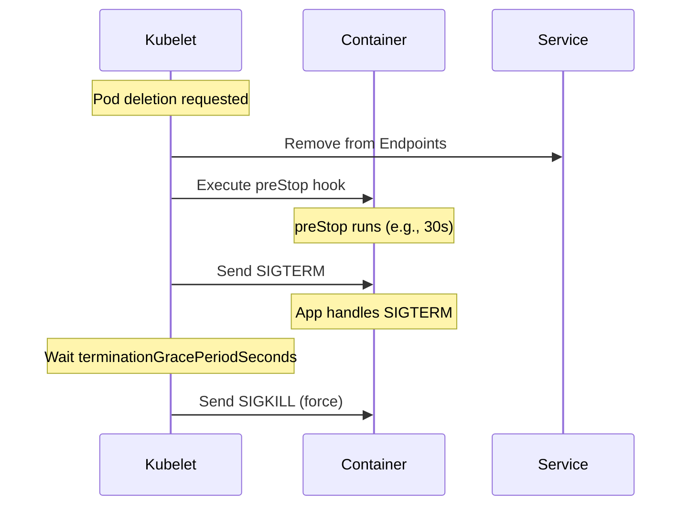

# 5.3.1 Pod Fundamentals and Lifecycle: The Atomic Unit of Kubernetes

#### Why Pods Matter

A **Pod** is the smallest deployable unit in Kubernetes – not a container. A Pod can contain one or more containers that share:

* **Network namespace** – Same IP address, communicate via localhost
* **IPC namespace** – Shared memory, semaphores
* **Volume mounts** – Shared storage

Understanding Pods deeply is essential for CKAD certification and real-world debugging.

This note covers Pod specifications, lifecycle, probes, and multi-container patterns. Note 5.3.2 covers Controllers (Deployments, StatefulSets, DaemonSets); note 5.3.3 covers Scheduling; note 5.3.4 is the subchapter review.

**Backlinks:** [5.1.1 - Architecture](../Subchapter_5.1/5.1.1_K8s_Architecture_Components.md) | [Module 4 - Docker](../../4-Docker/Subchapter_4.1/4.1.1_Namespaces_and_Cgroups.md) | [5.5.1 - Volumes](../Subchapter_5.5/5.5.1_Ephemeral_Volumes_emptydir_hostPath.md)

---

## Part 1: Pod Architecture



### Pod vs Container

| Aspect | Container | Pod |
|--------|-----------|-----|
| **Scheduling unit** | No | Yes |
| **IP address** | Shares with pod | Unique per pod |
| **Restart** | By kubelet | Pod may be replaced |
| **Storage** | Per container | Shared volumes |
| **Lifecycle** | Container lifecycle | Pod lifecycle |

---

## Part 2: Pod Specification Deep Dive

### Complete Pod YAML

```yaml
# pod-complete.yaml
apiVersion: v1
kind: Pod
metadata:
  name: complete-pod
  namespace: default
  labels:
    app: myapp
    version: v1
    tier: frontend
  annotations:
    prometheus.io/scrape: "true"
    prometheus.io/port: "8080"
    description: "Complete pod example"
spec:
  # === SCHEDULING ===
  nodeName: worker-1                    # Direct node assignment (skip scheduler)
  nodeSelector:                         # Simple node selection
    disktype: ssd
  
  # === SERVICE ACCOUNT ===
  serviceAccountName: myapp-sa
  automountServiceAccountToken: true
  
  # === DNS ===
  dnsPolicy: ClusterFirst               # ClusterFirst | Default | ClusterFirstWithHostNet | None
  dnsConfig:
    nameservers:
    - 8.8.8.8
    searches:
    - myns.svc.cluster.local
  hostname: myhost
  subdomain: mysubdomain
  
  # === SECURITY ===
  securityContext:
    runAsUser: 1000
    runAsGroup: 3000
    fsGroup: 2000
    runAsNonRoot: true
  
  # === RESTART & TERMINATION ===
  restartPolicy: Always                 # Always | OnFailure | Never
  terminationGracePeriodSeconds: 30
  
  # === INIT CONTAINERS ===
  initContainers:
  - name: init-db
    image: busybox:1.35
    command: ['sh', '-c', 'until nc -z mysql 3306; do sleep 2; done']
  
  # === MAIN CONTAINERS ===
  containers:
  - name: app
    image: myapp:v1.2.3
    imagePullPolicy: IfNotPresent       # Always | IfNotPresent | Never
    
    # Command & Args
    command: ["/bin/sh"]                # Overrides ENTRYPOINT
    args: ["-c", "echo hello && sleep 3600"]  # Overrides CMD
    
    # Working directory
    workingDir: /app
    
    # Ports
    ports:
    - name: http
      containerPort: 8080
      protocol: TCP
    - name: metrics
      containerPort: 9090
    
    # Environment variables
    env:
    - name: ENV
      value: "production"
    - name: POD_NAME
      valueFrom:
        fieldRef:
          fieldPath: metadata.name
    - name: POD_IP
      valueFrom:
        fieldRef:
          fieldPath: status.podIP
    - name: NODE_NAME
      valueFrom:
        fieldRef:
          fieldPath: spec.nodeName
    - name: SECRET_PASSWORD
      valueFrom:
        secretKeyRef:
          name: app-secrets
          key: password
    - name: CONFIG_VALUE
      valueFrom:
        configMapKeyRef:
          name: app-config
          key: setting
    
    # Environment from ConfigMap/Secret
    envFrom:
    - configMapRef:
        name: app-config
    - secretRef:
        name: app-secrets
        optional: true
    
    # Resources
    resources:
      requests:
        cpu: 100m
        memory: 128Mi
      limits:
        cpu: 500m
        memory: 256Mi
    
    # Volume Mounts
    volumeMounts:
    - name: data
      mountPath: /data
    - name: config
      mountPath: /etc/config
      readOnly: true
    - name: secrets
      mountPath: /etc/secrets
      readOnly: true
    
    # Probes
    startupProbe:
      httpGet:
        path: /healthz
        port: 8080
      failureThreshold: 30
      periodSeconds: 10
    
    livenessProbe:
      httpGet:
        path: /healthz
        port: 8080
      initialDelaySeconds: 15
      periodSeconds: 10
      timeoutSeconds: 5
      failureThreshold: 3
    
    readinessProbe:
      httpGet:
        path: /ready
        port: 8080
      initialDelaySeconds: 5
      periodSeconds: 5
      successThreshold: 1
      failureThreshold: 3
    
    # Lifecycle hooks
    lifecycle:
      postStart:
        exec:
          command: ["/bin/sh", "-c", "echo started > /tmp/started"]
      preStop:
        exec:
          command: ["/bin/sh", "-c", "sleep 10"]
    
    # Security Context (container level)
    securityContext:
      allowPrivilegeEscalation: false
      readOnlyRootFilesystem: true
      capabilities:
        drop:
        - ALL
        add:
        - NET_BIND_SERVICE
  
  # === VOLUMES ===
  volumes:
  - name: data
    emptyDir: {}
  - name: config
    configMap:
      name: app-config
  - name: secrets
    secret:
      secretName: app-secrets
  
  # === IMAGE PULL SECRETS ===
  imagePullSecrets:
  - name: registry-credentials
```

---

## Part 3: Restart Policy

The `restartPolicy` determines container restart behavior.



| Policy | Container Exit 0 | Container Exit ≠0 | Use Case |
|--------|------------------|-------------------|----------|
| **Always** (default) | Restart | Restart | Long-running services |
| **OnFailure** | No restart | Restart | Jobs, batch processing |
| **Never** | No restart | No restart | Debug pods, one-shot |

```yaml
# Job uses OnFailure
apiVersion: batch/v1
kind: Job
spec:
  template:
    spec:
      restartPolicy: OnFailure  # Required for Jobs
      containers:
      - name: job
        image: busybox
        command: ["false"]  # Exit 1
```

### Backoff Timing

When a container crashes repeatedly:
1. First restart: immediate
2. Backoff sequence: 10s → 20s → 40s → 80s → 160s → 300s (max)
3. After 10 minutes of successful running, backoff resets

---

## Part 4: Image Pull Policy



| Policy | Behavior | Default When |
|--------|----------|--------------|
| **Always** | Always pull | Image tag is `:latest` or omitted |
| **IfNotPresent** | Pull if not cached | Image has specific tag (`:v1.2.3`) |
| **Never** | Never pull | Must set explicitly |

```yaml
# Best practice: Specific tags + IfNotPresent
containers:
- name: app
  image: myapp:v1.2.3          # Immutable tag
  imagePullPolicy: IfNotPresent

# Development: Always pull latest
- name: dev
  image: myapp:latest
  imagePullPolicy: Always      # Explicit for clarity
```

### Private Registry Authentication

```bash
# Create secret for private registry
kubectl create secret docker-registry regcred \
  --docker-server=registry.example.com \
  --docker-username=user \
  --docker-password=pass

# Use in pod
spec:
  imagePullSecrets:
  - name: regcred
  containers:
  - image: registry.example.com/myapp:v1
```

---

## Part 5: Container Probes

Probes determine container health and readiness.



### Probe Types

| Probe | Purpose | Failure Action |
|-------|---------|----------------|
| **startupProbe** | Wait for slow-starting apps | Block liveness/readiness |
| **livenessProbe** | Detect deadlocks/hangs | Restart container |
| **readinessProbe** | Check if ready for traffic | Remove from Service endpoints |

### Probe Methods

```yaml
# HTTP GET probe
livenessProbe:
  httpGet:
    path: /healthz
    port: 8080
    httpHeaders:
    - name: Custom-Header
      value: Awesome
  initialDelaySeconds: 15
  periodSeconds: 10
  timeoutSeconds: 5
  successThreshold: 1
  failureThreshold: 3

# TCP Socket probe
livenessProbe:
  tcpSocket:
    port: 3306
  initialDelaySeconds: 15
  periodSeconds: 10

# Exec probe
livenessProbe:
  exec:
    command:
    - cat
    - /tmp/healthy
  initialDelaySeconds: 5
  periodSeconds: 5

# gRPC probe (Kubernetes 1.24+)
livenessProbe:
  grpc:
    port: 50051
    service: health  # Optional service name
  initialDelaySeconds: 10
```

### Probe Parameters

| Parameter | Default | Description |
|-----------|---------|-------------|
| `initialDelaySeconds` | 0 | Wait before first probe |
| `periodSeconds` | 10 | Time between probes |
| `timeoutSeconds` | 1 | Probe timeout |
| `successThreshold` | 1 | Successes to be healthy |
| `failureThreshold` | 3 | Failures to be unhealthy |

### Startup Probe for Slow Apps

```yaml
# App takes up to 5 minutes to start
startupProbe:
  httpGet:
    path: /healthz
    port: 8080
  failureThreshold: 30    # 30 * 10s = 300s = 5 min
  periodSeconds: 10

livenessProbe:
  httpGet:
    path: /healthz
    port: 8080
  periodSeconds: 10
  # livenessProbe starts AFTER startupProbe succeeds
```

---

## Part 6: Init Containers

Init containers run before main containers, sequentially.



### Init Container Use Cases

| Use Case | Example |
|----------|---------|
| **Wait for dependency** | Wait for database to be ready |
| **Setup configuration** | Generate config files |
| **Database migrations** | Run schema updates |
| **Clone git repo** | Fetch application code |
| **Download secrets** | Fetch from Vault |
| **Set permissions** | chown volumes |

```yaml
# Wait for dependency + setup
apiVersion: v1
kind: Pod
metadata:
  name: myapp
spec:
  initContainers:
  # Wait for MySQL
  - name: wait-for-mysql
    image: busybox:1.35
    command: ['sh', '-c', 'until nc -z mysql 3306; do echo waiting; sleep 2; done']
  
  # Run migrations
  - name: migrate
    image: myapp:v1
    command: ['./migrate.sh']
    env:
    - name: DATABASE_URL
      valueFrom:
        secretKeyRef:
          name: db-secret
          key: url
  
  # Set permissions
  - name: fix-permissions
    image: busybox:1.35
    command: ['sh', '-c', 'chown -R 1000:1000 /data']
    volumeMounts:
    - name: data
      mountPath: /data
    securityContext:
      runAsUser: 0  # Need root to chown
  
  containers:
  - name: app
    image: myapp:v1
    volumeMounts:
    - name: data
      mountPath: /data
  
  volumes:
  - name: data
    persistentVolumeClaim:
      claimName: myapp-pvc
```

---

## Part 7: Multi-Container Patterns

### Sidecar Pattern

Sidecar extends main container functionality.



```yaml
# Log shipping sidecar
spec:
  containers:
  - name: nginx
    image: nginx
    volumeMounts:
    - name: logs
      mountPath: /var/log/nginx
  
  - name: log-shipper
    image: fluentd
    volumeMounts:
    - name: logs
      mountPath: /var/log/nginx
      readOnly: true
  
  volumes:
  - name: logs
    emptyDir: {}
```

### Ambassador Pattern

Ambassador proxies network connections.



```yaml
# Redis ambassador
spec:
  containers:
  - name: app
    image: myapp
    env:
    - name: REDIS_HOST
      value: "localhost"
  
  - name: redis-ambassador
    image: redis-ambassador:latest
    ports:
    - containerPort: 6379
```

### Adapter Pattern

Adapter transforms output format.



```yaml
# Prometheus adapter
spec:
  containers:
  - name: legacy-app
    image: legacy:v1
    volumeMounts:
    - name: metrics
      mountPath: /var/metrics
  
  - name: prometheus-adapter
    image: prom-adapter:v1
    ports:
    - containerPort: 9090
      name: metrics
    volumeMounts:
    - name: metrics
      mountPath: /var/metrics
      readOnly: true
  
  volumes:
  - name: metrics
    emptyDir: {}
```

---

## Part 8: Lifecycle Hooks

```yaml
lifecycle:
  postStart:
    exec:
      command: ["/bin/sh", "-c", "echo started"]
    # OR
    httpGet:
      path: /started
      port: 8080
  
  preStop:
    exec:
      command: ["/bin/sh", "-c", "nginx -s quit && sleep 10"]
```

| Hook | When | Use Case |
|------|------|----------|
| **postStart** | After container starts | Register with service discovery |
| **preStop** | Before container stops | Graceful shutdown, drain connections |

### Graceful Shutdown

```yaml
spec:
  terminationGracePeriodSeconds: 60  # Total time allowed
  containers:
  - name: app
    lifecycle:
      preStop:
        exec:
          command: ["/bin/sh", "-c", "sleep 30"]  # Drain connections
```



---

## Part 9: Ephemeral Containers – Debugging Without Rebuilding

Ephemeral containers (GA since Kubernetes 1.25) let you attach a debug container to a running pod **without restarting it**. This is critical for debugging distroless and minimal images that have no shell, no curl, no debugging tools.

### The Problem

```bash
# Distroless image has no shell — exec fails
kubectl exec -it myapp -- /bin/sh
# OCI runtime exec failed: exec failed: unable to start container process:
# exec: "/bin/sh": stat /bin/sh: no such file or directory

# Can't install tools — read-only filesystem
kubectl exec myapp -- apt-get install curl
# exec: "apt-get": executable file not found in $PATH
```

### Solution: kubectl debug

```bash
# Attach an ephemeral debug container to a running pod
kubectl debug -it myapp --image=busybox --target=myapp
# --target=myapp shares the process namespace with the 'myapp' container

# Inside the ephemeral container:
# - You can see processes from the target container
ps aux
# PID   USER     COMMAND
#   1   1000     /app/myapp        ← target container's process
#   8   root     /bin/sh           ← your debug shell

# - You can access the target's filesystem via /proc
cat /proc/1/root/etc/hostname
ls /proc/1/root/app/

# - Network namespace is shared — same IP, same ports
wget -qO- http://localhost:8080/healthz
curl http://localhost:8080/metrics
```

### Debug Strategies

| Strategy | Command | Use Case |
|----------|---------|----------|
| **Add debug container** | `kubectl debug -it pod --image=busybox --target=app` | Debug distroless/minimal images |
| **Copy pod with debug image** | `kubectl debug pod --copy-to=debug-pod --image=ubuntu` | Investigate without affecting production |
| **Copy pod with different command** | `kubectl debug pod --copy-to=debug-pod --container=app -- sh` | Override crash loop |
| **Node debugging** | `kubectl debug node/worker-1 -it --image=ubuntu` | Debug host-level issues |

### Copy Pod (Non-Disruptive)

```bash
# Create a copy of a crashing pod with a debug shell instead
kubectl debug myapp --copy-to=myapp-debug \
  --container=myapp \
  --image=myapp:latest \
  -- sleep 3600

# Now exec into the copy and investigate
kubectl exec -it myapp-debug -- /bin/sh
# Run the original command manually to see the error
```

### Node-Level Debugging

```bash
# Debug a node (creates a privileged pod on the node)
kubectl debug node/worker-1 -it --image=ubuntu
# Inside: host filesystem is mounted at /host
chroot /host
systemctl status kubelet
journalctl -u kubelet --since "5 minutes ago"
crictl ps
df -h
```

### Ephemeral Container Limitations

| Limitation | Detail |
|-----------|--------|
| **Cannot be removed** | Once added, ephemeral container stays until pod is deleted |
| **No probes** | Ephemeral containers don't support liveness/readiness probes |
| **No port mappings** | Cannot expose ports |
| **No restart** | If it exits, it doesn't restart |
| **Requires 1.25+** | GA in Kubernetes 1.25; alpha/beta in earlier versions |

***

## Part 10: Pod Commands Reference

```bash
# Create pod from YAML
kubectl apply -f pod.yaml

# Create pod imperatively
kubectl run nginx --image=nginx:alpine --port=80

# Create pod with command
kubectl run busybox --image=busybox --command -- sleep 3600

# Create pod with environment variables
kubectl run envpod --image=nginx --env="ENV=prod" --env="DEBUG=false"

# Create pod with resource limits
kubectl run limited --image=nginx --requests="cpu=100m,memory=128Mi" --limits="cpu=500m,memory=256Mi"

# Get pods
kubectl get pods
kubectl get pods -o wide
kubectl get pods -o yaml
kubectl get pods --show-labels
kubectl get pods -l app=nginx

# Describe pod (events, conditions)
kubectl describe pod nginx

# View logs
kubectl logs nginx
kubectl logs nginx -c sidecar        # Specific container
kubectl logs nginx --previous        # Previous container
kubectl logs nginx -f                # Follow
kubectl logs nginx --tail=100        # Last 100 lines
kubectl logs nginx --since=1h        # Last hour

# Execute in pod
kubectl exec nginx -- ls /
kubectl exec -it nginx -- /bin/sh
kubectl exec nginx -c sidecar -- cat /etc/config

# Copy files
kubectl cp nginx:/etc/nginx/nginx.conf ./nginx.conf
kubectl cp ./local-file.txt nginx:/tmp/

# Port forward
kubectl port-forward nginx 8080:80

# Delete pod
kubectl delete pod nginx
kubectl delete pod nginx --grace-period=0 --force  # Force delete

# Debug with ephemeral container (1.23+)
kubectl debug nginx -it --image=busybox --target=nginx
```

---

## Quick Task: Create a Multi-Container Pod

1. Create a pod with two containers: nginx (main) and busybox (sidecar)
2. Share a volume between them at /shared
3. Add a liveness probe for nginx
4. Verify both containers are running and can access shared volume

> **Ready Solution:**
> ```bash
> cat <<EOF | kubectl apply -f -
> apiVersion: v1
> kind: Pod
> metadata:
>   name: multi-container
> spec:
>   containers:
>   - name: nginx
>     image: nginx:alpine
>     volumeMounts:
>     - name: shared
>       mountPath: /shared
>     livenessProbe:
>       httpGet:
>         path: /
>         port: 80
>       initialDelaySeconds: 5
>       periodSeconds: 10
>   
>   - name: sidecar
>     image: busybox
>     command: ['sh', '-c', 'while true; do date >> /shared/log.txt; sleep 5; done']
>     volumeMounts:
>     - name: shared
>       mountPath: /shared
>   
>   volumes:
>   - name: shared
>     emptyDir: {}
> EOF
> 
> # Verify
> kubectl get pod multi-container
> kubectl exec multi-container -c nginx -- cat /shared/log.txt
> kubectl exec multi-container -c sidecar -- cat /shared/log.txt
> ```

---

## Summary Tables

### Pod Spec Fields

| Field | Description | Default |
|-------|-------------|---------|
| `restartPolicy` | Container restart behavior | `Always` |
| `imagePullPolicy` | When to pull image | Depends on tag |
| `terminationGracePeriodSeconds` | Shutdown timeout | 30 |
| `serviceAccountName` | ServiceAccount to use | `default` |
| `nodeName` | Direct node assignment | (scheduler chooses) |

### Probe Comparison

| Probe | Triggers | Failure Action |
|-------|----------|----------------|
| startupProbe | Gates other probes | Restart container |
| livenessProbe | After startup passes | Restart container |
| readinessProbe | After startup passes | Remove from Service |

### Container Patterns

| Pattern | Use Case | Example |
|---------|----------|---------|
| **Sidecar** | Extend functionality | Log shipping, metrics |
| **Ambassador** | Proxy connections | Redis proxy, API gateway |
| **Adapter** | Transform data | Format conversion |
| **Init Container** | Pre-startup tasks | Migrations, wait for deps |

---

**Next note (5.3.2)** will cover **Workload Controllers** – Deployments, StatefulSets, DaemonSets, Jobs, and CronJobs.

**Backlinks:** [5.1.1 - Architecture](../Subchapter_5.1/5.1.1_K8s_Architecture_Components.md) | [5.5.1 - Volumes](../Subchapter_5.5/5.5.1_Ephemeral_Volumes_emptydir_hostPath.md) | [5.6.1 - ConfigMaps](../Subchapter_5.6/5.6.1_ConfigMaps_and_Secrets.md)
