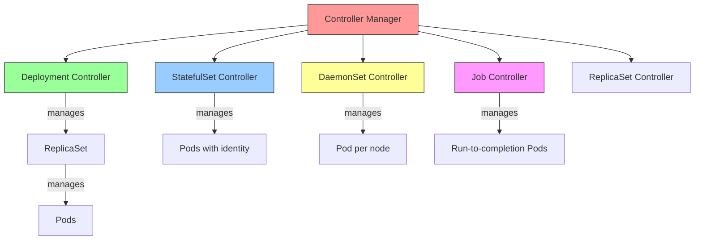
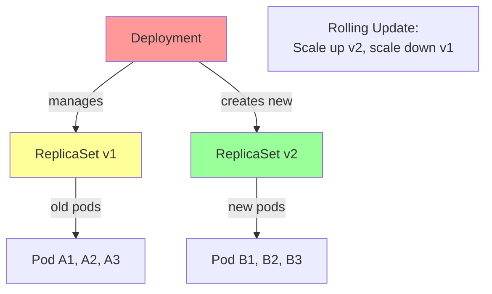
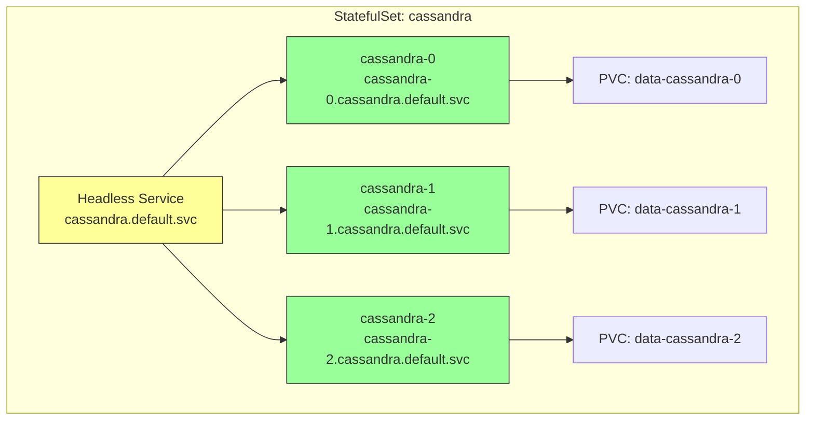
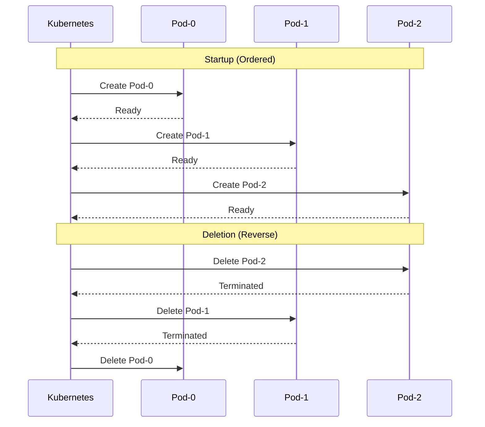

# 5.3.2 Workload Controllers: Deployments, StatefulSets, DaemonSets, Jobs

#### Why Workload Controllers Matter

Pods are ephemeral – when they fail, they don't automatically restart. **Controllers** provide:

* **Self-healing** – Automatically replace failed pods
* **Scaling** – Maintain desired replica count
* **Rolling updates** – Zero-downtime deployments
* **Declarative management** – Define desired state, controller reconciles

This note covers all major controllers. Note 5.3.1 covers Pod fundamentals; note 5.3.3 covers scheduling; note 5.3.4 is the subchapter review.

**Backlinks:** [5.3.1 - Pod Fundamentals](./5.3.1_Pod_Fundamentals_and_Lifecycle.md) | [5.1.1 - Architecture](../Subchapter_5.1/5.1.1_K8s_Architecture_Components.md) | [5.5.2 - PVC](../Subchapter_5.5/5.5.2_PersistentVolumes_PersistentVolumeClaims_StorageClasses.md)

---

## Part 1: Controller Architecture



### Controller Comparison

| Controller | Use Case | Pod Naming | Storage | Ordering |
|------------|----------|------------|---------|----------|
| **Deployment** | Stateless apps | Random (app-abc123) | Ephemeral | No |
| **StatefulSet** | Databases, stateful | Ordinal (app-0, app-1) | Per-pod PVC | Yes |
| **DaemonSet** | Per-node agents | Node-based | Optional | N/A |
| **Job** | Batch processing | Random | Optional | No |
| **CronJob** | Scheduled tasks | Random | Optional | No |

---

## Part 2: ReplicaSet – Maintaining Pod Count

ReplicaSet ensures a specified number of pod replicas are running at all times.

```yaml
# replicaset.yaml
apiVersion: apps/v1
kind: ReplicaSet
metadata:
  name: nginx-rs
  labels:
    app: nginx
spec:
  replicas: 3
  selector:
    matchLabels:
      app: nginx
  template:
    metadata:
      labels:
        app: nginx
    spec:
      containers:
      - name: nginx
        image: nginx:alpine
        ports:
        - containerPort: 80
```

```bash
# Create ReplicaSet
kubectl apply -f replicaset.yaml

# Check status
kubectl get rs
kubectl get pods -l app=nginx

# Scale ReplicaSet
kubectl scale rs nginx-rs --replicas=5

# Delete ReplicaSet (deletes pods too)
kubectl delete rs nginx-rs
```

**Note:** ReplicaSets are rarely used directly. Deployments manage ReplicaSets for you.

***

## Part 3: Deployment – The Standard for Stateless Apps

Deployment is the most common controller for stateless applications.



Deployments provide rolling updates, rollbacks, and declarative management.

### Basic Deployment

```yaml
# deployment.yaml
apiVersion: apps/v1
kind: Deployment
metadata:
  name: nginx-deployment
  labels:
    app: nginx
spec:
  replicas: 3
  selector:
    matchLabels:
      app: nginx
  strategy:
    type: RollingUpdate
    rollingUpdate:
      maxSurge: 1        # Extra pods during update
      maxUnavailable: 0  # Pods that can be down during update
  template:
    metadata:
      labels:
        app: nginx
    spec:
      containers:
      - name: nginx
        image: nginx:1.25
        ports:
        - containerPort: 80
        resources:
          requests:
            cpu: 100m
            memory: 128Mi
          limits:
            cpu: 500m
            memory: 256Mi
```

### Deployment Commands

```bash
# Create deployment
kubectl apply -f deployment.yaml

# List deployments
kubectl get deployments
kubectl get deploy

# Scale deployment
kubectl scale deployment nginx-deployment --replicas=5
kubectl scale --current-replicas=3 --replicas=5 deployment/nginx-deployment

# Update image
kubectl set image deployment/nginx-deployment nginx=nginx:1.26

# Edit deployment (live)
kubectl edit deployment nginx-deployment

# View rollout status
kubectl rollout status deployment nginx-deployment

# View rollout history
kubectl rollout history deployment nginx-deployment
# REVISION  CHANGE-CAUSE
# 1         kubectl apply --filename=deployment.yaml
# 2         kubectl set image deployment/nginx-deployment nginx=nginx:1.26

# Rollback to previous revision
kubectl rollout undo deployment nginx-deployment

# Rollback to specific revision
kubectl rollout undo deployment nginx-deployment --to-revision=1

# Pause rollout (for canary testing)
kubectl rollout pause deployment nginx-deployment

# Resume rollout
kubectl rollout resume deployment nginx-deployment

# Restart all pods (force redeploy)
kubectl rollout restart deployment nginx-deployment
```

### Deployment Strategies

| Strategy                     | Description                                         | When to Use                          |
| ---------------------------- | --------------------------------------------------- | ------------------------------------ |
| **RollingUpdate**            | Gradually replaces old pods with new ones (default) | Most stateless apps                  |
| **Recreate**                 | Kills all old pods before creating new ones         | When multiple versions can't coexist |
| **Blue/Green** (via Service) | Switch traffic between two deployments              | Zero-downtime, instant rollback      |
| **Canary** (via Istio/Argo)  | Route partial traffic to new version                | Gradual testing                      |

### RollingUpdate Parameters

```yaml
strategy:
  type: RollingUpdate
  rollingUpdate:
    maxSurge: 25%        # Percentage of extra pods (can be integer)
    maxUnavailable: 25%  # Percentage of pods that can be down
```

**Example:** Deployment with 4 replicas, `maxSurge: 1`, `maxUnavailable: 0`:

1. Create 1 new pod (total 5)
2. Terminate 1 old pod (total 4)
3. Repeat until all pods are new

### Record Change Cause (Best Practice)

```bash
# Apply with --record (deprecated, use annotation)
kubectl apply -f deployment.yaml --record

# Better: Set change-cause annotation manually
kubectl annotate deployment nginx-deployment kubernetes.io/change-cause="Updated to nginx 1.26"

# View change-cause in history
kubectl rollout history deployment nginx-deployment
```

***

## Part 4: StatefulSet – For Stateful Applications

StatefulSets provide stable network identities and persistent storage for each pod. Understanding StatefulSets deeply is critical for CKA/CKAD.

### StatefulSet Architecture



### StatefulSet Characteristics

| Feature              | Deployment                 | StatefulSet                                         |
| -------------------- | -------------------------- | --------------------------------------------------- |
| **Pod naming**       | Random suffix (web-abc123) | Ordinal index (web-0, web-1, web-2)                 |
| **Network identity** | Ephemeral                  | Stable (DNS: web-0.nginx.default.svc.cluster.local) |
| **Storage**          | Ephemeral or shared PV     | Each pod has its own PVC                            |
| **Startup order**    | Parallel                   | Ordered (web-0 before web-1)                        |
| **Deletion**         | Parallel                   | Ordered (web-2 before web-1)                        |
| **Update order**     | Any order                  | Reverse ordinal (web-2 before web-1)                |
| **Use case**         | Stateless apps             | Databases, message queues, Zookeeper                |

### StatefulSet Ordering Guarantees



### Pod Management Policies

| Policy | Behavior | Use Case |
|--------|----------|----------|
| `OrderedReady` (default) | Wait for Ready before next | Databases, consensus systems |
| `Parallel` | Create/delete all simultaneously | Fast scaling, independent pods |

```yaml
# statefulset-parallel.yaml
spec:
  podManagementPolicy: Parallel  # or OrderedReady (default)
```

### StatefulSet Example (Cassandra)

```yaml
# statefulset.yaml
apiVersion: apps/v1
kind: StatefulSet
metadata:
  name: cassandra
spec:
  serviceName: cassandra  # Required for network identity
  replicas: 3
  selector:
    matchLabels:
      app: cassandra
  template:
    metadata:
      labels:
        app: cassandra
    spec:
      containers:
      - name: cassandra
        image: cassandra:4.0
        ports:
        - containerPort: 7000
          name: intra-node
        - containerPort: 7001
          name: tls-intra-node
        - containerPort: 7199
          name: jmx
        - containerPort: 9042
          name: cql
        env:
        - name: CASSANDRA_SEEDS
          value: "cassandra-0.cassandra.default.svc.cluster.local"
        - name: CASSANDRA_CLUSTER_NAME
          value: "MyCluster"
        volumeMounts:
        - name: cassandra-data
          mountPath: /var/lib/cassandra
  volumeClaimTemplates:
  - metadata:
      name: cassandra-data
    spec:
      accessModes: [ "ReadWriteOnce" ]
      resources:
        requests:
          storage: 10Gi
```

### Headless Service for StatefulSet

```yaml
# headless-service.yaml
apiVersion: v1
kind: Service
metadata:
  name: cassandra
spec:
  clusterIP: None  # Headless service
  selector:
    app: cassandra
  ports:
  - port: 9042
    targetPort: 9042
```

### StatefulSet Pod Identities

```bash
# Pod names are predictable
cassandra-0
cassandra-1
cassandra-2

# Stable DNS names
cassandra-0.cassandra.default.svc.cluster.local
cassandra-1.cassandra.default.svc.cluster.local
cassandra-2.cassandra.default.svc.cluster.local

# Scale up (adds cassandra-3)
kubectl scale statefulset cassandra --replicas=4

# Scale down (removes cassandra-3 first)
kubectl scale statefulset cassandra --replicas=2
```

### StatefulSet Update Strategy and Partition-Based Canary

The `partition` field in `updateStrategy` is how you do **canary deployments for stateful workloads**. Only pods with ordinal ≥ partition are updated.

```yaml
# statefulset-canary.yaml
apiVersion: apps/v1
kind: StatefulSet
metadata:
  name: cassandra
spec:
  replicas: 5
  updateStrategy:
    type: RollingUpdate
    rollingUpdate:
      partition: 3  # Only pods 3, 4 get updated; pods 0, 1, 2 stay on old version
```

```bash
# Step 1: Set partition to 4 (only pod-4 gets the new image)
kubectl patch statefulset cassandra -p '{"spec":{"updateStrategy":{"rollingUpdate":{"partition":4}}}}'

# Step 2: Update the image
kubectl set image statefulset/cassandra cassandra=cassandra:4.1

# Step 3: Only cassandra-4 restarts with new image
kubectl get pods -l app=cassandra -w
# cassandra-0   Running   (old image)
# cassandra-1   Running   (old image)
# cassandra-2   Running   (old image)
# cassandra-3   Running   (old image)
# cassandra-4   Running   (NEW image ← canary)

# Step 4: Verify cassandra-4 is healthy
kubectl logs cassandra-4
kubectl exec cassandra-4 -- nodetool status

# Step 5: Lower partition to roll out to more pods
kubectl patch statefulset cassandra -p '{"spec":{"updateStrategy":{"rollingUpdate":{"partition":2}}}}'
# Now cassandra-2, cassandra-3, cassandra-4 all run new image

# Step 6: Complete rollout (partition=0)
kubectl patch statefulset cassandra -p '{"spec":{"updateStrategy":{"rollingUpdate":{"partition":0}}}}'
```

**Why this matters for databases:** Unlike Deployments where canary means "some traffic goes to new version," StatefulSet partition gives you **exact control** over which specific pod runs the new version. For databases, you want to update one replica, verify replication is healthy, then proceed.

### StatefulSet Operations

```bash
# Create StatefulSet
kubectl apply -f statefulset.yaml
kubectl apply -f headless-service.yaml

# Check status
kubectl get statefulset
kubectl get pods -l app=cassandra -w

# Check PVCs (each pod gets its own)
kubectl get pvc
# cassandra-data-cassandra-0   Bound   pv-1   10Gi   RWO
# cassandra-data-cassandra-1   Bound   pv-2   10Gi   RWO
# cassandra-data-cassandra-2   Bound   pv-3   10Gi   RWO

# Scale (ordered)
kubectl scale statefulset cassandra --replicas=4

# Delete (pods delete in reverse order)
kubectl delete statefulset cassandra
# PVCs remain (data preserved)
```

***

## Part 5: Pod Status Conditions

| Status                | Meaning                                            | Troubleshooting                      |
| --------------------- | -------------------------------------------------- | ------------------------------------ |
| **Pending**           | Pod accepted, waiting for scheduling or image pull | Check node resources, image name     |
| **Running**           | Pod bound to node, containers running              | -                                    |
| **Succeeded**         | All containers terminated with success             | Job completed                        |
| **Failed**            | All containers terminated with failure             | Check logs                           |
| **CrashLoopBackOff**  | Container repeatedly crashing                      | `kubectl logs --previous`            |
| **ImagePullBackOff**  | Cannot pull image                                  | Check image name, registry auth      |
| **ErrImagePull**      | Image pull error                                   | Same as above                        |
| **ContainerCreating** | Image pulled, starting container                   | Usually normal, check if stuck       |
| **Terminating**       | Pod being deleted                                  | May be stuck; force delete if needed |
| **Unknown**           | Pod state unknown (node lost)                      | Check node connectivity              |

***

## Part 5b: Security Context – Pod and Container Security

Security Context configures security settings for pods and containers.

### Pod-Level Security Context

```yaml
# pod-security-context.yaml
apiVersion: v1
kind: Pod
metadata:
  name: secure-pod
spec:
  securityContext:
    runAsUser: 1000           # Run as UID 1000
    runAsGroup: 3000          # Run as GID 3000
    fsGroup: 2000             # Supplemental group for volume mounts
    runAsNonRoot: true        # Prevent running as root
  containers:
  - name: app
    image: myapp:latest
    securityContext:
      allowPrivilegeEscalation: false
      readOnlyRootFilesystem: true
      capabilities:
        drop:
        - ALL
        add:
        - NET_BIND_SERVICE
```

### Container-Level Security Context

```yaml
securityContext:
  runAsUser: 1000                    # Run as specific user
  runAsNonRoot: true                 # Must not be root
  readOnlyRootFilesystem: true       # Root FS read-only
  allowPrivilegeEscalation: false    # Prevent privilege escalation
  privileged: false                  # No privileged mode
  capabilities:
    drop:
    - ALL                            # Drop all Linux capabilities
    add:
    - NET_BIND_SERVICE               # Only add what's needed
```

### Common Security Context Settings

| Setting                      | Scope     | Purpose                           |
| ---------------------------- | --------- | --------------------------------- |
| `runAsUser`                  | Pod/Ctr   | Run as specific UID               |
| `runAsGroup`                 | Pod/Ctr   | Run as specific GID               |
| `runAsNonRoot`               | Pod/Ctr   | Forbid running as root            |
| `fsGroup`                    | Pod       | GID for volume mounts             |
| `readOnlyRootFilesystem`     | Container | Make root FS read-only            |
| `allowPrivilegeEscalation`   | Container | Prevent setuid binaries           |
| `privileged`                 | Container | Full host access (avoid!)         |
| `capabilities.add/drop`      | Container | Linux capabilities                |
| `seccompProfile`             | Pod/Ctr   | Seccomp filtering                 |

### Seccomp Profile Example

```yaml
securityContext:
  seccompProfile:
    type: RuntimeDefault  # Use container runtime default
    # or
    type: Localhost
    localhostProfile: profiles/my-profile.json
```

***

## Part 6: Pod Disruption Budget (Review)

From 5.2.1, PDBs protect application availability during voluntary disruptions.

```yaml
# pdb.yaml
apiVersion: policy/v1
kind: PodDisruptionBudget
metadata:
  name: app-pdb
spec:
  minAvailable: 2
  selector:
    matchLabels:
      app: myapp
```

```bash
kubectl get pdb
# NAME      MIN AVAILABLE   MAX UNAVAILABLE   ALLOWED DISRUPTIONS   AGE
# app-pdb   2               N/A               1                      10s
```

***

## Quick Task: Deploy and Update a Deployment

*Practice creating, updating, and rolling back a deployment.*

1. Create a deployment with 3 replicas using `nginx:1.25`.
2. Scale it to 5 replicas.
3. Update the image to `nginx:1.26` and watch the rollout.
4. Check the rollout history.
5. Roll back to the previous version.

> **Ready Solution:**
>
> ```bash
> # Task 1
> kubectl create deployment nginx --image=nginx:1.25 --replicas=3
> kubectl get deployments
> kubectl get pods
>
> # Task 2
> kubectl scale deployment nginx --replicas=5
> kubectl get pods
>
> # Task 3
> kubectl set image deployment/nginx nginx=nginx:1.26
> kubectl rollout status deployment/nginx
>
> # Task 4
> kubectl rollout history deployment/nginx
>
> # Task 5
> kubectl rollout undo deployment/nginx
> kubectl rollout status deployment/nginx
>
> # Cleanup
> kubectl delete deployment nginx
> ```

***

## Part 7: DaemonSets – One Pod Per Node

DaemonSets ensure that one pod runs on every node (or selected nodes). Used for node-level services.

```yaml
# daemonset.yaml
apiVersion: apps/v1
kind: DaemonSet
metadata:
  name: node-exporter
  namespace: monitoring
spec:
  selector:
    matchLabels:
      app: node-exporter
  template:
    metadata:
      labels:
        app: node-exporter
    spec:
      hostNetwork: true
      hostPID: true
      containers:
      - name: node-exporter
        image: prom/node-exporter:latest
        ports:
        - containerPort: 9100
        volumeMounts:
        - name: proc
          mountPath: /host/proc
          readOnly: true
        - name: sys
          mountPath: /host/sys
          readOnly: true
      volumes:
      - name: proc
        hostPath:
          path: /proc
      - name: sys
        hostPath:
          path: /sys
      tolerations:
      - operator: Exists  # Run on all nodes, including control plane
```

### DaemonSet Use Cases

| Use Case              | Example                              |
| --------------------- | ------------------------------------ |
| **Log collection**    | Fluentd, Filebeat, Promtail          |
| **Monitoring agents** | Node Exporter, Datadog agent         |
| **Storage plugins**   | CSI node drivers                     |
| **Network plugins**   | Calico, Cilium node agents           |
| **Security agents**   | Falco, Sysdig                        |

### DaemonSet Commands

```bash
# Create DaemonSet
kubectl apply -f daemonset.yaml

# Check DaemonSet status
kubectl get daemonset -n monitoring
# NAME            DESIRED   CURRENT   READY   UP-TO-DATE   AVAILABLE   NODE SELECTOR   AGE
# node-exporter   3         3         3       3            3           <none>          10s

# Rolling update DaemonSet
kubectl set image daemonset/node-exporter node-exporter=prom/node-exporter:v1.5.0 -n monitoring

# Check rollout status
kubectl rollout status daemonset/node-exporter -n monitoring
```

***

## Part 8: Jobs and CronJobs – Batch Workloads

### Job – Run to Completion

Jobs run a pod until it successfully completes (exit code 0).

```yaml
# job.yaml
apiVersion: batch/v1
kind: Job
metadata:
  name: backup-job
spec:
  completions: 1          # Number of successful completions required
  parallelism: 1          # Pods to run in parallel
  backoffLimit: 4         # Retries before marking failed
  activeDeadlineSeconds: 600  # Timeout
  ttlSecondsAfterFinished: 100  # Auto-delete after completion
  template:
    spec:
      restartPolicy: Never  # Required for Jobs (Never or OnFailure)
      containers:
      - name: backup
        image: backup-tool:latest
        command: ["/bin/sh", "-c", "backup.sh"]
```

### Job Parallelism Types

| Completions | Parallelism | Behavior                               |
| ----------- | ----------- | -------------------------------------- |
| 1           | 1           | Single pod, run once (default)         |
| N           | 1           | Sequential: N pods, one at a time      |
| N           | M           | Parallel: N total, M concurrent        |
| (empty)     | M           | Work queue: M workers, external queue  |

### CronJob – Scheduled Jobs

CronJobs create Jobs on a schedule (like cron).

```yaml
# cronjob.yaml
apiVersion: batch/v1
kind: CronJob
metadata:
  name: nightly-backup
spec:
  schedule: "0 2 * * *"  # 2:00 AM daily
  concurrencyPolicy: Forbid  # Allow, Forbid, Replace
  startingDeadlineSeconds: 200
  successfulJobsHistoryLimit: 3
  failedJobsHistoryLimit: 1
  jobTemplate:
    spec:
      template:
        spec:
          restartPolicy: OnFailure
          containers:
          - name: backup
            image: backup-tool:latest
            command: ["/bin/sh", "-c", "backup.sh"]
```

### CronJob Schedule Format

```
# ┌───────────── minute (0 - 59)
# │ ┌───────────── hour (0 - 23)
# │ │ ┌───────────── day of month (1 - 31)
# │ │ │ ┌───────────── month (1 - 12)
# │ │ │ │ ┌───────────── day of week (0 - 6) (Sunday = 0)
# │ │ │ │ │
# * * * * *

# Examples:
# "0 * * * *"     - Every hour
# "*/15 * * * *"  - Every 15 minutes
# "0 2 * * *"     - Daily at 2:00 AM
# "0 0 * * 0"     - Weekly on Sunday midnight
# "0 0 1 * *"     - Monthly on 1st at midnight
```

### CronJob Concurrency Policies

| Policy    | Behavior                                    |
| --------- | ------------------------------------------- |
| `Allow`   | Multiple jobs can run concurrently          |
| `Forbid`  | Skip new job if previous still running      |
| `Replace` | Cancel running job and start new one        |

### Job/CronJob Commands

```bash
# Create Job
kubectl apply -f job.yaml

# Check Job status
kubectl get jobs
kubectl describe job backup-job

# View Job logs
kubectl logs job/backup-job

# Delete completed Jobs
kubectl delete jobs --field-selector status.successful=1

# Create CronJob
kubectl apply -f cronjob.yaml

# Check CronJob status
kubectl get cronjobs

# Manually trigger CronJob
kubectl create job --from=cronjob/nightly-backup manual-backup

# Suspend CronJob
kubectl patch cronjob nightly-backup -p '{"spec":{"suspend":true}}'
```

***

## Summary Table: Workload Controllers

| Controller      | Use Case                             | Stable Network ID | Persistent Storage | Ordered Startup |
| --------------- | ------------------------------------ | ----------------- | ------------------ | --------------- |
| **ReplicaSet**  | Maintain pod count (rarely direct)   | No                | No                 | No              |
| **Deployment**  | Stateless apps, rolling updates      | No                | No (ephemeral)     | No              |
| **StatefulSet** | Databases, stateful apps             | Yes (pod-N)       | Yes (per-pod PVC)  | Yes             |
| **DaemonSet**   | One pod per node (monitoring)        | No                | Optional           | N/A             |
| **Job**         | Batch processing (run to completion) | No                | Optional           | No              |
| **CronJob**     | Scheduled batch jobs                 | No                | Optional           | No              |

### Deployment Commands Quick Reference

| Command                                             | Purpose           |
| --------------------------------------------------- | ----------------- |
| `kubectl create deploy NAME --image=IMG`            | Create deployment |
| `kubectl scale deploy NAME --replicas=N`            | Scale pods        |
| `kubectl set image deploy NAME CONTAINER=NEW_IMAGE` | Update image      |
| `kubectl rollout status deploy NAME`                | Check rollout     |
| `kubectl rollout history deploy NAME`               | View history      |
| `kubectl rollout undo deploy NAME`                  | Rollback          |
| `kubectl rollout pause deploy NAME`                 | Pause rollout     |
| `kubectl rollout resume deploy NAME`                | Resume rollout    |
| `kubectl rollout restart deploy NAME`               | Restart all pods  |

### Pod Status Conditions

| Condition         | Meaning                       |
| ----------------- | ----------------------------- |
| `PodScheduled`    | Pod assigned to node          |
| `Initialized`     | Init containers completed     |
| `ContainersReady` | All containers ready          |
| `Ready`           | Pod is ready to serve traffic |

***

**Next note (5.3.2)** will cover **Scheduling: Taints, Tolerations, and Affinity** – controlling pod placement, node selectors, taints/tolerations, node affinity, pod affinity/anti-affinity.

**Backlinks:** [5.1.1 - Architecture](../Subchapter_5.1/5.1.1_K8s_Architecture_Components.md) (Pods) | [Module 4 - Docker](../../4-Docker/Subchapter_4.3/4.3.1_Container_Lifecycle_and_Resource_Management.md) (resource limits, health checks)
