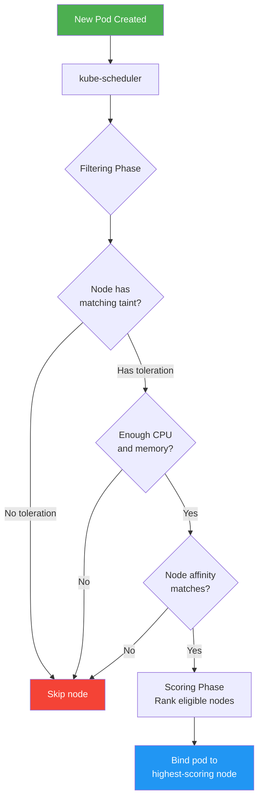

# 5.3.3 Scheduling: Taints, Tolerations, and Affinity – Controlling Pod Placement

#### Why Scheduling Controls Matter

By default, the Kubernetes scheduler spreads pods evenly across nodes. But production often requires fine-grained control:

* **Dedicated nodes** – GPU nodes for ML workloads

* **Node maintenance** – Drain nodes without affecting critical pods

* **Hardware affinity** – Place pods on nodes with SSDs

* **Pod separation** – Don't run two database pods on same node

* **Pod colocation** – Run web and cache pods on same node for low latency

This note covers node selectors, taints/tolerations, node affinity, and pod affinity/anti-affinity. Note 5.3.1 covers pod fundamentals; note 5.3.2 covers controllers; note 5.3.4 is the subchapter review.

**Backlinks:** [5.1.1 - Architecture](../Subchapter_5.1/5.1.1_K8s_Architecture_Components.md) | [5.3.1 - Pod Fundamentals](./5.3.1_Pod_Fundamentals_and_Lifecycle.md) | [5.3.2 - Controllers](./5.3.2_Workload_Controllers_Deployments_StatefulSets_DaemonSets.md)

***

### Kubernetes Scheduling Decision Flow



## Part 1: Node Selectors – Simple Pod Placement

Node selectors are the simplest way to constrain pod placement based on node labels.

### Adding Labels to Nodes

```bash
# Add label to node
kubectl label nodes worker-1 disktype=ssd
kubectl label nodes worker-2 disktype=hdd
kubectl label nodes worker-3 gpu=nvidia-t4

# View node labels
kubectl get nodes --show-labels
kubectl describe node worker-1 | grep Labels -A 10

# Remove label
kubectl label nodes worker-1 disktype-
```

### Using Node Selector in Pod

```yaml
# pod-node-selector.yaml
apiVersion: v1
kind: Pod
metadata:
  name: ssd-app
spec:
  nodeSelector:
    disktype: ssd
  containers:
  - name: app
    image: nginx
```

```yaml
# deployment-node-selector.yaml
apiVersion: apps/v1
kind: Deployment
metadata:
  name: gpu-app
spec:
  replicas: 2
  selector:
    matchLabels:
      app: gpu-app
  template:
    metadata:
      labels:
        app: gpu-app
    spec:
      nodeSelector:
        gpu: nvidia-t4
      containers:
      - name: app
        image: tensorflow/tensorflow:latest-gpu
```

**Limitations:** Node selectors only support equality matching (`=`, `!=`), not complex expressions.

***

## Part 2: Taints and Tolerations – Repelling Pods

Taints are applied to **nodes** to repel pods. Tolerations are applied to **pods** to allow scheduling on tainted nodes.

### Taint Effects

| Effect               | Behavior                                      |
| -------------------- | --------------------------------------------- |
| **NoSchedule**       | Pods without toleration will not be scheduled |
| **PreferNoSchedule** | Scheduler tries to avoid (not guaranteed)     |
| **NoExecute**        | Evict existing pods without toleration        |

### Adding and Removing Taints

```bash
# Add taint (dedicated node for special workloads)
kubectl taint nodes worker-1 dedicated=gpu:NoSchedule

# Add taint with NoExecute (evict existing pods)
kubectl taint nodes worker-2 maintenance=true:NoExecute

# Add taint with PreferNoSchedule
kubectl taint nodes worker-3 spot=true:PreferNoSchedule

# View taints
kubectl describe node worker-1 | grep Taints
# Taints: dedicated=gpu:NoSchedule

# Remove taint
kubectl taint nodes worker-1 dedicated-
```

### Pod Toleration

```yaml
# pod-toleration.yaml
apiVersion: v1
kind: Pod
metadata:
  name: gpu-pod
spec:
  tolerations:
  - key: "dedicated"
    operator: "Equal"
    value: "gpu"
    effect: "NoSchedule"
  containers:
  - name: gpu-app
    image: nvidia/cuda:latest
```

### Toleration Operators

| Operator   | Behavior                              | Example                            |
| ---------- | ------------------------------------- | ---------------------------------- |
| **Equal**  | Key, value, effect must match         | `key=dedicated, value=gpu`         |
| **Exists** | Key and effect must match (any value) | `key=dedicated, effect=NoSchedule` |

```yaml
# Toleration with Exists operator (matches any value)
tolerations:
- key: "dedicated"
  operator: "Exists"
  effect: "NoSchedule"
```

### Common Taint Patterns

**1. Dedicated Node Pool (GPU nodes):**

```bash
# Taint GPU nodes
kubectl taint nodes gpu-node-1 dedicated=gpu:NoSchedule
kubectl taint nodes gpu-node-2 dedicated=gpu:NoSchedule

# Pods that need GPU add toleration
tolerations:
- key: "dedicated"
  operator: "Equal"
  value: "gpu"
  effect: "NoSchedule"
```

**2. Spot/Preemptible Nodes (evictable):**

```bash
kubectl taint nodes spot-node-1 spot=true:NoExecute
kubectl taint nodes spot-node-2 spot=true:NoExecute

# Pods with toleration (but can be evicted)
tolerations:
- key: "spot"
  operator: "Equal"
  value: "true"
  effect: "NoExecute"
```

**3. Maintenance Mode:**

```bash
# Drain node safely
kubectl drain worker-1 --ignore-daemonsets

# Add NoExecute taint (prevents new pods, evicts existing)
kubectl taint nodes worker-1 maintenance=true:NoExecute
```

### Control Plane Taints

By default, control plane nodes have a taint preventing regular pods:

```bash
kubectl describe node master-1 | grep Taints
# Taints: node-role.kubernetes.io/control-plane:NoSchedule

# To run a pod on control plane (not recommended for production)
tolerations:
- key: "node-role.kubernetes.io/control-plane"
  operator: "Exists"
  effect: "NoSchedule"
```

***

## Part 3: Node Affinity – Advanced Node Selection

Node affinity is the successor to node selectors, supporting complex expressions.

### Affinity Types

| Type                                                | Behavior                                            |
| --------------------------------------------------- | --------------------------------------------------- |
| **requiredDuringSchedulingIgnoredDuringExecution**  | Hard requirement (pod won't schedule if not met)    |
| **preferredDuringSchedulingIgnoredDuringExecution** | Soft preference (scheduler tries, but not required) |

### Node Affinity Example

```yaml
# pod-node-affinity.yaml
apiVersion: v1
kind: Pod
metadata:
  name: affinity-pod
spec:
  affinity:
    nodeAffinity:
      requiredDuringSchedulingIgnoredDuringExecution:
        nodeSelectorTerms:
        - matchExpressions:
          - key: disktype
            operator: In
            values:
            - ssd
            - nvme
          - key: region
            operator: NotIn
            values:
            - "us-east-1"
      preferredDuringSchedulingIgnoredDuringExecution:
      - weight: 100
        preference:
          matchExpressions:
          - key: zone
            operator: In
            values:
            - "zone-a"
      - weight: 50
        preference:
          matchExpressions:
          - key: instance-type
            operator: In
            values:
            - "m5.large"
  containers:
  - name: nginx
    image: nginx
```

### Node Affinity Operators

| Operator         | Meaning                     |
| ---------------- | --------------------------- |
| **In**           | Label value is in list      |
| **NotIn**        | Label value is not in list  |
| **Exists**       | Label exists (any value)    |
| **DoesNotExist** | Label does not exist        |
| **Gt**           | Value > specified (numeric) |
| **Lt**           | Value < specified (numeric) |

```yaml
# Complex node affinity examples
nodeAffinity:
  requiredDuringSchedulingIgnoredDuringExecution:
    nodeSelectorTerms:
    - matchExpressions:
      - key: memory
        operator: Gt
        values: ["32"]    # Memory > 32GB
      - key: cpu
        operator: Gt
        values: ["8"]     # CPU cores > 8
      - key: topology.kubernetes.io/zone
        operator: In
        values:
        - "us-east-1a"
        - "us-east-1b"
```

***

## Part 4: Pod Affinity and Anti-Affinity

Pod affinity attracts pods to each other; anti-affinity repels them.

### Pod Affinity Example (Colocate)

```yaml
# pod-affinity.yaml (web and cache on same node)
apiVersion: apps/v1
kind: Deployment
metadata:
  name: web
spec:
  replicas: 3
  selector:
    matchLabels:
      app: web
  template:
    metadata:
      labels:
        app: web
    spec:
      affinity:
        podAffinity:
          requiredDuringSchedulingIgnoredDuringExecution:
          - labelSelector:
              matchExpressions:
              - key: app
                operator: In
                values:
                - cache
            topologyKey: kubernetes.io/hostname
      containers:
      - name: web
        image: nginx
```

### Pod Anti-Affinity Example (Separate)

```yaml
# pod-anti-affinity.yaml (database pods on different nodes)
apiVersion: apps/v1
kind: StatefulSet
metadata:
  name: postgres
spec:
  replicas: 3
  selector:
    matchLabels:
      app: postgres
  template:
    metadata:
      labels:
        app: postgres
    spec:
      affinity:
        podAntiAffinity:
          requiredDuringSchedulingIgnoredDuringExecution:
          - labelSelector:
              matchExpressions:
              - key: app
                operator: In
                values:
                - postgres
            topologyKey: kubernetes.io/hostname
      containers:
      - name: postgres
        image: postgres:15
```

### Topology Keys

| Topology Key                             | Scope             |
| ---------------------------------------- | ----------------- |
| `kubernetes.io/hostname`                 | Node level        |
| `topology.kubernetes.io/zone`            | Availability zone |
| `topology.kubernetes.io/region`          | Region            |
| `failure-domain.beta.kubernetes.io/zone` | Legacy zone label |

### Pod Affinity with Weighted Preferences

```yaml
affinity:
  podAntiAffinity:
    preferredDuringSchedulingIgnoredDuringExecution:
    - weight: 100
      podAffinityTerm:
        labelSelector:
          matchExpressions:
          - key: app
            operator: In
            values:
            - database
        topologyKey: kubernetes.io/hostname
    - weight: 50
      podAffinityTerm:
        labelSelector:
          matchExpressions:
          - key: app
            operator: In
            values:
            - cache
        topologyKey: topology.kubernetes.io/zone
```

***

## Part 5: Topology Spread Constraints

Spread constraints distribute pods evenly across failure domains.

```yaml
# topology-spread.yaml
apiVersion: apps/v1
kind: Deployment
metadata:
  name: app
spec:
  replicas: 6
  selector:
    matchLabels:
      app: app
  template:
    metadata:
      labels:
        app: app
    spec:
      topologySpreadConstraints:
      - maxSkew: 1
        topologyKey: kubernetes.io/hostname
        whenUnsatisfiable: DoNotSchedule
        labelSelector:
          matchLabels:
            app: app
      - maxSkew: 1
        topologyKey: topology.kubernetes.io/zone
        whenUnsatisfiable: ScheduleAnyway
        labelSelector:
          matchLabels:
            app: app
```

### Spread Constraint Fields

| Field                 | Meaning                                           |
| --------------------- | ------------------------------------------------- |
| **maxSkew**           | Maximum difference in pod count between domains   |
| **topologyKey**       | Node label key for domain                         |
| **whenUnsatisfiable** | `DoNotSchedule` (hard) or `ScheduleAnyway` (soft) |
| **labelSelector**     | Which pods to consider for spreading              |

***

## Part 6: Resource Requests and Limits (Scheduling Impact)

Resource requests and limits influence scheduling decisions.

```yaml
# pod-resources.yaml
apiVersion: v1
kind: Pod
metadata:
  name: resource-pod
spec:
  containers:
  - name: app
    image: nginx
    resources:
      requests:
        memory: "256Mi"
        cpu: "500m"
      limits:
        memory: "512Mi"
        cpu: "1000m"
```

**Scheduling behavior:**

* Scheduler uses **requests** to find a node with sufficient capacity

* **Limits** are enforced at runtime (cgroups)

* Pods without requests are treated as `BestEffort` (lowest priority)

### Resource Units

| Resource          | Unit                        | Example           |
| ----------------- | --------------------------- | ----------------- |
| CPU               | millicores (1 core = 1000m) | `500m` = 0.5 core |
| Memory            | bytes (Mi, Gi)              | `256Mi`, `1Gi`    |
| Ephemeral storage | bytes                       | `10Gi`            |

```bash
# View node capacity
kubectl describe node worker-1 | grep -A 5 "Capacity"
kubectl describe node worker-1 | grep -A 5 "Allocated resources"
```

***

## Part 7: Troubleshooting Scheduling Issues

### Pod Stuck in Pending

```bash
# Check pod events
kubectl describe pod mypod | grep -A 20 Events

# Common scheduling failures:
# - "0/3 nodes are available: insufficient cpu"
# - "0/3 nodes are available: node(s) had untolerated taint"
# - "0/3 nodes are available: pod has unbound PersistentVolumeClaims"
```

### Debugging Node Availability

```bash
# Check node conditions
kubectl get nodes
kubectl describe node worker-1 | grep Conditions -A 10

# Check node taints
kubectl describe node worker-1 | grep Taints

# Check node labels
kubectl get nodes --show-labels | grep worker-1

# Check node resource usage
kubectl top nodes
```

### Force Pod to Schedule (Debugging)

```bash
# Remove taint temporarily (for testing)
kubectl taint nodes worker-1 dedicated-

# Add toleration to pod
kubectl patch pod mypod --patch '{"spec":{"tolerations":[{"key":"dedicated","operator":"Exists","effect":"NoSchedule"}]}}'

# Delete and recreate pod (if needed)
kubectl delete pod mypod
kubectl apply -f pod.yaml
```

***

## Quick Task: Practice Scheduling Controls

*Create a scenario with dedicated nodes and affinity rules.*

1. Label a node `disktype=ssd`.
2. Taint the same node `dedicated=ssd:NoSchedule`.
3. Create a pod with node selector `disktype=ssd` and toleration for the taint.
4. Verify the pod schedules on the correct node.
5. Create a deployment with pod anti-affinity to spread replicas across nodes.

> **Ready Solution:**
>
> ```bash
> # Task 1-2
> kubectl label nodes worker-1 disktype=ssd
> kubectl taint nodes worker-1 dedicated=ssd:NoSchedule
>
> # Task 3
> cat << EOF | kubectl apply -f -
> apiVersion: v1
> kind: Pod
> metadata:
>   name: ssd-pod
> spec:
>   nodeSelector:
>     disktype: ssd
>   tolerations:
>   - key: "dedicated"
>     operator: "Equal"
>     value: "ssd"
>     effect: "NoSchedule"
>   containers:
>   - name: nginx
>     image: nginx
> EOF
>
> # Task 4
> kubectl get pod ssd-pod -o wide
>
> # Task 5
> cat << EOF | kubectl apply -f -
> apiVersion: apps/v1
> kind: Deployment
> metadata:
>   name: anti-affinity-app
> spec:
>   replicas: 3
>   selector:
>     matchLabels:
>       app: anti-affinity
>   template:
>     metadata:
>       labels:
>         app: anti-affinity
>     spec:
>       affinity:
>         podAntiAffinity:
>           requiredDuringSchedulingIgnoredDuringExecution:
>           - labelSelector:
>               matchExpressions:
>               - key: app
>                 operator: In
>                 values:
>                 - anti-affinity
>             topologyKey: kubernetes.io/hostname
>       containers:
>       - name: app
>         image: nginx
> EOF
>
> kubectl get pods -o wide
> # Pods should be on different nodes
> ```

***

## Summary Table: Scheduling Controls

| Control                | Scope           | Hard/Soft | Expression                  |
| ---------------------- | --------------- | --------- | --------------------------- |
| **nodeSelector**       | Node            | Hard      | Equality only               |
| **Taints/Tolerations** | Node → Pod      | Hard      | Key/value/effect            |
| **Node Affinity**      | Node            | Both      | Complex (In, NotIn, Gt, Lt) |
| **Pod Affinity**       | Pod             | Both      | Label selectors             |
| **Pod Anti-Affinity**  | Pod             | Both      | Label selectors             |
| **Topology Spread**    | Failure domains | Both      | maxSkew                     |

### Taint Effects

| Effect             | New Pods       | Existing Pods |
| ------------------ | -------------- | ------------- |
| `NoSchedule`       | Don't schedule | Keep running  |
| `PreferNoSchedule` | Try to avoid   | Keep running  |
| `NoExecute`        | Don't schedule | Evict         |

### Affinity Operators

| Operator       | Use Case                    |
| -------------- | --------------------------- |
| `In`           | Match one of several values |
| `NotIn`        | Exclude values              |
| `Exists`       | Label exists (any value)    |
| `DoesNotExist` | Label doesn't exist         |
| `Gt`           | Numeric greater than        |
| `Lt`           | Numeric less than           |

***

**Next note (5.3.3)** will be the Subchapter Review for Workloads and Scheduling, including a cheatsheet and scenario-based interview questions.

**Backlinks:** [5.3.1 - Workloads](./5.3.1_Pod_Fundamentals_and_Lifecycle.md) (labels) | [Module 4 - Resources](../../4-Docker/Subchapter_4.3/4.3.1_Container_Lifecycle_and_Resource_Management.md) (requests/limits) | [5.2.1 - HA Architecture](../Subchapter_5.2/5.2.1_HA_Cluster_Architecture_Multi_Master.md) (control plane taints)
