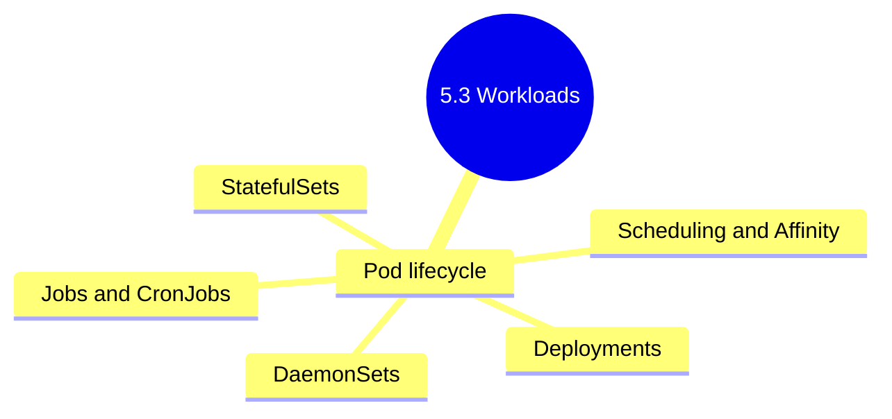

# 5.3.4 Subchapter Review: Cheatsheet and Interview Prep

This review covers the material presented in Notes 5.3.1 (Pod Fundamentals), 5.3.2 (Workload Controllers), and 5.3.3 (Scheduling).

**Backlinks:** [5.3.1 - Pod Fundamentals](./5.3.1_Pod_Fundamentals_and_Lifecycle.md) | [5.3.2 - Workload Controllers](./5.3.2_Workload_Controllers_Deployments_StatefulSets_DaemonSets.md) | [5.3.3 - Scheduling](./5.3.3_Scheduling_Taints_Tolerations_Affinity.md)

---

## Quick Command Reference

### Pod Commands

| Command | Purpose |
|---------|---------|
| `kubectl run NAME --image=IMG` | Create pod |
| `kubectl run NAME --image=IMG --dry-run=client -o yaml` | Generate pod YAML |
| `kubectl get pods -o wide` | List pods with node/IP |
| `kubectl describe pod NAME` | Detailed pod info |
| `kubectl logs NAME` | View pod logs |
| `kubectl logs NAME -c CONTAINER` | Specific container logs |
| `kubectl logs NAME --previous` | Previous container logs |
| `kubectl exec -it NAME -- /bin/sh` | Shell into pod |
| `kubectl port-forward NAME 8080:80` | Forward port |
| `kubectl delete pod NAME --force --grace-period=0` | Force delete |

### Deployment Commands

| Command | Purpose |
|---------|---------|
| `kubectl create deploy NAME --image=IMG` | Create deployment |
| `kubectl scale deploy NAME --replicas=N` | Scale deployment |
| `kubectl set image deploy NAME CONTAINER=NEW_IMG` | Update image |
| `kubectl rollout status deploy NAME` | Check rollout status |
| `kubectl rollout history deploy NAME` | View rollout history |
| `kubectl rollout undo deploy NAME` | Rollback to previous |
| `kubectl rollout undo deploy NAME --to-revision=N` | Rollback to specific revision |
| `kubectl rollout pause deploy NAME` | Pause rollout |
| `kubectl rollout resume deploy NAME` | Resume rollout |
| `kubectl rollout restart deploy NAME` | Restart all pods |
| `kubectl label nodes NODE KEY=VALUE` | Add label to node |
| `kubectl taint nodes NODE KEY=VALUE:EFFECT` | Add taint to node |
| `kubectl taint nodes NODE KEY-` | Remove taint from node |
| `kubectl describe node NODE \| grep Taints` | View node taints |
| `kubectl get nodes --show-labels` | View node labels |
| `kubectl top pods` | Pod resource usage |
| `kubectl get pods -w` | Watch pod status |

---

## Cheatsheet: Workloads and Scheduling

### Workload Controllers

| Controller      | Use Case                             | Stable Network ID | Ordered Startup |
| --------------- | ------------------------------------ | ----------------- | --------------- |
| **ReplicaSet**  | Maintain pod count (rarely direct)   | No                | No              |
| **Deployment**  | Stateless apps, rolling updates      | No                | No              |
| **StatefulSet** | Databases, stateful apps             | Yes (pod-N)       | Yes             |
| **DaemonSet**   | One pod per node (monitoring)        | No                | N/A             |
| **Job**         | Batch processing (run to completion) | No                | No              |
| **CronJob**     | Scheduled batch jobs                 | No                | No              |

### DaemonSet Commands

| Command                                              | Purpose                |
| ---------------------------------------------------- | ---------------------- |
| `kubectl get daemonset`                              | List DaemonSets        |
| `kubectl rollout status daemonset/NAME`              | Check DaemonSet update |
| `kubectl set image daemonset/NAME CONTAINER=IMAGE`   | Update DaemonSet image |

### Job/CronJob Commands

| Command                                              | Purpose                |
| ---------------------------------------------------- | ---------------------- |
| `kubectl get jobs`                                   | List Jobs              |
| `kubectl get cronjobs`                               | List CronJobs          |
| `kubectl logs job/NAME`                              | View Job logs          |
| `kubectl create job NAME --from=cronjob/CRON`        | Trigger CronJob        |
| `kubectl delete jobs --field-selector status.successful=1` | Delete completed Jobs |

### CronJob Schedule Format

```
# ┌─ minute (0-59)
# │ ┌─ hour (0-23)
# │ │ ┌─ day of month (1-31)
# │ │ │ ┌─ month (1-12)
# │ │ │ │ ┌─ day of week (0-6, Sun=0)
# * * * * *
```

### Security Context Settings

| Setting                      | Purpose                    |
| ---------------------------- | -------------------------- |
| `runAsUser`                  | Run as specific UID        |
| `runAsNonRoot`               | Forbid running as root     |
| `readOnlyRootFilesystem`     | Make root FS read-only     |
| `allowPrivilegeEscalation`   | Prevent setuid binaries    |
| `capabilities.drop: [ALL]`   | Drop all Linux capabilities |

### Deployment Commands

| Command                                             | Purpose           |
| --------------------------------------------------- | ----------------- |
| `kubectl create deploy NAME --image=IMG`            | Create deployment |
| `kubectl scale deploy NAME --replicas=N`            | Scale pods        |
| `kubectl set image deploy NAME CONTAINER=NEW_IMAGE` | Update image      |
| `kubectl rollout status deploy NAME`                | Check rollout     |
| `kubectl rollout history deploy NAME`               | View history      |
| `kubectl rollout undo deploy NAME`                  | Rollback          |
| `kubectl rollout pause deploy NAME`                 | Pause rollout     |
| `kubectl rollout resume deploy NAME`                | Resume rollout    |
| `kubectl rollout restart deploy NAME`               | Restart all pods  |

### Restart Policy

| Policy | Exit 0 | Exit ≠0 | Use Case |
|--------|--------|---------|----------|
| **Always** (default) | Restart | Restart | Long-running services (Deployment) |
| **OnFailure** | No restart | Restart | Jobs, batch processing |
| **Never** | No restart | No restart | Debug pods, one-shot tasks |

**Backoff timing:** 10s → 20s → 40s → 80s → 160s → 300s (max)

### Image Pull Policy

| Policy | Behavior | Default When |
|--------|----------|--------------|
| **Always** | Always pull | Image tag `:latest` or no tag |
| **IfNotPresent** | Pull if not cached | Specific tag (`:v1.2.3`) |
| **Never** | Never pull | Must set explicitly |

### Container Probes

| Probe | Purpose | Failure Action |
|-------|---------|----------------|
| **startupProbe** | Wait for slow apps | Block other probes |
| **livenessProbe** | Detect hangs/deadlocks | Restart container |
| **readinessProbe** | Check ready for traffic | Remove from Service |

### Pod Status Conditions

| Status               | Meaning                               |
| -------------------- | ------------------------------------- |
| **Pending**          | Waiting for scheduling or image pull  |
| **Running**          | Pod bound to node, containers running |
| **CrashLoopBackOff** | Container repeatedly crashing         |
| **ImagePullBackOff** | Cannot pull image                     |
| **Terminating**      | Pod being deleted                     |
| **Unknown**          | Node lost communication               |

### Deployment Strategies

| Strategy          | Behavior              | Downtime                  |
| ----------------- | --------------------- | ------------------------- |
| **RollingUpdate** | Gradual replacement   | Zero (with proper probes) |
| **Recreate**      | Kill all, then create | Some                      |
| **Blue/Green**    | Switch traffic        | Zero                      |

### RollingUpdate Parameters

```yaml
strategy:
  rollingUpdate:
    maxSurge: 25%        # Extra pods during update
    maxUnavailable: 25%  # Pods that can be down
```

### Scheduling Controls

| Control                | Hard/Soft | Use Case                          |
| ---------------------- | --------- | --------------------------------- |
| **nodeSelector**       | Hard      | Simple node filtering             |
| **Taints/Tolerations** | Hard      | Dedicated nodes, maintenance      |
| **Node Affinity**      | Both      | Complex node selection            |
| **Pod Affinity**       | Both      | Colocate pods                     |
| **Pod Anti-Affinity**  | Both      | Separate pods (HA)                |
| **Topology Spread**    | Both      | Distribute across failure domains |

### Taint Effects

| Effect             | Behavior                               |
| ------------------ | -------------------------------------- |
| `NoSchedule`       | Pods without toleration won't schedule |
| `PreferNoSchedule` | Scheduler tries to avoid               |
| `NoExecute`        | Evict existing pods without toleration |

### Node Affinity Operators

| Operator       | Meaning                     |
| -------------- | --------------------------- |
| `In`           | Label value in list         |
| `NotIn`        | Label value not in list     |
| `Exists`       | Label exists                |
| `DoesNotExist` | Label doesn't exist         |
| `Gt`           | Value > specified (numeric) |
| `Lt`           | Value < specified (numeric) |

### Toleration Operators

| Operator | Behavior                              |
| -------- | ------------------------------------- |
| `Equal`  | Key, value, effect must match         |
| `Exists` | Key and effect must match (any value) |

### Topology Keys

| Key                             | Scope             |
| ------------------------------- | ----------------- |
| `kubernetes.io/hostname`        | Node              |
| `topology.kubernetes.io/zone`   | Availability zone |
| `topology.kubernetes.io/region` | Region            |

### Resource Units

| Resource | Unit       | Example           |
| -------- | ---------- | ----------------- |
| CPU      | millicores | `500m` = 0.5 core |
| Memory   | bytes      | `256Mi`, `1Gi`    |




***

## Comparison Tables

### Deployment vs StatefulSet

| Feature              | Deployment          | StatefulSet            |
| -------------------- | ------------------- | ---------------------- |
| **Pod naming**       | Random suffix       | Ordinal (pod-0, pod-1) |
| **Network identity** | Ephemeral           | Stable DNS             |
| **Storage**          | Ephemeral or shared | Per-pod PVC            |
| **Startup order**    | Parallel            | Ordered                |
| **Deletion order**   | Parallel            | Reverse ordered        |
| **Use case**         | Stateless           | Stateful (databases)   |

### Taint vs Toleration

| Aspect         | Taint                                   | Toleration                        |
| -------------- | --------------------------------------- | --------------------------------- |
| **Applied to** | Node                                    | Pod                               |
| **Purpose**    | Repel pods                              | Allow scheduling on tainted nodes |
| **Effect**     | NoSchedule, PreferNoSchedule, NoExecute | Matches taint effect              |

### Node Affinity vs Node Selector

| Feature              | Node Selector    | Node Affinity                   |
| -------------------- | ---------------- | ------------------------------- |
| **Syntax**           | Simple key-value | Complex expressions             |
| **Operators**        | =, !=            | In, NotIn, Exists, Gt, Lt       |
| **Soft preferences** | No               | Yes (preferredDuringScheduling) |
| **Complexity**       | Low              | Medium                          |

***

## Interview Questions (Scenario-Based)

These questions assume only knowledge from Subchapter 5.3. Answers reference only concepts from 5.3.1 and 5.3.2.

### Question 1

**Scenario:** A developer deploys an application using a Deployment with 5 replicas. After a few minutes, they notice that 3 pods are running on node A, and 2 pods are running on node B. They want pods to be evenly distributed across all nodes.

**Question:** How would you ensure pods are spread evenly across nodes without manual intervention? What Kubernetes feature would you use?

**Answer:**

**Solution:** Use **Pod Topology Spread Constraints** to distribute pods evenly across nodes.

```yaml
apiVersion: apps/v1
kind: Deployment
metadata:
  name: balanced-app
spec:
  replicas: 5
  selector:
    matchLabels:
      app: balanced
  template:
    metadata:
      labels:
        app: balanced
    spec:
      topologySpreadConstraints:
      - maxSkew: 1
        topologyKey: kubernetes.io/hostname
        whenUnsatisfiable: DoNotSchedule
        labelSelector:
          matchLabels:
            app: balanced
      containers:
      - name: app
        image: nginx
```

**How it works:**

* `maxSkew: 1` – Maximum difference in pod count between any two nodes is 1

* `topologyKey: kubernetes.io/hostname` – Spread at node level

* `whenUnsatisfiable: DoNotSchedule` – Hard requirement (don't schedule if can't satisfy)

**Alternative (softer):**

```yaml
topologySpreadConstraints:
- maxSkew: 1
  topologyKey: kubernetes.io/hostname
  whenUnsatisfiable: ScheduleAnyway  # Soft requirement
```

**Alternative using pod anti-affinity (older method):**

```yaml
affinity:
  podAntiAffinity:
    requiredDuringSchedulingIgnoredDuringExecution:
    - labelSelector:
        matchExpressions:
        - key: app
          operator: In
          values:
          - balanced
      topologyKey: kubernetes.io/hostname
```

**Difference:** Anti-affinity prevents multiple pods on same node but doesn't enforce balanced distribution across many nodes. Topology spread constraints are preferred for balanced distribution.

### Question 2

**Scenario:** A production cluster has 3 worker nodes. One node is dedicated to GPU workloads (NVIDIA T4). You have two types of workloads:

* **ML training** – Requires GPU, must run on GPU node

* **Web servers** – No GPU, should not run on GPU node (to save GPU resources for training)

**Question:** How would you configure the cluster to achieve this isolation? Provide the exact commands and YAML configurations.

**Answer:**

**Step 1: Label the GPU node**

```bash
kubectl label nodes gpu-node-1 hardware=gpu
kubectl label nodes gpu-node-1 gpu=nvidia-t4
```

**Step 2: Taint the GPU node (repel non-GPU workloads)**

```bash
kubectl taint nodes gpu-node-1 dedicated=gpu:NoSchedule
```

**Step 3: Configure ML training pod (must run on GPU node)**

```yaml
# ml-training.yaml
apiVersion: v1
kind: Pod
metadata:
  name: ml-training
spec:
  nodeSelector:
    hardware: gpu
  tolerations:
  - key: "dedicated"
    operator: "Equal"
    value: "gpu"
    effect: "NoSchedule"
  containers:
  - name: trainer
    image: tensorflow/tensorflow:latest-gpu
    resources:
      limits:
        nvidia.com/gpu: 1
```

**Step 4: Configure web server deployment (avoid GPU node)**

```yaml
# web-deployment.yaml
apiVersion: apps/v1
kind: Deployment
metadata:
  name: web-server
spec:
  replicas: 3
  selector:
    matchLabels:
      app: web
  template:
    metadata:
      labels:
        app: web
    spec:
      affinity:
        nodeAffinity:
          requiredDuringSchedulingIgnoredDuringExecution:
            nodeSelectorTerms:
            - matchExpressions:
              - key: hardware
                operator: NotIn
                values:
                - gpu
      containers:
      - name: nginx
        image: nginx
```

**Alternative: Use nodeSelector for web servers (simpler)**

```yaml
spec:
  nodeSelector:
    hardware: ""  # or omit hardware label entirely
```

**Verification:**

```bash
# Check pod placement
kubectl get pods -o wide
# ML pod should be on gpu-node-1
# Web pods should NOT be on gpu-node-1
```

### Question 3

**Scenario:** A database StatefulSet with 3 replicas (postgres-0, postgres-1, postgres-2) needs to be scaled down to 2 replicas.

**Question:** Which pod will be deleted first? Why is this behavior important for stateful applications? What happens to the PVC of the deleted pod?

**Answer:**

**Which pod is deleted first:** `postgres-2` (the highest ordinal index)

**Ordered deletion behavior:**

* StatefulSet deletes pods in **reverse order** (highest ordinal first)

* Scale down from 3 to 2: deletes `postgres-2`, then `postgres-1`, etc.

* Waits for each pod to terminate completely before deleting the next

**Why this is important for stateful applications:**

* **Leader/follower roles:** In databases like PostgreSQL with replication, the primary is often the first pod (postgres-0)

* **Data consistency:** Deleting followers before leaders prevents split-brain scenarios

* **Stable network identities:** Pods rely on predictable names (cassandra-0, cassandra-1) for cluster discovery

**What happens to the PVC of the deleted pod:**

* **PVC is NOT deleted** when scaling down

* PVC `postgres-data-postgres-2` remains in the cluster

* This preserves data in case you need to scale back up

* To delete the PVC manually:

```bash
kubectl delete pvc postgres-data-postgres-2
```

**Scaling down command:**

```bash
kubectl scale statefulset postgres --replicas=2
```

**Scaling back up (data will be reused):**

```bash
kubectl scale statefulset postgres --replicas=3
# postgres-2 pod will be recreated and mount the existing PVC
```

**Important note:** StatefulSets do NOT automatically delete PVCs when scaling down. This is intentional to prevent accidental data loss.

### Question 4

**Scenario:** You update a Deployment's image from `myapp:1.0` to `myapp:2.0`. The rollout is stuck at 50% with some new pods failing health checks.

**Question:** What commands would you use to investigate and fix the issue? How would you roll back to the working version?

**Answer:**

**Investigation commands:**

```bash
# 1. Check rollout status
kubectl rollout status deployment myapp
# Waiting for deployment "myapp" rollout to finish: 2 out of 4 new replicas have been updated...

# 2. View pods (look for CrashLoopBackOff or ImagePullBackOff)
kubectl get pods -l app=myapp

# 3. Describe failing pods
kubectl describe pod myapp-xxxxx

# 4. Check logs of failing pods
kubectl logs myapp-xxxxx
kubectl logs myapp-xxxxx --previous

# 5. Check deployment events
kubectl describe deployment myapp | grep -A 20 Events

# 6. Check replica set status
kubectl get rs -l app=myapp
```

**Common causes and fixes:**

| Issue                 | Symptom                    | Fix                                          |
| --------------------- | -------------------------- | -------------------------------------------- |
| Image not found       | `ImagePullBackOff`         | Fix image tag, check registry                |
| Container crashing    | `CrashLoopBackOff`         | Fix app code, check logs                     |
| Health check failing  | Pods running but not ready | Increase `initialDelaySeconds`, fix endpoint |
| Resource insufficient | Pods pending               | Add resources or nodes                       |

**Roll back to previous version:**

```bash
# 1. View rollout history
kubectl rollout history deployment myapp
# REVISION  CHANGE-CAUSE
# 1         myapp:1.0
# 2         myapp:2.0

# 2. Roll back to previous revision
kubectl rollout undo deployment myapp

# 3. Or roll back to specific revision
kubectl rollout undo deployment myapp --to-revision=1

# 4. Verify rollback
kubectl rollout status deployment myapp
kubectl get pods -l app=myapp
```

**Pause the rollout (if you want to investigate without auto-rollback):**

```bash
kubectl rollout pause deployment myapp
# Investigate and fix
kubectl rollout resume deployment myapp
```

**Adjust rolling update parameters for future safety:**

```yaml
spec:
  strategy:
    rollingUpdate:
      maxSurge: 1
      maxUnavailable: 0  # Ensure old pods stay running until new are ready
```

### Question 5

**Scenario:** A node fails in production. Pods that were running on that node are now in `Unknown` or `Terminating` state. Some pods are critical and need to be rescheduled immediately.

**Question:** What happens to pods on a failed node by default? How long does Kubernetes wait before rescheduling? How can you speed up the process for critical pods?

**Answer:**

**Default behavior:**

* Kubernetes marks the node as `NotReady` (after 40 seconds of no heartbeats)

* Pods on the node transition to `Unknown` state

* Controller (Deployment, StatefulSet) waits for `pod-eviction-timeout` (default 5 minutes) before rescheduling pods

* After timeout, pods are marked `Terminating` and new pods are created on healthy nodes

**Timeline:**

```
T+0s:  Node fails (kubelet stops reporting)
T+40s: Node becomes NotReady
T+5m:  Pod eviction timeout (pods rescheduled)
```

**Speeding up for critical pods:**

**Method 1: Add toleration with** **`tolerationSeconds`**

```yaml
# For critical pods, reduce eviction timeout
spec:
  tolerations:
  - key: "node.kubernetes.io/unreachable"
    operator: "Exists"
    effect: "NoExecute"
    tolerationSeconds: 60  # Wait only 60 seconds before eviction
  - key: "node.kubernetes.io/not-ready"
    operator: "Exists"
    effect: "NoExecute"
    tolerationSeconds: 60
```

**Method 2: Manually delete pods from failed node (immediate reschedule)**

```bash
# Delete pods with force (removes finalizers)
kubectl delete pod mypod --force --grace-period=0

# Or delete all pods on the failed node
kubectl get pods -o wide | grep failed-node | awk '{print $1}' | xargs kubectl delete pod --force --grace-period=0
```

**Method 3: Configure Pod Disruption Budget (PDB) with minAvailable**

```yaml
apiVersion: policy/v1
kind: PodDisruptionBudget
metadata:
  name: critical-app-pdb
spec:
  minAvailable: 2
  selector:
    matchLabels:
      app: critical-app
```

(PDB doesn't speed up eviction but ensures availability during it)

**Method 4: Node failure detection tuning (control plane)**

```bash
# On control plane (advanced, not recommended for most)
# Edit kube-controller-manager flags
--node-monitor-period=5s           # How often to check node status
--node-monitor-grace-period=40s    # Time before marking NotReady
--pod-eviction-timeout=5m          # Time before evicting pods
```

**Checking node and pod status:**

```bash
# Check node conditions
kubectl get nodes
# failed-node   NotReady   ...

# Check pods on failed node
kubectl get pods -o wide | grep failed-node

# Force delete specific pod
kubectl delete pod <pod-name> --force --grace-period=0
```

***

## Topics Covered in This Subchapter (Self-Check)

| Topic                                                               | Found in Note |
| ------------------------------------------------------------------- | ------------- |
| Pod specification (containers, probes, volumes, env)                | 5.3.1         |
| Init containers                                                     | 5.3.1         |
| Sidecar containers                                                  | 5.3.1         |
| ReplicaSet                                                          | 5.3.1         |
| Deployment (create, scale, update, rollout, rollback)               | 5.3.1         |
| Deployment strategies (RollingUpdate, Recreate)                     | 5.3.1         |
| StatefulSet (stable network ID, ordered startup, PVCs)              | 5.3.1         |
| Headless service for StatefulSet                                    | 5.3.1         |
| Pod status conditions                                               | 5.3.1         |
| Node selectors                                                      | 5.3.2         |
| Taints and tolerations (NoSchedule, PreferNoSchedule, NoExecute)    | 5.3.2         |
| Node affinity (requiredDuringScheduling, preferredDuringScheduling) | 5.3.2         |
| Pod affinity and anti-affinity                                      | 5.3.2         |
| Topology spread constraints                                         | 5.3.2         |
| Resource requests and limits (scheduling impact)                    | 5.3.2         |
| Troubleshooting scheduling issues                                   | 5.3.2         |

## Bridge Concepts (Not in Notes but Added for Clarity)

| Concept                         | Explanation                                                                                      |
| ------------------------------- | ------------------------------------------------------------------------------------------------ |
| `pod-eviction-timeout`          | Time kube-controller-manager waits before rescheduling pods from failed node (default 5 minutes) |
| `terminationGracePeriodSeconds` | Time Kubernetes waits for pod to shut down gracefully before SIGKILL (default 30s)               |
| `maxSkew`                       | Maximum difference in pod count between topology domains in spread constraints                   |
| `nvidia.com/gpu`                | Resource name for NVIDIA GPU requests. Requires device plugin.                                   |
| `topologySpreadConstraints`     | Feature for balanced pod distribution across failure domains (GA in 1.19)                        |

***

**End of Subchapter 5.3 Review**

**Next:** Proceed to Subchapter 5.4 – Networking: Services, Ingress, Gateway API, Network Policies (Service types, Ingress controllers, Gateway API, NetworkPolicy).
