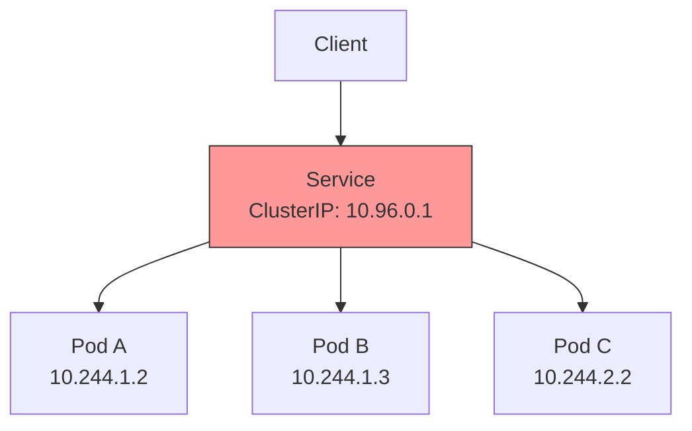

# 5.4.1 Services: ClusterIP, NodePort, and LoadBalancer – Exposing Pods to the Network

#### Why Services Matter

Pods are ephemeral – they come and go, with new IP addresses each time. A **Service** provides a stable endpoint (IP and DNS name) that abstracts the underlying pods. Services enable:

* **Load balancing** across multiple pod replicas

* **Service discovery** via DNS (`my-service.namespace.svc.cluster.local`)

* **External access** to applications (NodePort, LoadBalancer)

This note covers Service types. Note 5.4.2 covers Ingress and Gateway API; note 5.4.3 covers Network Policies; note 5.4.4 is the subchapter review.

**Backward references:** Pod labels from 5.3.1 (selector matching); DNS from Module 2 (CoreDNS provides service discovery); iptables from Module 2 (kube-proxy uses iptables).

***

## Part 1: Service Overview



### Service Types

| Type                    | Access Scope                       | Use Case                         |
| ----------------------- | ---------------------------------- | -------------------------------- |
| **ClusterIP** (default) | Inside cluster only                | Internal communication           |
| **NodePort**            | Node's IP: high port (30000-32767) | External access without cloud LB |
| **LoadBalancer**        | Cloud provider LB (AWS NLB/ALB)    | Production external access       |
| **ExternalName**        | DNS CNAME redirect                 | Access external services         |
| **Headless**            | `clusterIP: None`                  | Direct pod access (StatefulSet)  |

***

## Part 2: ClusterIP – Internal Service

ClusterIP is the default service type, accessible only within the cluster.

```yaml
# clusterip-service.yaml
apiVersion: v1
kind: Service
metadata:
  name: backend-service
spec:
  type: ClusterIP
  selector:
    app: backend
    tier: api
  ports:
  - port: 8080          # Service port
    targetPort: 80      # Pod port (defaults to port if omitted)
    protocol: TCP
    name: http
  - port: 9090
    targetPort: 9090
    name: metrics
```

```bash
# Create service
kubectl apply -f clusterip-service.yaml

# View service
kubectl get svc backend-service
# NAME              TYPE        CLUSTER-IP    PORT(S)             AGE
# backend-service   ClusterIP   10.96.123.45  8080/TCP,9090/TCP   10s

# Service DNS (within cluster)
# backend-service.default.svc.cluster.local
# backend-service.default (short form)
# backend-service (very short, same namespace)

# Test from another pod
kubectl run test --rm -it --image=busybox -- /bin/sh
/ # wget -qO- http://backend-service:8080
```

### Service Endpoints

Services maintain a list of pod IPs that match the selector.

```bash
# View endpoints
kubectl get endpoints backend-service
# NAME              ENDPOINTS                               AGE
# backend-service   10.244.1.2:80,10.244.1.3:80,10.244.2.2:80   10s

# Describe service
kubectl describe svc backend-service
# Name:              backend-service
# Namespace:         default
# Labels:            <none>
# Annotations:       <none>
# Selector:          app=backend,tier=api
# Type:              ClusterIP
# IP Family Policy:  SingleStack
# IP Families:       IPv4
# IP:                10.96.123.45
# IPs:               10.96.123.45
# Port:              http  8080/TCP
# TargetPort:        80/TCP
# Endpoints:         10.244.1.2:80,10.244.1.3:80,10.244.2.2:80
```

***

## Part 3: NodePort – External Access via Node IP

NodePort exposes the service on each node's IP at a static port (30000-32767).

```yaml
# nodeport-service.yaml
apiVersion: v1
kind: Service
metadata:
  name: web-service
spec:
  type: NodePort
  selector:
    app: web
  ports:
  - port: 80
    targetPort: 80
    nodePort: 30080    # Optional (if omitted, Kubernetes assigns)
    protocol: TCP
```

```bash
# Create service
kubectl apply -f nodeport-service.yaml

# View service
kubectl get svc web-service
# NAME           TYPE       CLUSTER-IP      PORT(S)        AGE
# web-service    NodePort   10.96.123.46    80:30080/TCP   10s

# Access from outside
curl http://<any-node-ip>:30080

# Get node IPs
kubectl get nodes -o wide
# Access via any node's IP (traffic routes to pods on any node)
```

**How NodePort works:**

1. kube-proxy creates iptables rule on every node
2. Traffic to `nodeIP:30080` is DNATed to pod IPs
3. Works even if no pod runs on that node (kube-proxy forwards)

***

## Part 4: LoadBalancer – Cloud Native External Access

LoadBalancer integrates with cloud providers (AWS, GCP, Azure) to provision an external load balancer.

```yaml
# loadbalancer-service.yaml
apiVersion: v1
kind: Service
metadata:
  name: api-service
  annotations:
    service.beta.kubernetes.io/aws-load-balancer-type: "nlb"  # AWS NLB
    service.beta.kubernetes.io/aws-load-balancer-cross-zone-load-balancing-enabled: "true"
spec:
  type: LoadBalancer
  selector:
    app: api
  ports:
  - port: 443
    targetPort: 8443
    protocol: TCP
  loadBalancerSourceRanges:  # Restrict source IPs
  - "10.0.0.0/8"
  - "192.168.0.0/16"
```

```bash
# Create service
kubectl apply -f loadbalancer-service.yaml

# View service (wait for external IP)
kubectl get svc api-service -w
# NAME           TYPE           CLUSTER-IP      EXTERNAL-IP     PORT(S)         AGE
# api-service    LoadBalancer   10.96.123.47    pending         443:30081/TCP   5s
# api-service    LoadBalancer   10.96.123.47    a1b2c3d4.elb.amazonaws.com   443:30081/TCP   30s

# Access via LB DNS
curl https://a1b2c3d4.elb.amazonaws.com
```

### Cloud Provider Annotations

**AWS (EKS):**

```yaml
metadata:
  annotations:
    service.beta.kubernetes.io/aws-load-balancer-type: "nlb"  # NLB (vs elb for classic)
    service.beta.kubernetes.io/aws-load-balancer-internal: "true"  # Internal LB
    service.beta.kubernetes.io/aws-load-balancer-ssl-cert: "arn:aws:acm:..."
```

**GCP (GKE):**

```yaml
metadata:
  annotations:
    cloud.google.com/load-balancer-type: "Internal"
    networking.gke.io/internal-load-balancer-allow-global-access: "true"
```

**Azure (AKS):**

```yaml
metadata:
  annotations:
    service.beta.kubernetes.io/azure-load-balancer-internal: "true"
    service.beta.kubernetes.io/azure-load-balancer-resource-group: "my-rg"
```

***

## Part 5: ExternalName Service

ExternalName maps a service to an external DNS name.

```yaml
# externalname-service.yaml
apiVersion: v1
kind: Service
metadata:
  name: external-db
spec:
  type: ExternalName
  externalName: database.example.com
```

```bash
# Within cluster, pods can connect to external-db.default.svc.cluster.local
# Traffic resolves to database.example.com (CNAME)

# Verify
kubectl get svc external-db
# NAME           TYPE           EXTERNAL-NAME           PORT(S)   AGE
# external-db    ExternalName   database.example.com    <none>    10s
```

***

## Part 6: Headless Service

A headless service has `clusterIP: None`. It returns pod IPs directly instead of a single VIP.

```yaml
# headless-service.yaml
apiVersion: v1
kind: Service
metadata:
  name: cassandra
spec:
  clusterIP: None  # Headless
  selector:
    app: cassandra
  ports:
  - port: 9042
    targetPort: 9042
```

```bash
# DNS lookup returns pod IPs directly
kubectl run -it --rm debug --image=busybox -- nslookup cassandra
# Server:    10.96.0.10
# Address 1: 10.96.0.10 kube-dns.kube-system.svc.cluster.local
# Name:      cassandra.default.svc.cluster.local
# Address 1: 10.244.1.2 cassandra-0.cassandra.default.svc.cluster.local
# Address 2: 10.244.2.3 cassandra-1.cassandra.default.svc.cluster.local
```

**Use case:** StatefulSets need headless services for stable network identities.

***

## Part 7: Service Discovery (DNS)

CoreDNS provides DNS-based service discovery.

```bash
# DNS naming convention
<service-name>.<namespace>.svc.cluster.local

# Examples
backend-service.default.svc.cluster.local
backend-service.default  # Short form (same namespace)
backend-service          # Very short (same namespace)

# Cross-namespace access
backend-service.production.svc.cluster.local

# Pod DNS (if hostname set)
pod-0.cassandra.default.svc.cluster.local
```

### Testing DNS

```bash
# Run debug pod
kubectl run -it --rm debug --image=busybox -- /bin/sh

# Test DNS
nslookup kubernetes.default
# Server:    10.96.0.10
# Address 1: 10.96.0.10 kube-dns.kube-system.svc.cluster.local
# Name:      kubernetes.default.svc.cluster.local
# Address 1: 10.96.0.1

# Test service in same namespace
nslookup backend-service

# Test service in different namespace
nslookup backend-service.production
```

***

## Part 8: Service Troubleshooting

### Common Issues

**Issue 1: Service endpoints empty**

```bash
# Check endpoints
kubectl get endpoints my-service

# Check pod labels match selector
kubectl get pods --show-labels

# Fix selector in service
kubectl edit svc my-service
```

**Issue 2: Cannot connect from outside (NodePort)**

```bash
# Check NodePort value
kubectl get svc my-service

# Verify firewall on node allows port
sudo iptables -L -n | grep 30080

# Test from node itself
curl localhost:30080
```

**Issue 3: LoadBalancer pending forever**

```bash
# Check cloud provider integration
kubectl describe svc my-service | grep -A 10 Events

# Common causes:
# - Cloud provider not configured (EKS/GKE/AKS)
# - Insufficient permissions (IAM role)
# - Service annotations incorrect
```

**Issue 4: Service DNS not resolving**

```bash
# Check CoreDNS pods
kubectl get pods -n kube-system | grep coredns

# Check CoreDNS logs
kubectl logs -n kube-system coredns-xxxxx

# Check DNS ConfigMap
kubectl get cm -n kube-system coredns -o yaml
```

***

## Quick Task: Expose an Application

*Create a deployment and expose it using different service types.*

1. Create a deployment `nginx` with 3 replicas.
2. Expose it as ClusterIP service.
3. Test internal access using a temporary pod.
4. Change the service to NodePort and access from outside.
5. (If on cloud) Change to LoadBalancer.

> **Ready Solution:**
>
> ```bash
> # Task 1
> kubectl create deployment nginx --image=nginx --replicas=3
>
> # Task 2
> kubectl expose deployment nginx --port=80 --target-port=80 --type=ClusterIP --name=nginx-clusterip
>
> # Task 3
> kubectl run test --rm -it --image=busybox -- wget -qO- http://nginx-clusterip
>
> # Task 4
> kubectl delete svc nginx-clusterip
> kubectl expose deployment nginx --port=80 --target-port=80 --type=NodePort --name=nginx-nodeport
> kubectl get svc nginx-nodeport
> # Access via: curl http://<node-ip>:<node-port>
>
> # Task 5 (cloud only)
> kubectl expose deployment nginx --port=80 --target-port=80 --type=LoadBalancer --name=nginx-lb
> kubectl get svc nginx-lb -w
> ```

***

## Summary Table: Service Types

| Type             | Access            | Use Case                         | DNS           |
| ---------------- | ----------------- | -------------------------------- | ------------- |
| **ClusterIP**    | Internal only     | Service-to-service communication | Yes           |
| **NodePort**     | Node IP:high port | External access (dev/test)       | Yes           |
| **LoadBalancer** | Cloud LB          | Production external access       | Yes           |
| **ExternalName** | External DNS      | Access external services         | Yes (CNAME)   |
| **Headless**     | Pod IPs directly  | StatefulSets                     | Yes (pod IPs) |

### Service Ports

| Field        | Meaning                   | Default        |
| ------------ | ------------------------- | -------------- |
| `port`       | Service port (cluster IP) | Required       |
| `targetPort` | Pod port                  | Same as `port` |
| `nodePort`   | Node port (NodePort type) | 30000-32767    |

### Service Troubleshooting Commands

| Command                                                        | Purpose                  |
| -------------------------------------------------------------- | ------------------------ |
| `kubectl get svc`                                              | List services            |
| `kubectl get endpoints`                                        | Check pod IPs in service |
| `kubectl describe svc NAME`                                    | Detailed service info    |
| `kubectl run test --image=busybox -- wget -qO- http://service` | Test internal access     |
| `kubectl get pods --show-labels`                               | Verify selector matches  |

***

**Next note (5.4.2)** will cover **Ingress, Ingress Controllers, and Gateway API** – L7 routing, host/path-based routing, TLS termination, and the modern Gateway API.

**Backward references:**

* Pod labels from 5.3.1 (service selectors)

* DNS from Module 2 (CoreDNS and service discovery)

* iptables from Module 2 (kube-proxy implementation)

* Load balancing concepts from Module 2 (L4 vs L7)
