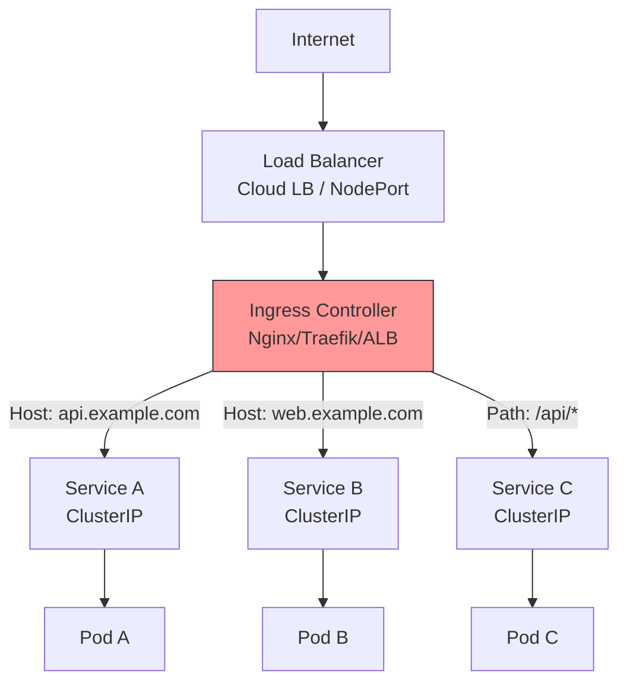
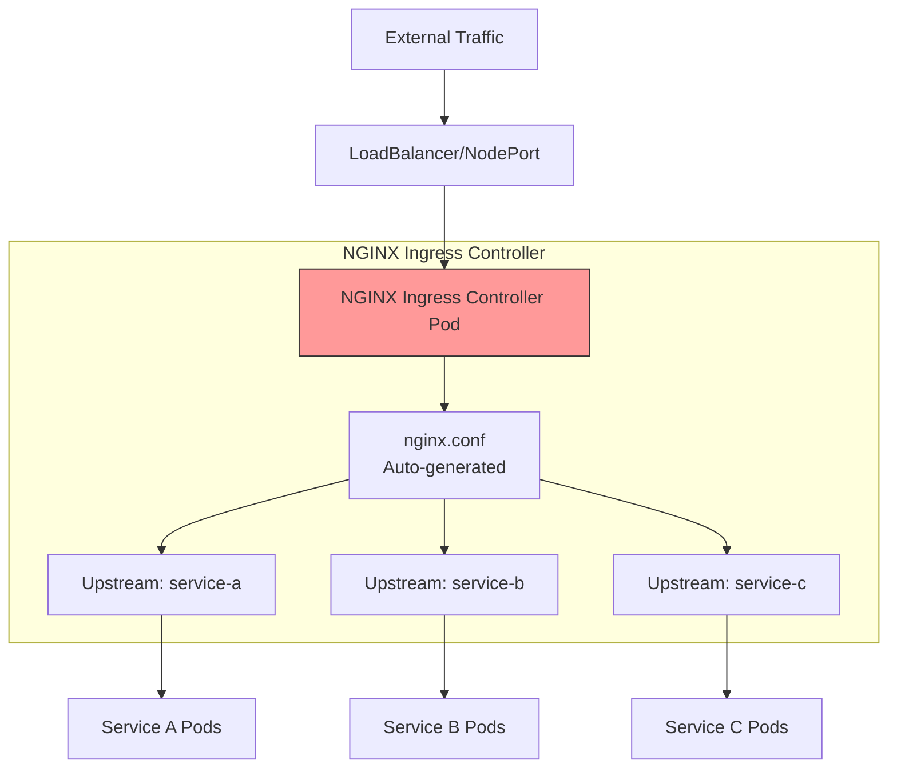
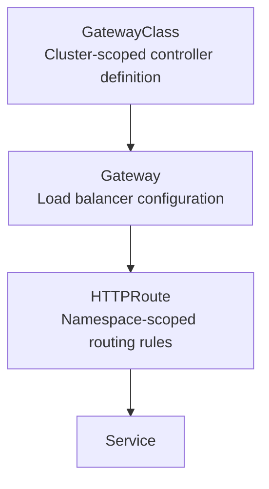

# 5.4.2 Ingress, Ingress Controllers, and Gateway API: L7 Routing to Services

#### Why Ingress Matters

NodePort and LoadBalancer services operate at Layer 4 (TCP/UDP). Each service needs its own load balancer – expensive and inflexible. **Ingress** provides Layer 7 (HTTP/HTTPS) routing:

* **Host-based routing** – `api.example.com` → API service, `web.example.com` → Web service

* **Path-based routing** – `example.com/api/*` → API service, `example.com/*` → Web service

* **TLS termination** – Centralized certificate management

* **Single load balancer** for many services

This note covers Ingress resources, Ingress controllers, and the modern Gateway API. Note 5.4.1 covered Services; note 5.4.3 covers Network Policies; note 5.4.4 covers DNS/CoreDNS; note 5.4.5 is the subchapter review.

**Backlinks:** [5.4.1 - Services](./5.4.1_Services_ClusterIP_NodePort_LoadBalancer.md) (Ingress routes to Services) | [Module 2 - TLS](../../2-Networking/Subchapter_2.2/2.2.2_HTTP_and_HTTPS_Deep_Dive.md) (certificates) | [Module 2 - DNS](../../2-Networking/Subchapter_2.4/2.4.1_DNS_and_DHCP.md)

***

## Part 1: Ingress Architecture



### Components

| Component              | Responsibility                                                |
| ---------------------- | ------------------------------------------------------------- |
| **Ingress Resource**   | YAML definition of routing rules (host, path, TLS)            |
| **Ingress Controller** | Pod that implements the rules (Nginx, Traefik, AWS ALB, etc.) |
| **Load Balancer**      | External entry point (cloud LB or NodePort)                   |

***

## Part 2: Installing an Ingress Controller

### Nginx Ingress Controller (Most Common)

```bash
# Install via kubectl (bare metal / cloud with NodePort)
kubectl apply -f https://raw.githubusercontent.com/kubernetes/ingress-nginx/controller-v1.9.0/deploy/static/provider/baremetal/deploy.yaml

# For cloud with LoadBalancer (AWS, GCP, Azure)
kubectl apply -f https://raw.githubusercontent.com/kubernetes/ingress-nginx/controller-v1.9.0/deploy/static/provider/cloud/deploy.yaml

# Verify installation
kubectl get pods -n ingress-nginx
# NAME                                        READY   STATUS    RESTARTS   AGE
# ingress-nginx-controller-xxxxx              1/1     Running   0          2m

kubectl get svc -n ingress-nginx
# NAME                                 TYPE           CLUSTER-IP     EXTERNAL-IP     PORT(S)
# ingress-nginx-controller             LoadBalancer   10.96.123.45    a1b2c3.elb.amazonaws.com   80:30080/TCP,443:30443/TCP
```

### Ingress Controller Types

| Controller  | Best For             | Features                          |
| ----------- | -------------------- | --------------------------------- |
| **Nginx**   | General purpose      | Stable, feature-rich, most common |
| **Traefik** | Dynamic environments | Automatic config, Let's Encrypt   |
| **AWS ALB** | AWS EKS              | Native AWS integration            |
| **GCE**     | GKE                  | Google-managed                    |
| **HAProxy** | Performance          | High throughput                   |
| **Contour** | Envoy-based          | Advanced routing                  |

***

## Part 3: Basic Ingress Resource

```yaml
# ingress-basic.yaml
apiVersion: networking.k8s.io/v1
kind: Ingress
metadata:
  name: simple-ingress
  annotations:
    kubernetes.io/ingress.class: nginx
spec:
  rules:
  - host: myapp.example.com
    http:
      paths:
      - path: /
        pathType: Prefix
        backend:
          service:
            name: web-service
            port:
              number: 80
```

```bash
# Create ingress
kubectl apply -f ingress-basic.yaml

# List ingress resources
kubectl get ingress
# NAME              CLASS    HOSTS               ADDRESS         PORTS   AGE
# simple-ingress    nginx    myapp.example.com   a1b2c3.elb...   80      10s

# Describe ingress
kubectl describe ingress simple-ingress
```

***

## Part 4: Advanced Ingress Examples

### Host-Based Routing

```yaml
# ingress-host-routing.yaml
apiVersion: networking.k8s.io/v1
kind: Ingress
metadata:
  name: host-routing
  annotations:
    kubernetes.io/ingress.class: nginx
spec:
  rules:
  - host: api.example.com
    http:
      paths:
      - path: /
        pathType: Prefix
        backend:
          service:
            name: api-service
            port:
              number: 80
  - host: web.example.com
    http:
      paths:
      - path: /
        pathType: Prefix
        backend:
          service:
            name: web-service
            port:
              number: 80
  - host: admin.example.com
    http:
      paths:
      - path: /
        pathType: Prefix
        backend:
          service:
            name: admin-service
            port:
              number: 80
```

### Path-Based Routing

```yaml
# ingress-path-routing.yaml
apiVersion: networking.k8s.io/v1
kind: Ingress
metadata:
  name: path-routing
spec:
  rules:
  - host: example.com
    http:
      paths:
      - path: /api
        pathType: Prefix
        backend:
          service:
            name: api-service
            port:
              number: 8080
      - path: /static
        pathType: Prefix
        backend:
          service:
            name: static-service
            port:
              number: 80
      - path: /
        pathType: Prefix
        backend:
          service:
            name: web-service
            port:
              number: 80
```

### Path Types

| PathType                   | Behavior                                                 |
| -------------------------- | -------------------------------------------------------- |
| **Exact**                  | Matches exactly (e.g., `/foo` only)                      |
| **Prefix**                 | Matches prefix (e.g., `/foo` matches `/foo`, `/foo/bar`) |
| **ImplementationSpecific** | Controller decides                                       |

### TLS Termination

```yaml
# ingress-tls.yaml
apiVersion: networking.k8s.io/v1
kind: Ingress
metadata:
  name: tls-ingress
spec:
  tls:
  - hosts:
    - secure.example.com
    secretName: example-tls-secret
  rules:
  - host: secure.example.com
    http:
      paths:
      - path: /
        pathType: Prefix
        backend:
          service:
            name: secure-service
            port:
              number: 80
```

```bash
# Create TLS secret
kubectl create secret tls example-tls-secret \
  --cert=path/to/tls.crt \
  --key=path/to/tls.key

# Or use cert-manager for automatic certificate management
```

***

## Part 5: Ingress Annotations

Annotations customize Ingress controller behavior.

### NGINX Ingress Controller Deep Dive

#### NGINX Ingress Architecture



#### NGINX Ingress ConfigMap (Global Settings)

```yaml
# nginx-ingress-configmap.yaml
apiVersion: v1
kind: ConfigMap
metadata:
  name: nginx-configuration
  namespace: ingress-nginx
data:
  # Proxy settings
  proxy-body-size: "100m"
  proxy-read-timeout: "120"
  proxy-send-timeout: "120"
  proxy-connect-timeout: "60"
  
  # Keep-alive
  keep-alive: "75"
  keep-alive-requests: "1000"
  
  # Logging
  log-format-upstream: '$remote_addr - $remote_user [$time_local] "$request" $status $body_bytes_sent "$http_referer" "$http_user_agent" $request_length $request_time [$proxy_upstream_name] $upstream_addr $upstream_response_length $upstream_response_time $upstream_status $req_id'
  
  # SSL
  ssl-protocols: "TLSv1.2 TLSv1.3"
  ssl-ciphers: "ECDHE-ECDSA-AES128-GCM-SHA256:ECDHE-RSA-AES128-GCM-SHA256"
  
  # Performance
  worker-processes: "auto"
  max-worker-connections: "16384"
  
  # Security headers
  add-headers: "ingress-nginx/custom-headers"
```

### Nginx Ingress Annotations (Complete Reference)

```yaml
metadata:
  annotations:
    # === URL REWRITING ===
    nginx.ingress.kubernetes.io/rewrite-target: /
    nginx.ingress.kubernetes.io/rewrite-target: /$2  # Capture groups
    nginx.ingress.kubernetes.io/use-regex: "true"
    nginx.ingress.kubernetes.io/app-root: /app      # Redirect / to /app
    
    # === SSL/TLS ===
    nginx.ingress.kubernetes.io/ssl-redirect: "true"
    nginx.ingress.kubernetes.io/force-ssl-redirect: "true"
    nginx.ingress.kubernetes.io/ssl-passthrough: "true"  # Pass TLS to backend
    nginx.ingress.kubernetes.io/backend-protocol: "HTTPS" # Backend uses HTTPS
    nginx.ingress.kubernetes.io/ssl-ciphers: "ECDHE-RSA-AES256-GCM-SHA384"
    
    # === AUTHENTICATION ===
    # Basic Auth
    nginx.ingress.kubernetes.io/auth-type: basic
    nginx.ingress.kubernetes.io/auth-secret: basic-auth
    nginx.ingress.kubernetes.io/auth-realm: "Authentication Required"
    
    # External Auth (OAuth2 Proxy)
    nginx.ingress.kubernetes.io/auth-url: "https://oauth2-proxy.example.com/oauth2/auth"
    nginx.ingress.kubernetes.io/auth-signin: "https://oauth2-proxy.example.com/oauth2/start"
    nginx.ingress.kubernetes.io/auth-response-headers: "X-Auth-User, X-Auth-Email"
    
    # === RATE LIMITING ===
    nginx.ingress.kubernetes.io/limit-rps: "10"           # Requests per second
    nginx.ingress.kubernetes.io/limit-rpm: "100"          # Requests per minute
    nginx.ingress.kubernetes.io/limit-connections: "5"     # Concurrent connections
    nginx.ingress.kubernetes.io/limit-whitelist: "192.168.1.0/24,10.0.0.0/8"
    
    # === CORS ===
    nginx.ingress.kubernetes.io/enable-cors: "true"
    nginx.ingress.kubernetes.io/cors-allow-origin: "https://example.com, https://app.example.com"
    nginx.ingress.kubernetes.io/cors-allow-methods: "GET, POST, PUT, DELETE, OPTIONS"
    nginx.ingress.kubernetes.io/cors-allow-headers: "Authorization, Content-Type"
    nginx.ingress.kubernetes.io/cors-allow-credentials: "true"
    nginx.ingress.kubernetes.io/cors-max-age: "3600"
    
    # === PROXY SETTINGS ===
    nginx.ingress.kubernetes.io/proxy-body-size: "50m"
    nginx.ingress.kubernetes.io/proxy-read-timeout: "300"
    nginx.ingress.kubernetes.io/proxy-send-timeout: "300"
    nginx.ingress.kubernetes.io/proxy-connect-timeout: "60"
    nginx.ingress.kubernetes.io/proxy-buffer-size: "8k"
    nginx.ingress.kubernetes.io/proxy-buffering: "on"
    
    # === WEBSOCKET ===
    nginx.ingress.kubernetes.io/websocket-services: "websocket-service"
    nginx.ingress.kubernetes.io/proxy-http-version: "1.1"
    
    # === SESSION AFFINITY (Sticky Sessions) ===
    nginx.ingress.kubernetes.io/affinity: "cookie"
    nginx.ingress.kubernetes.io/session-cookie-name: "INGRESSCOOKIE"
    nginx.ingress.kubernetes.io/session-cookie-expires: "172800"
    nginx.ingress.kubernetes.io/session-cookie-max-age: "172800"
    nginx.ingress.kubernetes.io/session-cookie-path: "/"
    nginx.ingress.kubernetes.io/session-cookie-samesite: "Strict"
    
    # === LOAD BALANCING ===
    nginx.ingress.kubernetes.io/upstream-hash-by: "$request_uri"
    nginx.ingress.kubernetes.io/load-balance: "round_robin"  # or ewma, least_conn
    
    # === SECURITY HEADERS ===
    nginx.ingress.kubernetes.io/server-snippet: |
      add_header X-Frame-Options "SAMEORIGIN" always;
      add_header X-Content-Type-Options "nosniff" always;
      add_header X-XSS-Protection "1; mode=block" always;
    
    # === CUSTOM NGINX CONFIG ===
    nginx.ingress.kubernetes.io/configuration-snippet: |
      more_set_headers "X-Custom-Header: value";
      if ($request_uri ~* "^/old-path") {
        return 301 https://$host/new-path$is_args$args;
      }
    
    # === CANARY DEPLOYMENTS ===
    nginx.ingress.kubernetes.io/canary: "true"
    nginx.ingress.kubernetes.io/canary-weight: "20"        # 20% traffic
    nginx.ingress.kubernetes.io/canary-by-header: "X-Canary"
    nginx.ingress.kubernetes.io/canary-by-header-value: "always"
    nginx.ingress.kubernetes.io/canary-by-cookie: "canary"
    
    # === ERROR PAGES ===
    nginx.ingress.kubernetes.io/default-backend: "error-page-service"
    nginx.ingress.kubernetes.io/custom-http-errors: "404,503"
```

### Canary Deployments with NGINX Ingress

```yaml
# Primary Ingress
apiVersion: networking.k8s.io/v1
kind: Ingress
metadata:
  name: production
spec:
  rules:
  - host: app.example.com
    http:
      paths:
      - path: /
        pathType: Prefix
        backend:
          service:
            name: production-svc
            port:
              number: 80

---
# Canary Ingress (20% traffic)
apiVersion: networking.k8s.io/v1
kind: Ingress
metadata:
  name: canary
  annotations:
    nginx.ingress.kubernetes.io/canary: "true"
    nginx.ingress.kubernetes.io/canary-weight: "20"
spec:
  rules:
  - host: app.example.com
    http:
      paths:
      - path: /
        pathType: Prefix
        backend:
          service:
            name: canary-svc
            port:
              number: 80
```

### External Authentication with OAuth2 Proxy

```yaml
# ingress-with-oauth.yaml
apiVersion: networking.k8s.io/v1
kind: Ingress
metadata:
  name: protected-app
  annotations:
    nginx.ingress.kubernetes.io/auth-url: "https://oauth2-proxy.example.com/oauth2/auth"
    nginx.ingress.kubernetes.io/auth-signin: "https://oauth2-proxy.example.com/oauth2/start?rd=$scheme://$host$request_uri"
    nginx.ingress.kubernetes.io/auth-response-headers: "X-Auth-User, X-Auth-Email, X-Auth-Groups"
spec:
  rules:
  - host: protected.example.com
    http:
      paths:
      - path: /
        pathType: Prefix
        backend:
          service:
            name: protected-app
            port:
              number: 80
```

### Rewrite Target Example

```yaml
# ingress-rewrite.yaml
apiVersion: networking.k8s.io/v1
kind: Ingress
metadata:
  name: rewrite-ingress
  annotations:
    nginx.ingress.kubernetes.io/rewrite-target: /$2
spec:
  rules:
  - host: example.com
    http:
      paths:
      - path: /api(/|$)(.*)
        pathType: Prefix
        backend:
          service:
            name: api-service
            port:
              number: 8080
```

**Effect:** `example.com/api/users` → `api-service:8080/users` (strips `/api`)

***

## Part 6: Default Backend (404 Page)

```yaml
# ingress-with-default-backend.yaml
apiVersion: networking.k8s.io/v1
kind: Ingress
metadata:
  name: with-default-backend
spec:
  defaultBackend:
    service:
      name: custom-404-service
      port:
        number: 80
  rules:
  - host: example.com
    http:
      paths:
      - path: /api
        pathType: Prefix
        backend:
          service:
            name: api-service
            port:
              number: 80
```

***

## Part 7: Ingress Troubleshooting

### Debugging Ingress

```bash
# 1. Check Ingress resource
kubectl get ingress
kubectl describe ingress my-ingress

# 2. Check Ingress Controller logs
kubectl logs -n ingress-nginx deployment/ingress-nginx-controller

# 3. Check if services are reachable (bypass ingress)
kubectl run test --rm -it --image=curlimages/curl -- curl http://web-service

# 4. Test Ingress directly (using NodePort or port-forward)
kubectl port-forward -n ingress-nginx service/ingress-nginx-controller 8080:80
curl -H "Host: myapp.example.com" http://localhost:8080

# 5. Check annotations for syntax errors
kubectl get ingress my-ingress -o yaml | grep -A 10 annotations
```

### Common Issues

| Issue                     | Likely Cause                   | Fix                                       |
| ------------------------- | ------------------------------ | ----------------------------------------- |
| 404 Not Found             | Wrong service name or port     | Check service exists and port matches     |
| 502 Bad Gateway           | Pod not ready                  | Check pod status, readiness probes        |
| TLS error                 | Certificate expired or invalid | Renew cert, check secret name             |
| Host not routing          | Missing host header            | Use correct domain, check DNS             |
| Controller not responding | Ingress controller not running | Check `kubectl get pods -n ingress-nginx` |

***

## Part 8: Gateway API – The Modern Replacement

**Gateway API** is the successor to Ingress, offering more features and role-based access.

### Gateway API vs Ingress

| Feature                  | Ingress         | Gateway API                              |
| ------------------------ | --------------- | ---------------------------------------- |
| **Resource model**       | Single resource | Gateway, HTTPRoute, GatewayClass         |
| **Role separation**      | Limited         | Cross-namespace routing, team separation |
| **Protocol support**     | HTTP/HTTPS      | HTTP, HTTPS, TCP, UDP, TLS               |
| **Header-based routing** | Limited         | Full support                             |
| **Traffic splitting**    | Annotations     | Native (weights)                         |
| **Status**               | GA (stable)     | GA (v1.0 in 2023)                        |

### Gateway API Resources



### Gateway API Example

```yaml
# gatewayclass.yaml
apiVersion: gateway.networking.k8s.io/v1
kind: GatewayClass
metadata:
  name: nginx-gateway
spec:
  controllerName: gateway.envoyproxy.io/gatewayclass-controller

---
# gateway.yaml
apiVersion: gateway.networking.k8s.io/v1
kind: Gateway
metadata:
  name: my-gateway
spec:
  gatewayClassName: nginx-gateway
  listeners:
  - name: http
    protocol: HTTP
    port: 80
    allowedRoutes:
      namespaces:
        from: All

---
# httproute.yaml
apiVersion: gateway.networking.k8s.io/v1
kind: HTTPRoute
metadata:
  name: app-route
spec:
  parentRefs:
  - name: my-gateway
  hostnames:
  - "example.com"
  rules:
  - matches:
    - path:
        type: PathPrefix
        value: /api
    backendRefs:
    - name: api-service
      port: 8080
      weight: 90
    - name: api-service-canary
      port: 8080
      weight: 10
  - matches:
    - path:
        type: PathPrefix
        value: /
    backendRefs:
    - name: web-service
      port: 80
```

### Installing Gateway API

```bash
# Install Gateway API CRDs
kubectl apply -f https://github.com/kubernetes-sigs/gateway-api/releases/download/v1.0.0/standard-install.yaml

# Install a Gateway controller (e.g., Envoy Gateway)
kubectl apply -f https://github.com/envoyproxy/gateway/releases/latest/download/install.yaml
```

***

## Quick Task: Deploy an Ingress

*Deploy an application and expose it via Ingress.*

1. Create two deployments: `web` and `api`.
2. Create ClusterIP services for both.
3. Create an Ingress with host `myapp.local` routing:

   * `/api/*` → api-service

   * `/*` → web-service
4. Test the Ingress (using port-forward or actual domain).

> **Ready Solution:**
>
> ```bash
> # Task 1-2
> kubectl create deployment web --image=nginx --port=80
> kubectl expose deployment web --port=80 --name=web-service
>
> kubectl create deployment api --image=nginx --port=80
> kubectl expose deployment api --port=80 --name=api-service
>
> # Task 3
> cat << EOF | kubectl apply -f -
> apiVersion: networking.k8s.io/v1
> kind: Ingress
> metadata:
>   name: myapp-ingress
>   annotations:
>     kubernetes.io/ingress.class: nginx
>     nginx.ingress.kubernetes.io/rewrite-target: /\$2
> spec:
>   rules:
>   - host: myapp.local
>     http:
>       paths:
>       - path: /api(/|$)(.*)
>         pathType: Prefix
>         backend:
>           service:
>             name: api-service
>             port:
>               number: 80
>       - path: /
>         pathType: Prefix
>         backend:
>           service:
>             name: web-service
>             port:
>               number: 80
> EOF
>
> # Task 4 (test with port-forward)
> kubectl port-forward -n ingress-nginx service/ingress-nginx-controller 8080:80 &
> curl -H "Host: myapp.local" http://localhost:8080/api/test
> ```

***

## Summary Table: Ingress vs Gateway API

| Feature               | Ingress     | Gateway API                                          |
| --------------------- | ----------- | ---------------------------------------------------- |
| **Status**            | GA (stable) | GA (v1.0)                                            |
| **Resources**         | Ingress     | GatewayClass, Gateway, HTTPRoute, TCPRoute, TLSRoute |
| **Role separation**   | Limited     | Full (cluster vs namespace)                          |
| **Traffic splitting** | Annotations | Native weights                                       |
| **Cross-namespace**   | Limited     | Yes                                                  |
| **Protocols**         | HTTP/HTTPS  | HTTP, HTTPS, TCP, UDP, TLS                           |
| **Header matching**   | Limited     | Full                                                 |

### Ingress Annotations Quick Reference

| Annotation                                       | Purpose           |
| ------------------------------------------------ | ----------------- |
| `nginx.ingress.kubernetes.io/rewrite-target`     | URL rewriting     |
| `nginx.ingress.kubernetes.io/ssl-redirect`       | Force HTTPS       |
| `nginx.ingress.kubernetes.io/limit-rps`          | Rate limiting     |
| `nginx.ingress.kubernetes.io/auth-type`          | Basic auth        |
| `nginx.ingress.kubernetes.io/proxy-body-size`    | Max upload size   |
| `nginx.ingress.kubernetes.io/websocket-services` | WebSocket support |
| `nginx.ingress.kubernetes.io/affinity`           | Sticky sessions   |

### Ingress Troubleshooting Commands

| Command                                                         | Purpose                  |
| --------------------------------------------------------------- | ------------------------ |
| `kubectl get ingress`                                           | List ingress resources   |
| `kubectl describe ingress NAME`                                 | Detailed info            |
| `kubectl logs -n ingress-nginx deploy/ingress-nginx-controller` | Controller logs          |
| `kubectl get svc -n ingress-nginx`                              | Check controller service |
| `curl -H "Host: domain" http://ingress-ip`                      | Test manually            |

***

**Next note (5.4.3)** will cover **Network Policies** – pod-to-pod isolation, ingress/egress rules, and CNI requirements.

**Backlinks:** [5.4.1 - Services](./5.4.1_Services_ClusterIP_NodePort_LoadBalancer.md) | [5.4.3 - Network Policies](./5.4.3_Network_Policies.md) | [5.4.4 - CoreDNS](./5.4.4_DNS_Basics_and_CoreDNS.md) | [Module 2 - TLS/SSL](../../2-Networking/Subchapter_2.4/2.4.1_HTTP_HTTPS_and_curl_wget.md) | [Module 2 - DNS](../../2-Networking/Subchapter_2.2/2.2.2_DNS_Deep_Dive.md)
