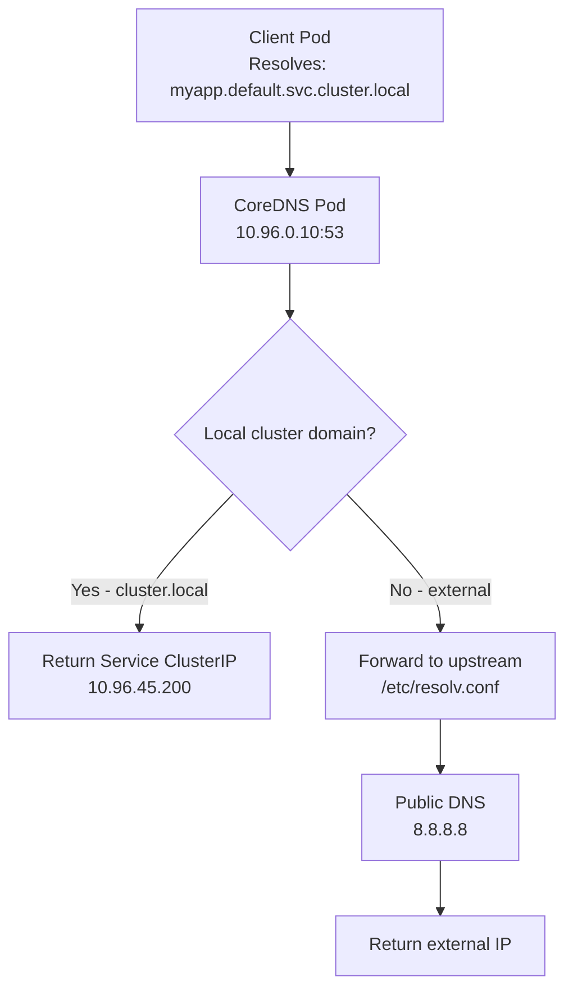
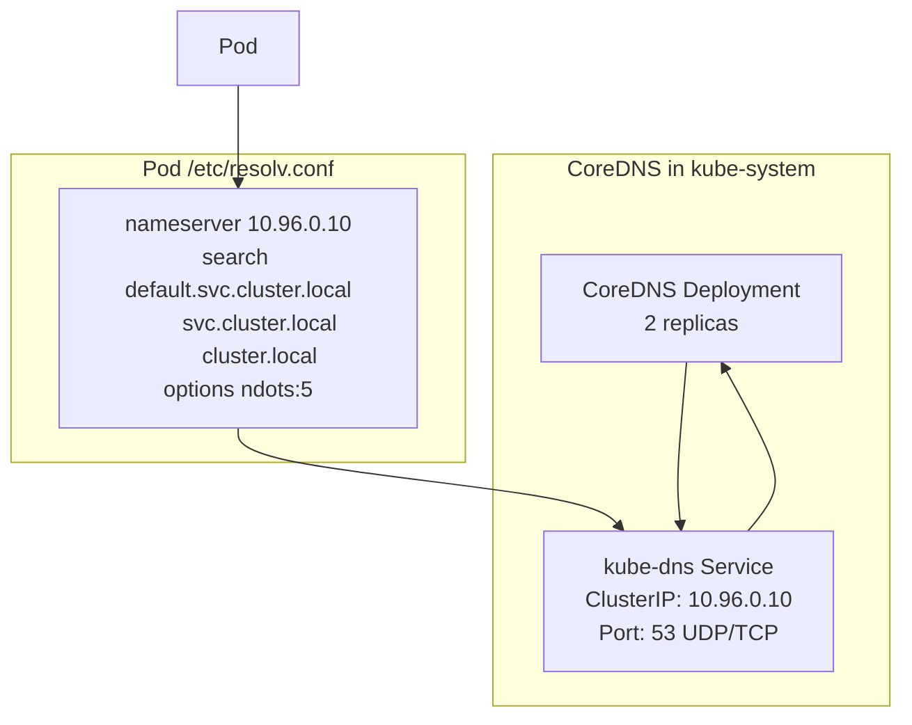

# 5.4.4 DNS Basics and CoreDNS: Service Discovery in Kubernetes

#### Why DNS Matters in Kubernetes

Every service and pod needs to find each other without hardcoding IP addresses. IP addresses change when pods restart. **CoreDNS** solves this by providing:

* **Service discovery** – `my-service.namespace.svc.cluster.local`
* **Pod DNS** – `10-244-1-5.default.pod.cluster.local`
* **External name resolution** – Routes external DNS via upstream resolvers
* **Custom DNS policies** – Per-pod DNS configuration

This note covers DNS fundamentals and CoreDNS deep dive. Note 5.4.1 covered Services; note 5.4.2 covered Ingress; note 5.4.3 covered Network Policies; note 5.4.5 is the subchapter review.

**Backlinks:** [5.4.1 - Services](./5.4.1_Services_ClusterIP_NodePort_LoadBalancer.md) | [5.4.3 - Network Policies](./5.4.3_Network_Policies.md) | [5.3.1 - Pod Fundamentals](../Subchapter_5.3/5.3.1_Pod_Fundamentals_and_Lifecycle.md) | [Module 2 - DNS](../../2-Networking/Subchapter_2.2/2.2.2_DNS_Deep_Dive.md)

---

## Part 1: DNS Fundamentals Recap



### DNS Resolution Chain

```
Pod request → /etc/resolv.conf → CoreDNS (10.96.0.10)
                                      ↓
                           Kubernetes DNS zones
                            cluster.local → K8s Service records
                            in-addr.arpa  → Reverse DNS
                                      ↓
                           Forward to upstream (if not cluster)
                            → /etc/resolv.conf from node
                            → 8.8.8.8 or custom nameservers
```

### DNS Record Types Used

| Type | Purpose | Example |
|------|---------|---------|
| **A** | IPv4 address lookup | `myservice.default.svc.cluster.local → 10.96.1.5` |
| **AAAA** | IPv6 address lookup | (IPv6 clusters) |
| **CNAME** | Alias to another name | ExternalName services |
| **SRV** | Service/port discovery | `_http._tcp.myservice.default.svc.cluster.local` |
| **PTR** | Reverse lookup (IP → name) | `5.1.96.10.in-addr.arpa → myservice.default.svc.cluster.local` |

---

## Part 2: Kubernetes DNS Naming Convention

### Service DNS Names

```bash
# Full FQDN format
<service-name>.<namespace>.svc.<cluster-domain>

# Default cluster domain = cluster.local
myservice.default.svc.cluster.local

# Across namespaces
myservice.production.svc.cluster.local

# Short forms (within same namespace)
myservice.default        # Within same namespace
myservice                # Very short (same namespace only)
```

### Pod DNS Names

```bash
# Pod DNS (when hostname and subdomain are set)
<pod-hostname>.<subdomain>.<namespace>.svc.<cluster-domain>

# Example for StatefulSet:
cassandra-0.cassandra.default.svc.cluster.local
cassandra-1.cassandra.default.svc.cluster.local

# Pod with IP-based name (default)
10-244-1-5.default.pod.cluster.local  # for pod IP 10.244.1.5
```

### SRV Records

```bash
# SRV record for named port
_<port-name>._<protocol>.<service>.<namespace>.svc.cluster.local

# Example: Service with named port "http"
_http._tcp.myservice.default.svc.cluster.local
# Returns: priority weight port hostname
```

---

## Part 3: CoreDNS Architecture



### CoreDNS Components

| Component | Purpose |
|-----------|---------|
| **CoreDNS Deployment** | DNS server pods (typically 2 replicas) |
| **kube-dns Service** | Stable endpoint (ClusterIP: 10.96.0.10) |
| **ConfigMap: coredns** | Corefile configuration |
| **kubernetes plugin** | Answers for cluster.local zone |
| **forward plugin** | Forwards external queries upstream |

---

## Part 4: CoreDNS Corefile Configuration

```bash
# View current CoreDNS config
kubectl get configmap -n kube-system coredns -o yaml
```

### Default Corefile

```
.:53 {
    errors                          # Log errors
    health {                        # Health check endpoint
       lameduck 5s
    }
    ready                           # Ready check (:8181)
    kubernetes cluster.local in-addr.arpa ip6.arpa {  # Serve K8s DNS
       pods insecure                # Enable pod DNS
       fallthrough in-addr.arpa ip6.arpa
       ttl 30                       # TTL for records
    }
    prometheus :9153                # Metrics endpoint
    forward . /etc/resolv.conf {   # Forward unknown to upstream
       max_concurrent 1000
    }
    cache 30                        # Cache responses 30s
    loop                            # Detect forwarding loops
    reload                          # Auto-reload config
    loadbalance                     # Round-robin load balancing
}
```

### Customizing CoreDNS Corefile

```yaml
# Add custom DNS zone for internal service
apiVersion: v1
kind: ConfigMap
metadata:
  name: coredns
  namespace: kube-system
data:
  Corefile: |
    .:53 {
        errors
        health
        ready
        kubernetes cluster.local in-addr.arpa ip6.arpa {
            pods insecure
            fallthrough in-addr.arpa ip6.arpa
        }
        
        # Custom zone for internal domain
        mycompany.internal:53 {
            file /etc/coredns/mycompany.internal.db
        }
        
        # Forward specific domain to custom DNS
        consul.service:53 {
            forward . 10.100.0.2:8600
        }
        
        prometheus :9153
        forward . 8.8.8.8 8.8.4.4 {
            max_concurrent 1000
        }
        cache 30
        loop
        reload
        loadbalance
    }
```

```bash
# Apply changes
kubectl apply -f coredns-configmap.yaml
# CoreDNS auto-reloads (via reload plugin) within 2 minutes
# Or force restart:
kubectl rollout restart deployment -n kube-system coredns
```

---

## Part 5: Pod DNS Policy

Each pod can specify its DNS policy.

```yaml
apiVersion: v1
kind: Pod
metadata:
  name: dns-example
spec:
  dnsPolicy: ClusterFirst  # Default
  # dnsPolicy options:
  # ClusterFirst (default) - Route cluster DNS to CoreDNS, external to upstream
  # ClusterFirstWithHostNet - Same as ClusterFirst but for hostNetwork pods
  # Default - Use node's /etc/resolv.conf (NOT the default!)
  # None - Custom DNS config only (use dnsConfig)
  
  dnsConfig:
    nameservers:
    - 1.1.1.1
    - 8.8.8.8
    searches:
    - my-namespace.svc.cluster.local
    - svc.cluster.local
    - cluster.local
    options:
    - name: ndots
      value: "5"
    - name: timeout
      value: "2"
```

### DNS Policy Comparison

| Policy | Nameserver | Search Domains | Use Case |
|--------|-----------|----------------|----------|
| `ClusterFirst` | CoreDNS | Cluster + node | Default for all pods |
| `ClusterFirstWithHostNet` | CoreDNS | Cluster + node | hostNetwork pods |
| `Default` | Node's `/etc/resolv.conf` | Node's | Pods needing node DNS |
| `None` | Defined in `dnsConfig` | Defined in `dnsConfig` | Custom DNS setup |

---

## Part 6: /etc/resolv.conf in Pods

```bash
# View DNS config inside a pod
kubectl exec mypod -- cat /etc/resolv.conf
# nameserver 10.96.0.10          ← CoreDNS service IP
# search default.svc.cluster.local svc.cluster.local cluster.local
# options ndots:5

# What ndots:5 means:
# If a name has fewer than 5 dots, try with search domains first
# myservice → myservice.default.svc.cluster.local (found!)
# api.example.com → api.example.com.default.svc.cluster.local (not found)
#                 → api.example.com.svc.cluster.local (not found)
#                 → api.example.com.cluster.local (not found)
#                 → api.example.com (external lookup)
```

---

## Part 7: ndots Performance Optimization

The default `ndots:5` in Kubernetes causes **massive DNS query amplification** for external domain lookups. This is the #1 DNS performance problem in production clusters.

### The Problem

With `ndots:5`, any name with fewer than 5 dots is first tried with every search domain:

```bash
# Pod resolves "api.example.com" (2 dots < 5 = ndots)
# Kubernetes generates 5 DNS queries:
1. api.example.com.default.svc.cluster.local  → NXDOMAIN
2. api.example.com.svc.cluster.local          → NXDOMAIN
3. api.example.com.cluster.local              → NXDOMAIN
4. api.example.com.us-east-1.compute.internal → NXDOMAIN  (if AWS)
5. api.example.com                            → RESOLVED ✓

# That's 5x the queries for ONE external lookup!
# At 1000 pods doing 100 lookups/sec = 500,000 unnecessary DNS queries/sec
```

### The Fix: Reduce `ndots` or Use FQDNs

**Option 1: Lower `ndots` for pods that mostly call external services:**

```yaml
# pod-with-low-ndots.yaml
apiVersion: v1
kind: Pod
metadata:
  name: external-caller
spec:
  dnsConfig:
    options:
    - name: ndots
      value: "2"    # Only try search domains if < 2 dots
  containers:
  - name: app
    image: myapp:latest
```

With `ndots:2`, `api.example.com` (2 dots) goes directly to external resolution — **1 query instead of 5**.

**Option 2: Use trailing dot (FQDN) in application code:**

```yaml
# In application config
DB_HOST: postgres.default.svc.cluster.local.  # Trailing dot = FQDN, skip search
REDIS_HOST: redis.cache.svc.cluster.local.    # No search domain lookups
```

**Option 3: Set `ndots:2` at Deployment level:**

```yaml
# deployment-optimized-dns.yaml
apiVersion: apps/v1
kind: Deployment
metadata:
  name: api-server
spec:
  template:
    spec:
      dnsConfig:
        options:
        - name: ndots
          value: "2"
      containers:
      - name: api
        image: myapp:latest
```

### Impact Measurement

```bash
# Before optimization: Count DNS queries with tcpdump
kubectl exec debug-pod -- tcpdump -i eth0 port 53 -c 20

# After optimization: Measure latency improvement
kubectl exec debug-pod -- time nslookup api.example.com
# Before ndots:2 → 150ms (5 lookups)
# After ndots:2  → 30ms  (1 lookup)
```

### When NOT to Lower ndots

| Scenario | Keep `ndots:5` |
|----------|----------------|
| Pod mainly calls cluster services (`myservice`) | Yes — short names need search domains |
| Pod uses only FQDNs (`svc.ns.svc.cluster.local`) | No — lower ndots is safe |
| Pod mainly calls external APIs | No — lower ndots to 2 |
| Mixed (some cluster, some external) | Use `ndots:2` + FQDNs for cluster services |

***

## Part 8: DNS Troubleshooting

### Test DNS Resolution

```bash
# Test from a debug pod
kubectl run dns-debug --rm -it --image=busybox -- /bin/sh

# Inside pod:
nslookup kubernetes.default
# Server:    10.96.0.10
# Address 1: 10.96.0.10 kube-dns.kube-system.svc.cluster.local
# Name:      kubernetes.default.svc.cluster.local
# Address 1: 10.96.0.1

nslookup myservice.default.svc.cluster.local
nslookup google.com  # External DNS test

# Using dig (more detailed)
kubectl run dns-debug --rm -it --image=nicolaka/netshoot -- bash
dig myservice.default.svc.cluster.local
dig +short myservice.default.svc.cluster.local
```

### CoreDNS Troubleshooting Steps

```bash
# Step 1: Check CoreDNS pods
kubectl get pods -n kube-system -l k8s-app=kube-dns
kubectl describe pods -n kube-system -l k8s-app=kube-dns

# Step 2: Check CoreDNS logs
kubectl logs -n kube-system -l k8s-app=kube-dns

# Step 3: Check kube-dns service
kubectl get svc -n kube-system kube-dns
kubectl get endpoints -n kube-system kube-dns

# Step 4: Enable CoreDNS debug logging
kubectl edit configmap -n kube-system coredns
# Add to Corefile:
# log
# debug

# Step 5: Check DNS from node
dig @<coredns-pod-ip> myservice.default.svc.cluster.local
```

### Common DNS Issues

| Symptom | Cause | Fix |
|---------|-------|-----|
| `nslookup: server can't find myservice` | Service doesn't exist | Check `kubectl get svc` |
| `connection timed out` | CoreDNS pods down | Restart CoreDNS |
| External DNS not resolving | Upstream DNS unreachable | Check node's `/etc/resolv.conf` |
| Slow DNS (5s timeout) | ndots:5 causing many retries | Set `dnsConfig.options: [{name: ndots, value: "2"}]` |
| DNS works for some namespaces | RBAC or NetworkPolicy | Check NetworkPolicy on kube-system |
| `NXDOMAIN` for service | Wrong namespace in query | Use FQDN with namespace |

---

## Part 9: CoreDNS Metrics

```bash
# CoreDNS exposes Prometheus metrics on :9153
kubectl port-forward -n kube-system deployment/coredns 9153:9153
# Access: http://localhost:9153/metrics

# Key metrics:
# coredns_dns_requests_total         - Total DNS requests
# coredns_dns_responses_total        - Total DNS responses by rcode
# coredns_dns_request_duration_seconds - Request latency
# coredns_forward_requests_total     - Forwarded requests
# coredns_cache_hits_total           - Cache hit rate
```

---

## Part 10: DNS for StatefulSets (Stable Network Identity)

```yaml
# StatefulSet with headless service for DNS identity
apiVersion: v1
kind: Service
metadata:
  name: cassandra
spec:
  clusterIP: None  # Headless service
  selector:
    app: cassandra
  ports:
  - port: 9042
---
apiVersion: apps/v1
kind: StatefulSet
metadata:
  name: cassandra
spec:
  serviceName: "cassandra"  # Links to headless service
  replicas: 3
  ...
```

```bash
# DNS names created:
# cassandra-0.cassandra.default.svc.cluster.local → pod-0 IP
# cassandra-1.cassandra.default.svc.cluster.local → pod-1 IP
# cassandra-2.cassandra.default.svc.cluster.local → pod-2 IP

# Test stable DNS
kubectl exec cassandra-0 -- nslookup cassandra-1.cassandra.default.svc.cluster.local
```

---

## Summary Tables

### Kubernetes DNS Naming

| Resource Type | DNS Format |
|--------------|-----------|
| Service | `<name>.<ns>.svc.cluster.local` |
| Headless Service (pod) | `<pod-name>.<svc>.<ns>.svc.cluster.local` |
| Pod (by IP) | `<ip-dashes>.<ns>.pod.cluster.local` |
| ExternalName | Returns CNAME to external name |

### CoreDNS Quick Commands

| Command | Purpose |
|---------|---------|
| `kubectl get cm -n kube-system coredns -o yaml` | View Corefile |
| `kubectl rollout restart deploy -n kube-system coredns` | Restart CoreDNS |
| `kubectl logs -n kube-system -l k8s-app=kube-dns` | CoreDNS logs |
| `kubectl exec pod -- nslookup <service>` | Test DNS from pod |
| `kubectl exec pod -- cat /etc/resolv.conf` | View pod DNS config |

### DNS Policy Quick Reference

| Policy | When to Use |
|--------|------------|
| `ClusterFirst` | Default – most pods |
| `ClusterFirstWithHostNet` | Pods using `hostNetwork: true` |
| `Default` | Pod needs node DNS, not cluster DNS |
| `None` | Fully custom DNS via `dnsConfig` |

---

**Next note (5.4.5)** is the **Subchapter 5.4 Review** – commands, cheatsheet, and scenario-based interview questions for Services, Ingress, Network Policies, and DNS/CoreDNS.

**Backlinks:** [5.4.1 - Services](./5.4.1_Services_ClusterIP_NodePort_LoadBalancer.md) | [5.4.2 - Ingress](./5.4.2_Ingress_Ingress_Controllers_and_Gateway_API.md) | [5.4.3 - Network Policies](./5.4.3_Network_Policies.md) | [5.3.2 - StatefulSets](../Subchapter_5.3/5.3.2_Workload_Controllers_Deployments_StatefulSets_DaemonSets.md) | [Module 2 - DNS](../../2-Networking/Subchapter_2.2/2.2.2_DNS_Deep_Dive.md)
