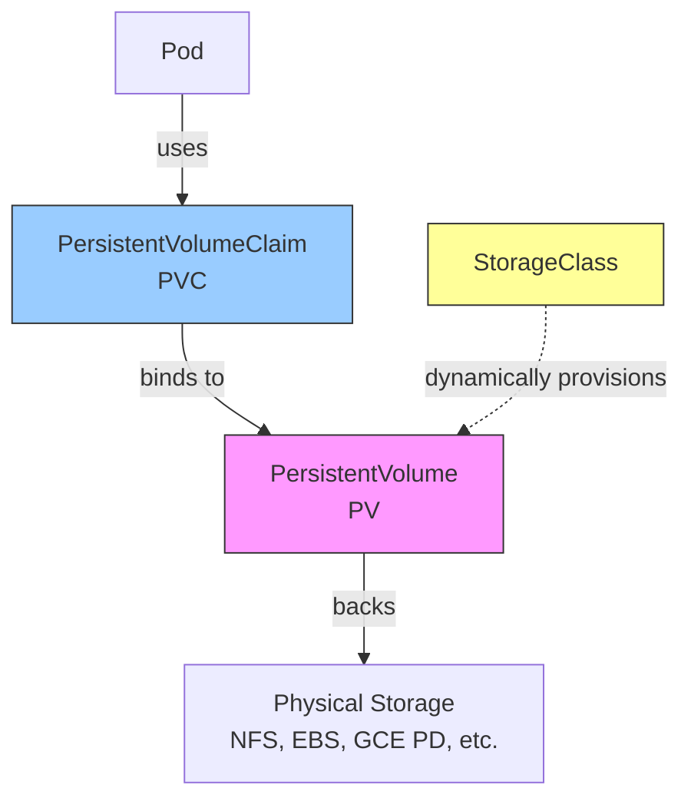
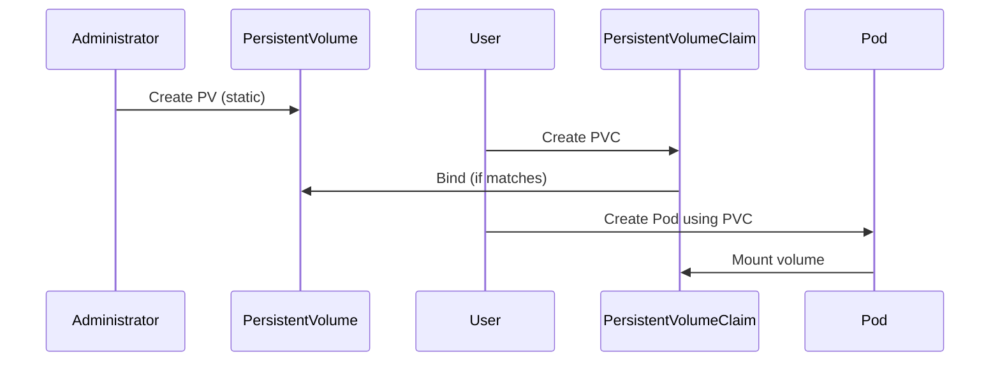
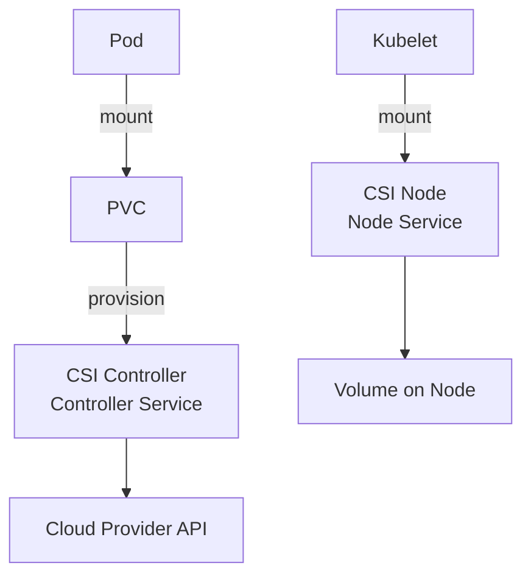
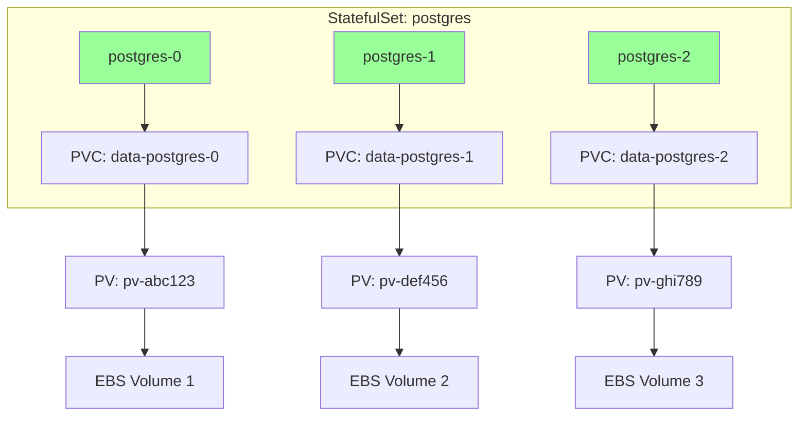

# 5.5.2 PersistentVolumes, PersistentVolumeClaims, and StorageClasses: Long-Term Storage for Stateful Apps

#### Why Persistent Storage Matters

Ephemeral volumes (from 5.5.1) die with pods. Databases, message queues, and stateful applications need storage that outlives pod restarts, survives node failures, and can be moved across nodes. Kubernetes provides:

* **PersistentVolume (PV)** – Cluster storage resource (like a node for storage)

* **PersistentVolumeClaim (PVC)** – Request for storage (like a pod for storage)

* **StorageClass** – Dynamic provisioner (create PVs on demand)

This note covers PV/PVC/StorageClass. Note 5.5.1 covered ephemeral volumes; note 5.5.3 is the subchapter review.

**Backlinks:** [5.3.1 - StatefulSet](../Subchapter_5.3/5.3.1_Pod_Fundamentals_and_Lifecycle.md) (uses PVCs) | [Module 1 - Storage](../../1-Linux/Subchapter_1.1/1.1.1_Linux_Filesystem_Hierarchy.md) (NFS concepts)

***

## Part 1: Persistent Storage Architecture



### Components

| Component        | Scope     | Purpose                                  |
| ---------------- | --------- | ---------------------------------------- |
| **PV**           | Cluster   | Storage resource (administrator creates) |
| **PVC**          | Namespace | Storage request (user creates)           |
| **StorageClass** | Cluster   | Dynamic provisioner configuration        |
| **CSI Driver**   | Cluster   | Storage vendor integration               |

### PV/PVC Lifecycle



***

## Part 2: Static Provisioning (Pre-created PV)

Administrator creates PVs manually; users claim them with PVCs.

### PersistentVolume YAML

```yaml
# pv-hostpath.yaml (for testing/minikube)
apiVersion: v1
kind: PersistentVolume
metadata:
  name: pv-hostpath-10g
  labels:
    type: local
spec:
  capacity:
    storage: 10Gi
  volumeMode: Filesystem
  accessModes:
    - ReadWriteOnce
  persistentVolumeReclaimPolicy: Retain
  storageClassName: manual
  hostPath:
    path: /mnt/data
```

```yaml
# pv-nfs.yaml (production example)
apiVersion: v1
kind: PersistentVolume
metadata:
  name: pv-nfs-100g
spec:
  capacity:
    storage: 100Gi
  accessModes:
    - ReadWriteMany
  persistentVolumeReclaimPolicy: Retain
  storageClassName: nfs
  nfs:
    server: 192.168.1.100
    path: /exports/data
```

### PersistentVolumeClaim YAML

```yaml
# pvc.yaml
apiVersion: v1
kind: PersistentVolumeClaim
metadata:
  name: my-pvc
  namespace: default
spec:
  accessModes:
    - ReadWriteOnce
  resources:
    requests:
      storage: 5Gi
  storageClassName: manual
  selector:
    matchLabels:
      type: local
```

### Pod Using PVC

```yaml
# pod-with-pvc.yaml
apiVersion: v1
kind: Pod
metadata:
  name: pvc-demo
spec:
  containers:
  - name: app
    image: nginx
    volumeMounts:
    - name: data
      mountPath: /usr/share/nginx/html
  volumes:
  - name: data
    persistentVolumeClaim:
      claimName: my-pvc
```

### PV Access Modes

| Mode                        | Description              | Supported By                 |
| --------------------------- | ------------------------ | ---------------------------- |
| **ReadWriteOnce (RWO)**     | Single node read/write   | Most storage (EBS, hostPath) |
| **ReadOnlyMany (ROX)**      | Many nodes read-only     | NFS, CephFS                  |
| **ReadWriteMany (RWX)**     | Many nodes read/write    | NFS, CephFS, EFS             |
| **ReadWriteOncePod (RWOP)** | Single pod (1.22+ alpha) | CSI drivers                  |

### PV Reclaim Policies

| Policy      | Behavior                                        |
| ----------- | ----------------------------------------------- |
| **Retain**  | PV retained after PVC deletion (manual cleanup) |
| **Delete**  | PV and underlying storage deleted with PVC      |
| **Recycle** | Deprecated (scrub and reuse)                    |

```bash
# Check PV/PVC status
kubectl get pv
kubectl get pvc

# Delete PVC (PV behavior depends on reclaim policy)
kubectl delete pvc my-pvc

# Manually delete retained PV
kubectl delete pv pv-hostpath-10g
```

***

## Part 3: Dynamic Provisioning (StorageClass)

StorageClass enables on-demand PV creation.

### StorageClass YAML

```yaml
# storageclass-gp2.yaml (AWS EBS)
apiVersion: storage.k8s.io/v1
kind: StorageClass
metadata:
  name: gp2
provisioner: kubernetes.io/aws-ebs
parameters:
  type: gp2
  fsType: ext4
reclaimPolicy: Delete
volumeBindingMode: WaitForFirstConsumer
allowVolumeExpansion: true
```

```yaml
# storageclass-standard.yaml (GCE PD)
apiVersion: storage.k8s.io/v1
kind: StorageClass
metadata:
  name: standard
provisioner: kubernetes.io/gce-pd
parameters:
  type: pd-standard
  replication-type: none
```

```yaml
# storageclass-local.yaml (local SSD – no dynamic provisioning)
apiVersion: storage.k8s.io/v1
kind: StorageClass
metadata:
  name: local-ssd
provisioner: kubernetes.io/no-provisioner
volumeBindingMode: WaitForFirstConsumer
```

### PVC with Dynamic Provisioning

```yaml
# pvc-dynamic.yaml
apiVersion: v1
kind: PersistentVolumeClaim
metadata:
  name: dynamic-pvc
spec:
  accessModes:
    - ReadWriteOnce
  resources:
    requests:
      storage: 20Gi
  storageClassName: gp2  # Uses StorageClass for dynamic provisioning
```

```bash
# Create PVC – PV automatically created
kubectl apply -f pvc-dynamic.yaml

# Check dynamically created PV
kubectl get pv
# NAME                                       CAPACITY   ACCESS MODES   RECLAIM POLICY   STATUS   CLAIM
# pvc-abc123-def456-789...                   20Gi       RWO            Delete           Bound    default/dynamic-pvc
```

### StorageClass Parameters

| Cloud Provider     | Provisioner                    | Common Parameters                     |
| ------------------ | ------------------------------ | ------------------------------------- |
| **AWS**            | `kubernetes.io/aws-ebs`        | `type: gp2/gp3/io1`, `iopsPerGB: 10`  |
| **GCP**            | `kubernetes.io/gce-pd`         | `type: pd-standard/pd-ssd`            |
| **Azure**          | `kubernetes.io/azure-disk`     | `storageaccounttype: StandardSSD_LRS` |
| **vSphere**        | `kubernetes.io/vsphere-volume` | `diskformat: thin`                    |
| **NFS (external)** | `nfs.csi.k8s.io`               | `server`, `share`                     |

***

## Part 4: StorageClass Features

### Volume Binding Mode

| Mode                     | Behavior                                                       |
| ------------------------ | -------------------------------------------------------------- |
| **Immediate** (default)  | PV created immediately (may bind to wrong zone)                |
| **WaitForFirstConsumer** | PV created when pod using PVC is scheduled (respects topology) |

```yaml
volumeBindingMode: WaitForFirstConsumer  # Recommended for zonal storage
```

### Allow Volume Expansion

```yaml
allowVolumeExpansion: true
```

```bash
# Expand PVC (if StorageClass supports it)
kubectl edit pvc my-pvc
# Change storage: 20Gi to 30Gi

# Check expansion progress
kubectl get pvc my-pvc
# STATUS: FilesystemResizePending (then Bound)
```

### Default StorageClass

```bash
# Set default StorageClass
kubectl patch storageclass gp2 -p '{"metadata": {"annotations":{"storageclass.kubernetes.io/is-default-class":"true"}}}'

# PVC without storageClassName uses default
kubectl get storageclass
# NAME   PROVISIONER             AGE
# gp2    kubernetes.io/aws-ebs   10d
# standard (default) kubernetes.io/gce-pd  10d
```

***

## Part 5: CSI (Container Storage Interface)

CSI is the modern standard for storage drivers.

### CSI Architecture



### Common CSI Drivers

| Vendor         | Driver                   | Features                   |
| -------------- | ------------------------ | -------------------------- |
| **AWS EBS**    | `ebs.csi.aws.com`        | Snapshot, resize, topology |
| **GCP PD**     | `pd.csi.storage.gke.io`  | Snapshot, resize           |
| **Azure Disk** | `disk.csi.azure.com`     | Snapshot, resize           |
| **NFS**        | `nfs.csi.k8s.io`         | RWX volumes                |
| **Ceph RBD**   | `rbd.csi.ceph.com`       | RWO, RWX                   |
| **vSphere**    | `csi.vsphere.vmware.com` | Snapshots                  |

### Installing CSI Driver (AWS EBS Example)

```bash
# Install AWS EBS CSI driver
kubectl apply -k "github.com/kubernetes-sigs/aws-ebs-csi-driver/deploy/kubernetes/overlays/stable/?ref=master"

# Verify installation
kubectl get pods -n kube-system | grep ebs-csi

# Create StorageClass using CSI
cat << EOF | kubectl apply -f -
apiVersion: storage.k8s.io/v1
kind: StorageClass
metadata:
  name: ebs-csi-gp3
provisioner: ebs.csi.aws.com
parameters:
  type: gp3
  iops: "3000"
  throughput: "125"
reclaimPolicy: Delete
volumeBindingMode: WaitForFirstConsumer
allowVolumeExpansion: true
EOF
```

***

## Part 6: StatefulSet with PVC Templates (Deep Dive)

StatefulSets automatically create PVCs for each pod using `volumeClaimTemplates`. Understanding this is critical for databases and stateful workloads.

### StatefulSet Storage Architecture



### Complete StatefulSet with PVC Templates

```yaml
# statefulset-with-pvc.yaml
apiVersion: apps/v1
kind: StatefulSet
metadata:
  name: postgres
spec:
  serviceName: postgres
  replicas: 3
  selector:
    matchLabels:
      app: postgres
  
  # Pod management policy
  podManagementPolicy: OrderedReady  # or Parallel
  
  # Update strategy
  updateStrategy:
    type: RollingUpdate
    rollingUpdate:
      partition: 0  # Update all pods (set higher to pause update)
  
  template:
    metadata:
      labels:
        app: postgres
    spec:
      terminationGracePeriodSeconds: 30
      
      # Init container for ownership
      initContainers:
      - name: fix-permissions
        image: busybox
        command: ['sh', '-c', 'chown -R 999:999 /var/lib/postgresql/data']
        volumeMounts:
        - name: data
          mountPath: /var/lib/postgresql/data
      
      containers:
      - name: postgres
        image: postgres:15
        ports:
        - containerPort: 5432
          name: postgres
        
        env:
        - name: POSTGRES_PASSWORD
          valueFrom:
            secretKeyRef:
              name: postgres-secret
              key: password
        - name: PGDATA
          value: /var/lib/postgresql/data/pgdata
        
        resources:
          requests:
            cpu: 500m
            memory: 1Gi
          limits:
            cpu: 2
            memory: 4Gi
        
        volumeMounts:
        - name: data
          mountPath: /var/lib/postgresql/data
        - name: config
          mountPath: /etc/postgresql/postgresql.conf
          subPath: postgresql.conf
        
        # Probes
        livenessProbe:
          exec:
            command: ['pg_isready', '-U', 'postgres']
          initialDelaySeconds: 30
          periodSeconds: 10
        readinessProbe:
          exec:
            command: ['pg_isready', '-U', 'postgres']
          initialDelaySeconds: 5
          periodSeconds: 5
      
      volumes:
      - name: config
        configMap:
          name: postgres-config
  
  # PVC Templates - creates unique PVC per pod
  volumeClaimTemplates:
  - metadata:
      name: data
      labels:
        app: postgres
    spec:
      accessModes: ["ReadWriteOnce"]
      storageClassName: gp2
      resources:
        requests:
          storage: 100Gi
```

### Headless Service for StatefulSet

```yaml
# headless-service.yaml
apiVersion: v1
kind: Service
metadata:
  name: postgres
  labels:
    app: postgres
spec:
  clusterIP: None  # Headless
  selector:
    app: postgres
  ports:
  - port: 5432
    targetPort: 5432
    name: postgres
```

### PVC Lifecycle with StatefulSets

```bash
# PVCs are created automatically
kubectl get pvc
# NAME               STATUS   VOLUME               CAPACITY   AGE
# data-postgres-0    Bound    pvc-abc123...        100Gi      2m
# data-postgres-1    Bound    pvc-def456...        100Gi      2m
# data-postgres-2    Bound    pvc-ghi789...        100Gi      2m

# Scaling up creates new PVCs
kubectl scale statefulset postgres --replicas=5
kubectl get pvc
# data-postgres-3    Bound    pvc-jkl012...        100Gi      30s
# data-postgres-4    Bound    pvc-mno345...        100Gi      30s

# IMPORTANT: Scaling down does NOT delete PVCs!
kubectl scale statefulset postgres --replicas=2
kubectl get pvc
# All 5 PVCs still exist (data preserved)

# Manually delete PVCs if needed
kubectl delete pvc data-postgres-2 data-postgres-3 data-postgres-4
```

### StatefulSet Pod DNS Names

```bash
# Each pod gets a stable DNS name
# Format: <pod-name>.<service-name>.<namespace>.svc.cluster.local

postgres-0.postgres.default.svc.cluster.local
postgres-1.postgres.default.svc.cluster.local
postgres-2.postgres.default.svc.cluster.local

# Test DNS resolution
kubectl run -it --rm debug --image=busybox -- nslookup postgres-0.postgres.default
```

### StatefulSet Scaling Operations

| Operation | PVC Behavior | Pod Behavior |
|-----------|--------------|--------------|
| Scale Up | New PVCs created | New pods created (ordered) |
| Scale Down | PVCs retained | Pods deleted (reverse order) |
| Delete StatefulSet | PVCs retained | All pods deleted |
| Delete StatefulSet + PVCs | PVCs deleted | All pods deleted |

```bash
# Scale with ordering
kubectl scale statefulset postgres --replicas=5
# Creates: postgres-3, then postgres-4

# Canary update using partition
kubectl patch statefulset postgres -p '{"spec":{"updateStrategy":{"rollingUpdate":{"partition":2}}}}'
# Only postgres-2, postgres-3, postgres-4 will be updated

# Delete StatefulSet but keep PVCs
kubectl delete statefulset postgres --cascade=orphan

# Delete StatefulSet and PVCs
kubectl delete statefulset postgres
kubectl delete pvc -l app=postgres
```

### StatefulSet with Multiple PVCs

```yaml
# statefulset-multi-pvc.yaml
spec:
  volumeClaimTemplates:
  - metadata:
      name: data
    spec:
      accessModes: ["ReadWriteOnce"]
      storageClassName: fast-ssd
      resources:
        requests:
          storage: 100Gi
  - metadata:
      name: logs
    spec:
      accessModes: ["ReadWriteOnce"]
      storageClassName: standard
      resources:
        requests:
          storage: 20Gi
```

```bash
# Results in PVCs:
# data-postgres-0, logs-postgres-0
# data-postgres-1, logs-postgres-1
# data-postgres-2, logs-postgres-2
```

***

## Part 7: Volume Snapshots and Restore

CSI drivers support volume snapshots.

```yaml
# volumesnapshotclass.yaml
apiVersion: snapshot.storage.k8s.io/v1
kind: VolumeSnapshotClass
metadata:
  name: ebs-snapshot-class
driver: ebs.csi.aws.com
deletionPolicy: Delete

---
# volumesnapshot.yaml
apiVersion: snapshot.storage.k8s.io/v1
kind: VolumeSnapshot
metadata:
  name: postgres-snapshot
spec:
  volumeSnapshotClassName: ebs-snapshot-class
  source:
    persistentVolumeClaimName: data-postgres-0

---
# restore-pvc.yaml (restore from snapshot)
apiVersion: v1
kind: PersistentVolumeClaim
metadata:
  name: restored-pvc
spec:
  accessModes:
    - ReadWriteOnce
  storageClassName: gp2
  resources:
    requests:
      storage: 10Gi
  dataSource:
    name: postgres-snapshot
    kind: VolumeSnapshot
    apiGroup: snapshot.storage.k8s.io
```

```bash
# Create snapshot
kubectl apply -f volumesnapshotclass.yaml
kubectl apply -f volumesnapshot.yaml

# Check snapshot status
kubectl get volumesnapshot
# NAME                  READYTOUSE   AGE
# postgres-snapshot     true         10s

# Restore from snapshot
kubectl apply -f restore-pvc.yaml
```

***

## Part 8: Troubleshooting PV/PVC

### Common Issues

**Issue 1: PVC stuck in Pending**

```bash
# Describe PVC for events
kubectl describe pvc my-pvc

# Common causes:
# - No PV matching storage class and size
# - No StorageClass provisioner
# - StorageClass volumeBindingMode: WaitForFirstConsumer (pod not scheduled yet)

# Fix: Create matching PV or check StorageClass
```

**Issue 2: Pod stuck in ContainerCreating (volume mount)**

```bash
# Describe pod for events
kubectl describe pod my-pod

# Check if PVC is bound
kubectl get pvc

# Check node can access storage (EBS zone mismatch)
kubectl describe pv pv-name | grep "Node Affinity"
```

**Issue 3: Volume expansion not working**

```bash
# Check StorageClass allowVolumeExpansion
kubectl get storageclass gp2 -o yaml | grep allowVolumeExpansion

# Check filesystem needs resize
kubectl exec my-pod -- df -h /mount-path

# Resize filesystem manually (if auto-resize fails)
kubectl exec my-pod -- resize2fs /dev/xxx
```

**Issue 4: PVC deletion stuck (finalizers)**

```bash
# Remove finalizer (force delete)
kubectl patch pvc my-pvc -p '{"metadata":{"finalizers":null}}'
```

***

## Quick Task: Persistent Storage Practice

*Create and use persistent storage.*

1. Create a StorageClass (or use default).
2. Create a PVC requesting 5Gi storage.
3. Verify PVC is bound.
4. Create a pod that uses the PVC to store data.
5. Delete the pod, recreate it, and verify data persists.

> **Ready Solution:**
>
> ```bash
> # Task 1 (if no default StorageClass, create local PV for testing)
> minikube addons enable storage-provisioner
>
> # Task 2
> cat << EOF | kubectl apply -f -
> apiVersion: v1
> kind: PersistentVolumeClaim
> metadata:
>   name: test-pvc
> spec:
>   accessModes:
>     - ReadWriteOnce
>   resources:
>     requests:
>       storage: 5Gi
> EOF
>
> # Task 3
> kubectl get pvc test-pvc
> # STATUS should be Bound
>
> # Task 4
> cat << EOF | kubectl apply -f -
> apiVersion: v1
> kind: Pod
> metadata:
>   name: test-pod
> spec:
>   containers:
>   - name: app
>     image: busybox
>     command: ['sh', '-c', 'echo "Persistent data" > /data/test.txt && sleep 3600']
>     volumeMounts:
>     - name: data
>       mountPath: /data
>   volumes:
>   - name: data
>     persistentVolumeClaim:
>       claimName: test-pvc
> EOF
>
> # Task 5
> kubectl delete pod test-pod
> cat << EOF | kubectl apply -f -
> apiVersion: v1
> kind: Pod
> metadata:
>   name: test-pod-2
> spec:
>   containers:
>   - name: app
>     image: busybox
>     command: ['sh', '-c', 'cat /data/test.txt && sleep 3600']
>     volumeMounts:
>     - name: data
>       mountPath: /data
>   volumes:
>   - name: data
>     persistentVolumeClaim:
>       claimName: test-pvc
> EOF
>
> kubectl logs test-pod-2
> # Output: Persistent data
> ```

***

## Summary Table: PV/PVC Components

| Component        | Scope     | Created By | Purpose                    |
| ---------------- | --------- | ---------- | -------------------------- |
| **PV**           | Cluster   | Admin      | Storage resource           |
| **PVC**          | Namespace | User       | Storage request            |
| **StorageClass** | Cluster   | Admin      | Dynamic provisioner config |

### Access Modes

| Mode             | Abbr | Single Node  | Many Nodes |
| ---------------- | ---- | ------------ | ---------- |
| ReadWriteOnce    | RWO  | Read/Write   | No         |
| ReadOnlyMany     | ROX  | Read         | Read       |
| ReadWriteMany    | RWX  | Read/Write   | Read/Write |
| ReadWriteOncePod | RWOP | One pod only | No         |

### PV Reclaim Policies

| Policy    | Behavior                   |
| --------- | -------------------------- |
| `Retain`  | PV kept for manual cleanup |
| `Delete`  | PV and storage deleted     |
| `Recycle` | Deprecated                 |

### StorageClass Parameters

| Cloud     | Provisioner                    | Example                           |
| --------- | ------------------------------ | --------------------------------- |
| AWS       | `kubernetes.io/aws-ebs`        | `type: gp3`                       |
| GCP       | `kubernetes.io/gce-pd`         | `type: pd-ssd`                    |
| Azure     | `kubernetes.io/azure-disk`     | `storageaccounttype: Premium_LRS` |
| vSphere   | `kubernetes.io/vsphere-volume` | `diskformat: thin`                |
| NFS (CSI) | `nfs.csi.k8s.io`               | `server: nfs.example.com`         |

***

**Next note (5.5.3)** will be the Subchapter Review for Storage, including a cheatsheet and scenario-based interview questions.

**Backlinks:** [5.3.1 - StatefulSet](../Subchapter_5.3/5.3.1_Pod_Fundamentals_and_Lifecycle.md) (volumeClaimTemplates) | [5.5.1 - Ephemeral Volumes](./5.5.1_Ephemeral_Volumes_emptydir_hostPath.md) (PVC volume type)
