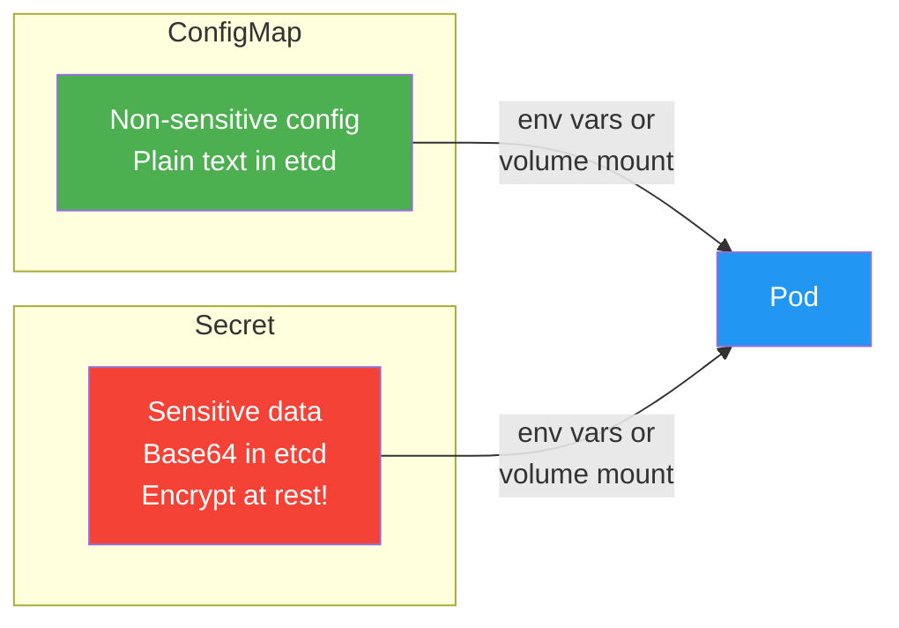

# 5.6.1 ConfigMaps and Secrets: Managing Configuration and Sensitive Data

#### Why ConfigMaps and Secrets Matter

Hardcoding configuration into container images is an anti-pattern. It prevents:

* Using different configs across environments (dev/staging/prod)

* Rotating credentials without rebuilding images

* Sharing configuration across multiple pods

**ConfigMaps** store non-sensitive configuration (key-value pairs, files).\
**Secrets** store sensitive data (passwords, tokens, TLS certificates) with encoding and optional encryption.

This note covers ConfigMaps and Secrets. Note 5.6.2 covers autoscaling; note 5.6.3 is the subchapter review.

**Backlinks:** [5.3.1 - Workloads](../Subchapter_5.3/5.3.1_Pod_Fundamentals_and_Lifecycle.md) (Pods) | [Module 1 - Env Vars](../../1-Linux/Subchapter_1.1/1.1.2_Environment_Variables_and_Shell_Initialization.md) | [5.5.1 - Volumes](../Subchapter_5.5/5.5.1_Ephemeral_Volumes_emptydir_hostPath.md)

***

### ConfigMap vs Secret



## Part 1: ConfigMaps – Non-Sensitive Configuration

### Creating ConfigMaps

```bash
# From literal values
kubectl create configmap app-config --from-literal=DB_HOST=postgres.default.svc.cluster.local --from-literal=DB_PORT=5432

# From file
kubectl create configmap app-config --from-file=./app.properties

# From directory (each file becomes a key)
kubectl create configmap app-config --from-file=./configs/

# From env file (KEY=value format)
kubectl create configmap app-config --from-env-file=./app.env
```

### ConfigMap YAML

```yaml
# configmap.yaml
apiVersion: v1
kind: ConfigMap
metadata:
  name: app-config
  namespace: default
data:
  DB_HOST: postgres.default.svc.cluster.local
  DB_PORT: "5432"
  LOG_LEVEL: info
  app.properties: |
    cache.ttl=3600
    max.connections=100
  nginx.conf: |
    server {
      listen 80;
      server_name localhost;
    }
```

```bash
kubectl apply -f configmap.yaml
kubectl get configmaps
kubectl describe configmap app-config
```

***

## Part 2: Using ConfigMaps in Pods

### Method 1: Environment Variables

```yaml
# pod-with-configmap-env.yaml
apiVersion: v1
kind: Pod
metadata:
  name: configmap-env-pod
spec:
  containers:
  - name: app
    image: nginx
    env:
    - name: DB_HOST
      valueFrom:
        configMapKeyRef:
          name: app-config
          key: DB_HOST
    - name: DB_PORT
      valueFrom:
        configMapKeyRef:
          name: app-config
          key: DB_PORT
```

### Method 2: All Environment Variables from ConfigMap

```yaml
# pod-with-configmap-envfrom.yaml
apiVersion: v1
kind: Pod
metadata:
  name: configmap-envfrom-pod
spec:
  containers:
  - name: app
    image: nginx
    envFrom:
    - configMapRef:
        name: app-config
```

### Method 3: Volume Mount (Files)

```yaml
# pod-with-configmap-volume.yaml
apiVersion: v1
kind: Pod
metadata:
  name: configmap-volume-pod
spec:
  containers:
  - name: app
    image: nginx
    volumeMounts:
    - name: config
      mountPath: /etc/config
      readOnly: true
  volumes:
  - name: config
    configMap:
      name: app-config
      items:
      - key: app.properties
        path: application.properties
      - key: nginx.conf
        path: nginx/nginx.conf
```

**Resulting files:**

```
/etc/config/application.properties
/etc/config/nginx/nginx.conf
```

### Method 4: Volume Mount with SubPath (Single File)

```yaml
# pod-with-configmap-subpath.yaml
spec:
  containers:
  - name: app
    image: nginx
    volumeMounts:
    - name: config
      mountPath: /etc/nginx/nginx.conf
      subPath: nginx.conf
  volumes:
  - name: config
    configMap:
      name: app-config
```

***

## Part 3: Secrets – Sensitive Data

### Creating Secrets

```bash
# From literal values
kubectl create secret generic db-secret --from-literal=username=admin --from-literal=password=S3cr3tPass!

# From files
kubectl create secret generic tls-secret --from-file=tls.crt=./server.crt --from-file=tls.key=./server.key

# From env file
kubectl create secret generic app-secret --from-env-file=./secrets.env

# Dry run (see YAML without creating)
kubectl create secret generic db-secret --from-literal=password=pass --dry-run=client -o yaml
```

### Secret YAML

```yaml
# secret.yaml
apiVersion: v1
kind: Secret
metadata:
  name: db-secret
type: Opaque
data:
  username: YWRtaW4=      # base64 encoded "admin"
  password: UzNjcjN0UGFzcyE=  # base64 encoded "S3cr3tPass!"
---
# For TLS certificates
apiVersion: v1
kind: Secret
metadata:
  name: tls-secret
type: kubernetes.io/tls
data:
  tls.crt: LS0tLS1CRU...  # base64 encoded cert
  tls.key: LS0tLS1CRU...  # base64 encoded key
```

```bash
# Encode/Decode base64
echo -n "admin" | base64
# YWRtaW4=
echo "YWRtaW4=" | base64 -d
# admin

kubectl apply -f secret.yaml
kubectl get secrets
kubectl describe secret db-secret  # Does NOT show data values
```

### Using Secrets in Pods

```yaml
# pod-with-secret.yaml
apiVersion: v1
kind: Pod
metadata:
  name: secret-pod
spec:
  containers:
  - name: app
    image: nginx
    env:
    - name: DB_USERNAME
      valueFrom:
        secretKeyRef:
          name: db-secret
          key: username
    - name: DB_PASSWORD
      valueFrom:
        secretKeyRef:
          name: db-secret
          key: password
    volumeMounts:
    - name: tls
      mountPath: /etc/ssl/certs
      readOnly: true
  volumes:
  - name: tls
    secret:
      secretName: tls-secret
      defaultMode: 0400
```

### Secret Types

| Type                             | Purpose                          |
| -------------------------------- | -------------------------------- |
| `Opaque`                         | Generic secret (default)         |
| `kubernetes.io/tls`              | TLS certificate + key            |
| `kubernetes.io/dockerconfigjson` | Docker registry credentials      |
| `kubernetes.io/basic-auth`       | Basic authentication credentials |
| `kubernetes.io/ssh-auth`         | SSH authentication               |
| `bootstrap.kubernetes.io/token`  | Bootstrap token                  |

### Docker Registry Secret

```bash
# Create docker registry secret
kubectl create secret docker-registry regcred \
  --docker-server=registry.example.com \
  --docker-username=myuser \
  --docker-password=mypassword \
  --docker-email=user@example.com

# Use in pod
spec:
  imagePullSecrets:
  - name: regcred
  containers:
  - name: app
    image: registry.example.com/myapp:latest
```

***

## Part 4: Immutable ConfigMaps and Secrets

Immutable resources prevent accidental changes and improve performance.

```yaml
# immutable-configmap.yaml
apiVersion: v1
kind: ConfigMap
metadata:
  name: immutable-config
data:
  setting: value
immutable: true
```

```bash
# Attempting to modify immutable resource fails
kubectl edit configmap immutable-config
# Error: configmap "immutable-config" is immutable
```

**When to use immutable:**

* Versioned configurations (app version pinned)

* Security-critical settings

* Performance-sensitive workloads (reduces API server load)

***

## Part 5: Secret Encryption (etcd Encryption)

By default, secrets are only base64-encoded (not encrypted) in etcd. For production, enable encryption at rest.

### Encryption Configuration

```yaml
# encryption-config.yaml
apiVersion: apiserver.config.k8s.io/v1
kind: EncryptionConfiguration
resources:
- resources:
  - secrets
  providers:
  - aescbc:
      keys:
      - name: key1
        secret: <base64-encoded-32-byte-key>
  - identity: {}  # fallback to plaintext
```

```bash
# Generate encryption key
head -c 32 /dev/urandom | base64

# Update API server manifest
# Add: --encryption-provider-config=/etc/kubernetes/encryption-config.yaml
```

### External Secret Management

| Tool                         | Features                                                           |
| ---------------------------- | ------------------------------------------------------------------ |
| **SealedSecrets**            | Encrypted secrets in Git                                           |
| **ExternalSecrets Operator** | Sync from AWS Secrets Manager, HashiCorp Vault, GCP Secret Manager |
| **Vault CSI Provider**       | Mount secrets from HashiCorp Vault                                 |
| **KMS**                      | Cloud provider key management (AWS KMS, GCP KMS, Azure Key Vault)  |

### ExternalSecrets Operator Example

```yaml
# externalsecret.yaml
apiVersion: external-secrets.io/v1beta1
kind: ExternalSecret
metadata:
  name: aws-secret
spec:
  refreshInterval: 1h
  secretStoreRef:
    name: aws-secretsmanager
    kind: SecretStore
  target:
    name: my-k8s-secret
  data:
  - secretKey: db-password
    remoteRef:
      key: production/db/password
```

***

## Part 6: ConfigMap/Secret Updates and Pod Restart

### Automatic Updates

| Consumption Method         | Auto-Update               | Delay        |
| -------------------------- | ------------------------- | ------------ |
| **Environment variables**  | No (pod restart required) | N/A          |
| **Volume mount (file)**    | Yes (kubelet sync)        | \~60 seconds |
| **Volume mount (subPath)** | No                        | N/A          |

### Forcing Pod Restart on ConfigMap Change

```bash
# Add checksum annotation to deployment
kubectl patch deployment myapp -p "{\"spec\":{\"template\":{\"metadata\":{\"annotations\":{\"configmap-hash\":\"$(kubectl get configmap app-config -o jsonpath='{.data}' | sha256sum | cut -d ' ' -f1)\"}}}}}"

# Or use reloader (stakater/Reloader)
kubectl apply -f https://raw.githubusercontent.com/stakater/Reloader/master/deployments/kubernetes/reloader.yaml

# Add annotation to deployment
metadata:
  annotations:
    reloader.stakater.com/match: "true"
```

***

## Part 7: Troubleshooting ConfigMaps and Secrets

### Common Issues

**Issue 1: ConfigMap/Secret not found**

```bash
# Check if exists in correct namespace
kubectl get configmap -n my-namespace
kubectl get secret -n my-namespace

# Verify pod namespace matches
kubectl get pod mypod -o jsonpath='{.metadata.namespace}'
```

**Issue 2: Secret data not visible in pod**

```bash
# Check if secret is mounted
kubectl exec mypod -- ls -la /etc/secrets

# Check secret existence
kubectl get secret my-secret -o yaml

# Verify base64 encoding
echo "YWRtaW4=" | base64 -d
```

**Issue 3: ConfigMap/Secret too large**

* Maximum size: 1MiB

* Solution: Use external storage or split into multiple ConfigMaps

**Issue 4: ConfigMap/Secret updates not reflected**

```bash
# Check kubelet sync period (default 1 minute)
# Force restart pod
kubectl rollout restart deployment myapp

# Or delete pod (if not deployment)
kubectl delete pod mypod
```

***

## Quick Task: ConfigMap and Secret Practice

*Create and use ConfigMaps and Secrets.*

1. Create a ConfigMap with application settings.
2. Create a Secret with a database password.
3. Create a pod that uses both as environment variables.
4. Create a pod that mounts the ConfigMap as a volume.
5. Verify the configuration is accessible.

> **Ready Solution:**
>
> ```bash
> # Task 1
> kubectl create configmap app-settings --from-literal=APP_MODE=production --from-literal=LOG_LEVEL=info
>
> # Task 2
> kubectl create secret generic db-secret --from-literal=DB_PASSWORD=S3cr3tPass
>
> # Task 3
> cat << EOF | kubectl apply -f -
> apiVersion: v1
> kind: Pod
> metadata:
>   name: config-test-pod
> spec:
>   containers:
>   - name: app
>     image: busybox
>     command: ['sh', '-c', 'echo "APP_MODE: $APP_MODE"; echo "DB_PASSWORD: $DB_PASSWORD"; sleep 3600']
>     env:
>     - name: APP_MODE
>       valueFrom:
>         configMapKeyRef:
>           name: app-settings
>           key: APP_MODE
>     - name: DB_PASSWORD
>       valueFrom:
>         secretKeyRef:
>           name: db-secret
>           key: DB_PASSWORD
> EOF
>
> kubectl logs config-test-pod
>
> # Task 4
> cat << EOF | kubectl apply -f -
> apiVersion: v1
> kind: Pod
> metadata:
>   name: config-volume-pod
> spec:
>   containers:
>   - name: app
>     image: busybox
>     command: ['sh', '-c', 'cat /etc/config/APP_MODE && sleep 3600']
>     volumeMounts:
>     - name: config
>       mountPath: /etc/config
>   volumes:
>   - name: config
>     configMap:
>       name: app-settings
> EOF
>
> kubectl logs config-volume-pod
> # Output: production
> ```

***

## Summary Table: ConfigMap vs Secret

| Feature                   | ConfigMap            | Secret                   |
| ------------------------- | -------------------- | ------------------------ |
| **Data encoding**         | Plain text           | Base64 (not encryption)  |
| **Size limit**            | 1MiB                 | 1MiB                     |
| **etcd encryption**       | Not typically        | Recommended              |
| **Immutable**             | Yes (v1.19+)         | Yes (v1.19+)             |
| **Use case**              | Non-sensitive config | Passwords, tokens, certs |
| **Creation from file**    | Yes                  | Yes                      |
| **Environment variables** | Yes                  | Yes                      |
| **Volume mount**          | Yes                  | Yes                      |

### ConfigMap/Secret Creation Commands

| Method    | Command                                                  |
| --------- | -------------------------------------------------------- |
| Literal   | `kubectl create configmap NAME --from-literal=KEY=value` |
| File      | `kubectl create configmap NAME --from-file=path`         |
| Directory | `kubectl create configmap NAME --from-file=./dir/`       |
| Env file  | `kubectl create configmap NAME --from-env-file=file.env` |
| YAML      | `kubectl apply -f configmap.yaml`                        |

### Secret Types

| Type                             | Use             |
| -------------------------------- | --------------- |
| `Opaque`                         | Generic secret  |
| `kubernetes.io/tls`              | TLS certificate |
| `kubernetes.io/dockerconfigjson` | Docker registry |
| `kubernetes.io/basic-auth`       | Basic auth      |
| `kubernetes.io/ssh-auth`         | SSH auth        |

***

***

## Part 8: RBAC – Role-Based Access Control

RBAC controls who can do what in a Kubernetes cluster. Critical for security and multi-tenancy.

### RBAC Components

| Component          | Scope     | Purpose                              |
| ------------------ | --------- | ------------------------------------ |
| **Role**           | Namespace | Permissions within a namespace       |
| **ClusterRole**    | Cluster   | Permissions cluster-wide             |
| **RoleBinding**    | Namespace | Binds Role to users/groups/SAs       |
| **ClusterRoleBinding** | Cluster | Binds ClusterRole to users/groups/SAs |

### Role Example (Namespace-scoped)

```yaml
# role.yaml
apiVersion: rbac.authorization.k8s.io/v1
kind: Role
metadata:
  namespace: dev
  name: pod-reader
rules:
- apiGroups: [""]           # "" = core API group
  resources: ["pods"]
  verbs: ["get", "list", "watch"]
- apiGroups: [""]
  resources: ["pods/log"]
  verbs: ["get"]
```

### ClusterRole Example

```yaml
# clusterrole.yaml
apiVersion: rbac.authorization.k8s.io/v1
kind: ClusterRole
metadata:
  name: secret-reader
rules:
- apiGroups: [""]
  resources: ["secrets"]
  verbs: ["get", "list", "watch"]
```

### RoleBinding Example

```yaml
# rolebinding.yaml
apiVersion: rbac.authorization.k8s.io/v1
kind: RoleBinding
metadata:
  name: read-pods
  namespace: dev
subjects:
- kind: User
  name: alice
  apiGroup: rbac.authorization.k8s.io
- kind: ServiceAccount
  name: default
  namespace: dev
- kind: Group
  name: developers
  apiGroup: rbac.authorization.k8s.io
roleRef:
  kind: Role
  name: pod-reader
  apiGroup: rbac.authorization.k8s.io
```

### ClusterRoleBinding Example

```yaml
# clusterrolebinding.yaml
apiVersion: rbac.authorization.k8s.io/v1
kind: ClusterRoleBinding
metadata:
  name: read-secrets-global
subjects:
- kind: Group
  name: admins
  apiGroup: rbac.authorization.k8s.io
roleRef:
  kind: ClusterRole
  name: secret-reader
  apiGroup: rbac.authorization.k8s.io
```

### Common RBAC Verbs

| Verb       | Description                    |
| ---------- | ------------------------------ |
| `get`      | Read single resource           |
| `list`     | List resources                 |
| `watch`    | Watch for changes              |
| `create`   | Create resources               |
| `update`   | Update existing resources      |
| `patch`    | Partially update resources     |
| `delete`   | Delete resources               |
| `deletecollection` | Delete multiple resources |

### RBAC Commands

```bash
# Check permissions (as yourself)
kubectl auth can-i create pods
kubectl auth can-i delete secrets --all-namespaces

# Check permissions as another user
kubectl auth can-i create pods --as=alice
kubectl auth can-i list secrets --as=system:serviceaccount:dev:default

# List all permissions for user
kubectl auth can-i --list --as=alice

# Create Role
kubectl create role pod-reader --verb=get,list,watch --resource=pods -n dev

# Create RoleBinding
kubectl create rolebinding read-pods --role=pod-reader --user=alice -n dev

# Create ClusterRole
kubectl create clusterrole secret-reader --verb=get,list,watch --resource=secrets

# Create ClusterRoleBinding
kubectl create clusterrolebinding admin-binding --clusterrole=cluster-admin --user=admin

# View Roles and Bindings
kubectl get roles -n dev
kubectl get rolebindings -n dev
kubectl get clusterroles
kubectl get clusterrolebindings
```

### ServiceAccount for Pods

```yaml
# serviceaccount.yaml
apiVersion: v1
kind: ServiceAccount
metadata:
  name: my-app-sa
  namespace: default
---
# pod-with-sa.yaml
apiVersion: v1
kind: Pod
metadata:
  name: my-pod
spec:
  serviceAccountName: my-app-sa
  containers:
  - name: app
    image: myapp:latest
```

```bash
# Create ServiceAccount
kubectl create serviceaccount my-app-sa

# Bind ServiceAccount to Role
kubectl create rolebinding my-app-binding \
  --role=pod-reader \
  --serviceaccount=default:my-app-sa
```

***

**Next note (5.6.2)** will cover **Autoscaling: HPA, VPA, and Cluster Autoscaler** – horizontal pod autoscaling, vertical pod autoscaling, and node autoscaling.

**Backlinks:** [Module 1 - Env Vars](../../1-Linux/Subchapter_1.1/1.1.2_Environment_Variables_and_Shell_Initialization.md) | [5.5.1 - Volumes](../Subchapter_5.5/5.5.1_Ephemeral_Volumes_emptydir_hostPath.md) | [5.3.1 - Pods](../Subchapter_5.3/5.3.1_Pod_Fundamentals_and_Lifecycle.md)
