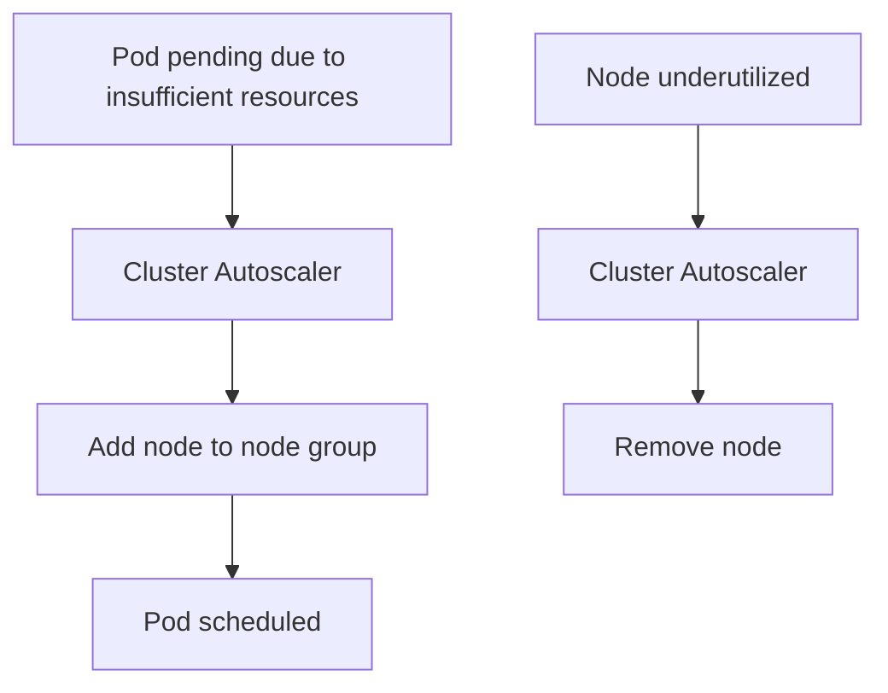

# 5.6.2 Autoscaling: HPA, VPA, and Cluster Autoscaler – Right-Sizing Your Cluster

#### Why Autoscaling Matters

Manual scaling is reactive and slow. Autoscaling enables:

* **Cost optimization** – Scale down during low traffic

* **Performance** – Scale up during traffic spikes

* **Resilience** – Replace failed nodes automatically

Kubernetes provides three autoscaling dimensions:

* **Horizontal Pod Autoscaler (HPA)** – Scale number of pod replicas

* **Vertical Pod Autoscaler (VPA)** – Adjust CPU/memory requests/limits

* **Cluster Autoscaler (CA)** – Scale number of nodes

This note covers all three. Note 5.6.1 covered ConfigMaps/Secrets; note 5.6.3 is the subchapter review.

**Backlinks:** [5.3.1 - Deployments](../Subchapter_5.3/5.3.1_Pod_Fundamentals_and_Lifecycle.md) (HPA scales replicas) | [Module 4 - Resources](../../4-Docker/Subchapter_4.3/4.3.1_Container_Lifecycle_and_Resource_Management.md) (requests/limits) | [5.1.2 - metrics-server](../Subchapter_5.1/5.1.2_Cluster_Setup_kubeadm_Kind_Multi_Node.md)

***

## Part 1: Horizontal Pod Autoscaler (HPA)

HPA automatically scales the number of pods in a deployment, replicaset, or statefulset based on observed metrics.

### Prerequisites: metrics-server

```bash
# Install metrics-server
kubectl apply -f https://github.com/kubernetes-sigs/metrics-server/releases/latest/download/components.yaml

# Verify
kubectl top nodes
kubectl top pods
```

### HPA Based on CPU

```yaml
# hpa-cpu.yaml
apiVersion: autoscaling/v2
kind: HorizontalPodAutoscaler
metadata:
  name: php-apache-hpa
spec:
  scaleTargetRef:
    apiVersion: apps/v1
    kind: Deployment
    name: php-apache
  minReplicas: 1
  maxReplicas: 10
  metrics:
  - type: Resource
    resource:
      name: cpu
      target:
        type: Utilization
        averageUtilization: 50
```

```bash
# Create HPA
kubectl apply -f hpa-cpu.yaml

# Check HPA status
kubectl get hpa
# NAME            REFERENCE              TARGETS   MINPODS   MAXPODS   REPLICAS   AGE
# php-apache-hpa  Deployment/php-apache  0%/50%    1         10        1          10s

# Generate load to test
kubectl run -it --rm load-generator --image=busybox -- /bin/sh -c "while true; do wget -q -O- http://php-apache; done"

# Watch HPA scale
kubectl get hpa -w
```

### HPA Based on Memory

```yaml
# hpa-memory.yaml
metrics:
- type: Resource
  resource:
    name: memory
    target:
      type: Utilization
      averageUtilization: 80
```

### HPA Based on Custom Metrics (Prometheus)

```yaml
# hpa-custom-metrics.yaml
apiVersion: autoscaling/v2
kind: HorizontalPodAutoscaler
metadata:
  name: custom-metric-hpa
spec:
  scaleTargetRef:
    apiVersion: apps/v1
    kind: Deployment
    name: myapp
  minReplicas: 2
  maxReplicas: 20
  metrics:
  - type: Pods
    pods:
      metric:
        name: http_requests_per_second
      target:
        type: AverageValue
        averageValue: 100
  - type: Object
    object:
      metric:
        name: requests-per-second
      describedObject:
        apiVersion: networking.k8s.io/v1
        kind: Ingress
        name: my-ingress
      target:
        type: Value
        value: 10k
```

### HPA with Multiple Metrics

```yaml
# hpa-multiple-metrics.yaml
apiVersion: autoscaling/v2
kind: HorizontalPodAutoscaler
metadata:
  name: multi-metric-hpa
spec:
  scaleTargetRef:
    apiVersion: apps/v1
    kind: Deployment
    name: myapp
  minReplicas: 2
  maxReplicas: 20
  metrics:
  - type: Resource
    resource:
      name: cpu
      target:
        type: Utilization
        averageUtilization: 60
  - type: Resource
    resource:
      name: memory
      target:
        type: Utilization
        averageUtilization: 80
  behavior:
    scaleDown:
      stabilizationWindowSeconds: 300  # Wait 5 min before scaling down
      policies:
      - type: Percent
        value: 50
        periodSeconds: 60
    scaleUp:
      stabilizationWindowSeconds: 0    # Scale up immediately
      policies:
      - type: Percent
        value: 100
        periodSeconds: 15
      - type: Pods
        value: 4
        periodSeconds: 15
      selectPolicy: Max
```

### HPA Commands

```bash
# Create HPA from command line
kubectl autoscale deployment php-apache --cpu-percent=50 --min=1 --max=10

# Get HPA status
kubectl get hpa
kubectl describe hpa php-apache-hpa

# Edit HPA
kubectl edit hpa php-apache-hpa

# Delete HPA
kubectl delete hpa php-apache-hpa
```

***

## Part 2: Vertical Pod Autoscaler (VPA)

VPA adjusts CPU/memory requests and limits for pods. Unlike HPA, it changes pod resources, not replica count.

### Installing VPA

```bash
git clone https://github.com/kubernetes/autoscaler.git
cd autoscaler/vertical-pod-autoscaler
./hack/vpa-up.sh
```

### VPA YAML

```yaml
# vpa.yaml
apiVersion: autoscaling.k8s.io/v1
kind: VerticalPodAutoscaler
metadata:
  name: myapp-vpa
spec:
  targetRef:
    apiVersion: apps/v1
    kind: Deployment
    name: myapp
  updatePolicy:
    updateMode: "Auto"  # Auto, Initial, Recreate, Off
  resourcePolicy:
    containerPolicies:
    - containerName: "myapp"
      minAllowed:
        cpu: "100m"
        memory: "256Mi"
      maxAllowed:
        cpu: "2"
        memory: "4Gi"
      controlledResources: ["cpu", "memory"]
```

### VPA Update Modes

| Mode         | Behavior                                               |
| ------------ | ------------------------------------------------------ |
| **Off**      | Only recommendations, no changes                       |
| **Initial**  | Set resources at pod creation only                     |
| **Recreate** | Evict pod when resources change (requires pod restart) |
| **Auto**     | Recreate pods when recommendations change (default)    |

### VPA Commands

```bash
# Get VPA status
kubectl get vpa
kubectl describe vpa myapp-vpa

# View recommendations
kubectl get vpa myapp-vpa -o yaml | grep -A 10 recommendation
```

### VPA vs HPA

| Feature             | HPA                               | VPA                          |
| ------------------- | --------------------------------- | ---------------------------- |
| **Scales**          | Number of pods                    | Pod resources (CPU/memory)   |
| **Pod restart**     | No                                | Yes (for Auto/Recreate mode) |
| **Best for**        | Stateless apps with variable load | Stateful apps, batch jobs    |
| **Metrics**         | CPU, memory, custom               | CPU, memory                  |
| **Recommendations** | No                                | Yes (even in Off mode)       |

**Can HPA and VPA run together?**

* **Yes, but with caution** – VPA with Auto mode conflicts with HPA

* Recommended: VPA in Off mode (recommendations only) + HPA

* Or use HPA for replicas, VPA for resource guidance

***

## Part 3: Cluster Autoscaler (CA)

Cluster Autoscaler adds or removes nodes based on pending pods.

### How Cluster Autoscaler Works



### Installation (AWS EKS Example)

```bash
# Install Cluster Autoscaler on EKS
kubectl apply -f https://raw.githubusercontent.com/kubernetes/autoscaler/master/cluster-autoscaler/cloudprovider/aws/examples/cluster-autoscaler-autodiscover.yaml

# Edit deployment with your cluster name
kubectl -n kube-system edit deployment cluster-autoscaler
# Add: --node-group-auto-discovery=asg:tag=k8s.io/cluster-autoscaler/enabled,k8s.io/cluster-autoscaler/<cluster-name>
```

### Cluster Autoscaler Configuration

```yaml
# cluster-autoscaler-config.yaml
apiVersion: apps/v1
kind: Deployment
metadata:
  name: cluster-autoscaler
  namespace: kube-system
spec:
  template:
    spec:
      containers:
      - image: registry.k8s.io/autoscaling/cluster-autoscaler:v1.29.0
        name: cluster-autoscaler
        command:
        - ./cluster-autoscaler
        - --v=4
        - --cloud-provider=aws
        - --skip-nodes-with-local-storage=false
        - --balance-similar-node-groups
        - --expander=priority
        - --scale-down-delay-after-add=10m
        - --scale-down-unneeded-time=10m
        - --max-node-provision-time=15m
        - --nodes=1:10:eks-node-group-1
        - --nodes=0:5:eks-gpu-node-group
```

### Key Cluster Autoscaler Parameters

| Parameter                            | Default | Purpose                                 |
| ------------------------------------ | ------- | --------------------------------------- |
| `--scale-down-delay-after-add`       | 10m     | Wait after scale up before scaling down |
| `--scale-down-unneeded-time`         | 10m     | How long node must be underutilized     |
| `--scale-down-utilization-threshold` | 0.5     | Utilization threshold for scale down    |
| `--max-node-provision-time`          | 15m     | Max time to provision node              |
| `--balance-similar-node-groups`      | false   | Balance across similar node groups      |
| `--expander`                         | random  | Node group selection strategy           |

### Expander Strategies

| Strategy      | Behavior                               |
| ------------- | -------------------------------------- |
| `random`      | Random node group selection            |
| `most-pods`   | Node group that can schedule most pods |
| `least-waste` | Node group with least resource waste   |
| `priority`    | Priority-based selection               |
| `price`       | Lowest price (cloud provider specific) |

***

## Part 4: Complete Autoscaling Stack Example

```yaml
# full-autoscaling-stack.yaml
---
# Deployment with resource requests
apiVersion: apps/v1
kind: Deployment
metadata:
  name: webapp
spec:
  replicas: 2
  selector:
    matchLabels:
      app: webapp
  template:
    metadata:
      labels:
        app: webapp
    spec:
      containers:
      - name: app
        image: myapp:latest
        resources:
          requests:
            cpu: 200m
            memory: 256Mi
          limits:
            cpu: 500m
            memory: 512Mi
---
# HPA for pod scaling
apiVersion: autoscaling/v2
kind: HorizontalPodAutoscaler
metadata:
  name: webapp-hpa
spec:
  scaleTargetRef:
    apiVersion: apps/v1
    kind: Deployment
    name: webapp
  minReplicas: 2
  maxReplicas: 20
  metrics:
  - type: Resource
    resource:
      name: cpu
      target:
        type: Utilization
        averageUtilization: 60
---
# VPA for recommendations (Off mode – no changes)
apiVersion: autoscaling.k8s.io/v1
kind: VerticalPodAutoscaler
metadata:
  name: webapp-vpa
spec:
  targetRef:
    apiVersion: apps/v1
    kind: Deployment
    name: webapp
  updatePolicy:
    updateMode: "Off"  # Only recommendations
```

***

## Part 5: Troubleshooting Autoscaling

### HPA Not Scaling

```bash
# Check HPA status
kubectl describe hpa webapp-hpa

# Check if metrics-server is working
kubectl top nodes
kubectl top pods

# Check resource requests (required for HPA)
kubectl get deployment webapp -o yaml | grep -A 5 resources

# Check HPA events
kubectl get events --field-selector involvedObject.name=webapp-hpa
```

**Common HPA issues:**

| Issue                 | Fix                             |
| --------------------- | ------------------------------- |
| Metrics not available | Install metrics-server          |
| Unknown metrics       | Check metric name spelling      |
| No resource requests  | Add CPU/memory requests to pods |

### VPA Not Recommending

```bash
# Check VPA status
kubectl describe vpa webapp-vpa

# Check VPA recommender logs
kubectl logs -n kube-system deployment/vpa-recommender

# Check if metrics-server is working
kubectl top pods
```

### Cluster Autoscaler Not Scaling

```bash
# Check CA logs
kubectl logs -n kube-system deployment/cluster-autoscaler

# Check pending pods
kubectl get pods --field-selector=status.phase=Pending

# Check node group configuration
kubectl get nodes --show-labels

# Check CA configuration
kubectl get cm -n kube-system cluster-autoscaler-status -o yaml
```

***

## Quick Task: Implement HPA

*Create a deployment with HPA and test scaling.*

1. Create a deployment with CPU requests.
2. Create an HPA targeting 50% CPU utilization.
3. Generate load to trigger scaling.
4. Watch HPA scale up.
5. Stop load and watch scale down.

> **Ready Solution:**
>
> ```bash
> # Task 1
> cat << EOF | kubectl apply -f -
> apiVersion: apps/v1
> kind: Deployment
> metadata:
>   name: php-apache
> spec:
>   selector:
>     matchLabels:
>       run: php-apache
>   replicas: 1
>   template:
>     metadata:
>       labels:
>         run: php-apache
>     spec:
>       containers:
>       - name: php-apache
>         image: registry.k8s.io/hpa-example
>         ports:
>         - containerPort: 80
>         resources:
>           requests:
>             cpu: 200m
> ---
> apiVersion: v1
> kind: Service
> metadata:
>   name: php-apache
> spec:
>   ports:
>   - port: 80
>   selector:
>     run: php-apache
> EOF
>
> # Task 2
> kubectl autoscale deployment php-apache --cpu-percent=50 --min=1 --max=10
>
> # Task 3
> kubectl run -it --rm load-generator --image=busybox -- /bin/sh -c "while true; do wget -q -O- http://php-apache; done"
>
> # Task 4 (in another terminal)
> kubectl get hpa -w
> # Watch replicas increase
>
> # Task 5
> # Press Ctrl+C on load-generator
> # Watch HPA scale down after stabilization window
> ```

***

## Summary Table: Autoscaling Types

| Type                   | Scales        | Pod Restart | Metrics             | Best For                          |
| ---------------------- | ------------- | ----------- | ------------------- | --------------------------------- |
| **HPA**                | Pod count     | No          | CPU, memory, custom | Stateless apps with variable load |
| **VPA**                | Pod resources | Yes (Auto)  | CPU, memory         | Stateful apps, batch jobs         |
| **Cluster Autoscaler** | Node count    | N/A         | Pending pods        | All workloads                     |

### HPA Behavior Parameters

| Parameter                              | Default | Purpose                    |
| -------------------------------------- | ------- | -------------------------- |
| `scaleDown.stabilizationWindowSeconds` | 300     | Wait before scaling down   |
| `scaleDown.policies.percent`           | 100     | Max percent to scale down  |
| `scaleUp.stabilizationWindowSeconds`   | 0       | Scale up immediately       |
| `scaleUp.policies.percent`             | 100     | Max percent to scale up    |
| `scaleUp.policies.pods`                | 4       | Max pods per scaling event |

### VPA Update Modes

| Mode       | Behavior               | Use Case                  |
| ---------- | ---------------------- | ------------------------- |
| `Off`      | Recommendations only   | Analyze before applying   |
| `Initial`  | Set at creation only   | Batch jobs                |
| `Recreate` | Evict and recreate pod | Production (with caution) |
| `Auto`     | Recreate when needed   | Recommended               |

### Cluster Autoscaler Expanders

| Strategy      | Description             |
| ------------- | ----------------------- |
| `random`      | Random node group       |
| `most-pods`   | Maximize pods scheduled |
| `least-waste` | Minimize resource waste |
| `priority`    | Configured priority     |
| `price`       | Lowest cost             |

***

***

## Part 6: Resource Quotas and LimitRanges

Resource Quotas and LimitRanges control resource consumption in namespaces.

### ResourceQuota – Namespace Limits

```yaml
# resourcequota.yaml
apiVersion: v1
kind: ResourceQuota
metadata:
  name: compute-quota
  namespace: dev
spec:
  hard:
    # Compute resources
    requests.cpu: "10"
    requests.memory: 20Gi
    limits.cpu: "20"
    limits.memory: 40Gi
    
    # Object counts
    pods: "50"
    services: "10"
    secrets: "20"
    configmaps: "20"
    persistentvolumeclaims: "10"
    
    # Storage
    requests.storage: 100Gi
```

### LimitRange – Default Pod Limits

```yaml
# limitrange.yaml
apiVersion: v1
kind: LimitRange
metadata:
  name: default-limits
  namespace: dev
spec:
  limits:
  - type: Container
    default:          # Default limits if not specified
      cpu: 500m
      memory: 256Mi
    defaultRequest:   # Default requests if not specified
      cpu: 100m
      memory: 128Mi
    min:             # Minimum allowed
      cpu: 50m
      memory: 64Mi
    max:             # Maximum allowed
      cpu: 2
      memory: 2Gi
  - type: PersistentVolumeClaim
    min:
      storage: 1Gi
    max:
      storage: 50Gi
```

### Quota/LimitRange Commands

```bash
# Create ResourceQuota
kubectl apply -f resourcequota.yaml

# Check quota usage
kubectl get resourcequota -n dev
kubectl describe resourcequota compute-quota -n dev

# Create LimitRange
kubectl apply -f limitrange.yaml

# Check LimitRange
kubectl get limitrange -n dev
kubectl describe limitrange default-limits -n dev
```

***

**Next note (5.6.3)** will be the Subchapter Review for Configuration, Secrets, and Autoscaling, including a cheatsheet and scenario-based interview questions.

**Backlinks:** [5.1.2 - metrics-server](../Subchapter_5.1/5.1.2_Cluster_Setup_kubeadm_Kind_Multi_Node.md) | [5.3.1 - Deployments](../Subchapter_5.3/5.3.1_Pod_Fundamentals_and_Lifecycle.md) | [Module 4 - Resources](../../4-Docker/Subchapter_4.3/4.3.1_Container_Lifecycle_and_Resource_Management.md)
