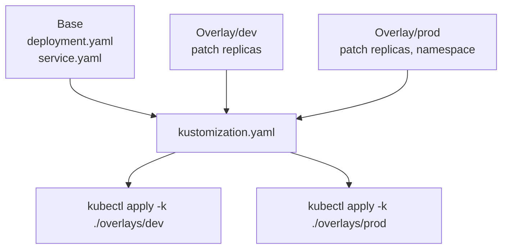

# 5.7.1 Kustomize Basics: Overlays and Patches – Template-Free Customization

#### Why Kustomize Matters

Helm uses templates with variable substitution. Kustomize takes a different approach – **patch-based customization** without templates. Kustomize is built into `kubectl` (since v1.14), making it accessible without additional tools.

**Key concepts:**

* **Base** – Common configuration shared across environments

* **Overlay** – Environment-specific customizations (dev, staging, prod)

* **Patch** – Targeted modifications to resources

* **Transformer** – Kustomize functions (add labels, change namespace, etc.)

This note covers Kustomize fundamentals. Note 5.7.2 covers Helm; note 5.7.3 is the subchapter review.

**Backward references:** Kubernetes YAML from previous subchapters; patches modify those YAMLs; namespaces from 5.3.1.

***

## Part 1: Kustomize Overview

### What Kustomize Does



### Directory Structure

```
myapp/
├── base/
│   ├── kustomization.yaml
│   ├── deployment.yaml
│   └── service.yaml
└── overlays/
    ├── dev/
    │   └── kustomization.yaml
    ├── staging/
    │   └── kustomization.yaml
    └── prod/
        └── kustomization.yaml
```

### Basic Commands

```bash
# Build and view YAML (dry-run)
kubectl kustomize ./overlays/dev

# Apply directly
kubectl apply -k ./overlays/dev

# Diff before applying
kubectl diff -k ./overlays/prod

# Delete
kubectl delete -k ./overlays/dev
```

***

## Part 2: Base Kustomization

### Base kustomization.yaml

```yaml
# base/kustomization.yaml
apiVersion: kustomize.config.k8s.io/v1beta1
kind: Kustomization

# Resources to include
resources:
- deployment.yaml
- service.yaml
- configmap.yaml

# Common labels for all resources
commonLabels:
  app: myapp
  environment: base

# Common annotations
commonAnnotations:
  managed-by: kustomize

# Namespace for all resources (if not specified in resources)
namespace: myapp

# Image transformer (change image across all resources)
images:
- name: myapp
  newName: registry.example.com/myapp
  newTag: latest

# Add prefix to resource names
namePrefix: base-

# Add suffix to resource names
nameSuffix: -v1
```

### Base Deployment YAML

```yaml
# base/deployment.yaml
apiVersion: apps/v1
kind: Deployment
metadata:
  name: myapp
spec:
  replicas: 1
  selector:
    matchLabels:
      app: myapp
  template:
    metadata:
      labels:
        app: myapp
    spec:
      containers:
      - name: myapp
        image: myapp:latest
        ports:
        - containerPort: 8080
        env:
        - name: LOG_LEVEL
          value: "info"
```

### Base Service YAML

```yaml
# base/service.yaml
apiVersion: v1
kind: Service
metadata:
  name: myapp
spec:
  selector:
    app: myapp
  ports:
  - port: 80
    targetPort: 8080
```

***

## Part 3: Overlays – Environment Customization

### Dev Overlay

```yaml
# overlays/dev/kustomization.yaml
apiVersion: kustomize.config.k8s.io/v1beta1
kind: Kustomization

# Reference base
resources:
- ../../base

# Change namespace
namespace: dev

# Override common labels
commonLabels:
  environment: dev

# Patch replicas
patches:
- target:
    kind: Deployment
    name: myapp
  patch: |
    - op: replace
      path: /spec/replicas
      value: 1

# Patch image tag
images:
- name: myapp
  newTag: dev-latest

# Add ConfigMap generator (env-specific)
configMapGenerator:
- name: app-config
  literals:
  - LOG_LEVEL=debug
  - DB_HOST=postgres.dev.svc.cluster.local
```

### Staging Overlay

```yaml
# overlays/staging/kustomization.yaml
apiVersion: kustomize.config.k8s.io/v1beta1
kind: Kustomization

resources:
- ../../base

namespace: staging

commonLabels:
  environment: staging

patches:
- target:
    kind: Deployment
    name: myapp
  patch: |
    - op: replace
      path: /spec/replicas
      value: 3

images:
- name: myapp
  newTag: staging-latest

configMapGenerator:
- name: app-config
  literals:
  - LOG_LEVEL=info
  - DB_HOST=postgres.staging.svc.cluster.local
```

### Production Overlay

```yaml
# overlays/prod/kustomization.yaml
apiVersion: kustomize.config.k8s.io/v1beta1
kind: Kustomization

resources:
- ../../base

namespace: prod

commonLabels:
  environment: production

patches:
- target:
    kind: Deployment
    name: myapp
  patch: |
    - op: replace
      path: /spec/replicas
      value: 10
  - op: add
    path: /spec/template/spec/containers/0/resources
    value:
      requests:
        cpu: 500m
        memory: 512Mi
      limits:
        cpu: 1000m
        memory: 1Gi

images:
- name: myapp
  newTag: prod-1.2.3

configMapGenerator:
- name: app-config
  literals:
  - LOG_LEVEL=error
  - DB_HOST=postgres.prod.svc.cluster.local

# Add HPA for production
patchesStrategicMerge:
- hpa.yaml
```

```yaml
# overlays/prod/hpa.yaml
apiVersion: autoscaling/v2
kind: HorizontalPodAutoscaler
metadata:
  name: myapp-hpa
spec:
  scaleTargetRef:
    apiVersion: apps/v1
    kind: Deployment
    name: myapp
  minReplicas: 5
  maxReplicas: 20
  metrics:
  - type: Resource
    resource:
      name: cpu
      target:
        type: Utilization
        averageUtilization: 70
```

***

## Part 4: Patch Types

### Strategic Merge Patch (Default)

Merges YAML fields intelligently (arrays are merged by key).

```yaml
# patchesStrategicMerge
patchesStrategicMerge:
- increase_replicas.yaml
- add_resources.yaml
```

```yaml
# increase_replicas.yaml
apiVersion: apps/v1
kind: Deployment
metadata:
  name: myapp
spec:
  replicas: 5  # Overrides base replicas
```

### JSON Patch (RFC 6902)

More explicit, uses operations: `add`, `remove`, `replace`, `copy`, `move`, `test`.

```yaml
# patches (JSON patch)
patches:
- target:
    kind: Deployment
    name: myapp
  patch: |
    - op: replace
      path: /spec/replicas
      value: 5
    - op: add
      path: /spec/template/spec/containers/0/env/-
      value:
        name: NEW_ENV
        value: "production"
```

### Patch Operations Reference

| Operation | Description                    | Example                                                                         |
| --------- | ------------------------------ | ------------------------------------------------------------------------------- |
| `add`     | Add new field or array element | `{"op":"add","path":"/spec/replicas","value":5}`                                |
| `remove`  | Remove field                   | `{"op":"remove","path":"/spec/replicas"}`                                       |
| `replace` | Replace field value            | `{"op":"replace","path":"/spec/replicas","value":10}`                           |
| `copy`    | Copy from another path         | `{"op":"copy","from":"/spec/selector","path":"/spec/template/metadata/labels"}` |
| `move`    | Move field                     | `{"op":"move","from":"/spec/old","path":"/spec/new"}`                           |

***

## Part 5: Kustomize Transformers

### ConfigMapGenerator

```yaml
# Create ConfigMap from files or literals
configMapGenerator:
- name: app-config
  literals:
  - LOG_LEVEL=info
  - DB_HOST=localhost
  files:
  - config/app.properties
  - config/nginx.conf
  behavior: create  # create, replace, merge
```

### SecretGenerator

```yaml
secretGenerator:
- name: app-secret
  literals:
  - api-key=abc123
  files:
  - secrets/password.txt
  type: Opaque
  behavior: create
```

### Image Transformer

```yaml
# Change image across all resources
images:
- name: myapp
  newName: registry.example.com/myapp
  newTag: v1.2.3
  digest: sha256:abc123...

# Multiple images
- name: sidecar
  newTag: v2
```

### Replica Transformer

```yaml
replicas:
- name: myapp
  count: 5
```

### Label/Annotation Transformer

```yaml
# Add labels to all resources
commonLabels:
  app: myapp
  managed-by: kustomize

# Add annotations
commonAnnotations:
  monitoring: "true"
```

### Namespace Transformer

```yaml
# Set namespace for all resources
namespace: myapp
```

### Name Prefix/Suffix

```yaml
# Add prefix to all resource names
namePrefix: prod-

# Add suffix
nameSuffix: -v2
```

***

## Part 6: Advanced Kustomize Features

### Components (Reusable Pieces)

```yaml
# components/monitoring/kustomization.yaml
apiVersion: kustomize.config.k8s.io/v1alpha1
kind: Component
resources:
- prometheus.yaml
- grafana.yaml
```

```yaml
# overlays/prod/kustomization.yaml
components:
- ../../components/monitoring
```

### Variables and Substitutions (with `vars`)

```yaml
# base/kustomization.yaml
vars:
- name: SERVICE_NAME
  objref:
    kind: Service
    name: myapp
    apiVersion: v1
  fieldref:
    fieldpath: metadata.name

configMapGenerator:
- name: app-config
  literals:
  - SERVICE_NAME=$(SERVICE_NAME)
```

### Helm Chart Inflator (Use Helm charts with Kustomize)

```yaml
# kustomization.yaml
helmCharts:
- name: nginx-ingress
  repo: https://kubernetes.github.io/ingress-nginx
  version: 4.9.0
  releaseName: ingress-nginx
  namespace: ingress-nginx
  valuesInline:
    controller:
      replicaCount: 2
```

### PatchesJson6902 (Targeted JSON Patch)

```yaml
patchesJson6902:
- target:
    group: apps
    version: v1
    kind: Deployment
    name: myapp
  path: patch.yaml
```

***

## Part 7: Kustomize with kubectl

```bash
# Build and view
kubectl kustomize ./overlays/prod

# Apply
kubectl apply -k ./overlays/prod

# Diff
kubectl diff -k ./overlays/prod

# Delete
kubectl delete -k ./overlays/prod

# Set image (override)
kubectl apply -k ./overlays/prod --image=myapp=myapp:hotfix

# List resources
kubectl get -k ./overlays/prod
```

***

## Quick Task: Create Kustomize Overlays

*Build a Kustomize setup with base and dev/prod overlays.*

1. Create base deployment and service.
2. Create dev overlay with 1 replica, debug log level.
3. Create prod overlay with 5 replicas, resource limits.
4. Build and view each overlay.

> **Ready Solution:**
>
> ```bash
> # Create directory structure
> mkdir -p myapp/{base,overlays/{dev,prod}}
>
> # Task 1: Base
> cat > myapp/base/deployment.yaml << 'EOF'
> apiVersion: apps/v1
> kind: Deployment
> metadata:
>   name: myapp
> spec:
>   replicas: 1
>   selector:
>     matchLabels:
>       app: myapp
>   template:
>     metadata:
>       labels:
>         app: myapp
>     spec:
>       containers:
>       - name: myapp
>         image: nginx:latest
>         ports:
>         - containerPort: 80
> EOF
>
> cat > myapp/base/service.yaml << 'EOF'
> apiVersion: v1
> kind: Service
> metadata:
>   name: myapp
> spec:
>   selector:
>     app: myapp
>   ports:
>   - port: 80
>     targetPort: 80
> EOF
>
> cat > myapp/base/kustomization.yaml << 'EOF'
> apiVersion: kustomize.config.k8s.io/v1beta1
> kind: Kustomization
> resources:
> - deployment.yaml
> - service.yaml
> commonLabels:
>   app: myapp
> EOF
>
> # Task 2: Dev overlay
> cat > myapp/overlays/dev/kustomization.yaml << 'EOF'
> apiVersion: kustomize.config.k8s.io/v1beta1
> kind: Kustomization
> resources:
> - ../../base
> patches:
> - target:
>     kind: Deployment
>     name: myapp
>   patch: |
>     - op: replace
>       path: /spec/replicas
>       value: 1
> configMapGenerator:
> - name: app-config
>   literals:
>   - LOG_LEVEL=debug
> namespace: dev
> EOF
>
> # Task 3: Prod overlay
> cat > myapp/overlays/prod/kustomization.yaml << 'EOF'
> apiVersion: kustomize.config.k8s.io/v1beta1
> kind: Kustomization
> resources:
> - ../../base
> patches:
> - target:
>     kind: Deployment
>     name: myapp
>   patch: |
>     - op: replace
>       path: /spec/replicas
>       value: 5
>     - op: add
>       path: /spec/template/spec/containers/0/resources
>       value:
>         requests:
>           cpu: 100m
>           memory: 128Mi
>         limits:
>           cpu: 500m
>           memory: 256Mi
> namespace: prod
> EOF
>
> # Task 4: Build overlays
> kubectl kustomize myapp/overlays/dev
> kubectl kustomize myapp/overlays/prod
> ```

***

## Summary Table: Kustomize Features

| Feature                   | Syntax                                     | Purpose                     |
| ------------------------- | ------------------------------------------ | --------------------------- |
| **resources**             | `resources: [file.yaml]`                   | Include base resources      |
| **patchesStrategicMerge** | `patchesStrategicMerge: [patch.yaml]`      | Merge patches               |
| **patches** (JSON patch)  | `patches: [{target: {...}, patch: "..."}]` | Explicit operations         |
| **commonLabels**          | `commonLabels: {key: value}`               | Add labels to all resources |
| **commonAnnotations**     | `commonAnnotations: {key: value}`          | Add annotations             |
| **namespace**             | `namespace: myns`                          | Set namespace               |
| **namePrefix**            | `namePrefix: prefix-`                      | Add name prefix             |
| **nameSuffix**            | `nameSuffix: -suffix`                      | Add name suffix             |
| **images**                | `images: [{name, newName, newTag}]`        | Change image                |
| **replicas**              | `replicas: [{name, count}]`                | Set replica count           |
| **configMapGenerator**    | `configMapGenerator: [{name, literals}]`   | Generate ConfigMap          |
| **secretGenerator**       | `secretGenerator: [{name, literals}]`      | Generate Secret             |
| **helmCharts**            | `helmCharts: [{name, repo}]`               | Use Helm charts             |

### Kustomize Commands

| Command                 | Purpose              |
| ----------------------- | -------------------- |
| `kubectl kustomize DIR` | Build and print YAML |
| `kubectl apply -k DIR`  | Apply resources      |
| `kubectl diff -k DIR`   | Show differences     |
| `kubectl delete -k DIR` | Delete resources     |
| `kubectl get -k DIR`    | List resources       |

### Patch Operations (JSON Patch)

| Operation | Description                    |
| --------- | ------------------------------ |
| `add`     | Add new field or array element |
| `remove`  | Remove field                   |
| `replace` | Replace field value            |
| `copy`    | Copy from another path         |
| `move`    | Move field                     |
| `test`    | Test value (fail if mismatch)  |

***

**Next note (5.7.2)** will cover **Helm Charts, Values, Templates, and Releases** – Helm architecture, chart structure, templating, and release management.

**Backward references:**

* Kubernetes YAML from previous subchapters (Deployment, Service, ConfigMap)

* ConfigMaps/Secrets from 5.6.1 (configMapGenerator, secretGenerator)

* HPA from 5.6.2 (added in prod overlay)
