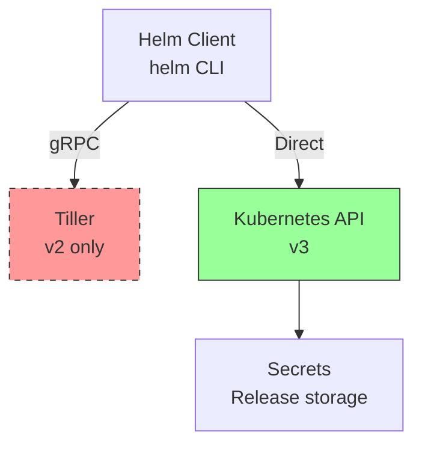

# 5.7.2 Helm Charts, Values, Templates, and Releases: The Package Manager for Kubernetes

#### Why Helm Matters

Kustomize works well for simple customizations, but complex applications need:

* **Packaging** – Distribute charts with dependencies

* **Versioning** – Track releases and roll back

* **Templating** – Generate YAML from values

* **Dependency management** – Include sub-charts (PostgreSQL, Redis)

**Helm** is the package manager for Kubernetes, often called "apt for Kubernetes."

This note covers Helm fundamentals. Note 5.7.1 covered Kustomize; note 5.7.3 is the subchapter review.

**Backlinks:** [5.3.1 - Deployments](../Subchapter_5.3/5.3.1_Pod_Fundamentals_and_Lifecycle.md) (templates generate YAML) | [5.6.1 - ConfigMaps](../Subchapter_5.6/5.6.1_ConfigMaps_and_Secrets.md)

***

## Part 1: Helm Architecture



### Helm v2 vs v3

| Feature             | Helm v2                          | Helm v3                  |
| ------------------- | -------------------------------- | ------------------------ |
| **Tiller**          | Yes (server-side)                | Removed                  |
| **RBAC**            | Complex (Tiller service account) | Standard Kubernetes RBAC |
| **Release storage** | ConfigMaps                       | Secrets (more secure)    |
| **Security**        | Weaker                           | Stronger                 |
| **Status**          | Deprecated                       | Current                  |

### Install Helm v3

```bash
# Linux install
curl -fsSL -o get_helm.sh https://raw.githubusercontent.com/helm/helm/main/scripts/get-helm-3
chmod 700 get_helm.sh
./get_helm.sh

# Verify
helm version
# version.BuildInfo{Version:"v3.14.0", GitCommit:"...", GoVersion:"go1.21.5"}
```

***

## Part 2: Helm Chart Structure

### Creating a Chart

```bash
# Create a new chart
helm create mychart

# Chart structure
mychart/
├── Chart.yaml          # Chart metadata
├── values.yaml         # Default configuration values
├── charts/             # Dependencies (sub-charts)
├── templates/          # Kubernetes YAML templates
│   ├── NOTES.txt       # Post-install notes
│   ├── _helpers.tpl    # Template helpers
│   ├── deployment.yaml
│   ├── service.yaml
│   ├── ingress.yaml
│   ├── hpa.yaml
│   └── tests/
└── .helmignore         # Files to ignore
```

### Chart.yaml

```yaml
# Chart.yaml
apiVersion: v2
name: myapp
description: A Helm chart for MyApp
type: application
version: 0.1.0
appVersion: "1.16.0"

# Dependencies
dependencies:
- name: postgresql
  version: "12.x.x"
  repository: "https://charts.bitnami.com/bitnami"
  condition: postgresql.enabled
- name: redis
  version: "17.x.x"
  repository: "https://charts.bitnami.com/bitnami"
  condition: redis.enabled

# Maintainers
maintainers:
- name: Platform Team
  email: platform@example.com

# Homepage
home: https://example.com/myapp

# Sources
sources:
- https://github.com/example/myapp

# Keywords
keywords:
- web
- application

# Kube version compatibility
kubeVersion: ">=1.20.0-0"
```

### values.yaml

```yaml
# values.yaml
# Default configuration – overridden by environment-specific values

replicaCount: 1

image:
  repository: myapp
  tag: latest
  pullPolicy: IfNotPresent

imagePullSecrets: []

nameOverride: ""
fullnameOverride: ""

service:
  type: ClusterIP
  port: 80
  targetPort: 8080

ingress:
  enabled: false
  className: nginx
  annotations: {}
  hosts:
  - host: chart-example.local
    paths:
    - path: /
      pathType: Prefix

resources:
  requests:
    cpu: 100m
    memory: 128Mi
  limits:
    cpu: 500m
    memory: 256Mi

autoscaling:
  enabled: false
  minReplicas: 1
  maxReplicas: 10
  targetCPUUtilizationPercentage: 80

nodeSelector: {}
tolerations: []
affinity: {}

# Environment variables
env:
  LOG_LEVEL: info
  DB_HOST: postgres.default.svc.cluster.local

# ConfigMap data
configMap:
  enabled: true
  data:
    app.properties: |
      cache.ttl=3600
      max.connections=100

# Secret data (base64 encoded)
secrets:
  enabled: true
  data:
    DB_PASSWORD: c2VjcmV0Cg==  # "secret" in base64
```

***

## Part 3: Helm Templates

### Template Syntax

Helm uses Go templates with sprinkles.

```yaml
# templates/deployment.yaml
apiVersion: apps/v1
kind: Deployment
metadata:
  name: {{ include "mychart.fullname" . }}
  labels:
    {{- include "mychart.labels" . | nindent 4 }}
spec:
  replicas: {{ .Values.replicaCount }}
  selector:
    matchLabels:
      {{- include "mychart.selectorLabels" . | nindent 6 }}
  template:
    metadata:
      labels:
        {{- include "mychart.selectorLabels" . | nindent 8 }}
    spec:
      containers:
      - name: {{ .Chart.Name }}
        image: "{{ .Values.image.repository }}:{{ .Values.image.tag | default .Chart.AppVersion }}"
        imagePullPolicy: {{ .Values.image.pullPolicy }}
        ports:
        - containerPort: {{ .Values.service.targetPort }}
          name: http
        env:
        - name: LOG_LEVEL
          value: {{ .Values.env.LOG_LEVEL | quote }}
        {{- if .Values.configMap.enabled }}
        volumeMounts:
        - name: config
          mountPath: /etc/config
        {{- end }}
        resources:
          {{- toYaml .Values.resources | nindent 10 }}
      {{- if .Values.configMap.enabled }}
      volumes:
      - name: config
        configMap:
          name: {{ include "mychart.fullname" . }}-config
      {{- end }}
```

### Template Helpers (\_helpers.tpl)

```yaml
# templates/_helpers.tpl
{{/*
Expand the name of the chart.
*/}}
{{- define "mychart.name" -}}
{{- default .Chart.Name .Values.nameOverride | trunc 63 | trimSuffix "-" }}
{{- end }}

{{/*
Create a default fully qualified app name.
*/}}
{{- define "mychart.fullname" -}}
{{- if .Values.fullnameOverride }}
{{- .Values.fullnameOverride | trunc 63 | trimSuffix "-" }}
{{- else }}
{{- $name := default .Chart.Name .Values.nameOverride }}
{{- if contains $name .Release.Name }}
{{- .Release.Name | trunc 63 | trimSuffix "-" }}
{{- else }}
{{- printf "%s-%s" .Release.Name $name | trunc 63 | trimSuffix "-" }}
{{- end }}
{{- end }}
{{- end }}

{{/*
Create chart name and version as used by the chart label.
*/}}
{{- define "mychart.chart" -}}
{{- printf "%s-%s" .Chart.Name .Chart.Version | replace "+" "_" | trunc 63 | trimSuffix "-" }}
{{- end }}

{{/*
Common labels
*/}}
{{- define "mychart.labels" -}}
helm.sh/chart: {{ include "mychart.chart" . }}
{{ include "mychart.selectorLabels" . }}
{{- if .Chart.AppVersion }}
app.kubernetes.io/version: {{ .Chart.AppVersion | quote }}
{{- end }}
app.kubernetes.io/managed-by: {{ .Release.Service }}
{{- end }}

{{/*
Selector labels
*/}}
{{- define "mychart.selectorLabels" -}}
app.kubernetes.io/name: {{ include "mychart.name" . }}
app.kubernetes.io/instance: {{ .Release.Name }}
{{- end }}
```

### Built-in Objects

| Object               | Description                         |
| -------------------- | ----------------------------------- |
| `.Release.Name`      | Release name                        |
| `.Release.Namespace` | Release namespace                   |
| `.Release.Service`   | Service (always "Helm")             |
| `.Release.IsUpgrade` | True if upgrade operation           |
| `.Release.IsInstall` | True if install operation           |
| `.Chart.Name`        | Chart name                          |
| `.Chart.Version`     | Chart version                       |
| `.Chart.AppVersion`  | Application version                 |
| `.Values`            | Values from values.yaml and `--set` |
| `.Files`             | Access files in chart               |
| `.Capabilities`      | Kubernetes version info             |
| `.Template`          | Template information                |

### Flow Control

```yaml
# If/Else
{{- if .Values.ingress.enabled }}
apiVersion: networking.k8s.io/v1
kind: Ingress
...
{{- end }}

# With (scoping)
{{- with .Values.service }}
spec:
  type: {{ .type }}
  port: {{ .port }}
{{- end }}

# Range (looping)
{{- range .Values.envVars }}
- name: {{ .name }}
  value: {{ .value }}
{{- end }}

# Define variable
{{- $replicas := .Values.replicaCount | int }}
```

### Template Functions

```yaml
# Quote string
value: {{ .Values.logLevel | quote }}

# Default value
value: {{ .Values.logLevel | default "info" }}

# Required value (fail if missing)
value: {{ required "DB_HOST is required" .Values.dbHost }}

# toYaml (convert map to YAML)
{{- toYaml .Values.resources | nindent 10 }}

# nindent (indent N spaces + newline)
{{- include "mychart.labels" . | nindent 4 }}

# tpl (evaluate string as template)
{{- tpl .Values.customMessage . }}

# b64enc / b64dec (base64)
password: {{ .Values.dbPassword | b64enc | quote }}
```

***

## Part 4: Helm Commands

### Chart Management

```bash
# Create new chart
helm create mychart

# Lint chart
helm lint ./mychart

# Package chart
helm package ./mychart
# Creates mychart-0.1.0.tgz

# Pull chart from repo
helm pull bitnami/postgresql --version 12.0.0

# Show chart values
helm show values bitnami/postgresql

# Show chart README
helm show readme bitnami/postgresql
```

### Release Management

```bash
# Install release
helm install myrelease ./mychart

# Install with custom values
helm install myrelease ./mychart -f prod-values.yaml --set replicaCount=3

# Install from repo
helm install myrelease bitnami/nginx

# Upgrade release
helm upgrade myrelease ./mychart -f new-values.yaml

# Rollback release
helm rollback myrelease 1

# List releases
helm list
helm list --all-namespaces
helm list --deployed
helm list --failed

# Get release info
helm status myrelease
helm history myrelease

# Uninstall release
helm uninstall myrelease

# Template (dry-run)
helm template myrelease ./mychart

# Dry-run install
helm install myrelease ./mychart --dry-run --debug
```

### Repository Management

```bash
# Add repository
helm repo add bitnami https://charts.bitnami.com/bitnami
helm repo add ingress-nginx https://kubernetes.github.io/ingress-nginx

# List repositories
helm repo list

# Update repositories
helm repo update

# Search repositories
helm search repo nginx
helm search repo bitnami/postgresql --versions
```

***

## Part 5: Environment-Specific Values

### values-dev.yaml

```yaml
# values-dev.yaml
replicaCount: 1
image:
  tag: dev-latest
service:
  type: ClusterIP
ingress:
  enabled: false
env:
  LOG_LEVEL: debug
resources:
  requests:
    cpu: 100m
    memory: 128Mi
  limits:
    cpu: 200m
    memory: 256Mi
```

### values-staging.yaml

```yaml
# values-staging.yaml
replicaCount: 3
image:
  tag: staging-latest
service:
  type: ClusterIP
ingress:
  enabled: true
  hosts:
  - host: staging.example.com
env:
  LOG_LEVEL: info
resources:
  requests:
    cpu: 200m
    memory: 256Mi
  limits:
    cpu: 500m
    memory: 512Mi
autoscaling:
  enabled: true
  minReplicas: 3
  maxReplicas: 10
```

### values-prod.yaml

```yaml
# values-prod.yaml
replicaCount: 5
image:
  tag: prod-1.2.3
service:
  type: LoadBalancer
ingress:
  enabled: true
  hosts:
  - host: example.com
  tls:
  - hosts:
    - example.com
    secretName: example-tls
env:
  LOG_LEVEL: error
resources:
  requests:
    cpu: 500m
    memory: 512Mi
  limits:
    cpu: 1000m
    memory: 1Gi
autoscaling:
  enabled: true
  minReplicas: 5
  maxReplicas: 20
  targetCPUUtilizationPercentage: 70
```

### Install with Environment Values

```bash
# Install dev
helm install myapp-dev ./mychart -f values-dev.yaml --namespace dev

# Install staging
helm install myapp-staging ./mychart -f values-staging.yaml --namespace staging

# Install prod
helm install myapp-prod ./mychart -f values-prod.yaml --namespace prod

# Override specific values
helm upgrade myapp-prod ./mychart --set image.tag=prod-1.2.4
```

***

## Part 6: Helm Hooks

Hooks run at specific points in the release lifecycle.

```yaml
# templates/hooks/pre-install-job.yaml
apiVersion: batch/v1
kind: Job
metadata:
  name: {{ .Release.Name }}-db-migration
  annotations:
    "helm.sh/hook": pre-install,pre-upgrade
    "helm.sh/hook-weight": "5"
    "helm.sh/hook-delete-policy": before-hook-creation,hook-succeeded
spec:
  template:
    spec:
      restartPolicy: Never
      containers:
      - name: migration
        image: myapp:migration
        command: ["/bin/sh", "-c", "./migrate-db.sh"]
```

### Hook Types

| Hook            | Timing          |
| --------------- | --------------- |
| `pre-install`   | Before install  |
| `post-install`  | After install   |
| `pre-upgrade`   | Before upgrade  |
| `post-upgrade`  | After upgrade   |
| `pre-delete`    | Before delete   |
| `post-delete`   | After delete    |
| `pre-rollback`  | Before rollback |
| `post-rollback` | After rollback  |
| `test`          | For helm test   |

***

## Part 7: Helm Testing

```yaml
# templates/tests/test-connection.yaml
apiVersion: v1
kind: Pod
metadata:
  name: {{ .Release.Name }}-test-connection
  annotations:
    "helm.sh/hook": test
spec:
  containers:
  - name: wget
    image: busybox
    command: ['wget']
    args: ['{{ include "mychart.fullname" . }}:{{ .Values.service.port }}']
  restartPolicy: Never
```

```bash
# Run tests
helm test myrelease

# Output:
# POD: myrelease-test-connection
# STATUS: Completed
```

***

## Part 8: Troubleshooting Helm

### Common Issues

**Issue 1: "rendered manifests contain a resource that already exists"**

```bash
# Resource exists but not managed by Helm
# Solution: Adopt resource or delete it
kubectl annotate deployment myapp meta.helm.sh/release-name=myrelease
kubectl annotate deployment myapp meta.helm.sh/release-namespace=default
kubectl label deployment myapp app.kubernetes.io/managed-by=Helm
```

**Issue 2: "upgrade failed: another operation (install/upgrade/rollback) is in progress"**

```bash
# Release stuck
helm history myrelease
helm rollback myrelease <revision>
# Or force unlock (v3 only)
helm uninstall myrelease --keep-history
helm install myrelease ./mychart
```

**Issue 3: Template rendering errors**

```bash
# Debug template
helm template myrelease ./mychart --debug
helm install myrelease ./mychart --dry-run --debug

# Validate values
helm lint ./mychart
```

**Issue 4: Secret storage not accessible**

```bash
# Check release secrets
kubectl get secrets -n default | grep "sh.helm.release"

# Manual cleanup
kubectl delete secret sh.helm.release.v1.myrelease.v1
```

***

## Quick Task: Create and Deploy a Helm Chart

*Create a simple Helm chart and deploy it.*

1. Create a chart for an nginx application.
2. Modify values.yaml to set replicaCount=2.
3. Install the chart.
4. Upgrade to use a different image tag.
5. Roll back to previous version.

> **Ready Solution:**
>
> ```bash
> # Task 1
> helm create mynginx
>
> # Task 2
> sed -i 's/replicaCount: 1/replicaCount: 2/' mynginx/values.yaml
>
> # Task 3
> helm install mynginx ./mynginx
> kubectl get pods
>
> # Task 4
> helm upgrade mynginx ./mynginx --set image.tag=alpine
> helm history mynginx
>
> # Task 5
> helm rollback mynginx 1
> helm history mynginx
>
> # Cleanup
> helm uninstall mynginx
> ```

***

## Summary Table: Helm Commands

| Command                       | Purpose               |
| ----------------------------- | --------------------- |
| `helm create NAME`            | Create new chart      |
| `helm lint PATH`              | Validate chart        |
| `helm package PATH`           | Package chart to .tgz |
| `helm repo add NAME URL`      | Add repository        |
| `helm repo update`            | Update repo cache     |
| `helm search repo KEYWORD`    | Search charts         |
| `helm install NAME CHART`     | Install release       |
| `helm upgrade NAME CHART`     | Upgrade release       |
| `helm rollback NAME REVISION` | Rollback              |
| `helm history NAME`           | Show revision history |
| `helm list`                   | List releases         |
| `helm status NAME`            | Show release status   |
| `helm uninstall NAME`         | Delete release        |
| `helm test NAME`              | Run tests             |
| `helm show values CHART`      | Show default values   |
| `helm template NAME CHART`    | Render templates      |

### Built-in Objects Reference

| Object                      | Description             |
| --------------------------- | ----------------------- |
| `.Release.Name`             | Release name            |
| `.Release.Namespace`        | Release namespace       |
| `.Chart.Name`               | Chart name              |
| `.Chart.Version`            | Chart version           |
| `.Values`                   | Values from files/--set |
| `.Files`                    | Access files in chart   |
| `.Capabilities.KubeVersion` | Kubernetes version      |

### Template Functions Reference

| Function            | Purpose                          |
| ------------------- | -------------------------------- |
| `quote`             | Add quotes                       |
| `default`           | Default value                    |
| `required`          | Required value (fail if missing) |
| `toYaml`            | Convert to YAML                  |
| `nindent`           | Indent lines                     |
| `b64enc` / `b64dec` | Base64 encode/decode             |
| `tpl`               | Evaluate string as template      |

***

**Next note (5.7.3)** will be the Subchapter Review for Kustomize and Helm, including a cheatsheet and scenario-based interview questions.

**Backlinks:** [5.3.1 - Deployments](../Subchapter_5.3/5.3.1_Pod_Fundamentals_and_Lifecycle.md) | [5.6.1 - ConfigMaps](../Subchapter_5.6/5.6.1_ConfigMaps_and_Secrets.md) | [5.6.2 - Autoscaling](../Subchapter_5.6/5.6.2_Autoscaling_HPA_VPA_Cluster_Autoscaler.md)
