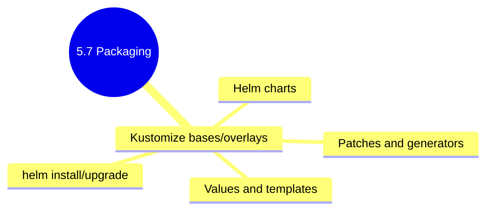

# 5.7.3 Subchapter Review: Cheatsheet and Interview Prep

This review covers only the material presented in Notes 5.7.1 (Kustomize Basics) and 5.7.2 (Helm Charts, Values, Templates, Releases). No forward referencing beyond what was explicitly introduced.

**Backlinks:** [5.7.1 - Kustomize](./5.7.1_Kustomize_Basics_Overlays_and_Patches.md) | [5.7.2 - Helm](./5.7.2_Helm_Charts_Values_Templates_Releases.md)

---

## Quick Command Reference

| Command | Purpose |
|---------|---------|
| `kubectl kustomize DIR` | Build and print YAML |
| `kubectl apply -k DIR` | Apply Kustomize resources |
| `kubectl diff -k DIR` | Show differences |
| `kubectl delete -k DIR` | Delete Kustomize resources |
| `helm create NAME` | Create new chart |
| `helm lint PATH` | Validate chart |
| `helm package PATH` | Package chart to .tgz |
| `helm repo add NAME URL` | Add repository |
| `helm repo update` | Update repo cache |
| `helm search repo KEYWORD` | Search charts |
| `helm install NAME CHART` | Install release |
| `helm install NAME CHART -f values.yaml` | Install with values file |
| `helm upgrade NAME CHART` | Upgrade release |
| `helm rollback NAME REVISION` | Rollback to revision |
| `helm history NAME` | Show revision history |
| `helm list` | List releases |
| `helm uninstall NAME` | Delete release |
| `helm template NAME CHART` | Render templates |
| `helm show values CHART` | Show default values |

---

## Cheatsheet: Kustomize and Helm

### Kustomize Directory Structure

```
myapp/
├── base/
│   ├── kustomization.yaml
│   ├── deployment.yaml
│   └── service.yaml
└── overlays/
    ├── dev/
    │   └── kustomization.yaml
    ├── staging/
    │   └── kustomization.yaml
    └── prod/
        └── kustomization.yaml
```

### Kustomize Base

```yaml
# base/kustomization.yaml
apiVersion: kustomize.config.k8s.io/v1beta1
kind: Kustomization

resources:
- deployment.yaml
- service.yaml

commonLabels:
  app: myapp

namespace: myapp

images:
- name: myapp
  newName: registry.example.com/myapp
  newTag: latest
```

### Kustomize Overlay

```yaml
# overlays/prod/kustomization.yaml
apiVersion: kustomize.config.k8s.io/v1beta1
kind: Kustomization

resources:
- ../../base

namespace: prod

patches:
- target:
    kind: Deployment
    name: myapp
  patch: |
    - op: replace
      path: /spec/replicas
      value: 10

images:
- name: myapp
  newTag: prod-1.2.3

configMapGenerator:
- name: app-config
  literals:
  - LOG_LEVEL=error
```

### Kustomize Commands

| Command                 | Purpose              |
| ----------------------- | -------------------- |
| `kubectl kustomize DIR` | Build and print YAML |
| `kubectl apply -k DIR`  | Apply resources      |
| `kubectl diff -k DIR`   | Show differences     |
| `kubectl delete -k DIR` | Delete resources     |

### Kustomize Patch Operations (JSON Patch)

| Operation | Description                    |
| --------- | ------------------------------ |
| `add`     | Add new field or array element |
| `remove`  | Remove field                   |
| `replace` | Replace field value            |
| `copy`    | Copy from another path         |
| `move`    | Move field                     |

### Helm Chart Structure

```
mychart/
├── Chart.yaml          # Chart metadata
├── values.yaml         # Default values
├── charts/             # Dependencies
├── templates/          # Kubernetes YAML templates
│   ├── NOTES.txt       # Post-install notes
│   ├── _helpers.tpl    # Template helpers
│   ├── deployment.yaml
│   ├── service.yaml
│   └── ...
└── .helmignore         # Files to ignore
```

### Chart.yaml

```yaml
apiVersion: v2
name: myapp
description: My application
type: application
version: 0.1.0
appVersion: "1.16.0"

dependencies:
- name: postgresql
  version: "12.x.x"
  repository: "https://charts.bitnami.com/bitnami"
```

### Helm Commands

| Command                       | Purpose          |
| ----------------------------- | ---------------- |
| `helm create NAME`            | Create new chart |
| `helm lint PATH`              | Validate chart   |
| `helm package PATH`           | Package chart    |
| `helm repo add NAME URL`      | Add repository   |
| `helm search repo KEYWORD`    | Search charts    |
| `helm install NAME CHART`     | Install release  |
| `helm upgrade NAME CHART`     | Upgrade release  |
| `helm rollback NAME REVISION` | Rollback         |
| `helm history NAME`           | Show history     |
| `helm list`                   | List releases    |
| `helm uninstall NAME`         | Delete release   |
| `helm test NAME`              | Run tests        |

### Helm Built-in Objects

| Object               | Description             |
| -------------------- | ----------------------- |
| `.Release.Name`      | Release name            |
| `.Release.Namespace` | Release namespace       |
| `.Chart.Name`        | Chart name              |
| `.Chart.Version`     | Chart version           |
| `.Values`            | Values from files/--set |
| `.Files`             | Access files in chart   |

### Helm Template Functions

| Function            | Purpose              |
| ------------------- | -------------------- |
| `quote`             | Add quotes           |
| `default`           | Default value        |
| `required`          | Required value       |
| `toYaml`            | Convert to YAML      |
| `nindent`           | Indent lines         |
| `b64enc` / `b64dec` | Base64 encode/decode |

### Helm Hooks

| Hook           | Timing          |
| -------------- | --------------- |
| `pre-install`  | Before install  |
| `post-install` | After install   |
| `pre-upgrade`  | Before upgrade  |
| `post-upgrade` | After upgrade   |
| `pre-delete`   | Before delete   |
| `pre-rollback` | Before rollback |




***

## Comparison Tables

### Kustomize vs Helm

| Feature                 | Kustomize                     | Helm                            |
| ----------------------- | ----------------------------- | ------------------------------- |
| **Approach**            | Patch-based                   | Template-based                  |
| **Learning curve**      | Lower                         | Steeper                         |
| **Built into kubectl**  | Yes (v1.14+)                  | No (separate CLI)               |
| **Package sharing**     | Limited (Git)                 | Yes (repositories)              |
| **Versioning**          | Git-based                     | Helm releases                   |
| **Rollback**            | kubectl apply history         | Built-in                        |
| **Dependencies**        | No                            | Yes (sub-charts)                |
| **Templating language** | None (YAML patches)           | Go templates                    |
| **Best for**            | Simple customizations, GitOps | Complex applications, packaging |

### Kustomize Transformers

| Transformer                 | Purpose                     |
| --------------------------- | --------------------------- |
| `commonLabels`              | Add labels to all resources |
| `commonAnnotations`         | Add annotations             |
| `namespace`                 | Set namespace               |
| `namePrefix` / `nameSuffix` | Add name prefix/suffix      |
| `images`                    | Change image names/tags     |
| `replicas`                  | Set replica count           |
| `configMapGenerator`        | Generate ConfigMap          |
| `secretGenerator`           | Generate Secret             |

### Helm vs Kustomize Use Cases

| Scenario                                 | Recommended    |
| ---------------------------------------- | -------------- |
| Single environment, simple app           | Kustomize      |
| Multiple environments (dev/staging/prod) | Either         |
| Distributing to external users           | Helm           |
| GitOps (ArgoCD)                          | Both supported |
| Complex dependencies (DB, cache)         | Helm           |
| Small team, simple setup                 | Kustomize      |
| Large organization with many apps        | Helm           |

***

## Interview Questions (Scenario-Based)

These questions assume only knowledge from Subchapter 5.7. Answers reference only concepts from 5.7.1 and 5.7.2.

### Question 1

**Scenario:** A team manages Kubernetes manifests for three environments (dev, staging, prod) by maintaining three separate sets of YAML files. They have significant duplication (90% identical) and frequently miss updates when changing common fields.

**Question:** How would Kustomize help reduce duplication? Show how to structure the manifests using base and overlays.

**Answer:**

**Kustomize solution:** Use a base directory with common manifests and overlays for environment-specific customizations.

**Directory structure:**

```
myapp/
├── base/
│   ├── kustomization.yaml
│   ├── deployment.yaml
│   └── service.yaml
└── overlays/
    ├── dev/
    │   └── kustomization.yaml
    ├── staging/
    │   └── kustomization.yaml
    └── prod/
        └── kustomization.yaml
```

**Base kustomization.yaml:**

```yaml
# base/kustomization.yaml
apiVersion: kustomize.config.k8s.io/v1beta1
kind: Kustomization

resources:
- deployment.yaml
- service.yaml

commonLabels:
  app: myapp

images:
- name: myapp
  newName: registry.example.com/myapp
```

**Base deployment.yaml (shared):**

```yaml
# base/deployment.yaml
apiVersion: apps/v1
kind: Deployment
metadata:
  name: myapp
spec:
  selector:
    matchLabels:
      app: myapp
  template:
    metadata:
      labels:
        app: myapp
    spec:
      containers:
      - name: myapp
        image: myapp:latest
        ports:
        - containerPort: 8080
```

**Dev overlay:**

```yaml
# overlays/dev/kustomization.yaml
apiVersion: kustomize.config.k8s.io/v1beta1
kind: Kustomization

resources:
- ../../base

namespace: dev

patches:
- target:
    kind: Deployment
    name: myapp
  patch: |
    - op: replace
      path: /spec/replicas
      value: 1

configMapGenerator:
- name: app-config
  literals:
  - LOG_LEVEL=debug
```

**Prod overlay:**

```yaml
# overlays/prod/kustomization.yaml
apiVersion: kustomize.config.k8s.io/v1beta1
kind: Kustomization

resources:
- ../../base

namespace: prod

patches:
- target:
    kind: Deployment
    name: myapp
  patch: |
    - op: replace
      path: /spec/replicas
      value: 10
    - op: add
      path: /spec/template/spec/containers/0/resources
      value:
        requests:
          cpu: 500m
          memory: 512Mi
        limits:
          cpu: 1000m
          memory: 1Gi

images:
- name: myapp
  newTag: prod-1.2.3
```

**Benefits:**

* Single source of truth for common configuration

* Environment changes are explicit and reviewable

* Adding a new field to base automatically applies to all environments

### Question 2

**Scenario:** A developer needs to deploy a PostgreSQL database in a Kubernetes cluster. They could write the YAML themselves, but want to use a pre-packaged solution with best practices, configurable options, and easy upgrades.

**Question:** Why would Helm be a good choice? Show how to install PostgreSQL using a Helm chart with custom configuration.

**Answer:**

**Why Helm is good for this:**

* **Pre-packaged** – Bitnami provides production-tested PostgreSQL chart

* **Configurable** – Override values without modifying chart

* **Upgradable** – `helm upgrade` applies updates

* **Dependencies** – Chart handles StatefulSet, PVC, Service, Secrets

* **Community** – Well-maintained, security updates

**Install PostgreSQL with custom configuration:**

```bash
# Add Bitnami repository
helm repo add bitnami https://charts.bitnami.com/bitnami
helm repo update

# Install PostgreSQL with custom values
helm install mydb bitnami/postgresql \
  --set postgresqlPassword=SecurePass123 \
  --set postgresqlDatabase=myapp \
  --set persistence.size=20Gi \
  --set resources.requests.cpu=500m \
  --set resources.requests.memory=512Mi
```

**Using a values file (recommended for production):**

```yaml
# postgres-values.yaml
postgresqlUsername: myapp
postgresqlPassword: SecurePass123
postgresqlDatabase: myapp

persistence:
  enabled: true
  size: 20Gi
  storageClass: gp2

resources:
  requests:
    cpu: 500m
    memory: 512Mi
  limits:
    cpu: 1000m
    memory: 1Gi

primary:
  persistence:
    enabled: true
    size: 20Gi

readReplicas:
  replicaCount: 1

metrics:
  enabled: true
  serviceMonitor:
    enabled: true
```

```bash
# Install with values file
helm install mydb bitnami/postgresql -f postgres-values.yaml

# Check status
helm status mydb

# Get connection details
kubectl get secret mydb-postgresql -o jsonpath="{.data.postgresql-password}" | base64 -d
```

**Upgrading PostgreSQL:**

```bash
# Upgrade to newer chart version
helm repo update
helm upgrade mydb bitnami/postgresql -f postgres-values.yaml

# Rollback if needed
helm rollback mydb 1
```

### Question 3

**Scenario:** A Helm release fails to upgrade with the error: "another operation (install/upgrade/rollback) is in progress". The previous upgrade was interrupted.

**Question:** How would you resolve this? What commands would you run to diagnose and fix the issue?

**Answer:**

**Diagnosis:**

```bash
# Check release history
helm history myrelease

# Check release status
helm status myrelease

# Check for stuck operations
kubectl get secrets -n default | grep "sh.helm.release.v1.myrelease"
```

**Resolution options:**

**Option 1: Rollback to previous working revision**

```bash
helm rollback myrelease <previous-revision-number>
# Example: helm rollback myrelease 2
```

**Option 2: Force unlock (Helm v3)**

```bash
# Uninstall keeping history
helm uninstall myrelease --keep-history

# Reinstall
helm install myrelease ./mychart -f values.yaml
```

**Option 3: Manual cleanup (last resort)**

```bash
# Delete stuck release secrets
kubectl delete secret sh.helm.release.v1.myrelease.v1
kubectl delete secret sh.helm.release.v1.myrelease.v2

# Clean up resources
kubectl delete all -l app.kubernetes.io/instance=myrelease

# Reinstall
helm install myrelease ./mychart -f values.yaml
```

**Option 4: Use helm3 with --force (for certain scenarios)**

```bash
helm upgrade myrelease ./mychart --force
```

**Prevention:**

* Use `--wait` flag to ensure operations complete

* Set appropriate timeouts: `--timeout 10m`

* Implement CI/CD with proper error handling

* Use `helm history` to monitor operations

### Question 4

**Scenario:** A team wants to use Helm to deploy their application but needs to support multiple environments (dev, staging, prod) with different configurations. They also need to keep secrets out of values files.

**Question:** How would you structure values for multiple environments? How would you handle secrets securely?

**Answer:**

**Multi-environment values structure:**

```
myapp/
├── Chart.yaml
├── templates/
├── values.yaml                 # Default values
├── values-dev.yaml             # Dev overrides
├── values-staging.yaml         # Staging overrides
└── values-prod.yaml            # Prod overrides
```

**values.yaml (defaults):**

```yaml
replicaCount: 1
image:
  repository: myapp
  tag: latest
service:
  type: ClusterIP
  port: 80
resources:
  requests:
    cpu: 100m
    memory: 128Mi
```

**values-dev.yaml:**

```yaml
replicaCount: 1
image:
  tag: dev-latest
env:
  LOG_LEVEL: debug
```

**values-prod.yaml:**

```yaml
replicaCount: 5
image:
  tag: prod-1.2.3
service:
  type: LoadBalancer
resources:
  requests:
    cpu: 500m
    memory: 512Mi
  limits:
    cpu: 1000m
    memory: 1Gi
autoscaling:
  enabled: true
  minReplicas: 5
  maxReplicas: 20
```

**Deploy to environments:**

```bash
# Dev
helm install myapp-dev ./myapp -f values-dev.yaml --namespace dev

# Staging
helm install myapp-staging ./myapp -f values-staging.yaml --namespace staging

# Prod
helm install myapp-prod ./myapp -f values-prod.yaml --namespace prod
```

**Handling secrets securely:**

**Option 1: Use SealedSecrets**

```bash
# Create secret locally
kubectl create secret generic db-secret --from-literal=password=secret --dry-run=client -o yaml > secret.yaml

# Seal it (safe for Git)
kubeseal < secret.yaml > sealed-secret.yaml

# Commit sealed-secret.yaml to Git
# Helm chart includes SealedSecret CRD
```

**Option 2: Use ExternalSecrets Operator**

```yaml
# templates/externalsecret.yaml
apiVersion: external-secrets.io/v1beta1
kind: ExternalSecret
metadata:
  name: db-secret
spec:
  secretStoreRef:
    name: aws-secretsmanager
    kind: SecretStore
  target:
    name: db-secret
  data:
  - secretKey: password
    remoteRef:
      key: production/db/password
```

**Option 3: Use Helm with --set and CI/CD secrets**

```bash
# In CI/CD pipeline (values not stored in Git)
helm upgrade myapp ./myapp \
  --set secrets.dbPassword=$DB_PASSWORD \
  --set secrets.apiKey=$API_KEY
```

**Option 4: Use SOPS with Helm**

```bash
# Encrypt values file
sops --encrypt values-prod.yaml > values-prod.enc.yaml

# Decrypt and deploy
sops --decrypt values-prod.enc.yaml | helm upgrade myapp ./myapp -f -
```

### Question 5

**Scenario:** A team debates whether to use Kustomize or Helm for their infrastructure. They have:

* 10 microservices

* 3 environments (dev, staging, prod)

* Need to share configuration across services

* Want to avoid template complexity

* Plan to use GitOps (ArgoCD)

**Question:** What would you recommend and why? What are the trade-offs?

**Answer:**

**Recommendation: Use Kustomize for this scenario**

**Reasons:**

* **No template learning curve** – Pure YAML, easier for team

* **Native kubectl integration** – `kubectl apply -k`

* **GitOps friendly** – ArgoCD has excellent Kustomize support

* **Multi-service sharing** – Bases can reference each other

* **Simplicity** – 10 microservices, not 100

**Proposed structure:**

```
infra/
├── bases/
│   ├── webapp/
│   │   ├── deployment.yaml
│   │   ├── service.yaml
│   │   └── kustomization.yaml
│   ├── api/
│   │   ├── deployment.yaml
│   │   ├── service.yaml
│   │   └── kustomization.yaml
│   └── shared/
│       ├── configmap.yaml
│       └── kustomization.yaml
└── overlays/
    ├── dev/
    │   ├── webapp/
    │   │   └── kustomization.yaml
    │   └── api/
    │       └── kustomization.yaml
    ├── staging/
    │   ├── webapp/
    │   │   └── kustomization.yaml
    │   └── api/
    │       └── kustomization.yaml
    └── prod/
        ├── webapp/
        │   └── kustomization.yaml
        └── api/
            └── kustomization.yaml
```

**Trade-offs analysis:**

| Factor                    | Kustomize             | Helm                        |
| ------------------------- | --------------------- | --------------------------- |
| **Complexity**            | Low                   | High (templates, functions) |
| **Learning curve**        | Gentle                | Steep                       |
| **Package sharing**       | Git only              | Repositories                |
| **External dependencies** | No                    | Yes (sub-charts)            |
| **Rollback**              | kubectl apply history | Built-in                    |
| **ArgoCD support**        | Excellent             | Excellent                   |
| **Template debugging**    | N/A                   | Complex                     |
| **Best for scale**        | Small to medium       | Large, complex              |

**When to choose Helm instead:**

* Packaging for external users (Helm repo)

* Complex dependencies (DB, cache, message queue)

* Large team managing many releases

* Need advanced rollback and release management

**Hybrid approach (if needed):**

```yaml
# Use Helm charts as Kustomize bases
# kustomization.yaml
helmCharts:
- name: postgresql
  repo: https://charts.bitnami.com/bitnami
  version: 12.x.x
  releaseName: db
  valuesFile: postgres-values.yaml
```

**Final recommendation:** Start with Kustomize. It's simpler, requires less learning, and fits GitOps patterns well. If you outgrow it (e.g., need to distribute charts externally, complex dependencies), migrate specific components to Helm gradually.

***

## Topics Covered in This Subchapter (Self-Check)

| Topic                                                              | Found in Note |
| ------------------------------------------------------------------ | ------------- |
| Kustomize directory structure (base/overlays)                      | 5.7.1         |
| Kustomize base kustomization.yaml                                  | 5.7.1         |
| Kustomize overlays                                                 | 5.7.1         |
| Strategic merge patches                                            | 5.7.1         |
| JSON patches (add, remove, replace)                                | 5.7.1         |
| Kustomize transformers (commonLabels, namespace, images, replicas) | 5.7.1         |
| ConfigMapGenerator and SecretGenerator                             | 5.7.1         |
| Kustomize commands (kubectl kustomize, apply -k, diff -k)          | 5.7.1         |
| Helm v2 vs v3 differences                                          | 5.7.2         |
| Helm chart structure (Chart.yaml, values.yaml, templates/)         | 5.7.2         |
| Chart.yaml fields (name, version, appVersion, dependencies)        | 5.7.2         |
| values.yaml for configuration                                      | 5.7.2         |
| Template syntax ({{ .Values.replicaCount }})                       | 5.7.2         |
| Built-in objects (Release, Chart, Values, Files)                   | 5.7.2         |
| Template functions (quote, default, required, toYaml, nindent)     | 5.7.2         |
| Flow control (if, with, range)                                     | 5.7.2         |
| Helm commands (create, lint, package, install, upgrade, rollback)  | 5.7.2         |
| Repository management (repo add, repo update, search)              | 5.7.2         |
| Helm hooks (pre-install, post-install, etc.)                       | 5.7.2         |
| Helm testing (helm test)                                           | 5.7.2         |

## Bridge Concepts (Not in Notes but Added for Clarity)

| Concept                      | Explanation                                                                                                   |
| ---------------------------- | ------------------------------------------------------------------------------------------------------------- |
| **Strategic Merge Patch**    | Kustomize's default patch method that intelligently merges YAML (arrays merged by key).                       |
| **JSON Patch (RFC 6902)**    | Standard patch format with explicit operations (add, remove, replace). More predictable than strategic merge. |
| **Helm hooks**               | Jobs or pods that run at specific points in release lifecycle (e.g., database migrations before install).     |
| **SealedSecrets**            | Tool that encrypts secrets so they can be safely stored in Git. Only the controller in cluster can decrypt.   |
| **ExternalSecrets Operator** | Kubernetes operator that syncs secrets from external providers (AWS Secrets Manager, Vault).                  |
| **SOPS**                     | Secrets OPerationS – tool for encrypting YAML/JSON files with AWS KMS, GCP KMS, Age, etc.                     |
| **ArgoCD**                   | GitOps continuous delivery tool for Kubernetes. Supports both Kustomize and Helm natively.                    |

***

**End of Subchapter 5.7 Review**

**Next:** Proceed to Subchapter 5.8 – Authentication, Authorization, and Admission Control (X.509 certs, OIDC, RBAC, Pod Security Standards, OPA Gatekeeper, Kyverno).

After 5.8, continue to Subchapter 5.9 – Troubleshooting, DNS/CoreDNS, Dashboard Tools, k9s, complete kubectl cheatsheet, JSONPath, Monitoring with Prometheus and Grafana.

Congratulations on completing Subchapter 5.7! You can now manage Kubernetes configuration with both Kustomize (patch-based) and Helm (template-based), choosing the right tool for each scenario.
