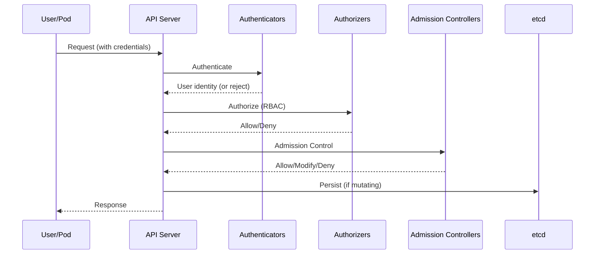
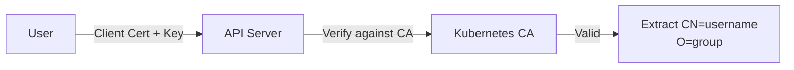
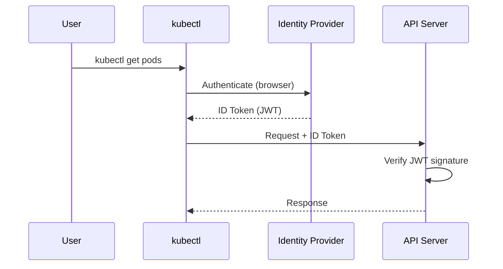

# 5.8.1 Kubernetes Authentication Methods: Proving Your Identity

#### Why Authentication Matters

Before Kubernetes authorizes any action, it must verify **who** is making the request. Authentication is the first step in the security chain:

```
Request → Authentication (Who are you?) → Authorization (What can you do?) → Admission Control (Is it allowed?) → API Server
```

Kubernetes supports multiple authentication methods for different use cases:
- **Users** (humans) – Certificates, OIDC, tokens
- **Service Accounts** (pods) – Mounted tokens, projected volumes

This note covers authentication methods. Note 5.8.2 covers RBAC authorization; note 5.8.3 covers Admission Controllers.

**Backlinks:** [5.1.1 - API Server](../Subchapter_5.1/5.1.1_K8s_Architecture_Components.md) | [5.6.1 - Secrets](../Subchapter_5.6/5.6.1_ConfigMaps_and_Secrets.md) | [Module 1 - SSH Keys](../../1-Linux/Subchapter_1.4/1.4.2_Key_Pair_Authentication.md)

---

## Part 1: Authentication Flow



### Authentication Methods Overview

| Method | Use Case | Users | Service Accounts |
|--------|----------|-------|------------------|
| **X.509 Client Certificates** | Production clusters | ✅ | ❌ |
| **Bearer Tokens** | API access | ✅ | ✅ |
| **Service Account Tokens** | Pod authentication | ❌ | ✅ |
| **OIDC (OpenID Connect)** | Enterprise SSO | ✅ | ❌ |
| **Webhook Token** | Custom auth systems | ✅ | ✅ |
| **Bootstrap Tokens** | Node bootstrapping | ✅ | ❌ |

---

## Part 2: X.509 Client Certificates

The most common method for user authentication in self-managed clusters.

### How It Works



### Creating User Certificate

```bash
# 1. Generate private key
openssl genrsa -out alice.key 2048

# 2. Create Certificate Signing Request (CSR)
# CN = username, O = groups
openssl req -new -key alice.key -out alice.csr \
  -subj "/CN=alice/O=developers/O=frontend-team"

# 3. Create CertificateSigningRequest in Kubernetes
cat <<EOF | kubectl apply -f -
apiVersion: certificates.k8s.io/v1
kind: CertificateSigningRequest
metadata:
  name: alice-csr
spec:
  request: $(cat alice.csr | base64 | tr -d '\n')
  signerName: kubernetes.io/kube-apiserver-client
  usages:
  - client auth
EOF

# 4. Approve CSR
kubectl certificate approve alice-csr

# 5. Get signed certificate
kubectl get csr alice-csr -o jsonpath='{.status.certificate}' | base64 -d > alice.crt

# 6. View certificate details
openssl x509 -in alice.crt -text -noout | grep -E "Subject:|Issuer:"
```

### Configuring kubeconfig with Certificate

```bash
# Add user credentials
kubectl config set-credentials alice \
  --client-certificate=alice.crt \
  --client-key=alice.key

# Add context
kubectl config set-context alice-context \
  --cluster=kubernetes \
  --user=alice \
  --namespace=dev

# Switch to context
kubectl config use-context alice-context

# Test
kubectl auth can-i list pods
```

### kubeconfig with Embedded Certificates

```yaml
# ~/.kube/config
apiVersion: v1
kind: Config
clusters:
- cluster:
    certificate-authority-data: LS0tLS1CRU... # Base64 CA cert
    server: https://api-server:6443
  name: kubernetes
contexts:
- context:
    cluster: kubernetes
    user: alice
    namespace: dev
  name: alice-context
current-context: alice-context
users:
- name: alice
  user:
    client-certificate-data: LS0tLS1CRU... # Base64 client cert
    client-key-data: LS0tLS1CRU...         # Base64 client key
```

---

## Part 3: Service Account Tokens

Service Accounts are used by pods to authenticate to the API server.

### Service Account Basics

```yaml
# serviceaccount.yaml
apiVersion: v1
kind: ServiceAccount
metadata:
  name: my-app-sa
  namespace: default
automountServiceAccountToken: true  # Default: true
```

```bash
# Create ServiceAccount
kubectl create serviceaccount my-app-sa

# List ServiceAccounts
kubectl get serviceaccounts

# Describe (see mounted secrets, if any)
kubectl describe serviceaccount my-app-sa
```

### Token Projection (Kubernetes 1.21+)

Modern Kubernetes uses **projected service account tokens** (time-limited, audience-bound).

```yaml
# pod-with-projected-token.yaml
apiVersion: v1
kind: Pod
metadata:
  name: my-app
spec:
  serviceAccountName: my-app-sa
  containers:
  - name: app
    image: myapp:latest
    volumeMounts:
    - name: token
      mountPath: /var/run/secrets/kubernetes.io/serviceaccount
      readOnly: true
  volumes:
  - name: token
    projected:
      sources:
      - serviceAccountToken:
          path: token
          expirationSeconds: 3600  # 1 hour
          audience: api
      - configMap:
          name: kube-root-ca.crt
          items:
          - key: ca.crt
            path: ca.crt
      - downwardAPI:
          items:
          - path: namespace
            fieldRef:
              fieldPath: metadata.namespace
```

### Token Location in Pod

```bash
# Inside pod, token is at:
/var/run/secrets/kubernetes.io/serviceaccount/token
/var/run/secrets/kubernetes.io/serviceaccount/ca.crt
/var/run/secrets/kubernetes.io/serviceaccount/namespace

# Use token to call API
TOKEN=$(cat /var/run/secrets/kubernetes.io/serviceaccount/token)
curl -H "Authorization: Bearer $TOKEN" \
  --cacert /var/run/secrets/kubernetes.io/serviceaccount/ca.crt \
  https://kubernetes.default.svc/api/v1/namespaces/default/pods
```

### Creating Long-Lived Token (Not Recommended)

```yaml
# secret-sa-token.yaml (legacy method)
apiVersion: v1
kind: Secret
metadata:
  name: my-app-sa-token
  annotations:
    kubernetes.io/service-account.name: my-app-sa
type: kubernetes.io/service-account-token
```

```bash
# Get token from secret
kubectl get secret my-app-sa-token -o jsonpath='{.data.token}' | base64 -d
```

### Disable Token Auto-Mount

```yaml
# Disable for ServiceAccount
apiVersion: v1
kind: ServiceAccount
metadata:
  name: no-token-sa
automountServiceAccountToken: false

---
# Disable for specific Pod
apiVersion: v1
kind: Pod
metadata:
  name: no-token-pod
spec:
  serviceAccountName: default
  automountServiceAccountToken: false
  containers:
  - name: app
    image: nginx
```

---

## Part 4: OpenID Connect (OIDC)

OIDC enables SSO with identity providers like Okta, Azure AD, Google, Keycloak.

### OIDC Flow



### API Server OIDC Configuration

```yaml
# kube-apiserver manifest flags
spec:
  containers:
  - command:
    - kube-apiserver
    - --oidc-issuer-url=https://accounts.google.com
    - --oidc-client-id=kubernetes
    - --oidc-username-claim=email
    - --oidc-groups-claim=groups
    - --oidc-ca-file=/etc/kubernetes/pki/oidc-ca.crt
```

### kubectl OIDC Configuration

```yaml
# kubeconfig with OIDC
users:
- name: oidc-user
  user:
    auth-provider:
      name: oidc
      config:
        idp-issuer-url: https://accounts.google.com
        client-id: kubernetes
        client-secret: xxx
        refresh-token: xxx
        id-token: xxx
```

### Using kubelogin (kubectl-oidc-login)

```bash
# Install kubelogin
kubectl krew install oidc-login

# Configure kubeconfig
kubectl config set-credentials oidc-user \
  --exec-api-version=client.authentication.k8s.io/v1beta1 \
  --exec-command=kubectl \
  --exec-arg=oidc-login \
  --exec-arg=get-token \
  --exec-arg=--oidc-issuer-url=https://dex.example.com \
  --exec-arg=--oidc-client-id=kubernetes
```

---

## Part 5: Webhook Token Authentication

For custom authentication systems (LDAP, custom databases).

### Webhook Configuration

```yaml
# webhook-config.yaml
apiVersion: v1
kind: Config
clusters:
- name: authn-webhook
  cluster:
    server: https://authn.example.com/authenticate
    certificate-authority: /etc/kubernetes/pki/webhook-ca.crt
users:
- name: kube-apiserver
contexts:
- context:
    cluster: authn-webhook
    user: kube-apiserver
  name: webhook
current-context: webhook
```

```yaml
# API Server flags
- --authentication-token-webhook-config-file=/etc/kubernetes/authn-webhook.yaml
- --authentication-token-webhook-cache-ttl=5m
```

### Webhook Request/Response

```json
// Request to webhook
{
  "apiVersion": "authentication.k8s.io/v1",
  "kind": "TokenReview",
  "spec": {
    "token": "bearer-token-from-request"
  }
}

// Response from webhook
{
  "apiVersion": "authentication.k8s.io/v1",
  "kind": "TokenReview",
  "status": {
    "authenticated": true,
    "user": {
      "username": "alice",
      "uid": "1234",
      "groups": ["developers", "frontend"]
    }
  }
}
```

---

## Part 6: Anonymous and Static Token Authentication

### Anonymous Access

```yaml
# API Server flag (disable for production)
- --anonymous-auth=false  # Default: true

# Anonymous requests get username: system:anonymous
# and group: system:unauthenticated
```

### Static Token File (Testing Only)

```csv
# /etc/kubernetes/tokens.csv
token1,admin,admin,system:masters
token2,developer,developer,developers
```

```yaml
# API Server flag
- --token-auth-file=/etc/kubernetes/tokens.csv
```

```bash
# Use static token
curl -H "Authorization: Bearer token1" https://api-server:6443/api/v1/pods
```

---

## Part 7: Impersonation

Admins can impersonate other users for debugging.

```bash
# Impersonate user
kubectl get pods --as=alice

# Impersonate user and group
kubectl get pods --as=alice --as-group=developers

# Impersonate ServiceAccount
kubectl get pods --as=system:serviceaccount:default:my-app-sa

# Check impersonation permissions
kubectl auth can-i impersonate users
kubectl auth can-i impersonate serviceaccounts
```

### Impersonation RBAC

```yaml
# Allow admin to impersonate anyone
apiVersion: rbac.authorization.k8s.io/v1
kind: ClusterRole
metadata:
  name: impersonator
rules:
- apiGroups: [""]
  resources: ["users", "groups", "serviceaccounts"]
  verbs: ["impersonate"]
---
apiVersion: rbac.authorization.k8s.io/v1
kind: ClusterRoleBinding
metadata:
  name: admin-impersonator
subjects:
- kind: User
  name: admin
  apiGroup: rbac.authorization.k8s.io
roleRef:
  kind: ClusterRole
  name: impersonator
  apiGroup: rbac.authorization.k8s.io
```

---

## Part 8: Authentication Debugging

### Check Current Identity

```bash
# Who am I?
kubectl auth whoami  # Kubernetes 1.28+

# Alternative
kubectl config view --minify -o jsonpath='{.users[0].name}'

# Check all identities in kubeconfig
kubectl config get-users
```

### Debug Authentication Issues

```bash
# Enable verbose output
kubectl get pods -v=9

# Check API server logs for auth failures
kubectl logs -n kube-system kube-apiserver-<master> | grep -i "auth"

# Test token validity
TOKEN=$(cat /var/run/secrets/kubernetes.io/serviceaccount/token)
jwt decode $TOKEN  # Use jwt-cli or jwt.io

# Check certificate expiry
openssl x509 -in client.crt -noout -dates
```

### Common Authentication Errors

| Error | Cause | Fix |
|-------|-------|-----|
| `Unauthorized` | Invalid or expired token/cert | Refresh token, regenerate cert |
| `certificate has expired` | Client cert expired | Generate new certificate |
| `x509: certificate signed by unknown authority` | CA mismatch | Use correct CA |
| `User "system:anonymous"` | No credentials provided | Add auth to kubeconfig |
| `cannot impersonate` | Missing impersonation RBAC | Grant impersonate verb |

---

## Quick Task: Create and Use a User Certificate

1. Generate a private key for user "bob".
2. Create a CSR with groups "qa" and "testers".
3. Submit and approve the CSR in Kubernetes.
4. Configure kubeconfig with the certificate.
5. Test authentication (should fail authorization).

> **Ready Solution:**
> ```bash
> # Task 1-2
> openssl genrsa -out bob.key 2048
> openssl req -new -key bob.key -out bob.csr -subj "/CN=bob/O=qa/O=testers"
> 
> # Task 3
> cat <<EOF | kubectl apply -f -
> apiVersion: certificates.k8s.io/v1
> kind: CertificateSigningRequest
> metadata:
>   name: bob-csr
> spec:
>   request: $(cat bob.csr | base64 | tr -d '\n')
>   signerName: kubernetes.io/kube-apiserver-client
>   usages: ["client auth"]
> EOF
> 
> kubectl certificate approve bob-csr
> kubectl get csr bob-csr -o jsonpath='{.status.certificate}' | base64 -d > bob.crt
> 
> # Task 4
> kubectl config set-credentials bob --client-certificate=bob.crt --client-key=bob.key
> kubectl config set-context bob-context --cluster=$(kubectl config current-context) --user=bob
> 
> # Task 5
> kubectl --context=bob-context get pods
> # Error: forbidden (authentication passed, authorization failed - no RBAC)
> ```

---

## Summary Table: Authentication Methods

| Method | Credential | Expiry | Best For |
|--------|------------|--------|----------|
| **X.509 Certificates** | Client cert + key | Custom (years) | Cluster admins, CI/CD |
| **ServiceAccount Token** | Projected JWT | 1 hour (configurable) | Pod-to-API communication |
| **OIDC** | ID Token (JWT) | Short (minutes/hours) | Enterprise SSO |
| **Webhook** | Custom token | Custom | Legacy systems, LDAP |
| **Bootstrap Tokens** | Token | 24 hours | Node joining |

### Authentication Command Reference

| Command | Purpose |
|---------|---------|
| `kubectl auth whoami` | Show current identity |
| `kubectl auth can-i VERB RESOURCE` | Check permission |
| `kubectl auth can-i --list` | List all permissions |
| `kubectl certificate approve NAME` | Approve CSR |
| `kubectl get csr` | List certificate requests |
| `kubectl config set-credentials` | Add user to kubeconfig |
| `kubectl --as=USER` | Impersonate user |

---

**Next note (5.8.2)** will cover **RBAC Deep Dive** – Roles, ClusterRoles, RoleBindings, ClusterRoleBindings, and common RBAC patterns.

**Backlinks:** [5.1.1 - API Server](../Subchapter_5.1/5.1.1_K8s_Architecture_Components.md) | [5.6.1 - Secrets](../Subchapter_5.6/5.6.1_ConfigMaps_and_Secrets.md) | [Module 1 - SSH](../../1-Linux/Subchapter_1.4/1.4.2_Key_Pair_Authentication.md)
