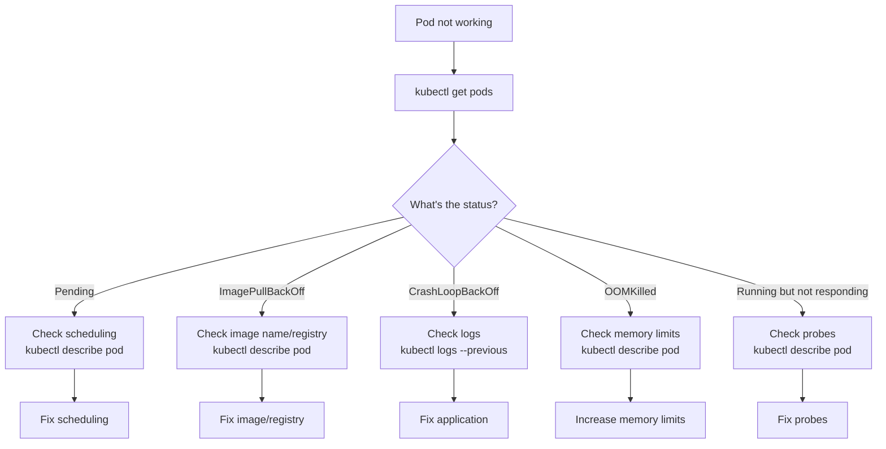

# 5.8.1 Troubleshooting Pods and Nodes: Diagnosing Common Failures

#### Why Troubleshooting Skills Matter

Production Kubernetes clusters will experience failures. Your ability to quickly diagnose and resolve issues determines uptime. Common failure patterns include:

* **CrashLoopBackOff** – Container crashes on startup

* **ImagePullBackOff** – Cannot pull container image

* **OOMKilled** – Container exceeds memory limit

* **Pending** – Pod cannot be scheduled

* **NodeNotReady** – Worker node problems

This note covers pod and node troubleshooting. Note 5.8.2 covers monitoring; note 5.8.3 is the final review with exam.

**Backward references:** Pod lifecycle from 5.3.1; resource limits from Module 4; image pull secrets from 5.6.1; node conditions from 5.1.1.

***

## Part 1: Pod Troubleshooting Workflow

### Systematic Approach



### Essential Troubleshooting Commands

```bash
# 1. List pods with status
kubectl get pods
kubectl get pods -o wide
kubectl get pods -w  # Watch changes

# 2. Describe pod (events, status, conditions)
kubectl describe pod mypod

# 3. View logs
kubectl logs mypod
kubectl logs mypod --previous  # Previous container (crash)
kubectl logs mypod -c sidecar  # Multi-container pod

# 4. Exec into pod
kubectl exec -it mypod -- /bin/sh

# 5. Port forward for debugging
kubectl port-forward mypod 8080:80

# 6. Copy files from pod
kubectl cp mypod:/var/log/app.log ./app.log
```

***

## Part 2: Pod Status Deep Dive

### Status Types and Solutions

| Status                | Meaning                             | Investigation             | Common Fix                            |
| --------------------- | ----------------------------------- | ------------------------- | ------------------------------------- |
| **Pending**           | Pod not scheduled                   | `kubectl describe pod`    | Add resources, remove taints, fix PVC |
| **ContainerCreating** | Pulling image or mounting volume    | `kubectl describe pod`    | Check registry, PVC, storage class    |
| **Running**           | Pod running (may still have issues) | Check logs and probes     | Fix application, probes               |
| **CrashLoopBackOff**  | Container crashing repeatedly       | `kubectl logs --previous` | Fix application, check config         |
| **ImagePullBackOff**  | Cannot pull image                   | `kubectl describe pod`    | Fix image name, add imagePullSecrets  |
| **ErrImagePull**      | Image pull error                    | `kubectl describe pod`    | Check registry connectivity           |
| **OOMKilled**         | Out of memory                       | `kubectl describe pod`    | Increase memory limits                |
| **Evicted**           | Node resource pressure              | `kubectl describe pod`    | Reduce resource usage, add nodes      |
| **Completed**         | Job finished                        | Normal for Jobs           | N/A                                   |
| **Terminating**       | Pod being deleted                   | May be stuck              | Force delete if stuck                 |

***

## Part 3: CrashLoopBackOff – Container Crashing

### Symptoms

```bash
kubectl get pods
# NAME      READY   STATUS             RESTARTS   AGE
# mypod     0/1     CrashLoopBackOff   5          2m
```

### Investigation Steps

```bash
# 1. View current logs (may be from last crash)
kubectl logs mypod

# 2. View previous container logs (most important!)
kubectl logs mypod --previous

# 3. Describe pod for events
kubectl describe pod mypod | grep -A 20 Events

# 4. Check exit code
kubectl get pod mypod -o jsonpath='{.status.containerStatuses[0].lastState.terminated.exitCode}'
```

### Common Causes and Fixes

| Log Message            | Cause                                | Fix                                      |
| ---------------------- | ------------------------------------ | ---------------------------------------- |
| `command not found`    | Wrong command in Dockerfile/pod spec | Check `command` field                    |
| `file not found`       | Missing config file                  | Add ConfigMap mount                      |
| `permission denied`    | Wrong user                           | Set `securityContext.runAsNonRoot: true` |
| `port already in use`  | Port conflict                        | Change port                              |
| `connection refused`   | Dependency not ready                 | Add initContainer, retry logic           |
| `panic: runtime error` | Application bug                      | Fix code, update image                   |
| `exited with code 1`   | Generic error                        | Check application logs                   |

### Debugging with Ephemeral Container (K8s 1.23+)

```bash
# Create debug container alongside crashing container
kubectl debug mypod -it --image=busybox --target=mypod

# Replace the container with debug shell
kubectl debug mypod -it --image=ubuntu -- sh
```

### Debugging by Overriding Command

```bash
# Override command to sleep, then exec in
kubectl get pod mypod -o yaml > debug.yaml
# Edit: change command to ["sleep", "3600"]
kubectl delete pod mypod
kubectl apply -f debug.yaml
kubectl exec -it mypod -- /bin/sh
# Manually run the original command to see error
```

***

## Part 4: ImagePullBackOff – Image Pull Failures

### Symptoms

```bash
kubectl get pods
# NAME      READY   STATUS             RESTARTS   AGE
# mypod     0/1     ImagePullBackOff   0          30s
```

### Investigation Steps

```bash
# 1. Describe pod for detailed error
kubectl describe pod mypod | grep -A 10 Events
# Events:
#   Failed to pull image "myapp:latest": rpc error: code = Unknown desc = failed to pull and unpack image...

# 2. Check image name
kubectl get pod mypod -o jsonpath='{.spec.containers[0].image}'

# 3. Test image pull manually (on node)
docker pull myapp:latest
# or
crictl pull myapp:latest
```

### Common Causes and Fixes

| Error Message                                         | Cause                   | Fix                  |
| ----------------------------------------------------- | ----------------------- | -------------------- |
| `image not found`                                     | Wrong image name or tag | Fix image name       |
| `unauthorized: authentication required`               | Private registry        | Add imagePullSecrets |
| `dial tcp: lookup registry.example.com: no such host` | DNS issue               | Check CoreDNS        |
| `connection refused`                                  | Registry down           | Check registry       |
| `x509: certificate signed by unknown authority`       | Self-signed cert        | Add CA to nodes      |

### Adding imagePullSecrets

```yaml
# pod-with-secret.yaml
apiVersion: v1
kind: Pod
metadata:
  name: mypod
spec:
  imagePullSecrets:
  - name: regcred
  containers:
  - name: app
    image: private-registry.example.com/myapp:latest
```

```bash
# Create docker registry secret
kubectl create secret docker-registry regcred \
  --docker-server=private-registry.example.com \
  --docker-username=myuser \
  --docker-password=mypassword
```

***

## Part 5: OOMKilled – Out of Memory

### Symptoms

```bash
kubectl get pods
# NAME      READY   STATUS      RESTARTS   AGE
# mypod     0/1     OOMKilled   2          5m

kubectl describe pod mypod | grep -A 5 "State"
# State:        Terminated
#   Reason:     OOMKilled
#   Exit Code:  137
```

### Investigation Steps

```bash
# 1. Check memory limits
kubectl get pod mypod -o jsonpath='{.spec.containers[0].resources}'

# 2. Check actual memory usage before OOM
kubectl top pod mypod --containers

# 3. Check node memory pressure
kubectl describe node <node-name> | grep -A 10 "Conditions"

# 4. View logs before OOM
kubectl logs mypod --previous | tail -50
```

### Fixes

**Option 1: Increase memory limits**

```yaml
resources:
  requests:
    memory: "512Mi"
  limits:
    memory: "1Gi"  # Increase from 512Mi
```

**Option 2: Find and fix memory leak**

```bash
# Exec into pod (if still running)
kubectl exec -it mypod -- /bin/sh
# Use tools to debug memory usage
top
cat /proc/meminfo
```

**Option 3: Add memory request (if missing)**

```yaml
resources:
  requests:
    memory: "256Mi"  # Guaranteed memory
  limits:
    memory: "512Mi"
```

**Option 4: Use memory limit with swap (if supported)**

```yaml
# Some clusters support swap
resources:
  limits:
    memory: "1Gi"
    memory-swap: "2Gi"
```

***

## Part 6: Pending Pods – Scheduling Failures

### Symptoms

```bash
kubectl get pods
# NAME      READY   STATUS    RESTARTS   AGE
# mypod     0/1     Pending   0          30s
```

### Investigation Steps

```bash
# 1. Describe pod for scheduling events
kubectl describe pod mypod | grep -A 20 Events
# Events:
#   Type     Reason            Message
#   Warning  FailedScheduling  0/3 nodes are available: insufficient cpu

# 2. Check node resources
kubectl top nodes
kubectl describe nodes | grep -A 5 "Allocated resources"

# 3. Check node conditions
kubectl get nodes
kubectl describe node <node-name> | grep -A 10 "Conditions"
```

### Common Causes and Fixes

| Event Message                            | Cause                    | Fix                               |
| ---------------------------------------- | ------------------------ | --------------------------------- |
| `insufficient cpu`                       | Not enough CPU           | Add nodes, reduce CPU requests    |
| `insufficient memory`                    | Not enough memory        | Add nodes, reduce memory requests |
| `node(s) had untolerated taint`          | Taint without toleration | Add toleration, remove taint      |
| `pod has unbound PersistentVolumeClaims` | PVC not bound            | Create PV or StorageClass         |
| `node selector mismatch`                 | Node selector no match   | Fix node selector                 |
| `0/3 nodes are available`                | No available nodes       | Check node readiness              |

### Resource Request Optimization

```bash
# View resource usage
kubectl top pods
kubectl top nodes

# Adjust requests based on actual usage
# VPA recommendations (if installed)
kubectl get vpa myapp-vpa -o yaml | grep -A 10 recommendation
```

***

## Part 7: Node Troubleshooting

### Node Conditions

```bash
kubectl get nodes
# NAME       STATUS     ROLES           AGE   VERSION
# master     Ready      control-plane   10d   v1.29.0
# worker-1   NotReady   <none>          10d   v1.29.0
# worker-2   Unknown    <none>          10d   v1.29.0

kubectl describe node worker-1 | grep -A 10 "Conditions"
# Conditions:
#   Type             Status  LastHeartbeatTime                 Reason
#   Ready            False   ...                               KubeletNotReady
#   MemoryPressure   False   ...
#   DiskPressure     True    ...                               KubeletHasDiskPressure
#   PIDPressure      False   ...
#   NetworkUnavailable False ...
```

### Node Condition Types

| Condition            | Status  | Meaning            | Action                 |
| -------------------- | ------- | ------------------ | ---------------------- |
| `Ready`              | True    | Node healthy       | Normal                 |
| `Ready`              | False   | Node unhealthy     | Check kubelet          |
| `Ready`              | Unknown | Lost communication | Check network          |
| `MemoryPressure`     | True    | Memory low         | Reduce pods, add nodes |
| `DiskPressure`       | True    | Disk full          | Clean up images, logs  |
| `PIDPressure`        | True    | Too many processes | Reduce pods            |
| `NetworkUnavailable` | True    | CNI issue          | Check CNI plugin       |

### Node Troubleshooting Steps

```bash
# On the problematic node (via SSH or node debugging)

# 1. Check kubelet status
systemctl status kubelet
journalctl -u kubelet -f --since "5 minutes ago"

# 2. Check container runtime
systemctl status containerd
crictl ps

# 3. Check disk space
df -h
# If /var is full, clean up:
docker system prune -a
journalctl --vacuum-size=500M

# 4. Check memory
free -h

# 5. Check network
ip addr show
ping <api-server-ip>

# 6. Restart kubelet if needed
systemctl restart kubelet
```

### Node Debugging Pod

```bash
# Create debug pod on specific node
kubectl debug node/worker-1 -it --image=ubuntu

# Inside debug pod, node filesystem is at /host
chroot /host
# Now run node commands
systemctl status kubelet
```

### Cordoning and Draining Nodes

```bash
# Mark node as unschedulable (no new pods)
kubectl cordon worker-1

# Drain node (evict pods)
kubectl drain worker-1 --ignore-daemonsets --delete-emptydir-data

# Uncordon when fixed
kubectl uncordon worker-1
```

***

## Part 8: Common Pod Event Messages

| Event                    | Meaning                     | Action                            |
| ------------------------ | --------------------------- | --------------------------------- |
| `FailedScheduling`       | Pod cannot be placed        | Check resources, taints, affinity |
| `FailedMount`            | Volume mount error          | Check PVC, PV, storage class      |
| `FailedCreatePodSandBox` | CNI or runtime error        | Check CNI plugin                  |
| `Failed to pull image`   | Image pull error            | Check image name, registry        |
| `BackOff`                | Crash loop                  | Check logs                        |
| `Killing`                | Container killed (OOM)      | Increase memory limit             |
| `Readiness probe failed` | Pod not ready               | Check app, probe config           |
| `Liveness probe failed`  | Pod unhealthy               | Check app, probe config           |
| `NodeNotReady`           | Node unhealthy              | Check node                        |
| `Evicted`                | Pod removed due to pressure | Reduce resource usage             |

***

## Quick Task: Troubleshooting Practice

*Simulate and fix common pod issues.*

1. Create a pod with a typo in the image name.
2. Diagnose and fix ImagePullBackOff.
3. Create a pod with a command that exits immediately.
4. Diagnose and fix CrashLoopBackOff.
5. Create a pod with insufficient memory request.
6. Diagnose and fix OOMKilled.

> **Ready Solution:**
>
> ```bash
> # Task 1-2: ImagePullBackOff
> kubectl run bad-image --image=nginx:invalid-tag
> kubectl get pods
> kubectl describe pod bad-image
> kubectl delete pod bad-image
> kubectl run good-image --image=nginx:latest
>
> # Task 3-4: CrashLoopBackOff
> kubectl run crash-loop --image=busybox --command -- sh -c "exit 1"
> kubectl get pods
> kubectl logs crash-loop --previous
> kubectl delete pod crash-loop
> kubectl run working --image=busybox --command -- sh -c "sleep 3600"
>
> # Task 5-6: OOMKilled
> kubectl run oom-test --image=stress -- --vm 1 --vm-bytes 512M --vm-hang 1
> # If memory limit not set, may consume all memory
> kubectl run oom-limited --image=stress --limits=memory=256Mi -- --vm 1 --vm-bytes 300M
> kubectl describe pod oom-limited
> # Will show OOMKilled
> ```

***

## Summary Table: Pod Status and Fixes

| Status              | Common Cause           | Diagnostic                | Fix                        |
| ------------------- | ---------------------- | ------------------------- | -------------------------- |
| Pending             | Insufficient resources | `kubectl describe pod`    | Add nodes, reduce requests |
| ImagePullBackOff    | Wrong image name       | `kubectl describe pod`    | Fix image name             |
| CrashLoopBackOff    | App error              | `kubectl logs --previous` | Fix app, config            |
| OOMKilled           | Memory limit too low   | `kubectl describe pod`    | Increase memory limit      |
| Evicted             | Node pressure          | `kubectl describe pod`    | Clean node, reduce usage   |
| Terminating (stuck) | Finalizer blocking     | `kubectl get pod -o yaml` | Force delete               |

### Troubleshooting Commands Quick Reference

| Command                            | Purpose                 |
| ---------------------------------- | ----------------------- |
| `kubectl get pods`                 | List pods with status   |
| `kubectl describe pod NAME`        | Detailed info + events  |
| `kubectl logs NAME`                | Current logs            |
| `kubectl logs NAME --previous`     | Previous container logs |
| `kubectl exec -it NAME -- /bin/sh` | Interactive shell       |
| `kubectl top pod NAME`             | Resource usage          |
| `kubectl get events`               | Cluster events          |
| `kubectl get nodes`                | Node status             |
| `kubectl describe node NAME`       | Node conditions         |

***

**Next note (5.8.2)** will cover **Monitoring with Prometheus and Grafana** – metrics collection, node exporter, kube-state-metrics, dashboards, and logging with EFK/Loki.

**Backward references:**

* Pod lifecycle from 5.3.1 (status phases)

* Resource limits from Module 4 (memory/CPU)

* Image pull secrets from 5.6.1 (private registry auth)

* Node components from 5.1.1 (kubelet, container runtime)
