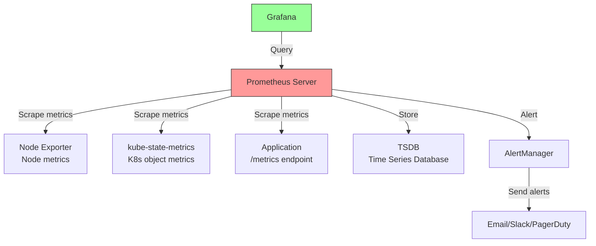

# 5.8.2 Monitoring with Prometheus, Grafana, and Logging: Observability Stack

#### Why Monitoring Matters

`kubectl get pods` tells you if a pod is running. But running doesn't mean healthy. Monitoring provides:

* **Metrics** – CPU, memory, request rates, error rates (Prometheus)

* **Visualization** – Dashboards for trends and anomalies (Grafana)

* **Logging** – Centralized log aggregation (EFK/Loki)

* **Alerting** – Proactive notifications (AlertManager)

This note covers Prometheus, Grafana, and logging stacks. Note 5.8.1 covered troubleshooting; note 5.8.3 is the final review with exam.

**Backward references:** Metrics from 5.6.2 (HPA uses metrics); Pod status from 5.8.1; Node conditions from 5.1.1.

***

## Part 1: Prometheus Architecture



### Prometheus Components

| Component             | Purpose                                                |
| --------------------- | ------------------------------------------------------ |
| **Prometheus Server** | Scrapes, stores, queries metrics                       |
| **AlertManager**      | Routes alerts to receivers                             |
| **Exporters**         | Expose metrics from systems (node, kube-state-metrics) |
| **Grafana**           | Dashboard visualization                                |
| **Pushgateway**       | Short-lived job metrics (batch jobs)                   |

***

## Part 2: Installing Prometheus Stack (kube-prometheus-stack)

The easiest way to deploy full monitoring is with the Prometheus community Helm chart.

```bash
# Add repo
helm repo add prometheus-community https://prometheus-community.github.io/helm-charts
helm repo update

# Install kube-prometheus-stack
helm install prometheus prometheus-community/kube-prometheus-stack \
  --namespace monitoring \
  --create-namespace \
  --set grafana.adminPassword=admin
```

### Components Installed

```bash
kubectl get pods -n monitoring
# NAME                                                     READY   STATUS
# prometheus-grafana-xxx                                   2/2     Running
# prometheus-kube-state-metrics-xxx                        1/1     Running
# prometheus-prometheus-node-exporter-xxx                  1/1     Running
# prometheus-prometheus-pushgateway-xxx                    1/1     Running
# prometheus-server-xxx                                    2/2     Running
# alertmanager-prometheus-alertmanager-xxx                 2/2     Running
```

### Accessing Services

```bash
# Port-forward Prometheus
kubectl port-forward -n monitoring svc/prometheus-server 9090:80
# Access: http://localhost:9090

# Port-forward Grafana
kubectl port-forward -n monitoring svc/prometheus-grafana 3000:80
# Access: http://localhost:3000 (admin/admin)
```

***

## Part 3: PromQL – Query Language

### Basic Queries

```promql
# CPU usage per pod
sum(rate(container_cpu_usage_seconds_total[5m])) by (pod)

# Memory usage per pod
sum(container_memory_working_set_bytes) by (pod)

# Pod restart count
kube_pod_container_status_restarts_total

# Node CPU utilization
100 - (avg(rate(node_cpu_seconds_total{mode="idle"}[5m])) * 100)

# Node memory utilization
100 * (1 - (node_memory_MemAvailable_bytes / node_memory_MemTotal_bytes))

# Request rate per second
sum(rate(nginx_http_requests_total[1m])) by (ingress)

# Error rate (5xx responses)
sum(rate(nginx_http_requests_total{status=~"5.."}[5m])) / sum(rate(nginx_http_requests_total[5m]))
```

### Common PromQL Functions

| Function               | Purpose                      | Example                            |
| ---------------------- | ---------------------------- | ---------------------------------- |
| `rate()`               | Per-second average over time | `rate(counter[5m])`                |
| `irate()`              | Instant per-second rate      | `irate(counter[5m])`               |
| `sum()`                | Aggregate values             | `sum(metric) by (label)`           |
| `avg()`                | Average values               | `avg(metric)`                      |
| `max()`                | Maximum values               | `max(metric)`                      |
| `topk()`               | Top K values                 | `topk(10, metric)`                 |
| `histogram_quantile()` | Percentile from histogram    | `histogram_quantile(0.95, metric)` |

### Query Examples

```promql
# Top 10 pods by CPU usage
topk(10, sum(rate(container_cpu_usage_seconds_total[5m])) by (pod))

# 95th percentile request latency
histogram_quantile(0.95, sum(rate(http_request_duration_seconds_bucket[5m])) by (le))

# Alerts when pod restart count > 0
kube_pod_container_status_restarts_total > 0

# Memory usage percentage per node
100 * (1 - (node_memory_MemAvailable_bytes / node_memory_MemTotal_bytes))
```

***

## Part 4: AlertManager Configuration

### Alert Rules Example

```yaml
# prometheus-rules.yaml
groups:
- name: kubernetes-apps
  rules:
  - alert: HighPodRestarts
    expr: kube_pod_container_status_restarts_total > 5
    for: 10m
    labels:
      severity: warning
    annotations:
      summary: "Pod {{ $labels.pod }} is restarting frequently"
      description: "Pod {{ $labels.pod }} has restarted {{ $value }} times in the last 10 minutes"

  - alert: PodCrashLooping
    expr: kube_pod_container_status_restarts_total > 10
    for: 5m
    labels:
      severity: critical
    annotations:
      summary: "Pod {{ $labels.pod }} is crash looping"

  - alert: NodeHighMemoryUsage
    expr: (1 - (node_memory_MemAvailable_bytes / node_memory_MemTotal_bytes)) * 100 > 90
    for: 10m
    labels:
      severity: warning
    annotations:
      summary: "Node {{ $labels.node }} has high memory usage"
      description: "Memory usage is {{ $value }}%"

  - alert: NodeNotReady
    expr: kube_node_status_condition{condition="Ready",status="true"} == 0
    for: 5m
    labels:
      severity: critical
    annotations:
      summary: "Node {{ $labels.node }} is not ready"

  - alert: CPUThrottlingHigh
    expr: sum(increase(container_cpu_cfs_throttled_seconds_total[5m])) by (pod) > 0
    for: 5m
    labels:
      severity: warning
    annotations:
      summary: "Pod {{ $labels.pod }} is experiencing CPU throttling"

  - alert: PVCUsageHigh
    expr: (kubelet_volume_stats_used_bytes / kubelet_volume_stats_capacity_bytes) * 100 > 85
    for: 5m
    labels:
      severity: warning
    annotations:
      summary: "PVC {{ $labels.persistentvolumeclaim }} is {{ $value }}% full"
```

### AlertManager Configuration

```yaml
# alertmanager-config.yaml
global:
  slack_api_url: 'https://hooks.slack.com/services/xxx'

route:
  group_by: ['alertname', 'namespace']
  group_wait: 10s
  group_interval: 10s
  repeat_interval: 1h
  receiver: 'default-receiver'
  routes:
  - match:
      severity: critical
    receiver: critical-receiver
    continue: true
  - match:
      severity: warning
    receiver: warning-receiver

receivers:
- name: 'default-receiver'
  slack_configs:
  - channel: '#alerts'
    title: '{{ .GroupLabels.alertname }}'
    text: '{{ range .Alerts }}{{ .Annotations.summary }}\n{{ end }}'

- name: 'critical-receiver'
  pagerduty_configs:
  - service_key: 'xxx'
  slack_configs:
  - channel: '#critical-alerts'
    title: '🚨 CRITICAL: {{ .GroupLabels.alertname }}'
```

***

## Part 5: Grafana Dashboards

### Pre-built Dashboards

```bash
# List available dashboards
kubectl get configmap -n monitoring | grep grafana-dashboard

# Common dashboards installed:
# - Kubernetes / Compute Resources / Cluster
# - Kubernetes / Compute Resources / Namespace (Pods)
# - Kubernetes / Compute Resources / Node (Pods)
# - Kubernetes / Networking / Cluster
# - Node Exporter / Nodes
```

### Import Dashboard by ID

```bash
# In Grafana UI:
# 1. Click "+" → "Import"
# 2. Enter dashboard ID:
#    - 315: Kubernetes Cluster Monitoring (Prometheus)
#    - 6417: Kubernetes / Views / Global
#    - 8588: Kubernetes / Compute Resources / Cluster
#    - 1860: Node Exporter Full
# 3. Select Prometheus data source
```

### Custom Dashboard JSON

```json
{
  "dashboard": {
    "title": "Pod Resource Usage",
    "panels": [
      {
        "title": "CPU Usage per Pod",
        "targets": [
          {
            "expr": "sum(rate(container_cpu_usage_seconds_total[5m])) by (pod)",
            "legendFormat": "{{ pod }}"
          }
        ],
        "gridPos": { "h": 8, "w": 12, "x": 0, "y": 0 }
      },
      {
        "title": "Memory Usage per Pod",
        "targets": [
          {
            "expr": "sum(container_memory_working_set_bytes) by (pod)",
            "legendFormat": "{{ pod }}"
          }
        ],
        "gridPos": { "h": 8, "w": 12, "x": 12, "y": 0 }
      }
    ]
  }
}
```

***

## Part 6: Logging with Loki (Lightweight)

Loki is a Prometheus-inspired log aggregation system.

### Installing Loki Stack

```bash
# Add Grafana repo
helm repo add grafana https://grafana.github.io/helm-charts
helm repo update

# Install Loki stack
helm install loki grafana/loki-stack \
  --namespace monitoring \
  --create-namespace \
  --set grafana.enabled=true \
  --set promtail.enabled=true
```

### LogQL – Loki Query Language

```logql
# Basic log queries
{namespace="prod", pod="myapp"}

# Filter by regex
{namespace="prod"} |= "error"
{namespace="prod"} != "debug"
{namespace="prod"} |~ "5\\d{2}"

# Log rate over time
rate({namespace="prod"}[5m])

# Count error logs
count_over_time({namespace="prod"} |= "error" [5m])

# Logs with JSON parsing
{namespace="prod"} | json | level="error"
```

### Log CLI with `kubectl logs` vs Loki

| Feature                  | kubectl logs | Loki  |
| ------------------------ | ------------ | ----- |
| Pod logs                 | Yes          | Yes   |
| Cross-pod search         | No           | Yes   |
| Cross-namespace          | No           | Yes   |
| Historical               | Limited      | Yes   |
| Query language           | No           | LogQL |
| Integration with Grafana | No           | Yes   |

***

## Part 7: EFK Stack (Elasticsearch, Fluentd, Kibana)

For larger deployments, EFK provides full-text search.

### Installing EFK

```bash
# Add Elastic repo
helm repo add elastic https://helm.elastic.co
helm repo update

# Install Elasticsearch
helm install elasticsearch elastic/elasticsearch \
  --namespace logging \
  --create-namespace \
  --set replicas=1 \
  --set resources.requests.memory=2Gi

# Install Kibana
helm install kibana elastic/kibana \
  --namespace logging

# Install Fluentd (log collector)
helm install fluentd elastic/fluentd \
  --namespace logging \
  --set elasticsearch.host=elasticsearch-master
```

### Fluentd Configuration

```yaml
# fluentd-config.yaml
apiVersion: v1
kind: ConfigMap
metadata:
  name: fluentd-config
data:
  fluent.conf: |
    <source>
      @type tail
      path /var/log/containers/*.log
      pos_file /var/log/fluentd-containers.log.pos
      tag kubernetes.*
      read_from_head true
      <parse>
        @type json
        time_format %Y-%m-%dT%H:%M:%S.%NZ
      </parse>
    </source>

    <filter kubernetes.**>
      @type kubernetes_metadata
    </filter>

    <match **>
      @type elasticsearch
      host elasticsearch-master
      port 9200
      logstash_format true
      logstash_prefix kubernetes
      <buffer>
        @type memory
        flush_interval 5s
      </buffer>
    </match>
```

***

## Part 8: Monitoring Best Practices

### Metrics to Monitor

| Category       | Metrics                           | Alert Threshold |
| -------------- | --------------------------------- | --------------- |
| **Node**       | CPU, memory, disk, network        | >80%            |
| **Pod**        | Restarts, OOM kills, ready status | Restarts >5     |
| **Container**  | CPU throttling, memory limit      | Throttling >0   |
| **API Server** | Request latency, error rate       | >1s, >1%        |
| **etcd**       | Leader changes, database size     | >3 changes/hour |
| **PVC**        | Usage percentage                  | >85%            |
| **Ingress**    | 5xx errors, latency               | >1% error, >2s  |

### Resource Monitoring Commands

```bash
# Quick resource checks
kubectl top nodes
kubectl top pods --all-namespaces

# Historical (with metrics-server retention)
# For longer retention, use Prometheus
```

### Setting Up Alerts

```bash
# Check AlertManager configuration
kubectl get secret -n monitoring alertmanager-prometheus-kube-prometheus-alertmanager -o jsonpath='{.data.alertmanager\.yaml}' | base64 -d

# View active alerts
kubectl port-forward -n monitoring svc/prometheus-server 9090:80
# http://localhost:9090/alerts

# View AlertManager UI
kubectl port-forward -n monitoring svc/prometheus-alertmanager 9093:9093
```

***

## Quick Task: Monitor a Test Application

*Deploy a test application and observe metrics.*

1. Deploy a stress test pod that consumes CPU.
2. Access Prometheus and query CPU usage.
3. Create a Grafana dashboard for the metric.
4. Configure an alert for high CPU usage.

> **Ready Solution:**
>
> ```bash
> # Task 1
> kubectl run stress-test --image=polinux/stress -- --cpu 2 --timeout 300
>
> # Task 2 (Prometheus port-forward)
> kubectl port-forward -n monitoring svc/prometheus-server 9090:80
> # Query: sum(rate(container_cpu_usage_seconds_total{pod="stress-test"}[1m]))
>
> # Task 3 (Grafana port-forward)
> kubectl port-forward -n monitoring svc/prometheus-grafana 3000:80
> # Create dashboard with the same query
>
> # Task 4 (Create PrometheusRule)
> cat << EOF | kubectl apply -f -
> apiVersion: monitoring.coreos.com/v1
> kind: PrometheusRule
> metadata:
>   name: stress-test-alert
>   namespace: monitoring
> spec:
>   groups:
>   - name: stress-test
>     rules:
>     - alert: HighCPUUsage
>       expr: sum(rate(container_cpu_usage_seconds_total{pod="stress-test"}[1m])) > 1.5
>       for: 1m
>       labels:
>         severity: warning
>       annotations:
>         summary: "High CPU usage on stress-test pod"
> EOF
> ```

***

## Summary Table: Monitoring Components

| Component              | Purpose                            | Port |
| ---------------------- | ---------------------------------- | ---- |
| **Prometheus Server**  | Metrics collection, storage, query | 9090 |
| **AlertManager**       | Alert routing                      | 9093 |
| **Grafana**            | Dashboards                         | 3000 |
| **Node Exporter**      | Node metrics (CPU, memory, disk)   | 9100 |
| **kube-state-metrics** | K8s object metrics                 | 8080 |
| **Loki**               | Log aggregation                    | 3100 |
| **Elasticsearch**      | Log storage (EFK)                  | 9200 |
| **Kibana**             | Log visualization (EFK)            | 5601 |

### PromQL Quick Reference

| Function               | Purpose                 |
| ---------------------- | ----------------------- |
| `rate()`               | Per-second average      |
| `irate()`              | Instant per-second rate |
| `sum()`                | Aggregate by labels     |
| `avg()`                | Average                 |
| `topk()`               | Top K values            |
| `histogram_quantile()` | Percentile              |

### Alert Severity Levels

| Severity   | Meaning                   | Response                 |
| ---------- | ------------------------- | ------------------------ |
| `critical` | Immediate action required | Page on-call engineer    |
| `warning`  | Investigate soon          | Slack/email notification |
| `info`     | Informational             | Dashboard annotation     |

***

**Next note (5.8.3)** will be the Subchapter Review for Troubleshooting, Monitoring, and Common Issues, plus the **Final Exam for Module 5** covering all topics.

**Backward references:**

* Metrics from 5.6.2 (HPA uses same metrics)

* Pod status from 5.8.1 (alerts based on status)

* Node conditions from 5.1.1 (node monitoring)

* Helm from 5.7.2 (installing monitoring stack)
