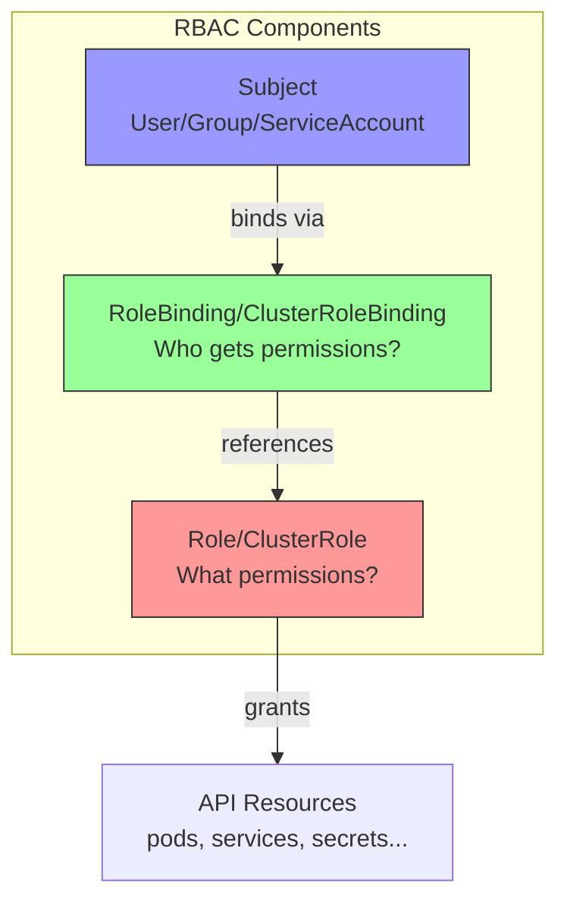

# 5.8.2 RBAC Deep Dive: Role-Based Access Control

#### Why RBAC Matters

RBAC (Role-Based Access Control) is Kubernetes' authorization mechanism. After authentication proves *who* you are, RBAC determines *what* you can do:

- **Principle of Least Privilege** – Grant only necessary permissions
- **Multi-tenancy** – Isolate teams by namespace
- **Compliance** – Audit who can access what
- **Security** – Prevent privilege escalation

This note provides a deep dive into RBAC. Note 5.8.1 covered authentication; note 5.8.3 covers Admission Controllers.

**Backlinks:** [5.8.1 - Authentication](./5.8.1_Authentication_Methods.md) | [5.6.1 - Secrets](../Subchapter_5.6/5.6.1_ConfigMaps_and_Secrets.md) | [5.3.1 - ServiceAccounts](../Subchapter_5.3/5.3.1_Pod_Fundamentals_and_Lifecycle.md)

---

## Part 1: RBAC Architecture



### RBAC Components

| Component | Scope | Purpose |
|-----------|-------|---------|
| **Role** | Namespace | Define permissions within a namespace |
| **ClusterRole** | Cluster | Define permissions cluster-wide |
| **RoleBinding** | Namespace | Bind Role/ClusterRole to subjects in a namespace |
| **ClusterRoleBinding** | Cluster | Bind ClusterRole to subjects cluster-wide |

### Subjects

| Subject Type | Example | Use Case |
|--------------|---------|----------|
| **User** | `alice` | Human users (via certificates, OIDC) |
| **Group** | `developers` | Groups of users (from cert O= or OIDC) |
| **ServiceAccount** | `system:serviceaccount:default:my-sa` | Pods, controllers |

---

## Part 2: Roles and ClusterRoles

### Role Example (Namespace-Scoped)

```yaml
# role-pod-reader.yaml
apiVersion: rbac.authorization.k8s.io/v1
kind: Role
metadata:
  namespace: dev
  name: pod-reader
rules:
- apiGroups: [""]           # "" = core API group
  resources: ["pods"]
  verbs: ["get", "list", "watch"]
- apiGroups: [""]
  resources: ["pods/log"]
  verbs: ["get"]
- apiGroups: [""]
  resources: ["pods/exec"]
  verbs: ["create"]
```

### ClusterRole Example (Cluster-Scoped)

```yaml
# clusterrole-secret-reader.yaml
apiVersion: rbac.authorization.k8s.io/v1
kind: ClusterRole
metadata:
  name: secret-reader
rules:
- apiGroups: [""]
  resources: ["secrets"]
  verbs: ["get", "list", "watch"]
```

### ClusterRole for Non-Namespaced Resources

```yaml
# clusterrole-node-viewer.yaml
apiVersion: rbac.authorization.k8s.io/v1
kind: ClusterRole
metadata:
  name: node-viewer
rules:
- apiGroups: [""]
  resources: ["nodes"]
  verbs: ["get", "list", "watch"]
- apiGroups: [""]
  resources: ["persistentvolumes"]
  verbs: ["get", "list"]
```

### API Groups Reference

| API Group | Resources | Example |
|-----------|-----------|---------|
| `""` (core) | pods, services, configmaps, secrets, nodes, namespaces | `apiGroups: [""]` |
| `apps` | deployments, statefulsets, daemonsets, replicasets | `apiGroups: ["apps"]` |
| `batch` | jobs, cronjobs | `apiGroups: ["batch"]` |
| `networking.k8s.io` | networkpolicies, ingresses | `apiGroups: ["networking.k8s.io"]` |
| `rbac.authorization.k8s.io` | roles, clusterroles, bindings | `apiGroups: ["rbac.authorization.k8s.io"]` |
| `storage.k8s.io` | storageclasses, volumeattachments | `apiGroups: ["storage.k8s.io"]` |
| `autoscaling` | horizontalpodautoscalers | `apiGroups: ["autoscaling"]` |

### RBAC Verbs

| Verb | HTTP Method | Description |
|------|-------------|-------------|
| `get` | GET (single) | Read single resource |
| `list` | GET (list) | List resources |
| `watch` | GET (stream) | Watch for changes |
| `create` | POST | Create resource |
| `update` | PUT | Replace resource |
| `patch` | PATCH | Partial update |
| `delete` | DELETE | Delete single resource |
| `deletecollection` | DELETE | Delete multiple resources |
| `impersonate` | - | Impersonate users/groups |
| `bind` | - | Bind roles (special) |
| `escalate` | - | Escalate privileges (special) |

---

## Part 3: RoleBindings and ClusterRoleBindings

### RoleBinding Example

```yaml
# rolebinding-pod-reader.yaml
apiVersion: rbac.authorization.k8s.io/v1
kind: RoleBinding
metadata:
  name: read-pods
  namespace: dev
subjects:
- kind: User
  name: alice
  apiGroup: rbac.authorization.k8s.io
- kind: Group
  name: developers
  apiGroup: rbac.authorization.k8s.io
- kind: ServiceAccount
  name: ci-bot
  namespace: dev
roleRef:
  kind: Role
  name: pod-reader
  apiGroup: rbac.authorization.k8s.io
```

### ClusterRoleBinding Example

```yaml
# clusterrolebinding-admin.yaml
apiVersion: rbac.authorization.k8s.io/v1
kind: ClusterRoleBinding
metadata:
  name: cluster-admins
subjects:
- kind: Group
  name: cluster-admins
  apiGroup: rbac.authorization.k8s.io
roleRef:
  kind: ClusterRole
  name: cluster-admin
  apiGroup: rbac.authorization.k8s.io
```

### RoleBinding with ClusterRole (Namespace-Scoped)

```yaml
# Use ClusterRole but limit to namespace
apiVersion: rbac.authorization.k8s.io/v1
kind: RoleBinding
metadata:
  name: secret-reader-binding
  namespace: dev
subjects:
- kind: ServiceAccount
  name: my-app
  namespace: dev
roleRef:
  kind: ClusterRole
  name: secret-reader  # ClusterRole, but only for 'dev' namespace
  apiGroup: rbac.authorization.k8s.io
```

---

## Part 4: Built-in ClusterRoles

Kubernetes includes default ClusterRoles for common use cases.

| ClusterRole | Description | Use Case |
|-------------|-------------|----------|
| `cluster-admin` | Full access to everything | Break-glass admin |
| `admin` | Full access within namespace | Namespace admin |
| `edit` | Read/write most resources (no RBAC) | Developers |
| `view` | Read-only access (no secrets) | Read-only users |
| `system:node` | Node permissions | Kubelet |
| `system:kube-scheduler` | Scheduler permissions | Scheduler |
| `system:kube-controller-manager` | Controller manager | Controller manager |

```bash
# View built-in ClusterRoles
kubectl get clusterroles | grep -E "^admin|^edit|^view|^cluster-admin"

# Describe a ClusterRole
kubectl describe clusterrole admin
```

### Aggregated ClusterRoles

```yaml
# Custom ClusterRole that aggregates into 'admin'
apiVersion: rbac.authorization.k8s.io/v1
kind: ClusterRole
metadata:
  name: custom-resource-admin
  labels:
    rbac.authorization.k8s.io/aggregate-to-admin: "true"
rules:
- apiGroups: ["mycompany.io"]
  resources: ["widgets"]
  verbs: ["*"]
```

---

## Part 5: Common RBAC Patterns

### Pattern 1: Developer Access

```yaml
# developer-role.yaml
apiVersion: rbac.authorization.k8s.io/v1
kind: Role
metadata:
  namespace: dev
  name: developer
rules:
# Core resources
- apiGroups: [""]
  resources: ["pods", "pods/log", "pods/exec", "pods/portforward"]
  verbs: ["*"]
- apiGroups: [""]
  resources: ["services", "configmaps"]
  verbs: ["*"]
- apiGroups: [""]
  resources: ["secrets"]
  verbs: ["get", "list"]  # Read-only secrets
- apiGroups: [""]
  resources: ["persistentvolumeclaims"]
  verbs: ["get", "list", "create", "delete"]

# Workloads
- apiGroups: ["apps"]
  resources: ["deployments", "replicasets", "statefulsets"]
  verbs: ["*"]
- apiGroups: ["batch"]
  resources: ["jobs", "cronjobs"]
  verbs: ["*"]

# Networking
- apiGroups: ["networking.k8s.io"]
  resources: ["ingresses"]
  verbs: ["get", "list", "create", "update", "delete"]

# Autoscaling
- apiGroups: ["autoscaling"]
  resources: ["horizontalpodautoscalers"]
  verbs: ["*"]
```

### Pattern 2: CI/CD ServiceAccount

```yaml
# ci-cd-role.yaml
apiVersion: rbac.authorization.k8s.io/v1
kind: Role
metadata:
  namespace: prod
  name: ci-cd-deployer
rules:
- apiGroups: ["apps"]
  resources: ["deployments"]
  verbs: ["get", "list", "patch", "update"]
  resourceNames: ["frontend", "backend", "api"]  # Specific deployments only
- apiGroups: [""]
  resources: ["configmaps", "secrets"]
  verbs: ["get", "list", "create", "update", "patch"]
- apiGroups: [""]
  resources: ["pods"]
  verbs: ["get", "list", "delete"]  # For rollout restart
```

### Pattern 3: Read-Only Monitoring

```yaml
# monitoring-role.yaml
apiVersion: rbac.authorization.k8s.io/v1
kind: ClusterRole
metadata:
  name: monitoring-viewer
rules:
- apiGroups: [""]
  resources: ["pods", "nodes", "services", "endpoints", "namespaces"]
  verbs: ["get", "list", "watch"]
- apiGroups: ["apps"]
  resources: ["deployments", "statefulsets", "daemonsets", "replicasets"]
  verbs: ["get", "list", "watch"]
- apiGroups: ["batch"]
  resources: ["jobs", "cronjobs"]
  verbs: ["get", "list", "watch"]
- apiGroups: [""]
  resources: ["pods/log"]
  verbs: ["get"]
```

### Pattern 4: Namespace Admin

```yaml
# namespace-admin.yaml
apiVersion: rbac.authorization.k8s.io/v1
kind: RoleBinding
metadata:
  name: team-a-admin
  namespace: team-a
subjects:
- kind: Group
  name: team-a-admins
  apiGroup: rbac.authorization.k8s.io
roleRef:
  kind: ClusterRole
  name: admin
  apiGroup: rbac.authorization.k8s.io
```

### Pattern 5: Cross-Namespace Access

```yaml
# Allow ServiceAccount in 'app' namespace to read secrets in 'shared' namespace
apiVersion: rbac.authorization.k8s.io/v1
kind: RoleBinding
metadata:
  name: cross-namespace-secret-reader
  namespace: shared
subjects:
- kind: ServiceAccount
  name: my-app
  namespace: app  # Different namespace
roleRef:
  kind: ClusterRole
  name: secret-reader
  apiGroup: rbac.authorization.k8s.io
```

---

## Part 6: RBAC with Resource Names

Limit access to specific resources by name.

```yaml
# role-specific-secrets.yaml
apiVersion: rbac.authorization.k8s.io/v1
kind: Role
metadata:
  namespace: prod
  name: app-secret-reader
rules:
- apiGroups: [""]
  resources: ["secrets"]
  resourceNames: ["app-config", "db-credentials"]  # Only these secrets
  verbs: ["get"]
```

---

## Part 7: RBAC Commands and Debugging

### Create RBAC Resources

```bash
# Create Role
kubectl create role pod-reader \
  --verb=get,list,watch \
  --resource=pods \
  -n dev

# Create ClusterRole
kubectl create clusterrole node-viewer \
  --verb=get,list,watch \
  --resource=nodes

# Create RoleBinding
kubectl create rolebinding read-pods \
  --role=pod-reader \
  --user=alice \
  -n dev

# Create ClusterRoleBinding
kubectl create clusterrolebinding admin-binding \
  --clusterrole=cluster-admin \
  --user=admin
```

### Check Permissions

```bash
# Can current user do something?
kubectl auth can-i create pods
kubectl auth can-i delete secrets -n prod
kubectl auth can-i '*' '*'  # Full admin check

# Can specific user/SA do something?
kubectl auth can-i get pods --as=alice
kubectl auth can-i create deployments --as=system:serviceaccount:dev:ci-bot
kubectl auth can-i delete nodes --as-group=developers

# List all permissions for user
kubectl auth can-i --list --as=alice
kubectl auth can-i --list --as=alice -n prod
```

### View RBAC Resources

```bash
# List Roles
kubectl get roles -A
kubectl get roles -n dev

# List ClusterRoles
kubectl get clusterroles

# List RoleBindings
kubectl get rolebindings -A
kubectl get rolebindings -n dev -o wide

# List ClusterRoleBindings
kubectl get clusterrolebindings

# Describe to see subjects
kubectl describe rolebinding read-pods -n dev
kubectl describe clusterrolebinding cluster-admins
```

### Debug RBAC Issues

```bash
# Enable API server audit logging for RBAC
# In API server manifest:
# --audit-log-path=/var/log/kubernetes/audit.log
# --audit-policy-file=/etc/kubernetes/audit-policy.yaml

# Check API server logs
kubectl logs -n kube-system kube-apiserver-<master> | grep -i "forbidden\|rbac"

# Verbose kubectl for RBAC debugging
kubectl get pods --as=alice -v=6

# Who can do what?
kubectl get rolebindings -A -o json | jq '.items[] | select(.subjects[]?.name=="alice")'
```

### Common RBAC Errors

| Error | Cause | Fix |
|-------|-------|-----|
| `forbidden: User "alice" cannot get pods` | No RBAC permission | Create RoleBinding |
| `cannot list resource "secrets" in API group ""` | Missing verb | Add `list` to Role |
| `cannot create resource in namespace "prod"` | Wrong namespace | Create RoleBinding in correct namespace |
| `User "system:anonymous" cannot...` | Not authenticated | Fix kubeconfig authentication |

---

## Part 8: RBAC Security Best Practices

### 1. Principle of Least Privilege

```yaml
# Bad: Too broad
rules:
- apiGroups: ["*"]
  resources: ["*"]
  verbs: ["*"]

# Good: Specific permissions
rules:
- apiGroups: [""]
  resources: ["pods"]
  verbs: ["get", "list"]
```

### 2. Avoid cluster-admin

```bash
# Check who has cluster-admin
kubectl get clusterrolebindings -o json | \
  jq '.items[] | select(.roleRef.name=="cluster-admin") | .metadata.name'

# Use namespace-scoped admin instead
kubectl create rolebinding team-admin \
  --clusterrole=admin \
  --user=team-lead \
  -n team-namespace
```

### 3. Audit RBAC Regularly

```bash
# List all ClusterRoleBindings with cluster-admin
kubectl get clusterrolebindings -o wide | grep cluster-admin

# Find ServiceAccounts with broad permissions
kubectl auth can-i --list --as=system:serviceaccount:default:default

# Review unused Roles
kubectl get roles -A --no-headers | while read ns name; do
  count=$(kubectl get rolebindings -n $ns -o json | jq "[.items[] | select(.roleRef.name==\"$name\")] | length")
  [ "$count" == "0" ] && echo "Unused: $ns/$name"
done
```

### 4. Use Groups Over Individual Users

```yaml
# Good: Use groups
subjects:
- kind: Group
  name: developers
  apiGroup: rbac.authorization.k8s.io

# Avoid: Individual users (hard to manage)
subjects:
- kind: User
  name: alice
- kind: User
  name: bob
```

### 5. Protect Sensitive Resources

```yaml
# Restrict secret access
rules:
- apiGroups: [""]
  resources: ["secrets"]
  verbs: ["get"]
  resourceNames: ["app-config"]  # Only specific secrets
```

---

## Quick Task: Implement RBAC for a Team

1. Create a Role allowing full access to Deployments and Pods in namespace "team-a".
2. Create a RoleBinding for the "team-a-devs" group.
3. Test permissions as a user in that group.
4. Create a ServiceAccount for CI/CD with limited deployment permissions.
5. Verify the ServiceAccount cannot delete secrets.

> **Ready Solution:**
> ```bash
> # Create namespace
> kubectl create namespace team-a
> 
> # Task 1: Create Role
> cat <<EOF | kubectl apply -f -
> apiVersion: rbac.authorization.k8s.io/v1
> kind: Role
> metadata:
>   namespace: team-a
>   name: team-developer
> rules:
> - apiGroups: ["apps"]
>   resources: ["deployments"]
>   verbs: ["*"]
> - apiGroups: [""]
>   resources: ["pods", "pods/log", "pods/exec"]
>   verbs: ["*"]
> - apiGroups: [""]
>   resources: ["services", "configmaps"]
>   verbs: ["*"]
> EOF
> 
> # Task 2: Create RoleBinding
> kubectl create rolebinding team-a-developers \
>   --role=team-developer \
>   --group=team-a-devs \
>   -n team-a
> 
> # Task 3: Test
> kubectl auth can-i create deployments --as-group=team-a-devs -n team-a
> # yes
> kubectl auth can-i delete secrets --as-group=team-a-devs -n team-a
> # no
> 
> # Task 4: CI/CD ServiceAccount
> kubectl create serviceaccount ci-deployer -n team-a
> cat <<EOF | kubectl apply -f -
> apiVersion: rbac.authorization.k8s.io/v1
> kind: Role
> metadata:
>   namespace: team-a
>   name: ci-deployer
> rules:
> - apiGroups: ["apps"]
>   resources: ["deployments"]
>   verbs: ["get", "list", "patch", "update"]
> EOF
> kubectl create rolebinding ci-deployer-binding \
>   --role=ci-deployer \
>   --serviceaccount=team-a:ci-deployer \
>   -n team-a
> 
> # Task 5: Verify
> kubectl auth can-i delete secrets \
>   --as=system:serviceaccount:team-a:ci-deployer \
>   -n team-a
> # no
> ```

---

## Summary Table: RBAC Resources

| Resource | Scope | Subjects | References |
|----------|-------|----------|------------|
| **Role** | Namespace | - | Rules (permissions) |
| **ClusterRole** | Cluster | - | Rules (permissions) |
| **RoleBinding** | Namespace | Users, Groups, SAs | Role or ClusterRole |
| **ClusterRoleBinding** | Cluster | Users, Groups, SAs | ClusterRole only |

### RBAC Command Reference

| Command | Purpose |
|---------|---------|
| `kubectl auth can-i VERB RESOURCE` | Check permission |
| `kubectl auth can-i --list` | List all permissions |
| `kubectl auth can-i --as=USER` | Check as different user |
| `kubectl create role NAME --verb=V --resource=R` | Create Role |
| `kubectl create clusterrole NAME` | Create ClusterRole |
| `kubectl create rolebinding NAME --role=R --user=U` | Create RoleBinding |
| `kubectl get roles,rolebindings -n NS` | List RBAC resources |

### Built-in ClusterRoles

| Role | Access Level |
|------|--------------|
| `cluster-admin` | Full access (everything) |
| `admin` | Full namespace access (no RBAC) |
| `edit` | Read/write resources (no RBAC, no secrets) |
| `view` | Read-only (no secrets) |

---

**Next note (5.8.3)** will cover **Admission Controllers** – Mutating/Validating Webhooks, Pod Security Standards, and OPA Gatekeeper.

**Backlinks:** [5.8.1 - Authentication](./5.8.1_Authentication_Methods.md) | [5.6.1 - ConfigMaps/Secrets](../Subchapter_5.6/5.6.1_ConfigMaps_and_Secrets.md) | [5.1.1 - API Server](../Subchapter_5.1/5.1.1_K8s_Architecture_Components.md)
