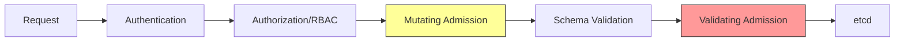
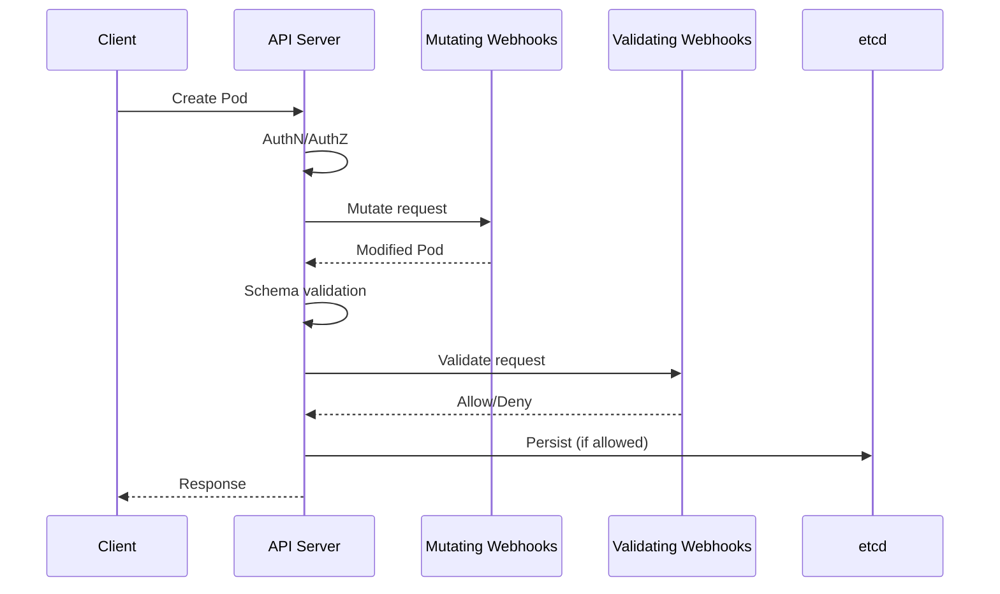

# 5.8.3 Admission Controllers: Validating and Mutating Requests

#### Why Admission Controllers Matter

Admission Controllers are the final gatekeepers before a request is persisted to etcd. They can:

- **Validate** – Reject requests that don't meet policy (e.g., no privileged containers)
- **Mutate** – Modify requests (e.g., inject sidecars, add labels)
- **Enforce security policies** – Block insecure workloads



This note covers built-in Admission Controllers, webhooks, and Pod Security Standards. Notes 5.8.1-5.8.2 covered authentication and RBAC.

**Backlinks:** [5.8.1 - Authentication](./5.8.1_Authentication_Methods.md) | [5.8.2 - RBAC](./5.8.2_RBAC_Deep_Dive.md) | [5.3.1 - Security Context](../Subchapter_5.3/5.3.1_Pod_Fundamentals_and_Lifecycle.md)

---

## Part 1: Admission Controller Architecture



### Types of Admission Controllers

| Type | Order | Purpose | Example |
|------|-------|---------|---------|
| **Mutating** | First | Modify requests | Inject sidecars, add labels |
| **Validating** | After mutating | Accept/reject requests | Block privileged pods |

---

## Part 2: Built-in Admission Controllers

### Enabled by Default (Key Controllers)

| Controller | Purpose |
|------------|---------|
| `NamespaceLifecycle` | Prevent operations in terminating namespaces |
| `LimitRanger` | Enforce LimitRange defaults |
| `ServiceAccount` | Auto-mount ServiceAccount tokens |
| `DefaultStorageClass` | Add default StorageClass to PVCs |
| `ResourceQuota` | Enforce namespace resource quotas |
| `PodSecurity` | Enforce Pod Security Standards |
| `MutatingAdmissionWebhook` | Call external mutating webhooks |
| `ValidatingAdmissionWebhook` | Call external validating webhooks |

### View Enabled Admission Controllers

```bash
# Check API server flags
kubectl get pods -n kube-system kube-apiserver-<master> -o yaml | grep enable-admission-plugins

# Or on the master node
ps aux | grep kube-apiserver | grep admission
```

### Enable/Disable Admission Controllers

```yaml
# kube-apiserver manifest
spec:
  containers:
  - command:
    - kube-apiserver
    - --enable-admission-plugins=NodeRestriction,PodSecurity
    - --disable-admission-plugins=AlwaysAdmit
```

---

## Part 3: Pod Security Standards (PSS)

Pod Security Standards replace the deprecated PodSecurityPolicy (PSP).

### Security Profiles

| Profile | Description | Use Case |
|---------|-------------|----------|
| **Privileged** | No restrictions | Trusted workloads, system pods |
| **Baseline** | Prevent known privilege escalations | Most workloads |
| **Restricted** | Highly restricted (security best practices) | Security-sensitive workloads |

### Enforce via Namespace Labels

```yaml
# namespace-with-pss.yaml
apiVersion: v1
kind: Namespace
metadata:
  name: secure-ns
  labels:
    # Enforce restricted profile
    pod-security.kubernetes.io/enforce: restricted
    pod-security.kubernetes.io/enforce-version: latest
    
    # Warn on baseline violations
    pod-security.kubernetes.io/warn: baseline
    pod-security.kubernetes.io/warn-version: latest
    
    # Audit privileged profile
    pod-security.kubernetes.io/audit: privileged
    pod-security.kubernetes.io/audit-version: latest
```

### PSS Modes

| Mode | Behavior |
|------|----------|
| `enforce` | Reject pods that violate policy |
| `warn` | Allow but show warning to user |
| `audit` | Allow but log in audit log |

### Baseline Profile Requirements

```yaml
# Pod that passes baseline
apiVersion: v1
kind: Pod
metadata:
  name: baseline-compliant
spec:
  containers:
  - name: app
    image: nginx
    securityContext:
      allowPrivilegeEscalation: false
      # No: privileged: true
      # No: hostNetwork: true
      # No: hostPID: true
      # No: hostIPC: true
```

### Restricted Profile Requirements

```yaml
# Pod that passes restricted
apiVersion: v1
kind: Pod
metadata:
  name: restricted-compliant
spec:
  securityContext:
    runAsNonRoot: true
    seccompProfile:
      type: RuntimeDefault
  containers:
  - name: app
    image: nginx
    securityContext:
      allowPrivilegeEscalation: false
      readOnlyRootFilesystem: true
      runAsNonRoot: true
      runAsUser: 1000
      capabilities:
        drop:
        - ALL
```

### Testing PSS Violations

```bash
# Try to create privileged pod in restricted namespace
kubectl run privileged-pod --image=nginx --privileged -n secure-ns
# Error: forbidden: violates PodSecurity "restricted:latest"

# Use dry-run to test
kubectl apply -f pod.yaml --dry-run=server -n secure-ns
```

---

## Part 4: Mutating Admission Webhooks

Mutating webhooks modify requests before validation.

### Common Use Cases

- **Sidecar injection** – Istio/Linkerd proxy injection
- **Default labels/annotations** – Add team, cost-center labels
- **Image registry rewriting** – Rewrite to internal registry
- **Resource defaults** – Add default CPU/memory requests

### Webhook Configuration

```yaml
# mutating-webhook-config.yaml
apiVersion: admissionregistration.k8s.io/v1
kind: MutatingWebhookConfiguration
metadata:
  name: sidecar-injector
webhooks:
- name: sidecar-injector.example.com
  admissionReviewVersions: ["v1"]
  sideEffects: None
  timeoutSeconds: 5
  
  clientConfig:
    service:
      name: sidecar-injector
      namespace: kube-system
      path: /mutate
    caBundle: LS0tLS1CRU...  # Base64 CA cert
  
  rules:
  - operations: ["CREATE"]
    apiGroups: [""]
    apiVersions: ["v1"]
    resources: ["pods"]
  
  namespaceSelector:
    matchLabels:
      sidecar-injection: enabled
  
  failurePolicy: Fail  # or Ignore
  reinvocationPolicy: IfNeeded
```

### Simple Mutating Webhook (Python Example)

```python
# webhook.py
from flask import Flask, request, jsonify
import base64
import json

app = Flask(__name__)

@app.route('/mutate', methods=['POST'])
def mutate():
    admission_review = request.get_json()
    pod = admission_review['request']['object']
    
    # Add label
    patches = []
    if 'labels' not in pod['metadata']:
        patches.append({
            "op": "add",
            "path": "/metadata/labels",
            "value": {}
        })
    patches.append({
        "op": "add",
        "path": "/metadata/labels/mutated",
        "value": "true"
    })
    
    # JSON Patch
    patch_bytes = json.dumps(patches).encode()
    
    return jsonify({
        "apiVersion": "admission.k8s.io/v1",
        "kind": "AdmissionReview",
        "response": {
            "uid": admission_review['request']['uid'],
            "allowed": True,
            "patchType": "JSONPatch",
            "patch": base64.b64encode(patch_bytes).decode()
        }
    })

if __name__ == '__main__':
    app.run(host='0.0.0.0', port=443, ssl_context=('cert.pem', 'key.pem'))
```

---

## Part 5: Validating Admission Webhooks

Validating webhooks accept or reject requests.

### Webhook Configuration

```yaml
# validating-webhook-config.yaml
apiVersion: admissionregistration.k8s.io/v1
kind: ValidatingWebhookConfiguration
metadata:
  name: pod-policy
webhooks:
- name: pod-policy.example.com
  admissionReviewVersions: ["v1"]
  sideEffects: None
  timeoutSeconds: 5
  
  clientConfig:
    service:
      name: pod-policy
      namespace: kube-system
      path: /validate
    caBundle: LS0tLS1CRU...
  
  rules:
  - operations: ["CREATE", "UPDATE"]
    apiGroups: [""]
    apiVersions: ["v1"]
    resources: ["pods"]
  
  failurePolicy: Fail
  matchPolicy: Equivalent
```

### Simple Validating Webhook (Python)

```python
# validate.py
from flask import Flask, request, jsonify

app = Flask(__name__)

@app.route('/validate', methods=['POST'])
def validate():
    admission_review = request.get_json()
    pod = admission_review['request']['object']
    
    # Check for required label
    labels = pod.get('metadata', {}).get('labels', {})
    if 'team' not in labels:
        return jsonify({
            "apiVersion": "admission.k8s.io/v1",
            "kind": "AdmissionReview",
            "response": {
                "uid": admission_review['request']['uid'],
                "allowed": False,
                "status": {
                    "code": 403,
                    "message": "Pod must have 'team' label"
                }
            }
        })
    
    # Check for privileged containers
    for container in pod.get('spec', {}).get('containers', []):
        security_context = container.get('securityContext', {})
        if security_context.get('privileged', False):
            return jsonify({
                "apiVersion": "admission.k8s.io/v1",
                "kind": "AdmissionReview",
                "response": {
                    "uid": admission_review['request']['uid'],
                    "allowed": False,
                    "status": {
                        "code": 403,
                        "message": f"Privileged containers not allowed: {container['name']}"
                    }
                }
            })
    
    return jsonify({
        "apiVersion": "admission.k8s.io/v1",
        "kind": "AdmissionReview",
        "response": {
            "uid": admission_review['request']['uid'],
            "allowed": True
        }
    })

if __name__ == '__main__':
    app.run(host='0.0.0.0', port=443, ssl_context=('cert.pem', 'key.pem'))
```

---

## Part 6: OPA Gatekeeper – Policy as Code

OPA (Open Policy Agent) Gatekeeper provides policy enforcement using Rego.

### Installing Gatekeeper

```bash
kubectl apply -f https://raw.githubusercontent.com/open-policy-agent/gatekeeper/v3.14.0/deploy/gatekeeper.yaml

# Verify
kubectl get pods -n gatekeeper-system
```

### Constraint Templates (Define Policy)

```yaml
# template-required-labels.yaml
apiVersion: templates.gatekeeper.sh/v1
kind: ConstraintTemplate
metadata:
  name: k8srequiredlabels
spec:
  crd:
    spec:
      names:
        kind: K8sRequiredLabels
      validation:
        openAPIV3Schema:
          type: object
          properties:
            labels:
              type: array
              items:
                type: string
  targets:
  - target: admission.k8s.gatekeeper.sh
    rego: |
      package k8srequiredlabels
      
      violation[{"msg": msg, "details": {"missing_labels": missing}}] {
        provided := {label | input.review.object.metadata.labels[label]}
        required := {label | label := input.parameters.labels[_]}
        missing := required - provided
        count(missing) > 0
        msg := sprintf("Missing required labels: %v", [missing])
      }
```

### Constraints (Apply Policy)

```yaml
# constraint-require-team-label.yaml
apiVersion: constraints.gatekeeper.sh/v1beta1
kind: K8sRequiredLabels
metadata:
  name: pods-must-have-team
spec:
  match:
    kinds:
    - apiGroups: [""]
      kinds: ["Pod"]
    excludedNamespaces:
    - kube-system
    - gatekeeper-system
  parameters:
    labels:
    - "team"
    - "env"
```

### Common Gatekeeper Policies

```yaml
# Block privileged containers
apiVersion: templates.gatekeeper.sh/v1
kind: ConstraintTemplate
metadata:
  name: k8sblockprivileged
spec:
  crd:
    spec:
      names:
        kind: K8sBlockPrivileged
  targets:
  - target: admission.k8s.gatekeeper.sh
    rego: |
      package k8sblockprivileged
      
      violation[{"msg": msg}] {
        c := input.review.object.spec.containers[_]
        c.securityContext.privileged == true
        msg := sprintf("Privileged container not allowed: %v", [c.name])
      }
      
      violation[{"msg": msg}] {
        c := input.review.object.spec.initContainers[_]
        c.securityContext.privileged == true
        msg := sprintf("Privileged init container not allowed: %v", [c.name])
      }
```

```yaml
# Require resource limits
apiVersion: templates.gatekeeper.sh/v1
kind: ConstraintTemplate
metadata:
  name: k8scontainerlimits
spec:
  crd:
    spec:
      names:
        kind: K8sContainerLimits
  targets:
  - target: admission.k8s.gatekeeper.sh
    rego: |
      package k8scontainerlimits
      
      violation[{"msg": msg}] {
        c := input.review.object.spec.containers[_]
        not c.resources.limits.cpu
        msg := sprintf("Container %v must have CPU limit", [c.name])
      }
      
      violation[{"msg": msg}] {
        c := input.review.object.spec.containers[_]
        not c.resources.limits.memory
        msg := sprintf("Container %v must have memory limit", [c.name])
      }
```

### Testing Gatekeeper Policies

```bash
# Test constraint
kubectl run test-pod --image=nginx
# Error: Missing required labels: {"team", "env"}

# Create compliant pod
kubectl run test-pod --image=nginx --labels="team=frontend,env=dev"
# pod/test-pod created

# Audit existing violations
kubectl get k8srequiredlabels pods-must-have-team -o yaml
# status.violations shows non-compliant resources
```

---

## Part 7: Kyverno – Kubernetes-Native Policies

Kyverno is an alternative to OPA that uses YAML instead of Rego.

### Installing Kyverno

```bash
helm repo add kyverno https://kyverno.github.io/kyverno/
helm install kyverno kyverno/kyverno -n kyverno --create-namespace
```

### Kyverno Policy Examples

```yaml
# Require labels
apiVersion: kyverno.io/v1
kind: ClusterPolicy
metadata:
  name: require-labels
spec:
  validationFailureAction: Enforce  # or Audit
  rules:
  - name: check-team-label
    match:
      any:
      - resources:
          kinds:
          - Pod
    validate:
      message: "The label 'team' is required."
      pattern:
        metadata:
          labels:
            team: "?*"
```

```yaml
# Add default labels (mutating)
apiVersion: kyverno.io/v1
kind: ClusterPolicy
metadata:
  name: add-default-labels
spec:
  rules:
  - name: add-labels
    match:
      any:
      - resources:
          kinds:
          - Pod
    mutate:
      patchStrategicMerge:
        metadata:
          labels:
            +(managed-by): kyverno
```

```yaml
# Block privileged containers
apiVersion: kyverno.io/v1
kind: ClusterPolicy
metadata:
  name: disallow-privileged
spec:
  validationFailureAction: Enforce
  rules:
  - name: disallow-privileged-containers
    match:
      any:
      - resources:
          kinds:
          - Pod
    validate:
      message: "Privileged containers are not allowed."
      pattern:
        spec:
          containers:
          - securityContext:
              privileged: "!true"
```

---

## Part 8: Troubleshooting Admission Controllers

### Debug Webhook Failures

```bash
# Check webhook configurations
kubectl get mutatingwebhookconfigurations
kubectl get validatingwebhookconfigurations

# Describe webhook
kubectl describe mutatingwebhookconfiguration sidecar-injector

# Check webhook pod logs
kubectl logs -n kube-system deployment/sidecar-injector

# Test webhook directly
kubectl run test --image=nginx --dry-run=server -o yaml
```

### Common Issues

| Error | Cause | Fix |
|-------|-------|-----|
| `connection refused` | Webhook service not running | Check service and endpoints |
| `context deadline exceeded` | Webhook timeout | Increase `timeoutSeconds` |
| `x509: certificate has expired` | Webhook cert expired | Renew certificate |
| `Internal error` | Webhook returned error | Check webhook logs |

### Disable Webhook Temporarily

```bash
# Set failurePolicy to Ignore
kubectl patch mutatingwebhookconfiguration sidecar-injector \
  --type='json' \
  -p='[{"op": "replace", "path": "/webhooks/0/failurePolicy", "value": "Ignore"}]'

# Or delete webhook (emergency)
kubectl delete mutatingwebhookconfiguration sidecar-injector
```

---

## Quick Task: Implement Pod Security Standards

1. Create a namespace with PSS "baseline" enforcement.
2. Try to create a privileged pod (should fail).
3. Create a compliant pod.
4. Change to "restricted" and see what additional requirements apply.

> **Ready Solution:**
> ```bash
> # Task 1: Create namespace with baseline
> cat <<EOF | kubectl apply -f -
> apiVersion: v1
> kind: Namespace
> metadata:
>   name: pss-test
>   labels:
>     pod-security.kubernetes.io/enforce: baseline
>     pod-security.kubernetes.io/warn: restricted
> EOF
> 
> # Task 2: Try privileged pod (fails)
> kubectl run priv --image=nginx --privileged -n pss-test
> # Error: violates PodSecurity "baseline:latest"
> 
> # Task 3: Compliant pod
> cat <<EOF | kubectl apply -f -
> apiVersion: v1
> kind: Pod
> metadata:
>   name: compliant
>   namespace: pss-test
> spec:
>   containers:
>   - name: nginx
>     image: nginx
>     securityContext:
>       allowPrivilegeEscalation: false
> EOF
> 
> # Task 4: Upgrade to restricted
> kubectl label ns pss-test pod-security.kubernetes.io/enforce=restricted --overwrite
> 
> # Now need runAsNonRoot, seccompProfile, drop capabilities
> cat <<EOF | kubectl apply -f -
> apiVersion: v1
> kind: Pod
> metadata:
>   name: restricted-compliant
>   namespace: pss-test
> spec:
>   securityContext:
>     runAsNonRoot: true
>     seccompProfile:
>       type: RuntimeDefault
>   containers:
>   - name: nginx
>     image: nginx
>     securityContext:
>       allowPrivilegeEscalation: false
>       runAsUser: 1000
>       capabilities:
>         drop: ["ALL"]
> EOF
> ```

---

## Summary Table: Admission Controllers

| Controller | Type | Purpose |
|------------|------|---------|
| **PodSecurity** | Built-in | Enforce Pod Security Standards |
| **LimitRanger** | Built-in | Enforce LimitRange defaults |
| **ResourceQuota** | Built-in | Enforce namespace quotas |
| **MutatingWebhook** | Custom | Modify requests |
| **ValidatingWebhook** | Custom | Accept/reject requests |
| **OPA Gatekeeper** | External | Policy as Code (Rego) |
| **Kyverno** | External | Policy as Code (YAML) |

### Pod Security Standards

| Profile | Privileged | hostNetwork | runAsRoot | Capabilities |
|---------|------------|-------------|-----------|--------------|
| **Privileged** | ✅ | ✅ | ✅ | All |
| **Baseline** | ❌ | ❌ | ✅ | Some |
| **Restricted** | ❌ | ❌ | ❌ | None |

### Webhook Failure Policies

| Policy | Behavior |
|--------|----------|
| `Fail` | Reject request if webhook fails |
| `Ignore` | Allow request if webhook fails |

---

**Next note (5.8.4)** will be the **Subchapter Review** for Authentication, Authorization, and Admission Control.

**Backlinks:** [5.8.1 - Authentication](./5.8.1_Authentication_Methods.md) | [5.8.2 - RBAC](./5.8.2_RBAC_Deep_Dive.md) | [5.3.1 - Security Context](../Subchapter_5.3/5.3.1_Pod_Fundamentals_and_Lifecycle.md)
